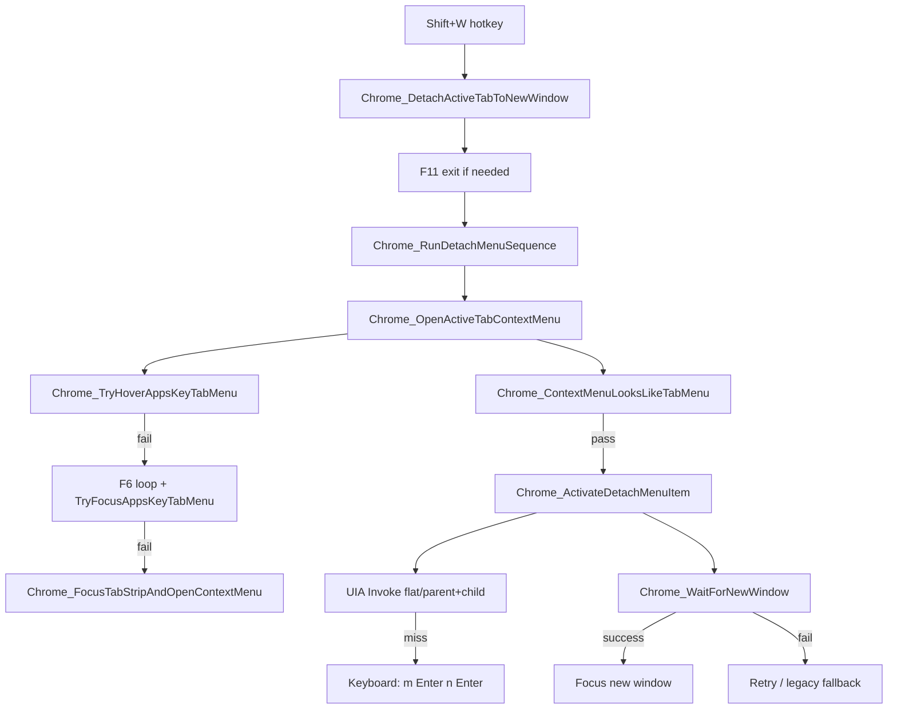

# Chrome Shift+W Tab Detach — Full Debug Handoff

**Session ID:** `79854f`  
**Debug log path:** `%TEMP%\debug-79854f.log` (fallback: `scripts\debug-79854f.log` next to `Utils.ahk`)  
**Status:** **NOT FIXED** — tab context menu can open visually, but detach still fails or hits the wrong menu.  
**Last updated:** 2026-06-06

---

## 1. Problem statement

**Shortcut:** `Shift+W` in Chrome (`#HotIf WinActive("ahk_exe chrome.exe")`)  
**Expected:** Detach the active tab to a new Chrome window (PT-BR: tab context menu → **Mover guia** → **Nova janela**).  
**Observed (user):**

1. Initially: **page** right-click menu opened instead of tab menu.
2. After hover+AppsKey work: **tab** context menu opens and user sees detach option.
3. Still broken: menu opens but **nothing detaches**; script keeps looping (F6 / hover / AppsKey retries) OR runs activation on the **wrong** menu.

**Test window:** `chrome.exe`, normal windowed mode (not F11), PT-BR Chrome UI. Example tab: Imovelweb listing, Google Gemini, etc.

---

## 2. Code map

| What                    | Where                                                                                                                    |
| ----------------------- | ------------------------------------------------------------------------------------------------------------------------ |
| Hotkey                  | `Shift keys.ahk` ~line **12564**: `+w:: { Chrome_DetachActiveTabToNewWindow() }`                                         |
| Main entry              | `Utils.ahk` `Chrome_DetachActiveTabToNewWindow()` ~line **1718**                                                         |
| Session / UIA           | `Chrome_DetachSessionCreate()` ~line **691**                                                                             |
| Tab resolution          | `Chrome_DetachGetActiveTab()` ~line **1061**                                                                             |
| Open tab menu           | `Chrome_OpenActiveTabContextMenu()` ~line **1486**                                                                       |
| Hover path (preferred)  | `Chrome_TryHoverAppsKeyTabMenu()` ~line **1266**                                                                         |
| F6 focus path           | `Chrome_OpenActiveTabContextMenuViaTabFocus()` ~line **1325**, `Chrome_FocusTabStripAndOpenContextMenu()` ~line **1410** |
| Menu validation         | `Chrome_ContextMenuLooksLikeTabMenu()` ~line **1137**                                                                    |
| Activation              | `Chrome_ActivateDetachMenuItem()` ~line **1532**                                                                         |
| Orchestration           | `Chrome_RunDetachMenuSequence()` ~line **1666**                                                                          |
| Debug harness           | `aux/Chrome_Detach_Debug.ahk` — `Ctrl+Alt+Shift+D` diagnose, `Ctrl+Alt+Shift+T` full detach                              |
| Plan file (do NOT edit) | `fix_chrome_detach_tab_5ffc6b30.plan.md`                                                                                 |

**UIA dependency:** `UIA-v2/Lib/UIA.ahk`, `UIA-v2/Lib/UIA_Browser.ahk`

---

## 3. Intended flow (mermaid)



**PT-BR menu path:** Tab context menu → **Mover guia** (submenu) → **Nova janela**  
**Keyboard fallback:** `m` → `Enter` → `n` → `Enter` (never bare `n` at top level — that is **Nova guia**).

**User constraint:** Prefer **hover + AppsKey** (context menu key). No mouse right-click, no drag-to-detach.

---

## 4. Timeline of debugging

### Phase 1 — Original symptom: page menu

- User pressed Shift+W on Imovelweb tab.
- **Page** context menu appeared (Back, Reload, Save as…), not tab menu.
- Root cause identified: blind `F6`×2 + context menu key while focus was on page content; also `"Recarregar"/"Reload"` wrongly used as tab-menu markers (page menu has Reload too).

### Phase 2 — Planned fix (implemented)

1. `ActivateChromiumAccessibility` + `GetCurrentMainPaneElement` in session create.
2. Better `Chrome_DetachGetActiveTab` (selection, title match; removed unsafe “last tab” fallback).
3. `Chrome_ContextMenuLooksLikeTabMenu` — tab markers vs page markers; reject page menu.
4. F6 loop with UIA-verified tab focus before AppsKey.
5. UIA Invoke first for detach item; keyboard fallback last.
6. Created `aux/Chrome_Detach_Debug.ahk`.

### Phase 3 — Still failing; debug mode added

- Instrumentation: `Chrome_DetachDebugLog` → `debug-79854f.log`
- Early logging failed silently: `Array.Join()` not available in user's AHK → fixed to `FileAppend`
- User feedback: hover works visually but AppsKey fired before focus settled → increased settle times, hover+AppsKey primary path
- Removed mouse right-click / drag paths per user request

### Phase 4 — Menu opens but no detach

- User: tab context menu opens, sees detach option, but script loops or does nothing.
- Logs showed: `not tab menu|sample=` (empty) → never reached `Chrome_ActivateDetachMenuItem`.

### Phase 5 — Popup detection + “trust hover” (latest code)

- Expanded popup detection beyond `#32768` to small `Chrome_WidgetWin_*` windows.
- Added UIA search in browser tree for tab menu items.
- **`session.tabMenuTrusted := true`** when hover+AppsKey used but validation fails — proceed without dismiss.
- `Chrome_ContextMenuSendKeys` falls back to `SendInput` when no popup hwnd.
- Fixed extra `}` syntax error in `Chrome_RunDetachMenuSequence`.

---

## 5. Runtime log evidence

### Log format

```
{tickCount}|{hypothesisId}|{location}|{message}|{extra}
```

Written by `Chrome_DetachDebugLog()` in `Utils.ahk` ~line **586**.

### Run A — Menu opens, validation fails, activation never runs

```
Chrome_TryHoverAppsKeyTabMenu | AppsKey after hover | focus=type=50004 name=Barra de endereço...
Chrome_TryHoverAppsKeyTabMenu | not tab menu | sample=
Chrome_OpenActiveTabContextMenuViaTabFocus | f6 step | i=1..6 focus=address bar / tab title / tab groups
(repeated TryHoverAppsKeyTabMenu | not tab menu | sample=)
Chrome_RunDetachMenuSequence | open menu failed | attempt=1
```

**Interpretation:**

| Hypothesis                              | Result        | Evidence                               |
| --------------------------------------- | ------------- | -------------------------------------- |
| **G** Popup hwnd not captured           | **CONFIRMED** | `sample=` always empty                 |
| **D** Validation fails → dismiss → loop | **CONFIRMED** | `not tab menu` then `open menu failed` |
| **E** Activation keys wrong target      | INCONCLUSIVE  | `ActivateDetachMenuItem` never logged  |

Focus during F6 often wrong: `type=50004` (address bar), `type=50019` (tab/document), `type=50000` (tab groups) — not `TabItem`.

### Run B — After “trust hover” fix (partial progress, likely still wrong)

```
Chrome_TryHoverAppsKeyTabMenu | AppsKey after hover | focus=type=50030 name=Google Gemini
Chrome_TryHoverAppsKeyTabMenu | trust hover AppsKey | popup=4129476;newWins=4129476:Chrome_WidgetWin_1@707x765|...
Chrome_ActivateDetachMenuItem | start | popup=4129476 sample=Voltar|Avançar|Recarregar|Salvar como|Imprimir|Transmitir
Chrome_ActivateDetachMenuItem | UIA miss, keyboard PT | (same page-menu sample);popupFocus=1
Chrome_ActivateDetachMenuItem | keyboard m+n enter | path=keyboardMN
Chrome_RunDetachMenuSequence | detach activated | attempt=1 activated=1
```

**Critical finding:** Activation **did run**, but UIA sample is the **PAGE menu** (Voltar, Salvar como, Imprimir), not tab menu (Nova guia, Mover guia, Fechar guia).

**Why this happened:**

1. `session.tabMenuTrusted := true` makes `Chrome_ContextMenuLooksLikeTabMenu()` return **true immediately** without checking menu content.
2. `Chrome_ContextMenuCapturePopup` grabbed hwnd `4129476` (`Chrome_WidgetWin_1@707x765`) which UIA reports as **page** menu.
3. User may see tab menu on screen while script captured/activated a **different** popup (or stale page menu window).
4. `Chrome_ActivateDetachMenuItem` **always returns `true`** after keyboard `m+n+Enter` even if detach didn't occur — `detach activated=1` is **not** proof of success. Real success = `Chrome_DetachActiveTabToNewWindow|finish|success=1` + new chrome window.

### Run A (earlier in same file) — first attempt before trust path on Imovelweb tab

```
focus=type=50030 name=Casa de 120 m² Alto do Mirante -
not tab menu | sample=
f6 steps 1-3 then log ends
```

---

## 6. Current constants (`Utils.ahk` ~529–561)

```ahk
CHROME_DETACH_MENU_POPUP_MS := 700
CHROME_DETACH_HOVER_APPSKEY_SETTLE_MS := 650
CHROME_DETACH_F6_FOCUS_MAX := 6
CHROME_DETACH_F6_STEP_MS := 300

; Tab menu markers (positive)
CHROME_DETACH_MENU_TAB_MARKER_NAMES := ["Nova guia", "New tab"]
CHROME_DETACH_MENU_TAB_MARKER_SUBSTR := ["Mover guia", "Move tab", "Fechar guia", "Close tab", "Duplicar guia", "Duplicate"]

; Page menu markers (negative)
CHROME_DETACH_MENU_PAGE_MARKER_NAMES := ["Voltar", "Back", "Avançar", "Forward"]
CHROME_DETACH_MENU_PAGE_MARKER_SUBSTR := ["Salvar como", "Save as", "Imprimir", "Print", ...]

; Detach targets
CHROME_DETACH_MENU_PARENT_NAMES := ["Mover guia para outra janela", "Mover guia para uma nova janela", "Move tab to another window"]
CHROME_DETACH_MENU_CHILD_NAMES := ["Nova janela", "New window"]
```

---

## 7. Key functions — behavior notes

### `Chrome_TryHoverAppsKeyTabMenu`

1. `Chrome_HoverActiveTab` — `MouseMove` to tab center (Y adjusted to tab bar).
2. Sleep 650ms.
3. `SendInput "{AppsKey}"` — Chrome uses **cursor hit-test** for menu type.
4. Capture popup; validate.
5. **Current:** if validation fails → sets `tabMenuTrusted := true` and returns `true` **without dismiss**.

**Problem:** Step 5 bypasses validation entirely. Can proceed while captured popup is page menu.

### `Chrome_ContextMenuLooksLikeTabMenu`

Returns `true` if:

- `session.tabMenuTrusted` is set (**immediate true, no content check**), OR
- popup hwnd + UIA tab markers / sample fallback, OR
- tab menu found in browser UIA tree, OR
- focused element looks like tab menu.

**Problem:** `tabMenuTrusted` short-circuit hides page-menu misdetection.

### `Chrome_ContextMenuCapturePopup`

Finds new windows vs baseline:

1. Class `#32768`
2. Small `Chrome_WidgetWin_*` chrome.exe windows (`Chrome_DetachWindowLooksLikeContextPopup`: 40–750 × 40–950 px)

**Problem:** May capture wrong `Chrome_WidgetWin_1` (page menu @ 707×765) while tab menu is a different hwnd or not exposed to UIA the same way.

### `Chrome_ActivateDetachMenuItem`

1. UIA Invoke on flat EN name or parent+child PT names.
2. Fallback: `m`, `Enter`, wait for child, `n`, `Enter`.
3. **Always returns `true` after keyboard path** — does not verify detach.

**Problem:** Running keyboard on page menu does nothing useful; function still reports success.

### `Chrome_DetachActiveTabToNewWindow`

Real success criteria: `Chrome_WaitForNewWindow(session.existingSet)` returns new hwnd.  
On failure: retry path, `Chrome_DetachCloseSpuriousNovaGuia` if accidental new tab.

---

## 8. Hypotheses still open

| ID    | Hypothesis                                                         | Status                                                            |
| ----- | ------------------------------------------------------------------ | ----------------------------------------------------------------- |
| **G** | Chrome tab menu is not `#32768`; wrong `Chrome_WidgetWin` captured | **CONFIRMED** partially — popup captured but wrong content        |
| **H** | Tab menu visible to user is not the hwnd UIA reads                 | **LIKELY** — user sees tab menu, log shows page menu sample       |
| **I** | `tabMenuTrusted` is too aggressive                                 | **LIKELY** — causes activation on wrong menu                      |
| **J** | Keyboard `m`/`n` sent to page menu, not tab menu                   | **CONFIRMED** in Run B sample                                     |
| **K** | `ActivateDetachMenuItem` return value lies                         | **CONFIRMED** — returns true without verify                       |
| **L** | F6 focus never lands on TabItem                                    | **CONFIRMED** in logs — address bar, tab groups, document         |
| **M** | Multiple chrome popups appear; we pick first new one, not tab menu | **LIKELY** — `newWins=4129476:...@707x765\|1968936:...@2326x1318` |

---

## 9. Recommended next steps (for stronger model)

### 9.1 Fix `tabMenuTrusted` (high priority)

- **Do not** return `true` from `LooksLikeTabMenu` solely on `tabMenuTrusted`.
- After hover+AppsKey, **enumerate all new popups** and pick the one whose UIA sample contains tab markers (`Mover guia`, `Nova guia`, `Fechar guia`).
- **Reject** any popup whose sample contains page markers (`Voltar`, `Salvar como`).
- If tab menu visible but no UIA match: try keyboard on **foreground** without wrong hwnd, or delay + re-sample.

### 9.2 Fix activation guard (high priority)

In `Chrome_ActivateDetachMenuItem` **before** keyboard fallback:

```ahk
if Chrome_ContextMenuFindInRoot(... PAGE markers ...) → return false, log "abort page menu"
```

Do not return `true` from keyboard path unless:

- UIA child found and invoked, OR
- `Chrome_WaitForNewWindow` succeeds (defer success to caller).

### 9.3 Popup selection algorithm

After AppsKey:

1. List all new `chrome.exe` popups (classes + sizes).
2. For each, `Chrome_DetachDebugSampleMenuItems` / page vs tab classification.
3. Set `session.menuPopupHwnd` to the **tab-menu** candidate only.
4. Log all candidates for debugging.

### 9.4 Hover path without wrong hwnd

If user sees tab menu but UIA fails:

- Keep menu open (no Escape).
- `SendInput` keys to **active** window (not `ControlSend` to wrong hwnd).
- Ensure `ClipAngel_ReleaseChordModifiersForSend()` before keys (Shift+W chord).

### 9.5 Consider legacy path as A/B test

`CHROME_DETACH_LEGACY_KEYS` / `Chrome_DetachActiveTabToNewWindow_Legacy()`:

```ahk
F6, F6, AppsKey, m, Enter, Enter
```

User said old blind F6 opened page menu — but hover+AppsKey opens tab menu. **Hybrid:** hover+AppsKey only (no F6), then legacy keys without popup validation.

### 9.6 Verification logging

Add/fix logs:

- `Chrome_DetachActiveTabToNewWindow|finish|success=0/1|newHwnd=...`
- Per-popup candidate: `hwnd, class, size, sample, classification`
- Never treat `detach activated=1` as success alone.

---

## 10. Files changed this session

| File                          | Changes                                                                                                                           |
| ----------------------------- | --------------------------------------------------------------------------------------------------------------------------------- |
| `Utils.ahk`                   | Entire Chrome detach section (~lines 529–1750): menu validation, hover+AppsKey, F6 loops, popup detection, trust path, debug logs |
| `aux/Chrome_Detach_Debug.ahk` | **Created** — step-by-step diagnostic harness                                                                                     |
| `Shift keys.ahk`              | **No changes** — hotkey wiring confirmed correct                                                                                  |
| `UIA-v2/`                     | Present in repo (untracked in git status at session start)                                                                        |

**Instrumentation:** Still active in `Utils.ahk` (`#region agent log`). **Do not remove** until user confirms fix.

---

## 11. How to reproduce

1. Reload `Shift keys.ahk`.
2. Open Chrome, normal window, PT-BR UI.
3. Focus a regular tab (Imovelweb, Gemini, etc.).
4. Press **Shift+W** once.
5. Read `%TEMP%\debug-79854f.log`.

**Optional:** Run `aux/Chrome_Detach_Debug.ahk`, focus Chrome, press `Ctrl+Alt+Shift+D` for staged ToolTip diagnosis.

---

## 12. User messages (paraphrased)

1. Shift+W not detaching Imovelweb tab — page menu or nothing.
2. After fixes: still not working; enter debug mode.
3. Hover works; use hover + AppsKey, no mouse clicks.
4. Tab context menu opens now, but no detach; script keeps looping.
5. Same: menu opens, doesn't proceed to detach.
6. **This message:** Document everything for model handoff.

---

## 13. Open questions

1. Does Run B actually create a new window sometimes, or always fail silently after `activated=1`?
2. Are **two** menus ever open (page + tab), or is tab menu non-UIA?
3. Does `Chrome_WidgetWin_1@707x765` match what user sees, or is it a hidden/stale popup?
4. Would **arrow keys** (`Down`×N + `Enter`) be more reliable than `m`/`n` accelerators on PT-BR Chrome?
5. Is Gemini side panel / tab groups layout affecting hover Y position on tab bar?

---

## 14. Quick reference — log lines to grep

| Line                              | Meaning                                        |
| --------------------------------- | ---------------------------------------------- |
| `tab menu confirmed`              | UIA validated tab menu on popup                |
| `tab menu sample fallback`        | Sample text matched tab markers                |
| `trust hover AppsKey`             | Validation skipped via trust flag              |
| `not tab menu \| sample=`         | No popup hwnd or empty UIA sample              |
| `open menu failed`                | Never opened validated menu                    |
| `ActivateDetachMenuItem \| start` | Activation reached — check `sample=`           |
| `sample=Voltar\|...`              | **PAGE menu** — wrong target                   |
| `sample=Nova guia\|Mover guia`    | **TAB menu** — correct target                  |
| `keyboard m+n enter`              | Keyboard fallback executed                     |
| `detach activated`                | Function returned true (**not** final success) |
| `finish \| success=1`             | Actual detach succeeded                        |

---

_End of handoff document._
