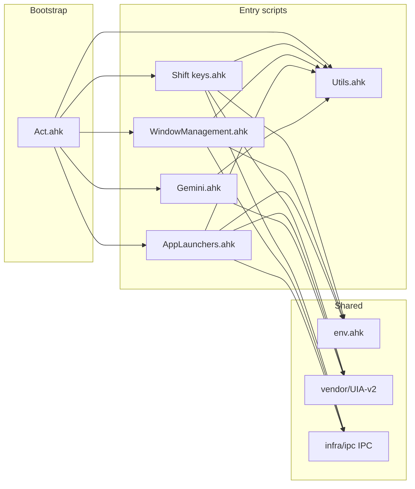

## Scripts Toolkit (AutoHotkey v2)

This repository is an AutoHotkey v2 scripts toolkit: multiple independent entry scripts (no single main script), shared utilities in `Utils.ahk`, UI Automation via the UIA-v2 library, and optional Python daemons for IPC. Scripts are typically launched by `Act.ahk` (bootstrap) or run separately. A local `env.ahk` (not in repo) is required for environment flags and script paths.

**Quick reference for AI agents:** To add a hotkey: (1) Choose the script by domain (see Hotkey allocation below). (2) Add `#Include` for env, Utils, and UIA libs if the script does not already have them. (3) Follow the hotkey philosophy and pattern guide below. (4) Use overlays/loading bar, not `MsgBox`. (5) Document in Folder Inventory and Updating This Guide.

### Philosophy

- Keep hotkeys predictable and memorable
  - Primary set: Shift+[Y U I O P H J K L N M , . W E R T D F G C V B]
  - When the Shift set is full, use Ctrl+Alt+Shift (MEH) in the same order
- Prefer resilient UI Automation (UIA) over pixel/image matching
- Fail safe: if automation fails, fall back to a native key/system action
- Avoid blocking popups; prefer overlays/banners and silent fallbacks

### Folder Inventory

- `Act.ahk` — Bootstrap: git pull (scripts + notes), then launches main scripts and environment-specific apps
- `Shift keys.ahk` — Global app shortcuts, UIA patterns, Spotify/ChatGPT/Gemini/Outlook/Teams/WhatsApp helpers; defines `WaitForButton()`
- `Utils.ahk` — Shared utilities: hotstrings, overlay/banner APIs, cursor centering, Peek PDF, Gemini prompt field helper, many MEH hotkeys
- `WindowManagement.ahk` — Window move/maximize/minimize, multi‑monitor cycling, cursor centering halo; includes WM IPC
- `AppLaunchers.ahk` — App launch, Wikipedia, Pomodoro, Cursor; includes AppLauncher IPC
- `Gemini.ahk` — Gemini-specific flows (prompt, copy, read aloud, model toggle)
- `Microsoft Teams.ahk` — Meeting/chat helpers, robust window activation, mic/camera state verification
- `Outlook.ahk` — Outlook helpers
- `Spotify.ahk` — Media and volume (state-aware focus/return); includes `lib/SpotifyWASAPI.ahk`
- `lib/GeminiToCursorBridge.ahk` — Copy-from-Gemini to Cursor (included by WindowManagement)
- `vendor/UIA-v2/` — UI Automation v2 library (`UIA.ahk`, `UIA_Browser.ahk`); see [vendor/UIA-v2/README.md](vendor/UIA-v2/README.md)
- `infra/ipc/` — IPC clients (WMIPC, AppLauncherIPC, ShiftKeysIPC) and harnesses

### Repository structure

**Directory tree (simplified):**

```
scripts/
├── Act.ahk, Shift keys.ahk, Utils.ahk, WindowManagement.ahk, AppLaunchers.ahk
├── Gemini.ahk, Microsoft Teams.ahk, Outlook.ahk, Spotify.ahk, mousemaster.ahk
├── env.ahk.example, README.md
├── AppLaunchers/, Gemini/, Shift keys/, Utils/, WindowManagement/  — module trees
├── lib/          — CopilotWeb.ahk, Media.ahk, GeminiToCursorBridge.ahk, SpotifyWASAPI.ahk, study/
├── assets/       — data/, sounds/, pictures/, prompt/, images/
├── infra/        — ipc/, python/, tools/, chrome/
├── vendor/       — UIA-v2/ (Lib/UIA.ahk, UIATreeInspector.ahk)
└── docs/         — Standards, context/, reference/; cheat-sheet, efficiency-canon, etc.
```

**Entry points and bootstrap:** `Act.ahk` is the bootstrap: it runs `git fetch`/`git pull` on the scripts folder and (optionally) a notes folder, then launches the main scripts via `GetScriptPath(scriptName)` (from env.ahk) and starts environment-specific apps. Each script runs as a **separate** AutoHotkey process. Scripts can also be run directly (e.g. from Explorer or shortcuts) without Act.

**Script inventory:**

| Script               | Purpose                                                              | Main includes                                         | Notes                                 |
| -------------------- | -------------------------------------------------------------------- | ----------------------------------------------------- | ------------------------------------- |
| Act.ahk              | Bootstrap, git pull, launch scripts                                  | env, Utils                                            | Requires `GetScriptPath()` in env.ahk |
| Shift keys.ahk       | Global shortcuts, UIA, Spotify/ChatGPT/Gemini/Outlook/Teams/WhatsApp | env, vendor/UIA-v2, Utils, infra/ipc/ShiftKeysIPC     | `WaitForButton()` defined here        |
| Utils.ahk            | Shared utilities, overlays, hotstrings, MEH hotkeys                  | env, vendor/UIA-v2                                    | Used by almost all scripts            |
| WindowManagement.ahk | Move/maximize/minimize, multi-monitor, cursor halo                   | env, lib/GeminiToCursorBridge, Utils, infra/ipc/WMIPC |                                       |
| AppLaunchers.ahk     | App launch, Wikipedia, Pomodoro, Cursor                              | env, vendor/UIA-v2, Utils, infra/ipc/AppLauncherIPC   |                                       |
| Gemini.ahk           | Gemini flows (prompt, copy, read aloud, model toggle)                | vendor/UIA-v2, env, Utils                             |                                       |
| Microsoft Teams.ahk  | Meeting/chat, mic/camera state                                       | env, vendor/UIA-v2, Utils                             |                                       |
| Outlook.ahk          | Outlook helpers                                                      | env, vendor/UIA-v2, Utils                             |                                       |
| Spotify.ahk          | Media, volume                                                        | env, Utils; lib/SpotifyWASAPI                         |                                       |

### Dependencies and environment

- **env.ahk (required, not in repo):** Copy from `env.ahk.example` on each machine. Must define `IS_WORK_ENVIRONMENT` (boolean). Scripts use it for paths and app sets (personal vs work). If you use `Act.ahk`, env.ahk must also define `GetScriptPath(scriptName)` returning a path or command to run that script (e.g. `GetScriptPath("Shift keys.ahk")`). env.ahk is listed in `.gitignore`. After `git pull`, diff your local `env.ahk` against `env.ahk.example` for new blocks.
- **Global AI provider:** Auto-selected via `IS_WORK_ENVIRONMENT` in `lib/CopilotWeb.ahk` — Gemini on personal, M365 Copilot web on work. Optional `COPILOT_WEB_*` URL/title overrides in env.ahk if your tenant differs. Do **not** define `UseCopilotWebForGlobalAI` or `GetGlobalAIProviderLabel` in env.ahk (they live in `lib/CopilotWeb.ahk`; duplicates break Act at startup).

**Checklist when switching machines or after `git pull`:**

1. `git pull` in the scripts repo on that machine.
2. `powershell -File infra\ipc\Verify-EnvAhk.ps1` (or let `Act.ahk` run it automatically before loading Utils).
3. Diff local `env.ahk` against `env.ahk.example` for new blocks.
4. Run `Act.ahk`.
5. Smoke test AI hotkeys (`#!+p` copy, `#!+o` read aloud): personal should use Gemini; work should use M365 Copilot web.

- **Utils.ahk:** Shared core for overlays (`StandardLoadingBar_*`, `ShowCenteredOverlay_Utils`), hotstrings, `FindGeminiPromptField`, path/config helpers, and many MEH hotkeys. See [docs/standard_information_display.md](docs/standard_information_display.md) for the banner/loading API and [docs/efficiency-canon.md](docs/efficiency-canon.md) for strategic guidelines.
- **UIA-v2:** [vendor/UIA-v2/README.md](vendor/UIA-v2/README.md). Use `UIA.ahk` and `UIA_Browser.ahk` for browser/window automation; no pixel/image matching for dynamic UIs.
- **WaitForButton:** The canonical implementation lives in **Shift keys.ahk** (not Utils). Scripts that need similar behavior can copy the pattern or implement a local variant (e.g. Gemini.ahk has `WaitForButtonAndShowSmallLoading`). The README patterns below reference `WaitForButton(root, pattern, timeout)`; use that signature when reimplementing.

### IPC and Python daemons

IPC is **optional** and controlled by feature flags in the aux modules. AHK clients live in `infra/ipc/`; when a daemon is unavailable or disabled, scripts fall back to legacy (in-process) behavior.

| Daemon             | Transport            | Purpose                                              | Protocol / entry                                        |
| ------------------ | -------------------- | ---------------------------------------------------- | ------------------------------------------------------- |
| wm_daemon          | Named pipe           | Window state, Cursor/Gemini window resolution        | infra/python/wm_protocol.py, wm_daemon.py               |
| applauncher_daemon | MMF + mutex + events | App launcher / window enumeration                    | infra/python/al_protocol.py, applauncher_daemon.py      |
| shiftkeys_daemon   | Named pipe           | Context (e.g. ChatGPT) for #HotIf, Gemini monitoring | infra/python/shiftkeys_protocol.py, shiftkeys_daemon.py |
| gemini_daemon      | (optional)           | Gemini-related offload                               | infra/python/gemini_daemon.py                           |

For **new hotkeys that only need AHK + UIA**, IPC is not required.

**Python daemon tests:** From the repo root, after `pip install -r infra/python/requirements.txt`, run `python -m pytest infra/python/tests` to verify IPC protocol encode/decode round-trips (no AHK or running daemons required). Daemons log each handled request as JSON lines on stderr via **structlog** ([infra/python/daemon_logging.py](infra/python/daemon_logging.py)).

### Hotkey allocation and where to add hotkeys

- **Primary set:** Shift+[Y U I O P H J K L N M , . W E R T D F G C V B]. When full, use **Win+Alt+Shift (MEH)** in the same order.
- **Domain → script:** Window management → WindowManagement.ahk. Gemini → Gemini.ahk. Spotify / ChatGPT / Outlook / Teams / WhatsApp → Shift keys.ahk. App launch, Wikipedia, Pomodoro, Cursor → AppLaunchers.ahk. Shared/global utilities, cursor halo, MEH misc → Utils.ahk. Cheat sheet: [docs/cheat-sheet.md](docs/cheat-sheet.md).

**Checklist for adding a hotkey:**

1. Choose the script by domain (see table above).
2. Add `#Include` for env, Utils, and UIA libs if the script does not already have them.
3. Follow UIA patterns (anchor, try/catch, tab strategy or WaitForButton-style).
4. Use overlays/loading bar, not `MsgBox`.
5. Use bounded timeouts and safe fallbacks.
6. Update this README (Folder Inventory and Updating This Guide) if you add a new automation.

### Configuration and data

- **assets/data/:** `settings.ini` (Utils), `wikipedia_scroll_positions.ini` (AppLaunchers, Shift keys), `peek_pdf.ini` (Utils), `Gemini_Prompt.txt` (Gemini), `pomodoro_log.csv` (AppLaunchers), `wikipedia_completed.csv`.
- **assets/sounds/:** `quick-update-success.wav`, `quick-update-failure.wav` — used for update feedback (e.g. Act or update scripts).

### Related documentation

- **docs/efficiency-canon.md** — Strategic guidelines and bottleneck taxonomy; AI agents should read before refactors; preserve behavior parity and use bounded timeouts.
- **docs/asynchronous_workflow_standards.md** — Submit → monitor → retrieve pattern; context retention and focus restoration.
- **docs/standard_information_display.md** — Banner and information display API (StandardLoadingBar, ShowCenteredOverlay_Utils), display categories, semantic colors.
- **docs/cheat-sheet.md** — ShiftKeys cheat sheet: authoring format, registry, search UI, and programmatic API.
- **docs/windowmanagement-daemon-verify.md** — WindowManagement daemon verification.



---

## Conventions and Building Blocks

### 1) UIA Anchoring Pattern

When targeting dynamic UIs, first find a robust “anchor” element, then navigate relative to it.

- Try several anchors in order of reliability
  - Example anchors: app title link, a stable button (with localized alternatives)
- Wrap each UIA query in its own try/catch so a failed search doesn’t abort the sequence
- Only if all fail, fall back to a generic element and proceed conservatively

Pseudo-steps:

1. `spot := UIA_Browser("ahk_exe App.exe")`
2. Try anchors A, B, C (each inside its own try/catch)
3. If none found, try first `Button`, then first `Text`, finally the first element
4. Proceed with navigation (tabbing, select, invoke) from the anchor

### 2) Disambiguating Many Identical Elements (Tab Strategy)

Use keyboard tabbing to locate the correct instance of a repeated control (e.g., many “Play” buttons).

- Select anchor → small `Sleep()` → send forward `{Tab}` steps
- After each tab, get `UIA.GetFocusedElement()` and inspect `Name` and `Type`
- Use case‑insensitive name matching and filter by control type (e.g., 50000 = Button)
- Bound the attempts (e.g., 6 tabs) and fall back to a safe system key if not found

This mirrors real keyboard navigation and avoids clicking the wrong instance.

#### Example: Spotify Shift+T (Play/Pause)

Challenge: Many elements named “Play”. The correct target is the transport Play button; playlist tiles also have Play.

Approach:

- Find a reliable anchor (e.g., “Enter Full screen” button or other stable element)
- Focus the anchor and tab forward up to 6 positions
- On each tab, check the focused element:
  - If `Name` equals "Play 01011001" and `Type` is 50000 → press Enter
  - Else if `Name` contains "play" (case‑insensitive) and `Type` is 50000 → press Enter
- If not found after 6 tabs, send `{Media_Play_Pause}` as a fallback

Why it works: Respects Spotify’s focus order and avoids ambiguous direct matches to tile play buttons.

### 3) Robust Window Activation (Teams)

Preserve window state and try multiple activation strategies:

- Read original min/max state; restore only if minimized
- Try `WinActivate` + wait, then `ShowWindow(SW_RESTORE)` + `SetForegroundWindow`, then `BringWindowToTop`
- Regex fallback on titles; last‑resort taskbar navigation
- Use non‑blocking overlays when states are unknown

### 4) State Verification via UIA (Mic/Camera)

- Prefer reading `ToggleState` when available
- Fallback to parsing action text in `Name` with multilingual patterns (EN/PT)
- Retry with small sleeps; keep total wait short

### 5) Visual Feedback without Blocking

- Use centered, timed overlay banners instead of modal `MsgBox`
- Keep operations silent; on failure, fall back gracefully

### 6) Fast Button Clicking Patterns

Choose the right pattern based on your use case: binary state toggles vs option selection.

#### 6a) State-Based Toggle (Binary States)

For functions that toggle between two mutually exclusive states where buttons represent opposite actions (e.g., recording vs sending, on vs off).

**Key principles:**

- Use a global boolean variable to track state between hotkey presses
- Use `WaitForButton()` with regex patterns to find the appropriate button based on state
- Requires if/else branching: searches for the "opposite" button based on tracked state
- Minimize delays: only small sleeps (100ms initial, 300ms after state change) for UI to settle
- Pattern-based matching allows flexible button name matching (localized, dynamic text)

**Why it works:**

- State persists between calls, so the function knows which button to target
- Direct button finding via `WaitForButton()` is faster than navigation or searching
- Minimal sleeps keep the toggle responsive while allowing UI to update

**Example:** WhatsApp voice message toggle (`ToggleVoiceMessage()`)

- Global `isRecording` tracks whether recording is active
- If `isRecording` is true → find and click "Send/Stop recording" button
- If `isRecording` is false → find and click "Voice message" button
- Update state after successful click
- Uses regex patterns like `"i)^(Voice message|Record voice message)$"` for flexible matching

#### 6b) Fast Single-Search Pattern (Option Selection)

For clicking one of multiple options where the same option can be selected multiple times (e.g., switching between modes, selecting settings).

**Key principles:**

- Use combined regex pattern to find ANY valid button in one search (e.g., `"i)^(Fast|Thinking)$"`)
- No if/else branching - click whichever button is found
- Update state AFTER clicking based on button name retrieved from the clicked element
- Prefer `Invoke()` when available, fallback to `Click()` for maximum compatibility
- Ultra-minimal delays: 100ms initial, 150ms after click

**Why it's faster:**

- Single `WaitForButton()` call instead of branching searches
- Shorter timeout (1500ms vs 2000-3000ms) since we're not waiting for specific state
- Eliminates state prediction errors - state syncs to reality after each click
- Handles cases where same option is clicked repeatedly without confusion

**Example:** Gemini model toggle (`ToggleGeminiModel()`)

- Global `isGeminiFastModel` tracks current model selection
- Combined pattern `"i)^(Fast|Thinking)$"` finds whichever button is visible
- Click the found button (could be same as last time)
- Update `isGeminiFastModel` based on button name after click
- 3x faster than position-based approaches, more robust than state-branching

**When to use Single-Search vs State-Based:**

- Same option can be clicked again → Single-Search (6b)
- Buttons are truly opposite actions → State-Based (6a)
- Unsure? → Try Single-Search first (faster and more forgiving)

### Choosing the Right Pattern - Decision Guide

```
Need to click a button in a web UI?
│
├─ Multiple identical elements with same name?
│  └─ Use Tab Strategy (Section 2)
│     Navigate from anchor, inspect focused element
│
├─ Binary toggle (on/off, recording/sending)?
│  └─ Use State-Based Toggle (Section 6a)
│     Track state, search for opposite button
│
├─ Selecting from options (same can be clicked again)?
│  └─ Use Fast Single-Search (Section 6b)
│     Combined pattern, click whatever is found
│
└─ Complex position-based requirement?
   └─ Try to avoid - use WaitForButton with patterns instead
      Position-based searches are slower and more fragile
```

**Quick reference:**

- **Tab Strategy**: Multiple "Play" buttons, need the right one
- **State-Based**: Recording ↔ Sending, Mute ↔ Unmute
- **Single-Search**: Fast/Thinking/Custom mode selection, settings options

---

## Patterns Library (Copy/Paste)

### Try‑Find with Fallbacks (per attempt try/catch)

```ahk
try elem := root.FindElement({ Name: "X", Type: "Button" })
catch elem := ""
if !elem {
    try elem := root.FindElement({ Name: "X", Type: 50000 })
    catch elem := ""
}
```

### Tab Navigation with Bounded Attempts

```ahk
anchor.Select()
Sleep 300
maxTabs := 6
found := false
loop maxTabs {
    try focused := UIA.GetFocusedElement()
    if (focused) {
        name := focused.Name
        type := focused.Type
        if (name = "Play 01011001" && type = 50000) {
            found := true
            break
        }
        if ((InStr(name, "play", false) || InStr(name, "tocar", false)) && type = 50000) {
            found := true
            break
        }
    }
    Send "{Tab}"
    Sleep 20
}
if found
    Send "{Enter}"
else
    Send "{Media_Play_Pause}"
```

### Center Cursor Halo (WindowManagement)

Use `#!+q` to centre the cursor on the active window and show a temporary halo for spatial orientation.

### Fast Single-Search Button Pattern (Option Selection)

```ahk
global currentOption := "Fast"  ; tracks last clicked option

ClickAnyOption() {
    global currentOption
    try {
        uia := UIA_Browser()
        Sleep 100

        ; Combined pattern finds ANY valid option in one search
        optionPattern := "i)^(Fast|Thinking|Custom)$"
        FindBtn(p) => WaitForButton(uia, p, 1500)

        if (btn := FindBtn(optionPattern)) {
            btnName := ""
            try btnName := btn.Name

            supportsInvoke := false
            try {
                supportsInvoke := btn.GetPropertyValue(UIA.Property.IsInvokePatternAvailable)
            } catch {
                supportsInvoke := false
            }

            clicked := false
            if (supportsInvoke) {
                try {
                    btn.Invoke()
                    clicked := true
                } catch {
                }
            }
            if (!clicked) {
                try {
                    btn.Click()
                    clicked := true
                } catch {
                }
            }

            if (clicked) {
                ; Update state based on what was actually clicked
                currentOption := btnName
                Sleep 150
            }
        }
    } catch Error as err {
        ; Silently fail if anything goes wrong
    }
}
```

**Performance benefits:**

- Single search: finds any valid button in one `WaitForButton()` call
- No branching: clicks whichever button is found immediately
- State syncs to reality: updates after successful click, not before
- Faster timeouts: 1500ms vs 2000-3000ms for state-based approaches
- Handles repeated selection: same option can be clicked multiple times

### State-Based Toggle with Quick Button Finding (Binary States)

Use this pattern for true binary state toggles (recording/sending, on/off). For option selection where the same choice can be clicked again, see "Fast Single-Search Button Pattern" above (Section 6b).

```ahk
global isRecording := false          ; persists between hotkey presses

ToggleVoiceMessage() {
    global isRecording

    try {
        chrome := UIA_Browser()
        Sleep 100                    ; minimal delay for UI to settle

        ; Pattern-based button finding for binary states
        voicePattern := "i)^(Voice message|Record voice message)$"
        sendPattern := "i)^(Send|Stop recording)$"
        FindBtn(p) => WaitForButton(chrome, p, 3000)

        if (isRecording) {           ; stop & send
            if (btn := FindBtn(sendPattern)) {
                btn.Click()
                isRecording := false
                Sleep 300            ; allow UI to restore after sending
            }
        } else {                     ; start recording
            if (btn := FindBtn(voicePattern)) {
                btn.Click()
                isRecording := true
            }
        }
    } catch Error as err {
        ; handle error
    }
}
```

**Performance benefits:**

- Fast execution: direct button finding, minimal sleeps
- State-aware: knows which button to target without checking UI state
- Resilient: pattern matching handles localized/dynamic button names

---

## Tips

- Keep sleeps small but sufficient (20–150ms for most operations, up to 300ms only for UI state transitions)
- Always bound loops (tabs, waits). Provide a safe fallback when exceeded
- Localize patterns (EN/PT) for names like "Share", "Microphone", etc.
- Avoid modal `MsgBox` in automations; prefer overlays or silent fallbacks
- Prefer `WaitForButton()` with patterns over position-based or anchor+tab approaches for speed

---

## Updating This Guide

When you add a new automation:

- Document the anchor(s) and why they are reliable
- Document the resolution strategy if multiple identical elements exist
- Note the fallback behavior and limits (e.g., 6 tabs → media key)
- Update **Folder Inventory** (and, if applicable, **Script inventory** and **Hotkey allocation**) when adding a new script or new hotkeys
