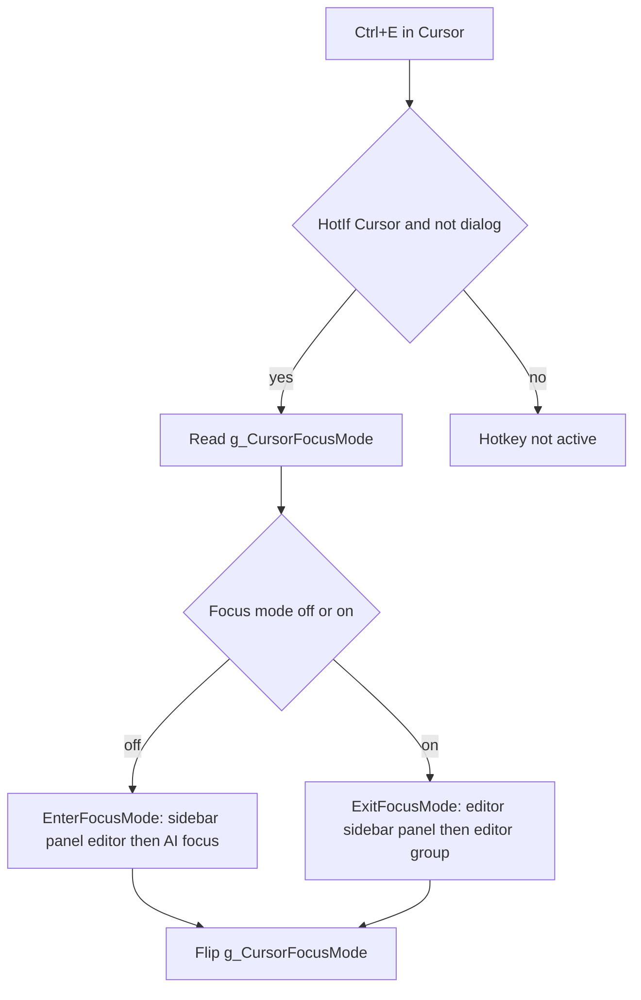

# Cursor IDE Ctrl+E — Junior AI brief and implementation notes

## Implementation constraints (pin for any follow-up work)

Target **AutoHotkey v2** only (`#Requires AutoHotkey v2.0+`). Use the project’s **UIA v2** include (`UIA-v2\Lib\UIA.ahk`). Do not introduce new libraries unless justified. The hotkey is gated with `#HotIf IsEditorActive() && WinGetClass("A") != "#32770"` so **Ctrl+E** runs only when **Cursor.exe** is active and the foreground window is not a modal dialog (`#32770`). Reuse helpers in [`Shift keys.ahk`](Shift%20keys.ahk) (e.g. `IsCursorMainEditorFocused()`, `FocusCursorFilesExplorer()`, `Cursor_FindElementByName()`). For raw UIA names and class hints, see [`cursor-ide-tree.md`](cursor-ide-tree.md).

---

## 1. State management

- **Primary:** Script-global `g_CursorFocusMode` toggled on each **Ctrl+E** after running the enter/exit sequences. `false` = normal layout (State A), `true` = AI reading layout (State B).
- **Limitation:** If the user changes sidebars/panel/editor manually, the flag can desync from the real UI. Recovery options (not required for v1): UIA probes (e.g. visibility of **Files Explorer** tree, **Toggle Panel** / **Toggle Primary Side Bar** control states, or `monaco-sash` layout) to resync before toggling.

---

## 2. Window targeting

- **Canonical gate:** `IsEditorActive()` → `WinActive("ahk_exe Cursor.exe")` combined with `WinGetClass("A") != "#32770"`.
- No extra `WinActive` checks are required inside the **Ctrl+E** handler unless branching on nested contexts.

---

## 3. Command sequences (implemented)

Commands assume default VS Code–compatible bindings in Cursor (**Ctrl+B** primary side bar, **Ctrl+J** panel). Confirm in **Keyboard Shortcuts** if your keymap differs.

| Direction | Steps |
|-----------|--------|
| **A → B** | `Ctrl+B` (hide Explorer), `Ctrl+J` (hide Terminal/panel), Command Palette **View: Toggle Editor Area Visibility**, then `Cursor_FocusAITextField()` from [`Utils.ahk`](Utils.ahk) (opens/focuses AI via UIA / `^i` fallback). |
| **B → A** | Command Palette **View: Toggle Editor Area Visibility** (show editor), `Ctrl+B`, `Ctrl+J`, Command Palette **Focus Active Editor Group**. |

Palette helper: `Cursor_RunCursorCommandPalette(query)` sends **Ctrl+Shift+P**, types `query`, **Enter**.

**Obsolete placeholder (removed):** The old **Ctrl+E** handler sent `^e`, `!+e`, two **Esc**, and `^i`. That sequence was tied to conflicting native Cursor bindings. It is replaced by `Cursor_ToggleFocusMode()` and does not map 1:1 to the new layout commands.

---

## 4. Editor / “hide code” workarounds (ranked)

1. **Toggle Editor Area Visibility** (command palette / `workbench.action.toggleEditorVisibility`) — primary approach used above; hides the main editor chrome when entering focus mode.
2. **Zen Mode** — in this repo, **Shift+Y** is remapped to send **Shift+Z** (Zen in Cursor); reduces clutter but does not specifically maximize AI; optional alternative only.
3. **UIA `monaco-sash` drag** — resize split between editor and AI to ~minimum width; fragile across Cursor updates but good if palette commands change.
4. **Accept “good enough”** — State B means *effectively* only AI-focused UI; a few pixels of editor or sash may remain.

Reference UIA labels from [`cursor-ide-tree.md`](cursor-ide-tree.md): **Toggle Primary Side Bar (Ctrl+B)**, **Toggle Panel**, **Toggle Agents**, **Change Layout**; class names include `monaco-sash vertical`, `sidebarvisible`, etc.

---

## 5. AHK script structure (as implemented)

- Helpers live **above** the Cursor `#HotIf` block: `Cursor_RunCursorCommandPalette`, `Cursor_EnterFocusMode`, `Cursor_ExitFocusMode`, `Cursor_ToggleFocusMode`.
- Hotkey: `^e::` calls `Cursor_ToggleFocusMode()` under `#HotIf IsEditorActive() && WinGetClass("A") != "#32770"`.
- Global: `g_CursorFocusMode` next to other Cursor GUI globals in the same `#HotIf` section.

---

## 6. Mermaid: toggle flow

