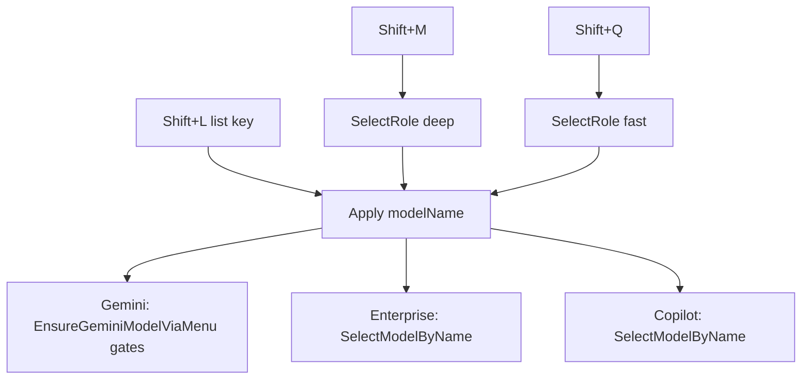

# AI companion models (Shift+M / Q / L)

Per-companion **Fast** and **Deep** model shortcuts, plus an editable model list, for:

- Consumer **Gemini** (personal)
- **Gemini Enterprise**
- **M365 Copilot** web

Cheat sheet entries live in [`Shift keys/cheat_sheet_registry.ahk`](../Shift%20keys/cheat_sheet_registry.ahk) (Gemini / Gemini Enterprise / Copilot Web sheets).

Related: [Global AI companion routing](global-ai-companion-routing.md).

## Shortcuts

| Chord       | Role                                                               |
| ----------- | ------------------------------------------------------------------ |
| **Shift+M** | Select **Deep** (from INI; no-op if already active when detectble) |
| **Shift+Q** | Select **Fast** / Quick (from INI)                                 |
| **Shift+L** | Open the model list manager for the **active** companion window    |

Same chords on all three companions (context `#HotIf`).

### Shift+L list UI

| Key                  | Action                                                                          |
| -------------------- | ------------------------------------------------------------------------------- |
| `1`–`9` then letters | Select / apply a listed model (`a`/`e`/`f`/`d` reserved)                        |
| Insert / `a`         | Add model — **one** InputBox for the exact UIA-visible name                     |
| `e` / Edit           | Edit focused row (model rename, or Fast/Deep when those rows are focused)       |
| Delete               | Remove focused **model** row (confirm); Fast/Deep rows are not deleted this way |
| `f` / `d`            | Set **Fast** / **Deep** name (InputBox; applied later by Shift+Q / Shift+M)     |
| Esc                  | Cancel                                                                          |

The modal uses Utility Shortcuts ListView chrome (`+AlwaysOnTop +ToolWindow`, Char-first ListView, Add/Edit/Delete/Close). Before any InputBox or delete confirm it is torn down (or owned) so prompts are not covered, then rebuilt afterward. Enter / double-click activate the focused row.

Letter/digit hotkeys are registered under a **cleared `HotIf`** with `$*` prefixes so they still fire while the modal GUI has focus (caller `#HotIf` would otherwise require Chrome+companion still active).

## Storage

[`assets/data/ai_companion_models.ini`](../assets/data/ai_companion_models.ini)

| Section            | Companion       |
| ------------------ | --------------- |
| `Gemini`           | Consumer Gemini |
| `GeminiEnterprise` | Enterprise      |
| `CopilotWeb`       | Copilot web     |

Keys per section:

- `Fast=` — exact UIA-visible label for Shift+Q
- `Deep=` — exact UIA-visible label for Shift+M (and Art flows that select Deep)
- `Models=` — pipe-separated extra list entries for Shift+L

**Persistence:** Fast/Deep are written as typed and are **not** rewritten on reload. The only automatic rename is list entry `Thinking level` → `Extended thinking` (obsolete toggle label). First-time empty sections still seed defaults from code.

## Apply paths

- **Consumer Gemini:** [`Utils/gemini_mode_picker.ahk`](../Utils/gemini_mode_picker.ahk) — open mode picker, find row, click (Invoke / mouse stack), verify picker label. Matching prefers the **exact INI string**; Flash is never treated as Flash-Lite. Verify accepts short picker labels (e.g. `Flash`, `Pro Extended`) when the **family** matches after a successful click.
- **Extended thinking:** list entry / toggle via `EnsureGeminiExtendedThinkingToggle` (legacy alias `EnsureGeminiThinkingLevelMenuOpen`).
- **Enterprise / Copilot:** select-by-name helpers; Deep can fall back to constants / needle scoring when INI is empty.

## File map

| File                                                                                    | Role                                                |
| --------------------------------------------------------------------------------------- | --------------------------------------------------- |
| [`Lib/AiCompanionModels.ahk`](../Lib/AiCompanionModels.ahk)                             | INI load/save, Fast/Deep/Models, Apply / SelectRole |
| [`Utils/ai_companion_model_selector.ahk`](../Utils/ai_companion_model_selector.ahk)     | Shift+L GUI + key loop                              |
| [`Utils/gemini_mode_picker.ahk`](../Utils/gemini_mode_picker.ahk)                       | Consumer Gemini menu find/click/verify gates        |
| [`Shift keys/gemini_chrome_01.ahk`](../Shift%20keys/gemini_chrome_01.ahk)               | Consumer Gemini `+m` / `+q` / `+l`                  |
| [`Shift keys/hotif_gemini_enterprise.ahk`](../Shift%20keys/hotif_gemini_enterprise.ahk) | Enterprise chords                                   |
| [`Shift keys/hotif_copilot_web.ahk`](../Shift%20keys/hotif_copilot_web.ahk)             | Copilot chords                                      |

Included from `Utils.ahk` after CopilotWeb / GeminiEnterprise (`#include` AiCompanionModels + ai_companion_model_selector).

## Practical tips

- Set Fast/Deep to the **exact** menu row name you see in UIA (e.g. `3.6 Flash`), not a shortened family guess.
- After editing INI by hand or changing shortcuts, reload **Shift keys.ahk** (loads Utils).
- If list keys seem dead, confirm you reloaded after the HotIf-clear fix; Esc-only working usually meant keys were still bound under the companion HotIf.
