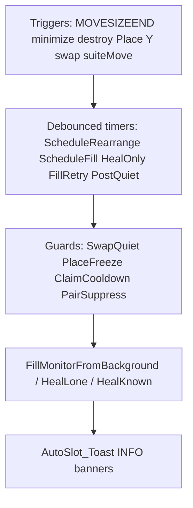

# AutoSlot rearrange — findings report (step 0)

**Audit date:** 2026-07-22  
**Method:** static code analysis only. No runtime logging, debug banners, or UI instrumentation was added to identify bugs.  
**Primary file:** [`AutoSlot/AutoSlot.ahk`](../../AutoSlot/AutoSlot.ahk) (~2894 lines)  
**Related call sites:** [`WindowManagement/tile_snap.ahk`](../../WindowManagement/tile_snap.ahk), [`move_monitor.ahk`](../../WindowManagement/move_monitor.ahk), [`window_tools.ahk`](../../WindowManagement/window_tools.ahk), [`hotkeys.ahk`](../../WindowManagement/hotkeys.ahk), [`minimized_list.ahk`](../../WindowManagement/minimized_list.ahk)

This document inventories problems and risks with **Windows rearrangement** (rearrange-on-move, fill-on-close, heal, explicit Y / menu fill, and their interaction with Place / swap). It does **not** fix them.

---

## Control flow

### Timing constants (relevant)

| Constant                         | Typical value | Role                                                               |
| -------------------------------- | ------------- | ------------------------------------------------------------------ |
| `AutoSlot_DEBOUNCE_MS`           | 250           | Place pending, heal-only, fill pending, first known-companion heal |
| `AutoSlot_FILL_RETRY_MS`         | 400           | Second known-companion heal; fill retry                            |
| `AutoSlot_REARRANGE_MS`          | 350           | Debounced `ProcessRearrange`                                       |
| `AutoSlot_FILL_COOLDOWN_MS`      | 1500          | `ClaimMonitor` / fill cooldown blocks background import            |
| `AutoSlot_RECENT_MS`             | 4000          | Place freeze duration; pair suppress default; recent map           |
| `AutoSlot_SWAP_QUIET_MS`         | 2500          | Default swap quiet window                                          |
| `AutoSlot_SWAP_PAIR_SUPPRESS_MS` | 3500          | Longer suppress after swap moves                                   |
| `AutoSlot_TOAST_DEBOUNCE_MS`     | 4000          | Suppress identical toast text only                                 |

### Entry points that schedule or run fill / rearrange

| Entry                                                     | Mechanism                                                                                                                                                 |
| --------------------------------------------------------- | --------------------------------------------------------------------------------------------------------------------------------------------------------- |
| `AutoSlot_OnMoveSizeEnd`                                  | `AutoSlot_ScheduleRearrange(hwnd)` when monitor change or became maximized                                                                                |
| `AutoSlot_OnMinimize`                                     | Heal known companion timer + `AutoSlot_ScheduleRearrange(hwnd)` (unless swap quiet)                                                                       |
| `AutoSlot_OnDestroy`                                      | Dual `AutoSlot_HealKnownCompanion` timers + `AutoSlot_ScheduleHealOnly` + `AutoSlot_ScheduleFill` (unless swap quiet) + late `AutoSlot_HealLoneCompanion` |
| `AutoSlot_MaximizeOnMonitor`                              | Optional `AutoSlot_ScheduleRearrange(hwnd)`                                                                                                               |
| Suite leave / after move                                  | `tile_snap.ahk` / `move_monitor.ahk` → `AutoSlot_ScheduleRearrange`                                                                                       |
| `AutoSlot_BeginSwapQuiet` → `AutoSlot_PostQuietRearrange` | `AutoSlot_RearrangeUnderfilled()` after quiet expires                                                                                                     |
| Explicit Y / `#!+w` **[3]** when AutoSlot ON              | `WM_WindowTools_OnTileBackground` → `AutoSlot_RunTileBackground` → `AutoSlot_FillMonitorFromBackground(monIdx, true)`                                     |
| Ctrl+6 / minimized list open                              | `AutoSlot_TryPlaceBackgroundHwnd`                                                                                                                         |
| New window                                                | `AutoSlot_ProcessPending` → `AutoSlot_Place` (empty-monitor-only maximize; no free-half SnapPair)                                                         |

Core workers:

- `AutoSlot_RearrangeUnderfilled` — loop ordinal monitors; call `AutoSlot_FillMonitorFromBackground` for empty or free-half
- `AutoSlot_FillMonitorFromBackground` — heal / SnapPair / maximize import from `WM_CollectBackgroundWindows` via `AutoSlot_PickBackgroundCandidate`
- `AutoSlot_HealLoneCompanion` / `AutoSlot_HealKnownCompanion` — maximize leftover companion

---

## Findings summary

| #   | Severity | Category        | One-line title                             |
| --- | -------- | --------------- | ------------------------------------------ |
| 1   | High     | Maintainability | God-module (~2.9k lines)                   |
| 2   | High     | Maintainability | Parallel fill / heal / rearrange pipelines |
| 3   | Medium   | Maintainability | Stale Place policy in file header          |
| 4   | Medium   | Maintainability | Duplicated heal maximize stacks            |
| 5   | High     | Race / timing   | Destroy arms many overlapping timers       |
| 6   | High     | Race / timing   | `ScheduleRearrange` last-exclude wins      |
| 7   | Medium   | Race / timing   | Claim cooldown blocks rearrange import     |
| 8   | Medium   | Race / timing   | SwapQuiet drops armed rearrange            |
| 9   | Medium   | Race / timing   | Four overlapping mute mechanisms           |
| 10  | Medium   | Race / timing   | MaximizeOnMonitor ↔ fill loop risk         |
| 11  | High     | Coupling        | Deep WindowManagement coupling             |
| 12  | High     | Coupling        | Suite move ↔ AutoSlot swap resonance       |
| 13  | Medium   | Coupling        | StandardLoadingBar contention              |
| 14  | Medium   | Coupling        | Scattered exclusion predicates             |
| 15  | High     | Verbosity       | Toast-per-fill-branch                      |
| 16  | Medium   | Verbosity       | Place always toasts                        |
| 17  | Low      | Verbosity       | Y progress bar + Fill toasts               |
| 18  | High     | Performance     | Occupancy + background scan cost           |
| 19  | Medium   | Performance     | `RunTileBackground` re-partitions          |
| 20  | Medium   | Performance     | Timer storm under burst moves              |
| 21  | Medium   | Policy          | Place vs Y vs rearrange inconsistency      |
| 22  | Medium   | Policy          | Silent heal vs toasted fill                |

---

## A. Architecture / maintainability

### 1. God-module — High / maintainability

- **Symbols:** entire [`AutoSlot/AutoSlot.ahk`](../../AutoSlot/AutoSlot.ahk)
- **Evidence:** Place, fill-on-close, rearrange-on-move, heal, snap-pair registry, F11 restore, foreground swap, undo modal, and toasts live in one ~2894-line include.
- **Why it hurts rearrange:** Changing rearrange guards (quiet / claim / suppress) risks Place, swap, or F11 paths; side effects are hard to localize.
- **Fix direction:** Split by concern (occupancy, fill/heal scheduler, place, swap/UI) behind a thin public API.

### 2. Parallel fill pipelines — High / maintainability

- **Symbols:** `AutoSlot_ScheduleFill`, `AutoSlot_ProcessFillPending`, `AutoSlot_ScheduleFillRetry`, `AutoSlot_ScheduleHealOnly`, `AutoSlot_ProcessHealOnly`, `AutoSlot_ScheduleRearrange`, `AutoSlot_ProcessRearrange`, `AutoSlot_PostQuietRearrange`, destroy-side heal timers
- **Evidence:** Multiple debounced entry points all eventually call `AutoSlot_FillMonitorFromBackground` and/or `AutoSlot_HealLoneCompanion` / `AutoSlot_HealKnownCompanion`, each with slightly different guard combinations (`FillCooldownActive`, `PlaceFreezeActive`, `SwapQuietActive`, `forceImport`).
- **Why it hurts rearrange:** A policy change (e.g. “never import during place freeze”) must be re-applied in several schedulers or one path silently diverges.
- **Fix direction:** One scheduler with typed reasons (destroy / move / post-quiet / explicit) and shared guard evaluation.

### 3. Stale Place header comment — Medium / maintainability

- **Symbols:** file header (placement steps 1–4); `AutoSlot_Place`
- **Evidence:** Header still describes origin/half 50/50 placement steps; `AutoSlot_Place` only maximizes onto the first empty ordinal, else `AutoSlot_MaximizeInPlace` (“Grid full”).
- **Why it hurts rearrange:** Future edits may “restore” free-half SnapPair on Place while rearrange/Y already own that policy — conflicting behavior.
- **Fix direction:** Rewrite header (and README tables) to match empty-only Place.

### 4. Duplicated heal maximize stacks — Medium / maintainability

- **Symbols:** `AutoSlot_HealKnownCompanion`, `AutoSlot_HealLoneCompanion`
- **Evidence:** Both try `WM_MaximizeHwndBackground` → `AutoSlot_MaximizeHwnd` → `WinMaximize`, then `PairSuppressMark` + `ClaimMonitor`.
- **Why it hurts rearrange:** Bugfixes to heal (ClipAngel skip, suppress duration) must be duplicated; drift recreates half-healed monitors that rearrange then re-imports.
- **Fix direction:** Single `AutoSlot_MaximizeCompanion(hwnd, monIdx)` helper.

---

## B. Race / timing / correctness risks

### 5. Destroy fires many overlapping timers — High / race

- **Symbols:** `AutoSlot_OnDestroy` (and shell destroy path into it)
- **Evidence:** On one destroy with a snap partner: `SetTimer(HealKnownCompanion, -DEBOUNCE)`, `SetTimer(HealKnownCompanion, -FILL_RETRY)`, `ScheduleHealOnly`, optionally `ScheduleFill`, plus late `HealLoneCompanion` at `FILL_RETRY + 200`.
- **Why it hurts rearrange:** Same monitor can be healed and filled concurrently; Claim/PlaceFreeze from one pass blocks or races the next; extra background imports or double maximizes.
- **Fix direction:** One destroy pipeline with ordered stages (unregister → heal partner → fill if still underfilled).

### 6. `ScheduleRearrange` last-exclude wins — High / race

- **Symbols:** `AutoSlot_ScheduleRearrange`, `g_AutoSlotRearrangePending`, `g_AutoSlotRearrangeExclude`, `AutoSlot_ProcessRearrange`
- **Evidence:** Each schedule overwrites a single exclude HWND and resets one timer. Rapid `MOVESIZEEND` / suite moves replace the exclude before process runs.
- **Why it hurts rearrange:** Occupancy for the wrong window is excluded (or a needed exclude is lost) → missed fill or fill treating the mover as free capacity.
- **Fix direction:** Queue excludes (set/list) or run rearrange without a single global exclude, deriving movers from a short-lived set.

### 7. Claim cooldown blocks rearrange import — Medium / race

- **Symbols:** `AutoSlot_ClaimMonitor`, `AutoSlot_FillCooldownActive`, `AutoSlot_RearrangeUnderfilled`, `AutoSlot_FillMonitorFromBackground` (`blockImport`)
- **Evidence:** Successful fill/heal stamps cooldown (~1500 ms). Empty-monitor branch in `RearrangeUnderfilled` skips when cooldown active; half branch still calls Fill, which may return `"noop"` under `blockImport`.
- **Why it hurts rearrange:** After filling one ordinal, other underfilled ordinals in the same burst window may stay empty until another trigger.
- **Fix direction:** Per-monitor claim that does not skip other ordinals’ empty fill in the same rearrange pass; or batch fill all underfilled before claiming.

### 8. SwapQuiet drops armed rearrange — Medium / race

- **Symbols:** `AutoSlot_ProcessRearrange`, `AutoSlot_SwapQuietActive`, `AutoSlot_BeginSwapQuiet`, `AutoSlot_PostQuietRearrange`
- **Evidence:** If quiet becomes active after rearrange was armed, `ProcessRearrange` clears pending and returns; catch-up is `PostQuietRearrange` only.
- **Why it hurts rearrange:** Early/inconsistent quiet clear (swap abort paths set `g_AutoSlotSwapQuietUntil := 0`) can leave underfilled slots empty until the next move/destroy.
- **Fix direction:** On quiet clear, always schedule one rearrange; never drop pending without arming post-quiet.

### 9. Four overlapping mute mechanisms — Medium / race

- **Symbols:** `AutoSlot_SwapQuietActive`, `AutoSlot_PlaceFreezeActive`, `AutoSlot_PairSuppressActive` / `PairSuppressMark`, `AutoSlot_ReplaceSkipActive`
- **Evidence:** Suite hotkeys call `BeginPlaceFreeze` + `BeginSwapQuiet`; fills mark pair suppress (~4s default, ~3.5s after swap); replace-skip blocks background picks unless `forceImport`.
- **Why it hurts rearrange:** Legitimate post-move fills are delayed or skipped; debugging “why didn’t it fill?” requires checking four independent clocks.
- **Fix direction:** Unify into one “rearrange mute until tick” with reason flags, or document a strict precedence matrix and enforce it in one gate function.

### 10. MaximizeOnMonitor ↔ fill loop risk — Medium / race

- **Symbols:** `AutoSlot_MaximizeOnMonitor` → `ScheduleRearrange`; fill paths that maximize then SnapPair; `PairSuppressMark` + `ClaimMonitor` in `FillMonitorFromBackground`
- **Evidence:** Mitigation exists (suppress + claim) after successful snaps. Toast debounce only suppresses **identical** message text within 4s (`AutoSlot_Toast`).
- **Why it hurts rearrange:** Any missed suppress mark recreates rearrange → fill → toast loops; different monitor labels (`M1` vs `M2`) bypass debounce.
- **Fix direction:** Treat self-triggered rearrange from fill as a no-op via a short “fill generation” token, not only per-HWND suppress.

---

## C. Coupling / resonance with other features

### 11. Deep WindowManagement coupling — High / coupling

- **Symbols:** `AutoSlot_PickBackgroundCandidate` → `WM_CollectBackgroundWindows`; snap via tile helpers; F11 / maximize WM helpers; background title excludes
- **Evidence:** Fill quality depends on WM enumeration and exclude lists staying aligned with `AutoSlot_IsExcludedExeOrTitle` / occupancy skip predicates.
- **Why it hurts rearrange:** WM exclude or Teams/dialog filters drift → rearrange promotes chrome/noise or refuses valid backgrounds.
- **Fix direction:** Single shared “eligible for AutoSlot slot” predicate used by both collector and AutoSlot.

### 12. Suite move ↔ AutoSlot swap resonance — High / coupling

- **Symbols:** `AutoSlot_TryForegroundSwap` from `tile_snap.ahk` / `move_monitor.ahk`; `AutoSlot_ScheduleRearrange` after leave; `BeginPlaceFreeze` / `BeginSwapQuiet` in `hotkeys.ahk`
- **Evidence:** Monitor chords both drive AutoSlot swap and schedule rearrange; quiet/freeze mute rearrange during the same user gesture.
- **Why it hurts rearrange:** Double-scheduling and mutual muting make outcomes depend on timing of quiet vs leave rearrange.
- **Fix direction:** One “suite move completed” hook that owns quiet + single post-move rearrange.

### 13. StandardLoadingBar contention — Medium / coupling

- **Symbols:** `AutoSlot_Toast` → `ShowCenteredOverlay_Utils`; `AutoSlot_ShowUndoModal` / swap `ShowWithKeys`; fill loading bar in `WM_WindowTools_OnTileBackground`
- **Evidence:** Shared overlay stack; toast Show+Hide(duration) can reset hide timers; interactive modals call `CloseKeysOverlay` / `Hide(0)`.
- **Why it hurts rearrange:** Rapid multi-monitor fills interrupt undo/swap prompts or leave banners looking stuck (historical class of bugs).
- **Fix direction:** Queue rearrange Information Only behind interactive overlays, or coalesce toasts (see finding 15).

### 14. Scattered exclusion predicates — Medium / coupling

- **Symbols:** `AutoSlot_IsExcludedExeOrTitle`, `AutoSlot_IsOccupancySkipExeOrTitle`, `AutoSlot_IsClipAngelHwnd`, `#32770` / Teams / PiP handling, WM background excludes
- **Evidence:** Different gates for place eligibility, occupancy, and background pick.
- **Why it hurts rearrange:** A window ignored for place can still occupy a slot for rearrange logic (or the reverse), producing unexpected fill/heal.
- **Fix direction:** Layered predicates: noise / never-move / never-count-as-occupant, applied consistently.

---

## D. Verbosity / UX efficiency

### 15. Toast-per-fill-branch — High / verbosity

- **Symbols:** `AutoSlot_FillMonitorFromBackground` (multiple `AutoSlot_Toast("ℹ️ Slot filled → …")`); `AutoSlot_Toast`
- **Evidence:** Every successful 50/50 or maximized fill branch toasts. Debounce only identical strings for `TOAST_DEBOUNCE_MS`.
- **Why it hurts rearrange:** Multi-monitor rearrange flashes several INFO banners; feels noisy and can contend with other suite UI (finding 13).
- **Fix direction:** One summary toast per rearrange/fill pass (“Filled N slot group(s)”), or suppress toasts when caller is rearrange (keep for explicit Y summary only).

### 16. Place always toasts — Medium / verbosity

- **Symbols:** `AutoSlot_Place` → `AutoSlot_Toast` for empty maximize and “Grid full — maximized”
- **Evidence:** Toast on every placed new window, including no-op-feeling grid-full path.
- **Why it hurts rearrange:** Place freezes + toasts coincide with subsequent rearrange/fill activity → banner storm on app launch.
- **Fix direction:** Toast only on successful empty-slot place; silent MaximizeInPlace; or shorter duration / coalesce with rearrange.

### 17. Explicit Y double feedback — Low / verbosity

- **Symbols:** `WM_WindowTools_OnTileBackground` loading bar; `AutoSlot_RunTileBackground` message; still `AutoSlot_Toast` inside `FillMonitorFromBackground` even with `forceImport`
- **Evidence:** Progress/result bar uses `BANNER_ACCENT_INFO`; Fill still emits per-slot toasts.
- **Why it hurts rearrange:** One user action produces bar + N toasts.
- **Fix direction:** `forceImport` path suppresses per-slot toast; rely on `RunTileBackground` summary / loading bar only.

---

## E. Performance / inefficiency

### 18. Occupancy + background scan cost — High / performance

- **Symbols:** `AutoSlot_RearrangeUnderfilled`, `AutoSlot_PartitionOccupancy`, `AutoSlot_OccupancyOnMonitor`, `AutoSlot_PickBackgroundCandidate` → `WM_CollectBackgroundWindows`
- **Evidence:** Per ordinal: partition (full occupancy walk). Per successful/attempted fill: may collect all background windows again.
- **Why it hurts rearrange:** One rearrange pass can re-enumerate the desktop many times under multi-monitor underfill.
- **Fix direction:** Snapshot occupancy once per pass; reuse one background candidate list (consume picks without re-scan).

### 19. `RunTileBackground` re-partitions — Medium / performance

- **Symbols:** `AutoSlot_RunTileBackground`
- **Evidence:** Builds empty/half lists with partition; before/after each half fill partitions again; Fill also partitions internally.
- **Why it hurts rearrange:** Explicit fill feels heavier than needed; same cost pattern as automatic rearrange.
- **Fix direction:** Trust Fill’s return value for heal vs fill accounting; avoid redundant before/after partitions where possible.

### 20. Timer storm under burst events — Medium / performance

- **Symbols:** `AutoSlot_OnMoveSizeEnd` → `ScheduleRearrange`; maximize / drag across monitors
- **Evidence:** Timer reset coalesces fires, but each `ProcessRearrange` still runs full ordinal scan + possible background collects (finding 18).
- **Why it hurts rearrange:** Interactive dragging/maximizing spikes CPU and can visibly hitch while occupancy/background work runs on the AHK thread.
- **Fix direction:** Longer coalesce under continuous move; defer background collect until occupancy shows underfill.

---

## F. Policy inconsistency (easy to misread as bugs)

### 21. Place vs Y vs rearrange — Medium / policy

- **Symbols:** `AutoSlot_Place` (empty only); `AutoSlot_TryPlaceBackgroundHwnd` / `RunTileBackground` / `RearrangeUnderfilled` / fill-on-close (free-half SnapPair allowed)
- **Evidence:** New opens never demax/split existing slotted windows; move/close/Y may import backgrounds into free halves.
- **Why it hurts rearrange:** Users see “new window stayed put,” then a later move/close suddenly rearranges — feels like a bug rather than intentional policy split.
- **Fix direction:** Document clearly in README + header; optionally one user-facing phrase when Place no-ops vs when rearrange fills.

### 22. Silent heal vs toasted fill — Medium / policy

- **Symbols:** `AutoSlot_HealLoneCompanion` / `HealKnownCompanion` (no toast); `FillMonitorFromBackground` (toast on import)
- **Evidence:** Companion maximize often silent; background import always announces.
- **Why it hurts rearrange:** Uneven signal of “rearrangement happening”; silent heals still move windows and can trigger further move events.
- **Fix direction:** Either silent fill when triggered by rearrange, or a single quiet “healing slots…” mode toast for both heal and fill in one pass.

---

## Out of scope for this report

- Implementing fixes
- Adding diagnostic output / debug banners to identify bugs
- Changing rearrange runtime behavior

Next work belongs in later steps listed in [`README.md`](README.md).
