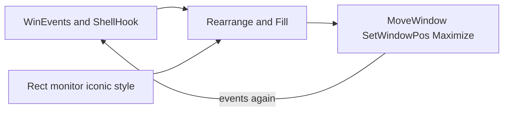

# Windows APIs that influence rearrange

**Scope only:** OS surfaces (WinEvents, shell hooks, query APIs, geometry/mutation APIs) that feed AutoSlot rearrange triggers, occupancy, fill picks, or snap geometry.

**Call sites:** [`AutoSlot/AutoSlot.ahk`](../../AutoSlot/AutoSlot.ahk), [`WindowManagement/tile_snap.ahk`](../../WindowManagement/tile_snap.ahk), [`WindowManagement/background_scan.ahk`](../../WindowManagement/background_scan.ahk).

Nothing else (banners, toast policy, module structure, general roadmaps).

---

## Feedback loop

---

## Event / hook layer (triggers)

| API / message                                                                        | Where / used for                                                                           | Risk                                                                          | Opportunity                                                                                                   |
| ------------------------------------------------------------------------------------ | ------------------------------------------------------------------------------------------ | ----------------------------------------------------------------------------- | ------------------------------------------------------------------------------------------------------------- |
| `SetWinEventHook` `EVENT_OBJECT_DESTROY`..`SHOW` (`0x8001`–`0x8002`)                 | `AutoSlot_Init` → `AutoSlot_OnWinEvent` → Place / destroy                                  | Chrome DESTROY/SHOW storms; overlaps Shell destroy                            | Keep `idObject` window filter + early `IsWindow` / style gates; avoid duplicate work when shell already armed |
| `SetWinEventHook` `EVENT_OBJECT_LOCATIONCHANGE` (`0x800B`)                           | `AutoSlot_OnLocationChange` — F11 exit / paired maximize                                   | High-frequency noise if branched too wide                                     | Stay narrowly branched (pair / F11 only)                                                                      |
| `SetWinEventHook` `EVENT_SYSTEM_MOVESIZEEND` (`0x000B`)                              | `AutoSlot_OnMoveSizeEnd` → `ScheduleRearrange`                                             | Fires after our own snap/move → rearrange re-entry                            | Coalesce with a fill-generation / self-mute token, not only per-HWND suppress                                 |
| `SetWinEventHook` `EVENT_SYSTEM_MINIMIZESTART` / `MINIMIZEEND` (`0x0016` / `0x0017`) | `AutoSlot_OnMinimize` — rearrange on minimize; JustRestored on end                         | `MINIMIZEEND` is restore, not minimize — wrong branch causes Place on restore | Keep JustRestored guard; never treat END as minimize                                                          |
| `RegisterShellHookWindow` + `RegisterWindowMessage("SHELLHOOK")`                     | `AutoSlot_OnShellHook` — `HSHELL_WINDOWCREATED` / `WINDOWDESTROYED` primary create/destroy | Duplicate destroy path vs WinEvent DESTROY                                    | Prefer shell as primary destroy; WinEvent as deduped secondary only                                           |

---

## Query / state layer (occupancy and candidates)

| API                                                                   | Where / influence                              | Risk                                                  | Opportunity                                        |
| --------------------------------------------------------------------- | ---------------------------------------------- | ----------------------------------------------------- | -------------------------------------------------- |
| `IsWindow`                                                            | Alive checks on destroy, heal, pick, occupancy | Zombie HWND races mid-destroy                         | Destroy cache + snap-partner fallback (already)    |
| `IsWindowVisible`                                                     | Occupancy / candidate visibility               | Invisible but “present” windows skew fill             | Align with background collector rules              |
| `GetParent`                                                           | Top-level only                                 | Owned popups counted if gate skipped                  | Always reject non-zero parent for occupancy        |
| `GetWindowLongPtr` (`GWL_EXSTYLE`, `-20`)                             | `WS_EX_TOOLWINDOW` skip                        | Chrome without TOOLWINDOW still enters rearrange      | Pair with title/exe exclude lists                  |
| `GetWindowRect`                                                       | Pane, monitor, snap geometry                   | Logical vs physical / shadow mismatch                 | Prefer DWM frame where WM already does             |
| `DwmGetWindowAttribute` (`DWMWA_EXTENDED_FRAME_BOUNDS`) via tile_snap | Visible frame for pane classify / snap         | Missing DWM → fall back to outer rect                 | Keep DWM path for end/right halves                 |
| `MonitorFromWindow`                                                   | HWND → monitor for occupancy / leave           | Edge straddling (esp. end halves) mis-assigns ordinal | Prefer window-center `MonitorFromPoint` for halves |
| `MonitorFromPoint`                                                    | Center / cursor → monitor                      | Wrong point (client vs screen)                        | Use consistent center-of-visible-frame             |
| `IsIconic`                                                            | Minimized detection in background scan         | Apps disagree with `WinGetMinMax`                     | Triple-check with placement + MinMax               |
| `GetWindowPlacement`                                                  | `showCmd` minimized                            | Stale placement after animate                         | Read after settle / debounce                       |
| `GetWindowThreadProcessId` + `GetCurrentProcessId`                    | Skip own process GUIs                          | Overlay still counted if PID gate skipped             | Always apply PID + class filters together          |
| `WinGetMinMax` (AHK → window show state)                              | Filled vs half; “became maximized” rearrange   | Transient state mid-maximize animation                | Act after MOVESIZEEND / debounce, not mid-animate  |

---

## Mutation layer (causes rearrange feedback)

| API                                                                                                        | Where / influence                          | Risk                                                   | Opportunity                                                           |
| ---------------------------------------------------------------------------------------------------------- | ------------------------------------------ | ------------------------------------------------------ | --------------------------------------------------------------------- |
| `MoveWindow`                                                                                               | AutoSlot move-to-rect; tile_snap snap/swap | Emits LOCATIONCHANGE / MOVESIZEEND → rearrange         | Mark PairSuppress + Claim before mutate; stronger self-mute           |
| `SetWindowPos`                                                                                             | tile_snap gapless place                    | Same event feedback; partial moves fire LOCATIONCHANGE | Batch flags (`SWP_NOSIZE` / `NOMOVE`) carefully; suppress around call |
| `ShowWindow` (e.g. `SW_SHOWNA`)                                                                            | Show without activate during snap          | Still can change z-order / visibility for collectors   | Avoid unnecessary show in fill path                                   |
| `WinMaximize` / restore / `WM_MaximizeHwndBackground`                                                      | Heal, Place, fill maximize                 | “Became max” path schedules rearrange again            | Suppress before maximize; Claim monitor after                         |
| DPI helpers (`GetDpiForWindow`, `GetDpiForMonitor`, `PhysicalToLogicalPointForPerMonitorDPI`) in tile_snap | Gapless SnapPair accuracy                  | DPI mismatch → failed SnapPair → heal/import thrash    | Treat DPI-aware snap as a hard dependency of fill quality             |

---

## Quick index by rearrange role

| Rearrange role              | Primary Windows surfaces                                                   |
| --------------------------- | -------------------------------------------------------------------------- |
| Arm Place                   | Shell `HSHELL_WINDOWCREATED`, WinEvent `SHOW`                              |
| Arm fill-on-close           | Shell `HSHELL_WINDOWDESTROYED`, WinEvent `DESTROY`                         |
| Arm rearrange-on-move       | WinEvent `MOVESIZEEND`; suite code that then calls `MoveWindow` / maximize |
| Arm minimize path           | WinEvent `MINIMIZESTART` / `MINIMIZEEND`                                   |
| Decide monitor / pane       | `GetWindowRect` / DWM frame, `MonitorFromPoint` / `MonitorFromWindow`      |
| Decide minimized background | `IsIconic`, `GetWindowPlacement`, `WinGetMinMax`                           |
| Perform fill/heal geometry  | `MoveWindow`, `SetWindowPos`, maximize APIs                                |
| Re-enter after self-move    | Same hooks listening to our mutations                                      |
