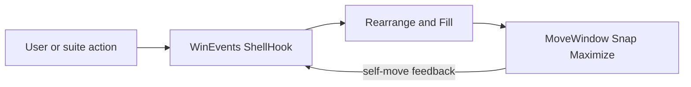

# Main risks of rearrange

Pinpoint list of the **main risks** of AutoSlot Windows rearrangement — layout breakage, feedback loops, or fights with suite moves.

Full inventory: [`00-findings-report.md`](00-findings-report.md). OS surfaces: [`02-windows-apis-influence.md`](02-windows-apis-influence.md). This file is risks only — no fixes, no behavior encyclopedia.

---

## Feedback shape

---

## Main risks

| #   | Risk                                       | Severity | Why it matters                                                                                                             | Primary symbols                                                                                    |
| --- | ------------------------------------------ | -------- | -------------------------------------------------------------------------------------------------------------------------- | -------------------------------------------------------------------------------------------------- |
| 1   | Self-move feedback                         | High     | Our `MoveWindow` / Snap / maximize emit `MOVESIZEEND` / location events → rearrange re-enters; historical fill/toast loops | `OnMoveSizeEnd`, `MaximizeOnMonitor`, `FillMonitorFromBackground`, `PairSuppressMark`              |
| 2   | Destroy timer pile-up                      | High     | One close arms dual known-heal + heal-only + fill + late lone-heal → races on the same monitor                             | `OnDestroy`, `HealKnownCompanion`, `ScheduleFill`, `ScheduleHealOnly`, `HealLoneCompanion`         |
| 3   | Single rearrange exclude overwrite         | High     | One global exclude HWND; rapid moves replace it before process → wrong occupancy or missed fill                            | `ScheduleRearrange`, `g_AutoSlotRearrangeExclude`, `ProcessRearrange`                              |
| 4   | Parallel fill / heal / rearrange pipelines | High     | Several schedulers with different guards call the same Fill/heal — policy drifts per path                                  | `ScheduleFill`, `ScheduleHealOnly`, `ScheduleFillRetry`, `ScheduleRearrange`, `PostQuietRearrange` |
| 5   | Claim cooldown starving other ordinals     | Medium   | Successful fill claims a monitor (~1.5s); other underfilled ordinals may skip import in the same burst                     | `ClaimMonitor`, `FillCooldownActive`, `RearrangeUnderfilled`                                       |
| 6   | Suite move ↔ swap quiet resonance          | High     | Monitor chords swap + quiet + rearrange; mute or double-schedule depending on timing                                       | `TryForegroundSwap`, `BeginSwapQuiet`, `BeginPlaceFreeze`, `ScheduleRearrange`                     |
| 7   | WM collector / exclude drift               | High     | Fill picks via `WM_CollectBackgroundWindows` + AutoSlot excludes; drift promotes noise or refuses valid windows            | `PickBackgroundCandidate`, `WM_CollectBackgroundWindows`, `IsExcludedExeOrTitle`                   |
| 8   | Toast / overlay contention                 | High     | Per-slot Fill toasts share StandardLoadingBar with undo/swap modals → interrupt or stuck-banner class                      | `AutoSlot_Toast`, `ShowUndoModal`, fill loading bar                                                |
| 9   | Occupancy + background re-scan cost        | High     | Each rearrange/fill re-walks occupancy and may re-collect backgrounds → hitch on burst moves                               | `RearrangeUnderfilled`, `PartitionOccupancy`, `PickBackgroundCandidate`                            |
| 10  | Place vs rearrange policy split            | Medium   | Place never free-half SnapPairs; close/move/Y can — feels like a bug when layout “suddenly” fills                          | `AutoSlot_Place` vs `RearrangeUnderfilled` / `RunTileBackground`                                   |

---

## Out of scope here

Medium/Low findings, opportunities, banner colors, and fix roadmaps — see [`00-findings-report.md`](00-findings-report.md) and the audit [`README.md`](README.md) planned fix steps.
