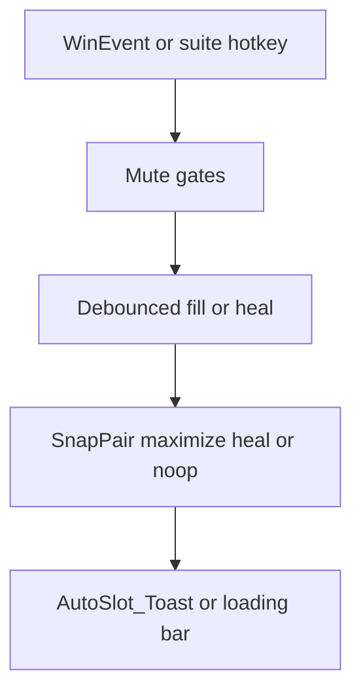

# How rearrange acts (as implemented)

**Purpose:** Describe how Windows rearrangement **acts today** — triggers, guards, outcomes, and banners — from the code path, not from desired design.

**Source of truth:** [`AutoSlot/AutoSlot.ahk`](../../AutoSlot/AutoSlot.ahk) and WindowManagement call sites.  
**Problems / risks:** see [`00-findings-report.md`](00-findings-report.md).  
**Accent convention:** rearrange Information Only / fill loading use `BANNER_ACCENT_INFO` ([`docs/standard_information_display.md`](../standard_information_display.md)).

This is a behavior map only. It does not propose fixes.

---

## Capacity model

- **2 slots per ordinal monitor**, up to `AutoSlot_MAX_ORDINAL` (4) → max **8** slots.
- A **lone maximized / work-area** window counts as **one filled slot**; the other half stays free for 50/50.
- Windows **hidden behind** a maximized window do not block “free half” / heal logic (`PartitionOccupancy` / `MonitorFreeHalfPartner`).
- **Clip Angel**, tool windows, desktop/taskbar, empty titles, and `AutoSlot_IsExcludedExeOrTitle` / occupancy-skip predicates are ignored or skipped so they do not drive rearrange.
- Multi-monitor only: if `MonitorGetCount() <= 1` or AutoSlot is OFF, place / fill / rearrange no-op.

---

## Event → pipeline → outcome

---

## Scenario map

| Scenario                                  | What fires                                                                                                                                                                 | Typical outcome                                                                                                         | What the user sees                                              |
| ----------------------------------------- | -------------------------------------------------------------------------------------------------------------------------------------------------------------------------- | ----------------------------------------------------------------------------------------------------------------------- | --------------------------------------------------------------- |
| **New window (Place)**                    | `ProcessPending` → `AutoSlot_Place`                                                                                                                                        | First empty ordinal → maximize there + claim + place freeze; else `MaximizeInPlace`. **No** free-half SnapPair on open. | INFO toast: `Auto-slotted → M…` or `Grid full — maximized`      |
| **Window close / destroy**                | Dual `HealKnownCompanion` timers (if snap partner); `ScheduleHealOnly`; `ScheduleFill` unless SwapQuiet; late `HealLoneCompanion`                                          | Partner maximized; empty/half monitor filled from background                                                            | INFO `Slot filled → M…` on import; heal often **silent**        |
| **Move / maximize end** (`MOVESIZEEND`)   | `ScheduleRearrange(mover)` if monitor changed or became max (not ClipAngel; not quiet / pair-suppress / place-freeze)                                                      | `RearrangeUnderfilled` on all ordinals; mover excluded from occupancy                                                   | Same fill toasts if import happens                              |
| **Minimize**                              | Unregister snap pair; forget mon; heal known companion; `ScheduleRearrange` unless SwapQuiet. Restore (`MINIMIZEEND`) arms JustRestored (no Place) and clears replace-skip | Companion heal + underfilled fill                                                                                       | Fill toasts if import; heal often silent                        |
| **Suite leave / `MaximizeOnMonitor`**     | `ScheduleRearrange` after move/max (ClipAngel skipped)                                                                                                                     | Same as rearrange-on-move                                                                                               | Fill toasts if import                                           |
| **Explicit Y / menu `[3]`** (AutoSlot ON) | `RunTileBackground` → `FillMonitorFromBackground(..., forceImport=true)` empty ordinals then halves                                                                        | Bypasses place freeze and claim cooldown; does not reshuffle full pairs                                                 | INFO loading bar + result; **also** per-slot Fill toasts        |
| **Ctrl+6 / list open**                    | `TryPlaceBackgroundHwnd`                                                                                                                                                   | Empty → maximize; free half → 50/50; else restore in place                                                              | INFO `Opened → M…` on success                                   |
| **Foreground swap**                       | `TryForegroundSwap` + SwapQuiet through modal; optional `[F]` replace-skip; `PostQuietRearrange`                                                                           | Layouts exchange; quiet blocks fill mid-swap; after quiet, underfilled fill                                             | Swap toast + Interactive `[F]` modal; then possible fill toasts |

### Fill / rearrange capacity actions (shared worker)

Once `FillMonitorFromBackground` runs (destroy fill, rearrange, or Y), underfilled monitors act roughly as:

| Occupancy (simplified)     | Action                                                                               |
| -------------------------- | ------------------------------------------------------------------------------------ |
| Truly empty                | Two backgrounds → 50/50; one → maximize (may then SnapPair a second)                 |
| Lone maximized (free half) | Background → 50/50 with residual                                                     |
| One non-filled half        | Heal maximize residual first; if heal fails and import allowed → SnapPair background |
| Two+ halves or two+ filled | No-op / stale                                                                        |

Already-visible windows are **not** moved between monitors on rearrange — only background promote and companion heal.

---

## Mute / quiet matrix

What each gate blocks when **active**:

| Gate              | Typical duration                                   | Blocks                                                                                | Still allows                                                             |
| ----------------- | -------------------------------------------------- | ------------------------------------------------------------------------------------- | ------------------------------------------------------------------------ |
| **SwapQuiet**     | ~2.5s default; longer around swap modal            | `ScheduleRearrange`, destroy `ScheduleFill`, minimize rearrange, move-end rearrange   | Known-companion heal timers on destroy; `PostQuietRearrange` after quiet |
| **PlaceFreeze**   | ~`RECENT_MS` (4s) after Place                      | Background **import** in Fill (`blockImport`); move-end rearrange while freeze active | Companion heal; explicit Y (`forceImport`)                               |
| **ClaimCooldown** | ~1.5s per monitor after claim/successful fill/heal | Background import on that monitor; empty-path skip in `RearrangeUnderfilled`          | Heal-only scheduling; Y `forceImport`                                    |
| **PairSuppress**  | ~4s default; ~3.5s after swap                      | Move-end / paired-max rearrange for marked HWNDs                                      | Other monitors; Y with unregister on forceImport                         |
| **ReplaceSkip**   | Until restore / minimize / TTL                     | Background pick of displaced windows after `[F]`                                      | Explicit Y (`forceImport` overrides)                                     |

Precedence in practice: SwapQuiet is checked early on many event hooks; Fill then applies PlaceFreeze + Claim as `blockImport` unless `forceImport`.

---

## Banner behavior

| Path                                                    | Banner                               | Accent                                  |
| ------------------------------------------------------- | ------------------------------------ | --------------------------------------- |
| `AutoSlot_Toast` (Place, fill slots, swap result, undo) | Information Only overlay ~1800 ms    | `BANNER_ACCENT_INFO`                    |
| Y / menu fill progress                                  | `StandardLoadingBar_Show` / `Update` | `BANNER_ACCENT_INFO` (errors: ERROR)    |
| Undo / swap key prompts                                 | `ShowWithKeys` Interactive Input     | Intermediate (result toasts still INFO) |
| Companion heal maximize                                 | Usually **no** toast                 | —                                       |

Identical toast text is debounced ~4s (`AutoSlot_TOAST_DEBOUNCE_MS`). Different monitor labels (e.g. M1 vs M2) are separate messages.

---

## Policy split (intentional as coded)

| Path                                       | Free-half SnapPair / demax existing slots?             |
| ------------------------------------------ | ------------------------------------------------------ |
| **Place** (new window)                     | **No** — empty maximize or maximize in place only      |
| **Y / rearrange / fill-on-close / Ctrl+6** | **Yes** — may 50/50 into a free half or heal companion |

So: a new window may stay on a full grid, while a later close/move/Y can still import backgrounds into free capacity. That is how it acts today; whether that feels consistent is covered in findings #21–22.

---

## Key symbols (quick index)

| Role               | Functions                                                                                                                  |
| ------------------ | -------------------------------------------------------------------------------------------------------------------------- |
| Schedule rearrange | `AutoSlot_ScheduleRearrange`, `AutoSlot_ProcessRearrange`, `AutoSlot_RearrangeUnderfilled`                                 |
| Fill / heal        | `AutoSlot_FillMonitorFromBackground`, `AutoSlot_ScheduleFill`, `AutoSlot_HealLoneCompanion`, `AutoSlot_HealKnownCompanion` |
| Explicit fill      | `AutoSlot_RunTileBackground`, `AutoSlot_TryPlaceBackgroundHwnd`                                                            |
| Place              | `AutoSlot_Place`, `AutoSlot_BeginPlaceFreeze`, `AutoSlot_ClaimMonitor`                                                     |
| Swap quiet         | `AutoSlot_BeginSwapQuiet`, `AutoSlot_PostQuietRearrange`, `AutoSlot_TryForegroundSwap`                                     |
| Toast              | `AutoSlot_Toast`                                                                                                           |
