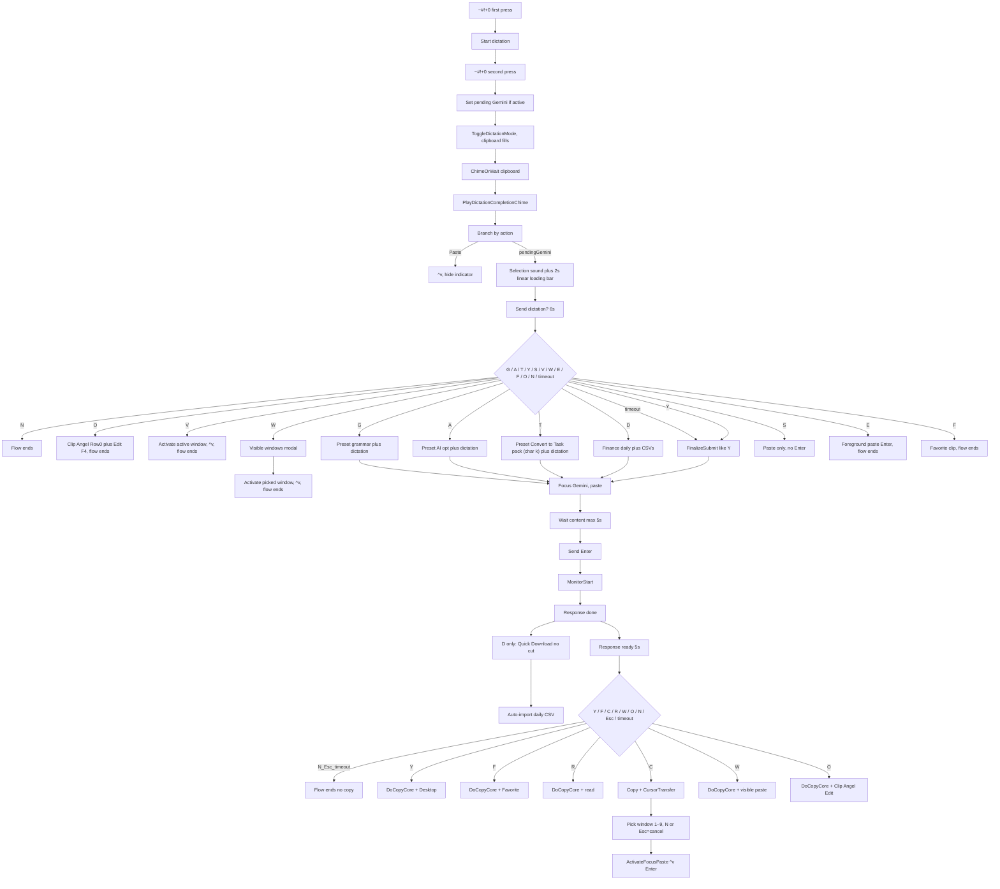

# Dictation → Companion AI → Cursor Flow

> **Companion routing:** At work the paste/submit target may be **Gemini Enterprise** or **M365 Copilot**, not only consumer Gemini. See [global-ai-companion-routing.md](global-ai-companion-routing.md). Banner labels use `{AI_PROVIDER}` / `GetGlobalAIProviderLabel()`.

1. **Start dictation** with **Win+Alt+Shift+0** (`~#!+0`).
2. **Finish dictating** (second press of `~#!+0` or stop manually).
3. **After dictation stops (Gemini path):** `dictation-selection-menu.wav` plays, then a **2-second** standard loading bar fills **linearly from 0% to 100%** (buffer against accidental keys), then **Send dictation?** appears.
4. **First banner — Send dictation?**  
   **Y** = paste and auto-send (Enter) to Gemini (uses your Clip Angel first snippet, same as before). **G** / **A** / **T** = Utility Shortcuts prompts by char (`1` grammar / `3` aiopt / **`k` Convert to Task pack** → `TASK_PACK.txt`) via Prompt Manager (metadata + optional context attach), plus dictated text, then auto-send. Legacy emoji-line **`mtask`** remains Prompts Char **`2`** (not on this menu). **D** = Finance daily (char `d` / `finance-daily-transactions.txt`) via Prompt Manager — applies `ExpectsDataOutput` / `DataOutputFormat` (injected DATA OUTPUT CONTRACT), attaches context CSVs, shows a Loading Indication while attaching and waiting until Send is enabled, then auto-sends (**send-only**; finish download/import manually). **S** = paste only to Gemini (no Enter). **V** = paste dictated text into the window active when **V** is pressed (**Ctrl+V**) and end the flow. **W** = open a **visible windows** modal: a fixed **4 monitors × 2 panes** grid (left-to-right monitor columns; row 0 = left/top pane, row 1 = right/bottom), live DWM previews, grid keys **A/S/D/F** (row 0) and **Z/X/C/V** (row 1) per monitor, extra windows below keyed **1, 2, 3…**, pick one, activate it, paste the OS clipboard (**Ctrl+V**), and end the flow. **O** = open Clip Angel with focus on the newest clip (Row 0), then open **Edit text** (**F4**, same as **Shift+E** when `Shift keys.ahk` Clip Angel hotkeys are active); flow ends. **B** = toggle Handy transcription model (Parakeet Unified EN ↔ Cohere Transcribe), re-transcribe the newest History entry, copy the corrected text to the clipboard, then re-open this menu. **N** = cancel (flow ends).  
   If no action is taken within 6 seconds, **Y** (yes) is selected by default—the same as pressing **Y** (first-snippet paste, not the **G**, **A**, **T**, or **D** preset path). When the script moves focus from the original window to Gemini to perform this paste, it first shows a **2-second “✋ Hands off!” pre-movement cue** so you can stop typing before the automated transition.

5. **If the flow sent your text to Gemini** (you chose **Y**, **G**, **A**, **T**, or let the first banner time out), after Gemini responds you see **Response ready — what next?** (same destination keys as `#\!+P` post-copy).  
   (**D** does not show this banner: send-only; finish manually.)  
   Each destination key **copies the reply first**, then runs the same action as `#\!+P`: **Y** = Desktop export, **F** = Favorite, **C** = Transfer to Cursor, **R** = Read aloud (omitted for Gemini Enterprise), **W** = Paste to a visible window, **O** = Clip Angel Edit, **N** / **Esc** / timeout = dismiss with **no** copy.  
   Pressing a destination key plays the 2-second **“✋ Hands off!”** cue before `DoCopyCore` (same as other copy paths).  
   If no action is taken within the menu timeout, the flow ends with **no** copy (aligned with `#\!+P`; not auto-copy).

Pressing **N** at any banner terminates the whole flow.

**Multi-monitor UI:** While **Send dictation?**, **Response ready**, the **visible-window paste picker** (**W**), or the **Transfer to Cursor** window picker is open, banners and the picker stay on the monitor that contains the **current foreground window**. If you switch focus to a window on another screen, the visible prompt moves to that monitor so it remains in view (implemented via `trackActiveMonitor` on standard bars and foreground-based placement for the Cursor selector in `Utils.ahk` / `Gemini.ahk`).

## High-level flow

## Instructions for AIB

- After paste + Enter into the selected Cursor window, the script waits briefly so Cursor can apply the paste and process Enter (`CURSOR_TRANSFER_POST_PASTE_BEFORE_ENTER_MS`, `CURSOR_TRANSFER_POST_ENTER_BEFORE_RESTORE_MS` in `Utils.ahk`) before **OS focus returns** to the **anchored window** from which the Transfer-to-Cursor picker was shown (`OriginHwnd` in `Utils.ahk`, `OriginalHwnd` in `Gemini.ahk`)—the window the user had when completing project/window selection for that step.
- **Do not** assume the user stays in the target Cursor chat window.
- Prefer **minimal** changes to automation code when adjusting this behavior; avoid broad refactors.

## Pre-movement cue behavior

- **When the cue plays**:
  - A 2-second pre-movement cue (sound + centered overlay \"✋ Hands off!\" warning) plays when the flow first moves focus from the original trigger window to Gemini (Original → Gemini) to submit the prompt.
  - The same 2-second cue also plays right before copying Gemini's last response when you press a destination key (**Y** / **F** / **C** / **R** / **W** / **O**) on **Response ready**. Timeout / **N** / **Esc** do **not** copy and do **not** play the cue.
- **When the cue does not play**:
  - **Returns** from Gemini or Cursor back to the original trigger window are **immediate** (no sound cue, no added delay).
  - Transitions between non-original windows (e.g., Gemini → Cursor during transfer) also run **without** the pre-movement cue.

These cues are synchronization guard rails that appear only when the script is about to take control of focus for a significant action (sending to Gemini or copying Gemini's response); they do **not** change which windows are ultimately activated or the order in which they are activated.

For a complete list of where Hand Off audio cues are used, see `docs/hand_off_warning_cues.md` (including **Win+Alt+Shift+7** TTS from selection, which skips the cue on the first move to Gemini for submit but plays it before the second move for read aloud after the response completes).

## Where the user can stop the flow

| Step | Banner                                 | Actions                                                                                                                                                                                                                                                                                                                                                                                                                                                                                                                                                                                                                                                                                                                                                                                                                                                                                                                                                                                                                                                                                                                                                                                                                                                                                                                                                                                                                                                                                                                                                                                                                                                                                                                        | Effect                                                                                                                                                                                                                                                                                                           |
| ---- | -------------------------------------- | ------------------------------------------------------------------------------------------------------------------------------------------------------------------------------------------------------------------------------------------------------------------------------------------------------------------------------------------------------------------------------------------------------------------------------------------------------------------------------------------------------------------------------------------------------------------------------------------------------------------------------------------------------------------------------------------------------------------------------------------------------------------------------------------------------------------------------------------------------------------------------------------------------------------------------------------------------------------------------------------------------------------------------------------------------------------------------------------------------------------------------------------------------------------------------------------------------------------------------------------------------------------------------------------------------------------------------------------------------------------------------------------------------------------------------------------------------------------------------------------------------------------------------------------------------------------------------------------------------------------------------------------------------------------------------------------------------------------------------ | ---------------------------------------------------------------------------------------------------------------------------------------------------------------------------------------------------------------------------------------------------------------------------------------------------------------- |
| 1    | **Send dictation?** (6s)               | **Y** or timeout = send (first snippet). **G** / **A** / **T** = Prompt Manager prompts by char (`1`/`3`/`2`) + dictated text, then send. **D** = Finance daily (char `d`) via Prompt Manager (data-output contract + context attach) + dictated text; waits for Send enabled, then send-only (no Copy response?; finish download/import manually). **S** = paste only (no Enter). **V** = paste dictated text into the window active when **V** is pressed (**Ctrl+V**) then end. **W** = pick a visible window from a **4×2 monitor/pane grid** (**A/S/D/F** + **Z/X/C/V**, overflow **1, 2, 3…**, live DWM previews); after pick, **Y** = paste+Enter, **Esc** = abort (restore this menu), timeout = paste only; then activate, paste OS clipboard (**Ctrl+V**), flow ends. **O** = open Clip Angel (Row 0), **Edit text** (**F4**), flow ends. **M** = prompt for Teams contact, jump to chat, paste dictated text (no Enter). **K** = activate Teams chat, focus composer (UIA), paste dictated text (no Enter). **Z** = prompt for WhatsApp contact, jump to chat, paste dictated text (no Enter). **P** = open Spotify, Ctrl+K search, paste dictated text, Enter, then Immersion (header Play + fullscreen). **R** = open Handy, switch to History, click Play on the last recording (Handy stays open). **B** = toggle Handy model Parakeet Unified EN ↔ Cohere Transcribe, re-transcribe newest History entry, copy corrected text to clipboard, then re-open this menu. **L** = email note (Outlook or Gmail, both inboxes), dictated text as Subject (not sent). **C** = new Chrome window, paste dictated text into the address bar, Enter, then open the first Google result (same as Shift+U). **N** = cancel. | N ends flow; O ends in Clip Angel editor; V/W/M/K/Z/P/R/L/C end flow after action; **B** continues (menu re-opens with updated clipboard); S = paste only (Gemini, no Enter); Y/timeout = paste + Enter; G/A/T = Prompt Manager preset + dictation + Enter then Copy response?; D = send-only (finish manually). |
| 2    | **Response ready — what next?** (5s)   | Same strip as `#\!+P`: **Y** Desktop, **F** Favorite, **C** Transfer, **R** Read (omit Enterprise), **W** Paste window, **O** Clip Angel, **N** / **Esc** / timeout = No. Each destination copies the reply first (`DoCopyCore`), then the destination action.                                                                                                                                                                                                                                                                                                                                                                                                                                                                                                                                                                                                                                                                                                                                                                                                                                                                                                                                                                                                                                                                                                                                                                                                                                                                                                                                                                                                                                                                 | N / Esc / timeout end with no copy. Destination keys copy then act.                                                                                                                                                                                                                                              |
| 3    | **Transfer to Cursor** (window picker) | **N** or **Esc** = cancel. **1–9** = paste to that window.                                                                                                                                                                                                                                                                                                                                                                                                                                                                                                                                                                                                                                                                                                                                                                                                                                                                                                                                                                                                                                                                                                                                                                                                                                                                                                                                                                                                                                                                                                                                                                                                                                                                     | Cancel = no paste to Cursor.                                                                                                                                                                                                                                                                                     |

## Hotkeys

| Hotkey                  | Role                                                                                                                                                                                                                                                                                                                                  |
| ----------------------- | ------------------------------------------------------------------------------------------------------------------------------------------------------------------------------------------------------------------------------------------------------------------------------------------------------------------------------------- |
| `~#!+0`                 | Start dictation (first press); stop dictation (second press). If stopped manually, sets “Send dictation?” path.                                                                                                                                                                                                                       |
| `Ctrl+Alt+Win+L`        | Direct paste+Enter to Gemini (no dictation).                                                                                                                                                                                                                                                                                          |
| `#!+L`                  | Paste OS clipboard (`^v`) to a picked visible window (same as D2C submit menu **[W]**). After pick: **Y** = paste + Enter, **Esc** = abort, ~3s timeout = paste only. Focuses a learned main text field when saved; otherwise prompts **Y**/**N** to persist the focused field. See [paste-field-mapping.md](paste-field-mapping.md). |
| `#!+U` then **L** twice | Same from hotstring selector.                                                                                                                                                                                                                                                                                                         |

## Files and entry points

- **Utils.ahk**: `~#!+0`, `DictationGeminiConfirm_*`, `GeminiDelayedSubmitFlow`, `GeminiFinalizeSubmit`, `Dictation_ShowVisiblePasteSelector`, `CursorTransfer_ShowWindowSelector`, `CursorTransfer_ActivateFocusPaste` (optional second arg restores focus to the anchored window after paste + Enter).
- **Gemini.ahk**: `GeminiDelayedSubmitMonitor` (response done detection), legacy “Copy response?” banner, Copy/Read/Transfer actions.
- **Utils/d2c_flow_manager.ahk**: D2C **Response ready** banner (`PromptForResponseAction`) aligned with `#\!+P` destinations.

## Related

- [paste-field-mapping.md](paste-field-mapping.md) — learn-and-persist main text field for `#!+L` / D2C **[W]**.
- [prompt-data-output-and-finance-packs.md](prompt-data-output-and-finance-packs.md) — Prompt Manager `ExpectsDataOutput` / `DataOutputFormat`, injected AIB delivery contract, finance/mnemonic `.txt` packs, import pipeline, partial-import AI fix recovery (`*_AI_FIX.txt` on Desktop). Send dictation **[D]/[G]/[A]/[T]** load prompts by char and honor that metadata (file vs code is not controlled by `.txt` body prose alone). Import Management **[J]** delegates to finance and palace imports.

## Happy path (no cancel)

