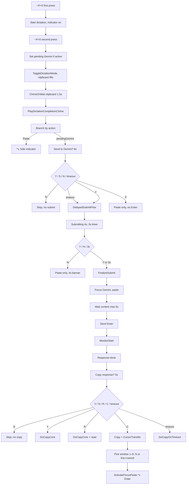
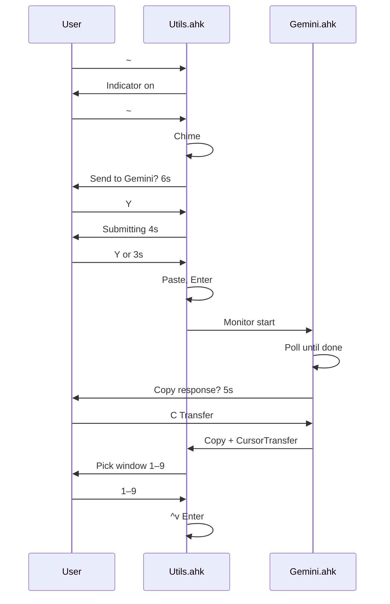

# Dictation → Gemini → Cursor Flow

Flow starting from **Win+Alt+Shift+0** (`~#!+0`) to dictate, optionally send transcription to Gemini, then optionally copy/transfer the response to Cursor. The user can **stop the flow at any moment** at the highlighted cancel points.

## High-level flow

On the 6s banner (step 1), **Y** = send (then 4s countdown, then paste + Enter; you can press N during 4s for paste-only). **S** = paste to Gemini only (no Enter, no 4s). **N** = cancel and show “Gemini submission cancelled”. **timeout** = same as Y. The 4s countdown is part of the send path, not a separate step.

## Where the user can stop the flow

| Step | Banner / moment                        | User action to stop                                                                                                                  | Effect                                                                                          |
| ---- | -------------------------------------- | ------------------------------------------------------------------------------------------------------------------------------------ | ----------------------------------------------------------------------------------------------- |
| 1    | **Send transcription to Gemini?** (6s) | **N**: cancel. **S**: paste only (no Enter). **Y** or **timeout**: send (4s countdown then paste + Enter; N during 4s = paste-only). | Flow ends at N; S = paste only; Y/timeout = proceed to paste + Enter (4s is part of this path). |
| 2    | **Copy response?** (5s)                | Press **N**                                                                                                                          | No copy, no read aloud, no transfer to Cursor.                                                  |
| 3    | **Transfer to Cursor** (window picker) | Press **N** or **Esc**                                                                                                               | Transfer cancelled; no paste/Enter to Cursor.                                                   |

## Hotkeys

| Hotkey                  | Role                                                                                                            |
| ----------------------- | --------------------------------------------------------------------------------------------------------------- |
| `~#!+0`                 | Start dictation (first press); stop dictation (second press). If stopped manually, sets “Send to Gemini?” path. |
| `Ctrl+Alt+Win+L`        | Direct delayed-submit flow (4s banner, paste + optional Enter to Gemini).                                       |
| `#!+U` then **L** twice | Same flow from hotstring selector (double-tap L in hotstring context).                                          |

## Files and entry points

- **Utils.ahk**: `~#!+0`, `DictationGeminiConfirm_*`, `GeminiDelayedSubmitFlow`, `GeminiFinalizeSubmit`, `GeminiCancelAutoSubmit`, `CursorTransfer_ShowWindowSelector`, `CursorTransfer_ActivateFocusPaste`.
- **Gemini.ahk**: `GeminiDelayedSubmitMonitor` (completion detection, “Copy response?” banner, Copy/Read/Transfer actions).

## Simplified “happy path” (no cancel)

