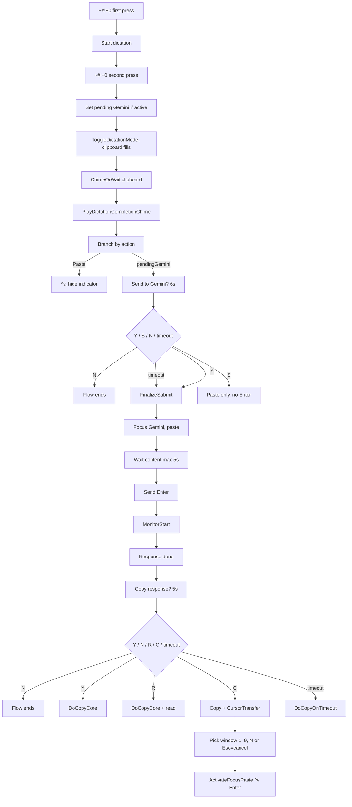
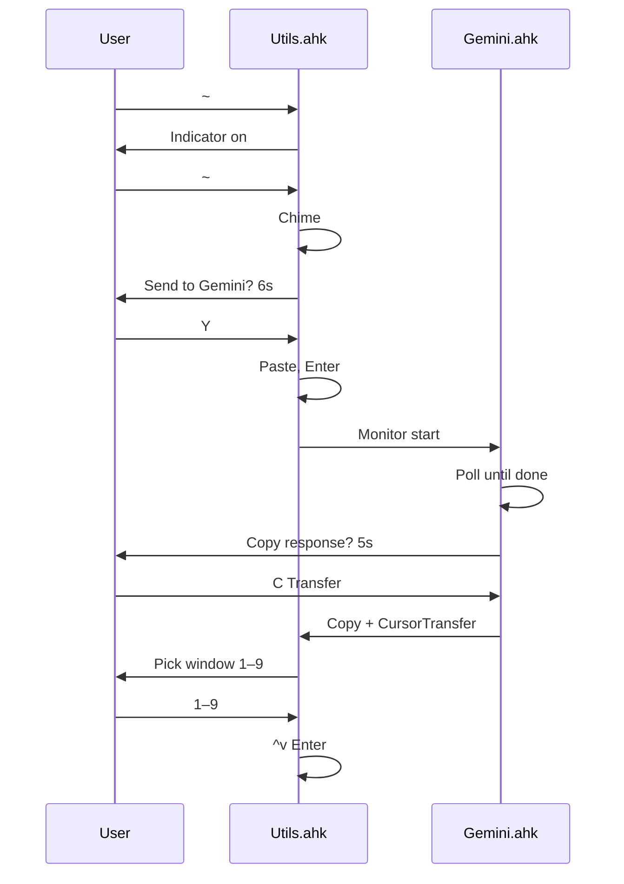

# Dictation → Gemini → Cursor Flow

1. **Start dictation** with **Win+Alt+Shift+0** (`~#!+0`).
2. **Finish dictating** (second press of `~#!+0` or stop manually).
3. **First banner — Send to Gemini?**  
   **Y** = paste and auto-send (Enter) to Gemini. **S** = paste only (no Enter). **N** = cancel (flow ends).  
   If no action is taken within 6 seconds, **Y** (yes) is selected by default. When the script moves focus from the original window to Gemini to perform this paste, it first shows a **2-second “✋ Hands off!” pre-movement cue** so you can stop typing before the automated transition.
4. **If you chose Y**, after Gemini responds you see **Copy response?**  
   **Y** = copy. **C** = send to Cursor. **R** = read aloud. **N** = cancel (flow ends).  
   If no action is taken within 6 seconds, **N** (no) is selected by default and `DoCopyOnTimeout` may still copy Gemini's response in the background **without an additional “Hands off” cue**, because the flow is already operating in Gemini rather than jumping away from the original window.

Pressing **N** at any banner terminates the whole flow.

## High-level flow

## Pre-movement cue behavior

- **When the cue plays**:  
  - A 2-second pre-movement cue (sound + centered overlay \"✋ Hands off! Moving to Gemini...\") plays **only once**, when the flow first moves focus from the original trigger window to Gemini (Original → Gemini).
- **When the cue does not play**:  
  - **Returns** from Gemini or Cursor back to the original trigger window are **immediate** (no sound cue, no added delay).  
  - Transitions between non-original windows (e.g., Gemini → Cursor during transfer) also run **without** the pre-movement cue.

The cue is purely a synchronization guard rail for the first automated jump away from the window where the user initiated the flow; it does **not** change which windows are ultimately activated or the order in which they are activated.

## Where the user can stop the flow

| Step | Banner                                 | Actions                                                                       | Effect                                                                              |
| ---- | -------------------------------------- | ----------------------------------------------------------------------------- | ----------------------------------------------------------------------------------- |
| 1    | **Send to Gemini?** (6s)               | **Y** or timeout = send. **S** = paste only. **N** = cancel.                  | N ends flow; S = paste only; Y/timeout = paste + Enter, then Copy response? banner. |
| 2    | **Copy response?** (5s)                | **Y** = copy. **C** = transfer to Cursor. **R** = read aloud. **N** = cancel. **Timeout** = DoCopyOnTimeout. | N ends flow. Y/C/R/timeout perform their action.                                    |
| 3    | **Transfer to Cursor** (window picker) | **N** or **Esc** = cancel. **1–9** = paste to that window.                    | Cancel = no paste to Cursor.                                                        |

## Hotkeys

| Hotkey                  | Role                                                                                                            |
| ----------------------- | --------------------------------------------------------------------------------------------------------------- |
| `~#!+0`                 | Start dictation (first press); stop dictation (second press). If stopped manually, sets “Send to Gemini?” path. |
| `Ctrl+Alt+Win+L`        | Direct paste+Enter to Gemini (no dictation).                                                                    |
| `#!+U` then **L** twice | Same from hotstring selector.                                                                                   |

## Files and entry points

- **Utils.ahk**: `~#!+0`, `DictationGeminiConfirm_*`, `GeminiDelayedSubmitFlow`, `GeminiFinalizeSubmit`, `CursorTransfer_ShowWindowSelector`, `CursorTransfer_ActivateFocusPaste`.
- **Gemini.ahk**: `GeminiDelayedSubmitMonitor` (response done detection), “Copy response?” banner, Copy/Read/Transfer actions.

## Happy path (no cancel)

