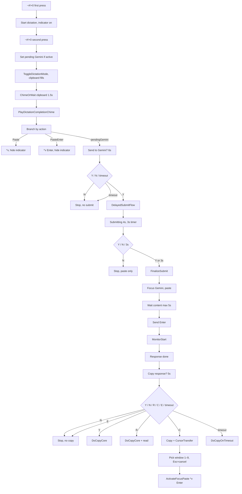
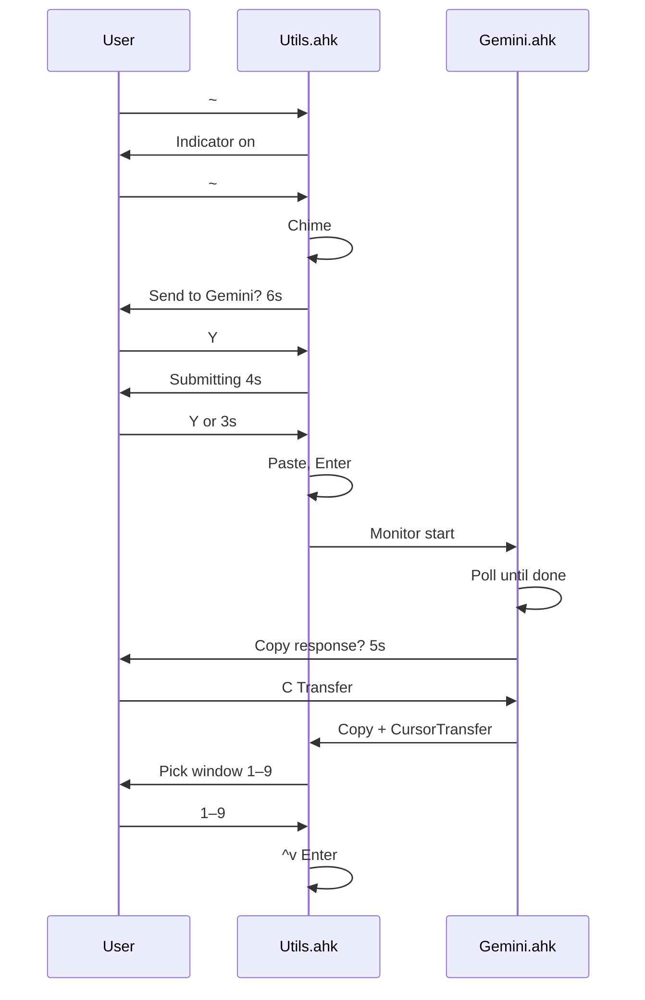

# Dictation → Gemini → Cursor Flow

Flow starting from **Win+Alt+Shift+0** (`~#!+0`) to dictate, optionally send transcription to Gemini, then optionally copy/transfer the response to Cursor. The user can **stop the flow at any moment** at the highlighted cancel points.

## High-level flow

On the 6s banner, only **N** shows the “Gemini submission cancelled” overlay; **timeout** ends the flow without that overlay.

## Where the user can stop the flow

| Step | Banner / moment                        | User action to stop             | Effect                                                 |
| ---- | -------------------------------------- | ------------------------------- | ------------------------------------------------------ |
| 1    | **Send transcription to Gemini?** (6s) | Press **N** or no key (timeout) | Flow ends; no paste to Gemini, no Enter, no 4s banner. |
| 2    | **Submitting in 4s...** (4s)           | Press **N**                     | No paste to Gemini, no Enter; no monitor started.      |
| 3    | **Copy response?** (5s)                | Press **N** or **E**            | No copy, no read aloud, no transfer to Cursor.         |
| 4    | **Transfer to Cursor** (window picker) | Press **Esc**                   | Transfer cancelled; no paste/Enter to Cursor.          |

## Hotkeys

| Hotkey                  | Role                                                                                                                           |
| ----------------------- | ------------------------------------------------------------------------------------------------------------------------------ |
| `~#!+0`                 | Start dictation (first press); stop dictation (second press). If stopped manually (not via #!+j), sets “Send to Gemini?” path. |
| `#!+j`                  | Programmatic stop: set PasteEnter, send ~#!+0. Transcription is pasted and submitted in **current app** (no Gemini banner).    |
| `Ctrl+Alt+Win+L`        | Direct delayed-submit flow (4s banner, paste + optional Enter to Gemini).                                                      |
| `#!+U` then **L** twice | Same flow from hotstring selector (double-tap L in hotstring context).                                                         |

## Files and entry points

- **Utils.ahk**: `~#!+0`, `#!+j`, `DictationGeminiConfirm_*`, `GeminiDelayedSubmitFlow`, `GeminiFinalizeSubmit`, `GeminiCancelAutoSubmit`, `CursorTransfer_ShowWindowSelector`, `CursorTransfer_ActivateFocusPaste`.
- **Gemini.ahk**: `GeminiDelayedSubmitMonitor` (completion detection, “Copy response?” banner, Copy/Read/Transfer actions).

## Simplified “happy path” (no cancel)

