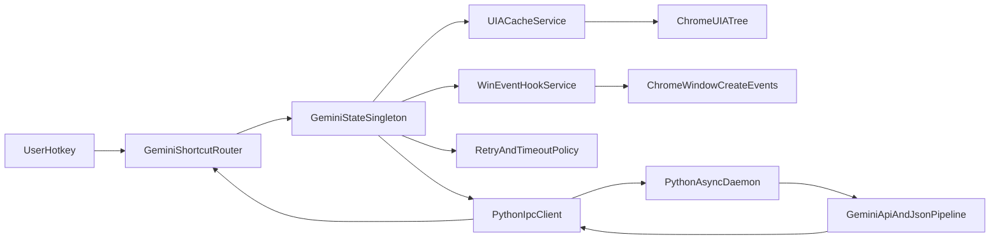

# Gemini.ahk Refactor Architecture

This document describes the structural refactor applied to `Gemini.ahk` for latency reduction and cross-process marshaling minimization. It aligns with the [Gemini Hybrid Latency Refactor Plan](.cursor/plans) and the [evaluation report](gemini-evaluation-report.md).

## Target Topology

## Implemented Components

| Component                                                        | Location                  | Role                                                                                                |
| ---------------------------------------------------------------- | ------------------------- | --------------------------------------------------------------------------------------------------- |
| **Threshold constants**                                          | `Gemini.ahk` config block | All timeouts, retries, and poll intervals (no magic numbers).                                       |
| **GeminiPerfLog**                                                | `Gemini.ahk`              | Lightweight latency logging for copy, read_aloud, activation, hotkey_copy.                          |
| **UIA_ControlType_Button / MenuItem**                            | `Gemini.ahk`              | Strict integer 50000 / 50011; no string coercion.                                                   |
| **GetGeminiCopyButtonsArray / GetLastGeminiCopyButton**          | `Gemini.ahk`              | Single discovery path for “last Copy” button; used by count, copy, and read-aloud.                  |
| **GeminiState**                                                  | `Gemini.ahk`              | Singleton cache for last Copy button by hwnd; O(1) validation via cached element reference.         |
| **FindGeminiPauseResumeButton / FindGeminiTextToSpeechMenuItem** | `Gemini.ahk`              | Centralized Pause/Resume and “Text to speech” discovery.                                            |
| **GetGeminiSearchRoot / GetGeminiMoreOptionsButtonsScoped**      | `Gemini.ahk`              | Scoped discovery: main pane (or root) only for “More options” to avoid full-document traversal.     |
| **WaitForNewChromeWindow**                                       | `Gemini.ahk`              | Event-driven new window detection via `SetWinEventHook(EVENT_OBJECT_CREATE)` with polling fallback. |
| **CopyLastGeminiMessageWithRetry**                               | `Gemini.ahk`              | Single idempotent copy helper with exponential backoff (baseDelay \* 2^(i-1)).                      |
| **Python daemon**                                                | `python/gemini_daemon.py` | TCP server on 127.0.0.1:29512; length-prefixed JSON frames.                                         |
| **Protocol**                                                     | `python/protocol.py`      | Frame format: 4-byte big-endian length + UTF-8 JSON; request validation.                            |
| **GeminiIpcSend**                                                | `Gemini.ahk`              | Stub for AHK→Python IPC; feature flag `GEMINI_USE_PYTHON_IPC`.                                      |

## Algorithmic Justifications

- **UIA tree traversal:** Repeated full-tree search was O(N) per call. Centralized helpers plus optional cache reduce to one discovery per flow; cached validation is O(1) (single property access). Scoped search uses `GetCurrentMainPaneElement()` as root so traversal is over a subset of the document.
- **Copy retry:** Fixed 3×Sleep(400) replaced with exponential backoff: delay_i = baseDelay \* 2^(i-1), i = 1..maxRetries-1, bounded by existing timeout. Same success/failure contract, fewer redundant waits when the first attempt succeeds.
- **Window detection:** Polling loop (35 × 300 ms) replaced by WinEvent callback; main thread only runs one check per creation event (or per 80 ms when hook is used), reducing CPU when many windows exist. Fallback remains polling with the same timeout.
- **Condition waits:** All Sleep-based loops use named constants (e.g. `GEMINI_TITLE_READY_MS`, `GEMINI_STREAM_GONE_LOOPS`); stream “gone” verification uses a fixed number of checks with explicit timeout semantics.

## Latency Reduction Summary

- **Activation / copy / read_aloud:** Single UIA discovery path and optional cache reduce repeated FindAll; constants allow tuning without code churn.
- **First launch:** Event-driven window detection can reduce time-to-detection when the OS signals the new window quickly.
- **IPC:** Persistent Python daemon avoids per-shortcut process startup; when `GEMINI_USE_PYTHON_IPC` is enabled and the client is implemented, payloads are minimal (command id + text) to keep marshaling cost low.

## Risk Controls

- **Feature flags:** `GEMINI_USE_WIN_EVENT_HOOK`, `GEMINI_USE_PYTHON_IPC` allow disabling new behavior.
- **Fallbacks:** Hook failure or timeout uses polling; IPC failure leaves AHK on local path.
- **No regression:** Hotkeys #!+i, #!+p, #!+o, #!+7, #!+8 and EN/PT behavior are unchanged; all waits have explicit timeouts.

## File Map

- **Gemini.ahk** – Core refactor (constants, singleton, helpers, hook, retry, IPC stub).
- **docs/gemini-evaluation-report.md** – Pre-refactor findings.
- **docs/standard-loading-bar.md** – UI conventions unchanged by this refactor.
- **python/gemini_daemon.py** – TCP daemon entrypoint.
- **python/protocol.py** – Framing and validation.
