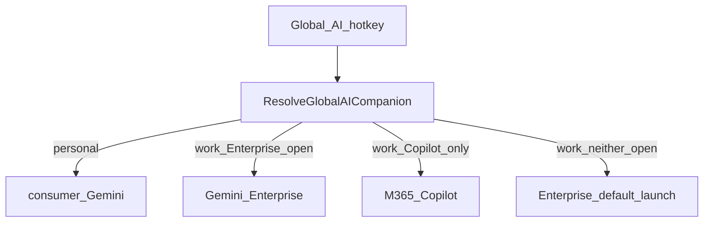

# Global AI companion routing

Companion AI is **environment-aware** and, at work, **multi-provider**. Global chords such as Win+Alt+Shift+I no longer assume a single product; they call `ResolveGlobalAICompanion()` and route to the active peer.

## Why this exists

| Environment                            | Companions                                                                       |
| -------------------------------------- | -------------------------------------------------------------------------------- |
| Personal (`IS_WORK_ENVIRONMENT` false) | Consumer **Gemini** (`gemini.google.com`)                                        |
| Work (`IS_WORK_ENVIRONMENT` true)      | **Gemini Enterprise** (AskBosch / Vertex AI Search) **and** **M365 Copilot** web |

Work therefore has two Chrome-based AIs with similar roles (chat, tools, paste/submit flows) but different UIA trees. Shortcuts must pick which one to drive.

## Resolver

Defined in [`Lib/CopilotWeb.ahk`](../Lib/CopilotWeb.ahk) (Gemini Enterprise helpers live in [`Lib/GeminiEnterprise.ahk`](../Lib/GeminiEnterprise.ahk), included after CopilotWeb from `Utils.ahk`).

```
ResolveGlobalAICompanion() → "gemini" | "copilot" | "enterprise"
```

**Rules:**

1. Personal → `"gemini"`.
2. Work + Gemini Enterprise Chrome window open → `"enterprise"`.
3. Work + no Enterprise, but Copilot open → `"copilot"`.
4. Work + neither open → `"enterprise"` (default launch / open target).

Related helpers:

- `GetGlobalAIProviderLabel()` → `"Gemini"` / `"Copilot"` / `"Gemini Enterprise"` (cheat sheet `{AI_PROVIDER}`).
- `UseCopilotWebForGlobalAI()` → `true` only when resolver returns `"copilot"` (legacy binary call sites).

**See also:** [AI companion models (Shift+M / Q / L)](ai-companion-models.md) — Fast/Deep INI roles and the shared model list.

**Do not** redefine `ResolveGlobalAICompanion`, `GetGlobalAIProviderLabel`, or `UseCopilotWebForGlobalAI` in `env.ahk` (duplicates break Act at startup). Optional `COPILOT_WEB_*` URL/title overrides in `env.ahk` remain valid for Copilot only.



## Global hotkey matrix

| Chord                | Gemini (personal)                       | Copilot (work)                           | Gemini Enterprise (work)                                              |
| -------------------- | --------------------------------------- | ---------------------------------------- | --------------------------------------------------------------------- |
| Win+Alt+Shift+I      | Open/focus consumer Gemini + prompt     | Open/focus Copilot + composer            | Open/focus Enterprise + prompt                                        |
| Win+Alt+Shift+P      | 1× copy last message; 2× copy last code | 1× copy last response; 2× copy last code | 1× copy last response; 2× copy last code                              |
| Win+Alt+Shift+8      | Pronunciation lookup                    | Copilot pronunciation                    | Enterprise pronunciation (picker → submit → banner)                   |
| Ctrl+Alt+Win+4       | Toggle Gemini Chrome tab 1 <-> 2        | Same → Copilot                           | Same → Enterprise                                                     |
| Ctrl+Alt+Win+L / D2C | Paste/submit + monitor                  | Copilot paste/submit                     | Enterprise paste/submit; post-response copy/read-aloud → prompt focus |

Entry points: [`Gemini/gemini_open.ahk`](../Gemini/gemini_open.ahk), [`Gemini/hotkey_read_copy.ahk`](../Gemini/hotkey_read_copy.ahk), [`Gemini/hotkey_pronunciation.ahk`](../Gemini/hotkey_pronunciation.ahk), [`Utils/utility_shortcuts.ahk`](../Utils/utility_shortcuts.ahk), [`Utils/d2c_flow_manager.ahk`](../Utils/d2c_flow_manager.ahk).

### Read aloud (D2C / IPC)

`#\!+O` is a **Utils** Desktop chord (cut newest Desktop item), not an AI companion action. Read aloud runs via D2C **R** / `WM_TRIGGER_READ_ALOUD` (and Copilot’s `WM_TRIGGER_COPILOT_READ_ALOUD`), plus TTS / delayed-submit monitors calling `GeminiTriggerReadAloud` / `CopilotWeb_TriggerReadAloud`.

Until chat-response UIA exists for Enterprise **read aloud / TTS**, those programmatic paths do **not** silently fall back to Copilot when Enterprise is the resolved companion. Enterprise may focus the omnibar/composer instead (prompt-only). **`#!+P` copy** (1× message / 2× code snippet) and **`#!+8` pronunciation** use Enterprise UIA (`GeminiEnterprise_CopyLastMessageToClipboard` / `GeminiEnterprise_CopyLastCodeSnippetToClipboard` / `GeminiEnterpriseAsyncLookup`) and are full parity with Gemini/Copilot.

## Shift keys (separate from the global resolver)

Hold-Shift cheat sheets and letter shortcuts use **window HotIf**, not `ResolveGlobalAICompanion()`:

| Peer              | Module                                    | Detection                                                                                      |
| ----------------- | ----------------------------------------- | ---------------------------------------------------------------------------------------------- |
| Consumer Gemini   | `Shift keys/gemini_chrome_01.ahk` + `_02` | Chrome title contains `gemini` **and not** `Gemini Enterprise` (`IsConsumerGeminiChromeTitle`) |
| Copilot Web       | `Shift keys/hotif_copilot_web.ahk`        | `IsCopilotWebChromeActiveForHotkey()`                                                          |
| Gemini Enterprise | `Shift keys/hotif_gemini_enterprise.ahk`  | `IsGeminiEnterpriseChromeActiveForHotkey()`                                                    |

So with both Copilot and Enterprise open, **global** chords prefer Enterprise (if that window exists), while **Shift** shortcuts follow whichever Chrome tab/window is focused.

## D2C (dictation → companion → Cursor)

[`Utils/d2c_flow_manager.ahk`](../Utils/d2c_flow_manager.ahk) stores `CompanionId` at submit time from the resolver, then:

- Pastes via `GeminiEnterprise_NavigateFocusAndPaste` / `CopilotWeb_NavigateFocusAndPaste` / `GeminiNavigateFocusAndPasteFirstSnippet`.
- Monitors stop/streaming controls per companion.
- On “copy response”, Enterprise focuses the prompt instead of IPC copy/read-aloud.

See also [dictation-to-gemini-cursor-flow.md](dictation-to-gemini-cursor-flow.md) for the banner UX (wording still says “Gemini” in places; the target is whatever the resolver returns).

## Key files

| File                                     | Role                                                       |
| ---------------------------------------- | ---------------------------------------------------------- |
| `Lib/CopilotWeb.ahk`                     | Resolver + Copilot automation                              |
| `Lib/GeminiEnterprise.ahk`               | Enterprise detection, open/focus, Shift actions, D2C paste |
| `Gemini/gemini_open.ahk`                 | `#\!+I`                                                    |
| `Gemini/hotkey_read_copy.ahk`            | `#\!+O` / `#\!+P` / `#\!+7`                                |
| `Gemini/hotkey_pronunciation.ahk`        | `#\!+8`                                                    |
| `Utils/d2c_flow_manager.ahk`             | Dictation companion flow                                   |
| `Utils/utility_shortcuts.ahk`            | `^!#4`, `^!#L`                                             |
| `Shift keys/hotif_gemini_enterprise.ahk` | Enterprise Shift mnemonics                                 |

## Practical tips

- To force Copilot for global chords at work: close the Enterprise Chrome window (or do not leave it open). Resolver then selects Copilot if that window exists.
- To force Enterprise: leave Enterprise open (preferred whenever present), or close both and use `#\!+I` (opens Enterprise by default).
- Reload **Gemini.ahk** and **Shift keys.ahk** after changing routing or HotIf modules (both load `Utils.ahk` / libs).
