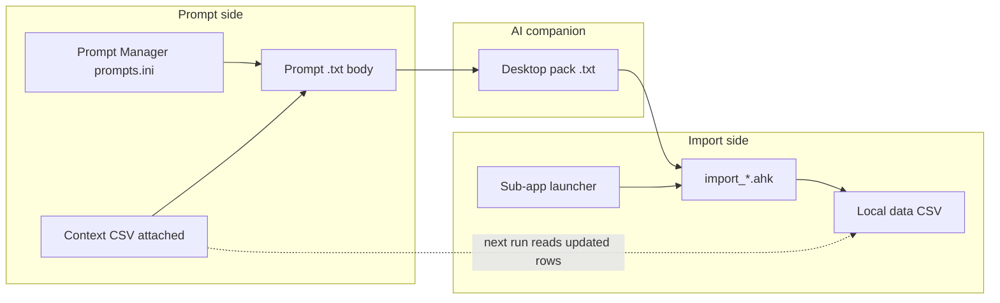

# Prompt data output and pack imports

Documentation for future agents working on Utility Shortcuts prompts, AIB delivery, and pack imports (Finance, Memory Palace, Import Management / job search).

This doc is the **canonical reference** for how prompts and importers are linked.

> **Start here** if you are an AI agent working on pack prompts, importers, CSV schemas, partial-import recovery, or a new import domain.

## For future agents — import system reference

### What this system does

Utility Shortcuts connects **AI companions** (Gemini/Copilot) to **local CSV data** through a repeatable pipeline:

1. **Prompt** (`.txt` + `prompts.ini` metadata) tells the AI what structured pack to emit.
2. **Context CSVs** attached at send time give the AI existing rows/ids to match.
3. Human saves the AI **pack** (`.txt` on Desktop) — the companion never writes to disk directly.
4. **Importer** (`*_import.ahk`) discovers the newest Desktop pack, extracts CSV, upserts local data.
5. On failure or partial failure, importer writes a **Desktop fix file** for the AI to correct output.

### Shared import pipeline (all domains)

Every importer follows the same stages. Function names differ by prefix (`Finance_`, `Palace_`, `ImportMgmt_`):

| Stage       | Purpose                                               | Job search functions                                               |
| ----------- | ----------------------------------------------------- | ------------------------------------------------------------------ |
| Discover    | Newest Desktop file matching pack name                | `ImportMgmt_DesktopNewest`, `ImportMgmt_DesktopNewestCodeDump`     |
| Materialize | Extract `===FILE: …csv===` body; strip fences/preview | `ImportMgmt_MaterializeAiCsv`, `ImportMgmt_ExtractPackFileSection` |
| Parse       | Normalize to row Maps                                 | `ImportMgmt_ReadAiImportCsv`, `ImportMgmt_ReadCsv`                 |
| Upsert      | Match by id/keys; merge or append                     | `ImportMgmt_MergeImportRow`, `ImportMgmt_NewRowFromImport`         |
| Outcome     | Save, archive, notify, or write fix file              | `ImportMgmt_ImportFromDesktop`                                     |

Finance adds a **confirm UI** before save. Job search is **auto-upsert** (no ListView). Memory Palace upserts palaces/beasts/atoms with strict cross-link validation.

### Import outcome matrix

| Outcome                    | Local CSV                    | Archive Desktop pack     | Fix file on Desktop | Toast   |
| -------------------------- | ---------------------------- | ------------------------ | ------------------- | ------- |
| All rows applied           | Saved                        | Yes → `*/data/imported/` | No                  | Success |
| Partial (some rows failed) | Saved (successful rows only) | **No** (keep for retry)  | **Yes**             | Error   |
| Total failure (0 rows)     | Not saved                    | No                       | **Yes**             | Error   |

Fix files: `FINANCE_AI_FIX.txt`, `PALACE_AI_FIX.txt`, `JOB_SEARCH_AI_FIX.txt`.

Each fix file structure: **IMPORT ERROR** → **EXTRA NOTES** (per-row errors) → **WHAT YOU MUST DO** (tailored via `*_AiCompanionFixGuidance`) → **DELIVERY RULES**.

Partial import recovery (job search): paste fix file into AI → re-deliver **full** corrected pack → save to Desktop → `[J]` Import Management → `[I]`.

### Module index (code)

| Domain        | Helpers                                                                     | Import                                                                    | Launcher                                                                      | Data                                                                        |
| ------------- | --------------------------------------------------------------------------- | ------------------------------------------------------------------------- | ----------------------------------------------------------------------------- | --------------------------------------------------------------------------- |
| Finance       | [`Utils/finance_helpers.ahk`](../Utils/finance_helpers.ahk)                 | [`Utils/finance_import.ahk`](../Utils/finance_import.ahk)                 | [`Utils/finance_launcher.ahk`](../Utils/finance_launcher.ahk)                 | `finances/data/*.csv`                                                       |
| Memory Palace | [`Utils/mnemonic_palace_helpers.ahk`](../Utils/mnemonic_palace_helpers.ahk) | [`Utils/mnemonic_palace_import.ahk`](../Utils/mnemonic_palace_import.ahk) | [`Utils/mnemonic_palace_launcher.ahk`](../Utils/mnemonic_palace_launcher.ahk) | `mnemonics/data/*.csv`                                                      |
| Job search    | [`Utils/import_mgmt_helpers.ahk`](../Utils/import_mgmt_helpers.ahk)         | [`Utils/import_mgmt_import.ahk`](../Utils/import_mgmt_import.ahk)         | [`Utils/import_mgmt_launcher.ahk`](../Utils/import_mgmt_launcher.ahk)         | [`job_search/data/opportunities.csv`](../job_search/data/opportunities.csv) |

Prompt wiring: [`assets/data/prompts.ini`](../assets/data/prompts.ini), [`Utils/prompt_data.ahk`](../Utils/prompt_data.ahk). ClipAngel Desktop names: [`assets/data/clipangel_desktop_names.csv`](../assets/data/clipangel_desktop_names.csv).

Utility Shortcuts category wiring: [`Utils/hotstring_selector_core.ahk`](../Utils/hotstring_selector_core.ahk) (`g_UtilityTopCategories`), [`Utils/hotstring_selector_handlers_02.ahk`](../Utils/hotstring_selector_handlers_02.ahk) (`UtilitySelector_SwitchToCategory`).

### Checklist — adding a new pack-import domain

1. Create `data/*.csv` + `*_helpers.ahk` (`*_Headers`, `*_ReadCsv`, `*_Save`, `*_EnsureData`, optional `*_Migrate*Csv`).
2. Create pack prompt in `assets/prompt/` with `===PREVIEW===` / `===FILE: PACK_NAME.csv===` markers and strict CSV header.
3. Register in `prompts.ini` (`ExpectsDataOutput=1`, `DataOutputFormat`, context files).
4. Create `*_import.ahk`: discover → materialize → parse → upsert → outcome; add `*_FailAiImport` + `*_WriteAiCompanionImportError` + `*_AiCompanionFixGuidance`.
5. Create `*_launcher.ahk` with `[I] AI import` menu item.
6. Wire Utility Shortcuts category in `hotstring_selector_core.ahk` / `handlers_02.ahk`; `#include` from `Utils.ahk`.
7. Add ClipAngel name to `clipangel_desktop_names.csv` if applicable.
8. **Update this doc** (domain table, columns, fix file name, flow steps).

---

## Summary

1. **Prompt Manager metadata** decides whether AIB must emit structured data and whether delivery is a **downloadable `.txt` file** or a **single code fence**.
2. At paste/send time, AHK **injects a short DATA OUTPUT CONTRACT** from that metadata (runtime authority for file vs code).
3. Pack bodies use `===PREVIEW===` / `===FILE: …csv===` markers. Importers accept Desktop `.txt` packs and convert CSV sections locally.
4. **Context CSVs** attached to prompts let the AI match existing rows; importers write back to those CSVs, closing the loop.
5. Never claim the companion wrote to the user's Desktop/disk; Gemini/Copilot sandboxes are not the PC.

---

## Prompt-import bridge (overview)

Every pack-import domain follows the same loop:



### How the pieces connect

| Piece                                                                                                                 | Role                                                                              |
| --------------------------------------------------------------------------------------------------------------------- | --------------------------------------------------------------------------------- |
| **Prompt char** (`Char=` in [`assets/data/prompts.ini`](../assets/data/prompts.ini))                                  | Opens the prompt from Utility Shortcuts (`#!+U` → Prompts) or dictation flow      |
| **`ExpectsDataOutput=1`**                                                                                             | Marks the prompt as requiring structured AIB output                               |
| **`DataOutputFormat`** (`file` / `code`)                                                                              | Controls injected delivery contract: download chip vs single code fence           |
| **Context files** (`PersonalContextFiles` / `WorkContextFiles`)                                                       | Attach local CSVs/INIs so the AI knows existing ids and rows                      |
| **Pack naming convention**                                                                                            | Links prompt output to importer Desktop discovery (see table below)               |
| **ClipAngel name registry** ([`assets/data/clipangel_desktop_names.csv`](../assets/data/clipangel_desktop_names.csv)) | Quick Desktop export naming for pack files                                        |
| **Import launcher**                                                                                                   | Sub-app menu item that runs the importer on the newest Desktop match              |
| **Feedback loop**                                                                                                     | Importer upserts local CSV → next prompt run attaches the updated file as context |

### Pack-import domains

| Domain          | Shortcuts     | Prompt (char) | Pack file               | Context                                                                     | Importer                                                            | Confirm UI       |
| --------------- | ------------- | ------------- | ----------------------- | --------------------------------------------------------------------------- | ------------------------------------------------------------------- | ---------------- |
| Finance daily   | `[F]` → `[I]` | `[d]`         | `FINANCE_DAILY.txt`     | categories, accounts, cards                                                 | [`finance_import.ahk`](../Utils/finance_import.ahk)                 | Yes              |
| Finance monthly | `[F]` → `[I]` | `[m]`         | `FINANCE_MONTHLY.txt`   | accounts, goals                                                             | [`finance_import.ahk`](../Utils/finance_import.ahk)                 | Yes              |
| Memory Palace   | `[N]` → `[I]` | `[4]` / `[a]` | `PALACE_PACK.txt`       | technique files                                                             | [`mnemonic_palace_import.ahk`](../Utils/mnemonic_palace_import.ahk) | Yes              |
| Study plans     | `[N]` → `[J]` | `[n]`         | `PLAN_PACK.txt`         | —                                                                           | [`mnemonic_palace_import.ahk`](../Utils/mnemonic_palace_import.ahk) | Yes              |
| Job search      | `[J]` → `[I]` | `[j]`         | `JOB_SEARCH_UPDATE.txt` | [`job_search/data/opportunities.csv`](../job_search/data/opportunities.csv) | [`import_mgmt_import.ahk`](../Utils/import_mgmt_import.ahk)         | No (auto-upsert) |

Typical human workflow:

1. Open prompt (Utility Shortcuts or dictation) with dictation/context attached.
2. AI returns a pack → save to Desktop (Quick Download `#!+Shift+9`, or copy fence).
3. Open sub-app launcher → **AI import** → importer parses pack, upserts local CSV, archives source file on full success.

### AI fix recovery

When import fails completely or only some rows apply, importers write a Desktop fix note for the AI companion to correct its output:

| Domain        | Fix file on Desktop     |
| ------------- | ----------------------- |
| Finance       | `FINANCE_AI_FIX.txt`    |
| Memory Palace | `PALACE_AI_FIX.txt`     |
| Job search    | `JOB_SEARCH_AI_FIX.txt` |

Each fix file contains: **IMPORT ERROR**, **EXTRA NOTES** (per-row failures when applicable), **WHAT YOU MUST DO** (tailored guidance), and **DELIVERY RULES**.

Recovery workflow:

1. Importer writes fix file + error toast (mentions Desktop path).
2. Paste fix file into the AI companion.
3. AI re-delivers a corrected pack → save to Desktop → run **AI import** again.

**Partial import (job search):** rows that passed validation are saved to `opportunities.csv`; the source pack stays on Desktop (not archived) until all rows import successfully.

---

## Prompt Manager metadata

**Store:** [`assets/data/prompts.ini`](../assets/data/prompts.ini)  
**Load/Save/Normalize:** [`Utils/prompt_data.ahk`](../Utils/prompt_data.ahk)  
**Editor:** [`Utils/prompt_editor_gui.ahk`](../Utils/prompt_editor_gui.ahk)  
**List column Out:** [`Utils/hotstring_selector_gui.ahk`](../Utils/hotstring_selector_gui.ahk), [`Utils/hotstring_selector_handlers_02.ahk`](../Utils/hotstring_selector_handlers_02.ahk)

| INI key             | Values          | Meaning                                                                       |
| ------------------- | --------------- | ----------------------------------------------------------------------------- |
| `ExpectsDataOutput` | `0` / `1`       | Prompt expects structured data from AIB                                       |
| `DataOutputFormat`  | `file` / `code` | Only when expects=1. `file` = download chip `.txt`; `code` = one marked fence |

ListView **Out** column: blank, `txt·file`, or `txt·code`.

**Seeded `ExpectsDataOutput=1`:**

- `finance-daily-transactions.txt` (char `d`) — `DataOutputFormat=code`
- `finance-monthly-investments.txt` (char `m`) — `DataOutputFormat=code`
- `job-search-status-update.txt` (char `j`) — `DataOutputFormat=code`
- `concept-curation-prompt.txt` (char `6`) — `DataOutputFormat=code` (grab-able Markdown fence)
- `story-prompt.txt`, `story-reduction-prompt.txt`, `plan-prompt.txt` — typically `file` unless changed in the editor

Change **Data output** in Prompt Manager (`#!+h` or `#!+U` → Prompts → Edit) and save. Body prose alone does **not** flip file vs code.

### Injected contract (runtime)

`PromptData_AppendDataOutputDirective` / `PromptData_PreparedBodyForSend` → `PromptRender_Prepare`.

Call sites:

- [`Utils/prompt_render.ahk`](../Utils/prompt_render.ahk) — Utility Shortcuts paste / L-arm companion
- [`Utils/d2c_flow_manager.ahk`](../Utils/d2c_flow_manager.ahk) — Send dictation **[D]** / **[G]** / **[A]** / **[T]** load the prompt by char (`d` / `1` / `3` / `2`), apply Prompt Manager metadata (data-output contract, context attach via `UtilitySelector_AttachPromptContextFiles`), then combine with clipboard dictation

The long FILE DELIVERY PROTOCOL inside each `.txt` body is documentation/fallback; the injected block is the runtime authority for **file vs code**.

---

## Pack body layout (shared)

Used by finance, mnemonic, and job-search pack prompts:

```
===PREVIEW===
…
===END_PREVIEW===

===FILE: <NAME>.csv===
<header + CSV rows>
===END_FILE===
```

(`---` markers also accepted by some importers.)

Extension convention for downloadable packs: **`.txt`**. App code extracts CSV and materializes temp CSV for parsing.

---

## Finance import (txt → CSV)

**Import:** [`Utils/finance_import.ahk`](../Utils/finance_import.ahk)  
**Helpers:** [`Utils/finance_helpers.ahk`](../Utils/finance_helpers.ahk) (`Finance_ImportAccountLabel`, `Finance_NameOrUnknown`)  
**Transactions list:** [`Utils/finance_transactions.ahk`](../Utils/finance_transactions.ahk)  
**Launcher copy:** [`Utils/finance_launcher.ahk`](../Utils/finance_launcher.ahk)

Flow:

1. Discover newest `FINANCE_DAILY*.txt` / `FINANCE_MONTHLY*.txt` on Desktop (then `.csv` / `.ini` / `gemini-code*.txt`).
2. `Finance_MaterializeAiCsv` — extract `===FILE: …===` (tries `.csv` then `.txt` section name), strip markdown fences via `Chr(96)` fence helper (do **not** put raw ` ``` ` inside AHK string literals — backtick is the escape char), or fall back to header row after stripping PREVIEW.
3. Parse CSV → editable/confirm UI with **resolved names and BRL amounts** (not raw ids).
4. Daily: `Finance_ImportConfirmEditable`; monthly: multi-column confirm.
5. Archive source `.txt`; write app CSVs.

Post-import daily opens Transactions; card expenses show **card name**; transfers show `source → dest`.

---

## Import Management — job search (txt → CSV)

**Prompt:** [`assets/prompt/job-search-status-update.txt`](../assets/prompt/job-search-status-update.txt) (char `j`)  
**Import:** [`Utils/import_mgmt_import.ahk`](../Utils/import_mgmt_import.ahk)  
**Helpers:** [`Utils/import_mgmt_helpers.ahk`](../Utils/import_mgmt_helpers.ahk)  
**Launcher:** [`Utils/import_mgmt_launcher.ahk`](../Utils/import_mgmt_launcher.ahk)  
**Data:** [`job_search/data/opportunities.csv`](../job_search/data/opportunities.csv)  
**ClipAngel name:** `NAME_JOBSEARCH` → `JOB_SEARCH_UPDATE`

Flow:

1. Utility Shortcuts → Prompts → **[j]** with voice dictation; `opportunities.csv` attached as context.
2. AI returns `JOB_SEARCH_UPDATE.txt` pack → save to Desktop.
3. Utility Shortcuts → **[J]** Import Management → **[I]** AI import.
4. `ImportMgmt_MaterializeAiCsv` extracts CSV section; upserts rows by `id` or normalized `company` (no confirm UI).
5. **Full success:** archive source pack to `job_search/data/imported/`; success toast.
6. **Partial or total failure:** write `Desktop/JOB_SEARCH_AI_FIX.txt`, keep pack on Desktop, error toast. Partial success still saves rows that passed to `opportunities.csv`.

**CSV columns:**

| Column            | Purpose                                                                                         |
| ----------------- | ----------------------------------------------------------------------------------------------- |
| `id`              | Primary key, e.g. `JOB_COCACOLA`                                                                |
| `company`         | Employer name (fuzzy match key)                                                                 |
| `role_title`      | Position title                                                                                  |
| `job_url`         | Full URL to job posting (replaces a separate source field)                                      |
| `job_description` | Full job opening text (summary, responsibilities, requirements, location, etc.)                 |
| `status`          | `applied` \| `screening` \| `interviewing` \| `offer` \| `rejected` \| `withdrawn` \| `on_hold` |
| `status_date`     | Date status last changed (`YYYY-MM-DD`)                                                         |
| `applied_date`    | Date applied (`YYYY-MM-DD`, optional)                                                           |
| `notes`           | Free text (follow-ups, interview dates, personal reminders — not the full job ad)               |

View/edit the CSV in Excel or any external tool; there is no in-app CSV viewer.

---

## Pack prompt delivery prose

Files (prefer download; if attach fails, one marked fence; never fake disk save):

- [`assets/prompt/finance-daily-transactions.txt`](../assets/prompt/finance-daily-transactions.txt)
- [`assets/prompt/finance-monthly-investments.txt`](../assets/prompt/finance-monthly-investments.txt)
- [`assets/prompt/job-search-status-update.txt`](../assets/prompt/job-search-status-update.txt)
- [`mnemonics/technique/prompts/story-prompt.txt`](../mnemonics/technique/prompts/story-prompt.txt)
- [`mnemonics/technique/prompts/story-reduction-prompt.txt`](../mnemonics/technique/prompts/story-reduction-prompt.txt)
- [`mnemonics/technique/prompts/plan-prompt.txt`](../mnemonics/technique/prompts/plan-prompt.txt)

Human footers: Quick Download on chip, or copy fence → save as pack name on Desktop → import.

Mnemonic import uses [`Utils/mnemonic_palace_import.ahk`](../Utils/mnemonic_palace_import.ahk) (same marker style).

---

## Related docs

- Dictation **[D]** path: [`docs/dictation-to-gemini-cursor-flow.md`](dictation-to-gemini-cursor-flow.md)
- Technique prompt resolution: [`docs/mynotes-technique-prompts.md`](mynotes-technique-prompts.md)
- Companion routing: [`docs/global-ai-companion-routing.md`](global-ai-companion-routing.md)

---

## Pitfalls for agents

- **AHK strings:** never write markdown fence literals as `"```"`; build with `Chr(96)` (see `Finance_MdFence`).
- **Do not** treat "I saved to your Desktop" as success; companions have no disk write to the user PC.
- Changing `DataOutputFormat` in the Prompt Manager is enough to flip file vs code without rewriting every pack prompt body.
- Saving prompts via the editor rewrites `prompts.ini`; preserve `ExpectsDataOutput` / `DataOutputFormat` in Load/Save/Normalize/`PromptFromEditorResult`.
- When adding CSV columns, update prompt header, `*_Headers()` in helpers, error-fix text in importer, and this doc. Use `*_Migrate*Csv()` in `EnsureData()` for existing installs.
- **Partial import (auto-upsert domains):** if `nApplied < nParsed` or any row errors, call `*_FailAiImport`, save successful rows, and **do not archive** the Desktop pack. Success toast alone is wrong when rows were skipped.
- **AI fix files** must include per-row errors in EXTRA NOTES and tailored guidance via `*_AiCompanionFixGuidance()`. Mirror Finance/Palace patterns; do not invent a one-off error UX.
