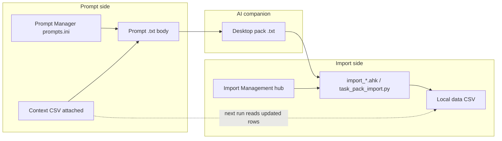

# Prompt data output and pack imports

Documentation for future agents working on Utility Shortcuts prompts, AIB delivery, and pack imports (Finance, Memory Palace, Tasks, Import Management).

This doc is the **canonical reference** for how prompts and importers are linked.

> **Start here** if you are an AI agent working on pack prompts, importers, CSV schemas, partial-import recovery, or a new import domain.

**Tasks domain:** Utility Shortcuts `[T]` / `#!+D` tap opens the **web app** at `http://127.0.0.1:8766/` (`tasks/python/task_server.py` + `tasks/web/index.html`). CSV under `tasks/data/`. Pack import **`TASK_PACK.txt`** is Import Management `[T]` ([`task_import.ahk`](../Utils/task_import.ahk) → Python CLI). Fix file: `TASK_AI_FIX.txt`.

**Memory Palace domain:** Utility Shortcuts `[N]` / `#!+D` **hold** opens the **web app** at `http://127.0.0.1:8767/` (`mnemonics/python/palace_server.py` + `mnemonics/web/index.html`). CSV under `mnemonics/data/`. Thin AHK launcher ensures the server and focuses Chrome titled **Memory Palace**. Pack import (**`PALACE_PACK`** / **`PLAN_PACK`**) and **Quick image** (newest Desktop PNG/JPG → palace missing image) stay Import Management (`#!+X` / Utility `[J]` → `[P]`/`[L]`/`[Q]`). The old `file://` dashboard + write-only `:8765` `plan_save_server` path is **deprecated** (writes live on `:8767`). Fix files: `PALACE_AI_FIX.txt` / plan fix naming via Import Management.

**Push (all domains):** Utility Shortcuts top-level `[G]` / category **Push** is the only commit+push entrypoint ([`utility_git_push.ahk`](../Utils/utility_git_push.ahk)). It runs in the background, syncs Memory Palace practice+plans MD when `mnemonics/data` is dirty, then commits and pushes **scripts** and **notes**. Finance/Palace/Tasks in-app push keys were removed. Tasks live only in `tasks/data/` CSV (no Markdown mirror).

## For future agents — import system reference

### What this system does

Utility Shortcuts connects **AI companions** (Gemini/Copilot) to **local CSV data** through a repeatable pipeline:

1. **Prompt** (`.txt` + `prompts.ini` metadata) tells the AI what structured pack to emit.
2. **Context CSVs** attached at send time give the AI existing rows/ids to match.
3. Human saves the AI **pack** (`.txt` on Desktop) — the companion never writes to disk directly.
4. **Importer** (`*_import.ahk`) discovers the newest Desktop pack, extracts CSV, upserts local data.
5. On failure or partial failure, importer writes a **Desktop fix file** for the AI to correct output.

### Shared import pipeline (all domains)

Every importer follows the same stages. Function names differ by prefix (`Finance_`, `Palace_`):

| Stage       | Purpose                                                  | Finance example                                                                                     |
| ----------- | -------------------------------------------------------- | --------------------------------------------------------------------------------------------------- |
| Discover    | Newest Desktop file matching pack name                   | `Finance_DesktopNewest`, `Finance_DesktopNewestDailyCodeDump`                                       |
| Normalize   | Move variant names to canonical Desktop path (overwrite) | `PackImport_NormalizeDesktopSource` ([`pack_import_desktop.ahk`](../Utils/pack_import_desktop.ahk)) |
| Materialize | Extract `===FILE: …csv===` body; strip fences/preview    | `Finance_MaterializeAiCsv`, `Finance_ExtractPackFileSection`                                        |
| Parse       | Normalize to row Maps                                    | `Finance_ReadAiImportCsv`, `Finance_ReadCsv`                                                        |
| Upsert      | Merge or append local data                               | `Finance_ImportConfirmEditable`, palace cross-link validation                                       |
| Outcome     | Save, archive, notify, or write fix file                 | `Finance_ImportDailyFromPath`, `Palace_ImportMnemonicsFromDesktop`                                  |

Finance and Memory Palace add a **confirm UI** before save. Memory Palace upserts palaces/beasts/atoms with strict cross-link validation.

### Import outcome matrix

| Outcome         | Local CSV | Archive Desktop pack     | Fix file on Desktop | Toast   | Import Manager (hub `[J]`)                                      |
| --------------- | --------- | ------------------------ | ------------------- | ------- | --------------------------------------------------------------- |
| Full success    | Saved     | Yes → `*/data/imported/` | No                  | Success | Closes (Finance daily still opens transactions)                 |
| Import rejected | Not saved | No                       | **Yes**             | Error   | Fix copied to clipboard + ≥5s banner; hub closes (reopen after) |

Fix files: `FINANCE_AI_FIX.txt`, `PALACE_AI_FIX.txt`, `TASK_AI_FIX.txt`.

Finance/Palace/Tasks AI-fix path: clipboard copy + ≥5s “paste into your AI companion” overlay via `ImportMgmt_OnAiFixReady`. Tasks pack import is AHK confirm + Python CLI (`task_pack_import.py preview|commit`).

Each fix file structure: **IMPORT ERROR** → **EXTRA NOTES** (per-row errors when applicable) → **WHAT YOU MUST DO** (tailored via `*_AiCompanionFixGuidance`) → **DELIVERY RULES**.

**Desktop canonical overwrite:** After discovery, importers consolidate `*_updated*`, `* (updated)*`, `gemini-code-….txt`, and other variants to the exact canonical pack filename (e.g. `FINANCE_DAILY.txt`) by overwriting any prior Desktop copy. Fix files (`*_AI_FIX.txt`) are always written to fixed paths (overwrite). AI fix **DELIVERY RULES** forbid `updated` / `corrected` / `v2` suffixes on re-delivered packs.

### Module index (code)

| Domain            | Helpers                                                                                                                                                 | Import                                                                                                                              | Launcher                                                                                    | Data                   |
| ----------------- | ------------------------------------------------------------------------------------------------------------------------------------------------------- | ----------------------------------------------------------------------------------------------------------------------------------- | ------------------------------------------------------------------------------------------- | ---------------------- |
| Finance           | [`Utils/finance_helpers.ahk`](../Utils/finance_helpers.ahk)                                                                                             | [`Utils/finance_import.ahk`](../Utils/finance_import.ahk)                                                                           | [`Utils/finance_launcher.ahk`](../Utils/finance_launcher.ahk)                               | `finances/data/*.csv`  |
| Memory Palace     | [`Utils/mnemonic_palace_helpers.ahk`](../Utils/mnemonic_palace_helpers.ahk) + [`mnemonics/python/palace_store.py`](../mnemonics/python/palace_store.py) | [`Utils/mnemonic_palace_import.ahk`](../Utils/mnemonic_palace_import.ahk)                                                           | [`Utils/mnemonic_palace_launcher.ahk`](../Utils/mnemonic_palace_launcher.ahk) → web `:8767` | `mnemonics/data/*.csv` |
| Tasks             | [`Utils/task_helpers.ahk`](../Utils/task_helpers.ahk) + [`tasks/python/task_store.py`](../tasks/python/task_store.py)                                   | [`tasks/python/task_pack_import.py`](../tasks/python/task_pack_import.py) CLI + [`Utils/task_import.ahk`](../Utils/task_import.ahk) | [`Utils/task_launcher.ahk`](../Utils/task_launcher.ahk) → web `:8766`                       | `tasks/data/*.csv`     |
| Import Management | —                                                                                                                                                       | Hub UI + `ImportMgmt_Run*` → domain importers                                                                                       | [`Utils/import_mgmt_launcher.ahk`](../Utils/import_mgmt_launcher.ahk)                       | —                      |

Shared Desktop normalization: [`Utils/pack_import_desktop.ahk`](../Utils/pack_import_desktop.ahk).

Prompt wiring: [`assets/data/prompts.ini`](../assets/data/prompts.ini), [`Utils/prompt_data.ahk`](../Utils/prompt_data.ahk). ClipAngel Desktop names: [`assets/data/clipangel_desktop_names.csv`](../assets/data/clipangel_desktop_names.csv).

Utility Shortcuts category wiring: [`Utils/hotstring_selector_core.ahk`](../Utils/hotstring_selector_core.ahk) (`g_UtilityTopCategories`), [`Utils/hotstring_selector_handlers_02.ahk`](../Utils/hotstring_selector_handlers_02.ahk) (`UtilitySelector_SwitchToCategory`).

### Checklist — adding a new pack-import domain

1. Create `data/*.csv` + `*_helpers.ahk` (`*_Headers`, `*_ReadCsv`, `*_Save`, `*_EnsureData`, optional `*_Migrate*Csv`).
2. Create pack prompt in `assets/prompt/` with `===PREVIEW===` / `===FILE: PACK_NAME.csv===` markers and strict CSV header.
3. Register in `prompts.ini` (`ExpectsDataOutput=1`, `DataOutputFormat`, context files).
4. Create `*_import.ahk`: discover → materialize → parse → upsert → outcome; add `*_FailAiImport` + `*_WriteAiCompanionImportError` + `*_AiCompanionFixGuidance`.
5. Register the workflow in Import Management catalog (`ImportMgmt_Catalog` in [`import_mgmt_launcher.ahk`](../Utils/import_mgmt_launcher.ahk)) — do **not** add an in-app import menu on the domain launcher.
6. Wire Utility Shortcuts category in `hotstring_selector_core.ahk` / `handlers_02.ahk` if needed; `#include` from `Utils.ahk`.
7. Add ClipAngel name to `clipangel_desktop_names.csv` if applicable (Import Management `[N]`).
8. **Update this doc** (domain table, columns, fix file name, flow steps).
9. Pack-only columns must appear in the pack prompt header but **not** in `*_Headers()` / stored CSV unless intentionally persisted.

---

## Summary

1. **Prompt Manager metadata** decides whether AIB must emit structured data and whether delivery is a **downloadable `.txt` file** or a **single code fence**.
2. At paste/send time, AHK **injects a short DATA OUTPUT CONTRACT** from that metadata (runtime authority for file vs code).
3. Pack bodies use `===PREVIEW===` / `===FILE: …csv===` markers. Importers accept Desktop `.txt` packs and convert CSV sections locally.
4. **Context CSVs** attached to prompts let the AI match existing rows; importers write back to those CSVs, closing the loop.
5. Never claim the companion wrote to the user's Desktop/disk; Gemini/Copilot sandboxes are not the PC.

---

## Prompt-import bridge (overview)

Every pack-import domain follows the same loop:



### How the pieces connect

| Piece                                                                                                                 | Role                                                                                                                                    |
| --------------------------------------------------------------------------------------------------------------------- | --------------------------------------------------------------------------------------------------------------------------------------- |
| **Prompt char** (`Char=` in [`assets/data/prompts.ini`](../assets/data/prompts.ini))                                  | Opens the prompt from Utility Shortcuts (`#!+U` → Prompts) or dictation flow                                                            |
| **`ExpectsDataOutput=1`**                                                                                             | Marks the prompt as requiring structured AIB output                                                                                     |
| **`DataOutputFormat`** (`file` / `code`)                                                                              | Controls injected delivery contract: download chip vs single code fence                                                                 |
| **Context files** (`PersonalContextFiles` / `WorkContextFiles`)                                                       | Attach local CSVs/INIs so the AI knows existing ids and rows                                                                            |
| **Pack naming convention**                                                                                            | Links prompt output to importer Desktop discovery (see table below)                                                                     |
| **ClipAngel name registry** ([`assets/data/clipangel_desktop_names.csv`](../assets/data/clipangel_desktop_names.csv)) | Quick Desktop export naming for pack files; CRUD + copy via Import Management `[N]`                                                     |
| **Import Management hub**                                                                                             | Sole AHK import UI (`#!+X` / Utility `[J]` / `#!+F` double-tap) — Char ListView; includes pack imports **and** Palace quick image `[Q]` |
| **Feedback loop**                                                                                                     | Importer upserts local CSV → next prompt run attaches the updated file as context                                                       |

### Pack-import domains

| Domain             | Import entry           | Hub key | Prompt (char) | Pack file              | Context                     | Importer                                                                                                     | Confirm UI    |
| ------------------ | ---------------------- | ------- | ------------- | ---------------------- | --------------------------- | ------------------------------------------------------------------------------------------------------------ | ------------- |
| Finance daily      | `#!+X` / Utility `[J]` | `[D]`   | `[d]`         | `FINANCE_DAILY.txt`    | categories, accounts, cards | [`finance_import.ahk`](../Utils/finance_import.ahk)                                                          | Yes           |
| Finance monthly    | `#!+X` / Utility `[J]` | `[M]`   | `[m]`         | `FINANCE_MONTHLY.txt`  | accounts, goals             | [`finance_import.ahk`](../Utils/finance_import.ahk)                                                          | Yes           |
| Memory Palace      | `#!+X` / Utility `[J]` | `[P]`   | `[4]` / `[a]` | `PALACE_PACK.txt`      | technique files             | [`mnemonic_palace_import.ahk`](../Utils/mnemonic_palace_import.ahk)                                          | Yes           |
| Study plans        | `#!+X` / Utility `[J]` | `[L]`   | `[n]`         | `PLAN_PACK.txt`        | —                           | [`mnemonic_palace_import.ahk`](../Utils/mnemonic_palace_import.ahk)                                          | Yes           |
| Palace quick image | `#!+X` / Utility `[J]` | `[Q]`   | —             | Newest Desktop PNG/JPG | —                           | [`Palace_QuickAttachDesktopImage`](../Utils/mnemonic_palace_import.ahk)                                      | Palace picker |
| Tasks              | `#!+X` / Utility `[J]` | `[T]`   | `[t]`         | `TASK_PACK.txt`        | projects, tasks             | [`task_pack_import.py`](../tasks/python/task_pack_import.py) + [`task_import.ahk`](../Utils/task_import.ahk) | Yes (AHK)     |

Import Management help: `[H]` in the hub ListView (canonical names, overwrite policy, per-import rules, desktop name registry).

**Desktop pack names:** hub `[N]` opens the name registry ([`clip_angel_export_desktop.ahk`](../Utils/clip_angel_export_desktop.ahk)). `[Enter]` or `[C]` copies the bare CSV `name` (e.g. `FINANCE_DAILY`) to the clipboard; `[A]` / `[E]` / Delete maintain the list. ClipAngel export uses the same registry when renaming files.

Typical human workflow:

1. Open prompt (Utility Shortcuts or dictation) with dictation/context attached.
2. AI returns a pack → save to Desktop (Quick Download `#!+Shift+9`, or copy fence).
3. Open Import Management (`#!+X` or Utility `[J]`) → Char / Enter on the workflow → importer normalizes Desktop name, parses pack, upserts local CSV, archives source file on full success.

### AI fix recovery

When import fails completely or only some rows apply, importers write a Desktop fix note for the AI companion to correct its output:

| Domain        | Fix file on Desktop  |
| ------------- | -------------------- |
| Finance       | `FINANCE_AI_FIX.txt` |
| Memory Palace | `PALACE_AI_FIX.txt`  |
| Tasks         | `TASK_AI_FIX.txt`    |

Each fix file contains: **IMPORT ERROR**, **EXTRA NOTES** (per-row failures when applicable), **WHAT YOU MUST DO** (tailored guidance), and **DELIVERY RULES**.

Recovery workflow:

1. Importer writes fix file + error toast; Finance/Palace also copy fix text to clipboard and close Import Management (≥5s banner).
2. Paste fix file into the AI companion.
3. AI re-delivers a corrected pack → save/overwrite the **canonical** filename on Desktop → run import again via Import Management (`#!+X` / Utility `[J]`).

---

## Prompt Manager metadata

**Store:** [`assets/data/prompts.ini`](../assets/data/prompts.ini)  
**Load/Save/Normalize:** [`Utils/prompt_data.ahk`](../Utils/prompt_data.ahk)  
**Editor:** [`Utils/prompt_editor_gui.ahk`](../Utils/prompt_editor_gui.ahk)  
**List column Out:** [`Utils/hotstring_selector_gui.ahk`](../Utils/hotstring_selector_gui.ahk), [`Utils/hotstring_selector_handlers_02.ahk`](../Utils/hotstring_selector_handlers_02.ahk)

| INI key             | Values          | Meaning                                                                       |
| ------------------- | --------------- | ----------------------------------------------------------------------------- |
| `ExpectsDataOutput` | `0` / `1`       | Prompt expects structured data from AIB                                       |
| `DataOutputFormat`  | `file` / `code` | Only when expects=1. `file` = download chip `.txt`; `code` = one marked fence |

ListView **Out** column: blank, `txt·file`, or `txt·code`.

**Seeded `ExpectsDataOutput=1`:**

- `finance-daily-transactions.txt` (char `d`) — `DataOutputFormat=code`
- `finance-monthly-investments.txt` (char `m`) — `DataOutputFormat=code`
- `concept-curation-prompt.txt` (char `6`) — `DataOutputFormat=code` (grab-able Markdown fence)
- `story-prompt.txt`, `story-reduction-prompt.txt`, `plan-prompt.txt` — typically `file` unless changed in the editor

Change **Data output** in Prompt Manager (`#!+h` or `#!+U` → Prompts → Edit) and save. Body prose alone does **not** flip file vs code.

### Injected contract (runtime)

`PromptData_AppendDataOutputDirective` / `PromptData_PreparedBodyForSend` → `PromptRender_Prepare`.

Call sites:

- [`Utils/prompt_render.ahk`](../Utils/prompt_render.ahk) — Utility Shortcuts paste / L-arm companion
- [`Utils/d2c_flow_manager.ahk`](../Utils/d2c_flow_manager.ahk) — Send dictation **[D]** / **[G]** / **[A]** / **[T]** load the prompt by char (`d` / `1` / `3` / `2`), apply Prompt Manager metadata (data-output contract, context attach via `UtilitySelector_AttachPromptContextFiles`), then combine with clipboard dictation

The long FILE DELIVERY PROTOCOL inside each `.txt` body is documentation/fallback; the injected block is the runtime authority for **file vs code**.

---

## Pack body layout (shared)

Used by finance and mnemonic pack prompts:

```
===PREVIEW===
…
===END_PREVIEW===

===FILE: <NAME>.csv===
<header + CSV rows>
===END_FILE===
```

(`---` markers also accepted by some importers.)

Extension convention for downloadable packs: **`.txt`**. App code extracts CSV and materializes temp CSV for parsing.

---

## Finance import (txt → CSV)

**Import:** [`Utils/finance_import.ahk`](../Utils/finance_import.ahk)  
**Helpers:** [`Utils/finance_helpers.ahk`](../Utils/finance_helpers.ahk) (`Finance_ImportAccountLabel`, `Finance_NameOrUnknown`)  
**Transactions list:** [`Utils/finance_transactions.ahk`](../Utils/finance_transactions.ahk)  
**Launcher copy:** [`Utils/finance_launcher.ahk`](../Utils/finance_launcher.ahk)

Flow:

1. Discover newest `FINANCE_DAILY*.txt` / `FINANCE_MONTHLY*.txt` on Desktop (then `.csv` / `.ini` / `gemini-code*.txt`).
2. `PackImport_NormalizeDesktopSource` → canonical `FINANCE_DAILY.txt` or `FINANCE_MONTHLY.txt` (overwrite variants).
3. `Finance_MaterializeAiCsv` — extract `===FILE: …===` (tries `.csv` then `.txt` section name), strip markdown fences via `Chr(96)` fence helper (do **not** put raw ` ``` ` inside AHK string literals — backtick is the escape char), or fall back to header row after stripping PREVIEW.
4. Parse CSV → editable/confirm UI with **resolved names and BRL amounts** (not raw ids).
5. Daily: `Finance_ImportConfirmEditable`; monthly: multi-column confirm.
6. Archive source `.txt`; write app CSVs.

Post-import daily opens Transactions; card expenses show **card name**; transfers show `source → dest`.

---

## Import Management hub

**Launcher:** [`Utils/import_mgmt_launcher.ahk`](../Utils/import_mgmt_launcher.ahk)

**Entries:** `#!+X`, Utility Shortcuts **`[J]`**, Win+Alt+Shift+F **double-tap**.

Sole AHK import UI: Char-first ListView (Project Selector chrome). Domain Finance/Palace apps no longer expose import menus. Domain parsers remain in `*_import.ahk` / Tasks Python; the hub calls `ImportMgmt_Run*`.

| Key   | Import                                                                        |
| ----- | ----------------------------------------------------------------------------- |
| `[D]` | Finance daily                                                                 |
| `[M]` | Finance monthly                                                               |
| `[P]` | Palace mnemonic pack                                                          |
| `[L]` | Study plan pack                                                               |
| `[T]` | Task pack (AHK confirm → Python CLI)                                          |
| `[Q]` | Palace quick image (newest Desktop PNG/JPG → palace missing `image_rel_path`) |
| `[N]` | Desktop pack names (CRUD + copy to clipboard)                                 |
| `[H]` | Help (per-import rules)                                                       |

Char / Enter / double-click run the selected workflow. After a hub import: success closes Import Management (Finance daily still opens transactions); AI-fix failure copies the Desktop fix file to the clipboard, shows a ≥5s banner, and closes the hub so you can paste into the AI companion and reopen manually.

---

## Pack prompt delivery prose

Files (prefer download; if attach fails, one marked fence; never fake disk save):

- [`assets/prompt/finance-daily-transactions.txt`](../assets/prompt/finance-daily-transactions.txt)
- [`assets/prompt/finance-monthly-investments.txt`](../assets/prompt/finance-monthly-investments.txt)
- [`mnemonics/technique/prompts/story-prompt.txt`](../mnemonics/technique/prompts/story-prompt.txt)
- [`mnemonics/technique/prompts/story-reduction-prompt.txt`](../mnemonics/technique/prompts/story-reduction-prompt.txt)
- [`mnemonics/technique/prompts/plan-prompt.txt`](../mnemonics/technique/prompts/plan-prompt.txt)

Human footers: Quick Download on chip, or copy fence → save as pack name on Desktop → import.

Mnemonic import uses [`Utils/mnemonic_palace_import.ahk`](../Utils/mnemonic_palace_import.ahk) (same marker style).

---

## Related docs

- Dictation **[D]** path: [`docs/dictation-to-gemini-cursor-flow.md`](dictation-to-gemini-cursor-flow.md)
- Technique prompt resolution: [`docs/mynotes-technique-prompts.md`](mynotes-technique-prompts.md)
- Companion routing: [`docs/global-ai-companion-routing.md`](global-ai-companion-routing.md)

---

## Pitfalls for agents

- **AHK strings:** never write markdown fence literals as `"```"`; build with `Chr(96)` (see `Finance_MdFence`).
- **Do not** treat "I saved to your Desktop" as success; companions have no disk write to the user PC.
- Changing `DataOutputFormat` in the Prompt Manager is enough to flip file vs code without rewriting every pack prompt body.
- Saving prompts via the editor rewrites `prompts.ini`; preserve `ExpectsDataOutput` / `DataOutputFormat` in Load/Save/Normalize/`PromptFromEditorResult`.
- When adding CSV columns, update prompt header, `*_Headers()` in helpers, error-fix text in importer, and this doc. Use `*_Migrate*Csv()` in `EnsureData()` for existing installs.
- **AI fix files** must include per-row errors in EXTRA NOTES and tailored guidance via `*_AiCompanionFixGuidance()`. Mirror Finance/Palace patterns; do not invent a one-off error UX.
