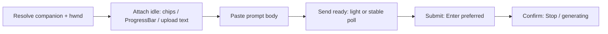

# Prompt paste / auto-send — companion readiness architecture

Shared pipeline for **Prompt Manager `[Y]`** and **D2C** (attachments / work companions) so consumer **Gemini**, **Gemini Enterprise**, and **M365 Copilot** use the same stages. Only the UIA **adapters** differ.

Companion id comes from [`ResolveGlobalAICompanion()`](global-ai-companion-routing.md) → `"gemini"` | `"enterprise"` | `"copilot"`.

**Code:** [`Utils/hotstring_selector_handlers_01.ahk`](../Utils/hotstring_selector_handlers_01.ahk) (`PromptPaste_*`, `PromptContext_*`). Efficiency notes: [efficiency-canon §13](efficiency-canon.md).

## Pipeline (all companions)

| Stage       | Shared entry                            | What it waits for                                                                                                                           |
| ----------- | --------------------------------------- | ------------------------------------------------------------------------------------------------------------------------------------------- |
| Resolve     | `PromptPaste_SubmitWhenReady`           | `companionId` + Chrome hwnd (Enterprise / Copilot / consumer finders)                                                                       |
| Attach idle | `PromptContext_WaitForAttachUploadIdle` | File chips stable **or** ProgressBar gone; upload-label Text is secondary (`PROMPT_PASTE_ATTACH_IDLE_FAST_PATH`)                            |
| Send ready  | `PromptContext_WaitForSendReady`        | After attach: short enablement poll (cap 500ms then force-submit). Without attach: stable Send + text (`PROMPT_PASTE_USE_FAST_READY_PROBE`) |
| Submit      | `PromptPaste_SubmitCompanion`           | Focus composer → `{Enter}` (`PROMPT_PASTE_SUBMIT_VIA_ENTER`) or adapter `TrySubmit`                                                         |
| Confirm     | `PromptPaste_WaitForGenerationStarted`  | Companion “Stop generating” (or equivalent), cap ~1.5s; if submit already fired, treat as OK                                                |

Busy bar: `PromptPaste_BusyEnsure` / `BusyUpdate` / `BusyHide` for the whole wait+submit+confirm window (`PROMPT_PASTE_AUTO_SEND_CAP_MS`).

## Adapter table

Same function names; branch on `companionId`.

| Concern             | `gemini`                                                                   | `enterprise`                                                               | `copilot`                                    |
| ------------------- | -------------------------------------------------------------------------- | -------------------------------------------------------------------------- | -------------------------------------------- |
| UIA root            | `UIA_Browser` → Document / `chat-app` via `PromptContext_UploadSearchRoot` | `GeminiEnterprise_ReadRootFromHwnd` (page-scoped; upload root = that root) | `CopilotWeb_ReadRootFromHwnd` (same pattern) |
| Send button         | `Gemini_FindSendButton`                                                    | `GeminiEnterprise_FindSubmitButton`                                        | `CopilotWeb_FindSendButton`                  |
| Composer text       | `GeminiPromptFieldGetTextFromUia`                                          | `GeminiEnterprise_ComposerGetTextViaUia`                                   | `CopilotWeb_ComposerGetText`                 |
| Focus before submit | Window activate (Enter path)                                               | `GeminiEnterprise_FocusComposer`                                           | `CopilotWeb_FocusComposerForHwnd`            |
| Submit leaf         | `{Enter}` or `Gemini_TrySubmitOnce`                                        | `{Enter}` or `GeminiEnterprise_TrySubmit`                                  | `{Enter}` or `CopilotWeb_TrySubmit`          |
| Generating?         | Stop button (`Gemini_HasGeneratingStopButtonForUia`)                       | `GeminiEnterprise_FindStopButton`                                          | `CopilotWeb_FindStopGenerating`              |

Chip detection is shared: ClassName `new-file-preview-file` / `file-preview` (strong on consumer Gemini), then name heuristics (`.txt` / `.csv` / …, Remove/Remover). Enterprise/Copilot chips that use different ClassNames still match via filename / remove labels under the upload root.

## Call sites

| Flow                                        | Path                                                                                 |
| ------------------------------------------- | ------------------------------------------------------------------------------------ |
| Prompt Manager `[Y]`                        | Attach files → paste → `PromptPaste_SubmitWhenReady(hwnd, companionId, attachCount)` |
| D2C + registry attaches                     | Same `PromptPaste_SubmitWhenReady`                                                   |
| D2C Enterprise / Copilot (any attach count) | Always `PromptPaste_SubmitWhenReady` (no separate Sleep+TrySubmit)                   |
| D2C consumer Gemini, no registry attaches   | Classic `Gemini_WaitForPromptContentAndSubmit` (unchanged)                           |

## Flags / rollback

| Flag                                   | Default | Role                                          |
| -------------------------------------- | ------- | --------------------------------------------- |
| `PROMPT_PASTE_ATTACH_IDLE_FAST_PATH`   | true    | Chip/ProgressBar attach exit                  |
| `PROMPT_PASTE_USE_FAST_READY_PROBE`    | true    | Merged send-ready probe                       |
| `PROMPT_PASTE_SUBMIT_VIA_ENTER`        | true    | Enter for **all** companions                  |
| `PROMPT_PASTE_GEMINI_SUBMIT_VIA_ENTER` | true    | Alias; set **either** false → UIA `TrySubmit` |
| `PROMPT_PASTE_READY_TIMING`            | false   | Optional NDJSON phase timings                 |

Proven latency work was on **consumer Gemini**; Enterprise/Copilot share the same stages and Enter-first submit so they do not keep a separate slow UIA-only send path.

## What stays companion-specific

- Window / title detection and open/focus chords ([global routing](global-ai-companion-routing.md)).
- Exact ControlType / Name / ClassName strings inside `Lib/GeminiEnterprise.ahk` and `Lib/CopilotWeb.ahk`.
- Features not yet on every peer (e.g. Enterprise read-aloud parity — see routing doc).
