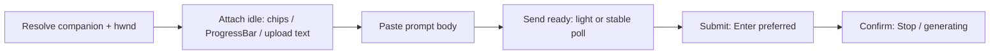

# Prompt paste / auto-send — companion readiness architecture

Shared pipeline for **Prompt Manager `[Y]`** and **D2C** (attachments / work companions) so consumer **Gemini**, **Gemini Enterprise**, and **M365 Copilot** use the same stages. Only the UIA **adapters** differ.

Companion id comes from [`ResolveGlobalAICompanion()`](global-ai-companion-routing.md) → `"gemini"` | `"enterprise"` | `"copilot"`. The after-Enter confirm also covers `"chatgpt"` (Shift keys), which is not a global-resolver companion.

**Code:** [`Utils/hotstring_selector_handlers_01.ahk`](../Utils/hotstring_selector_handlers_01.ahk) (`PromptPaste_*`, `PromptContext_*`). Efficiency notes: [efficiency-canon §13](efficiency-canon.md).

## Pipeline (all companions)

```mermaid
flowchart LR
  resolve[Resolve companion + hwnd]
  attach[Attach idle: chips / ProgressBar / upload text]
  paste[Paste prompt body]
  ready[Send ready: light or stable poll]
  submit[Submit: Enter preferred]
  confirm[Confirm: Stop / generating]
  resolve --> attach --> paste --> ready --> submit --> confirm
```

| Stage       | Shared entry                            | What it waits for                                                                                                                           |
| ----------- | --------------------------------------- | ------------------------------------------------------------------------------------------------------------------------------------------- |
| Resolve     | `PromptPaste_SubmitWhenReady`           | `companionId` + Chrome hwnd (Enterprise / Copilot / consumer finders)                                                                       |
| Attach idle | `PromptContext_WaitForAttachUploadIdle` | File chips stable **or** ProgressBar gone; upload-label Text is secondary (`PROMPT_PASTE_ATTACH_IDLE_FAST_PATH`)                            |
| Send ready  | `PromptContext_WaitForSendReady`        | After attach: short enablement poll (cap 500ms then force-submit). Without attach: stable Send + text (`PROMPT_PASTE_USE_FAST_READY_PROBE`) |
| Submit      | `PromptPaste_SubmitCompanion`           | Focus composer → `{Enter}` (`PROMPT_PASTE_SUBMIT_VIA_ENTER`) or adapter `TrySubmit`                                                         |
| Confirm     | `AiCompanion_ConfirmAfterEnter`         | Snapshot the composer, then for 3s require the stop control. Enter alone is not success. See below.                                         |

Busy bar: `PromptPaste_BusyEnsure` / `BusyUpdate` / `BusyHide` for the whole wait+submit+confirm window (`PROMPT_PASTE_AUTO_SEND_CAP_MS`).

## Adapter table

Same function names; branch on `companionId`.

| Concern             | `gemini`                                                                   | `enterprise`                                                               | `copilot`                                    |
| ------------------- | -------------------------------------------------------------------------- | -------------------------------------------------------------------------- | -------------------------------------------- |
| UIA root            | `UIA_Browser` → Document / `chat-app` via `PromptContext_UploadSearchRoot` | `GeminiEnterprise_ReadRootFromHwnd` (page-scoped; upload root = that root) | `CopilotWeb_ReadRootFromHwnd` (same pattern) |
| Send button         | `Gemini_FindSendButton`                                                    | `GeminiEnterprise_FindSubmitButton`                                        | `CopilotWeb_FindSendButton`                  |
| Composer text       | `GeminiPromptFieldGetTextFromUia`                                          | `GeminiEnterprise_ComposerGetTextViaUia`                                   | `CopilotWeb_ComposerGetText`                 |
| Focus before submit | Window activate (Enter path)                                               | `GeminiEnterprise_FocusComposer`                                           | `CopilotWeb_FocusComposerForHwnd`            |
| Submit leaf         | `{Enter}` or `Gemini_TrySubmitOnce`                                        | `{Enter}` or `GeminiEnterprise_TrySubmit`                                  | `{Enter}` or `CopilotWeb_TrySubmit`          |
| Generating?         | Stop button (`Gemini_HasGeneratingStopButtonForUia`)                       | `GeminiEnterprise_FindStopButton`                                          | `CopilotWeb_FindStopGenerating`              |

Chip detection is shared: ClassName `new-file-preview-file` / `file-preview` (strong on consumer Gemini), then name heuristics (`.txt` / `.csv` / …, Remove/Remover). Enterprise/Copilot chips that use different ClassNames still match via filename / remove labels under the upload root.

## Call sites

| Flow                                        | Path                                                                                  |
| ------------------------------------------- | ------------------------------------------------------------------------------------- |
| Prompt Manager `[Y]`                        | Attach files → paste → `PromptPaste_SubmitWhenReady(hwnd, companionId, attachCount)`  |
| D2C + registry attaches                     | Same `PromptPaste_SubmitWhenReady`                                                    |
| D2C Enterprise / Copilot (any attach count) | Always `PromptPaste_SubmitWhenReady` (no separate Sleep+TrySubmit)                    |
| D2C consumer Gemini, no registry attaches   | `Gemini_WaitForPromptContentAndSubmit` — same confirm; watch starts only on `working` |

## Flags / rollback

| Flag                                   | Default | Role                                          |
| -------------------------------------- | ------- | --------------------------------------------- |
| `PROMPT_PASTE_ATTACH_IDLE_FAST_PATH`   | true    | Chip/ProgressBar attach exit                  |
| `PROMPT_PASTE_USE_FAST_READY_PROBE`    | true    | Merged send-ready probe                       |
| `PROMPT_PASTE_SUBMIT_VIA_ENTER`        | true    | Enter for **all** companions                  |
| `PROMPT_PASTE_GEMINI_SUBMIT_VIA_ENTER` | true    | Alias; set **either** false → UIA `TrySubmit` |
| `PROMPT_PASTE_READY_TIMING`            | false   | Optional NDJSON phase timings                 |

Proven latency work was on **consumer Gemini**; Enterprise/Copilot share the same stages and Enter-first submit so they do not keep a separate slow UIA-only send path.

## Confirm after Enter

`AiCompanion_ConfirmAfterEnter(hwnd, companionId, sentText, timeoutMs := 1000, snapOk := true)` in [`Utils/ai_generation_state.ahk`](../Utils/ai_generation_state.ahk) is the check for every tracked Enter. Callers snapshot the composer first (`AiCompanion_SnapshotComposer` or `AiCompanion_SendAndConfirm`).

It runs only after that Enter, on that companion window. It does not install a timer, does not call `UIA_Browser` (which activates Chrome), and does not `FindAll` the page. The composer is found once with a targeted `FindFirst`. If the prompt is still there, the check returns in about 200ms. If it left, the stop control is polled for at most 1 second.

Receipt means the pre-Enter text is gone from the composer. Working means that companion’s stop control is visible. A stop control that is already up while the snapshot is still in the composer is `held` (this prompt was not accepted).

| Result        | Meaning                                                               | What happens                                   |
| ------------- | --------------------------------------------------------------------- | ---------------------------------------------- |
| `working`     | Stop control is visible and the snapshot is no longer in the composer | Success overlay. Completion watches may start. |
| `held`        | Snapshot is still in the composer                                     | Error overlay. Do not start a watch.           |
| `empty`       | Composer was read and blank, so nothing was sent                      | Error overlay. Do not start a watch.           |
| `unconfirmed` | Composer no longer holds the snapshot, but no stop control within 1s  | Error overlay. Do not start a watch.           |
| `unreadable`  | The UI tree could not be read and no stop control appeared            | Error overlay. Do not start a watch.           |

`snapOk` false means the snapshot itself failed. A blank `sentText` is then not treated as `empty`. Without a composer read, the result stays `unreadable` — a stop control alone is not proof this prompt was accepted.

| Companion    | Receipt (composer read)                                                     | Working (stop control)                                        |
| ------------ | --------------------------------------------------------------------------- | ------------------------------------------------------------- |
| `gemini`     | One `FindFirst` on `GEMINI_PROMPT_FIELD_NAMES` (no `FindAll`)               | `Gemini_HasGeneratingStopButtonForUia`                        |
| `enterprise` | `GeminiEnterprise_FindComposer`                                             | `GeminiEnterprise_FindStopButton`                             |
| `copilot`    | `CopilotWeb_FindComposer`                                                   | `CopilotWeb_FindStopGenerating`                               |
| `chatgpt`    | AutomationId `prompt-textarea`, else an Edit/Document named Message ChatGPT | Stop streaming / Interromper transmissão / Stop / Interromper |

Tracked Enters that use this check:

- Prompt Manager `[Y]`, D2C, pack-pipeline fix sends, and import-watcher submit (`PromptPaste_SubmitWhenReady`, or `Gemini_TrySubmit` for consumer Gemini without registry attaches).
- Enterprise and Copilot `NavigateFocusAndPaste` when `autoSubmit` is true.
- Shift Enter and Ctrl+Enter on consumer Gemini, Gemini Enterprise, and M365 Copilot.
- ChatGPT Shift+L and Shift+O.
- The temporary M365 Copilot “continue” loop.

D2C’s completion monitor and the pack pipeline arm only after `working`. Cursor chat Enter is not one of these tracked companion sends.

## What stays companion-specific

- Window / title detection and open/focus chords ([global routing](global-ai-companion-routing.md)).
- Exact ControlType / Name / ClassName strings inside `Lib/GeminiEnterprise.ahk` and `Lib/CopilotWeb.ahk`.
- Features not yet on every peer (e.g. Enterprise read-aloud parity — see routing doc).
