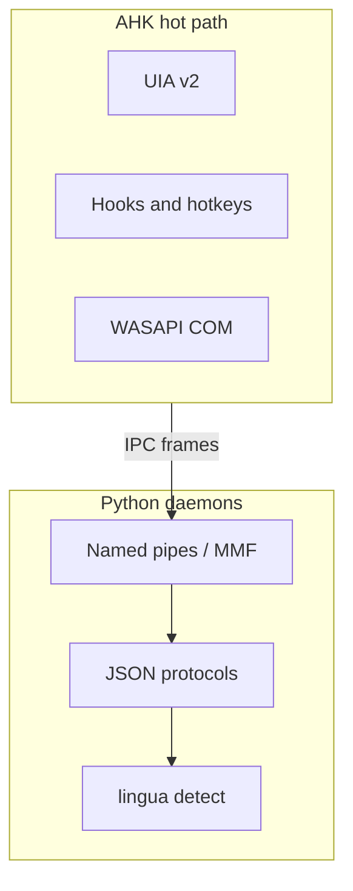

# Python library opportunities

This report surveys the AutoHotkey-centric [scripts](../README.md) repository and its small [python](../python/) footprint. The goal is to highlight where **modern, well-maintained Python libraries** would add the most value without fighting the architecture (AHK owns hotkeys, UIA, and low-latency UI; Python owns optional daemons and IPC).

---

## 1. Current state

### 1.1 Python layout and dependencies

The `python/` tree hosts **persistent IPC daemons** and shared protocol code:

| Role | Files |
|------|--------|
| Daemons | [wm_daemon.py](../python/wm_daemon.py), [applauncher_daemon.py](../python/applauncher_daemon.py), [shiftkeys_daemon.py](../python/shiftkeys_daemon.py), [gemini_daemon.py](../python/gemini_daemon.py) |
| Protocols / framing | [protocol.py](../python/protocol.py), [wm_protocol.py](../python/wm_protocol.py), [al_protocol.py](../python/al_protocol.py), [shiftkeys_protocol.py](../python/shiftkeys_protocol.py) |
| Window / hook helpers | [wm_hooks.py](../python/wm_hooks.py), [al_window_enum.py](../python/al_window_enum.py) |
| ShiftKeys context / UIA | [shiftkeys_context.py](../python/shiftkeys_context.py), [shiftkeys_uia.py](../python/shiftkeys_uia.py) (UIA layer **stubbed**) |
| Harness / diagnostics | [wm_harness.py](../python/wm_harness.py), [compare_monitor_enumeration.py](../python/compare_monitor_enumeration.py) |

Declared runtime dependencies are minimal: [requirements.txt](../python/requirements.txt) lists **pywin32** and **lingua-language-detector**. The latter is used in [gemini_daemon.py](../python/gemini_daemon.py) for language detection (`OP_DETECT_LANG`), which is already an example of pushing a non-trivial library task into Python while AHK stays on the UI path.

### 1.2 JSON and IPC

On the Python side, messages use **stdlib `json`** inside the protocol modules (length-prefixed UTF-8 frames). On the AutoHotkey side, several IPC clients implement **hand-built JSON** and simplified decoders—for example [AppLauncherIPC.ahk](../aux/AppLauncherIPC.ahk) (`AL_IPC_JsonEncodeRequest`, `AL_IPC_DecodeResponse`). Similar patterns appear in [WMIPC.ahk](../aux/WMIPC.ahk) and [ShiftKeysIPC.ahk](../aux/ShiftKeysIPC.ahk). That keeps dependencies zero in AHK but increases the risk of edge-case bugs (escaping, nested objects, unicode) whenever the protocol evolves.

### 1.3 Where automation actually lives

- **UIA and browser automation** live in AHK with [UIA-v2/Lib/UIA.ahk](../UIA-v2/Lib/UIA.ahk) and related includes. Representative flows: [Gemini.ahk](../Gemini.ahk) (copy last message, async lookup, TTS), [GeminiToCursorBridge.ahk](../GeminiToCursorBridge.ahk), [WindowManagement.ahk](../WindowManagement.ahk).
- **Audio** for Spotify uses COM/WASAPI directly in AHK: [SpotifyWASAPI.ahk](../SpotifyWASAPI.ahk).
- **Bootstrap** in [Act.ahk](../Act.ahk) uses `RunWait` with `git fetch` / `git pull`; no Python today.
- **PowerShell** is spawned from [Utils.ahk](../Utils.ahk) for several utilities (for example mic volume and recycle-bin flows). Those are candidates for consolidation **only** if you explicitly want Python as a second scripting surface with tests and structured errors.

---

## 2. High-ROI library opportunities (by theme)

### 2.1 IPC protocols: validation, speed, and safety

| Opportunity | Suggested libraries | Where it helps |
|-------------|---------------------|----------------|
| Faster UTF-8 JSON on encode/decode hot paths | **orjson** (or **msgspec** if you later want strict schemas or binary frames) | `encode_message` / `decode_message` in [protocol.py](../python/protocol.py), [wm_protocol.py](../python/wm_protocol.py), [al_protocol.py](../python/al_protocol.py), [shiftkeys_protocol.py](../python/shiftkeys_protocol.py) |
| Typed request/response envelopes and clearer validation errors | **pydantic** v2 (`BaseModel`) | Replaces or tightens ad hoc `validate_request` / dict shapes shared with AHK |
| Property-based tests for framing and unicode | **hypothesis** | Length-prefix boundaries, `ensure_ascii=False` parity with AHK consumers |

**Practical note:** You can keep AHK as the MMF writer and add a **small Python CLI used only in tests** to round-trip frames, instead of moving runtime JSON generation off AHK—unless profiling shows AHK string building is a bottleneck.

### 2.2 ShiftKeys daemon: complete the UIA path

[shiftkeys_uia.py](../python/shiftkeys_uia.py) is intentionally a stub; comments already point to **comtypes** + UI Automation, **pywinauto** (UIA backend), or similar. Implementing real `find_element` / `wait_element_state` there would match the README story of optional offload and could reduce fragile polling duplicated in AHK for the same operations.

### 2.3 Observability and developer experience

| Opportunity | Suggested libraries | Notes |
|-------------|---------------------|--------|
| Structured daemon logs (level, request id, duration) | **structlog** or **loguru** | AHK already uses NDJSON-style debug in places ([GeminiToCursorBridge.ahk](../GeminiToCursorBridge.ahk) `Bridge_Log`, agent logs in [Shift keys.ahk](../Shift keys.ahk)); Python can align on the same fields for cross-process debugging. |
| Nicer CLI for harnesses | **typer** or **click** | [wm_harness.py](../python/wm_harness.py), [compare_monitor_enumeration.py](../python/compare_monitor_enumeration.py) |
| Linting, typing, tests | **ruff**, **mypy** or **pyright**, **pytest** | Protocol modules are ideal for fast unit tests without a GUI |

### 2.4 Resilience and concurrency (optional)

| Opportunity | Suggested libraries | Tradeoff |
|-------------|---------------------|----------|
| Retries with backoff inside daemon handlers | **tenacity** | Prefer **inside Python**, not from AHK `RunWait` loops |
| Async pipe handling | **asyncio** (and possibly a Windows event loop helper if needed) | Only worth it if threading becomes a measured bottleneck; current hotkey QPS is usually low |

### 2.5 Fuzzy text and window matching

If you **centralize** more window-title or path-segment matching in Python (for example alongside [wm_daemon.py](../python/wm_daemon.py) or app-launcher enumeration), **rapidfuzz** gives high-quality fuzzy ratios without pulling in heavy ML stacks. Today, heuristics live in AHK (for example [GeminiToCursorBridge.ahk](../GeminiToCursorBridge.ahk) segment matching).

### 2.6 Data files and reporting

The README documents CSV and INI under `data/` (Pomodoro log, Wikipedia completion, scroll positions). Parsing and analytics in AHK are fine for one-off reads; if you add **batch reporting** or dashboards, **polars** is a strong default for CSV. If you automate the Excel habit tracker opened from [Act.ahk](../Act.ahk), **openpyxl** is the usual choice.

### 2.7 Git and bootstrap (low priority)

[Act.ahk](../Act.ahk) already shells to Git successfully. **GitPython** or disciplined **subprocess** wrappers only pay off if you need structured handling of conflicts, auth prompts, or unified exit reporting—not for a straight `git pull` that either works or fails visibly.

### 2.8 Audio

**pycaw** and friends can control session volume in Python but largely **duplicate** what [SpotifyWASAPI.ahk](../SpotifyWASAPI.ahk) already does well in-process. Recommendation: **keep WASAPI in AHK** unless you need Python-side metering or multi-app analytics.

### 2.9 HTTP and LLM APIs (future)

Gemini workflows in this repo are **browser- and UIA-driven**, not REST clients. If [gemini_daemon.py](../python/gemini_daemon.py) ever runs queued tasks that call HTTP APIs, **httpx** plus **pydantic** response models is a modern, maintainable stack compared to raw `urllib`.

---

## 3. Per-script notes (requested entry scripts)

| Script | Python angle |
|--------|----------------|
| [Act.ahk](../Act.ahk) | Optional richer Git handling; otherwise unchanged |
| [AppLaunchers.ahk](../AppLaunchers.ahk) | **polars** (or scripts) if you add analytics over CSV/INI |
| [CheatSheetRich.ahk](../CheatSheetRich.ahk) | Native RichEdit Win32; **no Python** |
| [Gemini.ahk](../Gemini.ahk) | UIA hot path; Python for side tasks (language detect already in daemon) |
| [GeminiToCursorBridge.ahk](../GeminiToCursorBridge.ahk) | Bridge logic stays AHK; optional **structlog** correlation if daemons participate in debugging |
| [Microsoft Teams.ahk](../Microsoft Teams.ahk), [Outlook.ahk](../Outlook.ahk) | UIA-first; Python COM automation only if you deliberately add a heavy service layer |
| [mousemaster.ahk](../mousemaster.ahk) | Low-level input; **remain AHK** |
| [Shift keys.ahk](../Shift keys.ahk) | Largest surface; best Python wins are **shiftkeys_uia** completion and optional fuzzy helpers in daemon |
| [Spotify.ahk](../Spotify.ahk), [SpotifyWASAPI.ahk](../SpotifyWASAPI.ahk) | Current WASAPI approach is appropriate |
| [Utils.ahk](../Utils.ahk) | Optional small Python CLIs with **typer** to replace scattered PowerShell where testability matters |
| [WindowManagement.ahk](../WindowManagement.ahk) | Already integrated with [wm_daemon.py](../python/wm_daemon.py); strengthen protocols with **pydantic** / **orjson** |

---

## 4. Suggested priority order

1. **pydantic** and **orjson** on shared protocol encode/decode (low behavioral risk, clear maintainability and performance upside).
2. **Real implementation of [shiftkeys_uia.py](../python/shiftkeys_uia.py)** with comtypes, pywinauto, or an equivalent UIA binding—delivers on the existing daemon design.
3. **structlog** (or loguru) plus **pytest** for the `python/` tree—improves confidence when changing IPC.
4. **rapidfuzz** if you move more window matching into Python for a single source of truth.
5. GitPython, openpyxl, httpx, and async refactors only when a **concrete feature** justifies the dependency and process boundary.

---

## 5. AHK versus Python boundary

**Rule of thumb:** keep anything that must complete in tens of milliseconds on a keypress in AHK; use Python for caching, enumeration, background tasks, validation-heavy JSON, and library ecosystems that are painful to reimplement in AHK.

---

## Appendix A: AutoHotkey files in this repository

Entry and domain scripts:

- [Act.ahk](../Act.ahk), [Shift keys.ahk](../Shift%20keys.ahk), [Utils.ahk](../Utils.ahk), [WindowManagement.ahk](../WindowManagement.ahk), [AppLaunchers.ahk](../AppLaunchers.ahk)
- [Gemini.ahk](../Gemini.ahk), [Microsoft Teams.ahk](../Microsoft%20Teams.ahk), [Outlook.ahk](../Outlook.ahk), [Spotify.ahk](../Spotify.ahk), [SpotifyWASAPI.ahk](../SpotifyWASAPI.ahk)
- [GeminiToCursorBridge.ahk](../GeminiToCursorBridge.ahk), [CheatSheetRich.ahk](../CheatSheetRich.ahk), [mousemaster.ahk](../mousemaster.ahk)

Supporting and library paths:

- IPC and harnesses: [aux/AppLauncherIPC.ahk](../aux/AppLauncherIPC.ahk), [aux/WMIPC.ahk](../aux/WMIPC.ahk), [aux/ShiftKeysIPC.ahk](../aux/ShiftKeysIPC.ahk), [aux/GeminiIPC.ahk](../aux/GeminiIPC.ahk), [aux/AL_IPC_Harness.ahk](../aux/AL_IPC_Harness.ahk), [aux/WM_IPC_Harness.ahk](../aux/WM_IPC_Harness.ahk)
- UIA v2: [UIA-v2/Lib/UIA.ahk](../UIA-v2/Lib/UIA.ahk), [UIA-v2/Lib/UIA_Browser.ahk](../UIA-v2/Lib/UIA_Browser.ahk), [UIA-v2/UIATreeInspector.ahk](../UIA-v2/UIATreeInspector.ahk)
- Other: [Lib/Media.ahk](../Lib/Media.ahk), [tools/MonitorEnumerationSnapshot.ahk](../tools/MonitorEnumerationSnapshot.ahk), [env.ahk](../env.ahk) (local / not always in repo)

---

## Appendix B: Python modules (roles)

| Module | Role |
|--------|------|
| [wm_daemon.py](../python/wm_daemon.py) | Named-pipe server for window-management IPC |
| [wm_protocol.py](../python/wm_protocol.py), [wm_hooks.py](../python/wm_hooks.py) | WM message schema and optional hook-backed cache |
| [wm_harness.py](../python/wm_harness.py) | Client harness for latency / ping checks |
| [applauncher_daemon.py](../python/applauncher_daemon.py) | MMF-based app launcher daemon |
| [al_protocol.py](../python/al_protocol.py), [al_window_enum.py](../python/al_window_enum.py) | AL framing and window enumeration helpers |
| [shiftkeys_daemon.py](../python/shiftkeys_daemon.py) | Named-pipe server for ShiftKeys automation offload |
| [shiftkeys_protocol.py](../python/shiftkeys_protocol.py) | ShiftKeys message schema |
| [shiftkeys_context.py](../python/shiftkeys_context.py) | Foreground / context hooks (pywin32 COM message pump) |
| [shiftkeys_uia.py](../python/shiftkeys_uia.py) | UIA find/wait stubs (intended for real implementation) |
| [gemini_daemon.py](../python/gemini_daemon.py) | Gemini IPC daemon; task queue and **lingua** language detection |
| [protocol.py](../python/protocol.py) | Gemini daemon JSON framing helpers |
| [compare_monitor_enumeration.py](../python/compare_monitor_enumeration.py) | Diagnostic compare for monitor enumeration vs AHK |

---

*Generated as a codebase survey; implementing any library change should be done in small steps with daemon harnesses and AHK feature flags, per [windowmanagement-daemon-verify.md](windowmanagement-daemon-verify.md).*
