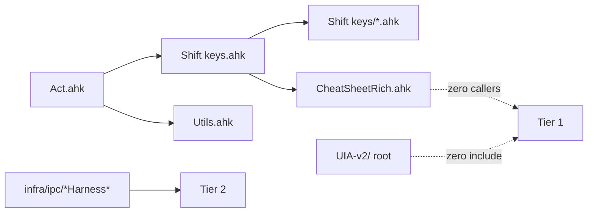

# Unused code audit

Audit date: 2026-06-21. This document lists code that does **not** participate in the production runtime graph, with grep evidence and recommended actions. It does **not** embed source code (inventory only).

---

## Methodology

1. **Entry points** — scripts launched by [`Act.ahk`](../Act.ahk) plus [`Spotify.ahk`](../Spotify.ahk) (Quick Update relaunch via [`Utils/macros_system.ahk`](../Utils/macros_system.ahk)).
2. **`#include` graph** — traced from `Shift keys.ahk`, `Utils.ahk`, `AppLaunchers.ahk`, `WindowManagement.ahk`, `Gemini.ahk`, `Outlook.ahk`, `Microsoft Teams.ahk`, `mousemaster.ahk`.
3. **Cross-check** — filename grep across the repo; if zero inbound references (or only self/docs) → candidate.
4. **Three tiers** — Tier 1 = safe to remove; Tier 2 = manual dev tools (keep); Tier 3 = deprecated labels but still loaded.

---

## Summary table (Tier 1 only)

| Item                                                                  | Type                      | Lines / files   | Evidence                                                    | Action                                                    |
| --------------------------------------------------------------------- | ------------------------- | --------------- | ----------------------------------------------------------- | --------------------------------------------------------- |
| [`Shift keys/CheatSheetRich.ahk`](../Shift%20keys/CheatSheetRich.ahk) | File                      | ~198            | `#include`d but zero external callers of `CheatSheet_Rich*` | Delete file; remove `#include` from `Shift keys.ahk`      |
| [`UIA-v2/`](../UIA-v2/) (repo root)                                   | Folder                    | 5 files         | Zero `#include` without `vendor\` prefix                    | Delete folder; keep [`vendor/UIA-v2/`](../vendor/UIA-v2/) |
| [`tools/`](../tools/) (repo root)                                     | Folder                    | 6 files         | Production uses `infra\tools\` only                         | Delete folder                                             |
| [`aux/`](../aux/)                                                     | Folder                    | 12 files        | Gitignored mirror; zero production refs                     | Delete local folder                                       |
| [`infra/aux/`](../infra/aux/)                                         | Folder                    | 10 files        | Gitignored mirror; zero production refs                     | Delete local folder                                       |
| `AgentDebugLog()` + calls                                             | Dead code in active files | 1 fn + 10 calls | No-op function; calls have no effect                        | Remove function and all calls                             |

---

## Tier 1 — Safe to remove

### 1. `Shift keys/CheatSheetRich.ahk` (~198 lines)

- **Included from:** [`Shift keys.ahk:44`](../Shift keys.ahk) — `#include %A_ScriptDir%\Shift keys\CheatSheetRich.ahk`
- **Evidence:** `grep CheatSheet_Rich` — all matches are **inside** `CheatSheetRich.ahk` only. No caller in `cheat_sheet_gui.ahk`, `config.ahk`, or elsewhere.
- **Docs:** [`docs/cheat-sheet.md`](cheat-sheet.md) line 38 — _“no longer used by the overlays”_.
- **Replacement:** ListView overlays in [`Shift keys/cheat_sheet_gui.ahk`](../Shift%20keys/cheat_sheet_gui.ahk).
- **Action:** Remove `#include` line; delete file; update cheat-sheet doc.

### 2. Root `UIA-v2/` (duplicate of `vendor/UIA-v2/`)

| File                          |
| ----------------------------- |
| `UIA-v2/Lib/UIA.ahk`          |
| `UIA-v2/Lib/UIA_Browser.ahk`  |
| `UIA-v2/UIATreeInspector.ahk` |
| `UIA-v2/README.md`            |
| `UIA-v2/LICENSE`              |

- **Evidence:** All production `#include`s use `vendor\UIA-v2\Lib\...` (Shift keys, Utils, AppLaunchers, Gemini, Outlook, Teams, Spotify, mousemaster). Grep for root `UIA-v2\` in `*.ahk` → **0 matches**.
- **Canonical path:** [`vendor/UIA-v2/`](../vendor/UIA-v2/).
- **Action:** Delete root `UIA-v2/` folder.

### 3. Root `tools/` (duplicate of `infra/tools/`)

| File                                   |
| -------------------------------------- |
| `tools/MonitorEnumerationSnapshot.ahk` |
| `tools/TestStudyLinkApi.ahk`           |
| `tools/VSCodeEvidenceSearch.ahk`       |
| `tools/restart-script.ps1`             |
| `tools/Set-MicVolume.ps1`              |
| `tools/SetAutoHotkeyVolume.ps1`        |

- **Evidence:** Production references only `infra\tools\`:
  - [`Shift keys.ahk:309`](../Shift keys.ahk) → `infra\tools\VSCodeEvidenceSearch.ahk`
  - [`Utils/global_sound_audio.ahk`](../Utils/global_sound_audio.ahk) → `infra\tools\Set-MicVolume.ps1`
- **Stale doc:** legacy `python/compare_monitor_enumeration.py` (if present) pointed at `tools\`; canonical copy [`infra/python/compare_monitor_enumeration.py`](../infra/python/compare_monitor_enumeration.py) already uses `infra\tools\`.
- **Action:** Delete root `tools/` folder.

### 4. `aux/` and `infra/aux/` (gitignored mirrors)

- **Evidence:** [`.gitignore`](../.gitignore) lines 7–9 — _“use `infra/ipc/` instead”_. Grep `aux\` in `*.ahk` production files → **0 matches**.
- **Contents:** Mirrors of `infra/ipc/` (IPC modules, harnesses, `Verify-UtilsWarn.ahk`, `Chrome_Detach_Debug.ahk`, etc.).
- **Canonical path:** [`infra/ipc/`](../infra/ipc/).
- **Action:** Delete local `aux/` and `infra/aux/` folders.

### 5. `AgentDebugLog` instrumentation (no-op)

| Location                                                                            | Detail                                                    |
| ----------------------------------------------------------------------------------- | --------------------------------------------------------- |
| [`Shift keys/helpers.ahk`](../Shift%20keys/helpers.ahk)                             | `AgentDebugLog()` — explicit no-op (`return` immediately) |
| [`Shift keys/predicates_chrome_pdf.ahk`](../Shift%20keys/predicates_chrome_pdf.ahk) | 4 calls: H1–H4                                            |
| [`Shift keys/hotif_chrome_pdf.ahk`](../Shift%20keys/hotif_chrome_pdf.ahk)           | 6 calls: H5–H10                                           |

- **Evidence:** Function body does nothing; removing calls does not change behavior.
- **Action:** Delete function and all `#region agent log` blocks / call sites.

---

## Tier 2 — Manual dev tools (keep; not in production graph)

These are **intentionally** run by hand, not `#include`d by entry points:

| File                                                                                          | Purpose                                  |
| --------------------------------------------------------------------------------------------- | ---------------------------------------- |
| [`infra/ipc/AL_IPC_Harness.ahk`](../infra/ipc/AL_IPC_Harness.ahk)                             | Manual IPC ping — AppLaunchers           |
| [`infra/ipc/WM_IPC_Harness.ahk`](../infra/ipc/WM_IPC_Harness.ahk)                             | Manual IPC ping — WindowManagement       |
| [`infra/ipc/Chrome_Detach_Debug.ahk`](../infra/ipc/Chrome_Detach_Debug.ahk)                   | Chrome detach debug (`Ctrl+Alt+Shift+D`) |
| [`infra/ipc/Verify-UtilsWarn.ahk`](../infra/ipc/Verify-UtilsWarn.ahk)                         | Smoke test `#Warn LocalSameAsGlobal`     |
| [`infra/tools/MonitorEnumerationSnapshot.ahk`](../infra/tools/MonitorEnumerationSnapshot.ahk) | Multi-monitor enumeration snapshot       |
| [`infra/tools/TestStudyLinkApi.ahk`](../infra/tools/TestStudyLinkApi.ahk)                     | Study Link API smoke test                |
| [`vendor/UIA-v2/UIATreeInspector.ahk`](../vendor/UIA-v2/UIATreeInspector.ahk)                 | Standalone UIA tree inspector            |

---

## Tier 3 — Deprecated / temporary labels, still loaded

Do **not** treat as dead code until explicitly removed from orchestrators:

| File                                                                        | Loaded by                                 | Note                                                                                                |
| --------------------------------------------------------------------------- | ----------------------------------------- | --------------------------------------------------------------------------------------------------- |
| [`Utils/dictation_legacy.ahk`](../Utils/dictation_legacy.ahk)               | [`Utils.ahk:137`](../Utils.ahk)           | Marked deprecated in MODULARIZATION_PROGRESS                                                        |
| [`Shift keys/m365_copilot_temp.ahk`](../Shift%20keys/m365_copilot_temp.ahk) | [`Shift keys.ahk:305`](../Shift keys.ahk) | TEMPORARY M365 Copilot auto-continue                                                                |
| `app_hotkeys.ahk`, `cheat_sheet_data.ahk`                                   | —                                         | Already removed; replaced by [`cheat_sheet_registry.ahk`](../Shift%20keys/cheat_sheet_registry.ahk) |

---

## Not in this audit (confirmed active)

- All modular files under `Shift keys/`, `Utils/`, `AppLaunchers/`, `Gemini/`, `WindowManagement/`, `lib/` — reachable via orchestrator `#include` lists.
- Production IPC: `WMIPC.ahk`, `GeminiIPC.ahk`, `AppLauncherIPC.ahk`, `ShiftKeysIPC.ahk`, `ClipboardFiles.ahk`.
- [`Spotify.ahk`](../Spotify.ahk) — not in `Act.ahk`, but relaunched by Quick Update (`GetScriptFiles()` in `macros_system.ahk`).

---

## Follow-up checklist

- [x] Create this audit document
- [x] Delete Tier 1 files and folders
- [x] Remove `#include` of `CheatSheetRich.ahk` from `Shift keys.ahk`
- [x] Remove `AgentDebugLog` and call sites
- [x] Update [`docs/cheat-sheet.md`](cheat-sheet.md) (remove CheatSheetRich paragraph)
- [x] Validate: `AutoHotkey64.exe /validate "Shift keys.ahk"`

**Note:** `vendor/UIA-v2/` is an active dependency, tracked as a **git submodule** (see [`.gitmodules`](../.gitmodules)). Fresh clones need `git submodule update --init vendor/UIA-v2`.

---

## Impact review (2026-06-21)

Tier 1 deletions (`CheatSheetRich.ahk`, `AgentDebugLog`, duplicate `UIA-v2/`/`tools/`/`aux/` folders) do **not** affect production runtime. Verified:

- Cheat sheet: `cheat_sheet_registry.ahk` + `cheat_sheet_gui.ahk` (ListView)
- UIA: all entry points `#include vendor\UIA-v2\Lib\...`
- IPC/tools: `infra/ipc/`, `infra/tools/` only
- `/validate Shift keys.ahk` — pass

Follow-up completed: duplicate local folders absent; MODULARIZATION docs updated (`aux/` → `infra/ipc/`); `.gitmodules` added for submodule clones.
