# Quick Recall

<strong>Data Analyst</strong> · 9 palaces · 36 atoms

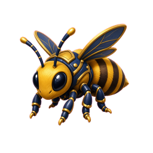 [Be] bee [<kbd><strong><u>INNER JOIN</u></strong></kbd>] [I return only the <kbd><strong><u>records</u></strong></kbd>] [that have <kbd><strong><u>matching values</u></strong></kbd>] [in <kbd><strong><u>both tables</u></strong></kbd>] — Note: Unmatched rows are completely excluded.
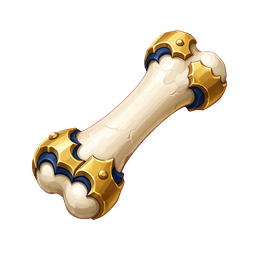 [Bf] Bone frog [<kbd><strong><u>LEFT JOIN</u></strong></kbd>] [I return all <kbd><strong><u>records</u></strong></kbd>] [from the <kbd><strong><u>left table</u></strong></kbd>] [and fill missing right matches with <kbd><strong><u>NULLs</u></strong></kbd>]
 [Bg] Bone goat [<kbd><strong><u>FULL OUTER JOIN</u></strong></kbd>] [I return all <kbd><strong><u>records</u></strong></kbd>] [from <kbd><strong><u>both tables</u></strong></kbd>] [and fill any missing sides with <kbd><strong><u>NULLs</u></strong></kbd>] — Note: It essentially combines the results of both a left join and a right join.

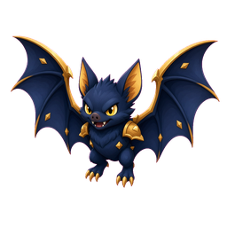 [Ba] bat [<kbd><strong><u>SQL Advanced Analytics</u></strong></kbd>] [I <kbd><strong><u>extract</u></strong></kbd> nested subqueries using CTEs] [and apply <kbd><strong><u>window functions</u></strong></kbd>] [to <kbd><strong><u>evaluate</u></strong></kbd> specific data subsets] — Note: This combines structural organization with advanced analytical evaluations in a single query.
 [Bb] Bone bird of paradise [<kbd><strong><u>Temporary Tables</u></strong></kbd>] [I <kbd><strong><u>store</u></strong></kbd> the output of heavy computation] [in a <kbd><strong><u>temporary table</u></strong></kbd>] [to prevent the database from <kbd><strong><u>re-executing</u></strong></kbd> it] — Note: CTEs re-execute from scratch each time, which is inefficient for massive datasets.
 [Bc] Bone cat [<kbd><strong><u>HAVING Clause</u></strong></kbd>] [I <kbd><strong><u>filter</u></strong></kbd> summary rows] [after they have been <kbd><strong><u>processed</u></strong></kbd>] [by the GROUP BY <kbd><strong><u>aggregation</u></strong></kbd>] — Note: The WHERE clause filters individual rows before any data grouping occurs.
 [Bd] Bone dragon [<kbd><strong><u>GROUP BY Scope</u></strong></kbd>] [I <kbd><strong><u>include</u></strong></kbd> any non-aggregated column] [from the <kbd><strong><u>SELECT statement</u></strong></kbd>] [inside the <kbd><strong><u>GROUP BY clause</u></strong></kbd>] — Note: This ensures identical data combinations correctly collapse into a single summary row.

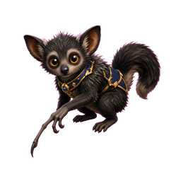 [Ay] aye-aye [<kbd><strong><u>Viewpoint</u></strong></kbd> Controls: I show two windows together] [<kbd><strong><u>overview</u></strong></kbd> plus enlarged <kbd><strong><u>detail</u></strong></kbd> of one area]
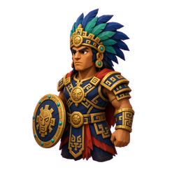 [Az] Aztec [<kbd><strong><u>Rearrangement</u></strong></kbd>: I change marks and <kbd><strong><u>axis</u></strong></kbd> values] [so the new layout can change what I <kbd><strong><u>understand</u></strong></kbd>]

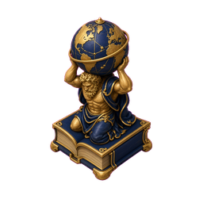 [At] atlas [<kbd><strong><u>Glyph</u></strong></kbd>: a graphic entity] [whose <kbd><strong><u>attributes</u></strong></kbd> are <kbd><strong><u>driven</u></strong></kbd> by data <kbd><strong><u>attributes</u></strong></kbd>]
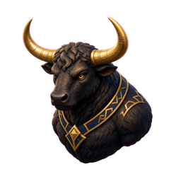 [Au] auroch [Dense <kbd><strong><u>Pixel</u></strong></kbd> Displays: I <kbd><strong><u>map</u></strong></kbd> each value to individual pixels] [and form a <kbd><strong><u>polygon</u></strong></kbd> per data dimension]
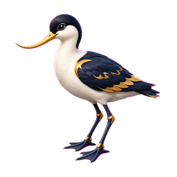 [Av] avocet [View <kbd><strong><u>Transformation</u></strong></kbd>: creates new <kbd><strong><u>views</u></strong></kbd>] [of the visual structure] [for my <kbd><strong><u>needs</u></strong></kbd>]
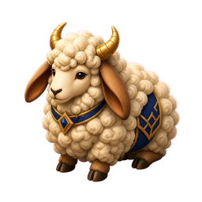 [Aw] awassi sheep [<kbd><strong><u>Location</u></strong></kbd> Investigations: I use a data mark's <kbd><strong><u>location</u></strong></kbd>] [to <kbd><strong><u>reveal</u></strong></kbd> extra table <kbd><strong><u>information</u></strong></kbd>]
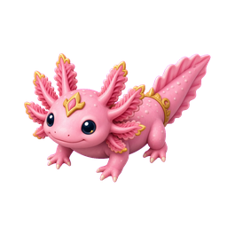 [Ax] axolotl [<kbd><strong><u>Distortions</u></strong></kbd>: show focus and <kbd><strong><u>context</u></strong></kbd>] [in the <kbd><strong><u>same</u></strong></kbd> visual structure at once]

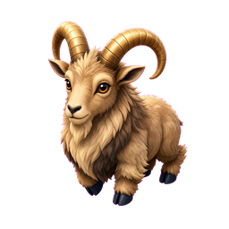 [Ao] aoudad [<kbd><strong><u>Multivariate</u></strong></kbd> Line Charts: I tell dimensions apart] [by color, <kbd><strong><u>width</u></strong></kbd>, or line <kbd><strong><u>style</u></strong></kbd>]
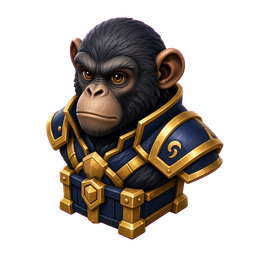 [Ap] ape [<kbd><strong><u>Parallel</u></strong></kbd> Coordinates: I draw each variable as a <kbd><strong><u>parallel</u></strong></kbd> axis] [and turn each <kbd><strong><u>tuple</u></strong></kbd> into a <kbd><strong><u>polyline</u></strong></kbd>]
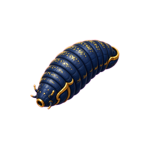 [Aq] aquatic leech [<kbd><strong><u>Radial</u></strong></kbd> Axis Techniques: I use polar axes] [to study <kbd><strong><u>cyclical</u></strong></kbd> events and <kbd><strong><u>seasonality</u></strong></kbd>]
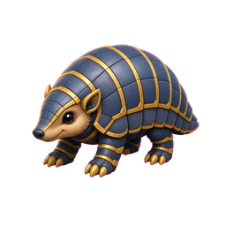 [Ar] armadillo [Table <kbd><strong><u>Lens</u></strong></kbd>: I combine reordering, bar-sized <kbd><strong><u>marks</u></strong></kbd>, and semantic <kbd><strong><u>zoom</u></strong></kbd>] [by row and column]
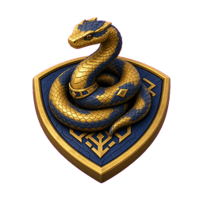 [As] asp [Parallel <kbd><strong><u>Sets</u></strong></kbd>: like Parallel Coordinates] [but focused on <kbd><strong><u>nominal</u></strong></kbd> variables]

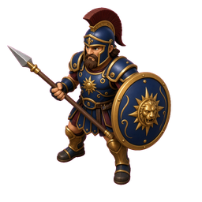 [Aj] Ajax [Visual <kbd><strong><u>Mapping</u></strong></kbd>: I link each data-table <kbd><strong><u>variable</u></strong></kbd>] [to a graphical or spatial <kbd><strong><u>property</u></strong></kbd>]
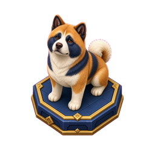 [Ak] Akita (dog breed) [<kbd><strong><u>Automatic</u></strong></kbd> Visual Processing: I aid search and pattern detection] [with automatically <kbd><strong><u>processed</u></strong></kbd> properties] [like <kbd><strong><u>color</u></strong></kbd> and size]
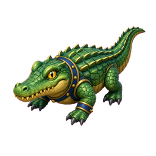 [Al] alligator [<kbd><strong><u>Expressiveness</u></strong></kbd>: my visual mapping must express all table <kbd><strong><u>data</u></strong></kbd>] [and <kbd><strong><u>only</u></strong></kbd> that <kbd><strong><u>data</u></strong></kbd>]
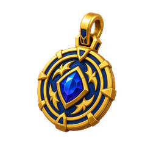 [Am] amulet [<kbd><strong><u>Effectiveness</u></strong></kbd>: fast easy <kbd><strong><u>distinction</u></strong></kbd> of data] [with as few interpretation <kbd><strong><u>errors</u></strong></kbd> as possible]
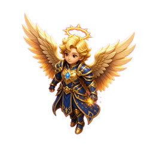 [An] angel [<kbd><strong><u>RadViz</u></strong></kbd>: I place N anchors on a circle] [and <kbd><strong><u>pull</u></strong></kbd> points by <kbd><strong><u>Hooke</u></strong></kbd> spring balance]

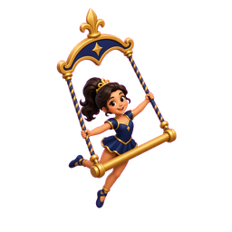 [Ae] aerialist [<kbd><strong><u>Database</u></strong></kbd> <kbd><strong><u>Schema</u></strong></kbd>: I treat it as the structural blueprint] [of my <kbd><strong><u>database</u></strong></kbd>] [including tables, fields, <kbd><strong><u>relationships</u></strong></kbd>, and constraints]
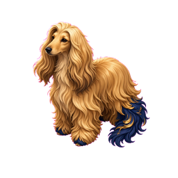 [Af] Afghan hound [Visual <kbd><strong><u>Structure</u></strong></kbd>: the set of visual elements] [that <kbd><strong><u>represent</u></strong></kbd> a <kbd><strong><u>dataset</u></strong></kbd>]
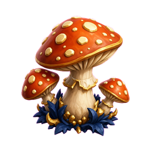 [Ag] Agaric fungi [Spatial <kbd><strong><u>Substrate</u></strong></kbd>: the area available] [to <kbd><strong><u>display</u></strong></kbd> the <kbd><strong><u>dataset</u></strong></kbd>]
 [Ah] Ah!—a sigh [<kbd><strong><u>Marks</u></strong></kbd>: objects present] [in the <kbd><strong><u>chart</u></strong></kbd> <kbd><strong><u>space</u></strong></kbd>] — Note: <kbd><strong><u>Marks</u></strong></kbd> use graphical and spatial properties to show data values.
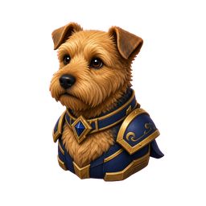 [Ai] Airedale terrier [Small <kbd><strong><u>Multiples</u></strong></kbd>: they force visual <kbd><strong><u>comparison</u></strong></kbd>] [of changes, differences, and <kbd><strong><u>alternatives</u></strong></kbd>]

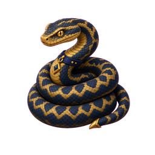 [Ad] adder [I store data without fixed <kbd><strong><u>tables</u></strong></kbd>] [using flexible <kbd><strong><u>formats</u></strong></kbd>] [for horizontal <kbd><strong><u>scaling</u></strong></kbd>] — Note: Uses documents, key-value pairs, wide columns, or graphs to adapt easily to changing schemas.

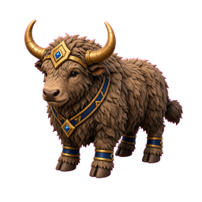 [Y] yak [I unpivot multiple <kbd><strong><u>columns</u></strong></kbd> into rows] [to <kbd><strong><u>model</u></strong></kbd> my data more easily] — Note: Column headers become an attribute column paired with a single value column.
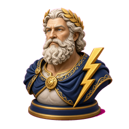 [Z] Zeus [My unpivot step automatically <kbd><strong><u>deletes</u></strong></kbd> all rows] [with <kbd><strong><u>null</u></strong></kbd> values] — Note: Power Query has no built-in setting or parameter to turn off this automatic removal.
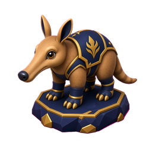 [Aa] aardvark [I replace nulls with a temporary <kbd><strong><u>placeholder</u></strong></kbd>] [before <kbd><strong><u>unpivoting</u></strong></kbd>] [to <kbd><strong><u>swap</u></strong></kbd> them back afterward] — Note: This prevents Power Query from dropping rows during the unpivot step.
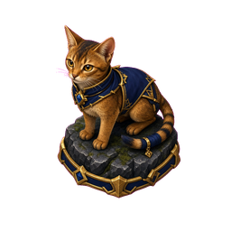 [Ab] Abyssinian cat [I <kbd><strong><u>reuse</u></strong></kbd> my query steps] [across different <kbd><strong><u>files</u></strong></kbd>] [sharing the exact same table <kbd><strong><u>structure</u></strong></kbd>] — Note: Identical column headers and data formats are required so the query steps run without error.
 [Ab] Abyssinian cat [I <kbd><strong><u>copy</u></strong></kbd> all transformation steps] [below the initial <kbd><strong><u>source</u></strong></kbd> line] [from the Advanced <kbd><strong><u>Editor</u></strong></kbd>] — Note: The first line contains the specific file <kbd><strong><u>source</u></strong></kbd> path that must not overwrite the new table's connection.
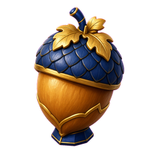 [Ac] acorn [I <kbd><strong><u>store</u></strong></kbd> data] [in rigid <kbd><strong><u>tables</u></strong></kbd> of rows and columns] [linked by predefined <kbd><strong><u>relationships</u></strong></kbd>] — Note: Enforces schemas and data integrity using SQL validation rules.

<strong>Piano</strong> · 4 palaces · 11 atoms

 [Al] alligator Bass F sits on the second line from the top and acts as a symmetrical mirror image to Treble G around Middle C.
 [Am] amulet Middle C for the left hand is drawn with a downward stem on a ledger line above the bass staff.
 [An] angel Moving to an adjacent white key on the piano means stepping between a line note and a space note on the musical staff.
 [Ao] aoudad Treble F is located in the first space at the very bottom of the treble staff
 [Ap] ape Musical note names must be written in uppercase letters because lowercase letters represent different concepts in music theory notation.

 [Aj] Ajax Stacked notes sharing a single stem mean the notes are played simultaneously.
 [Ak] Akita (dog breed) Good posture involves sitting straight with the head lifted upward as if pulled by a string, while keeping the shoulders relaxed.

 [Ai] Airedale terrier Counting out loud and clapping physically reinforces the rhythm and prevents speed changes.

 [Af] Afghan hound A line note has a staff line passing directly through its center, similar to a bead on a string.
 [Ag] Agaric fungi A space note is a musical note that rests entirely in the empty gap between two staff lines.
 [Ah] Ah!—a sigh A cadence is a harmonic progression at the end of a musical phrase that provides a sense of resolution or punctuation.

