# Quick Recall

<strong>Data Analyst</strong> · 11 palaces · 45 atoms

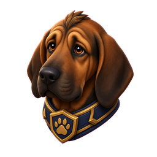 [Bl] bloodhound <strong><ins>[No-Code Integration]</ins></strong><kbd>(magic wand)</kbd> [I use an <strong><ins>[intermediary platform]</ins></strong><kbd>(bridge)</kbd>] [to <strong><ins>[connect data sources]</ins></strong><kbd>(plug)</kbd>] [to <strong><ins>[Power BI]</ins></strong><kbd>(battery)</kbd>] [in a <strong><ins>[fully automated way]</ins></strong><kbd>(robot)</kbd>] — Note: These platforms clean messy responses and schedule updates but may lack support for complex mechanics like pagination.
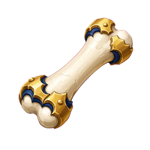 [Bm] Bone marmoset <strong><ins>[Native Web Connection]</ins></strong><kbd>(spider web)</kbd> [I <strong><ins>[connect a web endpoint]</ins></strong><kbd>(cable)</kbd>] [to <strong><ins>[Power BI]</ins></strong><kbd>(battery)</kbd>] [by <strong><ins>[specifying parameters]</ins></strong><kbd>(dial)</kbd>] <strong><ins>[directly in the URL]</ins></strong><kbd>(address bar)</kbd> — Note: This method is free and simple for one-time imports but lacks scalability for rate limits or complex authentication.
 [Bn] Bone Neanderthal <strong><ins>[Custom Scripting]</ins></strong><kbd>(scroll)</kbd> [I <strong><ins>[write custom scripts]</ins></strong><kbd>(quill)</kbd>] [to <strong><ins>[fetch API data]</ins></strong><kbd>(fishing rod)</kbd>] [and <strong><ins>[load it]</ins></strong><kbd>(dump truck)</kbd>] [into a <strong><ins>[data warehouse]</ins></strong><kbd>(forklift)</kbd>] — Note: This provides unmatched flexibility and optimization for big data, but requires significant coding complexity and infrastructure maintenance.
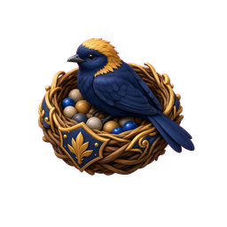 [Bo] bower-bird <strong><ins>[Push Datasets]</ins></strong><kbd>(button)</kbd> [I <strong><ins>[stream data]</ins></strong><kbd>(hose)</kbd>] [directly into <strong><ins>[Power BI]</ins></strong><kbd>(battery)</kbd>] [using its <strong><ins>[REST API]</ins></strong><kbd>(menu)</kbd>] — Note: This method does not support relationships or joins, so all complex data models must be flattened before ingestion.

 [Bh] Bone Hydra <strong><ins>[LAG Function]</ins></strong><kbd>(lagging foot)</kbd> [I <strong><ins>[query data]</ins></strong><kbd>(magnifying glass)</kbd>] [from <strong><ins>[preceding rows]</ins></strong><kbd>(footprints)</kbd>] [relative to the <strong><ins>[current evaluation row]</ins></strong><kbd>(anchor)</kbd>] — Note: It requires an explicit ordering clause and evaluates to null when a preceding row does not exist.
 [Bh] Bone Hydra <strong><ins>[LEAD Function]</ins></strong><kbd>(leash)</kbd> [I <strong><ins>[query data]</ins></strong><kbd>(binoculars)</kbd>] [from <strong><ins>[subsequent rows]</ins></strong><kbd>(stepping stone)</kbd>] [relative to the <strong><ins>[current evaluation row]</ins></strong><kbd>(compass)</kbd>] — Note: It returns a null value at the final dataset record where no subsequent row exists.
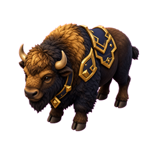 [Bi] bison <strong><ins>[PARTITION BY]</ins></strong><kbd>(glass divider)</kbd> [I <strong><ins>[divide the result set]</ins></strong><kbd>(pizza slicer)</kbd>] <strong><ins>[into partitions]</ins></strong><kbd>(cubicle)</kbd> [and <strong><ins>[calculate the window function]</ins></strong><kbd>(abacus)</kbd>] [while <strong><ins>[preserving individual row details]</ins></strong><kbd>(magnifying glass)</kbd>] — Note: GROUP BY reduces the output by collapsing multiple rows into a single summary row.
 [Bj] Bone jester <strong><ins>[Isolated Aggregation]</ins></strong><kbd>(test tube)</kbd> [I <strong><ins>[isolate a single column]</ins></strong><kbd>(tweezers)</kbd>] [for an <strong><ins>[aggregate function]</ins></strong><kbd>(blender)</kbd>] [without changing the <strong><ins>[query&#x27;s granularity]</ins></strong><kbd>(sandglass)</kbd>]
 [Bk] Bone kitten <strong><ins>[Inline Aggregate Shortcut]</ins></strong><kbd>(syringe)</kbd> [I <strong><ins>[inject aggregated metrics]</ins></strong><kbd>(needle)</kbd>] [directly into an <strong><ins>[un-grouped query]</ins></strong><kbd>(open book)</kbd>] [using a <strong><ins>[single OVER clause]</ins></strong><kbd>(blanket)</kbd>]

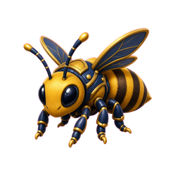 [Be] bee <strong><ins>[INNER JOIN]</ins></strong><kbd>(bullseye)</kbd> [I return only the <strong><ins>[records]</ins></strong><kbd>(vinyl record)</kbd>] [that have <strong><ins>[matching values]</ins></strong><kbd>(puzzle piece)</kbd>] [in <strong><ins>[both tables]</ins></strong><kbd>(twins)</kbd>] — Note: Unmatched rows are completely excluded.
 [Bf] Bone frog <strong><ins>[LEFT JOIN]</ins></strong><kbd>(left hand)</kbd> [I return all <strong><ins>[records]</ins></strong><kbd>(vinyl record)</kbd>] [from the <strong><ins>[left table]</ins></strong><kbd>(table)</kbd>] [and fill missing right matches with <strong><ins>[NULLs]</ins></strong><kbd>(ghost)</kbd>]
 [Bg] Bone goat <strong><ins>[FULL OUTER JOIN]</ins></strong><kbd>(outer space)</kbd> [I return all <strong><ins>[records]</ins></strong><kbd>(vinyl record)</kbd>] [from <strong><ins>[both tables]</ins></strong><kbd>(table)</kbd>] [and fill any missing sides with <strong><ins>[NULLs]</ins></strong><kbd>(ghost)</kbd>] — Note: It essentially combines the results of both a left join and a right join.

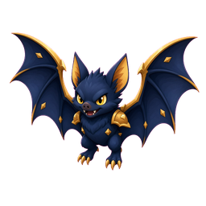 [Ba] bat <strong><ins>[SQL Advanced Analytics]</ins></strong><kbd>(dashboard)</kbd> [I <strong><ins>[extract]</ins></strong><kbd>(tweezers)</kbd> nested subqueries using CTEs] [and apply <strong><ins>[window functions]</ins></strong><kbd>(window)</kbd>] [to <strong><ins>[evaluate]</ins></strong><kbd>(scales)</kbd> specific data subsets] — Note: This combines structural organization with advanced analytical evaluations in a single query.
 [Bb] Bone bird of paradise <strong><ins>[Temporary Tables]</ins></strong><kbd>(tent)</kbd> [I <strong><ins>[store]</ins></strong><kbd>(freezer)</kbd> the output of heavy computation] [in a <strong><ins>[temporary table]</ins></strong><kbd>(clipboard)</kbd>] [to prevent the database from <strong><ins>[re-executing]</ins></strong><kbd>(hamster wheel)</kbd> it] — Note: CTEs re-execute from scratch each time, which is inefficient for massive datasets.
 [Bc] Bone cat <strong><ins>[HAVING Clause]</ins></strong><kbd>(funnel)</kbd> [I <strong><ins>[filter]</ins></strong><kbd>(coffee filter)</kbd> summary rows] [after they have been <strong><ins>[processed]</ins></strong><kbd>(blender)</kbd>] [by the GROUP BY <strong><ins>[aggregation]</ins></strong><kbd>(snowball)</kbd>] — Note: The WHERE clause filters individual rows before any data grouping occurs.
 [Bd] Bone dragon <strong><ins>[GROUP BY Scope]</ins></strong><kbd>(lasso)</kbd> [I <strong><ins>[include]</ins></strong><kbd>(vacuum)</kbd> any non-aggregated column] [from the <strong><ins>[SELECT statement]</ins></strong><kbd>(menu)</kbd>] [inside the <strong><ins>[GROUP BY clause]</ins></strong><kbd>(folder)</kbd>] — Note: This ensures identical data combinations correctly collapse into a single summary row.

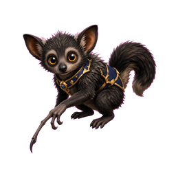 [Ay] aye-aye [<strong><ins>[Viewpoint]</ins></strong><kbd>(twin)</kbd> Controls: I show two windows together] [<strong><ins>[overview]</ins></strong><kbd>(map)</kbd> plus enlarged <strong><ins>[detail]</ins></strong><kbd>(lens)</kbd> of one area]
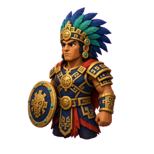 [Az] Aztec [<strong><ins>[Rearrangement]</ins></strong><kbd>(shuffle)</kbd>: I change marks and <strong><ins>[axis]</ins></strong><kbd>(dial)</kbd> values] [so the new layout can change what I <strong><ins>[understand]</ins></strong><kbd>(lightbulb)</kbd>]

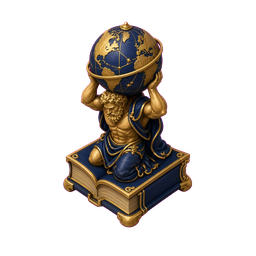 [At] atlas [<strong><ins>[Glyph]</ins></strong><kbd>(puppet)</kbd>: a graphic entity] [whose <strong><ins>[attributes]</ins></strong><kbd>(dial)</kbd> are <strong><ins>[driven]</ins></strong><kbd>(remote)</kbd> by data attributes]
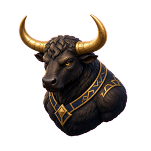 [Au] auroch [Dense <strong><ins>[Pixel]</ins></strong><kbd>(mosaic)</kbd> Displays: I <strong><ins>[map]</ins></strong><kbd>(tile)</kbd> each value to individual pixels] [and form a <strong><ins>[polygon]</ins></strong><kbd>(shape)</kbd> per data dimension]
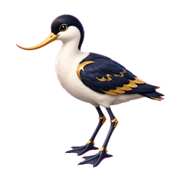 [Av] avocet [View <strong><ins>[Transformation]</ins></strong><kbd>(switch)</kbd>: creates new <strong><ins>[views]</ins></strong><kbd>(window)</kbd>] [of the visual structure] [for my <strong><ins>[needs]</ins></strong><kbd>(wrench)</kbd>]
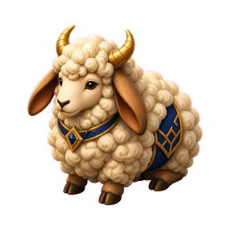 [Aw] awassi sheep [<strong><ins>[Location]</ins></strong><kbd>(pin)</kbd> Investigations: I use a data mark's location] [to <strong><ins>[reveal]</ins></strong><kbd>(flashlight)</kbd> extra table <strong><ins>[information]</ins></strong><kbd>(card)</kbd>]
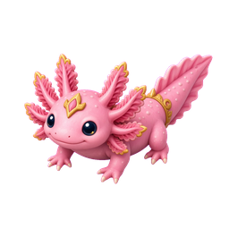 [Ax] axolotl [<strong><ins>[Distortions]</ins></strong><kbd>(magnifier)</kbd>: show focus and <strong><ins>[context]</ins></strong><kbd>(frame)</kbd>] [in the <strong><ins>[same]</ins></strong><kbd>(stretch)</kbd> visual structure at once]

 [Ao] aoudad [<strong><ins>[Multivariate]</ins></strong><kbd>(crayon)</kbd> Line Charts: I tell dimensions apart] [by color, <strong><ins>[width]</ins></strong><kbd>(rope)</kbd>, or line <strong><ins>[style]</ins></strong><kbd>(stripe)</kbd>]
 [Ap] ape [<strong><ins>[Parallel]</ins></strong><kbd>(fence)</kbd> Coordinates: I draw each variable as a parallel axis] [and turn each <strong><ins>[tuple]</ins></strong><kbd>(bead)</kbd> into a <strong><ins>[polyline]</ins></strong><kbd>(wire)</kbd>]
 [Aq] aquatic leech [<strong><ins>[Radial]</ins></strong><kbd>(clock)</kbd> Axis Techniques: I use polar axes] [to study <strong><ins>[cyclical]</ins></strong><kbd>(loop)</kbd> events and <strong><ins>[seasonality]</ins></strong><kbd>(calendar)</kbd>]
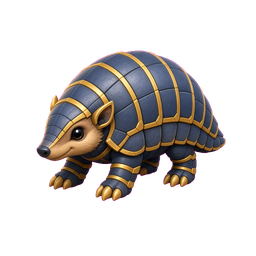 [Ar] armadillo [Table <strong><ins>[Lens]</ins></strong><kbd>(shuffle)</kbd>: I combine reordering, bar-sized <strong><ins>[marks]</ins></strong><kbd>(bar)</kbd>, and semantic <strong><ins>[zoom]</ins></strong><kbd>(lens)</kbd>] [by row and column]
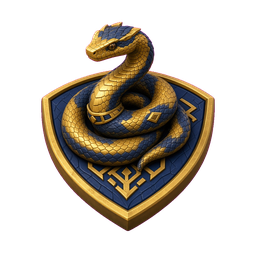 [As] asp [Parallel <strong><ins>[Sets]</ins></strong><kbd>(ribbon)</kbd>: like Parallel Coordinates] [but focused on <strong><ins>[nominal]</ins></strong><kbd>(tag)</kbd> variables]

 [Aj] Ajax [Visual <strong><ins>[Mapping]</ins></strong><kbd>(plug)</kbd>: I link each data-table <strong><ins>[variable]</ins></strong><kbd>(dial)</kbd>] [to a graphical or spatial <strong><ins>[property]</ins></strong><kbd>(paint)</kbd>]
 [Ak] Akita (dog breed) [<strong><ins>[Automatic]</ins></strong><kbd>(flashlight)</kbd> Visual Processing: I aid search and pattern detection] [with automatically <strong><ins>[processed]</ins></strong><kbd>(pop)</kbd> properties] [like <strong><ins>[color]</ins></strong><kbd>(paint)</kbd> and size]
 [Al] alligator [<strong><ins>[Expressiveness]</ins></strong><kbd>(truth)</kbd>: my visual mapping must express all table <strong><ins>[data]</ins></strong><kbd>(ledger)</kbd>] [and <strong><ins>[only]</ins></strong><kbd>(filter)</kbd> that data]
 [Am] amulet [<strong><ins>[Effectiveness]</ins></strong><kbd>(stopwatch)</kbd>: fast easy <strong><ins>[distinction]</ins></strong><kbd>(magnifier)</kbd> of data] [with as few interpretation <strong><ins>[errors]</ins></strong><kbd>(eraser)</kbd> as possible]
 [An] angel [<strong><ins>[RadViz]</ins></strong><kbd>(ring)</kbd>: I place N anchors on a circle] [and <strong><ins>[pull]</ins></strong><kbd>(magnet)</kbd> points by <strong><ins>[Hooke]</ins></strong><kbd>(spring)</kbd> spring balance]

 [Ae] aerialist [Database <strong><ins>[Schema]</ins></strong><kbd>(blueprint)</kbd>: I treat it as the structural blueprint] [of my <strong><ins>[database]</ins></strong><kbd>(building)</kbd>] [including tables, fields, <strong><ins>[relationships]</ins></strong><kbd>(chain)</kbd>, and constraints]
 [Af] Afghan hound [Visual <strong><ins>[Structure]</ins></strong><kbd>(kit)</kbd>: the set of visual elements] [that <strong><ins>[represent]</ins></strong><kbd>(mirror)</kbd> a <strong><ins>[dataset]</ins></strong><kbd>(box)</kbd>]
 [Ag] Agaric fungi [Spatial <strong><ins>[Substrate]</ins></strong><kbd>(stage)</kbd>: the area available] [to <strong><ins>[display]</ins></strong><kbd>(screen)</kbd> the <strong><ins>[dataset]</ins></strong><kbd>(box)</kbd>]
 [Ah] Ah!—a sigh [<strong><ins>[Marks]</ins></strong><kbd>(toy)</kbd>: objects present] [in the <strong><ins>[chart]</ins></strong><kbd>(frame)</kbd> <strong><ins>[space]</ins></strong><kbd>(room)</kbd>] — Note: Marks use graphical and spatial properties to show data values.
 [Ai] Airedale terrier [Small <strong><ins>[Multiples]</ins></strong><kbd>(stamps)</kbd>: they force visual <strong><ins>[comparison]</ins></strong><kbd>(eyes)</kbd>] [of changes, differences, and <strong><ins>[alternatives]</ins></strong><kbd>(fork)</kbd>]

 [Ad] adder [I store data without fixed <strong><ins>[tables]</ins></strong><kbd>(cloud)</kbd>] [using flexible <strong><ins>[formats]</ins></strong><kbd>(origami)</kbd>] [for horizontal <strong><ins>[scaling]</ins></strong><kbd>(accordion)</kbd>] — Note: Uses documents, key-value pairs, wide columns, or graphs to adapt easily to changing schemas.

 [Y] yak [I unpivot multiple <strong><ins>[columns]</ins></strong><kbd>(pillar)</kbd> into rows] [to <strong><ins>[model]</ins></strong><kbd>(clay)</kbd> my data more easily] — Note: Column headers become an attribute column paired with a single value column.
 [Z] Zeus [My unpivot step automatically <strong><ins>[deletes]</ins></strong><kbd>(trash can)</kbd> all rows] [with <strong><ins>[null]</ins></strong><kbd>(ghost)</kbd> values] — Note: Power Query has no built-in setting or parameter to turn off this automatic removal.
 [Aa] aardvark [I replace nulls with a temporary <strong><ins>[placeholder]</ins></strong><kbd>(scarecrow)</kbd>] [before <strong><ins>[unpivoting]</ins></strong><kbd>(jack)</kbd>] [to <strong><ins>[swap]</ins></strong><kbd>(boomerang)</kbd> them back afterward] — Note: This prevents Power Query from dropping rows during the unpivot step.
 [Ab] Abyssinian cat [I <strong><ins>[reuse]</ins></strong><kbd>(stamp)</kbd> my query steps] [across different <strong><ins>[files]</ins></strong><kbd>(binder)</kbd>] [sharing the exact same table <strong><ins>[structure]</ins></strong><kbd>(twin)</kbd>] — Note: Identical column headers and data formats are required so the query steps run without error.
 [Ab] Abyssinian cat [I <strong><ins>[copy]</ins></strong><kbd>(scissors)</kbd> all transformation steps] [below the initial <strong><ins>[source]</ins></strong><kbd>(anchor)</kbd> line] [from the Advanced <strong><ins>[Editor]</ins></strong><kbd>(scroll)</kbd>] — Note: The first line contains the specific file source path that must not overwrite the new table's connection.
 [Ac] acorn [I <strong><ins>[store]</ins></strong><kbd>(chest)</kbd> data] [in rigid <strong><ins>[tables]</ins></strong><kbd>(grid)</kbd> of rows and columns] [linked by predefined <strong><ins>[relationships]</ins></strong><kbd>(chain)</kbd>] — Note: Enforces schemas and data integrity using SQL validation rules.

<strong>Dogs</strong> · 3 palaces · 8 atoms

 [G] goat <strong><ins>[Toy Scenting]</ins></strong><kbd>(perfume)</kbd> [I rub authorized <strong><ins>[chew items]</ins></strong><kbd>(bone)</kbd>] [between my <strong><ins>[hands]</ins></strong><kbd>(palms)</kbd>] [to transfer <strong><ins>[personal scent]</ins></strong><kbd>(shirt)</kbd>] — Note: Overnight contact with the handler also works to fulfill scent drives.
 [H] Hydra <strong><ins>[The Trade Game]</ins></strong><kbd>(scale)</kbd> [I offer <strong><ins>[superior trades]</ins></strong><kbd>(turkey)</kbd>] [to <strong><ins>[prevent chase]</ins></strong><kbd>(hurdle)</kbd> games] [when <strong><ins>[forbidden items]</ins></strong><kbd>(shoe)</kbd> are taken] — Note: Chasing turns theft into a self-reinforcing game.

 [F] frog [<strong><ins>[Proprioception]</ins></strong><kbd>(tightrope)</kbd> Training] [I <strong><ins>[guide]</ins></strong><kbd>(leash)</kbd> the dog] [over raised Cavaletti <strong><ins>[poles]</ins></strong><kbd>(hurdles)</kbd>] [to build <strong><ins>[hind-end]</ins></strong><kbd>(bumper)</kbd> awareness] — Note: This scientifically supports joint health and combats dysplasia risks.

 [A] Arachne [Breeding <strong><ins>[Lines]</ins></strong><kbd>(ruler)</kbd>] [I choose <strong><ins>[working]</ins></strong><kbd>(hardhat)</kbd> lines] [for extreme <strong><ins>[intensity]</ins></strong><kbd>(fire)</kbd>] [and <strong><ins>[pet]</ins></strong><kbd>(leash)</kbd> lines] [for calm <strong><ins>[companions]</ins></strong><kbd>(heart)</kbd>] — Note: Show lines prioritize physical conformation and structure.
 [B] bird of paradise [Proper <strong><ins>[Fulfillment]</ins></strong><kbd>(trophy)</kbd>] [I <strong><ins>[balance]</ins></strong><kbd>(scale)</kbd> the dog] [with predictable <strong><ins>[routines]</ins></strong><kbd>(clock)</kbd>] [and cognitive <strong><ins>[scent]</ins></strong><kbd>(nose)</kbd> games] — Note: High drive can be satisfied through structured play and scatter feeding rather than professional sports.
 [C] cat [Basic <strong><ins>[Obedience]</ins></strong><kbd>(whistle)</kbd>] [I teach the <strong><ins>[place]</ins></strong><kbd>(mat)</kbd> command] [to build sustained <strong><ins>[focus]</ins></strong><kbd>(laser)</kbd>] [and provide mental <strong><ins>[stimulation]</ins></strong><kbd>(brain)</kbd>] — Note: This improves communication without needing advanced sports training.
 [D] dragon [<strong><ins>[Scent]</ins></strong><kbd>(nose)</kbd> Work] [I <strong><ins>[scatter]</ins></strong><kbd>(seeds)</kbd> food] [across the garden <strong><ins>[grass]</ins></strong><kbd>(mower)</kbd>] [to engage <strong><ins>[tracking]</ins></strong><kbd>(magnifying glass)</kbd> instincts] — Note: Hiding food around the house with a go find command also works.
 [E] eagle [Controlled <strong><ins>[Protection]</ins></strong><kbd>(shield)</kbd>] [I play <strong><ins>[tug-of-war]</ins></strong><kbd>(rope)</kbd>] [paired with a <strong><ins>[drop-it]</ins></strong><kbd>(parachute)</kbd> command] [to channel instinctual <strong><ins>[drives]</ins></strong><kbd>(battery)</kbd> safely] — Note: This structured game tires out high-drive dogs effectively.

<strong>Piano</strong> · 4 palaces · 11 atoms

 [Al] alligator Bass F sits on the second line from the top and acts as a symmetrical mirror image to Treble G around Middle C.
 [Am] amulet Middle C for the left hand is drawn with a downward stem on a ledger line above the bass staff.
 [An] angel Moving to an adjacent white key on the piano means stepping between a line note and a space note on the musical staff.
 [Ao] aoudad Treble F is located in the first space at the very bottom of the treble staff
 [Ap] ape Musical note names must be written in uppercase letters because lowercase letters represent different concepts in music theory notation.

 [Aj] Ajax Stacked notes sharing a single stem mean the notes are played simultaneously.
 [Ak] Akita (dog breed) Good posture involves sitting straight with the head lifted upward as if pulled by a string, while keeping the shoulders relaxed.

 [Ai] Airedale terrier Counting out loud and clapping physically reinforces the rhythm and prevents speed changes.

 [Af] Afghan hound A line note has a staff line passing directly through its center, similar to a bead on a string.
 [Ag] Agaric fungi A space note is a musical note that rests entirely in the empty gap between two staff lines.
 [Ah] Ah!—a sigh A cadence is a harmonic progression at the end of a musical phrase that provides a sense of resolution or punctuation.

