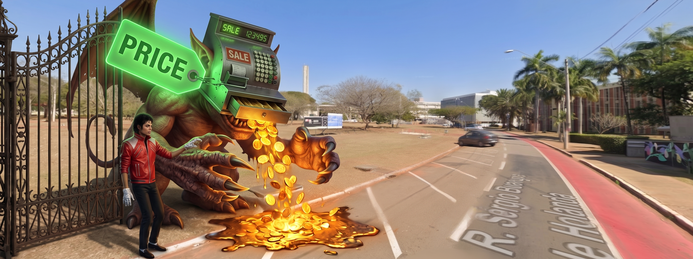
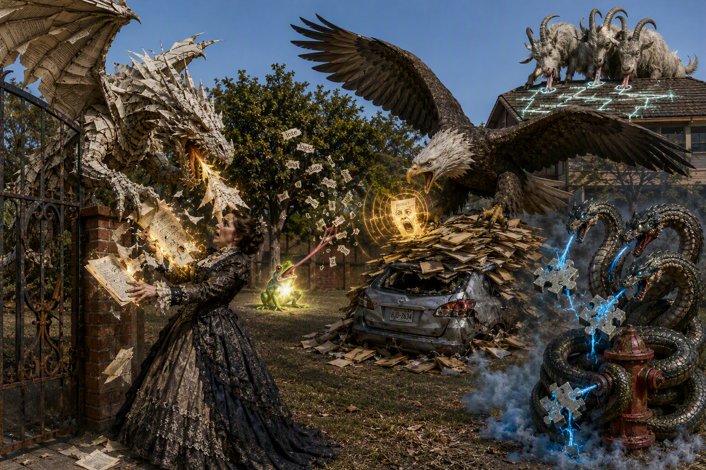
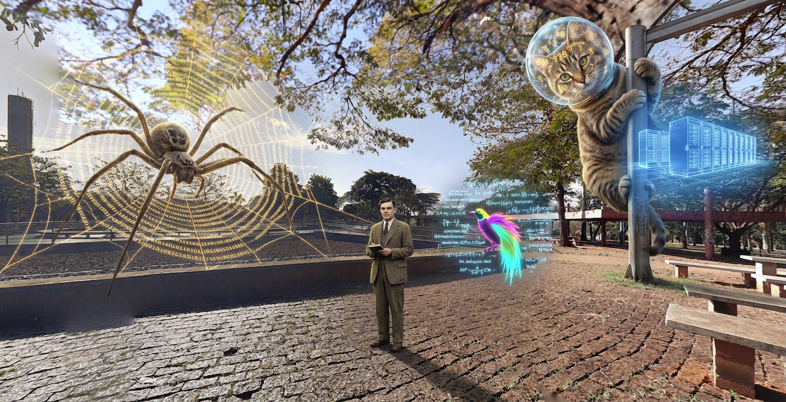

# Ai

<strong>Memory Palace 3: AI Pricing & Elo Mechanics</strong> · Character: Michael Jackson · 1 beast · 2 atoms

<em>1 beast · 2 Knowledge Atoms</em>

#### Knowledge Atoms

### 🟧 [I] imp

🟦 **Z1 · Z1 Head | Token Metric**

**Concept**
💡 a giant glowing green price tag clamps aggressively over its face, mutating its skull into a loudly ringing cash register

**Quote**
“Generating new text takes significantly more computing power, so output tokens are almost always 3 to 5 times more expensive than input tokens.”

**Story**
A colossal, skyscraper-sized imp phases through the solid iron front gate, reeking of burning sulfur. A giant glowing green price tag violently clamps over its face, mutating its skull into a mechanical cash register that rings with a deafening crash. As Michael Jackson watches in awe, the imp's front claws violently vomit blistering hot golden coins that melt the concrete, demonstrating the heavy, expensive computing power needed for output generation.

**Sensory**
👂 auditory

---

🟦 **Z2 · Z2 Forelimbs | Output Cost**

**Concept**
💡 its claws violently vomit blistering hot golden coins that visibly melt the concrete

**Quote**
“Generating new text takes significantly more computing power, so output tokens are almost always 3 to 5 times more expensive than input tokens.”

**Story**
A colossal, skyscraper-sized imp phases through the solid iron front gate, reeking of burning sulfur. A giant glowing green price tag violently clamps over its face, mutating its skull into a mechanical cash register that rings with a deafening crash. As Michael Jackson watches in awe, the imp's front claws violently vomit blistering hot golden coins that melt the concrete, demonstrating the heavy, expensive computing power needed for output generation.

**Sensory**
🌡️ thermal

#### Notes

_No notes._

#### Gallery

_No gallery images._

<strong>Memory Palace 2: The Semantic Layer & RAG Structure</strong> · Character: Ada Lovelace · 5 beasts · 5 atoms

<em>5 beasts · 5 Knowledge Atoms</em>

#### Knowledge Atoms

### 🟧 [D] dragon

**Concept**
💡 Retrieval-Augmented Generation (RAG) fetches external documents at query time instead of relying entirely on its training memory.

**Quote**
“the model grounds its answer in documents it fetches at query time instead of relying only on what it memorized in training”

**Story**
A colossal dragon made of folded library pages refuses to use its own brain. Instead, it violently rips glowing documents straight out of Ada Lovelace's hands. The beast chews the rough, heavy papers with a deafening crunch, using the sharp textures of the fetched pages to spit out perfectly formed answers.

**Sensory**
✋ tactile

### 🟧 [E] eagle

**Concept**
💡 A flat, unstructured content store causes models to retrieve the loudest keyword match instead of the most accurate document.

**Quote**
“If your content store is a flat heap of unstructured, unlabeled, contradictory documents, retrieval doesn't work. It finds the loudest match — the one that shares the most surface words with the query, regardless of whether it is current, authoritative, or true.”

**Story**
A skyscraper-sized eagle stands on a flat heap of rotting, messy file folders that crush a parked car. It completely ignores Ada Lovelace’s polite whispers and refuses to hunt for true facts. The giant bird only dives to snatch the single document screaming with the loudest, most ear-shattering siren noise.

**Sensory**
👂 auditory

### 🟧 [F] frog

**Concept**
💡 Controlled vocabularies prevent slight word variations from fracturing one concept into multiple unrelated topics.

**Quote**
“Controlled vocabularies — a fixed, agreed set of terms for the same thing — hold the language steady, so that “cancelled,” “canceled,” “terminated,” and “closed” don’t fracture one concept into four the system treats as unrelated.”

**Story**
A microscopic frog sits on a distant brick wall, catching hundreds of chaotic, fractured dictionary words with its impossibly long tongue. As it swallows the messy letters, Ada Lovelace watches the frog sweat a single, blindingly bright, unified glowing word across its skin. This brilliant neon label locks the language steady and lights up the entire alley.

**Sensory**
👁️ visual

### 🟧 [G] goat

**Concept**
💡 AI agents require explicit structures, hierarchies, and boundaries to safely take action and update records.

**Quote**
“The moment an agent stops retrieving and starts doing — routing a ticket, updating a record, approving a request, calling another system — it needs more than the right passage. It needs to know relationships, hierarchies, and boundaries”

**Story**
A three-headed goat tries to stamp its hooves to route banking tickets, but freezes when Ada Lovelace draws glowing chalk boundaries on the roof. The goat licks the thick chalk boundary and tastes bitter, burning electricity on its tongue. This foul flavor stops the beast from running amok and blindly changing systems.

**Sensory**
👅 gustatory

### 🟧 [H] Hydra

**Concept**
💡 Adding situational context to text chunks before indexing them drastically reduces retrieval failures.

**Quote**
“adding the context that situates each chunk before indexing it cut failed retrievals by up to 49 percent”

**Story**
A massive Hydra coils around a fire hydrant, injecting thick blue context-gel into raw data chunks using its venomous fangs. The chemical reaction fills the air with the sharp, metallic smell of burning ozone. Ada Lovelace breathes in the strong scent as the injected chunks perfectly lock into an index puzzle, cutting their failure rate in half before they even reach the database.

**Sensory**
👃 olfactory

#### Notes

_No notes._

#### Gallery

_No gallery images._

<strong>Memory Palace 1: Foundations & Semantic Interoperability</strong> · Character: (unassigned palace 1) · 3 beasts · 5 atoms

<em>3 beasts · 5 Knowledge Atoms</em>

#### Knowledge Atoms

### 🟧 [A] Arachne

**Concept**
💡 Augmented analytics automates data analysis using AI and machine learning.

**Quote**
“Augmented analytics is the integration of Artificial Intelligence (AI) and Machine Learning (ML) into business intelligence and analytics tools to automate and enhance the data analysis process .”

**Story**
A skyscraper-sized Arachne weaves a glowing web of binary code directly into a massive dashboard on the brick wall. A man in a 1940s tweed suit watches in awe as her giant robotic spinnerets automatically filter mountains of raw, muddy data cubes into sparkling diamond insights.

**Sensory**
👁️ visual

### 🟧 [B] bird of paradise

**Concept**
💡 Conversational interfaces allow you to query data using everyday language.

**Quote**
“It often features natural language processing (NLP), allowing everyday business users to ask questions in plain English (e.g., "Why did sales drop last month?") and receive automated, explainable answers .”

**Story**
A neon-plumed bird of paradise perched on a wooden bench sings questions that instantly materialize as glowing, readable text bubbles. The bubbles burst into a deafening silence that visually rains perfectly printed answer scrolls right into the 1940s man's open hands.

**Sensory**
👁️ visual

### 🟧 [C] cat

🟦 **Z1 · Z1 Head | Data-lake translator jaws**

**Concept**
💡 The cat's jaws violently gulp raw data-lake water and spit it out as neatly labeled golden folders that glow with piercing light.

**Quote**
“In the era of Generative AI, semantic layers provide the unambiguous business context that Large Language Models (LLMs) and chatbots need to translate natural language questions into accurate SQL queries without hallucinating .”

**Story**
A colossal house cat clings to the aerial street lamp, reeking of wet fur. Its jaws violently gulp raw data-lake water and spit neatly labeled golden folders of piercing light. Its front paws slam a crystal sphere helmet onto its skull, locking every flying financial paper into identical golden numbers with a deafening _clack_. Its ribs fire a frigid, hallucination-free blueprint that the 1940s man feeds to a floating robot brain.

**Sensory**
👁️ visual

---

🟦 **Z2 · Z2 Forelimbs | Crystal sphere helmet**

**Concept**
💡 The cat's front paws violently slam a crystal sphere helmet onto its skull, locking all financial numbers inside with a loud, echoing _clack_.

**Quote**
“In the era of Generative AI, semantic layers provide the unambiguous business context that Large Language Models (LLMs) and chatbots need to translate natural language questions into accurate SQL queries without hallucinating .”

**Story**
A colossal house cat clings to the aerial street lamp, reeking of wet fur. Its jaws violently gulp raw data-lake water and spit neatly labeled golden folders of piercing light. Its front paws slam a crystal sphere helmet onto its skull, locking every flying financial paper into identical golden numbers with a deafening _clack_. Its ribs fire a frigid, hallucination-free blueprint that the 1940s man feeds to a floating robot brain.

**Sensory**
👂 auditory

---

🟦 **Z3 · Z3 Torso | Blueprint projector ribs**

**Concept**
💡 The cat's ribs aggressively fire a solid, freezing-cold architectural blueprint from its chest that stops a robot brain from hallucinating.

**Quote**
“In the era of Generative AI, semantic layers provide the unambiguous business context that Large Language Models (LLMs) and chatbots need to translate natural language questions into accurate SQL queries without hallucinating .”

**Story**
A colossal house cat clings to the aerial street lamp, reeking of wet fur. Its jaws violently gulp raw data-lake water and spit neatly labeled golden folders of piercing light. Its front paws slam a crystal sphere helmet onto its skull, locking every flying financial paper into identical golden numbers with a deafening _clack_. Its ribs fire a frigid, hallucination-free blueprint that the 1940s man feeds to a floating robot brain.

**Sensory**
🌡️ thermal

#### Notes

_No notes._

#### Gallery

_No gallery images._

