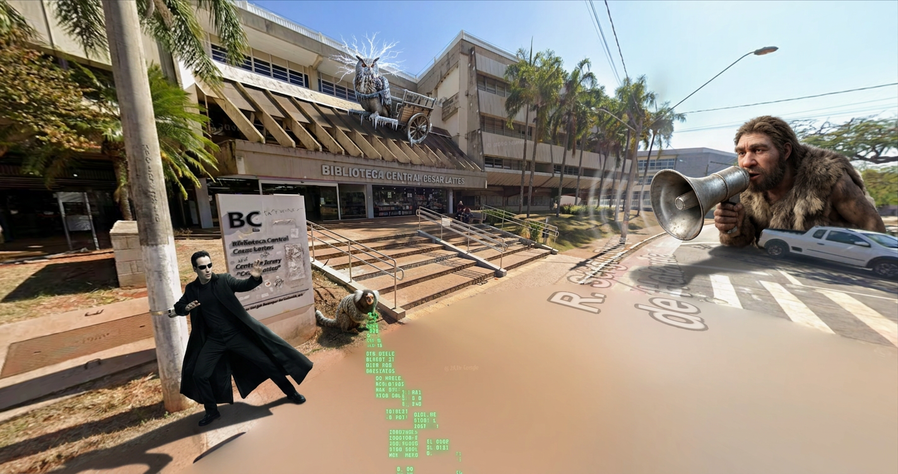
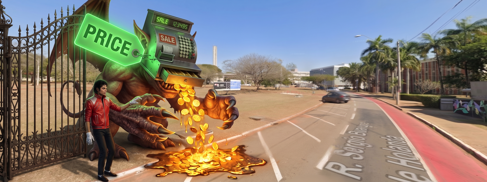
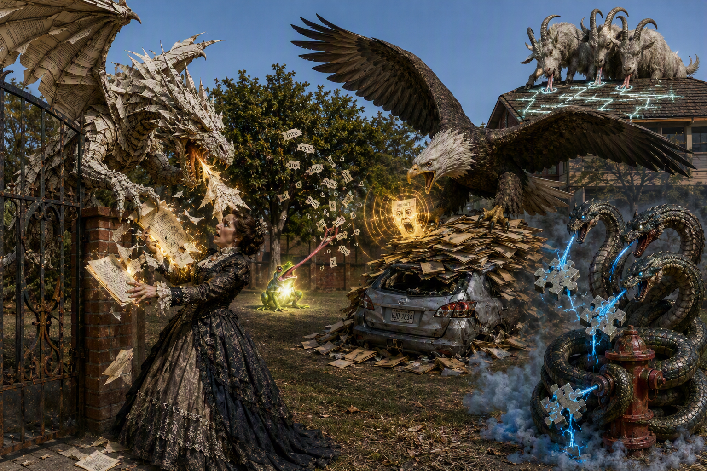
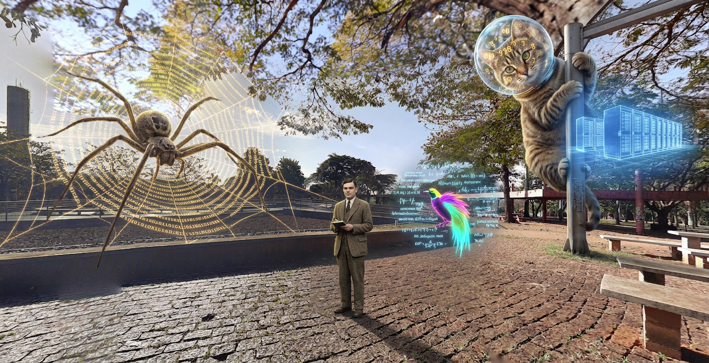

# Ai

<strong>Memory Palace 5: AI System Architecture</strong> · Character: Neo (The Matrix) · 3 beasts · 5 atoms

<em>3 beasts · 5 Knowledge Atoms</em>

#### Knowledge Atoms

### [M] marmoset

**Concept**
💡 💡 **(giant window):** I experience the (foggy helmet) zone as degraded (droopy eyes) and performance when processing a massive context window over an extended (hourglass).

**Quote**
“In Artificial Intelligence, the "dumb zone" is a phenomenon where an AI agent begins to perform poorly after a long session with a very large context window.”

### [N] Neanderthal

**Concept**
💡 💡 **Context:** I use a (iron curtain) prompt as a behind-the-scenes (whisper) that establishes an AI's baseline parameters like tone, (rule book), and (fence).

**Quote**
“A meta prompt (often referred to as a system prompt) is a behind-the-scenes instruction that sets an AI model's overarching behavior, tone, rules, and scope before any user input is processed.”

### [O] owl

🟦 **Z1 · The Horse**

**Concept**
💡 💡 **Context:** I use the (wild horse) to represent the foundational AI model itself, which possesses raw (lightning bolt) but no inherent (broken compass).

**Quote**
“The Horse represents the foundational AI Model itself—possessing raw power, but having no inherent direction.”

---

🟦 **Z2 · Harness Layer**

**Concept**
💡 💡 **Context:** I build a (iron harness) or (leather tack) as the engineering layer to (steering wheel) and (plug) the model's raw power.

**Quote**
“The Harness/Tack acts as the engineering layer that interacts with the model.”

---

🟦 **Z3 · The Cart Task**

**Concept**
💡 💡 **Context:** I view the (wooden cart) as the ultimate (trophy) or (neon sign) that needs to be accomplished once the model is harnessed.

**Quote**
“The Cart represents the ultimate Task that needs to be accomplished.”

#### Notes

_No notes._

#### Gallery

_No gallery images._

<strong>Memory Palace 3: AI Pricing & Elo Mechanics</strong> · Character: Michael Jackson · 1 beast · 2 atoms

<em>1 beast · 2 Knowledge Atoms</em>

#### Knowledge Atoms

### [I] imp

🟦 **Z1 · Z1 Head | Token Metric**

**Concept**
💡 a giant glowing green price tag clamps aggressively over its face, mutating its skull into a loudly ringing cash register

**Quote**
“Generating new text takes significantly more computing power, so output tokens are almost always 3 to 5 times more expensive than input tokens.”

---

🟦 **Z2 · Z2 Forelimbs | Output Cost**

**Concept**
💡 its claws violently vomit blistering hot golden coins that visibly melt the concrete

**Quote**
“Generating new text takes significantly more computing power, so output tokens are almost always 3 to 5 times more expensive than input tokens.”

#### Notes

file:///C:/Users/eduev/AppData/Local/Temp/palace_dashboard.html?t=318971546

#### Gallery

_No gallery images._

<strong>Memory Palace 2: The Semantic Layer & RAG Structure</strong> · Character: Ada Lovelace · 5 beasts · 5 atoms

<em>5 beasts · 5 Knowledge Atoms</em>

#### Knowledge Atoms

### [D] dragon

**Concept**
💡 Retrieval-Augmented Generation (RAG) fetches external documents at query time instead of relying entirely on its training memory.

**Quote**
“the model grounds its answer in documents it fetches at query time instead of relying only on what it memorized in training”

### [E] eagle

**Concept**
💡 A flat, unstructured content store causes models to retrieve the loudest keyword match instead of the most accurate document.

**Quote**
“If your content store is a flat heap of unstructured, unlabeled, contradictory documents, retrieval doesn't work. It finds the loudest match — the one that shares the most surface words with the query, regardless of whether it is current, authoritative, or true.”

### [F] frog

**Concept**
💡 Controlled vocabularies prevent slight word variations from fracturing one concept into multiple unrelated topics.

**Quote**
“Controlled vocabularies — a fixed, agreed set of terms for the same thing — hold the language steady, so that “cancelled,” “canceled,” “terminated,” and “closed” don’t fracture one concept into four the system treats as unrelated.”

### [G] goat

**Concept**
💡 AI agents require explicit structures, hierarchies, and boundaries to safely take action and update records.

**Quote**
“The moment an agent stops retrieving and starts doing — routing a ticket, updating a record, approving a request, calling another system — it needs more than the right passage. It needs to know relationships, hierarchies, and boundaries”

### [H] Hydra

**Concept**
💡 Adding situational context to text chunks before indexing them drastically reduces retrieval failures.

**Quote**
“adding the context that situates each chunk before indexing it cut failed retrievals by up to 49 percent”

#### Notes

_No notes._

#### Gallery

_No gallery images._

<strong>Memory Palace 1: Foundations & Semantic Interoperability</strong> · Character: (unassigned palace 1) · 3 beasts · 5 atoms

<em>3 beasts · 5 Knowledge Atoms</em>

#### Knowledge Atoms

### [A] Arachne

**Concept**
💡 Augmented analytics automates data analysis using AI and machine learning.

**Quote**
“Augmented analytics is the integration of Artificial Intelligence (AI) and Machine Learning (ML) into business intelligence and analytics tools to automate and enhance the data analysis process .”

### [B] bird of paradise

**Concept**
💡 Conversational interfaces allow you to query data using everyday language.

**Quote**
“It often features natural language processing (NLP), allowing everyday business users to ask questions in plain English (e.g., "Why did sales drop last month?") and receive automated, explainable answers .”

### [C] cat

🟦 **Z1 · Z1 Head | Data-lake translator jaws**

**Concept**
💡 The cat's jaws violently gulp raw data-lake water and spit it out as neatly labeled golden folders that glow with piercing light.

**Quote**
“In the era of Generative AI, semantic layers provide the unambiguous business context that Large Language Models (LLMs) and chatbots need to translate natural language questions into accurate SQL queries without hallucinating .”

---

🟦 **Z2 · Z2 Forelimbs | Crystal sphere helmet**

**Concept**
💡 The cat's front paws violently slam a crystal sphere helmet onto its skull, locking all financial numbers inside with a loud, echoing _clack_.

**Quote**
“In the era of Generative AI, semantic layers provide the unambiguous business context that Large Language Models (LLMs) and chatbots need to translate natural language questions into accurate SQL queries without hallucinating .”

---

🟦 **Z3 · Z3 Torso | Blueprint projector ribs**

**Concept**
💡 The cat's ribs aggressively fire a solid, freezing-cold architectural blueprint from its chest that stops a robot brain from hallucinating.

**Quote**
“In the era of Generative AI, semantic layers provide the unambiguous business context that Large Language Models (LLMs) and chatbots need to translate natural language questions into accurate SQL queries without hallucinating .”

#### Notes

_No notes._

#### Gallery

_No gallery images._

