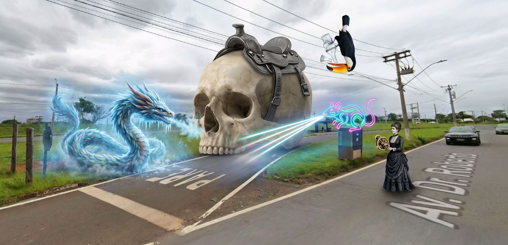
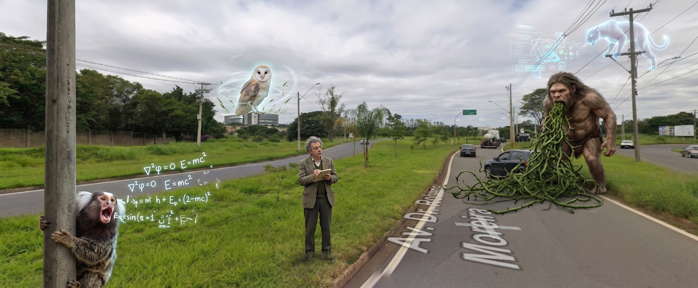

# Communication

<strong>Memory Palace 7: Visual and Physical Delivery</strong> · Character: Carl Sagan · 2 beasts · 2 atoms

_No image_

<em>2 beasts · 2 Knowledge Atoms</em>

#### Knowledge Atoms

### 🟧 [Ae] aerialist

**Concept**
💡 Package ideas with a symbol, slogan, surprise, salient idea, and story to be remembered.

**Quote**
“if you want your presentation ideas to be remembered...”

**Story**
A microscopic aerialist in the foreground left wears a heavy...

**Sensory**
tactile ✋

### 🟧 [Af] Afghan hound

**Concept**
💡 Conclude by projecting strength and listing contributions, rather than weakly saying thank you.

**Quote**
“when you say thank you even worse thank you for listening...”

**Story**
An Afghan hound, standing colossally in the midground right...

**Sensory**
auditory 👂

<strong>Memory Palace 6: Presentation Tactics</strong> · Character: Steve Jobs · 5 beasts · 5 atoms

_No image_

<em>5 beasts · 5 Knowledge Atoms</em>

#### Knowledge Atoms

### 🟧 [Z] Zeus

**Concept**
💡 Wait at least seven seconds after asking a question to force mental engagement.

**Quote**
“how long can I pause uh I counted 7 Seconds...”

**Story**
Zeus sits in the foreground left, completely frozen...

**Sensory**
thermal 🌡️

### 🟧 [Aa] aardvark

**Concept**
💡 Simplify slides drastically because the brain cannot read and listen simultaneously.

**Quote**
“we have only one language processor...”

**Story**
A towering aardvark in the midground right spits a flood...

**Sensory**
gustatory 👅

### 🟧 [Ab] Abyssinian cat

**Concept**
💡 Using a laser pointer forces you to turn away, breaking audience connection.

**Quote**
“you can't use a laser pointer without turning your head...”

**Story**
A microscopic Abyssinian cat in the background center contorts...

**Sensory**
visual 👁️

### 🟧 [Ac] acorn

**Concept**
💡 Use a hyper-complex slide exactly once to demonstrate impossible complexity.

**Quote**
“this is the kind of slide you can get away with exactly once...”

**Story**
An impossibly tangled acorn hovering on an aerial wire...

**Sensory**
visual 👁️

### 🟧 [Ad] adder

**Concept**
💡 The universal trait of an inspiring presentation is the speaker's genuine passion.

**Quote**
“they were inspired when someone exhibited passion...”

**Story**
A gigantic adder in the foreground right violently erupts...

**Sensory**
thermal 🌡️

<strong>Memory Palace 5: The Psychology of Speaking</strong> · Character: Ada Lovelace · 5 beasts · 5 atoms

<em>5 beasts · 5 Knowledge Atoms</em>

#### Knowledge Atoms

### 🟧 [U] unicorn

**Concept**
💡 Success is driven by speaking and writing over the quality of ideas.

**Quote**
“your success in life will be determined largely...”

**Story**
A skyscraper-sized unicorn whinnies deafeningly...

**Sensory**
auditory 👂

### 🟧 [V] vulture

**Concept**
💡 Start a talk by promising the new capabilities the audience will gain.

**Quote**
“what you want to do instead is start with an empowerment promise...”

**Story**
A gigantic vulture perched in the midground right vomits...

**Sensory**
visual 👁️

### 🟧 [W] wombat

**Concept**
💡 Repeat critical ideas three times to catch audiences during attention lapses.

**Quote**
“at any given moment about 20% of you will be fogged out...”

**Story**
A microscopic wombat in the background center rapidly burrows...

**Sensory**
tactile ✋

### 🟧 [X] Xena, warrior woman

**Concept**
💡 Explicitly state what your idea is not to prevent confusion.

**Quote**
“in explaining my idea I want to build a fence around it...”

**Story**
Xena, incredibly massive on an aerial balcony, violently hammers...

**Sensory**
tactile ✋

### 🟧 [Y] yak

**Concept**
💡 Provide clear structural markers to help distracted listeners re-engage.

**Quote**
“you need to provide some Landmark places...”

**Story**
A hovering yak in the foreground right rings a colossal iron bell...

**Sensory**
auditory 👂

<strong>Memory Palace 4: The Mechanics of Speaking</strong> · Character: Alan Turing · 4 beasts · 3 atoms

<em>4 beasts · 3 Knowledge Atoms</em>

#### Knowledge Atoms

### 🟧 [M] marmoset

**Concept**
💡 Clarity requires diagnosing bad outputs and repeating them.

**Quote**
“The formula for clarity on any idea is clarity equals bad output times frequency”

**Story**
A microscopic marmoset stands on the gate, shouting out terrible equations. Turing multiplies the marmoset's bad output until the shrieking sound magically rings with perfect crystal clarity.

**Sensory**
auditory 👂

### 🟧 [N] Neanderthal

**Concept**
💡 Use uncommon words from your deep lexicon for creative impact.

**Quote**
“texture is about word choice it's the difference between saying 'Yeah that's a tough challenge and that's a thorny problem.'”

**Story**
A colossal Neanderthal crashes onto the parked car, vomiting 35,000 thorny vines. Turing carefully touches the sharp thorns, twisting the physical texture of the words into a beautiful, sharp sculpture.

**Sensory**
tactile ✋

### 🟧 [P] panther

**Concept**
💡 A mental model of your elite future self for analyzing word choices.

**Quote**
“the vocal ego is a representation of the elite version of you that 2% version of you here's how future Joseph speaks”

**Story**
A glowing panther perches on a lamp post, spitting out an elite AI hologram. Turing bites into the hologram's glowing text, tasting pure electric gold as he upgrades into his future self.

**Sensory**
gustatory 👅

<strong>Memory Palace 3: Leading Myself</strong> · Character: (unassigned palace 3) · 4 beasts · 4 atoms

<em>4 beasts · 4 Knowledge Atoms</em>

#### Knowledge Atoms

### 🟧 [I] imp

**Concept**
💡 Enable others to grow and contribute to their maximum potential.

**Quote**
“Possibilita que os outros cresçam e contribuam ao máximo com o seu potencial.”

**Story**
A tiny imp stands on a brick wall, glowing with a blinding, radioactive light that hurts the eyes. Naruto hits the imp with a glowing blue energy sphere, causing the small creature to rapidly mutate into a muscular giant, visually unlocking its absolute maximum potential in a brilliant flash.

**Sensory**
👁️ visual

### 🟧 [J] jester

**Concept**
💡 Deal with your own personality in a self-reflective way.

**Quote**
“Lida com a sua própria personalidade de forma autorreflexiva.”

**Story**
A completely flat, two-dimensional jester lies stuck on a wooden bench, wrapped in freezing cold mirror shards. Naruto carefully peels the agonizingly cold, sharp mirrors off the jester's face, forcing the clown to tangibly feel and reflect on his own bizarre personality.

**Sensory**
✋ tactile

### 🟧 [K] kitten

**Concept**
💡 Have a clear sense of internal orientation and manage personal resources effectively.

**Quote**
“Tem um claro sentido de orientação interna e gere de forma eficaz os seus recursos pessoais.”

**Story**
A colossal kitten blocks a distant building facade, purring with the ear-splitting, aggressive roar of a chainsaw engine. Naruto manages this chaotic noise by shoving a giant metallic compass into the kitten's ear, instantly tuning the loud roar into a perfectly directed, rhythmic heartbeat.

**Sensory**
👂 auditory

### 🟧 [L] lion

**Concept**
💡 Learn continuously to grow personally and professionally.

**Quote**
“Aprende continuamente para crescer a nível pessoal e profissional.”

**Story**
A transparent lion sits on a high balcony edge, loudly crunching on glowing, metallic books that taste like spicy iron. Naruto feeds the lion endless stacks of these iron manuals, tasting the metallic spark of continuous learning as the beast physically thickens with professional growth.

**Sensory**
👅 gustatory

<strong>Memory Palace 2: Leading the Business and Others</strong> · Character: (unassigned palace 2) · 5 beasts · 5 atoms

<em>5 beasts · 5 Knowledge Atoms</em>

#### Knowledge Atoms

### 🟧 [D] dragon

**Concept**
💡 Define the business agenda for your own area.

**Quote**
“Define a agenda de negócios para a própria área.”

**Story**
A colossal dragon lands heavily on the gate post, and Goku desperately grabs its scaled tail. The beast breathes a massive, glowing business agenda made of bright neon fire into the sky, forcing everyone to clearly see the defined direction.

**Sensory**
👁️ visual

### 🟧 [E] eagle

**Concept**
💡 Create value according to the general interest of Bosch.

**Quote**
“Cria valor para a empresa de acordo com o interesse geral da Bosch.”

**Story**
An impossibly heavy eagle crashes onto a parked car, crushing its steel roof like paper to hand Goku solid gold bars. The tangible, crushing weight of these delivered results physically alters the vehicle, showing immense value creation.

**Sensory**
✋ tactile

### 🟧 [F] frog

**Concept**
💡 Foster a collaborative and learning organization while driving digital business.

**Quote**
“Fomenta uma organização colaborativa e de aprendizagem. Impulsiona um negócio sustentável e digital.”

**Story**
A skyscraper-sized frog squats at the far end of the street, croaking with a deafening electronic baseline. Goku plugs futuristic digital cables directly into the frog's warty skin, causing the loud croaks to instantly build a collaborative digital city out of soundwaves.

**Sensory**
👂 auditory

### 🟧 [G] goat

**Concept**
💡 Create an environment where people feel comfortable expressing their opinions.

**Quote**
“Cria um ambiente onde as pessoas se sentem à vontade para expressar as suas opiniões e participar em debates saudáveis.”

**Story**
A floating goat balances perfectly on top of a street lamp, emitting a highly concentrated, comforting scent of warm cinnamon. Goku breathes in the trusting aroma and shouts his deepest secrets to the goat, feeling completely safe to express opinions in the sweet-smelling air.

**Sensory**
👃 olfactory

### 🟧 [H] Hydra

**Concept**
💡 Encourage others to take responsibility and achieve exceptional results.

**Quote**
“Incentiva os outros a assumir responsabilidade e alcançar resultados excepcionais. Cria autonomia e estimula a motivação intrínseca.”

**Story**
A multi-headed Hydra bursts out of a tiny metal mailbox, biting into shockingly sour lemons. Goku forces the heads to chew the sour fruit, making them taste the bitter shock of responsibility before they autonomously spit out exceptional golden trophies onto the pavement.

**Sensory**
👅 gustatory

<strong>Memory Palace 1: The Foundations of Rhetoric</strong> · Character: (unassigned palace 1) · 3 beasts · 3 atoms

<em>3 beasts · 3 Knowledge Atoms</em>

#### Knowledge Atoms

### 🟧 [A] Arachne

**Concept**
💡 Ethos is the credibility and authority of the speaker.

**Quote**
“Ethos: A credibilidade e a autoridade do orador.”

**Story**
Arachne (a woman with the lower body of a spider) crawls down onto the street. She wears a tiny judge's wig and holds a shiny gold badge. She waves her many arms to show the crowd her badge, proving she is honest and making everyone respect her high authority.

**Sensory**
—

### 🟧 [B] bird of paradise

**Concept**
💡 Pathos is the emotional appeal used to engage the audience.

**Quote**
“Pathos: O apelo emocional utilizado para envolver o público.”

**Story**
A bright bird of paradise flutters down to perch on Arachne's badge and starts crying with giant, sad eyes. It looks so pathetic and cute that the entire crowd starts weeping with it. The bird actively uses these strong, sad feelings to steal everyone's attention and engage the audience completely.

**Sensory**
—

### 🟧 [C] cat

**Concept**
💡 Logos is the logical structure and the evidence supporting the argument.

**Quote**
“Logos: A estrutura lógica e as evidências que sustentam o argumento.”

**Story**
A small cat jumps down onto the pavement, completely ignoring the crying bird. Instead, it carefully builds a strong, perfectly straight wall out of heavy stone blocks. The cat points at the solid bricks to show the strict, logical structure and the hard evidence that supports its point.

**Sensory**
—

