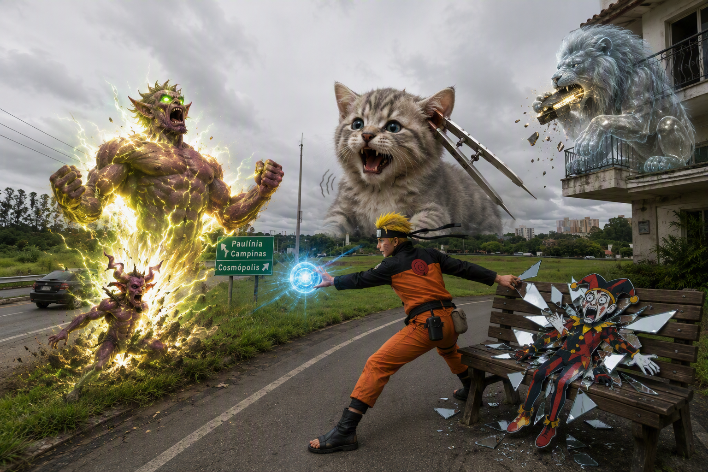
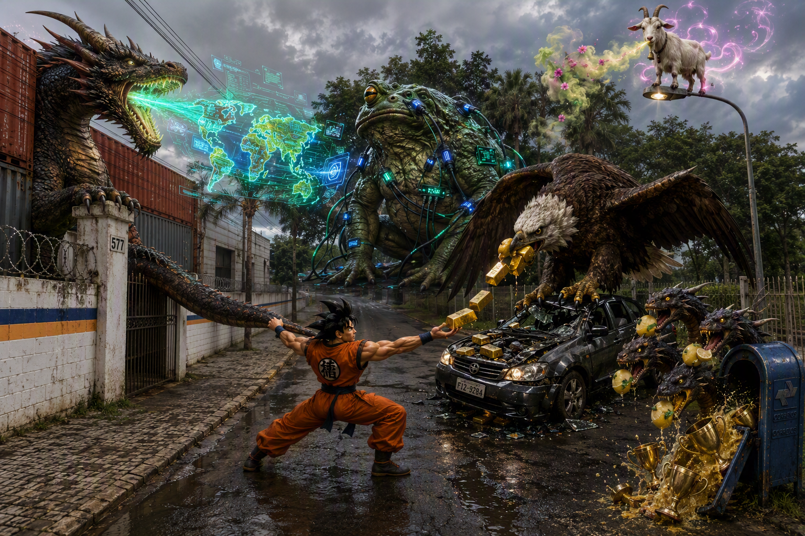
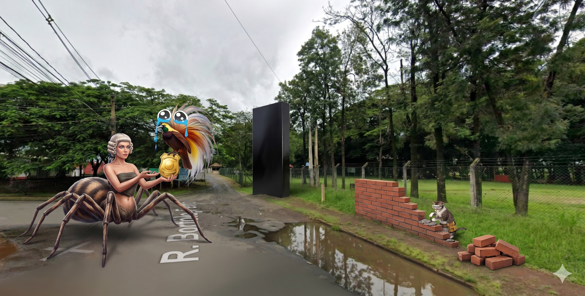

# Communication

_3 Memory Palaces · newest first_

_Tap a Memory Palace to expand · beasts grouped like the dashboard · newest open by default_

---

<strong>Memory Palace 3: Leading Myself</strong> · Character: (unassigned palace 3) · 4 beasts · 4 atoms

<em>4 beasts · 4 Knowledge Atoms</em>

_No image prompt saved._

#### Knowledge Atoms

<strong>Beast</strong> · [I] imp

**Concept**
💡 Enable others to grow and contribute to their maximum potential.

**Quote**
“Possibilita que os outros cresçam e contribuam ao máximo com o seu potencial.”

**Story**
A tiny imp stands on a brick wall, glowing with a blinding, radioactive light that hurts the eyes. Naruto hits the imp with a glowing blue energy sphere, causing the small creature to rapidly mutate into a muscular giant, visually unlocking its absolute maximum potential in a brilliant flash.

**Sensory**
👁️ visual

<strong>Beast</strong> · [J] jester

**Concept**
💡 Deal with your own personality in a self-reflective way.

**Quote**
“Lida com a sua própria personalidade de forma autorreflexiva.”

**Story**
A completely flat, two-dimensional jester lies stuck on a wooden bench, wrapped in freezing cold mirror shards. Naruto carefully peels the agonizingly cold, sharp mirrors off the jester's face, forcing the clown to tangibly feel and reflect on his own bizarre personality.

**Sensory**
✋ tactile

<strong>Beast</strong> · [K] kitten

**Concept**
💡 Have a clear sense of internal orientation and manage personal resources effectively.

**Quote**
“Tem um claro sentido de orientação interna e gere de forma eficaz os seus recursos pessoais.”

**Story**
A colossal kitten blocks a distant building facade, purring with the ear-splitting, aggressive roar of a chainsaw engine. Naruto manages this chaotic noise by shoving a giant metallic compass into the kitten's ear, instantly tuning the loud roar into a perfectly directed, rhythmic heartbeat.

**Sensory**
👂 auditory

<strong>Beast</strong> · [L] lion

**Concept**
💡 Learn continuously to grow personally and professionally.

**Quote**
“Aprende continuamente para crescer a nível pessoal e profissional.”

**Story**
A transparent lion sits on a high balcony edge, loudly crunching on glowing, metallic books that taste like spicy iron. Naruto feeds the lion endless stacks of these iron manuals, tasting the metallic spark of continuous learning as the beast physically thickens with professional growth.

**Sensory**
👅 gustatory

<strong>Memory Palace 2: Leading the Business and Others</strong> · Character: (unassigned palace 2) · 5 beasts · 5 atoms

<em>5 beasts · 5 Knowledge Atoms</em>

_No image prompt saved._

#### Knowledge Atoms

<strong>Beast</strong> · [D] dragon

**Concept**
💡 Define the business agenda for your own area.

**Quote**
“Define a agenda de negócios para a própria área.”

**Story**
A colossal dragon lands heavily on the gate post, and Goku desperately grabs its scaled tail. The beast breathes a massive, glowing business agenda made of bright neon fire into the sky, forcing everyone to clearly see the defined direction.

**Sensory**
👁️ visual

<strong>Beast</strong> · [E] eagle

**Concept**
💡 Create value according to the general interest of Bosch.

**Quote**
“Cria valor para a empresa de acordo com o interesse geral da Bosch.”

**Story**
An impossibly heavy eagle crashes onto a parked car, crushing its steel roof like paper to hand Goku solid gold bars. The tangible, crushing weight of these delivered results physically alters the vehicle, showing immense value creation.

**Sensory**
✋ tactile

<strong>Beast</strong> · [F] frog

**Concept**
💡 Foster a collaborative and learning organization while driving digital business.

**Quote**
“Fomenta uma organização colaborativa e de aprendizagem. Impulsiona um negócio sustentável e digital.”

**Story**
A skyscraper-sized frog squats at the far end of the street, croaking with a deafening electronic baseline. Goku plugs futuristic digital cables directly into the frog's warty skin, causing the loud croaks to instantly build a collaborative digital city out of soundwaves.

**Sensory**
👂 auditory

<strong>Beast</strong> · [G] goat

**Concept**
💡 Create an environment where people feel comfortable expressing their opinions.

**Quote**
“Cria um ambiente onde as pessoas se sentem à vontade para expressar as suas opiniões e participar em debates saudáveis.”

**Story**
A floating goat balances perfectly on top of a street lamp, emitting a highly concentrated, comforting scent of warm cinnamon. Goku breathes in the trusting aroma and shouts his deepest secrets to the goat, feeling completely safe to express opinions in the sweet-smelling air.

**Sensory**
👃 olfactory

<strong>Beast</strong> · [H] Hydra

**Concept**
💡 Encourage others to take responsibility and achieve exceptional results.

**Quote**
“Incentiva os outros a assumir responsabilidade e alcançar resultados excepcionais. Cria autonomia e estimula a motivação intrínseca.”

**Story**
A multi-headed Hydra bursts out of a tiny metal mailbox, biting into shockingly sour lemons. Goku forces the heads to chew the sour fruit, making them taste the bitter shock of responsibility before they autonomously spit out exceptional golden trophies onto the pavement.

**Sensory**
👅 gustatory

<strong>Memory Palace 1: The Foundations of Rhetoric</strong> · Character: (unassigned palace 1) · 3 beasts · 3 atoms

<em>3 beasts · 3 Knowledge Atoms</em>

_No image prompt saved._

#### Knowledge Atoms

<strong>Beast</strong> · [A] Arachne

**Concept**
💡 Ethos is the credibility and authority of the speaker.

**Quote**
“Ethos: A credibilidade e a autoridade do orador.”

**Story**
Arachne (a woman with the lower body of a spider) crawls down onto the street. She wears a tiny judge's wig and holds a shiny gold badge. She waves her many arms to show the crowd her badge, proving she is honest and making everyone respect her high authority.

**Sensory**
—

<strong>Beast</strong> · [B] bird of paradise

**Concept**
💡 Pathos is the emotional appeal used to engage the audience.

**Quote**
“Pathos: O apelo emocional utilizado para envolver o público.”

**Story**
A bright bird of paradise flutters down to perch on Arachne's badge and starts crying with giant, sad eyes. It looks so pathetic and cute that the entire crowd starts weeping with it. The bird actively uses these strong, sad feelings to steal everyone's attention and engage the audience completely.

**Sensory**
—

<strong>Beast</strong> · [C] cat

**Concept**
💡 Logos is the logical structure and the evidence supporting the argument.

**Quote**
“Logos: A estrutura lógica e as evidências que sustentam o argumento.”

**Story**
A small cat jumps down onto the pavement, completely ignoring the crying bird. Instead, it carefully builds a strong, perfectly straight wall out of heavy stone blocks. The cat points at the solid bricks to show the strict, logical structure and the hard evidence that supports its point.

**Sensory**
—

