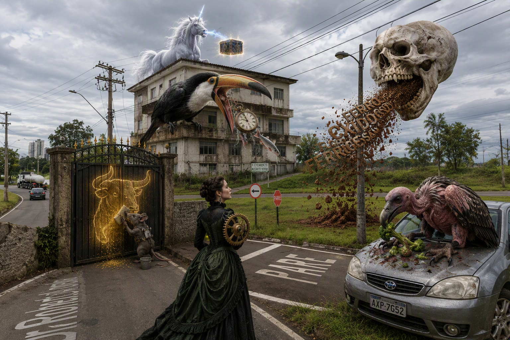

# Communication

<strong>Memory Palace 6: Memory Palace 6: How to Speak Pt 2</strong> · Character: Doc Brown (Back to the Future) · 2 beasts · 2 atoms

_No image_

<em>2 beasts · 2 Knowledge Atoms</em>

#### Knowledge Atoms

### 🟧 [Ab] Abyssinian cat

**Concept**
💡 Package ideas with a Symbol, Slogan, Surprise, Idea, and Story.

**Quote**
“"your ideas are like your children and you don't want them to go into the world in rags"”

**Story**
A glowing Abyssinian cat climbs the ForegroundLeft brick wall, loudly meowing a five-part harmony that magically weaves luxurious silk suits out of thin air for its floating kittens. Doc Brown cheers at the booming song, listening as the rich, melodic notes dress the naked ideas in perfectly tailored, unforgettable clothing.

**Sensory**
auditory 👂

### 🟧 [Ac] acorn

**Concept**
💡 End with a definitive salute or summary, never a weak thank you.

**Quote**
“"when you say thank you even worse thank you for listening it suggests that everybody has stayed that long out of politeness and that they had a profound desire to be somewhere else"”

**Story**
A skeletal acorn rolls into the MidgroundRight alleyway, exhaling a toxic cloud that smells of rotting garbage every time it squeaks a polite apology. Doc Brown covers his nose and strictly commands the nut to deliver a sharp military salute instead, instantly clearing the foul stench of weakness from the air.

**Sensory**
olfactory 👃

<strong>Memory Palace 5: Memory Palace 5: How to Speak Pt 1</strong> · Character: Sherlock Holmes · 5 beasts · 5 atoms

_No image_

<em>5 beasts · 5 Knowledge Atoms</em>

#### Knowledge Atoms

### 🟧 [W] wombat

**Concept**
💡 Success relies on acquired knowledge and practice over talent.

**Quote**
“"Your success in life will be determined largely by your ability to speak your ability to write and the quality of your ideas in that order"”

**Story**
A skyscraper-sized wombat sits on the ForegroundLeft gate, furiously carving microscopic formulas into a steel beam with its heavy claws. Sherlock Holmes runs his bare hands over the deep, jagged scratches, feeling the physical weight of knowledge and practice overwhelming the tiny speck of talent etched at the end.

**Sensory**
tactile ✋

### 🟧 [X] Xena, warrior woman

**Concept**
💡 Talks must open with an empowerment promise for the audience.

**Quote**
“"You want to tell people what they're going to know at the end of the hour that they didn't know at the beginning of the hour it's an empowerment promise"”

**Story**
Xena stands on the MidgroundRight parked car, unleashing a deafening, sonic battle cry that instantly materializes as solid glowing armor on the people around her. Sherlock Holmes listens as the empowering soundwaves loudly promise unbreakable strength, echoing down the street until the hour ends.

**Sensory**
auditory 👂

### 🟧 [Y] yak

**Concept**
💡 Cycle through main points three times to bypass natural fog.

**Quote**
“"at any given moment about 20% of you will be fogged out no matter what the lecture is so if you want to ensure that the probability that everybody gets it is high you need to say it three times"”

**Story**
A glowing yak floats in the BackgroundCenter, vomiting a blinding neon fence that circles its body exactly three times to trap a cloud of thick fog. Sherlock Holmes peers through his magnifying glass, watching the intensely bright, repeating cycles of light completely burn away the 20 percent of fog blocking the street.

**Sensory**
visual 👁️

### 🟧 [Z] Zeus

**Concept**
💡 Provide structural landmarks and ask questions to re-engage.

**Quote**
“"you need to provide some Landmark places where you're announcing that it's a good time to get back on"”

**Story**
Zeus hovers in the Aerial depth slot on a roof, throwing thunderbolts that smell intensely of burning ozone to mark specific landing zones on the pavement. Sherlock Holmes sniffs the sharp, electrical punctuation in the air, using the distinct scent as a landmark to safely step back onto the scorched pathway.

**Sensory**
olfactory 👃

### 🟧 [Aa] aardvark

**Concept**
💡 Eliminate heavy text on slides because reading annoys listeners.

**Quote**
“"people in your audience know how to read and reading will just annoy them"”

**Story**
A colossal aardvark clings to the ForegroundRight lamp post, loudly vomiting thousands of tiny, bitter-tasting alphabet soup letters onto the pavement. Sherlock Holmes scoops up the messy text and eats it, gagging on the sour, annoying flavor of too many written words crowding his mouth instead of a clear voice.

**Sensory**
gustatory 👅

<strong>Memory Palace 4: The Elite Lexicon</strong> · Character: Ada Lovelace · 5 beasts · 5 atoms

<em>5 beasts · 5 Knowledge Atoms</em>

#### Knowledge Atoms

### 🟧 [R] rat

**Concept**
💡 Achieving bedrock clarity requires stripping away unnecessary details.

**Quote**
“Achieving bedrock clarity requires stripping away unnecessary details (like Picasso's bull sketches) by continuously generating "bad output" until it becomes sharp.”

**Story**
A microscopic rat sits on the iron gate in the ForegroundLeft, furiously erasing a massive, chaotic bull painting with its tail. Ada Lovelace cranks a brass gear, and the rat rips away thick layers of canvas until only a shockingly sharp, glowing neon outline of a bull remains in the air.

**Sensory**
👁️ visual

### 🟧 [S] skull

**Concept**
💡 Consciously move evocative words from your deep passive lexicon to your surface automatic retrieval.

**Quote**
“You must consciously move evocative words from your passive understanding (deep lexicon) to your automatic retrieval (surface lexicon) through repetition, replacing generic phrases with vivid ones.”

**Story**
A colossal, floating bone skull hovers by the MidgroundRight lamp post, vomiting out heavy, rusted iron words from its deep jaw. Ada Lovelace hits them repeatedly with a tuning fork, transforming the heavy metal into weightless, blazing surface flares that shoot instantly to the top of the cranium for automatic use.

**Sensory**
👂 auditory

### 🟧 [T] toucan

**Concept**
💡 Anchor abstract ideas in lived sensory memory by populating speech with Time, Audio, Kinesthetic, Eyes, and Smell.

**Quote**
“To give your words "blood and bone," populate your speech using: Time, Audio, Kinesthetic (feeling/touch), Eyes (sight), Smell.”

**Story**
A giant toucan crashes into the BackgroundCenter facade, regurgitating a ticking clock, a booming drum, and a stinking fish onto the pavement. Ada Lovelace touches the visceral mess, feeling the blood and bone materialize as the abstract words mutate into living, screaming sensory organs.

**Sensory**
✋ tactile

### 🟧 [U] unicorn

**Concept**
💡 True comfort is built before speaking by aligning your body, mind, and spirit.

**Quote**
“You must align three pillars: Body: Regulate your nervous system (e.g., diaphragmatic/box breathing). Mind: Shift your focus to serving the audience with a mental primer. Spirit: Speak honestly and strictly in alignment with your core values.”

**Story**
An ethereal unicorn balances on the Aerial roof, exhaling a perfect, glowing box-breathing square to calm its shivering body. Ada Lovelace peers through the box, seeing the unicorn's mind physically laser-focused on a cheering crowd while its spirit radiates a blinding, honest light that burns away the roof tiles.

**Sensory**
🌡️ thermal

### 🟧 [V] vulture

**Concept**
💡 Cognitive sharpness is governed by biological inputs; tracking diet and sleep dictates mental clarity.

**Quote**
“You cannot think or speak clearly if your hardware is compromised. Tracking and optimizing diet and sleep are essential rhetoric tools, as they directly dictate mental clarity.”

**Story**
A featherless vulture squats on the ForegroundRight parked car, aggressively shoving handfuls of raw broccoli and alarm clocks down its own throat. Ada Lovelace injects a digital tracking cable into the bird's spine, instantly rebooting its compromised biological hardware so the vulture shrieks with crystal-clear, deafening mental sharpness.

**Sensory**
👅 gustatory

<strong>Memory Palace 3: Leading Myself</strong> · Character: Alan Turing · 5 beasts · 5 atoms

<em>5 beasts · 5 Knowledge Atoms</em>

#### Knowledge Atoms

### 🟧 [M] marmoset

**Concept**
💡 Clear speaking requires clear thinking.

**Quote**
“clear speaking is the result of clear thinking”

**Story**
A colossal marmoset balances on a street lamp, scrubbing its glowing transparent brain with a giant wire brush. Alan Turing feeds it a complex math puzzle, and the beast screams out perfectly articulated, crystal-clear answers that shatter the nearby windows.

**Sensory**
auditory 👂

### 🟧 [N] Neanderthal

**Concept**
💡 Clarity equals bad output multiplied by frequency.

**Quote**
“the formula for clarity on any idea is clarity equals bad output times frequency”

**Story**
A brutish Neanderthal stands near the front left gate, relentlessly smashing a broken stone tablet over and over. Alan Turing watches closely as the high frequency of bad, clumsy strikes miraculously polishes the stone into a perfectly clear, flawless diamond lens.

**Sensory**
visual 👁️

### 🟧 [O] owl

**Concept**
💡 Texture is creatively bending words into striking phrases.

**Quote**
“texture is the ability to bend twist and and gum words together in creative ways to be able to say phrases that just strike like a lightning bolt”

**Story**
A skyscraper-sized owl perches on a midground brick wall, aggressively chewing thick rubber dictionary pages into a sticky paste. It forcefully spits the chewed, gummed words out, which instantly harden and strike the pavement like a dazzling, crackling lightning bolt.

**Sensory**
tactile ✋

### 🟧 [P] panther

**Concept**
💡 Use personal experiences to color in your speech outlines.

**Quote**
“populate or color your speech with your life use your life and your experiences to color in the outline”

**Story**
A sleek panther paces at the far end of the street, bleeding vibrant, dripping neon paint from its paws. As it walks, it fills in a giant hollow chalk outline on the road with the vivid, wet colors of its own life experiences.

**Sensory**
visual 👁️

### 🟧 [Q] rat

**Concept**
💡 The vocal ego represents your elite, top 2% self.

**Quote**
“the vocal ego is a representation of the elite version of you that 2% version of you”

**Story**
A microscopic rat wearing a tiny gold crown struts on the right-side curb, screaming with the deep, booming voice of an elite opera singer. It commands the dirt and pebbles to form a shining podium, representing the absolute pinnacle of its arrogant vocal ego.

**Sensory**
auditory 👂

<strong>Memory Palace 2: Leading the Business and Others</strong> · Character: (unassigned palace 2) · 5 beasts · 5 atoms

<em>5 beasts · 5 Knowledge Atoms</em>

#### Knowledge Atoms

### 🟧 [D] dragon

**Concept**
💡 Define the business agenda for your own area.

**Quote**
“Define a agenda de negócios para a própria área.”

**Story**
A colossal dragon lands heavily on the gate post, and Goku desperately grabs its scaled tail. The beast breathes a massive, glowing business agenda made of bright neon fire into the sky, forcing everyone to clearly see the defined direction.

**Sensory**
👁️ visual

### 🟧 [E] eagle

**Concept**
💡 Create value according to the general interest of Bosch.

**Quote**
“Cria valor para a empresa de acordo com o interesse geral da Bosch.”

**Story**
An impossibly heavy eagle crashes onto a parked car, crushing its steel roof like paper to hand Goku solid gold bars. The tangible, crushing weight of these delivered results physically alters the vehicle, showing immense value creation.

**Sensory**
✋ tactile

### 🟧 [F] frog

**Concept**
💡 Foster a collaborative and learning organization while driving digital business.

**Quote**
“Fomenta uma organização colaborativa e de aprendizagem. Impulsiona um negócio sustentável e digital.”

**Story**
A skyscraper-sized frog squats at the far end of the street, croaking with a deafening electronic baseline. Goku plugs futuristic digital cables directly into the frog's warty skin, causing the loud croaks to instantly build a collaborative digital city out of soundwaves.

**Sensory**
👂 auditory

### 🟧 [G] goat

**Concept**
💡 Create an environment where people feel comfortable expressing their opinions.

**Quote**
“Cria um ambiente onde as pessoas se sentem à vontade para expressar as suas opiniões e participar em debates saudáveis.”

**Story**
A floating goat balances perfectly on top of a street lamp, emitting a highly concentrated, comforting scent of warm cinnamon. Goku breathes in the trusting aroma and shouts his deepest secrets to the goat, feeling completely safe to express opinions in the sweet-smelling air.

**Sensory**
👃 olfactory

### 🟧 [H] Hydra

**Concept**
💡 Encourage others to take responsibility and achieve exceptional results.

**Quote**
“Incentiva os outros a assumir responsabilidade e alcançar resultados excepcionais. Cria autonomia e estimula a motivação intrínseca.”

**Story**
A multi-headed Hydra bursts out of a tiny metal mailbox, biting into shockingly sour lemons. Goku forces the heads to chew the sour fruit, making them taste the bitter shock of responsibility before they autonomously spit out exceptional golden trophies onto the pavement.

**Sensory**
👅 gustatory

<strong>Memory Palace 1: The Foundations of Rhetoric</strong> · Character: (unassigned palace 1) · 3 beasts · 3 atoms

<em>3 beasts · 3 Knowledge Atoms</em>

#### Knowledge Atoms

### 🟧 [A] Arachne

**Concept**
💡 Ethos is the credibility and authority of the speaker.

**Quote**
“Ethos: A credibilidade e a autoridade do orador.”

**Story**
Arachne (a woman with the lower body of a spider) crawls down onto the street. She wears a tiny judge's wig and holds a shiny gold badge. She waves her many arms to show the crowd her badge, proving she is honest and making everyone respect her high authority.

**Sensory**
—

### 🟧 [B] bird of paradise

**Concept**
💡 Pathos is the emotional appeal used to engage the audience.

**Quote**
“Pathos: O apelo emocional utilizado para envolver o público.”

**Story**
A bright bird of paradise flutters down to perch on Arachne's badge and starts crying with giant, sad eyes. It looks so pathetic and cute that the entire crowd starts weeping with it. The bird actively uses these strong, sad feelings to steal everyone's attention and engage the audience completely.

**Sensory**
—

### 🟧 [C] cat

**Concept**
💡 Logos is the logical structure and the evidence supporting the argument.

**Quote**
“Logos: A estrutura lógica e as evidências que sustentam o argumento.”

**Story**
A small cat jumps down onto the pavement, completely ignoring the crying bird. Instead, it carefully builds a strong, perfectly straight wall out of heavy stone blocks. The cat points at the solid bricks to show the strict, logical structure and the hard evidence that supports its point.

**Sensory**
—

