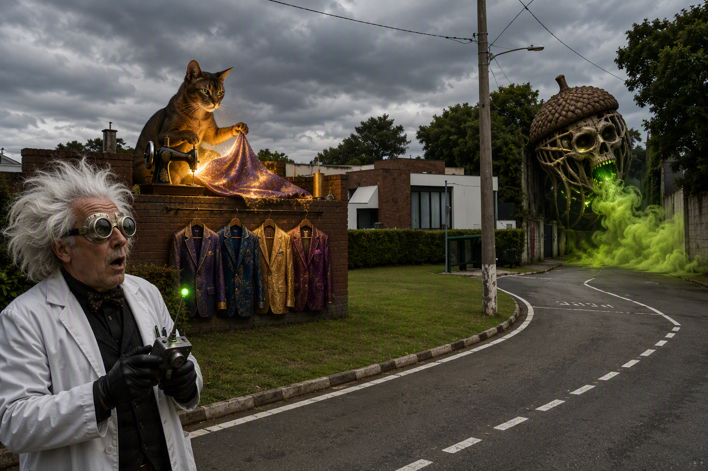
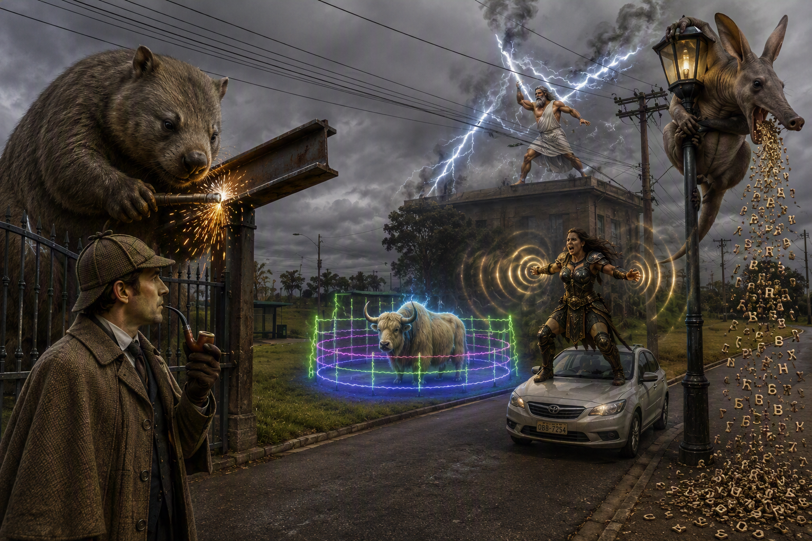
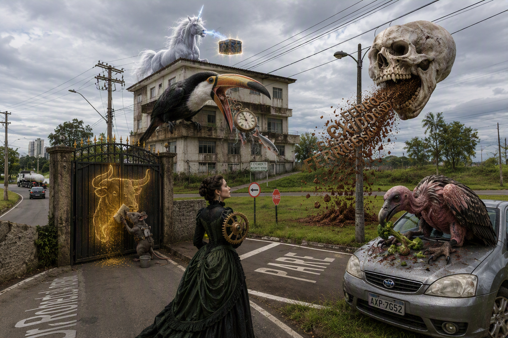
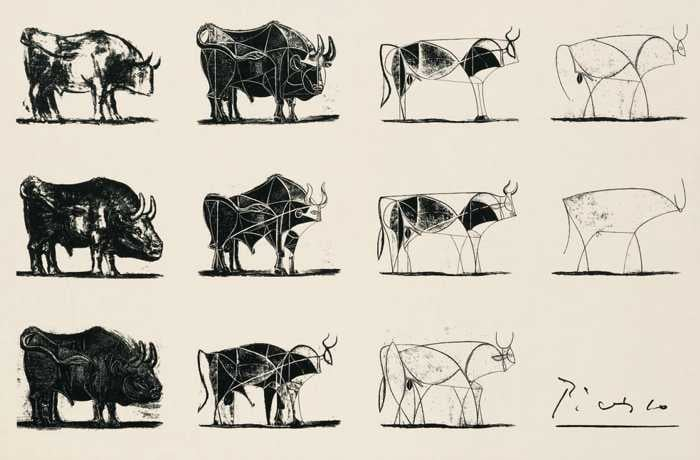
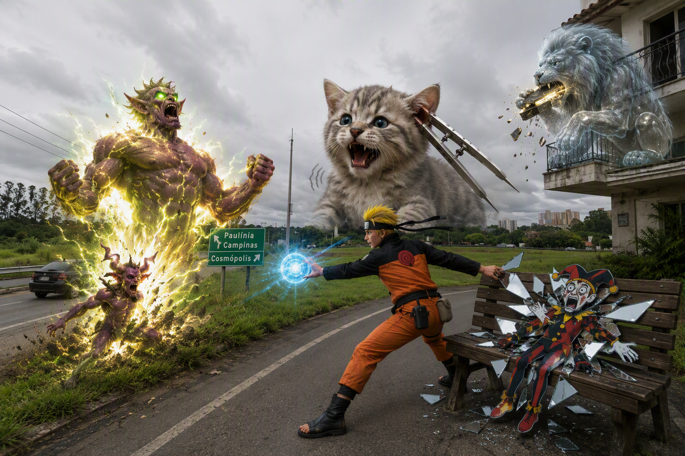
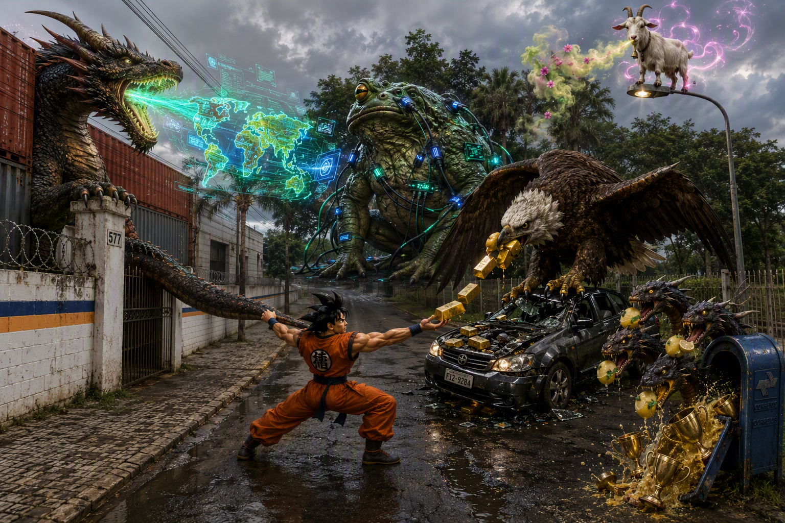
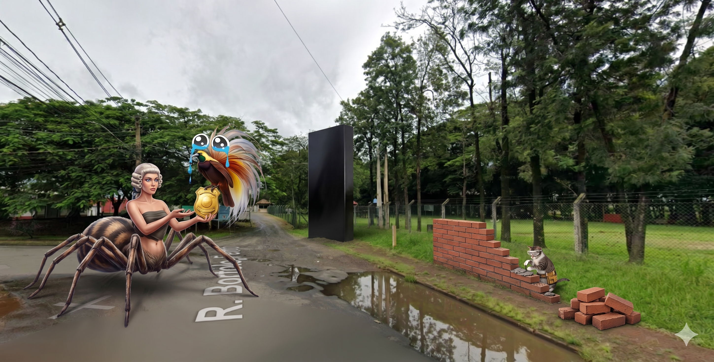

# Communication

<strong>Memory Palace 6: Memory Palace 6: How to Speak Pt 2</strong> · Character: Doc Brown (Back to the Future) · 2 beasts · 2 atoms

<em>2 beasts · 2 Knowledge Atoms</em>

#### Knowledge Atoms

### [Ab] Abyssinian cat

**Concept**
💡 Package ideas with a Symbol, Slogan, Surprise, Idea, and Story.

**Quote**
“"your ideas are like your children and you don't want them to go into the world in rags"”

### [Ac] acorn

**Concept**
💡 End with a definitive salute or summary, never a weak thank you.

**Quote**
“"when you say thank you even worse thank you for listening it suggests that everybody has stayed that long out of politeness and that they had a profound desire to be somewhere else"”

#### Notes

_No notes._

#### Gallery

_No gallery images._

<strong>Memory Palace 5: Memory Palace 5: How to Speak Pt 1</strong> · Character: Sherlock Holmes · 5 beasts · 5 atoms

<em>5 beasts · 5 Knowledge Atoms</em>

#### Knowledge Atoms

### [W] wombat

**Concept**
💡 Success relies on acquired knowledge and practice over talent.

**Quote**
“"Your success in life will be determined largely by your ability to speak your ability to write and the quality of your ideas in that order"”

### [X] Xena, warrior woman

**Concept**
💡 Talks must open with an empowerment promise for the audience.

**Quote**
“"You want to tell people what they're going to know at the end of the hour that they didn't know at the beginning of the hour it's an empowerment promise"”

### [Y] yak

**Concept**
💡 Cycle through main points three times to bypass natural fog.

**Quote**
“"at any given moment about 20% of you will be fogged out no matter what the lecture is so if you want to ensure that the probability that everybody gets it is high you need to say it three times"”

### [Z] Zeus

**Concept**
💡 Provide structural landmarks and ask questions to re-engage.

**Quote**
“"you need to provide some Landmark places where you're announcing that it's a good time to get back on"”

### [Aa] aardvark

**Concept**
💡 Eliminate heavy text on slides because reading annoys listeners.

**Quote**
“"people in your audience know how to read and reading will just annoy them"”

#### Notes

_No notes._

#### Gallery

_No gallery images._

<strong>Memory Palace 4: The Elite Lexicon</strong> · Character: Ada Lovelace · 5 beasts · 5 atoms

<em>5 beasts · 5 Knowledge Atoms</em>

#### Knowledge Atoms

### [R] rat

**Concept**
💡 Achieving bedrock clarity requires stripping away unnecessary details.

**Quote**
“Achieving bedrock clarity requires stripping away unnecessary details (like Picasso's bull sketches) by continuously generating "bad output" until it becomes sharp.”

### [S] skull

**Concept**
💡 Consciously move evocative words from your deep passive lexicon to your surface automatic retrieval.

**Quote**
“You must consciously move evocative words from your passive understanding (deep lexicon) to your automatic retrieval (surface lexicon) through repetition, replacing generic phrases with vivid ones.”

### [T] toucan

**Concept**
💡 Anchor abstract ideas in lived sensory memory by populating speech with Time, Audio, Kinesthetic, Eyes, and Smell.

**Quote**
“To give your words "blood and bone," populate your speech using: Time, Audio, Kinesthetic (feeling/touch), Eyes (sight), Smell.”

### [U] unicorn

**Concept**
💡 True comfort is built before speaking by aligning your body, mind, and spirit.

**Quote**
“You must align three pillars: Body: Regulate your nervous system (e.g., diaphragmatic/box breathing). Mind: Shift your focus to serving the audience with a mental primer. Spirit: Speak honestly and strictly in alignment with your core values.”

### [V] vulture

**Concept**
💡 Cognitive sharpness is governed by biological inputs; tracking diet and sleep dictates mental clarity.

**Quote**
“You cannot think or speak clearly if your hardware is compromised. Tracking and optimizing diet and sleep are essential rhetoric tools, as they directly dictate mental clarity.”

#### Notes

Test

#### Gallery

<strong>Memory Palace 3: Leading Myself</strong> · Character: Alan Turing · 5 beasts · 5 atoms

<em>5 beasts · 5 Knowledge Atoms</em>

#### Knowledge Atoms

### [M] marmoset

**Concept**
💡 Clear speaking requires clear thinking.

**Quote**
“clear speaking is the result of clear thinking”

### [N] Neanderthal

**Concept**
💡 Clarity equals bad output multiplied by frequency.

**Quote**
“the formula for clarity on any idea is clarity equals bad output times frequency”

### [O] owl

**Concept**
💡 Texture is creatively bending words into striking phrases.

**Quote**
“texture is the ability to bend twist and and gum words together in creative ways to be able to say phrases that just strike like a lightning bolt”

### [P] panther

**Concept**
💡 Use personal experiences to color in your speech outlines.

**Quote**
“populate or color your speech with your life use your life and your experiences to color in the outline”

### [Q] rat

**Concept**
💡 The vocal ego represents your elite, top 2% self.

**Quote**
“the vocal ego is a representation of the elite version of you that 2% version of you”

#### Notes

_No notes._

#### Gallery

_No gallery images._

<strong>Memory Palace 2: Leading the Business and Others</strong> · Character: (unassigned palace 2) · 5 beasts · 5 atoms

<em>5 beasts · 5 Knowledge Atoms</em>

#### Knowledge Atoms

### [D] dragon

**Concept**
💡 Define the business agenda for your own area.

**Quote**
“Define a agenda de negócios para a própria área.”

### [E] eagle

**Concept**
💡 Create value according to the general interest of Bosch.

**Quote**
“Cria valor para a empresa de acordo com o interesse geral da Bosch.”

### [F] frog

**Concept**
💡 Foster a collaborative and learning organization while driving digital business.

**Quote**
“Fomenta uma organização colaborativa e de aprendizagem. Impulsiona um negócio sustentável e digital.”

### [G] goat

**Concept**
💡 Create an environment where people feel comfortable expressing their opinions.

**Quote**
“Cria um ambiente onde as pessoas se sentem à vontade para expressar as suas opiniões e participar em debates saudáveis.”

### [H] Hydra

**Concept**
💡 Encourage others to take responsibility and achieve exceptional results.

**Quote**
“Incentiva os outros a assumir responsabilidade e alcançar resultados excepcionais. Cria autonomia e estimula a motivação intrínseca.”

#### Notes

_No notes._

#### Gallery

_No gallery images._

<strong>Memory Palace 1: The Foundations of Rhetoric</strong> · Character: (unassigned palace 1) · 3 beasts · 3 atoms

<em>3 beasts · 3 Knowledge Atoms</em>

#### Knowledge Atoms

### [A] Arachne

**Concept**
💡 Ethos is the credibility and authority of the speaker.

**Quote**
“Ethos: A credibilidade e a autoridade do orador.”

### [B] bird of paradise

**Concept**
💡 Pathos is the emotional appeal used to engage the audience.

**Quote**
“Pathos: O apelo emocional utilizado para envolver o público.”

### [C] cat

**Concept**
💡 Logos is the logical structure and the evidence supporting the argument.

**Quote**
“Logos: A estrutura lógica e as evidências que sustentam o argumento.”

#### Notes

_No notes._

#### Gallery

_No gallery images._

