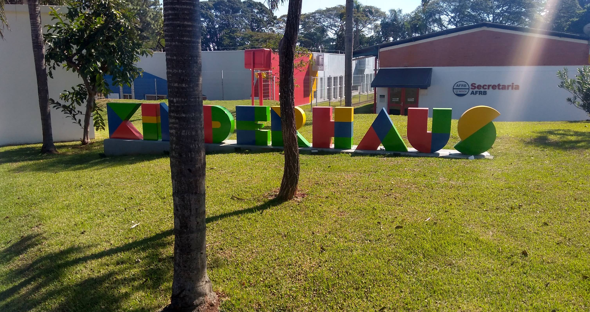
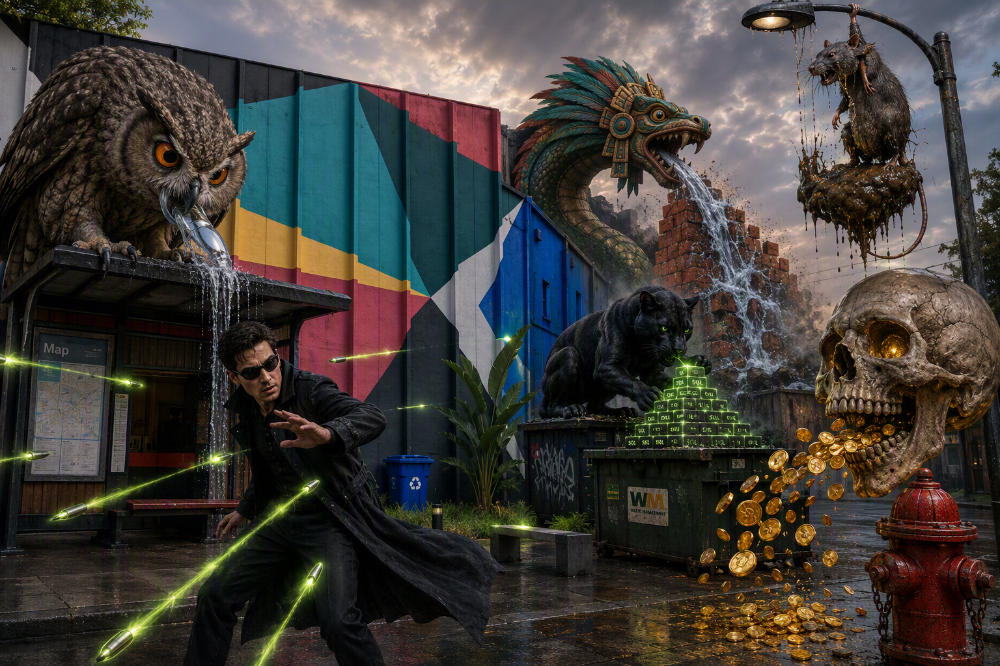
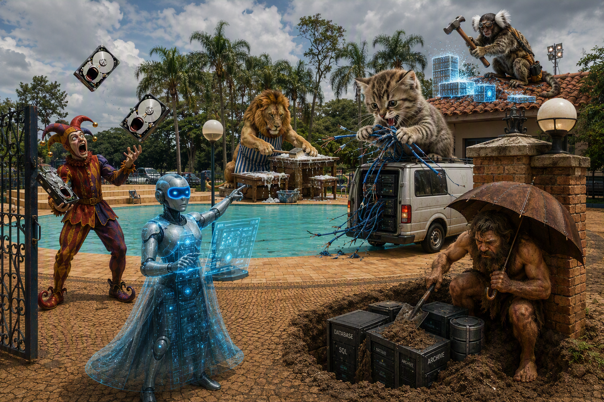

# Data Analyst

<strong>Memory Palace 6: Power Query Automation</strong> · Character: Bill Gates · 2 beasts · 2 atoms

_No image_

<em>2 beasts · 2 Knowledge Atoms</em>

#### Knowledge Atoms

### 🟧 [Y] yak

**Concept**
💡 [I <kbd><strong><u>track</u></strong></kbd> every adjustment] [in the Applied Steps <kbd><strong><u>list</u></strong></kbd>] [to easily <kbd><strong><u>delete</u></strong></kbd> or reorder modifications] — Note: This prevents mistakes from breaking the entire data pipeline.

🔑 **Keywords**

- [**track**] → [footprints]
- [**list**] → [stairs]
- [**delete**] → [eraser]

**Quote**
“Power Query remembers every single transformation that we make on our data.”

**Sensory**
visual 👁️

**Story**
A yak furiously stomps on the "Applied Steps" list next to the fire hydrant, tracking each hoofprint as a sequential adjustment before using a giant eraser to casually wipe a mistaken step away.

### 🟧 [Z] Zeus

**Concept**
💡 [I automatically <kbd><strong><u>apply</u></strong></kbd> all saved transformations] [to new folder <kbd><strong><u>files</u></strong></kbd>] [by <kbd><strong><u>clicking</u></strong></kbd> Refresh All] — Note: This completely automates future monthly data cleanups.

🔑 **Keywords**

- [**apply**] → [robot]
- [**files**] → [folder]
- [**clicking**] → [lightning]

**Quote**
“If I bring additional files into this folder, it'll bring that data in automatically and it'll apply all of the transformations to that data.”

**Sensory**
olfactory 👃

**Story**
Zeus hurls lightning bolts at a giant "Refresh All" button next to the park bench, automatically pulling in a waterfall of new folder files and robotically spitting out perfectly stacked spreadsheets.

#### Notes

_No notes._

#### Gallery

_No gallery images._

<strong>Memory Palace 5: Power Query Basics</strong> · Character: Steve Jobs · 5 beasts · 5 atoms

<em>5 beasts · 5 Knowledge Atoms</em>

#### Knowledge Atoms

### 🟧 [T] toucan

**Concept**
💡 [I <kbd><strong><u>click</u></strong></kbd> Get Data and select From Folder] [to <kbd><strong><u>append</u></strong></kbd> multiple recurring reports] [simultaneously] — Note: This prevents manually importing single spreadsheets one by one.

🔑 **Keywords**

- [**click**] → [folder]
- [**append**] → [stack]

**Quote**
“Within the From File list, I'm going to click on the option that says From Folder.”

**Sensory**
tactile ✋

**Story**
A colossal toucan uses its beak to click a giant "Get Data" button, then rips open a "From Folder" drawer on the rusty gate to simultaneously suck in a tornado of flying monthly reports.

### 🟧 [U] unicorn

**Concept**
💡 [I <kbd><strong><u>click</u></strong></kbd> Transform Data] [to <kbd><strong><u>modify</u></strong></kbd> merged file contents] [<kbd><strong><u>inside</u></strong></kbd> the Power Query Editor] [before <kbd><strong><u>loading</u></strong></kbd> it] — Note: This editor acts as a secure staging environment before data reaches Excel.

🔑 **Keywords**

- [**click**] → [portal]
- [**modify**] → [wrench]
- [**inside**] → [shield]
- [**loading**] → [forklift]

**Quote**
“Transform allows me to modify the data before pulling it into Microsoft Excel or into Power BI.”

**Sensory**
auditory 👂

**Story**
A glowing unicorn impales a massive "Transform Data" block against the brick wall, opening a secure Power Query Editor portal where it slices chunky files into smooth liquid data before loading them into a cart.

### 🟧 [V] vulture

**Concept**
💡 [I <kbd><strong><u>manage</u></strong></kbd> active queries in the left pane] [and <kbd><strong><u>preview</u></strong></kbd> data samples in the center] [of the Power Query Interface] — Note: The right pane controls query properties and the Applied Steps history.

🔑 **Keywords**

- [**manage**] → [ship wheel]
- [**preview**] → [magnifying glass]

**Quote**
“Over on the left hand side where we see all of our different queries... in the center of the screen I can see a sample of my data.”

**Sensory**
visual 👁️

**Story**
A vulture operates a giant Power Query Interface at the end of the street, steering active query ship wheels on the left pane while peering through a magnifying glass at data samples floating in the center.

### 🟧 [W] wombat

**Concept**
💡 [I <kbd><strong><u>click</u></strong></kbd> Split Column By Delimiter] [to <kbd><strong><u>separate</u></strong></kbd> combined text strings] [into <kbd><strong><u>distinct columns</u></strong></kbd>] — Note: A delimiter can be a space, dash, or any custom sequence.

🔑 **Keywords**

- [**click**] → [axe]
- [**separate**] → [rope]
- [**distinct columns**] → [pillar]

**Quote**
“I can go down to the option that says Split Column, and I want to split it by delimiter.”

**Sensory**
auditory 👂

**Story**
Balanced on the lamp post, a wombat violently clicks a massive "Split Column" axe, using a specific delimiter dash to chop a concrete block of text into two perfectly distinct columns.

### 🟧 [X] Xena, warrior woman

**Concept**
💡 [I <kbd><strong><u>use</u></strong></kbd> the Add Column tab] [to <kbd><strong><u>apply</u></strong></kbd> mathematical operations] [<kbd><strong><u>across</u></strong></kbd> existing data] — Note: An example is subtracting cost from revenue to calculate profit.

🔑 **Keywords**

- [**use**] → [tab]
- [**apply**] → [calculator]
- [**across**] → [bridge]

**Quote**
“I want to take the revenue and subtract the cost, so I'll click on the option that says Subtract.”

**Sensory**
visual 👁️

**Story**
Xena, warrior woman swings her sword at the "Add Column" tab on the hood of the parked car, applying standard mathematical operations that generate a geyser of golden profit coins.

#### Notes

_No notes._

#### Gallery

_No gallery images._

<strong>Memory Palace 4: Data Architectures 2</strong> · Character: Neo (The Matrix) · 5 beasts · 5 atoms

<em>5 beasts · 5 Knowledge Atoms</em>

#### Knowledge Atoms

### 🟧 [O] owl

**Concept**
💡 [Data Lake: I <kbd><strong><u>store</u></strong></kbd> structured, semi-structured, and unstructured raw data] [in a <kbd><strong><u>centralized</u></strong></kbd>, low-cost object storage system[cite: 1].]

🔑 **Keywords**

- [**store**] → [bucket]
- [**centralized**] → [swimming pool]

**Quote**
“Centralized storage for structured, semi-structured, and unstructured raw data in low-cost object storage."[cite: 1]”

**Sensory**
gustatory 👅

**Story**
Perched atop the bus stop, a skyscraper-sized owl drinks raw unstructured data from a massive low-cost storage lake, tasting the metallic flavor of semi-structured fish[cite: 1].

### 🟧 [P] panther

**Concept**
💡 [Data Warehouse: A highly <kbd><strong><u>structured</u></strong></kbd>, schema-on-write repository] [optimized for SQL <kbd><strong><u>analytics</u></strong></kbd>] [and business <kbd><strong><u>intelligence</u></strong></kbd>[cite: 1].]

🔑 **Keywords**

- [**structured**] → [filing cabinet]
- [**analytics**] → [magnifying glass]
- [**intelligence**] → [briefcase]

**Quote**
“Highly structured, schema-on-write repository optimized for SQL analytics and business intelligence."[cite: 1]”

**Sensory**
visual 👁️

**Story**
Beside the dumpster, a panther constructs a highly structured schema-on-write pyramid out of SQL blocks, arranging glowing business intelligence analytics in perfect symmetry[cite: 1].

### 🟧 [Q] Quetzalcoatl

**Concept**
💡 [Data Lakehouse: A <kbd><strong><u>hybrid</u></strong></kbd> architecture] [combining the scale and <kbd><strong><u>flexibility</u></strong></kbd> of a data lake] [with the <kbd><strong><u>reliability</u></strong></kbd> of a warehouse[cite: 1].] — Note: Includes ACID features like Delta Lake on top of cloud storage[cite: 1].

🔑 **Keywords**

- [**hybrid**] → [centaur]
- [**flexibility**] → [rubber band]
- [**reliability**] → [vault]

**Quote**
“Hybrid architecture combining the scale and flexibility of a data lake with the reliability and ACID features of a warehouse (e.g., Delta Lake on top of cloud storage)."[cite: 1]”

**Sensory**
tactile ✋

**Story**
At the alley dead-end, a colossal Quetzalcoatl merges a fluid, flexible lake of water with solid, reliable warehouse bricks, forging an unbreakable ACID-resistant hybrid architecture[cite: 1].

### 🟧 [R] rat

**Concept**
💡 [Data Swamp: A poorly <kbd><strong><u>governed</u></strong></kbd> data lake] [where data is <kbd><strong><u>uncataloged</u></strong></kbd>, undocumented,] [and difficult to <kbd><strong><u>retrieve</u></strong></kbd>[cite: 1].]

🔑 **Keywords**

- [**governed**] → [broken crown]
- [**uncataloged**] → [shredder]
- [**retrieve**] → [fishing rod]

**Quote**
“A poorly governed data lake where data is uncataloged, undocumented, and difficult to retrieve."[cite: 1]”

**Sensory**
olfactory 👃

**Story**
Hanging precariously from a lamppost, a rat drowns in a poorly governed swamp of uncataloged data, gagging on the rancid stench of undocumented files rotting in the mud below[cite: 1].

### 🟧 [S] skull

**Concept**
💡 [Data Mart: A <kbd><strong><u>specialized</u></strong></kbd> subset of a data warehouse] [<kbd><strong><u>focused</u></strong></kbd> on a specific business line or department[cite: 1].] — Note: Examples include Finance or Marketing[cite: 1].

🔑 **Keywords**

- [**specialized**] → [scalpel]
- [**focused**] → [spotlight]

**Quote**
“A subset of a data warehouse focused on a specific business line or department (e.g., Finance, Marketing)."[cite: 1]”

**Sensory**
auditory 👂

**Story**
Hovering over the fire hydrant, a giant floating skull bites off a specialized subset of a warehouse, chewing loudly as it focuses exclusively on spitting out finance department coins[cite: 1].

#### Notes

_No notes._

#### Gallery

_No gallery images._

<strong>Memory Palace 3: Data Architectures 1</strong> · Character: GitHub Copilot · 5 beasts · 5 atoms

<em>5 beasts · 5 Knowledge Atoms</em>

#### Knowledge Atoms

### 🟧 [J] jester

**Concept**
💡 ETL Pipeline: I move raw data from multiple disparate sources into a centralized target system using an automated integration pipeline[cite: 1]. — Note: The target is typically a Data Warehouse or Data Mart[cite: 1].

**Keywords**
_No keywords yet_

**Quote**
“ETL is an automated data integration process that moves data from multiple disparate sources into a centralized target system, typically a Data Warehouse or Data Mart."[cite: 1]”

**Sensory**
auditory 👂

**Story**
A jester juggles multiple disparate screaming data hard drives at the iron gate, funneling them into a single massive golden target vault[cite: 1].

### 🟧 [K] kitten

**Concept**
💡 Extract Phase: I retrieve raw data from various origin systems during the first pipeline phase[cite: 1]. — Note: Sources include operational databases, SaaS applications, APIs, or flat files[cite: 1].

**Keywords**
_No keywords yet_

**Quote**
“Retrieving raw data from various source systems, such as operational databases, SaaS applications, APIs, or flat files."[cite: 1]”

**Sensory**
tactile ✋

**Story**
A giant kitten digs its sharp claws into a flat file server rack on top of the parked van, ripping out dripping raw data cables with extreme force[cite: 1].

### 🟧 [L] lion

**Concept**
💡 Transform Phase: I clean, structure, and enrich the data in a temporary staging area to meet business requirements[cite: 1]. — Note: Includes standardizing formats, filtering anomalies, joining tables, and mapping to a predefined schema[cite: 1].

**Keywords**
_No keywords yet_

**Quote**
“Cleaning, structuring, and enriching the data in a temporary staging area to meet business and analytical requirements. This includes standardizing date formats, filtering anomalies, joining tables, applying business logic, and mapping the data to a predefined schema."[cite: 1]”

**Sensory**
visual 👁️

**Story**
At the central stone fountain, a lion scrubs muddy data tables in a glowing temporary staging pool, filtering out glowing red anomalies until the water runs crystal clear[cite: 1].

### 🟧 [M] marmoset

**Concept**
💡 Load Phase: I write the fully processed data into the target repository[cite: 1]. — Note: This makes it immediately available for business intelligence tools and analytics[cite: 1].

**Keywords**
_No keywords yet_

**Quote**
“Writing the fully processed data into the target repository, making it immediately available for business intelligence tools and analytics."[cite: 1]”

**Sensory**
thermal 🌡️

**Story**
Up on the rooftop, a marmoset violently hammers white-hot glowing processed data blocks into a target repository vault, sending sparks flying everywhere[cite: 1].

### 🟧 [N] Neanderthal

**Concept**
💡 Data Store: Any repository that persists and manages a collection of data[cite: 1]. — Note: Ranges from traditional relational databases to cloud object storage[cite: 1].

**Keywords**
_No keywords yet_

**Quote**
“An umbrella term for any repository that persists and manages a collection of data, ranging from traditional relational databases and NoSQL key-value stores to file systems, caches, and cloud object storage."[cite: 1]”

**Sensory**
olfactory 👃

**Story**
By the front brick pillar, a Neanderthal manages a massive collection of data by burying stinking, rotting caches of relational databases under a giant leather umbrella[cite: 1].

#### Notes

_No notes._

#### Gallery

_No gallery images._

<strong>Memory Palace 2: Data Analytics Fundamentals</strong> · Character: Alan Turing · 5 beasts · 5 atoms

<em>5 beasts · 5 Knowledge Atoms</em>

#### Knowledge Atoms

### 🟧 [E] eagle

**Concept**
💡 I analyze raw data to extract useful business insights. — Note: Transforms unorganized datasets into actionable intelligence.

**Keywords**
_No keywords yet_

**Quote**
“Data analytics is the process of analyzing raw data so that we can pull out insights which are useful to companies.”

**Sensory**
👁️ visual

**Story**
Perched on the iron gatepost, a giant eagle rips open a massive floating jigsaw puzzle box, violently squeezing raw wooden letters into a blinding neon sign reading INSIGHTS.

### 🟧 [F] frog

**Concept**
💡 I apply analytics to speed decisions, cut costs, and develop products. — Note: Optimizes operational performance and predicts market behavior.

**Keywords**
_No keywords yet_

**Quote**
“Broadly speaking, data analytics is used to make faster and better business decisions, to reduce overall business costs, and to develop new and innovative products and services.”

**Sensory**
👂 auditory

**Story**
Beside a parked bakery delivery truck, a neon-striped frog croaks at deafening volume, spitting high-speed golden coin streams that slice red expense ledgers in half.

### 🟧 [G] goat

**Concept**
💡 I evaluate team data to shape future business strategies. — Note: Serves as the cross-functional bridge between raw metrics and executive planning.

**Keywords**
_No keywords yet_

**Quote**
“Work as part of a team to evaluate and analyze key data that will be used to shape future business strategies.”

**Sensory**
✋ tactile

**Story**
Against the central brick facade, a goat rams its head into an oversized blue architectural blueprint, grinding tactical charts into glowing chalk paste with sandpaper-textured horns.

### 🟧 [H] Hydra

**Concept**
💡 I turn refined data into valuable business insights. — Note: The culmination of a five-step pipeline spanning definition, collection, cleaning, analysis, and presentation.

**Keywords**
_No keywords yet_

**Quote**
“The final step in this process is where data is turned into valuable business insights.”

**Sensory**
🌡️ thermal

**Story**
Sprawled across the upper roof tiles, a seven-headed Hydra spews boiling chemical solvent across five descending conveyor belts, crystallizing raw sludge into sparkling ruby ingots that radiate intense heat.

### 🟧 [I] imp

**Concept**
💡 I dig deeper beyond number crunching to understand underlying causes. — Note: Balances quantitative technical skills like SQL with qualitative critical reasoning.

**Keywords**
_No keywords yet_

**Quote**
“It's not just about crunching the numbers and sharing your data. Sometimes you'll need to dig deeper to understand really what's going on.”

**Sensory**
👃 olfactory

**Story**
Next to the front stone curb, an imp burrows frantically into the asphalt with a glowing pitchfork, releasing a pungent sulfur stench as it unearths hidden subterranean data cables.

#### Notes

_No notes._

#### Gallery

_No gallery images._

<strong>Memory Palace 1: Data Analyst vs Data Scientist Foundations</strong> · Character: Ada Lovelace · 4 beasts · 5 atoms

<em>4 beasts · 5 Knowledge Atoms</em>

#### Knowledge Atoms

### 🟧 [A] Arachne

🟦 **Z1 · Head**

**Concept**
💡 Core objective difference: Data Analysts explain past/present to inform decisions; Data Scientists build predictive models to forecast and automate.

**Keywords**
_No keywords yet_

**Quote**
“The primary difference lies in their core focus: a Data Analyst examines historical data to answer specific business questions and identify existing trends, while a Data Scientist builds predictive models, algorithms, and experiments to forecast future outcomes and discover unknowns.”

**Sensory**
👁️ visual

**Story**
Arachne weaves an enormous glowing spiderweb across a historic stone gate, splitting the silk threads into backwards-pointing silver clocks on the left and self-assembling automated crystal robotic arms reaching forward on the right.

---

🟦 **Z2 · Forelimbs**

**Concept**
💡 Primary focus: descriptive and diagnostic (What happened? Why?) vs predictive and prescriptive modeling (What will happen? How to optimize?).

**Keywords**
_No keywords yet_

**Quote**
“Descriptive and diagnostic analysis (answering "What happened?" and "Why?")”

**Sensory**
👂 auditory

**Story**
An oversized megaphone headpiece clamped to Arachne's forelegs screeches past events loudly while projecting a vivid diagnostic x-ray across the brick pillars.

### 🟧 [B] bird of paradise

**Concept**
💡 Key objectives: dashboards and KPI tracking vs ML pipelines and algorithmic automation.

**Keywords**
_No keywords yet_

**Quote**
“Dashboards, KPI tracking, business reports, trend identification”

**Sensory**
✋ tactile

**Story**
A bird of paradise violently rakes its metallic claws against the parked vintage van's side door, carving neon KPI dials and glowing dashboard gauges that erupt in showers of colored spark metrics.

### 🟧 [C] cat

**Concept**
💡 Data types handled: structured relational tables/spreadsheets vs structured and unstructured multi-modal streams (images, audio, clickstreams).

**Keywords**
_No keywords yet_

**Quote**
“Structured data from relational databases and warehouses”

**Sensory**
🌡️ thermal

**Story**
Perched at the central storefront pillar, a cat exhales icy SQL tables from its mouth that freeze instantly into rigid glass spreadsheets, shattering floating clouds of clickstream smoke.

### 🟧 [D] dragon

**Concept**
💡 Core tooling and workflow: SQL/BI dashboards isolating friction vs Python/ML/pipelines training real-time automated churn classifiers.

**Keywords**
_No keywords yet_

**Quote**
“Queries an e-commerce database using SQL to identify that customer churn increased by 15% in Q3, isolates the drop to checkout friction, and presents a visual dashboard to product managers.”

**Sensory**
👃 olfactory

**Story**
High on the rooftop balcony, a dragon tears open an oversized e-commerce invoice with its teeth, releasing an acrid, sharp scent of liquid Python code that dissolves robotic churn traps.

#### Notes

_No notes._

#### Gallery

_No gallery images._

