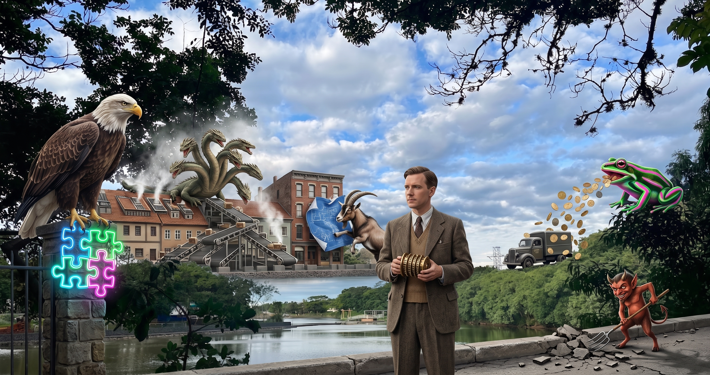
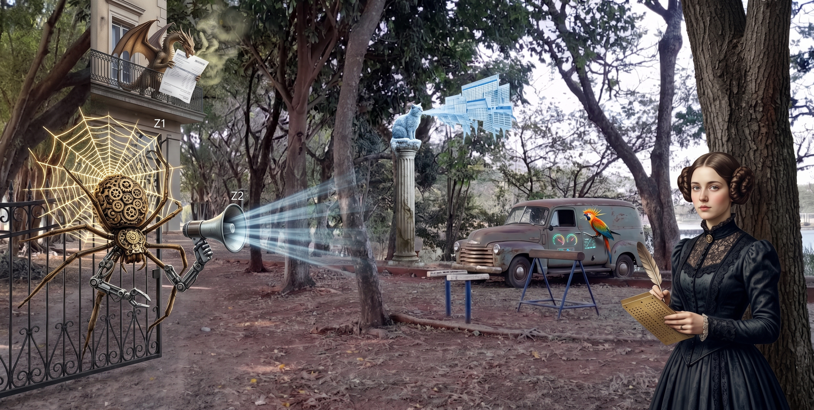

# Data Analyst

<strong>Memory Palace 2: Data Analytics Fundamentals</strong> · Character: Alan Turing · 5 beasts · 5 atoms

<em>5 beasts · 5 Knowledge Atoms</em>

#### Knowledge Atoms

### 🟧 [E] eagle

**Concept**
💡 I analyze raw data to extract useful business insights. — Note: Transforms unorganized datasets into actionable intelligence.

**Quote**
“Data analytics is the process of analyzing raw data so that we can pull out insights which are useful to companies.”

**Sensory**
👁️ visual

**Story**
Perched on the iron gatepost, a giant eagle rips open a massive floating jigsaw puzzle box, violently squeezing raw wooden letters into a blinding neon sign reading INSIGHTS.

### 🟧 [F] frog

**Concept**
💡 I apply analytics to speed decisions, cut costs, and develop products. — Note: Optimizes operational performance and predicts market behavior.

**Quote**
“Broadly speaking, data analytics is used to make faster and better business decisions, to reduce overall business costs, and to develop new and innovative products and services.”

**Sensory**
👂 auditory

**Story**
Beside a parked bakery delivery truck, a neon-striped frog croaks at deafening volume, spitting high-speed golden coin streams that slice red expense ledgers in half.

### 🟧 [G] goat

**Concept**
💡 I evaluate team data to shape future business strategies. — Note: Serves as the cross-functional bridge between raw metrics and executive planning.

**Quote**
“Work as part of a team to evaluate and analyze key data that will be used to shape future business strategies.”

**Sensory**
✋ tactile

**Story**
Against the central brick facade, a goat rams its head into an oversized blue architectural blueprint, grinding tactical charts into glowing chalk paste with sandpaper-textured horns.

### 🟧 [H] Hydra

**Concept**
💡 I turn refined data into valuable business insights. — Note: The culmination of a five-step pipeline spanning definition, collection, cleaning, analysis, and presentation.

**Quote**
“The final step in this process is where data is turned into valuable business insights.”

**Sensory**
🌡️ thermal

**Story**
Sprawled across the upper roof tiles, a seven-headed Hydra spews boiling chemical solvent across five descending conveyor belts, crystallizing raw sludge into sparkling ruby ingots that radiate intense heat.

### 🟧 [I] imp

**Concept**
💡 I dig deeper beyond number crunching to understand underlying causes. — Note: Balances quantitative technical skills like SQL with qualitative critical reasoning.

**Quote**
“It's not just about crunching the numbers and sharing your data. Sometimes you'll need to dig deeper to understand really what's going on.”

**Sensory**
👃 olfactory

**Story**
Next to the front stone curb, an imp burrows frantically into the asphalt with a glowing pitchfork, releasing a pungent sulfur stench as it unearths hidden subterranean data cables.

#### Notes

_No notes._

#### Gallery

_No gallery images._

<strong>Memory Palace 1: Data Analyst vs Data Scientist Foundations</strong> · Character: Ada Lovelace · 4 beasts · 5 atoms

<em>4 beasts · 5 Knowledge Atoms</em>

#### Knowledge Atoms

### 🟧 [A] Arachne

🟦 **Z1 · Head**

**Concept**
💡 Core objective difference: Data Analysts explain past/present to inform decisions; Data Scientists build predictive models to forecast and automate.

**Quote**
“The primary difference lies in their core focus: a Data Analyst examines historical data to answer specific business questions and identify existing trends, while a Data Scientist builds predictive models, algorithms, and experiments to forecast future outcomes and discover unknowns.”

**Sensory**
👁️ visual

**Story**
Arachne weaves an enormous glowing spiderweb across a historic stone gate, splitting the silk threads into backwards-pointing silver clocks on the left and self-assembling automated crystal robotic arms reaching forward on the right.

---

🟦 **Z2 · Forelimbs**

**Concept**
💡 Primary focus: descriptive and diagnostic (What happened? Why?) vs predictive and prescriptive modeling (What will happen? How to optimize?).

**Quote**
“Descriptive and diagnostic analysis (answering "What happened?" and "Why?")”

**Sensory**
👂 auditory

**Story**
An oversized megaphone headpiece clamped to Arachne's forelegs screeches past events loudly while projecting a vivid diagnostic x-ray across the brick pillars.

### 🟧 [B] bird of paradise

**Concept**
💡 Key objectives: dashboards and KPI tracking vs ML pipelines and algorithmic automation.

**Quote**
“Dashboards, KPI tracking, business reports, trend identification”

**Sensory**
✋ tactile

**Story**
A bird of paradise violently rakes its metallic claws against the parked vintage van's side door, carving neon KPI dials and glowing dashboard gauges that erupt in showers of colored spark metrics.

### 🟧 [C] cat

**Concept**
💡 Data types handled: structured relational tables/spreadsheets vs structured and unstructured multi-modal streams (images, audio, clickstreams).

**Quote**
“Structured data from relational databases and warehouses”

**Sensory**
🌡️ thermal

**Story**
Perched at the central storefront pillar, a cat exhales icy SQL tables from its mouth that freeze instantly into rigid glass spreadsheets, shattering floating clouds of clickstream smoke.

### 🟧 [D] dragon

**Concept**
💡 Core tooling and workflow: SQL/BI dashboards isolating friction vs Python/ML/pipelines training real-time automated churn classifiers.

**Quote**
“Queries an e-commerce database using SQL to identify that customer churn increased by 15% in Q3, isolates the drop to checkout friction, and presents a visual dashboard to product managers.”

**Sensory**
👃 olfactory

**Story**
High on the rooftop balcony, a dragon tears open an oversized e-commerce invoice with its teeth, releasing an acrid, sharp scent of liquid Python code that dissolves robotic churn traps.

#### Notes

_No notes._

#### Gallery

_No gallery images._

