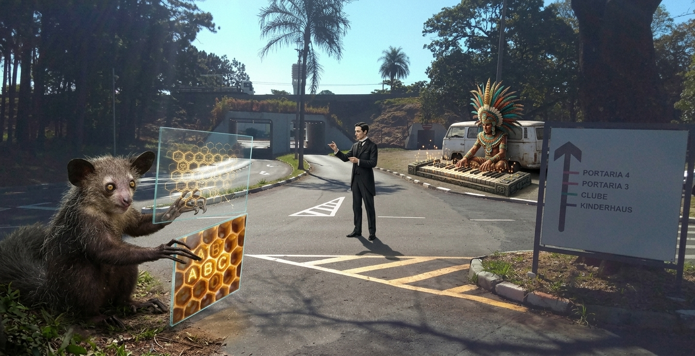
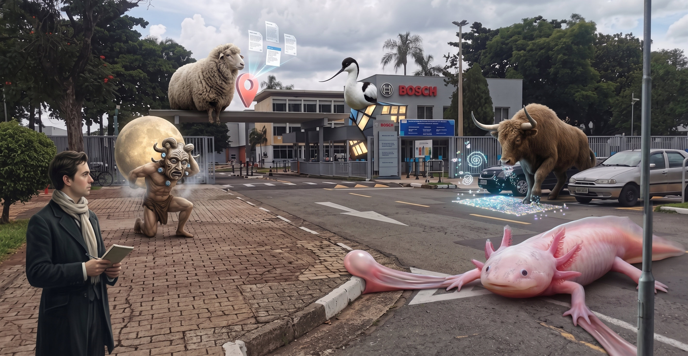
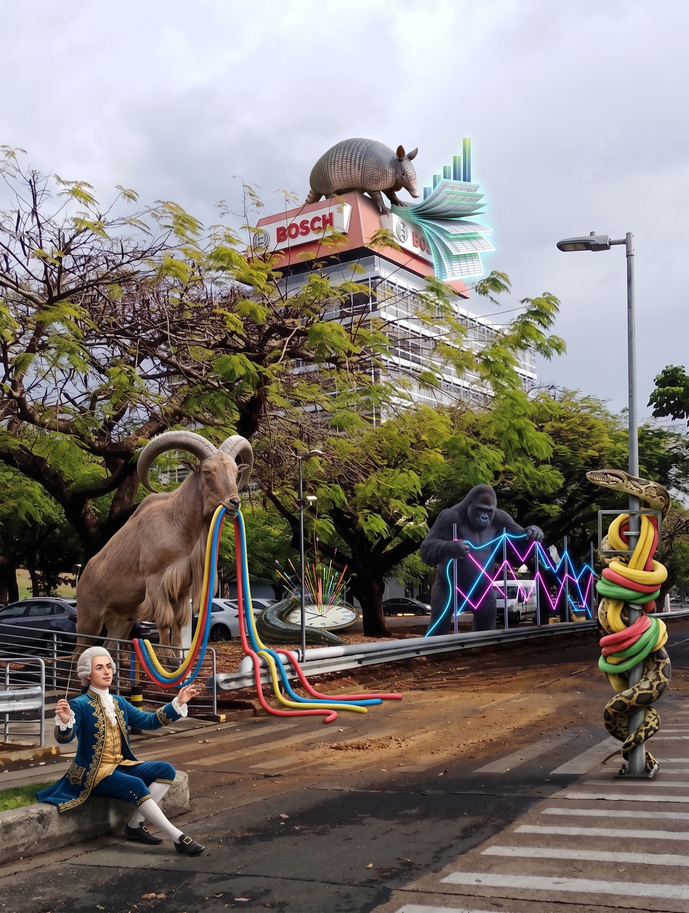
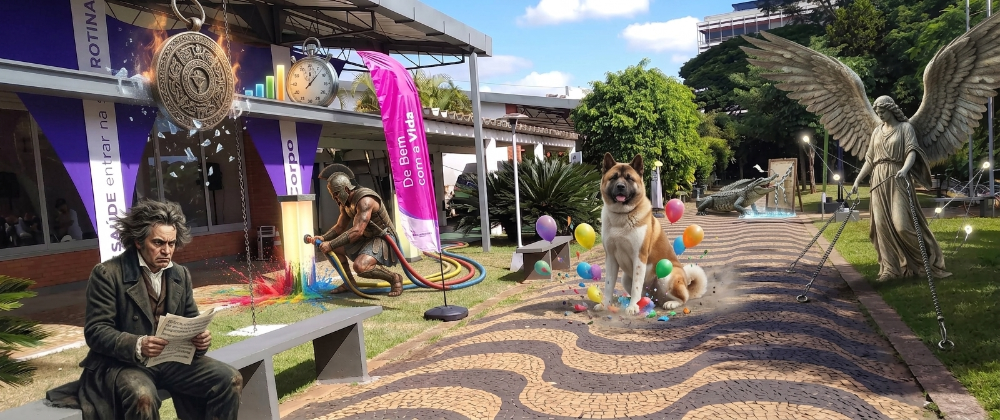
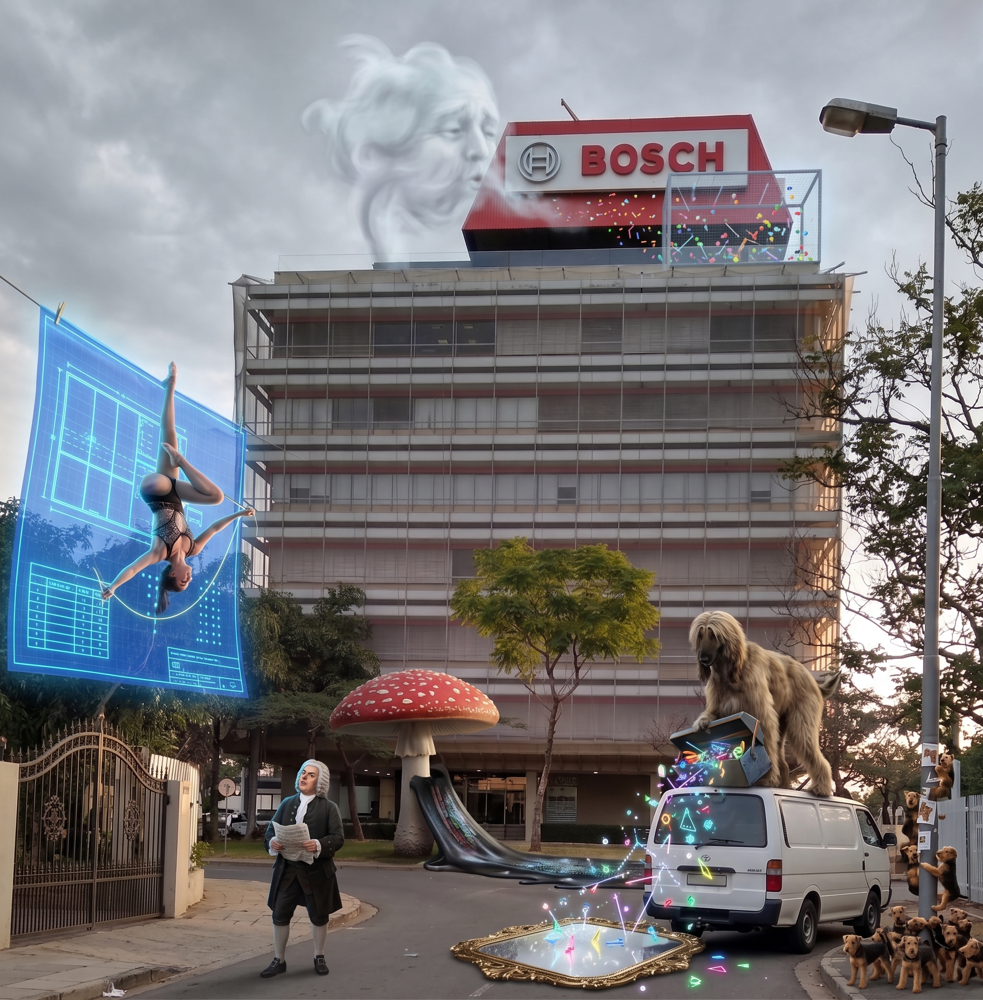
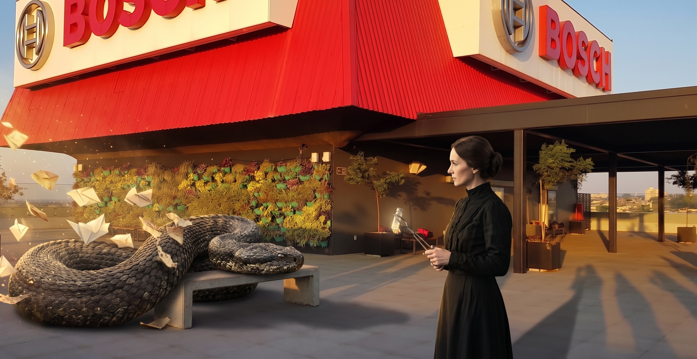
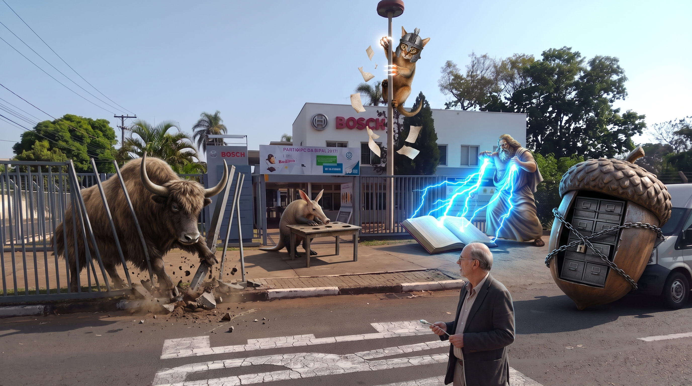
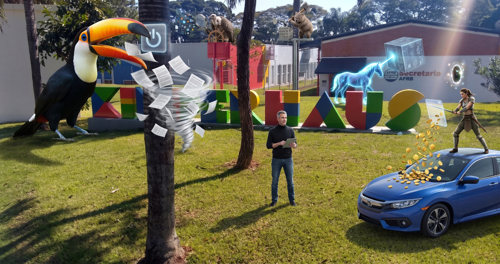

# Data Analyst

<strong>Memory Palace 12: Location Probes & Rearrangement</strong> · Character: Maurice Ravel · 2 beasts · 2 atoms

<em>2 beasts · 2 Knowledge Atoms</em>

#### Knowledge Atoms

### 🟧 [Ay] aye-aye

**Concept**
💡 [<kbd><strong><u>Viewpoint</u></strong></kbd> Controls: I show two windows together] [<kbd><strong><u>overview</u></strong></kbd> plus enlarged <kbd><strong><u>detail</u></strong></kbd> of one area]

🔑 **Keywords**

- [**Viewpoint**] → [twin]
- [**overview**] → [map]
- [**detail**] → [lens]

**Quote**
“Consiste em mostrar duas janelas em conjunto: uma contendo uma visão geral da estrutura visual [e] outra apresentando em detalhes uma área específica dessa estrutura, com foco ampliado.”

**Sensory**
✋ tactile

**Story**
A tiny-then-huge aye-aye carries twin glass panes: one shows the whole hive map, the other zooms one corner until honeycomb letters roar.

### 🟧 [Az] Aztec

**Concept**
💡 [<kbd><strong><u>Rearrangement</u></strong></kbd>: I change marks and <kbd><strong><u>axis</u></strong></kbd> values] [so the new layout can change what I <kbd><strong><u>understand</u></strong></kbd>]

🔑 **Keywords**

- [**Rearrangement**] → [shuffle]
- [**axis**] → [dial]
- [**understand**] → [lightbulb]

**Quote**
“Permitindo ao usuário modificar a disposição de marcas e de valores de eixos no espaço, a nova visão formada desse rearranjo pode levar a diferentes compreensões dos fatos mostrados na estrutura visual”

**Sensory**
👃 olfactory

**Story**
A gigantic Aztec shuffles axis ticks like piano keys; suddenly new patterns light up and the facts taste different.

#### Notes

_No notes._

#### Gallery

_No gallery images._

<strong>Memory Palace 11: Hybrid Marks & View Transforms</strong> · Character: Claude Debussy · 5 beasts · 5 atoms

<em>5 beasts · 5 Knowledge Atoms</em>

#### Knowledge Atoms

### 🟧 [At] atlas

**Concept**
💡 [<kbd><strong><u>Glyph</u></strong></kbd>: a graphic entity] [whose <kbd><strong><u>attributes</u></strong></kbd> are <kbd><strong><u>driven</u></strong></kbd> by data <kbd><strong><u>attributes</u></strong></kbd>]

🔑 **Keywords**

- [**Glyph**] → [puppet]
- [**attributes**] → [dial]
- [**driven**] → [remote]

**Quote**
“Glyph: representação visual de um pedaço de dados ou informação em que uma entidade gráfica e seus atributos são controlados por um ou mais atributos de dados”

**Sensory**
👃 olfactory

**Story**
A huge atlas wears a face-glyph mask whose eyes, smile, and horns twist whenever data knobs turn; the mask hisses when values spike.

### 🟧 [Au] auroch

**Concept**
💡 [Dense <kbd><strong><u>Pixel</u></strong></kbd> Displays: I <kbd><strong><u>map</u></strong></kbd> each value to individual pixels] [and form a <kbd><strong><u>polygon</u></strong></kbd> per data dimension]

🔑 **Keywords**

- [**Pixel**] → [mosaic]
- [**map**] → [tile]
- [**polygon**] → [shape]

**Quote**
“Mapeiam cada valor para pixels individuais e criam um polígono para representar cada dimensão dos dados.”

**Sensory**
👅 gustatory

**Story**
A towering auroch stitches a carpet of single glowing pixels that crawl into spiral polygons, one shape per dimension, buzzing like bees.

### 🟧 [Av] avocet

**Concept**
💡 [View <kbd><strong><u>Transformation</u></strong></kbd>: creates new <kbd><strong><u>views</u></strong></kbd>] [of the visual structure] [for my <kbd><strong><u>needs</u></strong></kbd>]

🔑 **Keywords**

- [**Transformation**] → [switch]
- [**views**] → [window]
- [**needs**] → [wrench]

**Quote**
“Transformação de visão: cria novas visões da estrutura visual de acordo com a necessidade do usuário.”

**Sensory**
🌡️ thermal

**Story**
A gigantic avocet flips a structure like a Rubik cube; each twist births a new view window that rings when it fits the user's need.

### 🟧 [Aw] awassi sheep

**Concept**
💡 [<kbd><strong><u>Location</u></strong></kbd> Investigations: I use a data mark's <kbd><strong><u>location</u></strong></kbd>] [to <kbd><strong><u>reveal</u></strong></kbd> extra table <kbd><strong><u>information</u></strong></kbd>]

🔑 **Keywords**

- [**Location**] → [pin]
- [**reveal**] → [flashlight]
- [**information**] → [card]

**Quote**
“Usam o local em que um dado está em uma estrutura visual para revelar informações adicionais da tabela de dados.”

**Sensory**
👁️ visual

**Story**
A huge awassi sheep taps one glowing pin on the map; the pin sprouts a detail-card that smells like warm paper and spills extra table facts.

### 🟧 [Ax] axolotl

**Concept**
💡 [<kbd><strong><u>Distortions</u></strong></kbd>: show focus and <kbd><strong><u>context</u></strong></kbd>] [in the <kbd><strong><u>same</u></strong></kbd> visual structure at once]

🔑 **Keywords**

- [**Distortions**] → [magnifier]
- [**context**] → [frame]
- [**same**] → [stretch]

**Quote**
“Criam visões com foco e contexto simultaneamente em uma mesma estrutura visual.”

**Sensory**
👂 auditory

**Story**
A massive axolotl stretches one street block like rubber so the center balloons huge while the edges stay tiny, all in one warped structure that squeaks.

#### Notes

_No notes._

#### Gallery

_No gallery images._

<strong>Memory Palace 10: Multivariate Line & Table Views</strong> · Character: Wolfgang Amadeus Mozart · 5 beasts · 5 atoms

<em>5 beasts · 5 Knowledge Atoms</em>

#### Knowledge Atoms

### 🟧 [Ao] aoudad

**Concept**
💡 [<kbd><strong><u>Multivariate</u></strong></kbd> Line Charts: I tell dimensions apart] [by color, <kbd><strong><u>width</u></strong></kbd>, or line <kbd><strong><u>style</u></strong></kbd>]

🔑 **Keywords**

- [**Multivariate**] → [crayon]
- [**width**] → [rope]
- [**style**] → [stripe]

**Quote**
“Diferenciação das dimensões por atributos gráficos como cor, largura ou estilo de linha”

**Sensory**
👃 olfactory

**Story**
A colossal aoudad paints giant noodles of lines in different colors and thicknesses; each noodle tastes like its style when bitten.

### 🟧 [Ap] ape

**Concept**
💡 [<kbd><strong><u>Parallel</u></strong></kbd> Coordinates: I draw each variable as a <kbd><strong><u>parallel</u></strong></kbd> axis] [and turn each <kbd><strong><u>tuple</u></strong></kbd> into a <kbd><strong><u>polyline</u></strong></kbd>]

🔑 **Keywords**

- [**Parallel**] → [fence]
- [**polyline**] → [wire]
- [**tuple**] → [bead]

**Quote**
“Representa cada variável por um eixo Eixos são paralelos entre si Tupla se transforma em linha poligonal (polyline).”

**Sensory**
👅 gustatory

**Story**
A huge ape strings tall parallel fence-poles and weaves each data row as a zigzag neon thread that snaps across every pole.

### 🟧 [Aq] aquatic leech

**Concept**
💡 [<kbd><strong><u>Radial</u></strong></kbd> Axis Techniques: I use polar axes] [to study <kbd><strong><u>cyclical</u></strong></kbd> events and <kbd><strong><u>seasonality</u></strong></kbd>]

🔑 **Keywords**

- [**Radial**] → [clock]
- [**cyclical**] → [loop]
- [**seasonality**] → [calendar]

**Quote**
“Pode ser útil para estudar eventos de natureza cíclica Ex.: hipóteses sobre a sazonalidade de um evento”

**Sensory**
🌡️ thermal

**Story**
A gigantic aquatic leech spins a giant clock-plot where months loop forever; seasonal spikes burst as fireworks that smell like rain.

### 🟧 [Ar] armadillo

**Concept**
💡 [Table <kbd><strong><u>Lens</u></strong></kbd>: I combine reordering, bar-sized <kbd><strong><u>marks</u></strong></kbd>, and semantic <kbd><strong><u>zoom</u></strong></kbd>] [by row and column]

🔑 **Keywords**

- [**Lens**] → [shuffle]
- [**marks**] → [bar]
- [**zoom**] → [lens]

**Quote**
“Table Lens: combina características: Reordenação de linhas e de colunas Tamanho de marcas (estilo gráfico de barras, para dados quantitativos) Zoom semântico por linha e por coluna”

**Sensory**
👁️ visual

**Story**
A huge armadillo shuffles a living spreadsheet like cards, grows cells into bar towers, then zooms rows until extra details explode outward as sticky notes.

### 🟧 [As] asp

**Concept**
💡 [Parallel <kbd><strong><u>Sets</u></strong></kbd>: like Parallel Coordinates] [but focused on <kbd><strong><u>nominal</u></strong></kbd> variables]

🔑 **Keywords**

- [**Sets**] → [ribbon]
- [**nominal**] → [tag]
- [**categories**] → [band]

**Quote**
“Similar a Coordenadas Paralelas, porém com uso focado em variáveis nominais”

**Sensory**
✋ tactile

**Story**
A giant asp rolls colored dough bands between category axes; the bands thicken with frequency and slap together with a wet smack.

#### Notes

_No notes._

#### Gallery

_No gallery images._

<strong>Memory Palace 9: Encoding & Perception Basics</strong> · Character: Ludwig van Beethoven · 5 beasts · 5 atoms

<em>5 beasts · 5 Knowledge Atoms</em>

#### Knowledge Atoms

### 🟧 [Aj] Ajax

**Concept**
💡 [Visual <kbd><strong><u>Mapping</u></strong></kbd>: I link each data-table <kbd><strong><u>variable</u></strong></kbd>] [to a graphical or spatial <kbd><strong><u>property</u></strong></kbd>]

🔑 **Keywords**

- [**Mapping**] → [plug]
- [**variable**] → [dial]
- [**property**] → [paint]

**Quote**
“Objetivo: associar cada variável da tabela de dados a uma propriedade gráfica ou espacial.”

**Sensory**
👂 auditory

**Story**
A huge Ajax plugs each table column into a different paint hose—color, size, position—until the street squirts matching visual properties that clang when connected.

### 🟧 [Ak] Akita (dog breed)

**Concept**
💡 [<kbd><strong><u>Automatic</u></strong></kbd> Visual Processing: I aid search and pattern detection] [with automatically <kbd><strong><u>processed</u></strong></kbd> properties] [like <kbd><strong><u>color</u></strong></kbd> and size]

🔑 **Keywords**

- [**Automatic**] → [flashlight]
- [**processed**] → [pop]
- [**color**] → [paint]

**Quote**
“Mapeamentos visuais que pretendem auxiliar buscas e detecção de padrões podem ser feitos usando propriedades processadas de maneira automática, como cores e tamanhos;”

**Sensory**
✋ tactile

**Story**
A gigantic Akita (dog breed) flashes color and size balloons that pop out of the pavement without anyone thinking; the balloons scream when a pattern appears.

### 🟧 [Al] alligator

**Concept**
💡 [<kbd><strong><u>Expressiveness</u></strong></kbd>: my visual mapping must express all table <kbd><strong><u>data</u></strong></kbd>] [and <kbd><strong><u>only</u></strong></kbd> that <kbd><strong><u>data</u></strong></kbd>]

🔑 **Keywords**

- [**Expressiveness**] → [truth]
- [**data**] → [ledger]
- [**only**] → [filter]

**Quote**
“De acordo com esse conceito, o mapeamento visual deve fazer com que a estrutura visual expresse todos os dados da tabela de dados, e somente eles.”

**Sensory**
👃 olfactory

**Story**
A living alligator rips fake neighbor-links off a chart and stamps a glowing filter that lets only true table facts through; lies melt into sour smoke.

### 🟧 [Am] amulet

**Concept**
💡 [<kbd><strong><u>Effectiveness</u></strong></kbd>: fast easy <kbd><strong><u>distinction</u></strong></kbd> of data] [with as few interpretation <kbd><strong><u>errors</u></strong></kbd> as possible]

🔑 **Keywords**

- [**Effectiveness**] → [stopwatch]
- [**distinction**] → [magnifier]
- [**errors**] → [eraser]

**Quote**
“Capacidade de permitir rápida interpretação dos dados e fácil distinção entre eles, levando à menor quantidade possível de erros de interpretação.”

**Sensory**
👅 gustatory

**Story**
A racing amulet sorts glowing bars against a stopwatch; wrong interpretations shatter like ice when it snorts heat that erases them.

### 🟧 [An] angel

**Concept**
💡 [<kbd><strong><u>RadViz</u></strong></kbd>: I place N anchors on a circle] [and <kbd><strong><u>pull</u></strong></kbd> points by <kbd><strong><u>Hooke</u></strong></kbd> spring balance]

🔑 **Keywords**

- [**RadViz**] → [ring]
- [**Hooke**] → [spring]
- [**pull**] → [magnet]

**Quote**
“Técnica baseada na lei de Hooke para equilíbrio. Tabela de dados N-dimensionais; M pontos. Define-se N âncoras em uma circunferência”

**Sensory**
✋ tactile

**Story**
A towering angel hangs spring-cables from ring anchors to floating points; high values yank points toward their anchors until the circle hums in balance.

#### Notes

_No notes._

#### Gallery

_No gallery images._

<strong>Memory Palace 8: Schema & Visual Structure Core</strong> · Character: Johann Sebastian Bach · 5 beasts · 5 atoms

<em>5 beasts · 5 Knowledge Atoms</em>

#### Knowledge Atoms

### 🟧 [Ae] aerialist

**Concept**
💡 [<kbd><strong><u>Database</u></strong></kbd> <kbd><strong><u>Schema</u></strong></kbd>: I treat it as the structural blueprint] [of my <kbd><strong><u>database</u></strong></kbd>] [including tables, fields, <kbd><strong><u>relationships</u></strong></kbd>, and constraints]

🔑 **Keywords**

- [**Schema**] → [blueprint]
- [**database**] → [building]
- [**relationships**] → [chain]

**Quote**
“A database schema is the structural blueprint of a database. It defines the logical organization of data, including tables, fields, relationships, and constraints.”

**Sensory**
👁️ visual

**Story**
A skyscraper-tall aerialist hangs upside down from a glowing blueprint sheet and stitches neon table outlines, field dots, and constraint chains into the air until the whole street becomes a rigid skeleton of light.

### 🟧 [Af] Afghan hound

**Concept**
💡 [Visual <kbd><strong><u>Structure</u></strong></kbd>: the set of visual elements] [that <kbd><strong><u>represent</u></strong></kbd> a <kbd><strong><u>dataset</u></strong></kbd>]

🔑 **Keywords**

- [**Structure**] → [kit]
- [**represent**] → [mirror]
- [**dataset**] → [box]

**Quote**
“Conjunto de elementos visuais que representam um conjunto de dados.”

**Sensory**
🌡️ thermal

**Story**
A gigantic Afghan hound dumps a toolbox of glowing points, lines, and areas onto the street; the pile snaps into a living mirror that shows the whole dataset as one buzzing structure.

### 🟧 [Ag] Agaric fungi

**Concept**
💡 [Spatial <kbd><strong><u>Substrate</u></strong></kbd>: the area available] [to <kbd><strong><u>display</u></strong></kbd> the <kbd><strong><u>dataset</u></strong></kbd>]

🔑 **Keywords**

- [**Substrate**] → [stage]
- [**display**] → [screen]
- [**dataset**] → [box]

**Quote**
“Área disponível para exibição do conjunto de dados.”

**Sensory**
👁️ visual

**Story**
A giant Agaric fungi unrolls a rubber stage that stretches like chewing gum across the road; the dataset only appears where the stage sticks, squeaking underfoot.

### 🟧 [Ah] Ah!—a sigh

**Concept**
💡 [<kbd><strong><u>Marks</u></strong></kbd>: objects present] [in the <kbd><strong><u>chart</u></strong></kbd> <kbd><strong><u>space</u></strong></kbd>] — Note: <kbd><strong><u>Marks</u></strong></kbd> use graphical and spatial properties to show data values.

🔑 **Keywords**

- [**Marks**] → [toy]
- [**chart**] → [frame]
- [**space**] → [room]

**Quote**
“Objetos presentes no espaço do gráfico”

**Sensory**
👂 auditory

**Story**
A huge Ah!—a sigh coughs up toy marks—points, lines, icons—that bounce inside a transparent chart-box like pinballs, clacking when they hit the walls.

### 🟧 [Ai] Airedale terrier

**Concept**
💡 [Small <kbd><strong><u>Multiples</u></strong></kbd>: they force visual <kbd><strong><u>comparison</u></strong></kbd>] [of changes, differences, and <kbd><strong><u>alternatives</u></strong></kbd>]

🔑 **Keywords**

- [**Multiples**] → [stamps]
- [**comparison**] → [eyes]
- [**alternatives**] → [fork]

**Quote**
“A técnica força a comparação visual de alterações, das diferenças entre objetos, do escopo de alternativas.”

**Sensory**
👁️ visual

**Story**
A swarm-sized Airedale terrier plasters postage-stamp charts all over a wall; the stamps snap their eyes open and force you to compare every tiny difference until the wall buzzes.

#### Notes

_No notes._

#### Gallery

_No gallery images._

<strong>Memory Palace 7: M Code Pipeline & Database Architectures</strong> · Character: Marie Curie · 1 beast · 1 atom

<em>1 beast · 1 Knowledge Atom</em>

#### Knowledge Atoms

### 🟧 [Ad] adder

**Concept**
💡 [I store data without fixed <kbd><strong><u>tables</u></strong></kbd>] [using flexible <kbd><strong><u>formats</u></strong></kbd>] [for horizontal <kbd><strong><u>scaling</u></strong></kbd>] — Note: Uses documents, key-value pairs, wide columns, or graphs to adapt easily to changing schemas.

🔑 **Keywords**

- [**tables**] → [cloud]
- [**formats**] → [origami]
- [**scaling**] → [accordion]

**Quote**
“A NoSQL database stores data without fixed tables, using flexible formats like documents, key-value pairs, wide columns, or graphs.”

**Sensory**
👃 olfactory

**Story**
A gigantic adder slithers along the roadway, smelling strongly of damp moss as it sheds glowing origami paper sheets and key-value skins that stretch outward like a giant accordion.

#### Notes

_No notes._

#### Gallery

_No gallery images._

<strong>Memory Palace 6: Power Query Transformations & Step Reuse</strong> · Character: Tim Berners-Lee · 5 beasts · 6 atoms

<em>5 beasts · 6 Knowledge Atoms</em>

#### Knowledge Atoms

### 🟧 [Y] yak

**Concept**
💡 [I unpivot multiple <kbd><strong><u>columns</u></strong></kbd> into rows] [to <kbd><strong><u>model</u></strong></kbd> my data more easily] — Note: Column headers become an attribute column paired with a single value column.

🔑 **Keywords**

- [**columns**] → [pillar]
- [**model**] → [clay]

**Quote**
“so unpivoting means I have columns and I want to see those columns in the rows”

**Sensory**
✋ tactile

**Story**
A colossal yak uses its curved horns as crowbars to rip tall stone columns out of the ground, bending them into flat sidewalk slabs that feel warm and rubbery.

### 🟧 [Z] Zeus

**Concept**
💡 [My unpivot step automatically <kbd><strong><u>deletes</u></strong></kbd> all rows] [with <kbd><strong><u>null</u></strong></kbd> values] — Note: Power Query has no built-in setting or parameter to turn off this automatic removal.

🔑 **Keywords**

- [**deletes**] → [trash can]
- [**null**] → [ghost]

**Quote**
“now the characteristic of the unpivot function in power query is that by the default it actually removes the null values”

**Sensory**
👁️ visual

**Story**
A gigantic Zeus hurls blinding neon lightning bolts at an enormous ledger, vaporizing every row marked with empty ghost icons until half the page vanishes into thin air.

### 🟧 [Aa] aardvark

**Concept**
💡 [I replace nulls with a temporary <kbd><strong><u>placeholder</u></strong></kbd>] [before <kbd><strong><u>unpivoting</u></strong></kbd>] [to <kbd><strong><u>swap</u></strong></kbd> them back afterward] — Note: This prevents Power Query from dropping rows during the unpivot step.

🔑 **Keywords**

- [**placeholder**] → [scarecrow]
- [**unpivoting**] → [jack]
- [**swap**] → [boomerang]

**Quote**
“you can select the columns where you have the null values and you need to replace those with a placeholder”

**Sensory**
👂 auditory

**Story**
An aardvark with a vacuum snout loudly slurps empty holes out of a wooden table and plugs each gap with a screeching rubber scarecrow before folding the table in half.

### 🟧 [Ab] Abyssinian cat

🟦 **Z1 · Reusing query steps**

**Concept**
💡 [I <kbd><strong><u>reuse</u></strong></kbd> my query steps] [across different <kbd><strong><u>files</u></strong></kbd>] [sharing the exact same table <kbd><strong><u>structure</u></strong></kbd>] — Note: Identical column headers and data formats are required so the query steps run without error.

🔑 **Keywords**

- [**reuse**] → [stamp]
- [**files**] → [binder]
- [**structure**] → [twin]

**Quote**
“since the format of both files are the same I want to apply the exact same steps to my second file”

**Sensory**
✋ tactile

**Story**
A heavy twin-stamping iron helmet fused into its forehead slams down to press identical blue blueprints onto matching steel binders.

---

🟦 **Z2 · Copying transformation steps**

**Concept**
💡 [I <kbd><strong><u>copy</u></strong></kbd> all transformation steps] [below the initial <kbd><strong><u>source</u></strong></kbd> line] [from the Advanced <kbd><strong><u>Editor</u></strong></kbd>] — Note: The first line contains the specific file <kbd><strong><u>source</u></strong></kbd> path that must not overwrite the new table's connection.

🔑 **Keywords**

- [**copy**] → [scissors]
- [**source**] → [anchor]
- [**editor**] → [scroll]

**Quote**
“the First Line Imports the CSV files so we don't want this step we want to grab all the steps below it Ctrl C to copy”

**Sensory**
🌡️ thermal

**Story**
Its front paws sprout white-hot glowing claws that slice and copy rows of burning code from a dangling scroll while leaving the top iron anchor untouched.

### 🟧 [Ac] acorn

**Concept**
💡 [I <kbd><strong><u>store</u></strong></kbd> data] [in rigid <kbd><strong><u>tables</u></strong></kbd> of rows and columns] [linked by predefined <kbd><strong><u>relationships</u></strong></kbd>] — Note: Enforces schemas and data integrity using SQL validation rules.

🔑 **Keywords**

- [**store**] → [chest]
- [**tables**] → [grid]
- [**relationships**] → [chain]

**Quote**
“A relational database stores data in fixed tables made of rows and columns, linked together by predefined relationships.”

**Sensory**
👁️ visual

**Story**
A colossal iron acorn split wide open reveals rigid grid drawers, locking floating data tables together with unyielding glowing steel chains.

#### Notes

_No notes._

#### Gallery

_No gallery images._

<strong>Memory Palace 5: M Engine & Syntax</strong> · Character: Stephen Hawking · 5 beasts · 5 atoms

<em>5 beasts · 5 Knowledge Atoms</em>

#### Knowledge Atoms

### 🟧 [T] toucan

**Concept**
💡 [I use the power query <kbd><strong><u>mashup</u></strong></kbd> engine] [as the underlying <kbd><strong><u>technology</u></strong></kbd>] [to <kbd><strong><u>execute</u></strong></kbd> my data queries.]

🔑 **Keywords**

- [**mashup**] → [blender]
- [**technology**] → [engine block]
- [**execute**] → [lightning bolt]

**Quote**
“at the base you know of this technology is something called the power query mashup engine that's the thing that executes your query”

**Sensory**
👂 auditory

**Story**
A giant toucan violently drops a roaring car engine block into a massive blender, screaming loudly as it executes my queries by shredding the metal into glowing dust.

### 🟧 [U] unicorn

**Concept**
💡 [I avoid using <kbd><strong><u>spaces</u></strong></kbd>] [in my step <kbd><strong><u>names</u></strong></kbd>] [to keep the underlying M code <kbd><strong><u>clean</u></strong></kbd>.] - Note: <kbd><strong><u>Spaces</u></strong></kbd> force the variables to be wrapped in quotes and a hash sign.

🔑 **Keywords**

- [**spaces**] → [vacuum]
- [**names**] → [name tag]
- [**clean**] → [sponge]

**Quote**
“if you put spaces in your step names it makes the applied steps thing look better yeah but it makes the uh you know m code look a lot worse”

**Sensory**
👁️ visual

**Story**
A unicorn uses a vacuum attached to its horn to suck all the empty air out of glowing name tags, squeezing the text together so it can scrub the underlying code clean with a giant dripping sponge.

### 🟧 [V] vulture

**Concept**
💡 [I use query <kbd><strong><u>folding</u></strong></kbd>] [to <kbd><strong><u>push</u></strong></kbd> transformation work] [back to the data <kbd><strong><u>source</u></strong></kbd>] [to maximize processing <kbd><strong><u>efficiency</u></strong></kbd>.]

🔑 **Keywords**

- [**folding**] → [origami]
- [**push**] → [bulldozer]
- [**source**] → [well]
- [**efficiency**] → [stopwatch]

**Quote**
“the idea of query folding is that you want the power query mashup engine you know to be as efficient as possible so the mashup engine will push work back to the data source”

**Sensory**
👁️ visual

**Story**
A giant vulture folds an enormous glowing origami swan with its talons, using a bulldozer to push the paper creation back down into a deep stone well to stop a ticking stopwatch.

### 🟧 [W] wombat

**Concept**
💡 [The OData connector uses a <kbd><strong><u>discovery</u></strong></kbd> mechanism] [to automatically determine the <kbd><strong><u>schema</u></strong></kbd>] [of the external <kbd><strong><u>table</u></strong></kbd>.]

🔑 **Keywords**

- [**discovery**] → [binoculars]
- [**schema**] → [skeleton]
- [**table**] → [picnic table]

**Quote**
“odata has a discovery mechanism you know where now power query is kind of looking at the table and figuring out what it is”

**Sensory**
👁️ visual

**Story**
A skyscraper-sized wombat peers through glowing binoculars at a wooden picnic table, magically x-raying the wood to automatically determine the glowing neon skeleton hidden inside.

### 🟧 [X] Xena, warrior woman

**Concept**
💡 [The OData connector suffers from <kbd><strong><u>network</u></strong></kbd> latency] [because it makes redundant metadata <kbd><strong><u>calls</u></strong></kbd>] [at <kbd><strong><u>runtime</u></strong></kbd>.]

🔑 **Keywords**

- [**network**] → [spider web]
- [**calls**] → [megaphone]
- [**runtime**] → [running shoes]

**Quote**
“the problem uh with odata is that at runtime it has to make metadata calls to basically get the metadata and that makes a second call”

**Sensory**
👂 auditory

**Story**
A fierce warrior woman trapped in a giant sticky spider web screams repeatedly into a megaphone, waiting endlessly for an echo while wearing melted running shoes.

#### Notes

_No notes._

#### Gallery

_No gallery images._

<strong>Memory Palace 4: Data Architectures 2</strong> · Character: Neo (The Matrix) · 5 beasts · 5 atoms

<em>5 beasts · 5 Knowledge Atoms</em>

#### Knowledge Atoms

### 🟧 [O] owl

**Concept**
💡 [Data Lake: I <kbd><strong><u>store</u></strong></kbd> structured, semi-structured, and unstructured raw data] [in a <kbd><strong><u>centralized</u></strong></kbd>, low-cost object storage system[cite: 1].]

🔑 **Keywords**

- [**store**] → [bucket]
- [**centralized**] → [swimming pool]

**Quote**
“Centralized storage for structured, semi-structured, and unstructured raw data in low-cost object storage."[cite: 1]”

**Sensory**
gustatory 👅

**Story**
Perched atop the bus stop, a skyscraper-sized owl drinks raw unstructured data from a massive low-cost storage lake, tasting the metallic flavor of semi-structured fish[cite: 1].

### 🟧 [P] panther

**Concept**
💡 [Data Warehouse: A highly <kbd><strong><u>structured</u></strong></kbd>, schema-on-write repository] [optimized for SQL <kbd><strong><u>analytics</u></strong></kbd>] [and business <kbd><strong><u>intelligence</u></strong></kbd>[cite: 1].]

🔑 **Keywords**

- [**structured**] → [filing cabinet]
- [**analytics**] → [magnifying glass]
- [**intelligence**] → [briefcase]

**Quote**
“Highly structured, schema-on-write repository optimized for SQL analytics and business intelligence."[cite: 1]”

**Sensory**
visual 👁️

**Story**
Beside the dumpster, a panther constructs a highly structured schema-on-write pyramid out of SQL blocks, arranging glowing business intelligence analytics in perfect symmetry[cite: 1].

### 🟧 [Q] Quetzalcoatl

**Concept**
💡 [Data Lakehouse: A <kbd><strong><u>hybrid</u></strong></kbd> architecture] [combining the scale and <kbd><strong><u>flexibility</u></strong></kbd> of a data lake] [with the <kbd><strong><u>reliability</u></strong></kbd> of a warehouse[cite: 1].] — Note: Includes ACID features like Delta Lake on top of cloud storage[cite: 1].

🔑 **Keywords**

- [**hybrid**] → [centaur]
- [**flexibility**] → [rubber band]
- [**reliability**] → [vault]

**Quote**
“Hybrid architecture combining the scale and flexibility of a data lake with the reliability and ACID features of a warehouse (e.g., Delta Lake on top of cloud storage)."[cite: 1]”

**Sensory**
tactile ✋

**Story**
At the alley dead-end, a colossal Quetzalcoatl merges a fluid, flexible lake of water with solid, reliable warehouse bricks, forging an unbreakable ACID-resistant hybrid architecture[cite: 1].

### 🟧 [R] rat

**Concept**
💡 [Data Swamp: A poorly <kbd><strong><u>governed</u></strong></kbd> data lake] [where data is <kbd><strong><u>uncataloged</u></strong></kbd>, undocumented,] [and difficult to <kbd><strong><u>retrieve</u></strong></kbd>[cite: 1].]

🔑 **Keywords**

- [**governed**] → [broken crown]
- [**uncataloged**] → [shredder]
- [**retrieve**] → [fishing rod]

**Quote**
“A poorly governed data lake where data is uncataloged, undocumented, and difficult to retrieve."[cite: 1]”

**Sensory**
olfactory 👃

**Story**
Hanging precariously from a lamppost, a rat drowns in a poorly governed swamp of uncataloged data, gagging on the rancid stench of undocumented files rotting in the mud below[cite: 1].

### 🟧 [S] skull

**Concept**
💡 [Data Mart: A <kbd><strong><u>specialized</u></strong></kbd> subset of a data warehouse] [<kbd><strong><u>focused</u></strong></kbd> on a specific business line or department[cite: 1].] — Note: Examples include Finance or Marketing[cite: 1].

🔑 **Keywords**

- [**specialized**] → [scalpel]
- [**focused**] → [spotlight]

**Quote**
“A subset of a data warehouse focused on a specific business line or department (e.g., Finance, Marketing)."[cite: 1]”

**Sensory**
auditory 👂

**Story**
Hovering over the fire hydrant, a giant floating skull bites off a specialized subset of a warehouse, chewing loudly as it focuses exclusively on spitting out finance department coins[cite: 1].

#### Notes

_No notes._

#### Gallery

_No gallery images._

<strong>Memory Palace 3: Data Architectures 1</strong> · Character: GitHub Copilot · 5 beasts · 5 atoms

<em>5 beasts · 5 Knowledge Atoms</em>

#### Knowledge Atoms

### 🟧 [J] jester

**Concept**
💡 ETL Pipeline: I move raw data from multiple disparate sources into a centralized target system using an automated integration pipeline[cite: 1]. — Note: The target is typically a Data Warehouse or Data Mart[cite: 1].

**Keywords**
_No keywords yet_

**Quote**
“ETL is an automated data integration process that moves data from multiple disparate sources into a centralized target system, typically a Data Warehouse or Data Mart."[cite: 1]”

**Sensory**
auditory 👂

**Story**
A jester juggles multiple disparate screaming data hard drives at the iron gate, funneling them into a single massive golden target vault[cite: 1].

### 🟧 [K] kitten

**Concept**
💡 Extract Phase: I retrieve raw data from various origin systems during the first pipeline phase[cite: 1]. — Note: Sources include operational databases, SaaS applications, APIs, or flat files[cite: 1].

**Keywords**
_No keywords yet_

**Quote**
“Retrieving raw data from various source systems, such as operational databases, SaaS applications, APIs, or flat files."[cite: 1]”

**Sensory**
tactile ✋

**Story**
A giant kitten digs its sharp claws into a flat file server rack on top of the parked van, ripping out dripping raw data cables with extreme force[cite: 1].

### 🟧 [L] lion

**Concept**
💡 Transform Phase: I clean, structure, and enrich the data in a temporary staging area to meet business requirements[cite: 1]. — Note: Includes standardizing formats, filtering anomalies, joining tables, and mapping to a predefined schema[cite: 1].

**Keywords**
_No keywords yet_

**Quote**
“Cleaning, structuring, and enriching the data in a temporary staging area to meet business and analytical requirements. This includes standardizing date formats, filtering anomalies, joining tables, applying business logic, and mapping the data to a predefined schema."[cite: 1]”

**Sensory**
visual 👁️

**Story**
At the central stone fountain, a lion scrubs muddy data tables in a glowing temporary staging pool, filtering out glowing red anomalies until the water runs crystal clear[cite: 1].

### 🟧 [M] marmoset

**Concept**
💡 Load Phase: I write the fully processed data into the target repository[cite: 1]. — Note: This makes it immediately available for business intelligence tools and analytics[cite: 1].

**Keywords**
_No keywords yet_

**Quote**
“Writing the fully processed data into the target repository, making it immediately available for business intelligence tools and analytics."[cite: 1]”

**Sensory**
thermal 🌡️

**Story**
Up on the rooftop, a marmoset violently hammers white-hot glowing processed data blocks into a target repository vault, sending sparks flying everywhere[cite: 1].

### 🟧 [N] Neanderthal

**Concept**
💡 Data Store: Any repository that persists and manages a collection of data[cite: 1]. — Note: Ranges from traditional relational databases to cloud object storage[cite: 1].

**Keywords**
_No keywords yet_

**Quote**
“An umbrella term for any repository that persists and manages a collection of data, ranging from traditional relational databases and NoSQL key-value stores to file systems, caches, and cloud object storage."[cite: 1]”

**Sensory**
olfactory 👃

**Story**
By the front brick pillar, a Neanderthal manages a massive collection of data by burying stinking, rotting caches of relational databases under a giant leather umbrella[cite: 1].

#### Notes

_No notes._

#### Gallery

_No gallery images._

<strong>Memory Palace 2: Data Analytics Fundamentals</strong> · Character: Alan Turing · 5 beasts · 5 atoms

<em>5 beasts · 5 Knowledge Atoms</em>

#### Knowledge Atoms

### 🟧 [E] eagle

**Concept**
💡 I analyze raw data to extract useful business insights. — Note: Transforms unorganized datasets into actionable intelligence.

**Keywords**
_No keywords yet_

**Quote**
“Data analytics is the process of analyzing raw data so that we can pull out insights which are useful to companies.”

**Sensory**
👁️ visual

**Story**
Perched on the iron gatepost, a giant eagle rips open a massive floating jigsaw puzzle box, violently squeezing raw wooden letters into a blinding neon sign reading INSIGHTS.

### 🟧 [F] frog

**Concept**
💡 I apply analytics to speed decisions, cut costs, and develop products. — Note: Optimizes operational performance and predicts market behavior.

**Keywords**
_No keywords yet_

**Quote**
“Broadly speaking, data analytics is used to make faster and better business decisions, to reduce overall business costs, and to develop new and innovative products and services.”

**Sensory**
👂 auditory

**Story**
Beside a parked bakery delivery truck, a neon-striped frog croaks at deafening volume, spitting high-speed golden coin streams that slice red expense ledgers in half.

### 🟧 [G] goat

**Concept**
💡 I evaluate team data to shape future business strategies. — Note: Serves as the cross-functional bridge between raw metrics and executive planning.

**Keywords**
_No keywords yet_

**Quote**
“Work as part of a team to evaluate and analyze key data that will be used to shape future business strategies.”

**Sensory**
✋ tactile

**Story**
Against the central brick facade, a goat rams its head into an oversized blue architectural blueprint, grinding tactical charts into glowing chalk paste with sandpaper-textured horns.

### 🟧 [H] Hydra

**Concept**
💡 I turn refined data into valuable business insights. — Note: The culmination of a five-step pipeline spanning definition, collection, cleaning, analysis, and presentation.

**Keywords**
_No keywords yet_

**Quote**
“The final step in this process is where data is turned into valuable business insights.”

**Sensory**
🌡️ thermal

**Story**
Sprawled across the upper roof tiles, a seven-headed Hydra spews boiling chemical solvent across five descending conveyor belts, crystallizing raw sludge into sparkling ruby ingots that radiate intense heat.

### 🟧 [I] imp

**Concept**
💡 I dig deeper beyond number crunching to understand underlying causes. — Note: Balances quantitative technical skills like SQL with qualitative critical reasoning.

**Keywords**
_No keywords yet_

**Quote**
“It's not just about crunching the numbers and sharing your data. Sometimes you'll need to dig deeper to understand really what's going on.”

**Sensory**
👃 olfactory

**Story**
Next to the front stone curb, an imp burrows frantically into the asphalt with a glowing pitchfork, releasing a pungent sulfur stench as it unearths hidden subterranean data cables.

#### Notes

_No notes._

#### Gallery

_No gallery images._

<strong>Memory Palace 1: Data Analyst vs Data Scientist Foundations</strong> · Character: Ada Lovelace · 4 beasts · 5 atoms

<em>4 beasts · 5 Knowledge Atoms</em>

#### Knowledge Atoms

### 🟧 [A] Arachne

🟦 **Z1 · Head**

**Concept**
💡 Core objective difference: Data Analysts explain past/present to inform decisions; Data Scientists build predictive models to forecast and automate.

**Keywords**
_No keywords yet_

**Quote**
“The primary difference lies in their core focus: a Data Analyst examines historical data to answer specific business questions and identify existing trends, while a Data Scientist builds predictive models, algorithms, and experiments to forecast future outcomes and discover unknowns.”

**Sensory**
👁️ visual

**Story**
Arachne weaves an enormous glowing spiderweb across a historic stone gate, splitting the silk threads into backwards-pointing silver clocks on the left and self-assembling automated crystal robotic arms reaching forward on the right.

---

🟦 **Z2 · Forelimbs**

**Concept**
💡 Primary focus: descriptive and diagnostic (What happened? Why?) vs predictive and prescriptive modeling (What will happen? How to optimize?).

**Keywords**
_No keywords yet_

**Quote**
“Descriptive and diagnostic analysis (answering "What happened?" and "Why?")”

**Sensory**
👂 auditory

**Story**
An oversized megaphone headpiece clamped to Arachne's forelegs screeches past events loudly while projecting a vivid diagnostic x-ray across the brick pillars.

### 🟧 [B] bird of paradise

**Concept**
💡 Key objectives: dashboards and KPI tracking vs ML pipelines and algorithmic automation.

**Keywords**
_No keywords yet_

**Quote**
“Dashboards, KPI tracking, business reports, trend identification”

**Sensory**
✋ tactile

**Story**
A bird of paradise violently rakes its metallic claws against the parked vintage van's side door, carving neon KPI dials and glowing dashboard gauges that erupt in showers of colored spark metrics.

### 🟧 [C] cat

**Concept**
💡 Data types handled: structured relational tables/spreadsheets vs structured and unstructured multi-modal streams (images, audio, clickstreams).

**Keywords**
_No keywords yet_

**Quote**
“Structured data from relational databases and warehouses”

**Sensory**
🌡️ thermal

**Story**
Perched at the central storefront pillar, a cat exhales icy SQL tables from its mouth that freeze instantly into rigid glass spreadsheets, shattering floating clouds of clickstream smoke.

### 🟧 [D] dragon

**Concept**
💡 Core tooling and workflow: SQL/BI dashboards isolating friction vs Python/ML/pipelines training real-time automated churn classifiers.

**Keywords**
_No keywords yet_

**Quote**
“Queries an e-commerce database using SQL to identify that customer churn increased by 15% in Q3, isolates the drop to checkout friction, and presents a visual dashboard to product managers.”

**Sensory**
👃 olfactory

**Story**
High on the rooftop balcony, a dragon tears open an oversized e-commerce invoice with its teeth, releasing an acrid, sharp scent of liquid Python code that dissolves robotic churn traps.

#### Notes

_No notes._

#### Gallery

_No gallery images._

