# Data Analyst

<strong>Memory Palace 18: Star Schema Best Practices</strong> · Character: Galileo Galilei · 1 beast · 1 atom

<em>1 beast · 1 Knowledge Atom</em>

#### Knowledge Atoms

### [Bu] butterfly

**Concept**
💡 (razor) [I keep my fact table (ruler)] [by storing only keys and (safe)] [while placing descriptive fields in (drawer)]

**Quote**
“keep your fact table lean only include keys and measures if possible avoid putting descriptive fields like product name in your fact table that's what the dimension tables are for”

#### Notes

No, that quote describes **dimensional modeling** (specifically designing a **star schema** for data warehousing / analytical reporting), not traditional database normalization.

While both techniques separate data across multiple tables to avoid redundancy, their rules, goals, and results are fundamentally different.

---

### Key Distinctions

| Feature | Star Schema / Dimensional Design | Database Normalization (3NF / BCNF) |
| --- | --- | --- |
| **Primary Goal** | Fast, intuitive analytical queries (OLAP) and aggregations. | Eliminating update/insert/delete anomalies and write redundancy (OLTP). |
| **Fact Table Role** | Stores numeric metrics/measures and foreign keys to dimensions. | Not a concept in relational modeling (everything is an entity/relation). |
| **Dimension Structure** | **Intentionally denormalized.** A single `dim_product` table typically bundles category, subcategory, brand, and name into flat columns. | Decomposed into separate linked tables (e.g., `products`, `subcategories`, `categories`) to remove transitive dependencies. |
| **Join Complexity** | Low. Fact tables join directly to wide dimension tables in 1-hop joins. | High. Queries require multiple deep joins across normalized entities. |

---

### Why It Is Often Confused with Normalization

1. **Splitting attributes:** Moving descriptive text (e.g., `product_name`) out of a transaction table resembles decomposing a flat sheet into relational entities.
2. **Surrogate keys:** Both approaches use keys (`product_key`) to link transactional rows to descriptive attributes.

### Where Normalization Would Go Further (Snowflaking)

If you strictly normalized the dimension tables themselves (e.g., splitting `dim_product` into separate tables for `product`, `subcategory`, and `category` so no non-key attribute depends on another non-key attribute), that is known in data warehousing as a **snowflake schema**.

In modern data warehousing (e.g., Power BI, Snowflake, BigQuery), the standard best practice remains the **star schema**: keeping the fact table strictly lean (keys + numeric values) while keeping the dimension tables wide and deliberately denormalized.

#### Gallery

_No gallery images._

<strong>Memory Palace 17: Star Schema Core Architecture</strong> · Character: Isaac Newton · 5 beasts · 5 atoms

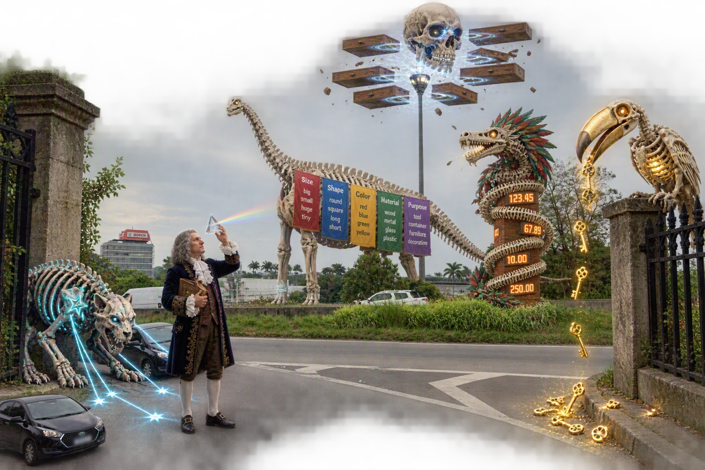

<em>5 beasts · 5 Knowledge Atoms</em>

#### Knowledge Atoms

### [Bt] Bone toucan

**Concept**
💡 (brass key) [I assign an artificial unique (barcode)] [inside a (cabinet) table] [to maintain (handcuffs) relationships] — Note: Has no business meaning and prevents broken links when natural names change.

**Quote**
“surrogate keys are made up they're unique IDs like customer key for example 101 102 103 they have no business meaning but they're great for performance and consistency”

### [Bs] Bone skull

**Concept**
💡 (steamroller) [I (glue) related data] [into fewer (bench) tables] [to (speedometer) up analytical queries] — Note: Normalization splits data across many small tables to reduce redundancy for transactions.

**Quote**
“denormalization is about flattening the data you combine related information into fewer but wider tables this is ideal for analytics and it's exactly what the star schema does”

### [Br] brontosaurus

**Concept**
💡 (tag) [I store descriptive (label)] [that give (lens) to numerical facts] [for (funnel) and grouping]

**Quote**
“radiating out from the center are your dimension tables these describe the facts dimension tables are things like customers products dates and regions”

### [Bq] Bone Quetzalcoatl

**Concept**
💡 (abacus) [I store quantitative (chest)] [at the (bullseye) of the schema] [(chain) to surrounding dimensions] — Note: Kept lean and numeric by excluding descriptive text fields.

**Quote**
“picture a star at the center is your fact table this holds the numbers sales revenue quantities or whatever else you capture in a transaction”

### [Bp] Bone panther

**Concept**
💡 (badge) [I (binder) data into a central fact table] [(fence) by dimension tables] [to (rocket) querying and reporting]

**Quote**
“the star schema is a widely used data modeling technique in PowerBI and other business intelligence tools it's designed to optimize querying and reporting by organizing data into a clear intuitive structure”

#### Notes

_No notes._

#### Gallery

_No gallery images._

<strong>Memory Palace 16: API to Power BI</strong> · Character: Albert Einstein · 4 beasts · 4 atoms

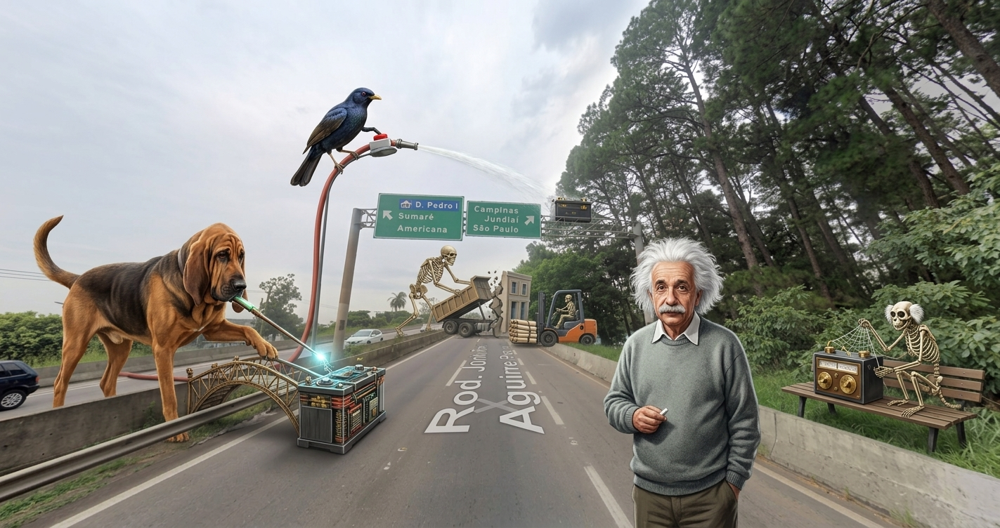

<em>4 beasts · 4 Knowledge Atoms</em>

#### Knowledge Atoms

### [Bo] bower-bird

**Concept**
💡 (button) [I (hose)] [directly into (battery)] [using its (menu)] — Note: This method does not support relationships or joins, so all complex data models must be flattened before ingestion.

**Quote**
“you can only send data using power bi's push data sets method which doesn't support relationships or joins meaning complex data models must be flattened before ingestion”

### [Bn] Bone Neanderthal

**Concept**
💡 (scroll) [I (quill)] [to (fishing rod)] [and (dump truck)] [into a (forklift)] — Note: This provides unmatched flexibility and optimization for big data, but requires significant coding complexity and infrastructure maintenance.

**Quote**
“whether you send data directly to powerbi or via a data warehouse custom scripts provide unmatched flexibility compared to the other two options”

### [Bm] Bone marmoset

**Concept**
💡 (spider web) [I (cable)] [to (battery)] [by (dial)] (address bar) — Note: This method is free and simple for one-time imports but lacks scalability for rate limits or complex authentication.

**Quote**
“you can connect an endpoint to powerbi by specifying parameters directly in the URL”

### [Bl] bloodhound

**Concept**
💡 (magic wand) [I use an (bridge)] [to (plug)] [to (battery)] [in a (robot)] — Note: These platforms clean messy responses and schedule updates but may lack support for complex mechanics like pagination.

**Quote**
“coupler iio is a no code solution that allows you to connect almost any data source to powerbi and other Platforms in a fully automated way”

#### Notes

_No notes._

#### Gallery

_No gallery images._

<strong>Memory Palace 15: SQL Window Functions</strong> · Character: Socrates · 4 beasts · 5 atoms

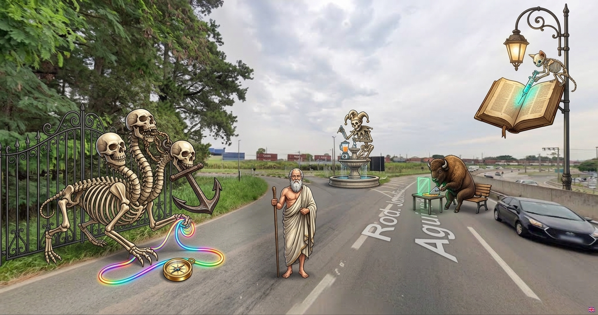

<em>4 beasts · 5 Knowledge Atoms</em>

#### Knowledge Atoms

### [Bk] Bone kitten

**Concept**
💡 (syringe) [I (needle)] [directly into an (open book)] [using a (blanket)]

**Quote**
“what the partition by is doing is basically taking this query right here and sticking it on one line in the select statement”

### [Bj] Bone jester

**Concept**
💡 (test tube) [I (tweezers)] [for an (blender)] [without changing the (sandglass)]

**Quote**
“because we're using the partition by we're able to isolate just one column that we want to perform our aggregate function on”

### [Bi] bison

**Concept**
💡 (glass divider) [I (pizza slicer)] (cubicle) [and (abacus)] [while (magnifying glass)] — Note: GROUP BY reduces the output by collapsing multiple rows into a single summary row.

**Quote**
“the group by statement is going to reduce the number of rows in our output by actually rolling them up and then calculating the sums or averages for each group whereas partition by actually divides the result set into partitions and changes how the window function is calculated”

### [Bh] Bone Hydra

🟦 **Z1 · LAG Function**

**Concept**
💡 (lagging foot) [I (magnifying glass)] [from (footprints)] [relative to the (anchor)] — Note: It requires an explicit ordering clause and evaluates to null when a preceding row does not exist.

**Quote**
“a lag is going to be for previous days and so notice how on the first day in the results there's no previous day so you see null there”

---

🟦 **Z2 · LEAD Function**

**Concept**
💡 (leash) [I (binoculars)] [from (stepping stone)] [relative to the (compass)] — Note: It returns a null value at the final dataset record where no subsequent row exists.

**Quote**
“notice how in the last row there's no next day so you see null at the end and all I'm going to do is change lag to lead”

#### Notes

_No notes._

#### Gallery

_No gallery images._

<strong>Memory Palace 14: SQL Joins</strong> · Character: Frédéric Chopin · 3 beasts · 3 atoms

<em>3 beasts · 3 Knowledge Atoms</em>

#### Knowledge Atoms

### [Bg] Bone goat

**Concept**
💡 (outer space) [I return all (vinyl record)] [from (table)] [and fill any missing sides with (ghost)] — Note: It essentially combines the results of both a left join and a right join.

**Quote**
“Commonly referred to as FULL OUTER JOIN, it returns all records when there is a match in either the left or the right table. It essentially combines the results of both a LEFT JOIN and a RIGHT JOIN. Any missing matches on either side are filled with NULL values.”

### [Bf] Bone frog

**Concept**
💡 (left hand) [I return all (vinyl record)] [from the (table)] [and fill missing right matches with (ghost)]

**Quote**
“Returns all records from the left table, along with the matched records from the right table. If a record in the left table has no match in the right table, the query still returns the left table's row, but populates the right table's columns with NULL values.”

### [Be] bee

**Concept**
💡 (bullseye) [I return only the (vinyl record)] [that have (puzzle piece)] [in (twins)] — Note: Unmatched rows are completely excluded.

**Quote**
“Returns only the records that have matching values in both tables. If a row in the first table does not have a corresponding match in the second table based on the join condition, that row is completely excluded from the final result.”

#### Notes

_No notes._

#### Gallery

_No gallery images._

<strong>Memory Palace 13: SQL Advanced Analytics</strong> · Character: Erik Satie · 4 beasts · 4 atoms

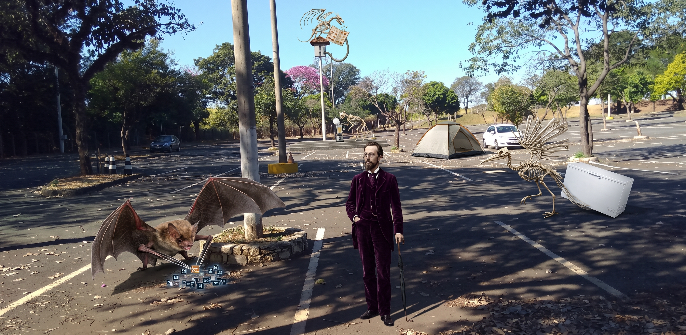

<em>4 beasts · 4 Knowledge Atoms</em>

#### Knowledge Atoms

### [Bd] Bone dragon

**Concept**
💡 (lasso) [I (vacuum) any non-aggregated column] [from the (menu)] [inside the (folder)] — Note: This ensures identical data combinations correctly collapse into a single summary row.

**Quote**
“Any non-aggregated column present in the SELECT list must appear in the GROUP BY clause.”

### [Bc] Bone cat

**Concept**
💡 (funnel) [I (coffee filter) summary rows] [after they have been (blender)] [by the GROUP BY (snowball)] — Note: The WHERE clause filters individual rows before any data grouping occurs.

**Quote**
“The `HAVING` clause in SQL is used to filter records after they have been aggregated by a `GROUP BY` clause.”

### [Bb] Bone bird of paradise

**Concept**
💡 (tent) [I (freezer) the output of heavy computation] [in a (clipboard)] [to prevent the database from (hamster wheel) it] — Note: CTEs re-execute from scratch each time, which is inefficient for massive datasets.

**Quote**
“if you find yourself using the same CTE again and again especially if your data set is large and your queries are taking a really long time to run then consider creating a temp table”

### [Ba] bat

**Concept**
💡 (dashboard) [I (tweezers) nested subqueries using CTEs] [and apply (window)] [to (scales) specific data subsets] — Note: This combines structural organization with advanced analytical evaluations in a single query.

**Quote**
“a window function always has two components... now this whole section is called a CTE and we know that because it has this with keyword”

#### Notes

_No notes._

#### Gallery

_No gallery images._

<strong>Memory Palace 12: Location Probes & Rearrangement</strong> · Character: Maurice Ravel · 2 beasts · 2 atoms

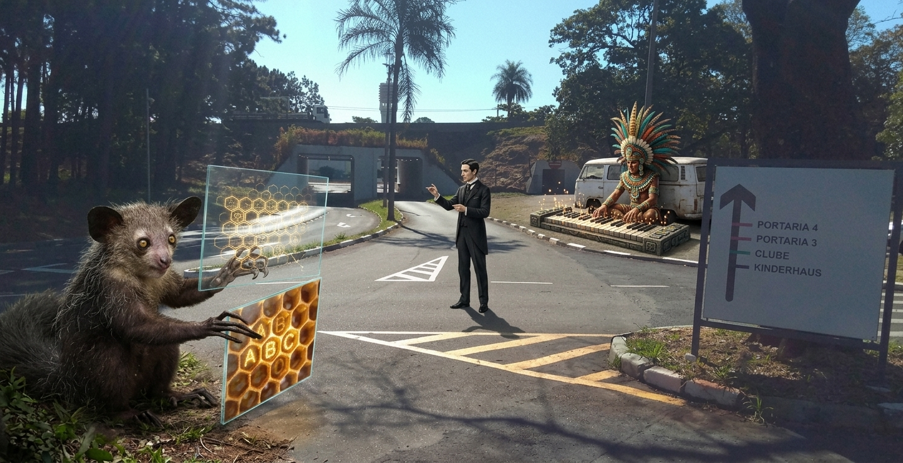

<em>2 beasts · 2 Knowledge Atoms</em>

#### Knowledge Atoms

### [Az] Aztec

**Concept**
💡 [(shuffle): I change marks and (dial) values] [so the new layout can change what I (lightbulb)]

**Quote**
“Permitindo ao usuário modificar a disposição de marcas e de valores de eixos no espaço, a nova visão formada desse rearranjo pode levar a diferentes compreensões dos fatos mostrados na estrutura visual”

### [Ay] aye-aye

**Concept**
💡 [(twin) Controls: I show two windows together] [(map) plus enlarged (lens) of one area]

**Quote**
“Consiste em mostrar duas janelas em conjunto: uma contendo uma visão geral da estrutura visual [e] outra apresentando em detalhes uma área específica dessa estrutura, com foco ampliado.”

#### Notes

_No notes._

#### Gallery

_No gallery images._

<strong>Memory Palace 11: Hybrid Marks & View Transforms</strong> · Character: Claude Debussy · 5 beasts · 5 atoms

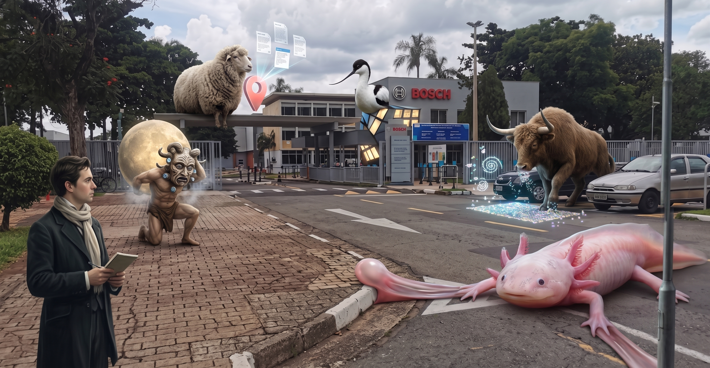

<em>5 beasts · 5 Knowledge Atoms</em>

#### Knowledge Atoms

### [Ax] axolotl

**Concept**
💡 [(magnifier): show focus and (frame)] [in the (stretch) visual structure at once]

**Quote**
“Criam visões com foco e contexto simultaneamente em uma mesma estrutura visual.”

### [Aw] awassi sheep

**Concept**
💡 [(pin) Investigations: I use a data mark's location] [to (flashlight) extra table (card)]

**Quote**
“Usam o local em que um dado está em uma estrutura visual para revelar informações adicionais da tabela de dados.”

### [Av] avocet

**Concept**
💡 [View (switch): creates new (window)] [of the visual structure] [for my (wrench)]

**Quote**
“Transformação de visão: cria novas visões da estrutura visual de acordo com a necessidade do usuário.”

### [Au] auroch

**Concept**
💡 [Dense (mosaic) Displays: I (tile) each value to individual pixels] [and form a (shape) per data dimension]

**Quote**
“Mapeiam cada valor para pixels individuais e criam um polígono para representar cada dimensão dos dados.”

### [At] atlas

**Concept**
💡 [(puppet): a graphic entity] [whose (dial) are (remote) by data attributes]

**Quote**
“Glyph: representação visual de um pedaço de dados ou informação em que uma entidade gráfica e seus atributos são controlados por um ou mais atributos de dados”

#### Notes

_No notes._

#### Gallery

_No gallery images._

<strong>Memory Palace 10: Multivariate Line & Table Views</strong> · Character: Wolfgang Amadeus Mozart · 5 beasts · 5 atoms

<em>5 beasts · 5 Knowledge Atoms</em>

#### Knowledge Atoms

### [As] asp

**Concept**
💡 [Parallel (ribbon): like Parallel Coordinates] [but focused on (tag) variables]

**Quote**
“Similar a Coordenadas Paralelas, porém com uso focado em variáveis nominais”

### [Ar] armadillo

**Concept**
💡 [Table (shuffle): I combine reordering, bar-sized (bar), and semantic (lens)] [by row and column]

**Quote**
“Table Lens: combina características: Reordenação de linhas e de colunas Tamanho de marcas (estilo gráfico de barras, para dados quantitativos) Zoom semântico por linha e por coluna”

### [Aq] aquatic leech

**Concept**
💡 [(clock) Axis Techniques: I use polar axes] [to study (loop) events and (calendar)]

**Quote**
“Pode ser útil para estudar eventos de natureza cíclica Ex.: hipóteses sobre a sazonalidade de um evento”

### [Ap] ape

**Concept**
💡 [(fence) Coordinates: I draw each variable as a parallel axis] [and turn each (bead) into a (wire)]

**Quote**
“Representa cada variável por um eixo Eixos são paralelos entre si Tupla se transforma em linha poligonal (polyline).”

### [Ao] aoudad

**Concept**
💡 [(crayon) Line Charts: I tell dimensions apart] [by color, (rope), or line (stripe)]

**Quote**
“Diferenciação das dimensões por atributos gráficos como cor, largura ou estilo de linha”

#### Notes

_No notes._

#### Gallery

_No gallery images._

<strong>Memory Palace 9: Encoding & Perception Basics</strong> · Character: Ludwig van Beethoven · 5 beasts · 5 atoms

<em>5 beasts · 5 Knowledge Atoms</em>

#### Knowledge Atoms

### [An] angel

**Concept**
💡 [(ring): I place N anchors on a circle] [and (magnet) points by (spring) spring balance]

**Quote**
“Técnica baseada na lei de Hooke para equilíbrio. Tabela de dados N-dimensionais; M pontos. Define-se N âncoras em uma circunferência”

### [Am] amulet

**Concept**
💡 [(stopwatch): fast easy (magnifier) of data] [with as few interpretation (eraser) as possible]

**Quote**
“Capacidade de permitir rápida interpretação dos dados e fácil distinção entre eles, levando à menor quantidade possível de erros de interpretação.”

### [Al] alligator

**Concept**
💡 [(truth): my visual mapping must express all table (ledger)] [and (filter) that data]

**Quote**
“De acordo com esse conceito, o mapeamento visual deve fazer com que a estrutura visual expresse todos os dados da tabela de dados, e somente eles.”

### [Ak] Akita (dog breed)

**Concept**
💡 [(flashlight) Visual Processing: I aid search and pattern detection] [with automatically (pop) properties] [like (paint) and size]

**Quote**
“Mapeamentos visuais que pretendem auxiliar buscas e detecção de padrões podem ser feitos usando propriedades processadas de maneira automática, como cores e tamanhos;”

### [Aj] Ajax

**Concept**
💡 [Visual (plug): I link each data-table (dial)] [to a graphical or spatial (paint)]

**Quote**
“Objetivo: associar cada variável da tabela de dados a uma propriedade gráfica ou espacial.”

#### Notes

_No notes._

#### Gallery

_No gallery images._

<strong>Memory Palace 8: Schema & Visual Structure Core</strong> · Character: Johann Sebastian Bach · 5 beasts · 5 atoms

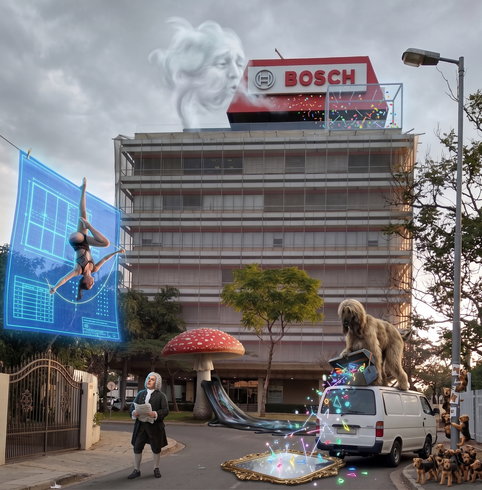

<em>5 beasts · 5 Knowledge Atoms</em>

#### Knowledge Atoms

### [Ai] Airedale terrier

**Concept**
💡 [Small (stamps): they force visual (eyes)] [of changes, differences, and (fork)]

**Quote**
“A técnica força a comparação visual de alterações, das diferenças entre objetos, do escopo de alternativas.”

### [Ah] Ah!—a sigh

**Concept**
💡 [(toy): objects present] [in the (frame) (room)] — Note: Marks use graphical and spatial properties to show data values.

**Quote**
“Objetos presentes no espaço do gráfico”

### [Ag] Agaric fungi

**Concept**
💡 [Spatial (stage): the area available] [to (screen) the (box)]

**Quote**
“Área disponível para exibição do conjunto de dados.”

### [Af] Afghan hound

**Concept**
💡 [Visual (kit): the set of visual elements] [that (mirror) a (box)]

**Quote**
“Conjunto de elementos visuais que representam um conjunto de dados.”

### [Ae] aerialist

**Concept**
💡 [Database (blueprint): I treat it as the structural blueprint] [of my (building)] [including tables, fields, (chain), and constraints]

**Quote**
“A database schema is the structural blueprint of a database. It defines the logical organization of data, including tables, fields, relationships, and constraints.”

#### Notes

_No notes._

#### Gallery

_No gallery images._

<strong>Memory Palace 7: M Code Pipeline & Database Architectures</strong> · Character: Marie Curie · 1 beast · 1 atom

<em>1 beast · 1 Knowledge Atom</em>

#### Knowledge Atoms

### [Ad] adder

**Concept**
💡 [I store data without fixed (cloud)] [using flexible (origami)] [for horizontal (accordion)] — Note: Uses documents, key-value pairs, wide columns, or graphs to adapt easily to changing schemas.

**Quote**
“A NoSQL database stores data without fixed tables, using flexible formats like documents, key-value pairs, wide columns, or graphs.”

#### Notes

_No notes._

#### Gallery

_No gallery images._

<strong>Memory Palace 6: Power Query Transformations & Step Reuse</strong> · Character: Tim Berners-Lee · 5 beasts · 6 atoms

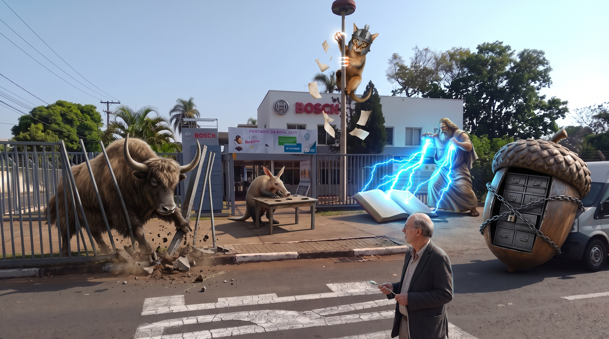

<em>5 beasts · 6 Knowledge Atoms</em>

#### Knowledge Atoms

### [Z] Zeus

**Concept**
💡 [My unpivot step automatically (trash can) all rows] [with (ghost) values] — Note: Power Query has no built-in setting or parameter to turn off this automatic removal.

**Quote**
“now the characteristic of the unpivot function in power query is that by the default it actually removes the null values”

### [Y] yak

**Concept**
💡 [I unpivot multiple (pillar) into rows] [to (clay) my data more easily] — Note: Column headers become an attribute column paired with a single value column.

**Quote**
“so unpivoting means I have columns and I want to see those columns in the rows”

### [Ac] acorn

**Concept**
💡 [I (chest) data] [in rigid (grid) of rows and columns] [linked by predefined (chain)] — Note: Enforces schemas and data integrity using SQL validation rules.

**Quote**
“A relational database stores data in fixed tables made of rows and columns, linked together by predefined relationships.”

### [Ab] Abyssinian cat

🟦 **Z1 · Reusing query steps**

**Concept**
💡 [I (stamp) my query steps] [across different (binder)] [sharing the exact same table (twin)] — Note: Identical column headers and data formats are required so the query steps run without error.

**Quote**
“since the format of both files are the same I want to apply the exact same steps to my second file”

---

🟦 **Z2 · Copying transformation steps**

**Concept**
💡 [I (scissors) all transformation steps] [below the initial (anchor) line] [from the Advanced (scroll)] — Note: The first line contains the specific file source path that must not overwrite the new table's connection.

**Quote**
“the First Line Imports the CSV files so we don't want this step we want to grab all the steps below it Ctrl C to copy”

### [Aa] aardvark

**Concept**
💡 [I replace nulls with a temporary (scarecrow)] [before (jack)] [to (boomerang) them back afterward] — Note: This prevents Power Query from dropping rows during the unpivot step.

**Quote**
“you can select the columns where you have the null values and you need to replace those with a placeholder”

#### Notes

_No notes._

#### Gallery

_No gallery images._

<strong>Memory Palace 5: M Engine & Syntax</strong> · Character: Stephen Hawking · 5 beasts · 5 atoms

<em>5 beasts · 5 Knowledge Atoms</em>

#### Knowledge Atoms

### [X] Xena, warrior woman

**Concept**
💡 [The OData connector suffers from (spider web) latency] [because it makes redundant metadata (megaphone)] [at (running shoes).]

**Quote**
“the problem uh with odata is that at runtime it has to make metadata calls to basically get the metadata and that makes a second call”

### [W] wombat

**Concept**
💡 [The OData connector uses a (binoculars) mechanism] [to automatically determine the (skeleton)] [of the external (picnic table).]

**Quote**
“odata has a discovery mechanism you know where now power query is kind of looking at the table and figuring out what it is”

### [V] vulture

**Concept**
💡 [I use query (origami)] [to (bulldozer) transformation work] [back to the data (well)] [to maximize processing (stopwatch).]

**Quote**
“the idea of query folding is that you want the power query mashup engine you know to be as efficient as possible so the mashup engine will push work back to the data source”

### [U] unicorn

**Concept**
💡 [I avoid using (vacuum)] [in my step (name tag)] [to keep the underlying M code (sponge).] - Note: Spaces force the variables to be wrapped in quotes and a hash sign.

**Quote**
“if you put spaces in your step names it makes the applied steps thing look better yeah but it makes the uh you know m code look a lot worse”

### [T] toucan

**Concept**
💡 [I use the power query (blender) engine] [as the underlying (engine block)] [to (lightning bolt) my data queries.]

**Quote**
“at the base you know of this technology is something called the power query mashup engine that's the thing that executes your query”

#### Notes

_No notes._

#### Gallery

_No gallery images._

<strong>Memory Palace 4: Data Architectures 2</strong> · Character: Neo (The Matrix) · 5 beasts · 5 atoms

<em>5 beasts · 5 Knowledge Atoms</em>

#### Knowledge Atoms

### [S] skull

**Concept**
💡 [Data Mart: A (scalpel) subset of a data warehouse] [(spotlight) on a specific business line or department[cite: 1].] — Note: Examples include Finance or Marketing[cite: 1].

**Quote**
“A subset of a data warehouse focused on a specific business line or department (e.g., Finance, Marketing)."[cite: 1]”

### [R] rat

**Concept**
💡 [Data Swamp: A poorly (broken crown) data lake] [where data is (shredder), undocumented,] [and difficult to (fishing rod)[cite: 1].]

**Quote**
“A poorly governed data lake where data is uncataloged, undocumented, and difficult to retrieve."[cite: 1]”

### [Q] Quetzalcoatl

**Concept**
💡 [Data Lakehouse: A (centaur) architecture] [combining the scale and (rubber band) of a data lake] [with the (vault) of a warehouse[cite: 1].] — Note: Includes ACID features like Delta Lake on top of cloud storage[cite: 1].

**Quote**
“Hybrid architecture combining the scale and flexibility of a data lake with the reliability and ACID features of a warehouse (e.g., Delta Lake on top of cloud storage)."[cite: 1]”

### [P] panther

**Concept**
💡 [Data Warehouse: A highly (filing cabinet), schema-on-write repository] [optimized for SQL (magnifying glass)] [and business (briefcase)[cite: 1].]

**Quote**
“Highly structured, schema-on-write repository optimized for SQL analytics and business intelligence."[cite: 1]”

### [O] owl

**Concept**
💡 [Data Lake: I (bucket) structured, semi-structured, and unstructured raw data] [in a (swimming pool), low-cost object storage system[cite: 1].]

**Quote**
“Centralized storage for structured, semi-structured, and unstructured raw data in low-cost object storage."[cite: 1]”

#### Notes

_No notes._

#### Gallery

_No gallery images._

<strong>Memory Palace 3: Data Architectures 1</strong> · Character: GitHub Copilot · 5 beasts · 5 atoms

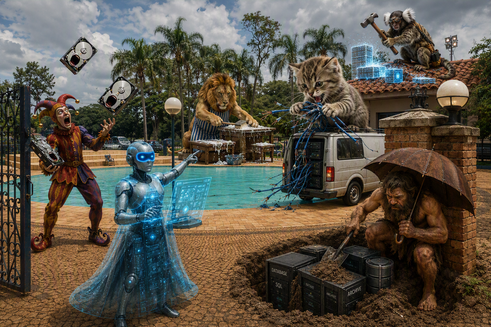

<em>5 beasts · 5 Knowledge Atoms</em>

#### Knowledge Atoms

### [N] Neanderthal

**Concept**
💡 Data Store: Any repository that persists and manages a collection of data[cite: 1]. — Note: Ranges from traditional relational databases to cloud object storage[cite: 1].

**Quote**
“An umbrella term for any repository that persists and manages a collection of data, ranging from traditional relational databases and NoSQL key-value stores to file systems, caches, and cloud object storage."[cite: 1]”

### [M] marmoset

**Concept**
💡 Load Phase: I write the fully processed data into the target repository[cite: 1]. — Note: This makes it immediately available for business intelligence tools and analytics[cite: 1].

**Quote**
“Writing the fully processed data into the target repository, making it immediately available for business intelligence tools and analytics."[cite: 1]”

### [L] lion

**Concept**
💡 Transform Phase: I clean, structure, and enrich the data in a temporary staging area to meet business requirements[cite: 1]. — Note: Includes standardizing formats, filtering anomalies, joining tables, and mapping to a predefined schema[cite: 1].

**Quote**
“Cleaning, structuring, and enriching the data in a temporary staging area to meet business and analytical requirements. This includes standardizing date formats, filtering anomalies, joining tables, applying business logic, and mapping the data to a predefined schema."[cite: 1]”

### [K] kitten

**Concept**
💡 Extract Phase: I retrieve raw data from various origin systems during the first pipeline phase[cite: 1]. — Note: Sources include operational databases, SaaS applications, APIs, or flat files[cite: 1].

**Quote**
“Retrieving raw data from various source systems, such as operational databases, SaaS applications, APIs, or flat files."[cite: 1]”

### [J] jester

**Concept**
💡 ETL Pipeline: I move raw data from multiple disparate sources into a centralized target system using an automated integration pipeline[cite: 1]. — Note: The target is typically a Data Warehouse or Data Mart[cite: 1].

**Quote**
“ETL is an automated data integration process that moves data from multiple disparate sources into a centralized target system, typically a Data Warehouse or Data Mart."[cite: 1]”

#### Notes

_No notes._

#### Gallery

_No gallery images._

<strong>Memory Palace 2: Data Analytics Fundamentals</strong> · Character: Alan Turing · 5 beasts · 5 atoms

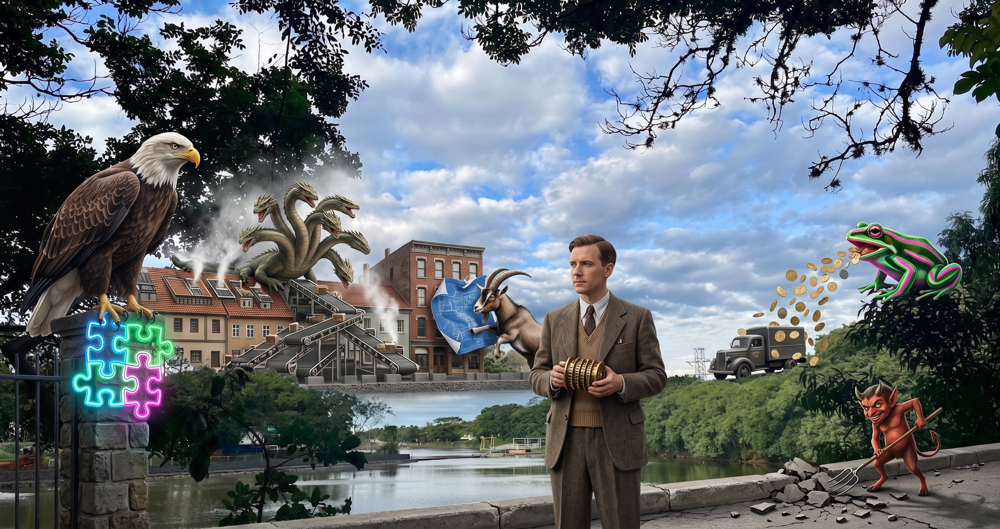

<em>5 beasts · 5 Knowledge Atoms</em>

#### Knowledge Atoms

### [I] imp

**Concept**
💡 I dig deeper beyond number crunching to understand underlying causes. — Note: Balances quantitative technical skills like SQL with qualitative critical reasoning.

**Quote**
“It's not just about crunching the numbers and sharing your data. Sometimes you'll need to dig deeper to understand really what's going on.”

### [H] Hydra

**Concept**
💡 I turn refined data into valuable business insights. — Note: The culmination of a five-step pipeline spanning definition, collection, cleaning, analysis, and presentation.

**Quote**
“The final step in this process is where data is turned into valuable business insights.”

### [G] goat

**Concept**
💡 I evaluate team data to shape future business strategies. — Note: Serves as the cross-functional bridge between raw metrics and executive planning.

**Quote**
“Work as part of a team to evaluate and analyze key data that will be used to shape future business strategies.”

### [F] frog

**Concept**
💡 I apply analytics to speed decisions, cut costs, and develop products. — Note: Optimizes operational performance and predicts market behavior.

**Quote**
“Broadly speaking, data analytics is used to make faster and better business decisions, to reduce overall business costs, and to develop new and innovative products and services.”

### [E] eagle

**Concept**
💡 I analyze raw data to extract useful business insights. — Note: Transforms unorganized datasets into actionable intelligence.

**Quote**
“Data analytics is the process of analyzing raw data so that we can pull out insights which are useful to companies.”

#### Notes

_No notes._

#### Gallery

_No gallery images._

<strong>Memory Palace 1: Data Analyst vs Data Scientist Foundations</strong> · Character: Ada Lovelace · 4 beasts · 5 atoms

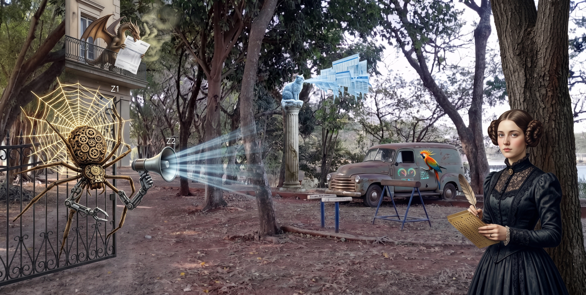

<em>4 beasts · 5 Knowledge Atoms</em>

#### Knowledge Atoms

### [D] dragon

**Concept**
💡 Core tooling and workflow: SQL/BI dashboards isolating friction vs Python/ML/pipelines training real-time automated churn classifiers.

**Quote**
“Queries an e-commerce database using SQL to identify that customer churn increased by 15% in Q3, isolates the drop to checkout friction, and presents a visual dashboard to product managers.”

### [C] cat

**Concept**
💡 Data types handled: structured relational tables/spreadsheets vs structured and unstructured multi-modal streams (images, audio, clickstreams).

**Quote**
“Structured data from relational databases and warehouses”

### [B] bird of paradise

**Concept**
💡 Key objectives: dashboards and KPI tracking vs ML pipelines and algorithmic automation.

**Quote**
“Dashboards, KPI tracking, business reports, trend identification”

### [A] Arachne

🟦 **Z1 · Head**

**Concept**
💡 Core objective difference: Data Analysts explain past/present to inform decisions; Data Scientists build predictive models to forecast and automate.

**Quote**
“The primary difference lies in their core focus: a Data Analyst examines historical data to answer specific business questions and identify existing trends, while a Data Scientist builds predictive models, algorithms, and experiments to forecast future outcomes and discover unknowns.”

---

🟦 **Z2 · Forelimbs**

**Concept**
💡 Primary focus: descriptive and diagnostic (What happened? Why?) vs predictive and prescriptive modeling (What will happen? How to optimize?).

**Quote**
“Descriptive and diagnostic analysis (answering "What happened?" and "Why?")”

#### Notes

_No notes._

#### Gallery

_No gallery images._

