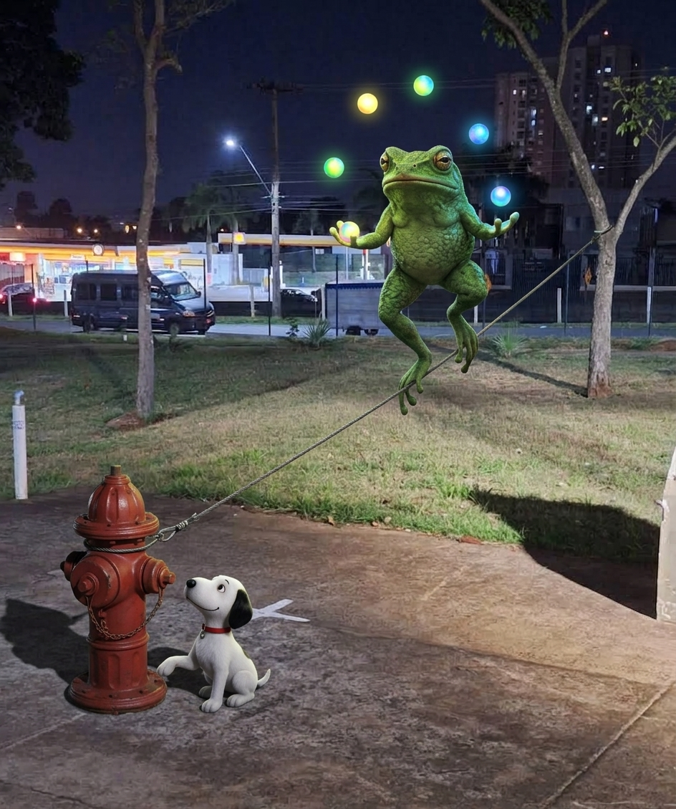
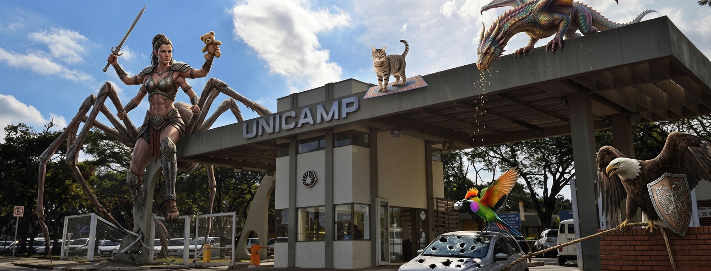

# Dogs

<strong>Memory Palace 2: German Shepherd Scoring and Activities (Snoopy)</strong> · Character: Snoopy · 1 beast · 1 atom

<em>1 beast · 1 Knowledge Atom</em>

#### Knowledge Atoms

### [F] frog

**Concept**
💡 [<kbd><strong><u>Proprioception</u></strong></kbd> Training] [I <kbd><strong><u>guide</u></strong></kbd> the dog] [over raised Cavaletti <kbd><strong><u>poles</u></strong></kbd>] [to build <kbd><strong><u>hind-end</u></strong></kbd> awareness] — Note: This scientifically supports joint health and combats dysplasia risks.

🔑 **Keywords**

- [**Proprioception**] → [tightrope]
- [**guide**] → [leash]
- [**poles**] → [hurdles]
- [**hind-end**] → [bumper]

**Quote**
“Proprioception exercises like Cavaletti poles build rear-end body awareness, which is scientifically proven to strengthen stabilizing muscles and mitigate joint dysplasia risks.”

**Story**
A giant frog juggles while walking a tightrope attached to the fire hydrant, holding a neon leash to guide the small white beagle. The beagle steps carefully over high hurdles, wearing a rubber bumper on his hind legs to avoid knocking the poles.

#### Notes

_No notes._

#### Gallery

_No gallery images._

<strong>Memory Palace 1: German Shepherd Traits (Scooby-Doo)</strong> · Character: Scooby-Doo · 5 beasts · 5 atoms

<em>5 beasts · 5 Knowledge Atoms</em>

#### Knowledge Atoms

### [A] Arachne

**Concept**
💡 [Breeding <kbd><strong><u>Lines</u></strong></kbd>] [I choose <kbd><strong><u>working</u></strong></kbd> <kbd><strong><u>lines</u></strong></kbd>] [for extreme <kbd><strong><u>intensity</u></strong></kbd>] [and <kbd><strong><u>pet</u></strong></kbd> <kbd><strong><u>lines</u></strong></kbd>] [for calm <kbd><strong><u>companions</u></strong></kbd>] — Note: Show <kbd><strong><u>lines</u></strong></kbd> prioritize physical conformation and structure.

🔑 **Keywords**

- [**Lines**] → [ruler]
- [**working**] → [hardhat]
- [**intensity**] → [fire]
- [**pet**] → [leash]
- [**companions**] → [heart]

**Quote**
“There are the working line shepherds bred for extreme drive and intensity Showine shepherds bred more for looks and structure and pet line shepherds bred to be calmer more familyfriendly companions”

**Story**
A skyscraper-tall half-spider woman crashes onto the iron gate, splitting the steel into three pieces. She rips out the gate's lock with extreme intensity while gently rocking a calm teddy bear in her other arm.

### [B] bird of paradise

**Concept**
💡 [Proper <kbd><strong><u>Fulfillment</u></strong></kbd>] [I <kbd><strong><u>balance</u></strong></kbd> the dog] [with predictable <kbd><strong><u>routines</u></strong></kbd>] [and cognitive <kbd><strong><u>scent</u></strong></kbd> games] — Note: High drive can be satisfied through structured play and scatter feeding rather than professional sports.

🔑 **Keywords**

- [**Fulfillment**] → [trophy]
- [**balance**] → [scale]
- [**routines**] → [clock]
- [**scent**] → [nose]

**Quote**
“German Shepherds thrive when they have structure clear communication and mental stimulation”

**Story**
A bird of paradise wearing a referee whistle scatter-feeds glowing kibble onto the parked car, punching deep holes in the metal hood. The brown dog sniffs out the glowing pieces while the bird shouts strict drop-it commands.

### [C] cat

**Concept**
💡 [Basic <kbd><strong><u>Obedience</u></strong></kbd>] [I teach the <kbd><strong><u>place</u></strong></kbd> command] [to build sustained <kbd><strong><u>focus</u></strong></kbd>] [and provide mental <kbd><strong><u>stimulation</u></strong></kbd>] — Note: This improves communication without needing advanced sports training.

🔑 **Keywords**

- [**Obedience**] → [whistle]
- [**place**] → [mat]
- [**focus**] → [laser]
- [**stimulation**] → [brain]

**Quote**
“Using commands like place to build focus, improve communication, and provide mental stimulation without the need for advanced sports training.”

**Story**
The cat stands on a floating yoga mat by the building facade, blowing a silver whistle. The small white beagle stares with laser eyes at the mat while a glowing brain pulses above his head.

### [D] dragon

**Concept**
💡 [<kbd><strong><u>Scent</u></strong></kbd> Work] [I <kbd><strong><u>scatter</u></strong></kbd> food] [across the garden <kbd><strong><u>grass</u></strong></kbd>] [to engage <kbd><strong><u>tracking</u></strong></kbd> instincts] — Note: Hiding food around the house with a go find command also works.

🔑 **Keywords**

- [**Scent**] → [nose]
- [**scatter**] → [seeds]
- [**grass**] → [mower]
- [**tracking**] → [magnifying glass]

**Quote**
“Scattering food on the floor or in the garden grass so the dog uses its nose, or hiding food around the house with a go find command to engage tracking instincts.”

**Story**
A dragon on the roof sniffs the shingles with its massive snout, spitting seeds across the tiles. The small white beagle grabs a giant magnifying glass to track the glowing kibble hidden in the gutters.

### [E] eagle

**Concept**
💡 [Controlled <kbd><strong><u>Protection</u></strong></kbd>] [I play <kbd><strong><u>tug-of-war</u></strong></kbd>] [paired with a <kbd><strong><u>drop-it</u></strong></kbd> command] [to channel instinctual <kbd><strong><u>drives</u></strong></kbd> safely] — Note: This structured game tires out high-drive dogs effectively.

🔑 **Keywords**

- [**Protection**] → [shield]
- [**tug-of-war**] → [rope]
- [**drop-it**] → [parachute]
- [**drives**] → [battery]

**Quote**
“Engaging in a structured game of tug-of-war paired with a reliable drop it command to safely channel their instinctual drives and tire them out.”

**Story**
The eagle holds a heavy medieval shield in its talons while yanking a thick ship rope tied to the brick wall. The small white beagle bites the rope until the eagle throws a parachute that forces him to drop it, draining a giant battery.

#### Notes

_No notes._

#### Gallery

_No gallery images._

