# English

<strong>Memory Palace 18: Syllabic Consonants</strong> · Character: (unassigned palace 18) · 3 beasts · 3 atoms

<em>3 beasts · 3 Knowledge Atoms</em>

#### Knowledge Atoms

### [Bs] Bone Shark

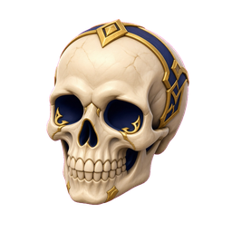

**Concept**
💡 Syllabic L [l̩] takes over the entire syllable when the vowel is reduced.

**Keywords**
_No keywords yet_

**Quote**
“The consonant essentially takes over the role of the vowel, like in bottle or apple.”

**Story**
—

### [Bt] Bone Toad

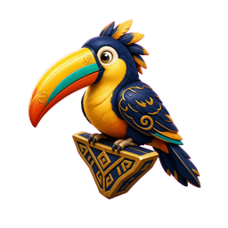

**Concept**
💡 Syllabic N [n̩] frequently occurs after alveolar consonants like /t/ or /s/, often utilizing a glottal stop.

**Keywords**
_No keywords yet_

**Quote**
“In American English, when a /t/ precedes a syllabic /n/, the /t/ is typically pronounced as a glottal stop, like in button.”

**Story**
—

### [Bu] butterfly

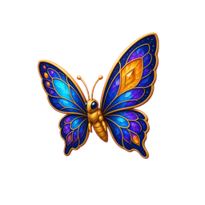

**Concept**
💡 Syllabic M [m̩] acts as its own syllable, often found in words ending in "thm" or "sm".

**Keywords**
_No keywords yet_

**Quote**
“Syllabic M regularly occurs in words ending in 'thm' or 'sm', such as rhythm and chasm.”

**Story**
—

#### Notes

_No notes._

#### Gallery

_No gallery images._

<strong>Memory Palace 17: Elision & Intrusion Rules</strong> · Character: (unassigned palace 17) · 2 beasts · 2 atoms

<em>2 beasts · 2 Knowledge Atoms</em>

#### Knowledge Atoms

### [Bq] Boulder quail

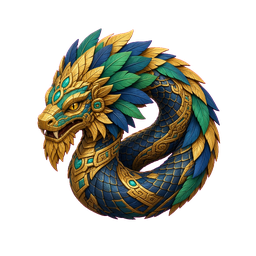

**Concept**
💡 Intrusion is the addition of a new sound.

**Keywords**
_No keywords yet_

**Quote**
“Sounds are added, there's intrusion from a new sound.”

**Story**
—

### [Br] brontosaurus

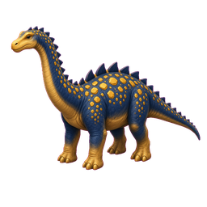

**Concept**
💡 Only 'w', 'y', or 'r' sounds are usually added in intrusion.

**Keywords**
_No keywords yet_

**Quote**
“There are usually only three sounds that can be added. We either have a 'w', a 'y', or an 'r' sound added.”

**Story**
—

#### Notes

_No notes._

#### Gallery

_No gallery images._

<strong>Memory Palace 16: Connected Speech & Assimilation</strong> · Character: (unassigned palace 16) · 5 beasts · 5 atoms

<em>5 beasts · 5 Knowledge Atoms</em>

#### Knowledge Atoms

### [Bl] bloodhound

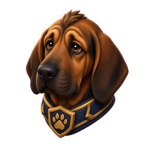

**Concept**
💡 Connected speech involves changing, losing, or adding sounds.

**Keywords**
_No keywords yet_

**Quote**
“What happens in connected speech is that sounds change, sounds are lost, and sounds are added.”

**Story**
—

### [Bm] Bone marmoset

**Concept**
💡 Assimilation is when a sound changes to be more like its neighbor.

**Keywords**
_No keywords yet_

**Quote**
“A sound changes to become more similar, so more similar, assimilation.”

**Story**
—

### [Bn] Blazing nightjar

**Concept**
💡 Preparing for /b/ by closing lips early changes /n/ to /m/.

**Keywords**
_No keywords yet_

**Quote**
“Because we get ready to say 'Barcelona' we close our lips already, and instead of an 'n' sound we say 'm'.”

**Story**
—

### [Bo] bower-bird

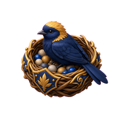

**Concept**
💡 Elision is the deletion or loss of sounds.

**Keywords**
_No keywords yet_

**Quote**
“When sounds are lost they're deleted, so we call this elision.”

**Story**
—

### [Bp] Blackwater penguin

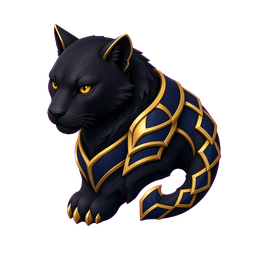

**Concept**
💡 Final 't' or 'd' sounds are the most commonly lost in English.

**Keywords**
_No keywords yet_

**Quote**
“Most of the time in English, that means that a final 't' or 'd' sound is lost.”

**Story**
—

#### Notes

_No notes._

#### Gallery

_No gallery images._

<strong>Memory Palace 15: Rhythm and Flow</strong> · Character: (unassigned palace 15) · 4 beasts · 4 atoms

<em>4 beasts · 4 Knowledge Atoms</em>

#### Knowledge Atoms

### [Bh] Bitter hare

**Concept**
💡 Thought groups involve using short pauses to break down sentences.

**Keywords**
_No keywords yet_

**Quote**
—

**Story**
—

### [Bi] bison

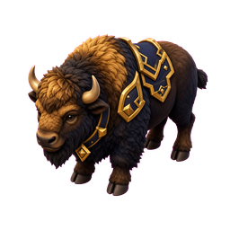

**Concept**
💡 English is a stress-timed language with regular intervals.

**Keywords**
_No keywords yet_

**Quote**
—

**Story**
—

### [Bj] Basil jellyfish

**Concept**
💡 Linking occurs when the end of one word blends directly into the start of the next word.

**Keywords**
_No keywords yet_

**Quote**
—

**Story**
—

### [Bk] Bloodmoon kestrel

**Concept**
💡 Shadowing is actively repeating a text simultaneously to absorb natural rhythm.

**Keywords**
_No keywords yet_

**Quote**
—

**Story**
—

#### Notes

_No notes._

#### Gallery

_No gallery images._

<strong>Memory Palace 14: Pitch and Notation</strong> · Character: (unassigned palace 14) · 2 beasts · 2 atoms

<em>2 beasts · 2 Knowledge Atoms</em>

#### Knowledge Atoms

### [Bf] Blackwater ferret

**Concept**
💡 Linguistically, only the relative values of pitch matter, not the absolute values.

**Keywords**
_No keywords yet_

**Quote**
“It is their relative values, not their absolute values, that matter linguistically.”

**Story**
—

### [Bg] Boulder giraffe

**Concept**
💡 The IPA chart has a dedicated section for suprasegmental symbols.

**Keywords**
_No keywords yet_

**Quote**
“The instructor points out that the International Phonetic Alphabet (IPA) chart provides a completely separate set of symbols specifically for suprasegmentals.”

**Story**
—

#### Notes

_No notes._

#### Gallery

_No gallery images._

<strong>Memory Palace 13: Suprasegmental Basics</strong> · Character: (unassigned palace 13) · 5 beasts · 5 atoms

<em>5 beasts · 5 Knowledge Atoms</em>

#### Knowledge Atoms

### [Ay] aye-aye

**Concept**
💡 Spoken language is built from segments: consonants (bricks) and vowels (mortar).

**Keywords**
_No keywords yet_

**Quote**
“You can look at language as a building and think of consonants as the bricks and the vowels as a mortar that connects the bricks together.”

**Story**
—

### [Az] Aztec

**Concept**
💡 Suprasegmentals are features "beyond the segment" that emerge only through comparison.

**Keywords**
_No keywords yet_

**Quote**
“Suprasegmental is a word made of supra, the prefix beyond, and segment: beyond the segment level. You will get to super segmental features when you compare segments to each other, you put them in a contrast.”

**Story**
—

### [Ba] bat

**Concept**
💡 Length is the relative duration of a sound.

**Keywords**
_No keywords yet_

**Quote**
“In English, stress can affect length.”

**Story**
—

### [Bb] Brass bison

**Concept**
💡 Stress can alter a word's meaning, pitch, and sound properties.

**Keywords**
_No keywords yet_

**Quote**
“Stress in English can also result in exaggerated pitch; it can make a low pitch lower and it can make a high pitch higher.”

**Story**
—

### [Be] bee

**Concept**
💡 Intonation is the pitch pattern at the sentence level, which can change meaning.

**Keywords**
_No keywords yet_

**Quote**
“Pitch pattern at sentence level is called intonation. Voice pitch can change with the rate of vibration of the vocal folds independently of stress.”

**Story**
—

#### Notes

_No notes._

#### Gallery

_No gallery images._

<strong>Memory Palace 12: Negation, Mistakes, & Time</strong> · Character: (unassigned palace 12) · 5 beasts · 5 atoms

<em>5 beasts · 5 Knowledge Atoms</em>

#### Knowledge Atoms

### [At] atlas

**Concept**
💡 Prefix dis- indicates the opposite or active negation.

**Keywords**
_No keywords yet_

**Quote**
“Dis talks about the negation, the opposite of something.”

**Story**
—

### [Au] auroch

**Concept**
💡 Prefix mis- refers to a mistake.

**Keywords**
_No keywords yet_

**Quote**
“Miss, think of it like a mistake.”

**Story**
—

### [Av] avocet

**Concept**
💡 Prefixes im-, in-, ir- spelling rules.

**Keywords**
_No keywords yet_

**Quote**
“Use im with words that begin with P, M, or B.”

**Story**
—

### [Aw] awassi sheep

**Concept**
💡 Insecure (feeling) vs. Unsecure (safety).

**Keywords**
_No keywords yet_

**Quote**
“Insecure says that you are not confident about yourself.”

**Story**
—

### [Ax] axolotl

**Concept**
💡 Prefix re- means to repeat.

**Keywords**
_No keywords yet_

**Quote**
“When you want to say repeat something, do it again, add re before the verb.”

**Story**
—

#### Notes

_No notes._

#### Gallery

_No gallery images._

<strong>Memory Palace 11: Prefixes & Suffixes Definitions</strong> · Character: Hermione Granger · 5 beasts · 5 atoms

<em>5 beasts · 5 Knowledge Atoms</em>

#### Knowledge Atoms

### [Ao] aoudad

**Concept**
💡 Core definitions: Prefix (before) and Suffix (after).

**Keywords**
_No keywords yet_

**Quote**
“A prefix is something that goes before a word." and "Suffixes are things that go afterwards.”

**Story**
—

### [Ap] ape

**Concept**
💡 Suffix -able indicates ability.

**Keywords**
_No keywords yet_

**Quote**
“Any verb plus able, it's possible to do this thing.”

**Story**
—

### [Aq] aquatic leech

**Concept**
💡 Suffix -ish softens time or adjectives.

**Keywords**
_No keywords yet_

**Quote**
“Ish with a time means not exactly this time.”

**Story**
—

### [Ar] armadillo

**Concept**
💡 Prefix un- means not complete or absent.

**Keywords**
_No keywords yet_

**Quote**
“Un means not, but more like not complete.”

**Story**
—

### [As] asp

**Concept**
💡 Prefix un- can also mean to reverse an action.

**Keywords**
_No keywords yet_

**Quote**
“Un can also mean to reverse an action.”

**Story**
—

#### Notes

_No notes._

#### Gallery

_No gallery images._

<strong>Memory Palace 10: Nominalization & Definitions</strong> · Character: (unassigned palace 10) · 5 beasts · 5 atoms

<em>5 beasts · 5 Knowledge Atoms</em>

#### Knowledge Atoms

### [Aj] Ajax

**Concept**
💡 Definition of Nominalization (turning words into nouns).

**Keywords**
_No keywords yet_

**Quote**
“Nominalization means turning words into nouns.”

**Story**
—

### [Ak] Akita (dog breed)

**Concept**
💡 Transforming Verbs into Nouns (Enjoy -> Enjoyment).

**Keywords**
_No keywords yet_

**Quote**
“Jane shares the enjoyment of Indian food with her husband.”

**Story**
—

### [Al] alligator

**Concept**
💡 Transforming Adjectives into Nouns (Beautiful -> Beauty).

**Keywords**
_No keywords yet_

**Quote**
“The beauty of London is why I am going there.”

**Story**
—

### [Am] amulet

**Concept**
💡 The "Noun of Noun" Structure (Develop -> Development).

**Keywords**
_No keywords yet_

**Quote**
“The engineers are discussing the development of the building.”

**Story**
—

### [An] angel

**Concept**
💡 Advanced Nominalization with Relational Verbs (Leads to).

**Keywords**
_No keywords yet_

**Quote**
“The writing of books for pleasure leads to the provision of a passive income.”

**Story**
—

#### Notes

_No notes._

#### Gallery

_No gallery images._

<strong>Memory Palace 9: Passive & Mistakes</strong> · Character: (unassigned palace 9) · 2 beasts · 2 atoms

<em>2 beasts · 2 Knowledge Atoms</em>

#### Knowledge Atoms

### [Ah] Ah!—a sigh

**Concept**
💡 Perfect Passive (Sequence/Reason) - Passive action completed before main clause.

**Keywords**
_No keywords yet_

**Quote**
“Having been fined for speeding before, she is now a careful driver.”

**Story**
—

### [Ai] Airedale terrier

**Concept**
💡 The Dangling Participle - Subject mismatch.

**Keywords**
_No keywords yet_

**Quote**
“Reading the newspaper, the cat jumped onto the table.”

**Story**
—

#### Notes

_No notes._

#### Gallery

_No gallery images._

<strong>Memory Palace 8: Consequences & Past Forms</strong> · Character: (unassigned palace 8) · 5 beasts · 5 atoms

<em>5 beasts · 5 Knowledge Atoms</em>

#### Knowledge Atoms

### [Ac] acorn

**Concept**
💡 Present Active (Consequence) - Action first, then the result.

**Keywords**
_No keywords yet_

**Quote**
“He slammed the door waking the baby.”

**Story**
—

### [Ad] adder

**Concept**
💡 Present Active (Ambiguity) - Flip the sentence if the subject is unclear.

**Keywords**
_No keywords yet_

**Quote**
“Singing loudly, I met a girl.”

**Story**
—

### [Ae] aerialist

**Concept**
💡 Perfect Active (Sequence) - Action fully completed before the main clause.

**Keywords**
_No keywords yet_

**Quote**
“Having thanked the hosts, the guests left the party.”

**Story**
—

### [Af] Afghan hound

**Concept**
💡 Past Participle (Subject Info) - Adding information about the subject.

**Keywords**
_No keywords yet_

**Quote**
“Surrounded by water, Venice is built on over a 100 islands.”

**Story**
—

### [Ag] Agaric fungi

**Concept**
💡 Past Participle (Condition) - Reduced conditional stating a fact.

**Keywords**
_No keywords yet_

**Quote**
“Used correctly, participle clauses make your writing more concise.”

**Story**
—

#### Notes

_No notes._

#### Gallery

_No gallery images._

<strong>Memory Palace 7: Participle Definitions & Active Forms</strong> · Character: Glossonauta · 5 beasts · 5 atoms

<em>5 beasts · 5 Knowledge Atoms</em>

#### Knowledge Atoms

### [X] Xena, warrior woman

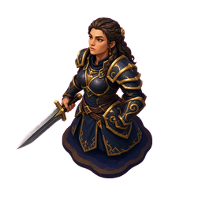

**Concept**
💡 A participle clause is a subordinate clause used to give extra information.

**Keywords**
_No keywords yet_

**Quote**
“A participle clause is a type of subordinate or dependent adverbial clause. It uses a participle to give extra information about time, reason, result, manner, or condition.”

**Story**
—

### [Y] yak

**Concept**
💡 The subject of the participle clause and the main clause must be the same.

**Keywords**
_No keywords yet_

**Quote**
“The subject of the participle clause and the main clause must be the same.”

**Story**
—

### [Z] Zeus

**Concept**
💡 Present Active (Simultaneous Actions) - Two things happening at the same time.

**Keywords**
_No keywords yet_

**Quote**
“Leaving in a hurry, John forgot to collect his coat.”

**Story**
—

### [Aa] aardvark

**Concept**
💡 Present Active (Reason) - Stating a reason before the result.

**Keywords**
_No keywords yet_

**Quote**
“Hoping to improve my French, I joined a class.”

**Story**
—

### [Ab] Abyssinian cat

**Concept**
💡 Present Active (Negative Form) - Place "not" before the participle.

**Keywords**
_No keywords yet_

**Quote**
“Not wanting to wake him, I left quietly.”

**Story**
—

#### Notes

_No notes._

#### Gallery

_No gallery images._

<strong>Memory Palace 6: Discourse Markers (Result & Reason)</strong> · Character: (unassigned palace 6) · 4 beasts · 4 atoms

<em>4 beasts · 4 Knowledge Atoms</em>

#### Knowledge Atoms

### [T] toucan

**Concept**
💡 A colorful Toucan sits on a bench. It is sweating profusely in the sun. It decides to remove its heavy feathers like a coat. It explains the result of the heat.

**Keywords**
_No keywords yet_

**Quote**
“It was hot, so I took off my jacket.”

**Story**
A colorful Toucan sits on a bench. It is sweating profusely in the sun. It decides to remove its heavy feathers like a coat. It explains the result of the heat.

### [U] unicorn

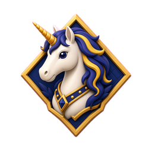

**Concept**
💡 A Unicorn wearing a suit acts as an examiner. It hands a failed exam paper to a student. It explains formally that because of this result, there is no job offer.

**Keywords**
_No keywords yet_

**Quote**
“I regret to inform you that you have failed your C1 English exam; therefore, we are unable to offer you the job.”

**Story**
A Unicorn wearing a suit acts as an examiner. It hands a failed exam paper to a student. It explains formally that because of this result, there is no job offer.

### [V] vulture

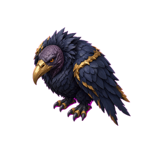

**Concept**
💡 A Vulture perches on a desk like a boss. It places the word "therefore" right before the main verb "decided." It makes a final decision about a candidate.

**Keywords**
_No keywords yet_

**Quote**
“We have therefore decided not to offer you the job.”

**Story**
A Vulture perches on a desk like a boss. It places the word "therefore" right before the main verb "decided." It makes a final decision about a candidate.

### [W] wombat

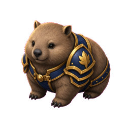

**Concept**
💡 A Wombat writes a letter with a quill. It gets no response, so it puts the pen down. It uses "As" at the start of her sentence to give the reason.

**Keywords**
_No keywords yet_

**Quote**
“As she never replies, I'd stop writing to her.”

**Story**
A Wombat writes a letter with a quill. It gets no response, so it puts the pen down. It uses "As" at the start of her sentence to give the reason.

#### Notes

_No notes._

#### Gallery

_No gallery images._

<strong>Memory Palace 5: Advanced Application</strong> · Character: (unassigned palace 5) · 2 beasts · 2 atoms

<em>2 beasts · 2 Knowledge Atoms</em>

#### Knowledge Atoms

### [R] rat

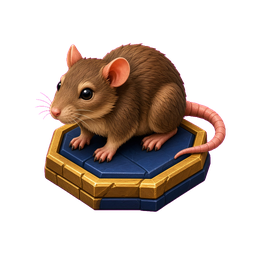

**Concept**
💡 A Rat looks at a calendar on the wall. Someone says "He will come today." The Rat shakes its head and gnaws on the sentence. It removes the prediction and leaves only the word "it" behind.

**Keywords**
_No keywords yet_

**Quote**
“He might come today, but I doubt it.”

**Story**
A Rat looks at a calendar on the wall. Someone says "He will come today." The Rat shakes its head and gnaws on the sentence. It removes the prediction and leaves only the word "it" behind.

### [S] skull

**Concept**
💡 A floating Skull hovers at the end of the street. It stares at a paragraph full of dead weight. It disintegrates the extra words, leaving only the bare bones of the sentence to make it sleek.

**Keywords**
_No keywords yet_

**Quote**
“It just makes your writing much more concise and it makes it flow better as well.”

**Story**
A floating Skull hovers at the end of the street. It stares at a paragraph full of dead weight. It disintegrates the extra words, leaving only the bare bones of the sentence to make it sleek.

#### Notes

_No notes._

#### Gallery

_No gallery images._

<strong>Memory Palace 4: Ellipsis & Substitution Basics</strong> · Character: (unassigned palace 4) · 5 beasts · 5 atoms

<em>5 beasts · 5 Knowledge Atoms</em>

#### Knowledge Atoms

### [M] marmoset

**Concept**
💡 It holds a red pen and reads a long sentence on a screen. It aggressively crosses out words that are not needed. It explains the definition of this technique.

**Keywords**
_No keywords yet_

**Quote**
“Ellipsis just means you're deleting words from sentences—unnecessary words or redundant words.”

**Story**
It holds a red pen and reads a long sentence on a screen. It aggressively crosses out words that are not needed. It explains the definition of this technique.

### [N] Neanderthal

**Concept**
💡 A Neanderthal stands next to the Marmoset holding two mugs. He grunts at a guest. He does not say "Do you want a tea or do you want a coffee?" He just holds them up to save words. He knows that too much talking is bad.

**Keywords**
_No keywords yet_

**Quote**
“The more words you use in a sentence, the more confusing the sentence gets.”

**Story**
A Neanderthal stands next to the Marmoset holding two mugs. He grunts at a guest. He does not say "Do you want a tea or do you want a coffee?" He just holds them up to save words. He knows that too much talking is bad.

### [O] owl

**Concept**
💡 An Owl plays a guitar on the sidewalk. A second Owl watches him. The second Owl does not pick up a guitar, but simply nods to show he can do it too. He avoids repeating the action.

**Keywords**
_No keywords yet_

**Quote**
“She can play the guitar and he can too.”

**Story**
An Owl plays a guitar on the sidewalk. A second Owl watches him. The second Owl does not pick up a guitar, but simply nods to show he can do it too. He avoids repeating the action.

### [P] panther

**Concept**
💡 A black Panther stalks a sentence written on the ground. It pounces on a repeated phrase and swaps it for a decoy word. It explains that this is a specific technique for replacing words.

**Keywords**
_No keywords yet_

**Quote**
“Substitution is exactly what it says it is: you're substituting words, you're replacing words in a phrase or even part of a phrase as well to avoid repeating the same words.”

**Story**
A black Panther stalks a sentence written on the ground. It pounces on a repeated phrase and swaps it for a decoy word. It explains that this is a specific technique for replacing words.

### [Q] Quetzalcoatl

**Concept**
💡 The feathered serpent Quetzalcoatl wears a mechanic's belt. He coils around a broken sentence engine. He holds a wrench labeled "Auxiliary" in his mouth. He adjusts the "Tense" gear to make sure it corresponds perfectly.

**Keywords**
_No keywords yet_

**Quote**
“The auxiliary verb needs to correspond with the types of verbs that you're using... it also needs to correspond in tense as well.”

**Story**
The feathered serpent Quetzalcoatl wears a mechanic's belt. He coils around a broken sentence engine. He holds a wrench labeled "Auxiliary" in his mouth. He adjusts the "Tense" gear to make sure it corresponds perfectly.

#### Notes

_No notes._

#### Gallery

_No gallery images._

<strong>Memory Palace 3: Special Variations</strong> · Character: (unassigned palace 3) · 2 beasts · 2 atoms

<em>2 beasts · 2 Knowledge Atoms</em>

#### Knowledge Atoms

### [K] Kitten

**Concept**
💡 A small Kitten sleeps at the bottom of a black stone. It does not want toys or food. It shows that the only thing it wants is rest. It says: "All I want is more sleep." This is the "All" Cleft. Here, "All" means "the only thing."

**Keywords**
_No keywords yet_

**Quote**
—

**Story**
A small Kitten sleeps at the bottom of a black stone. It does not want toys or food. It shows that the only thing it wants is rest. It says: "All I want is more sleep." This is the "All" Cleft. Here, "All" means "the only thing."

### [L] Lion

**Concept**
💡 A Lion wears a detective hat. He looks at the ground with a glass. He ignores the police. He tries to do the action himself. "What he did was try to solve the crime himself." The Lion shows the action using "What... do."

**Keywords**
_No keywords yet_

**Quote**
—

**Story**
A Lion wears a detective hat. He looks at the ground with a glass. He ignores the police. He tries to do the action himself. "What he did was try to solve the crime himself." The Lion shows the action using "What... do."

#### Notes

_No notes._

#### Gallery

_No gallery images._

<strong>Memory Palace 2: Wh-Clefts & Rules</strong> · Character: (unassigned palace 2) · 5 beasts · 5 atoms

<em>5 beasts · 5 Knowledge Atoms</em>

#### Knowledge Atoms

### [F] Frog

**Concept**
💡 A Frog watches words fly by. It sees a "Subject" and a "Verb." Then it sees the word "that." The word "that" acts as an object. The Frog uses its tongue to catch and eat the word. The rule is: If you have a subject and a verb after your rel

**Keywords**
_No keywords yet_

**Quote**
—

**Story**
A Frog watches words fly by. It sees a "Subject" and a "Verb." Then it sees the word "that." The word "that" acts as an object. The Frog uses its tongue to catch and eat the word. The rule is: If you have a subject and a verb after your relative pronoun, you can take it out.

### [G] Goat

**Concept**
💡 A Goat chews on an empty wallet. It shouts loudly. It says the "Wh-clause"—the thing "What we need"—must be money. It cries: "What we need is more money." This shows the Wh-Cleft Structure.

**Keywords**
_No keywords yet_

**Quote**
—

**Story**
A Goat chews on an empty wallet. It shouts loudly. It says the "Wh-clause"—the thing "What we need"—must be money. It cries: "What we need is more money." This shows the Wh-Cleft Structure.

### [H] Hydra

**Concept**
💡 The Hydra holds a heavy car battery in its main head. It moves the battery all the way to its tail. It changes the order, but the meaning is the same. The sentence flips: "A new battery is what you need." This shows you can reverse Wh-Cleft

**Keywords**
_No keywords yet_

**Quote**
—

**Story**
The Hydra holds a heavy car battery in its main head. It moves the battery all the way to its tail. It changes the order, but the meaning is the same. The sentence flips: "A new battery is what you need." This shows you can reverse Wh-Clefts.

### [I] Imp

**Concept**
💡 An Imp paints a big word "IS" on the wall. A big pile of plural nouns falls on him. Even with the heavy weight, he says the verb must be singular. The rule is: The Wh-clause is singular. Even if your noun is plural, use is or was.

**Keywords**
_No keywords yet_

**Quote**
—

**Story**
Example: "What they need is more time." (Not "are"—use is even though "they" is plural.)

### [J] Jester

**Concept**
💡 The Jester points at the Imp and laughs. He uses the word "That" to talk about the whole thing. He says: "That's what I'm talking about." This shows you can use "That" to talk about what just happened.

**Keywords**
_No keywords yet_

**Quote**
—

**Story**
Go to the last street.

#### Notes

_No notes._

#### Gallery

_No gallery images._

<strong>Memory Palace 1: Cleft Sentences & It-Clefts</strong> · Character: (unassigned palace 1) · 4 beasts · 4 atoms

<em>4 beasts · 4 Knowledge Atoms</em>

#### Knowledge Atoms

### [A] Arachne

**Concept**
💡 Arachne hangs from the stone. She is making a big web. She does not finish it. Instead, she cuts the web right in the middle. She makes two parts to show you the structure is divided. This is the definition: The word "cleft" means divided.

**Keywords**
_No keywords yet_

**Quote**
—

**Story**
Arachne hangs from the stone. She is making a big web. She does not finish it. Instead, she cuts the web right in the middle. She makes two parts to show you the structure is divided. This is the definition: The word "cleft" means divided.

### [B] Bird of Paradise

**Concept**
💡 Next to her, a Bird of Paradise opens its colorful feathers. It wants you to look at a passport on the ground. It hits a fake passport to fix the mistake. It makes a loud noise at a traveler. The bird says: "Her passport? No. It was my pass

**Keywords**
_No keywords yet_

**Quote**
—

**Story**
Next to her, a Bird of Paradise opens its colorful feathers. It wants you to look at a passport on the ground. It hits a fake passport to fix the mistake. It makes a loud noise at a traveler. The bird says: "Her passport? No. It was my passport that she dropped." This shows why we use cleft sentences: For Emphasis and Correction.

### [C] Cat

**Concept**
💡 Down the street, a Cat sits on a government paper. You try to move the cat, but it stays there. It shows that this is the paper you need. The cat says: "It's form B6115 that you need." This shows the It-Cleft Structure: It plus "to be" plus

**Keywords**
_No keywords yet_

**Quote**
—

**Story**
A Dragon goes to a party. Mickey and Minnie Mouse are the hosts. The hosts are plural (two people). But the Dragon uses fire to make them use a singular verb. He shouts: "It is Matt and Jessica who are having the party, not me." The rule is: Use the singular "Be," even for plural subjects.

### [E] Eagle

**Concept**
💡 High up, an Eagle holds a famous book in its claws. It shouts the name of the author to everyone below. "I believe it was Shel Silverstein who wrote The Giving Tree." The Eagle shows you the Relative Pronouns: Who or That.

**Keywords**
_No keywords yet_

**Quote**
—

**Story**
Go to the second street.

#### Notes

_No notes._

#### Gallery

_No gallery images._

