# English

_18 Memory Palaces · newest first_

_Tap a Memory Palace to expand · beasts grouped like the dashboard · newest open by default_

---

<strong>Memory Palace 18: Syllabic Consonants</strong> · Character: (unassigned palace 18) · 3 beasts · 3 atoms

<em>3 beasts · 3 Knowledge Atoms</em>

_No image prompt saved._

#### Knowledge Atoms

<strong>Beast</strong> · [Bs] Bone Shark

**Concept**
💡 Syllabic L [l̩] takes over the entire syllable when the vowel is reduced.

**Quote**
“The consonant essentially takes over the role of the vowel, like in bottle or apple.”

**Story**
—

**Sensory**
—

<strong>Beast</strong> · [Bt] Bone Toad

**Concept**
💡 Syllabic N [n̩] frequently occurs after alveolar consonants like /t/ or /s/, often utilizing a glottal stop.

**Quote**
“In American English, when a /t/ precedes a syllabic /n/, the /t/ is typically pronounced as a glottal stop, like in button.”

**Story**
—

**Sensory**
—

<strong>Beast</strong> · [Bu] butterfly

**Concept**
💡 Syllabic M [m̩] acts as its own syllable, often found in words ending in "thm" or "sm".

**Quote**
“Syllabic M regularly occurs in words ending in 'thm' or 'sm', such as rhythm and chasm.”

**Story**
—

**Sensory**
—

<strong>Memory Palace 17: Elision & Intrusion Rules</strong> · Character: (unassigned palace 17) · 2 beasts · 2 atoms

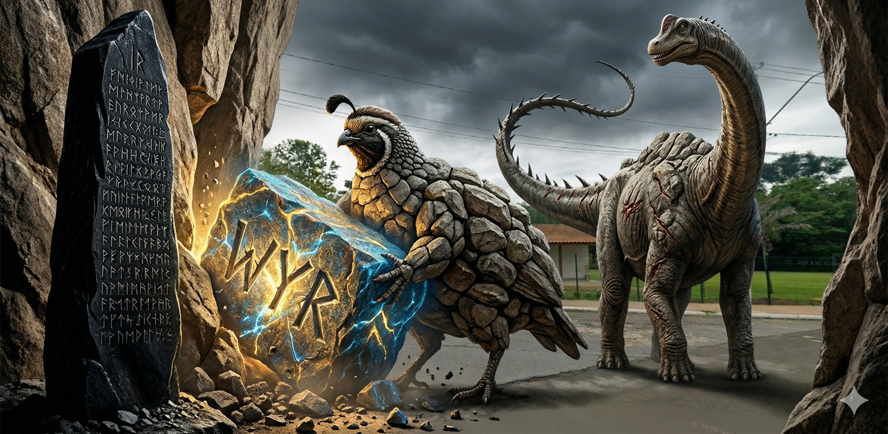

<em>2 beasts · 2 Knowledge Atoms</em>

_No image prompt saved._

#### Knowledge Atoms

<strong>Beast</strong> · [Bq] Boulder quail

**Concept**
💡 Intrusion is the addition of a new sound.

**Quote**
“Sounds are added, there's intrusion from a new sound.”

**Story**
—

**Sensory**
—

<strong>Beast</strong> · [Br] brontosaurus

**Concept**
💡 Only 'w', 'y', or 'r' sounds are usually added in intrusion.

**Quote**
“There are usually only three sounds that can be added. We either have a 'w', a 'y', or an 'r' sound added.”

**Story**
—

**Sensory**
—

<strong>Memory Palace 16: Connected Speech & Assimilation</strong> · Character: (unassigned palace 16) · 5 beasts · 5 atoms

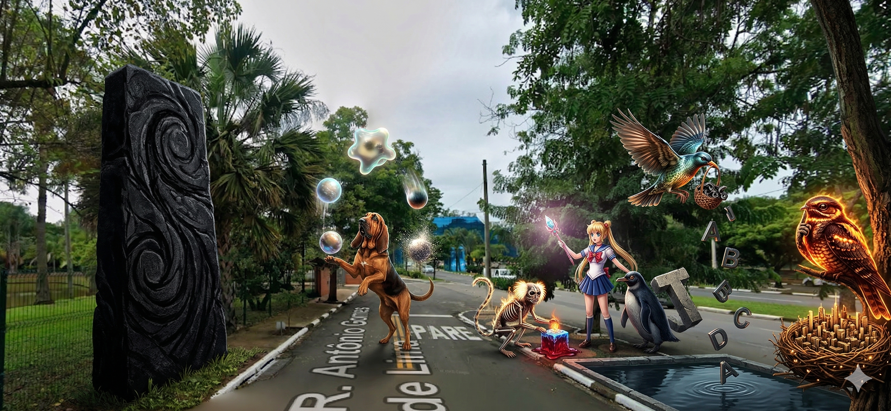

<em>5 beasts · 5 Knowledge Atoms</em>

_No image prompt saved._

#### Knowledge Atoms

<strong>Beast</strong> · [Bl] bloodhound

**Concept**
💡 Connected speech involves changing, losing, or adding sounds.

**Quote**
“What happens in connected speech is that sounds change, sounds are lost, and sounds are added.”

**Story**
—

**Sensory**
—

<strong>Beast</strong> · [Bm] Bone marmoset

**Concept**
💡 Assimilation is when a sound changes to be more like its neighbor.

**Quote**
“A sound changes to become more similar, so more similar, assimilation.”

**Story**
—

**Sensory**
—

<strong>Beast</strong> · [Bn] Blazing nightjar

**Concept**
💡 Preparing for /b/ by closing lips early changes /n/ to /m/.

**Quote**
“Because we get ready to say 'Barcelona' we close our lips already, and instead of an 'n' sound we say 'm'.”

**Story**
—

**Sensory**
—

<strong>Beast</strong> · [Bo] bower-bird

**Concept**
💡 Elision is the deletion or loss of sounds.

**Quote**
“When sounds are lost they're deleted, so we call this elision.”

**Story**
—

**Sensory**
—

<strong>Beast</strong> · [Bp] Blackwater penguin

**Concept**
💡 Final 't' or 'd' sounds are the most commonly lost in English.

**Quote**
“Most of the time in English, that means that a final 't' or 'd' sound is lost.”

**Story**
—

**Sensory**
—

<strong>Memory Palace 15: Rhythm and Flow</strong> · Character: (unassigned palace 15) · 4 beasts · 4 atoms

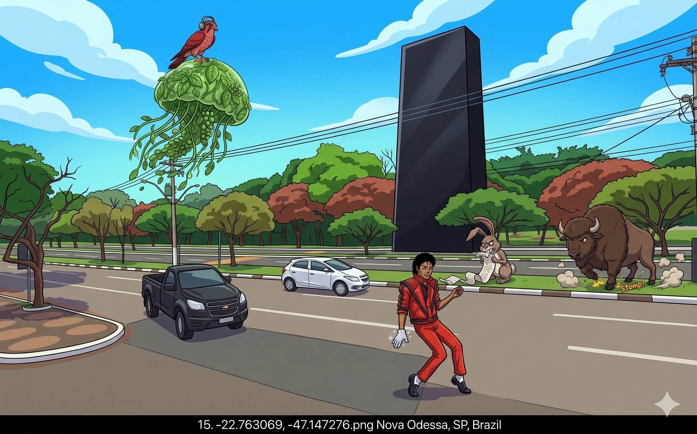

<em>4 beasts · 4 Knowledge Atoms</em>

_No image prompt saved._

#### Knowledge Atoms

<strong>Beast</strong> · [Bh] Bitter hare

**Concept**
💡 Thought groups involve using short pauses to break down sentences.

**Quote**
—

**Story**
—

**Sensory**
—

<strong>Beast</strong> · [Bi] bison

**Concept**
💡 English is a stress-timed language with regular intervals.

**Quote**
—

**Story**
—

**Sensory**
—

<strong>Beast</strong> · [Bj] Basil jellyfish

**Concept**
💡 Linking occurs when the end of one word blends directly into the start of the next word.

**Quote**
—

**Story**
—

**Sensory**
—

<strong>Beast</strong> · [Bk] Bloodmoon kestrel

**Concept**
💡 Shadowing is actively repeating a text simultaneously to absorb natural rhythm.

**Quote**
—

**Story**
—

**Sensory**
—

<strong>Memory Palace 14: Pitch and Notation</strong> · Character: (unassigned palace 14) · 2 beasts · 2 atoms

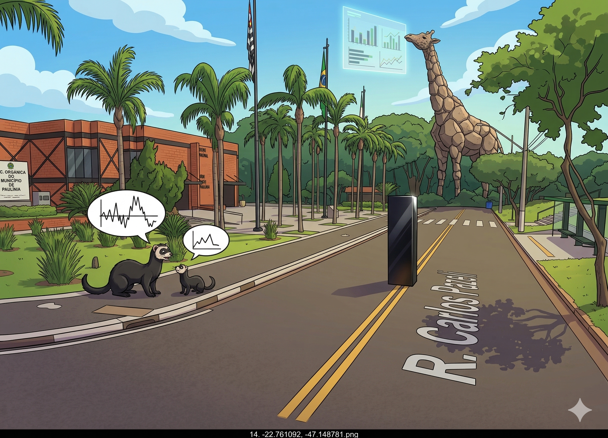

<em>2 beasts · 2 Knowledge Atoms</em>

_No image prompt saved._

#### Knowledge Atoms

<strong>Beast</strong> · [Bf] Blackwater ferret

**Concept**
💡 Linguistically, only the relative values of pitch matter, not the absolute values.

**Quote**
“It is their relative values, not their absolute values, that matter linguistically.”

**Story**
—

**Sensory**
—

<strong>Beast</strong> · [Bg] Boulder giraffe

**Concept**
💡 The IPA chart has a dedicated section for suprasegmental symbols.

**Quote**
“The instructor points out that the International Phonetic Alphabet (IPA) chart provides a completely separate set of symbols specifically for suprasegmentals.”

**Story**
—

**Sensory**
—

<strong>Memory Palace 13: Suprasegmental Basics</strong> · Character: (unassigned palace 13) · 5 beasts · 5 atoms

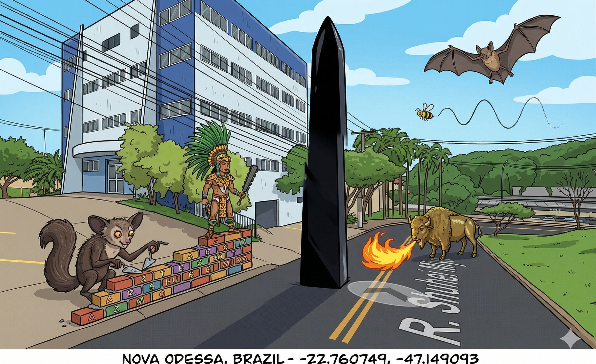

<em>5 beasts · 5 Knowledge Atoms</em>

_No image prompt saved._

#### Knowledge Atoms

<strong>Beast</strong> · [Ay] aye-aye

**Concept**
💡 Spoken language is built from segments: consonants (bricks) and vowels (mortar).

**Quote**
“You can look at language as a building and think of consonants as the bricks and the vowels as a mortar that connects the bricks together.”

**Story**
—

**Sensory**
—

<strong>Beast</strong> · [Az] Aztec

**Concept**
💡 Suprasegmentals are features "beyond the segment" that emerge only through comparison.

**Quote**
“Suprasegmental is a word made of supra, the prefix beyond, and segment: beyond the segment level. You will get to super segmental features when you compare segments to each other, you put them in a contrast.”

**Story**
—

**Sensory**
—

<strong>Beast</strong> · [Ba] bat

**Concept**
💡 Length is the relative duration of a sound.

**Quote**
“In English, stress can affect length.”

**Story**
—

**Sensory**
—

<strong>Beast</strong> · [Bb] Brass bison

**Concept**
💡 Stress can alter a word's meaning, pitch, and sound properties.

**Quote**
“Stress in English can also result in exaggerated pitch; it can make a low pitch lower and it can make a high pitch higher.”

**Story**
—

**Sensory**
—

<strong>Beast</strong> · [Be] bee

**Concept**
💡 Intonation is the pitch pattern at the sentence level, which can change meaning.

**Quote**
“Pitch pattern at sentence level is called intonation. Voice pitch can change with the rate of vibration of the vocal folds independently of stress.”

**Story**
—

**Sensory**
—

<strong>Memory Palace 12: Negation, Mistakes, & Time</strong> · Character: (unassigned palace 12) · 5 beasts · 5 atoms

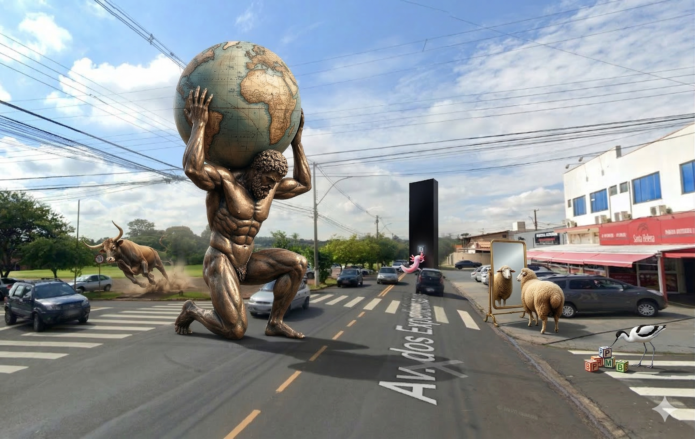

<em>5 beasts · 5 Knowledge Atoms</em>

_No image prompt saved._

#### Knowledge Atoms

<strong>Beast</strong> · [At] atlas

**Concept**
💡 Prefix dis- indicates the opposite or active negation.

**Quote**
“Dis talks about the negation, the opposite of something.”

**Story**
—

**Sensory**
—

<strong>Beast</strong> · [Au] auroch

**Concept**
💡 Prefix mis- refers to a mistake.

**Quote**
“Miss, think of it like a mistake.”

**Story**
—

**Sensory**
—

<strong>Beast</strong> · [Av] avocet

**Concept**
💡 Prefixes im-, in-, ir- spelling rules.

**Quote**
“Use im with words that begin with P, M, or B.”

**Story**
—

**Sensory**
—

<strong>Beast</strong> · [Aw] awassi sheep

**Concept**
💡 Insecure (feeling) vs. Unsecure (safety).

**Quote**
“Insecure says that you are not confident about yourself.”

**Story**
—

**Sensory**
—

<strong>Beast</strong> · [Ax] axolotl

**Concept**
💡 Prefix re- means to repeat.

**Quote**
“When you want to say repeat something, do it again, add re before the verb.”

**Story**
—

**Sensory**
—

<strong>Memory Palace 11: Prefixes & Suffixes Definitions</strong> · Character: Hermione Granger · 5 beasts · 5 atoms

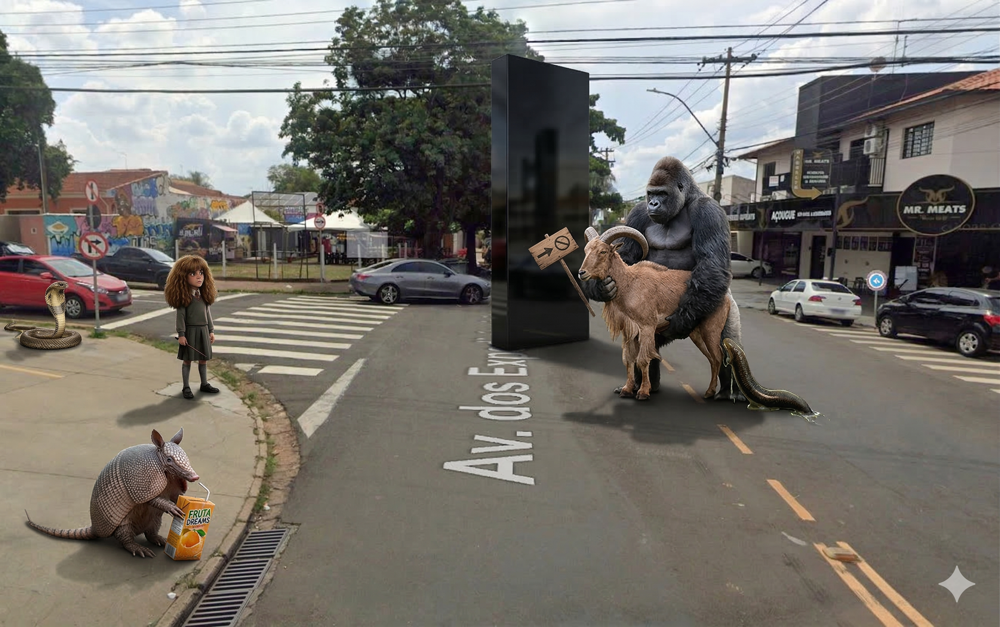

<em>5 beasts · 5 Knowledge Atoms</em>

_No image prompt saved._

#### Knowledge Atoms

<strong>Beast</strong> · [Ao] aoudad

**Concept**
💡 Core definitions: Prefix (before) and Suffix (after).

**Quote**
“A prefix is something that goes before a word." and "Suffixes are things that go afterwards.”

**Story**
—

**Sensory**
—

<strong>Beast</strong> · [Ap] ape

**Concept**
💡 Suffix -able indicates ability.

**Quote**
“Any verb plus able, it's possible to do this thing.”

**Story**
—

**Sensory**
—

<strong>Beast</strong> · [Aq] aquatic leech

**Concept**
💡 Suffix -ish softens time or adjectives.

**Quote**
“Ish with a time means not exactly this time.”

**Story**
—

**Sensory**
—

<strong>Beast</strong> · [Ar] armadillo

**Concept**
💡 Prefix un- means not complete or absent.

**Quote**
“Un means not, but more like not complete.”

**Story**
—

**Sensory**
—

<strong>Beast</strong> · [As] asp

**Concept**
💡 Prefix un- can also mean to reverse an action.

**Quote**
“Un can also mean to reverse an action.”

**Story**
—

**Sensory**
—

<strong>Memory Palace 10: Nominalization & Definitions</strong> · Character: (unassigned palace 10) · 5 beasts · 5 atoms

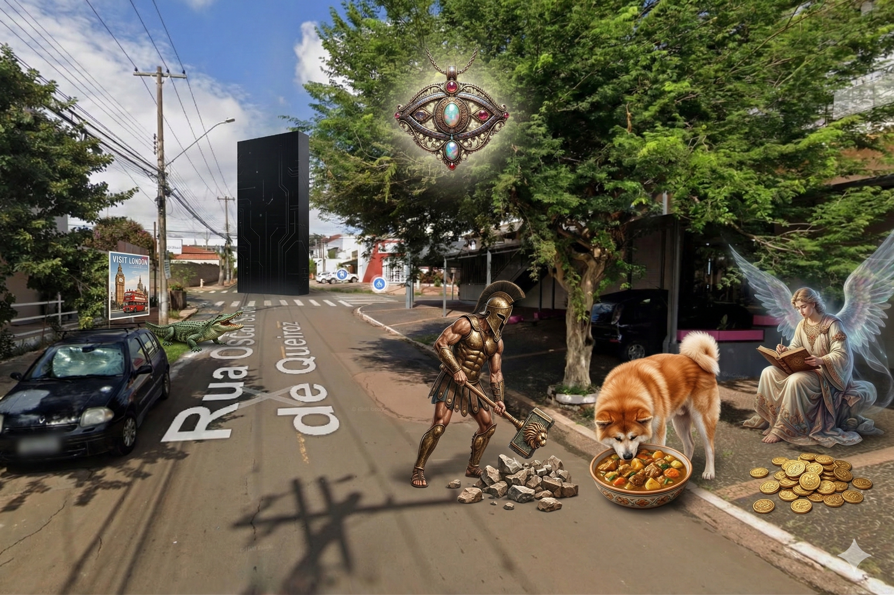

<em>5 beasts · 5 Knowledge Atoms</em>

_No image prompt saved._

#### Knowledge Atoms

<strong>Beast</strong> · [Aj] Ajax

**Concept**
💡 Definition of Nominalization (turning words into nouns).

**Quote**
“Nominalization means turning words into nouns.”

**Story**
—

**Sensory**
—

<strong>Beast</strong> · [Ak] Akita (dog breed)

**Concept**
💡 Transforming Verbs into Nouns (Enjoy -> Enjoyment).

**Quote**
“Jane shares the enjoyment of Indian food with her husband.”

**Story**
—

**Sensory**
—

<strong>Beast</strong> · [Al] alligator

**Concept**
💡 Transforming Adjectives into Nouns (Beautiful -> Beauty).

**Quote**
“The beauty of London is why I am going there.”

**Story**
—

**Sensory**
—

<strong>Beast</strong> · [Am] amulet

**Concept**
💡 The "Noun of Noun" Structure (Develop -> Development).

**Quote**
“The engineers are discussing the development of the building.”

**Story**
—

**Sensory**
—

<strong>Beast</strong> · [An] angel

**Concept**
💡 Advanced Nominalization with Relational Verbs (Leads to).

**Quote**
“The writing of books for pleasure leads to the provision of a passive income.”

**Story**
—

**Sensory**
—

<strong>Memory Palace 9: Passive & Mistakes</strong> · Character: (unassigned palace 9) · 2 beasts · 2 atoms

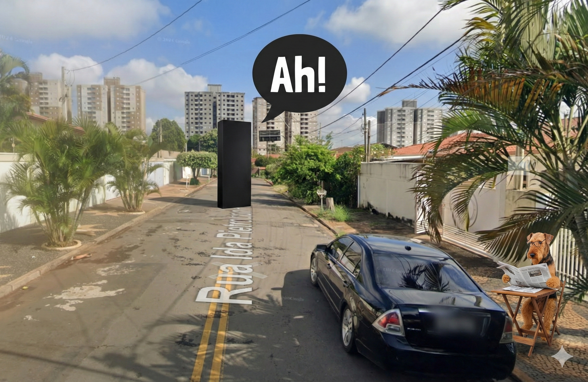

<em>2 beasts · 2 Knowledge Atoms</em>

_No image prompt saved._

#### Knowledge Atoms

<strong>Beast</strong> · [Ah] Ah!—a sigh

**Concept**
💡 Perfect Passive (Sequence/Reason) - Passive action completed before main clause.

**Quote**
“Having been fined for speeding before, she is now a careful driver.”

**Story**
—

**Sensory**
—

<strong>Beast</strong> · [Ai] Airedale terrier

**Concept**
💡 The Dangling Participle - Subject mismatch.

**Quote**
“Reading the newspaper, the cat jumped onto the table.”

**Story**
—

**Sensory**
—

<strong>Memory Palace 8: Consequences & Past Forms</strong> · Character: (unassigned palace 8) · 5 beasts · 5 atoms

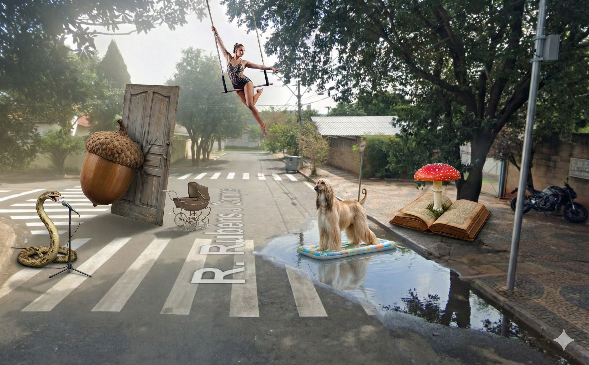

<em>5 beasts · 5 Knowledge Atoms</em>

_No image prompt saved._

#### Knowledge Atoms

<strong>Beast</strong> · [Ac] acorn

**Concept**
💡 Present Active (Consequence) - Action first, then the result.

**Quote**
“He slammed the door waking the baby.”

**Story**
—

**Sensory**
—

<strong>Beast</strong> · [Ad] adder

**Concept**
💡 Present Active (Ambiguity) - Flip the sentence if the subject is unclear.

**Quote**
“Singing loudly, I met a girl.”

**Story**
—

**Sensory**
—

<strong>Beast</strong> · [Ae] aerialist

**Concept**
💡 Perfect Active (Sequence) - Action fully completed before the main clause.

**Quote**
“Having thanked the hosts, the guests left the party.”

**Story**
—

**Sensory**
—

<strong>Beast</strong> · [Af] Afghan hound

**Concept**
💡 Past Participle (Subject Info) - Adding information about the subject.

**Quote**
“Surrounded by water, Venice is built on over a 100 islands.”

**Story**
—

**Sensory**
—

<strong>Beast</strong> · [Ag] Agaric fungi

**Concept**
💡 Past Participle (Condition) - Reduced conditional stating a fact.

**Quote**
“Used correctly, participle clauses make your writing more concise.”

**Story**
—

**Sensory**
—

<strong>Memory Palace 7: Participle Definitions & Active Forms</strong> · Character: Glossonauta · 5 beasts · 5 atoms

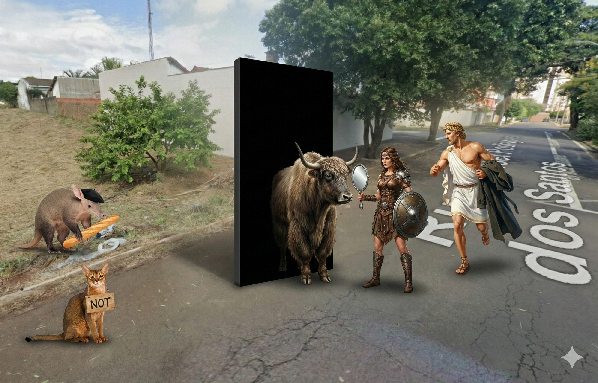

<em>5 beasts · 5 Knowledge Atoms</em>

_No image prompt saved._

#### Knowledge Atoms

<strong>Beast</strong> · [X] Xena, warrior woman

**Concept**
💡 A participle clause is a subordinate clause used to give extra information.

**Quote**
“A participle clause is a type of subordinate or dependent adverbial clause. It uses a participle to give extra information about time, reason, result, manner, or condition.”

**Story**
—

**Sensory**
—

<strong>Beast</strong> · [Y] yak

**Concept**
💡 The subject of the participle clause and the main clause must be the same.

**Quote**
“The subject of the participle clause and the main clause must be the same.”

**Story**
—

**Sensory**
—

<strong>Beast</strong> · [Z] Zeus

**Concept**
💡 Present Active (Simultaneous Actions) - Two things happening at the same time.

**Quote**
“Leaving in a hurry, John forgot to collect his coat.”

**Story**
—

**Sensory**
—

<strong>Beast</strong> · [Aa] aardvark

**Concept**
💡 Present Active (Reason) - Stating a reason before the result.

**Quote**
“Hoping to improve my French, I joined a class.”

**Story**
—

**Sensory**
—

<strong>Beast</strong> · [Ab] Abyssinian cat

**Concept**
💡 Present Active (Negative Form) - Place "not" before the participle.

**Quote**
“Not wanting to wake him, I left quietly.”

**Story**
—

**Sensory**
—

<strong>Memory Palace 6: Discourse Markers (Result & Reason)</strong> · Character: (unassigned palace 6) · 4 beasts · 4 atoms

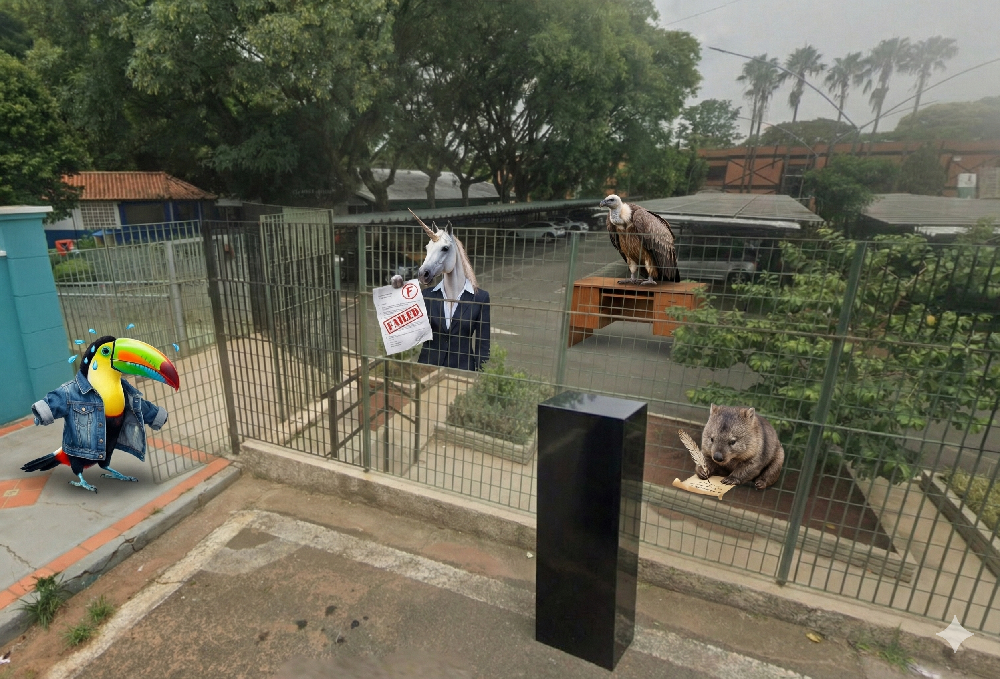

<em>4 beasts · 4 Knowledge Atoms</em>

_No image prompt saved._

#### Knowledge Atoms

<strong>Beast</strong> · [T] toucan

**Concept**
💡 A colorful Toucan sits on a bench. It is sweating profusely in the sun. It decides to remove its heavy feathers like a coat. It explains the result of the heat.

**Quote**
“It was hot, so I took off my jacket.”

**Story**
A colorful Toucan sits on a bench. It is sweating profusely in the sun. It decides to remove its heavy feathers like a coat. It explains the result of the heat.

**Sensory**
—

<strong>Beast</strong> · [U] unicorn

**Concept**
💡 A Unicorn wearing a suit acts as an examiner. It hands a failed exam paper to a student. It explains formally that because of this result, there is no job offer.

**Quote**
“I regret to inform you that you have failed your C1 English exam; therefore, we are unable to offer you the job.”

**Story**
A Unicorn wearing a suit acts as an examiner. It hands a failed exam paper to a student. It explains formally that because of this result, there is no job offer.

**Sensory**
—

<strong>Beast</strong> · [V] vulture

**Concept**
💡 A Vulture perches on a desk like a boss. It places the word "therefore" right before the main verb "decided." It makes a final decision about a candidate.

**Quote**
“We have therefore decided not to offer you the job.”

**Story**
A Vulture perches on a desk like a boss. It places the word "therefore" right before the main verb "decided." It makes a final decision about a candidate.

**Sensory**
—

<strong>Beast</strong> · [W] wombat

**Concept**
💡 A Wombat writes a letter with a quill. It gets no response, so it puts the pen down. It uses "As" at the start of her sentence to give the reason.

**Quote**
“As she never replies, I'd stop writing to her.”

**Story**
A Wombat writes a letter with a quill. It gets no response, so it puts the pen down. It uses "As" at the start of her sentence to give the reason.

**Sensory**
—

<strong>Memory Palace 5: Advanced Application</strong> · Character: (unassigned palace 5) · 2 beasts · 2 atoms

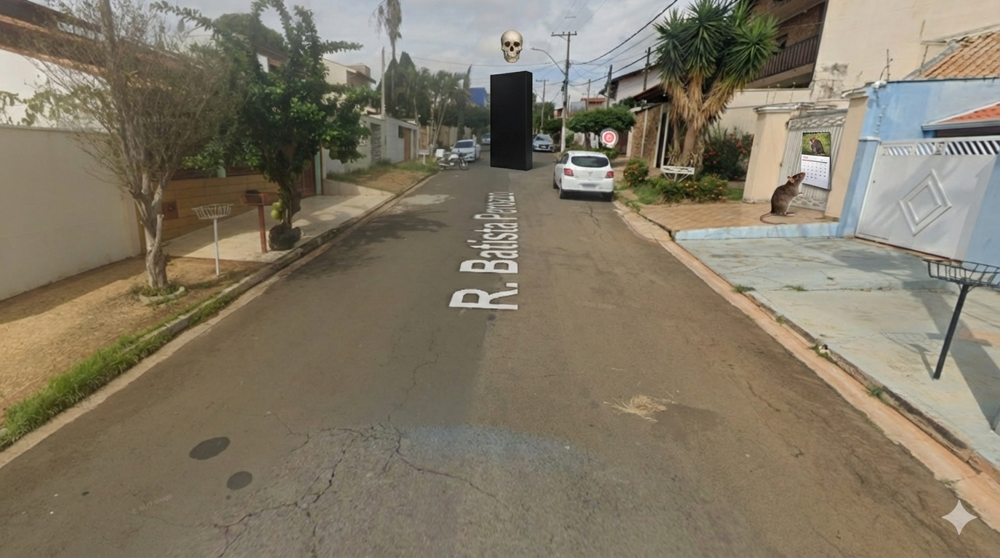

<em>2 beasts · 2 Knowledge Atoms</em>

_No image prompt saved._

#### Knowledge Atoms

<strong>Beast</strong> · [R] rat

**Concept**
💡 A Rat looks at a calendar on the wall. Someone says "He will come today." The Rat shakes its head and gnaws on the sentence. It removes the prediction and leaves only the word "it" behind.

**Quote**
“He might come today, but I doubt it.”

**Story**
A Rat looks at a calendar on the wall. Someone says "He will come today." The Rat shakes its head and gnaws on the sentence. It removes the prediction and leaves only the word "it" behind.

**Sensory**
—

<strong>Beast</strong> · [S] skull

**Concept**
💡 A floating Skull hovers at the end of the street. It stares at a paragraph full of dead weight. It disintegrates the extra words, leaving only the bare bones of the sentence to make it sleek.

**Quote**
“It just makes your writing much more concise and it makes it flow better as well.”

**Story**
A floating Skull hovers at the end of the street. It stares at a paragraph full of dead weight. It disintegrates the extra words, leaving only the bare bones of the sentence to make it sleek.

**Sensory**
—

<strong>Memory Palace 4: Ellipsis & Substitution Basics</strong> · Character: (unassigned palace 4) · 5 beasts · 5 atoms

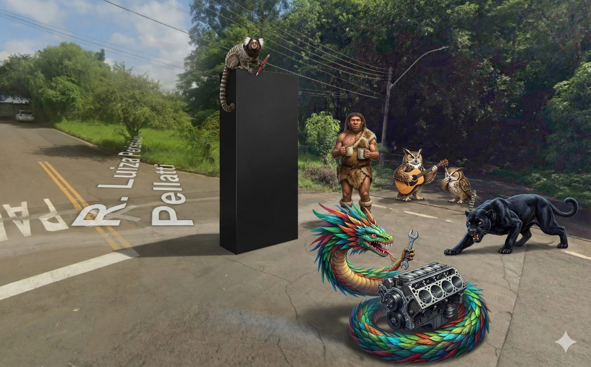

<em>5 beasts · 5 Knowledge Atoms</em>

_No image prompt saved._

#### Knowledge Atoms

<strong>Beast</strong> · [M] marmoset

**Concept**
💡 It holds a red pen and reads a long sentence on a screen. It aggressively crosses out words that are not needed. It explains the definition of this technique.

**Quote**
“Ellipsis just means you're deleting words from sentences—unnecessary words or redundant words.”

**Story**
It holds a red pen and reads a long sentence on a screen. It aggressively crosses out words that are not needed. It explains the definition of this technique.

**Sensory**
—

<strong>Beast</strong> · [N] Neanderthal

**Concept**
💡 A Neanderthal stands next to the Marmoset holding two mugs. He grunts at a guest. He does not say "Do you want a tea or do you want a coffee?" He just holds them up to save words. He knows that too much talking is bad.

**Quote**
“The more words you use in a sentence, the more confusing the sentence gets.”

**Story**
A Neanderthal stands next to the Marmoset holding two mugs. He grunts at a guest. He does not say "Do you want a tea or do you want a coffee?" He just holds them up to save words. He knows that too much talking is bad.

**Sensory**
—

<strong>Beast</strong> · [O] owl

**Concept**
💡 An Owl plays a guitar on the sidewalk. A second Owl watches him. The second Owl does not pick up a guitar, but simply nods to show he can do it too. He avoids repeating the action.

**Quote**
“She can play the guitar and he can too.”

**Story**
An Owl plays a guitar on the sidewalk. A second Owl watches him. The second Owl does not pick up a guitar, but simply nods to show he can do it too. He avoids repeating the action.

**Sensory**
—

<strong>Beast</strong> · [P] panther

**Concept**
💡 A black Panther stalks a sentence written on the ground. It pounces on a repeated phrase and swaps it for a decoy word. It explains that this is a specific technique for replacing words.

**Quote**
“Substitution is exactly what it says it is: you're substituting words, you're replacing words in a phrase or even part of a phrase as well to avoid repeating the same words.”

**Story**
A black Panther stalks a sentence written on the ground. It pounces on a repeated phrase and swaps it for a decoy word. It explains that this is a specific technique for replacing words.

**Sensory**
—

<strong>Beast</strong> · [Q] Quetzalcoatl

**Concept**
💡 The feathered serpent Quetzalcoatl wears a mechanic's belt. He coils around a broken sentence engine. He holds a wrench labeled "Auxiliary" in his mouth. He adjusts the "Tense" gear to make sure it corresponds perfectly.

**Quote**
“The auxiliary verb needs to correspond with the types of verbs that you're using... it also needs to correspond in tense as well.”

**Story**
The feathered serpent Quetzalcoatl wears a mechanic's belt. He coils around a broken sentence engine. He holds a wrench labeled "Auxiliary" in his mouth. He adjusts the "Tense" gear to make sure it corresponds perfectly.

**Sensory**
—

<strong>Memory Palace 3: Special Variations</strong> · Character: (unassigned palace 3) · 2 beasts · 2 atoms

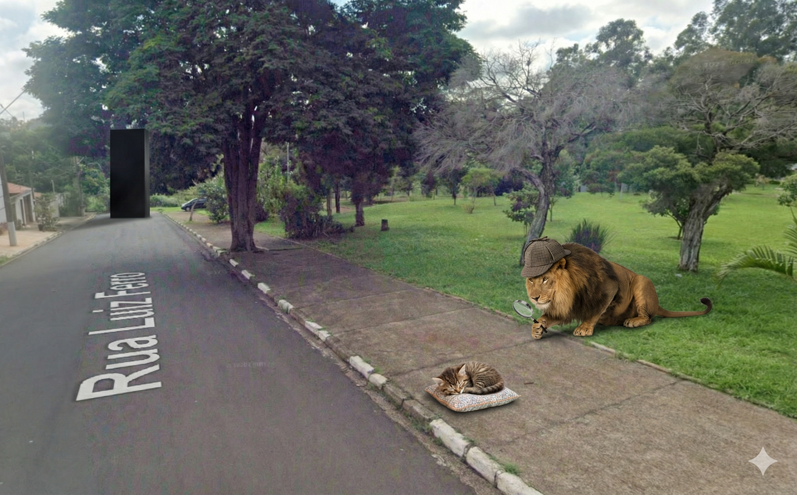

<em>2 beasts · 2 Knowledge Atoms</em>

_No image prompt saved._

#### Knowledge Atoms

<strong>Beast</strong> · [K] Kitten

**Concept**
💡 A small Kitten sleeps at the bottom of a black stone. It does not want toys or food. It shows that the only thing it wants is rest. It says: "All I want is more sleep." This is the "All" Cleft. Here, "All" means "the only thing."

**Quote**
—

**Story**
A small Kitten sleeps at the bottom of a black stone. It does not want toys or food. It shows that the only thing it wants is rest. It says: "All I want is more sleep." This is the "All" Cleft. Here, "All" means "the only thing."

**Sensory**
—

<strong>Beast</strong> · [L] Lion

**Concept**
💡 A Lion wears a detective hat. He looks at the ground with a glass. He ignores the police. He tries to do the action himself. "What he did was try to solve the crime himself." The Lion shows the action using "What... do."

**Quote**
—

**Story**
A Lion wears a detective hat. He looks at the ground with a glass. He ignores the police. He tries to do the action himself. "What he did was try to solve the crime himself." The Lion shows the action using "What... do."

**Sensory**
—

<strong>Memory Palace 2: Wh-Clefts & Rules</strong> · Character: (unassigned palace 2) · 5 beasts · 5 atoms

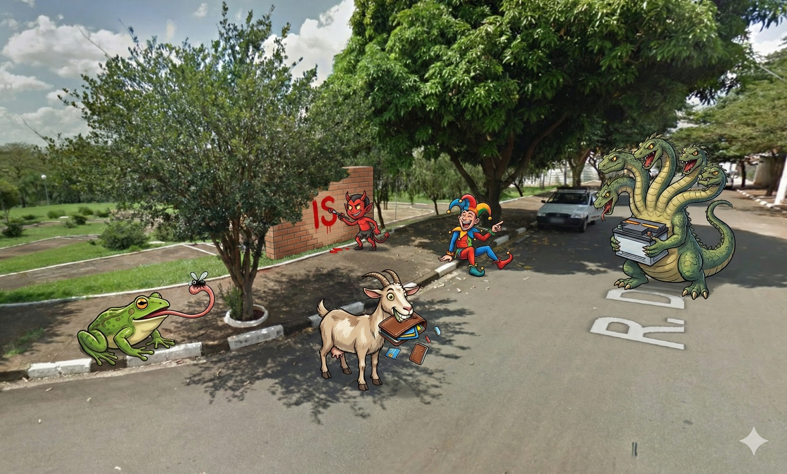

<em>5 beasts · 5 Knowledge Atoms</em>

_No image prompt saved._

#### Knowledge Atoms

<strong>Beast</strong> · [F] Frog

**Concept**
💡 A Frog watches words fly by. It sees a "Subject" and a "Verb." Then it sees the word "that." The word "that" acts as an object. The Frog uses its tongue to catch and eat the word. The rule is: If you have a subject and a verb after your rel

**Quote**
—

**Story**
A Frog watches words fly by. It sees a "Subject" and a "Verb." Then it sees the word "that." The word "that" acts as an object. The Frog uses its tongue to catch and eat the word. The rule is: If you have a subject and a verb after your relative pronoun, you can take it out.

**Sensory**
—

<strong>Beast</strong> · [G] Goat

**Concept**
💡 A Goat chews on an empty wallet. It shouts loudly. It says the "Wh-clause"—the thing "What we need"—must be money. It cries: "What we need is more money." This shows the Wh-Cleft Structure.

**Quote**
—

**Story**
A Goat chews on an empty wallet. It shouts loudly. It says the "Wh-clause"—the thing "What we need"—must be money. It cries: "What we need is more money." This shows the Wh-Cleft Structure.

**Sensory**
—

<strong>Beast</strong> · [H] Hydra

**Concept**
💡 The Hydra holds a heavy car battery in its main head. It moves the battery all the way to its tail. It changes the order, but the meaning is the same. The sentence flips: "A new battery is what you need." This shows you can reverse Wh-Cleft

**Quote**
—

**Story**
The Hydra holds a heavy car battery in its main head. It moves the battery all the way to its tail. It changes the order, but the meaning is the same. The sentence flips: "A new battery is what you need." This shows you can reverse Wh-Clefts.

**Sensory**
—

<strong>Beast</strong> · [I] Imp

**Concept**
💡 An Imp paints a big word "IS" on the wall. A big pile of plural nouns falls on him. Even with the heavy weight, he says the verb must be singular. The rule is: The Wh-clause is singular. Even if your noun is plural, use is or was.

**Quote**
—

**Story**
Example: "What they need is more time." (Not "are"—use is even though "they" is plural.)

**Sensory**
—

<strong>Beast</strong> · [J] Jester

**Concept**
💡 The Jester points at the Imp and laughs. He uses the word "That" to talk about the whole thing. He says: "That's what I'm talking about." This shows you can use "That" to talk about what just happened.

**Quote**
—

**Story**
Go to the last street.

**Sensory**
—

<strong>Memory Palace 1: Cleft Sentences & It-Clefts</strong> · Character: (unassigned palace 1) · 4 beasts · 4 atoms

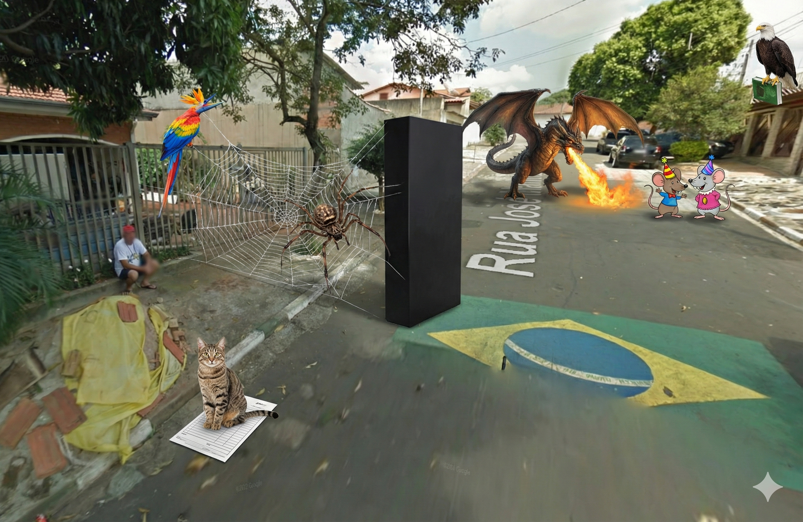

<em>4 beasts · 4 Knowledge Atoms</em>

_No image prompt saved._

#### Knowledge Atoms

<strong>Beast</strong> · [A] Arachne

**Concept**
💡 Arachne hangs from the stone. She is making a big web. She does not finish it. Instead, she cuts the web right in the middle. She makes two parts to show you the structure is divided. This is the definition: The word "cleft" means divided.

**Quote**
—

**Story**
Arachne hangs from the stone. She is making a big web. She does not finish it. Instead, she cuts the web right in the middle. She makes two parts to show you the structure is divided. This is the definition: The word "cleft" means divided.

**Sensory**
—

<strong>Beast</strong> · [B] Bird of Paradise

**Concept**
💡 Next to her, a Bird of Paradise opens its colorful feathers. It wants you to look at a passport on the ground. It hits a fake passport to fix the mistake. It makes a loud noise at a traveler. The bird says: "Her passport? No. It was my pass

**Quote**
—

**Story**
Next to her, a Bird of Paradise opens its colorful feathers. It wants you to look at a passport on the ground. It hits a fake passport to fix the mistake. It makes a loud noise at a traveler. The bird says: "Her passport? No. It was my passport that she dropped." This shows why we use cleft sentences: For Emphasis and Correction.

**Sensory**
—

<strong>Beast</strong> · [C] Cat

**Concept**
💡 Down the street, a Cat sits on a government paper. You try to move the cat, but it stays there. It shows that this is the paper you need. The cat says: "It's form B6115 that you need." This shows the It-Cleft Structure: It plus "to be" plus

**Quote**
—

**Story**
A Dragon goes to a party. Mickey and Minnie Mouse are the hosts. The hosts are plural (two people). But the Dragon uses fire to make them use a singular verb. He shouts: "It is Matt and Jessica who are having the party, not me." The rule is: Use the singular "Be," even for plural subjects.

**Sensory**
—

<strong>Beast</strong> · [E] Eagle

**Concept**
💡 High up, an Eagle holds a famous book in its claws. It shouts the name of the author to everyone below. "I believe it was Shel Silverstein who wrote The Giving Tree." The Eagle shows you the Relative Pronouns: Who or That.

**Quote**
—

**Story**
Go to the second street.

**Sensory**
—

