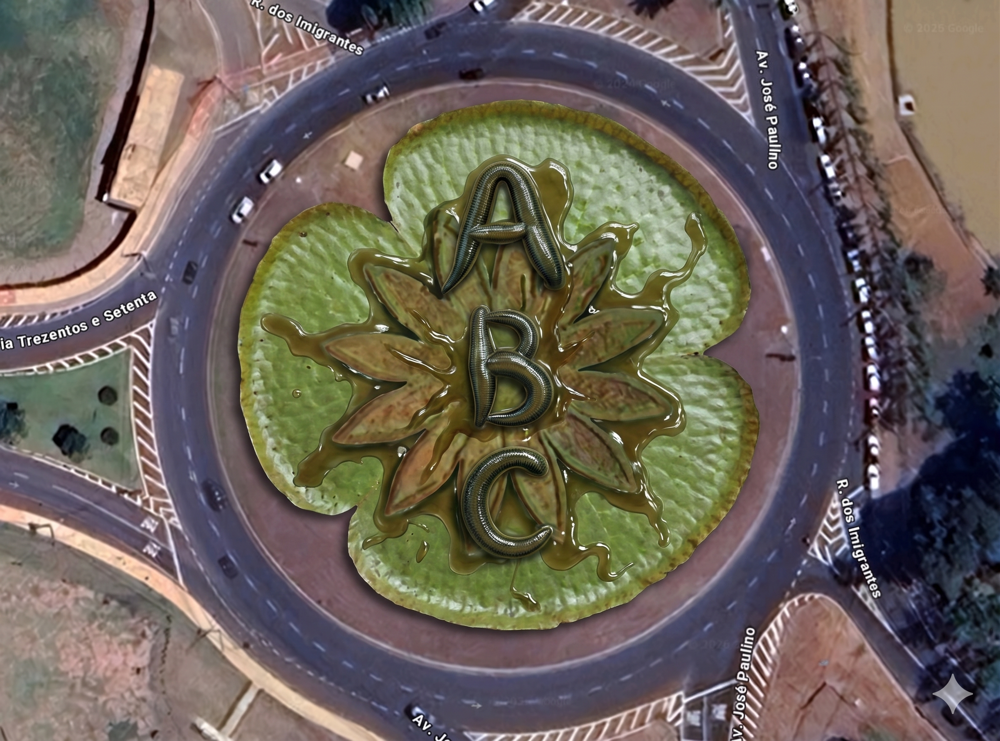
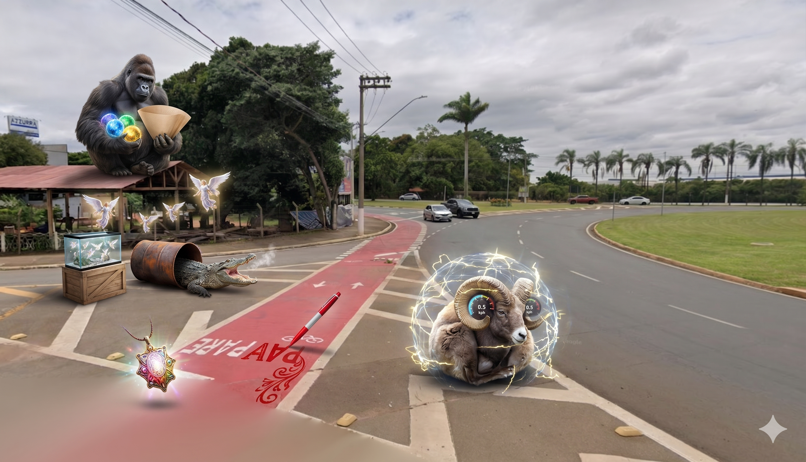
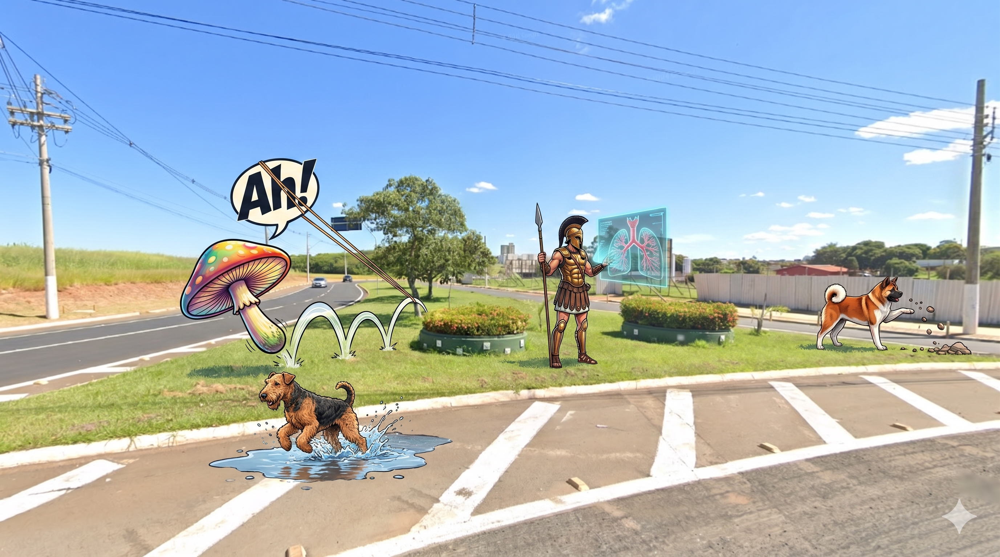
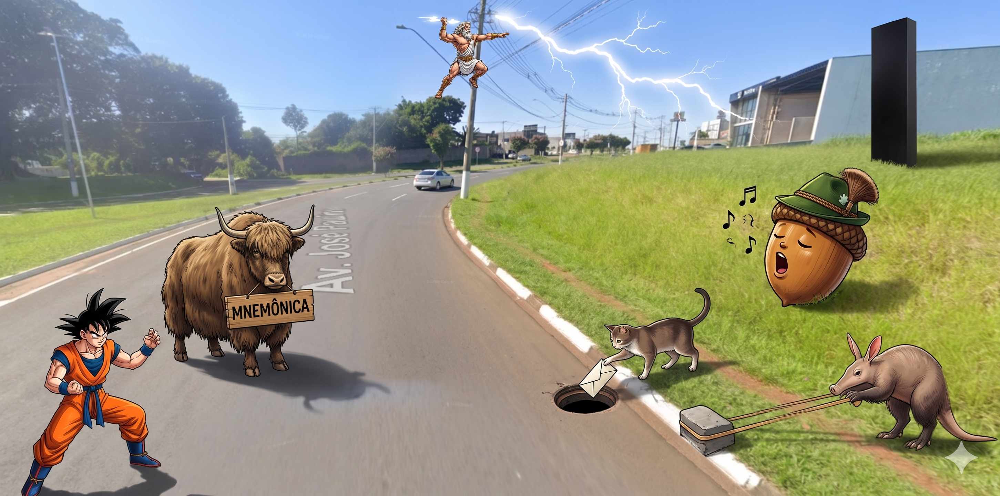
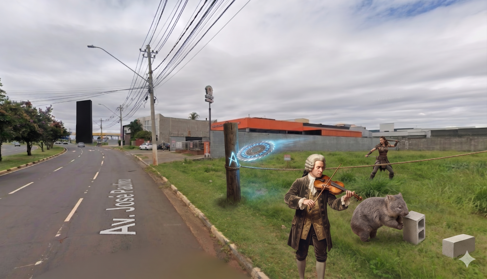
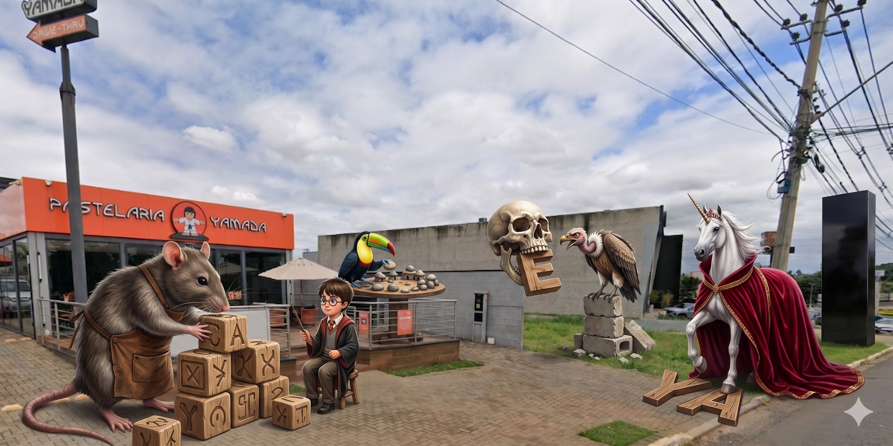
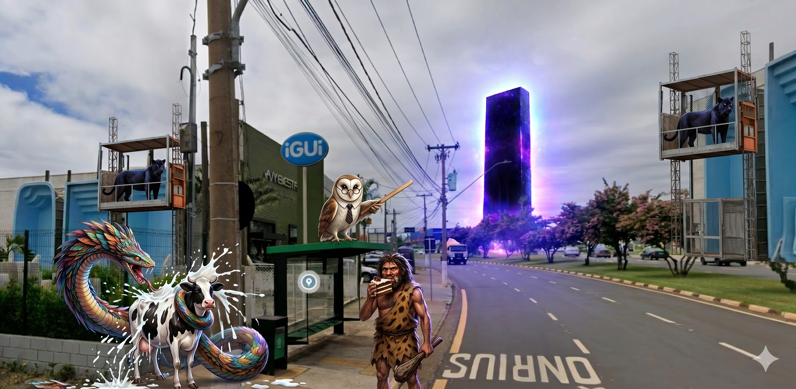
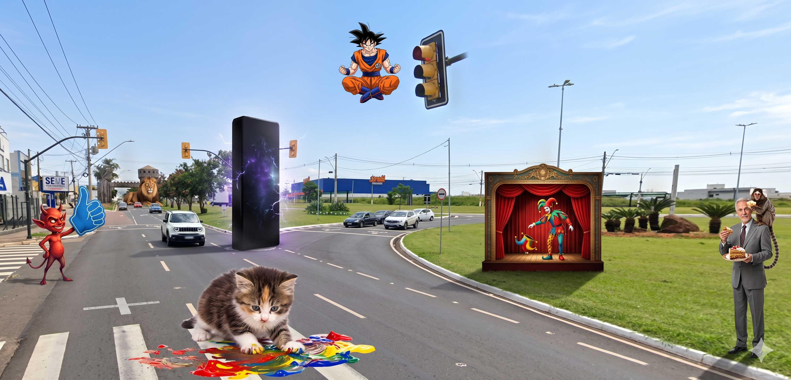
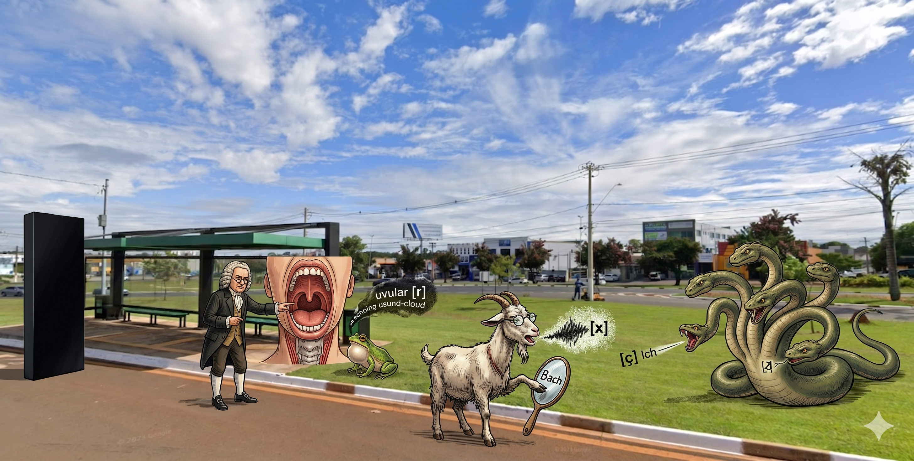
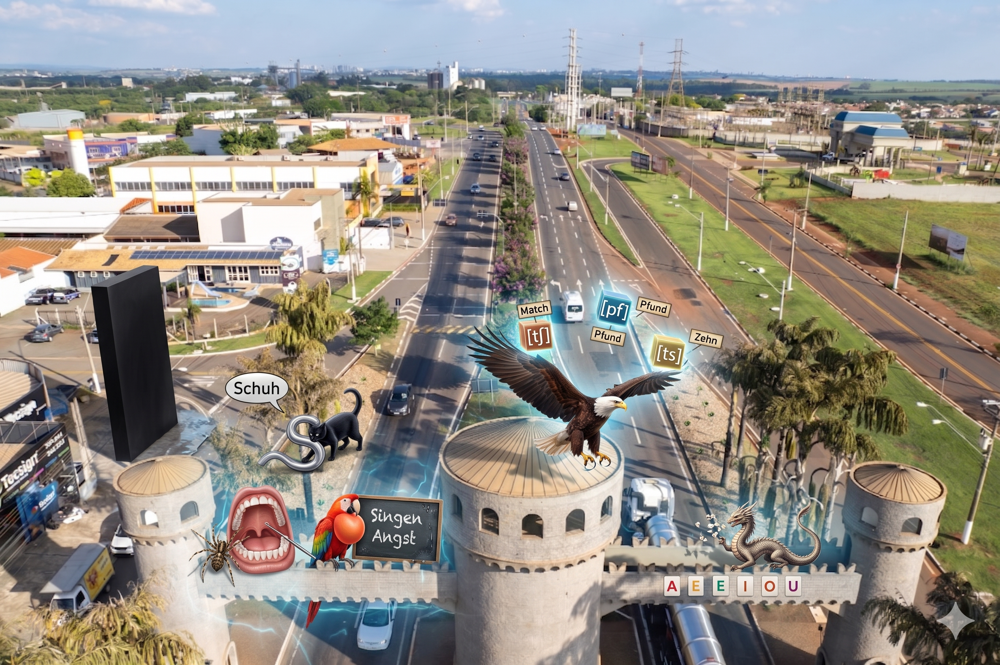

# German

_11 Memory Palaces · newest first_

_Tap a Memory Palace to expand · beasts grouped like the dashboard · newest open by default_

---

<strong>Memory Palace 11: The German Alphabet</strong> · Character: (unassigned palace 11) · 1 beast · 1 atom

<em>1 beast · 1 Knowledge Atom</em>

_No image prompt saved._

#### Knowledge Atoms

🟧 <strong>Beast</strong> · [Aq] [aquatic leech]

**Concept**
💡 Reharse the german alphabet depicted here: https://github.com/duducm2/scripts/blob/main/mnemonics/studies/german/portals/mnemonics-aquatic-leech.md

**Quote**
—

**Story**
—

**Sensory**
—

<strong>Memory Palace 10: Formants and Resonance</strong> · Character: (unassigned palace 10) · 5 beasts · 5 atoms

<em>5 beasts · 5 Knowledge Atoms</em>

_No image prompt saved._

#### Knowledge Atoms

🟧 <strong>Beast</strong> · [Al] [alligator]

**Concept**
💡 A sound gets louder when the space around it boosts the vibration.

**Quote**
—

**Story**
—

**Sensory**
—

🟧 <strong>Beast</strong> · [Am] [amulet]

**Concept**
💡 The absolute base wave made by the source is the fundamental frequency.

**Quote**
—

**Story**
—

**Sensory**
—

🟧 <strong>Beast</strong> · [An] [angel]

**Concept**
💡 Resonance bundles multiply the base frequency to create speech formants.

**Quote**
—

**Story**
—

**Sensory**
—

🟧 <strong>Beast</strong> · [Ao] [aoudad]

**Concept**
💡 The fundamental pitch comes directly from the vocal folds buzzing.

**Quote**
—

**Story**
—

**Sensory**
—

🟧 <strong>Beast</strong> · [Ap] [ape]

**Concept**
💡 The throat shapes the first formant, the mouth shapes the second, and their interplay with the base sound forms the source-filter model.

**Quote**
—

**Story**
—

**Sensory**
—

<strong>Memory Palace 9: Simple and Complex Sound Foundations</strong> · Character: (unassigned palace 9) · 4 beasts · 4 atoms

<em>4 beasts · 4 Knowledge Atoms</em>

_No image prompt saved._

#### Knowledge Atoms

🟧 <strong>Beast</strong> · [Ag] [Agaric fungi]

**Concept**
💡 Simple waves move evenly and repeat in a regular pattern.

**Quote**
—

**Story**
—

**Sensory**
—

🟧 <strong>Beast</strong> · [Ah] [Ah!—a sigh]

**Concept**
💡 Amplitude shows how far a wave moves away from its resting point.

**Quote**
—

**Story**
—

**Sensory**
—

🟧 <strong>Beast</strong> · [Ai] [Airedale terrier]

**Concept**
💡 Real sounds are usually made of messy, overlapping vibrations.

**Quote**
—

**Story**
—

**Sensory**
—

🟧 <strong>Beast</strong> · [Ak] [Akita (dog breed)]

**Concept**
💡 Vowel sounds are even and smooth, while consonants can be messy and irregular.

**Quote**
—

**Story**
—

**Sensory**
—

<strong>Memory Palace 8: The German R Variations</strong> · Character: (unassigned palace 8) · 3 beasts · 3 atoms

<em>3 beasts · 3 Knowledge Atoms</em>

_No image prompt saved._

#### Knowledge Atoms

🟧 <strong>Beast</strong> · [Ad] adder

**Concept**
💡 The 'r' can vibrate far back in the throat as a flexible option.

**Quote**
“Uvular trill: Can be used as a free variant of the voiced uvular fricative.”

**Story**
On the next street, an adder snake slithers around freely. It meets a tall villain in black armor, who points to the deep back of his throat. The snake vibrates its tail far back on a throat model, sliding around as a free and flexible option.

**Sensory**
—

🟧 <strong>Beast</strong> · [Ae] aerialqist

**Concept**
💡 The 'r' can be a friction sound pushed more to the front.

**Quote**
“Voiced velar fricative: A more fronted variant.”

**Story**
An aerialist swings on a trapeze above the snake. She swings her body forward to reach the front part of the villain's throat model. She rubs the surface to make a smooth, vibrating friction sound that sits more to the front.

**Sensory**
—

🟧 <strong>Beast</strong> · [Af] Afghan hound

🟦 **Z1 · Additional notes (non-mnemonic)**

**Concept**
💡 Reharse the german alphabet depicted here:

**Quote**
—

**Story**
The main difference lies in **how air is obstructed** (manner of articulation) and **where it happens** (place of articulation).

**Sensory**
—

<strong>Memory Palace 7: Consonant Limits and Vowel Reductions</strong> · Character: (unassigned palace 7) · 5 beasts · 5 atoms

<em>5 beasts · 5 Knowledge Atoms</em>

_No image prompt saved._

#### Knowledge Atoms

🟧 <strong>Beast</strong> · [Y] yak

**Concept**
💡 The /z/ sound never starts a word in Standard German.

**Quote**
—

**Story**
A yak stands at the corner of the street. It holds a large sign with the word Symbol [zʏmˈboːl]. It tries to make a buzzing sound at the very beginning, but a giant red "X" stops it. A spiky-haired martial artist steps in to help the yak, showing that the buzz cannot start the word. "The alveolar fricative /z/ never occurs word-initially in Standard German. A word like "symbol" is pronounced with a voiced alveolar fricative: Symbol." IPA: Symbol [zʏmˈboːl]

**Sensory**
—

🟧 <strong>Beast</strong> · [Z] Zeus

**Concept**
💡 The /ŋ/ sound only happens at the end of syllables.

**Quote**
“The velar nasal /ŋ/ only occurs at the end of syllables (syllable coda).”

**Story**
Zeus throws a lightning bolt at the yak's sign, breaking it into pieces. He grabs a singing block, representing the /ŋ/ sound, and forces it to sit at the absolute tail end of the broken piece. He yells at the yak that the sound is trapped at the end.

**Sensory**
—

🟧 <strong>Beast</strong> · [Aa] aardvark

**Concept**
💡 Long vowels get short when they are not stressed.

**Quote**
—

**Story**
An aardvark ignores Zeus and pulls on a long rubber band that says Moral [moˈʁaːl]. It pulls out another band that says Metan [meˈtaːn]. Because the aardvark is very relaxed and not stressed, it lets both bands snap back so they become very short. "Most long vowels can be shortened when they appear in an unstressed position (e.g., Moral, Metan)." IPA: Moral [moˈʁaːl], Metan [meˈtaːn]

**Sensory**
—

🟧 <strong>Beast</strong> · [Ab] Abyssinian cat

**Concept**
💡 The weak 'e' sound can be completely dropped.

**Quote**
—

**Story**
An Abyssinian cat plays with the aardvark's snapped bands. It finds a soft, weak letter 'e' in the word großem [ˈɡʁoːsəm]. The cat pushes the weak letter into a hole in the street, dropping it entirely so it vanishes. "In words like großem, the schwa can be dropped entirely." IPA: großem [ˈɡʁoːsəm]

**Sensory**
—

🟧 <strong>Beast</strong> · [Ac] acorn

**Concept**
💡 The 'r' can be rolled loudly in southern areas or in singing.

**Quote**
“Alveolar trill: Mostly used in southern dialects (Bavarian, Franconian) and in singing.”

**Story**
A giant acorn rolls out of the hole the cat made. It bounces fast on the front of a tongue model, rolling loudly. The acorn wears a southern alpine hat and sings a loud opera song to the cat and the yak.

**Sensory**
—

<strong>Memory Palace 6: Vowel Length Rules</strong> · Character: Wolfgang Amadeus Mozart · 2 beasts · 2 atoms

<em>2 beasts · 2 Knowledge Atoms</em>

_No image prompt saved._

#### Knowledge Atoms

🟧 <strong>Beast</strong> · [W] Wombat

**Concept**
💡 Long vowels usually come before one or fewer consonants.

**Quote**
—

**Story**
—

**Sensory**
—

🟧 <strong>Beast</strong> · [X] Xena, warrior woman

**Concept**
💡 The letter 'h' acts as a vowel lengthener.

**Quote**
—

**Story**
—

**Sensory**
—

<strong>Memory Palace 5: Compound Stress and Consonants</strong> · Character: Harry Potter · 5 beasts · 5 atoms

<em>5 beasts · 5 Knowledge Atoms</em>

_No image prompt saved._

#### Knowledge Atoms

🟧 <strong>Beast</strong> · [R] Rat

**Concept**
💡 Compound words keep their original stress patterns, but one primary stress dominates the whole word.

**Quote**
—

**Story**
—

**Sensory**
—

🟧 <strong>Beast</strong> · [S] Skull

**Concept**
💡 Voiced consonants harden into unvoiced sounds at the absolute end of a word.

**Quote**
—

**Story**
—

**Sensory**
—

🟧 <strong>Beast</strong> · [T] Toucan

**Concept**
💡 Word elements keep their strict pronunciation rules even when trapped inside compound words.

**Quote**
—

**Story**
—

**Sensory**
—

🟧 <strong>Beast</strong> · [U] Unicorn

**Concept**
💡 To pronounce a short vowel, move to the consonants early and hold them.

**Quote**
—

**Story**
—

**Sensory**
—

🟧 <strong>Beast</strong> · [V] Vulture

**Concept**
💡 Short vowels almost always come before two or more consonants.

**Quote**
—

**Story**
—

**Sensory**
—

<strong>Memory Palace 4: Drops and Fast Diphthongs</strong> · Character: (unassigned palace 4) · 4 beasts · 4 atoms

<em>4 beasts · 4 Knowledge Atoms</em>

_No image prompt saved._

#### Knowledge Atoms

🟧 <strong>Beast</strong> · [N] Neanderthal

**Concept**
💡 The `[ʏ]` sound uses a slightly lower tongue position while keeping lips round.

**Quote**
—

**Story**
—

**Sensory**
—

🟧 <strong>Beast</strong> · [O] owl

**Concept**
💡 The unaccented `[ɐ]` sound is placed extremely close to the English `[ʌ]` vowel.

**Quote**
—

**Story**
—

**Sensory**
—

🟧 <strong>Beast</strong> · [P] panther

**Concept**
💡 Germans transition to the second vowel in a diphthong much faster than English speakers.

**Quote**
—

**Story**
—

**Sensory**
—

🟧 <strong>Beast</strong> · [Q] Quetzalcoatl

**Concept**
💡 For the `[ɔʏ̯]` sound, the lips must stay tight and rounded all the way to the end.

**Quote**
—

**Story**
—

**Sensory**
—

<strong>Memory Palace 3: Shifted Placements and Rounded Vowels</strong> · Character: Glossonauta · 5 beasts · 5 atoms

<em>5 beasts · 5 Knowledge Atoms</em>

_No image prompt saved._

#### Knowledge Atoms

🟧 <strong>Beast</strong> · [I] imp

**Concept**
💡 The long `[aː]` sound pushes the tongue slightly closer to the front of the mouth.

**Quote**
—

**Story**
—

**Sensory**
—

🟧 <strong>Beast</strong> · [J] jester

**Concept**
💡 The `[yː]` sound takes a high front tongue position but rounds the lips.

**Quote**
—

**Story**
—

**Sensory**
—

🟧 <strong>Beast</strong> · [K] kitten

**Concept**
💡 The `[øː]` sound moves the tongue slightly down but keeps the lips round.

**Quote**
—

**Story**
—

**Sensory**
—

🟧 <strong>Beast</strong> · [L] lion

**Concept**
💡 The `[œ]` sound uses a mid-mouth tongue shape with rounded lips.

**Quote**
—

**Story**
—

**Sensory**
—

🟧 <strong>Beast</strong> · [M] marmoset

**Concept**
💡 The `[ɔ]` sound starts in the back-center of the mouth with round lips.

**Quote**
—

**Story**
—

**Sensory**
—

<strong>Memory Palace 2: Deep German Sounds</strong> · Character: Johann Sebastian Bach · 3 beasts · 3 atoms

<em>3 beasts · 3 Knowledge Atoms</em>

_No image prompt saved._

#### Knowledge Atoms

🟧 <strong>Beast</strong> · [F] frog

**Concept**
💡 German [r] is made deep in the throat with the back of the tongue.

**Quote**
—

**Story**
—

**Sensory**
—

🟧 <strong>Beast</strong> · [G] goat

**Concept**
💡 The ach-laut [x] is a tight back-of-mouth air sound, like controlled choking air.

**Quote**
—

**Story**
—

**Sensory**
—

🟧 <strong>Beast</strong> · [H] Hydra

**Concept**
💡 The ich-laut [ç] is a hissing sound made farther forward from a y-like tongue position.

**Quote**
—

**Story**
—

**Sensory**
—

<strong>Memory Palace 1: Re-tuned Mouth Moves</strong> · Character: Ada Lovelace · 5 beasts · 5 atoms

<em>5 beasts · 5 Knowledge Atoms</em>

_No image prompt saved._

#### Knowledge Atoms

🟧 <strong>Beast</strong> · [A] Arachne

**Concept**
💡 German l is lighter than English l.

**Quote**
—

**Story**
—

**Sensory**
—

🟧 <strong>Beast</strong> · [B] bird of paradise

**Concept**
💡 [ŋ] uses the back of the tongue and should not end with a hard g.

**Quote**
—

**Story**
—

**Sensory**
—

🟧 <strong>Beast</strong> · [C] cat

**Concept**
💡 [ʃ] in German pulls the tongue farther back for a sharper sch feel.

**Quote**
—

**Story**
—

**Sensory**
—

🟧 <strong>Beast</strong> · [D] dragon

**Concept**
💡 German uses glottal stops often before vowel-starting words.

**Quote**
—

**Story**
—

**Sensory**
—

🟧 <strong>Beast</strong> · [E] eagle

**Concept**
💡 Clusters join two consonants into one fast combined move.

**Quote**
—

**Story**
—

**Sensory**
—

