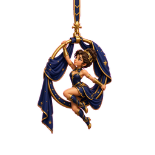

# German

<strong>Memory Palace 11: The German Alphabet</strong> · Character: (unassigned palace 11) · 1 beast · 1 atom

<em>1 beast · 1 Knowledge Atom</em>

#### Knowledge Atoms

### [Aq] [aquatic leech]

**Concept**
💡 Reharse the german alphabet depicted here: https://github.com/duducm2/scripts/blob/main/mnemonics/studies/german/portals/mnemonics-aquatic-leech.md

**Keywords**
_No keywords yet_

**Quote**
—

**Story**
—

#### Notes

_No notes._

#### Gallery

_No gallery images._

<strong>Memory Palace 10: Formants and Resonance</strong> · Character: (unassigned palace 10) · 5 beasts · 5 atoms

<em>5 beasts · 5 Knowledge Atoms</em>

#### Knowledge Atoms

### [Al] [alligator]

**Concept**
💡 A sound gets louder when the space around it boosts the vibration.

**Keywords**
_No keywords yet_

**Quote**
—

**Story**
—

### [Am] [amulet]

**Concept**
💡 The absolute base wave made by the source is the fundamental frequency.

**Keywords**
_No keywords yet_

**Quote**
—

**Story**
—

### [An] [angel]

**Concept**
💡 Resonance bundles multiply the base frequency to create speech formants.

**Keywords**
_No keywords yet_

**Quote**
—

**Story**
—

### [Ao] [aoudad]

**Concept**
💡 The fundamental pitch comes directly from the vocal folds buzzing.

**Keywords**
_No keywords yet_

**Quote**
—

**Story**
—

### [Ap] [ape]

**Concept**
💡 The throat shapes the first formant, the mouth shapes the second, and their interplay with the base sound forms the source-filter model.

**Keywords**
_No keywords yet_

**Quote**
—

**Story**
—

#### Notes

_No notes._

#### Gallery

_No gallery images._

<strong>Memory Palace 9: Simple and Complex Sound Foundations</strong> · Character: (unassigned palace 9) · 4 beasts · 4 atoms

<em>4 beasts · 4 Knowledge Atoms</em>

#### Knowledge Atoms

### [Ag] [Agaric fungi]

**Concept**
💡 Simple waves move evenly and repeat in a regular pattern.

**Keywords**
_No keywords yet_

**Quote**
—

**Story**
—

### [Ah] [Ah!—a sigh]

**Concept**
💡 Amplitude shows how far a wave moves away from its resting point.

**Keywords**
_No keywords yet_

**Quote**
—

**Story**
—

### [Ai] [Airedale terrier]

**Concept**
💡 Real sounds are usually made of messy, overlapping vibrations.

**Keywords**
_No keywords yet_

**Quote**
—

**Story**
—

### [Ak] [Akita (dog breed)]

**Concept**
💡 Vowel sounds are even and smooth, while consonants can be messy and irregular.

**Keywords**
_No keywords yet_

**Quote**
—

**Story**
—

#### Notes

_No notes._

#### Gallery

_No gallery images._

<strong>Memory Palace 8: The German R Variations</strong> · Character: (unassigned palace 8) · 3 beasts · 3 atoms

<em>3 beasts · 3 Knowledge Atoms</em>

#### Knowledge Atoms

### [Ad] adder

**Concept**
💡 The 'r' can vibrate far back in the throat as a flexible option.

**Keywords**
_No keywords yet_

**Quote**
“Uvular trill: Can be used as a free variant of the voiced uvular fricative.”

**Story**
On the next street, an adder snake slithers around freely. It meets a tall villain in black armor, who points to the deep back of his throat. The snake vibrates its tail far back on a throat model, sliding around as a free and flexible option.

### [Ae] aerialqist

**Concept**
💡 The 'r' can be a friction sound pushed more to the front.

**Keywords**
_No keywords yet_

**Quote**
“Voiced velar fricative: A more fronted variant.”

**Story**
An aerialist swings on a trapeze above the snake. She swings her body forward to reach the front part of the villain's throat model. She rubs the surface to make a smooth, vibrating friction sound that sits more to the front.

### [Af] Afghan hound

🟦 **Z1 · Additional notes (non-mnemonic)**

**Concept**
💡 Reharse the german alphabet depicted here:

**Keywords**
_No keywords yet_

**Quote**
—

**Story**
The main difference lies in **how air is obstructed** (manner of articulation) and **where it happens** (place of articulation).

#### Notes

_No notes._

#### Gallery

_No gallery images._

<strong>Memory Palace 7: Consonant Limits and Vowel Reductions</strong> · Character: (unassigned palace 7) · 5 beasts · 5 atoms

<em>5 beasts · 5 Knowledge Atoms</em>

#### Knowledge Atoms

### [Y] yak

**Concept**
💡 The /z/ sound never starts a word in Standard German.

**Keywords**
_No keywords yet_

**Quote**
—

**Story**
A yak stands at the corner of the street. It holds a large sign with the word Symbol [zʏmˈboːl]. It tries to make a buzzing sound at the very beginning, but a giant red "X" stops it. A spiky-haired martial artist steps in to help the yak, showing that the buzz cannot start the word. "The alveolar fricative /z/ never occurs word-initially in Standard German. A word like "symbol" is pronounced with a voiced alveolar fricative: Symbol." IPA: Symbol [zʏmˈboːl]

### [Z] Zeus

**Concept**
💡 The /ŋ/ sound only happens at the end of syllables.

**Keywords**
_No keywords yet_

**Quote**
“The velar nasal /ŋ/ only occurs at the end of syllables (syllable coda).”

**Story**
Zeus throws a lightning bolt at the yak's sign, breaking it into pieces. He grabs a singing block, representing the /ŋ/ sound, and forces it to sit at the absolute tail end of the broken piece. He yells at the yak that the sound is trapped at the end.

### [Aa] aardvark

**Concept**
💡 Long vowels get short when they are not stressed.

**Keywords**
_No keywords yet_

**Quote**
—

**Story**
An aardvark ignores Zeus and pulls on a long rubber band that says Moral [moˈʁaːl]. It pulls out another band that says Metan [meˈtaːn]. Because the aardvark is very relaxed and not stressed, it lets both bands snap back so they become very short. "Most long vowels can be shortened when they appear in an unstressed position (e.g., Moral, Metan)." IPA: Moral [moˈʁaːl], Metan [meˈtaːn]

### [Ab] Abyssinian cat

**Concept**
💡 The weak 'e' sound can be completely dropped.

**Keywords**
_No keywords yet_

**Quote**
—

**Story**
An Abyssinian cat plays with the aardvark's snapped bands. It finds a soft, weak letter 'e' in the word großem [ˈɡʁoːsəm]. The cat pushes the weak letter into a hole in the street, dropping it entirely so it vanishes. "In words like großem, the schwa can be dropped entirely." IPA: großem [ˈɡʁoːsəm]

### [Ac] acorn

**Concept**
💡 The 'r' can be rolled loudly in southern areas or in singing.

**Keywords**
_No keywords yet_

**Quote**
“Alveolar trill: Mostly used in southern dialects (Bavarian, Franconian) and in singing.”

**Story**
A giant acorn rolls out of the hole the cat made. It bounces fast on the front of a tongue model, rolling loudly. The acorn wears a southern alpine hat and sings a loud opera song to the cat and the yak.

#### Notes

_No notes._

#### Gallery

_No gallery images._

<strong>Memory Palace 6: Vowel Length Rules</strong> · Character: Wolfgang Amadeus Mozart · 2 beasts · 2 atoms

<em>2 beasts · 2 Knowledge Atoms</em>

#### Knowledge Atoms

### [W] Wombat

**Concept**
💡 Long vowels usually come before one or fewer consonants.

**Keywords**
_No keywords yet_

**Quote**
—

**Story**
—

### [X] Xena, warrior woman

**Concept**
💡 The letter 'h' acts as a vowel lengthener.

**Keywords**
_No keywords yet_

**Quote**
—

**Story**
—

#### Notes

_No notes._

#### Gallery

_No gallery images._

<strong>Memory Palace 5: Compound Stress and Consonants</strong> · Character: Harry Potter · 5 beasts · 5 atoms

<em>5 beasts · 5 Knowledge Atoms</em>

#### Knowledge Atoms

### [R] Rat

**Concept**
💡 Compound words keep their original stress patterns, but one primary stress dominates the whole word.

**Keywords**
_No keywords yet_

**Quote**
—

**Story**
—

### [S] Skull

**Concept**
💡 Voiced consonants harden into unvoiced sounds at the absolute end of a word.

**Keywords**
_No keywords yet_

**Quote**
—

**Story**
—

### [T] Toucan

**Concept**
💡 Word elements keep their strict pronunciation rules even when trapped inside compound words.

**Keywords**
_No keywords yet_

**Quote**
—

**Story**
—

### [U] Unicorn

**Concept**
💡 To pronounce a short vowel, move to the consonants early and hold them.

**Keywords**
_No keywords yet_

**Quote**
—

**Story**
—

### [V] Vulture

**Concept**
💡 Short vowels almost always come before two or more consonants.

**Keywords**
_No keywords yet_

**Quote**
—

**Story**
—

#### Notes

_No notes._

#### Gallery

_No gallery images._

<strong>Memory Palace 4: Drops and Fast Diphthongs</strong> · Character: (unassigned palace 4) · 4 beasts · 4 atoms

<em>4 beasts · 4 Knowledge Atoms</em>

#### Knowledge Atoms

### [N] Neanderthal

**Concept**
💡 The `[ʏ]` sound uses a slightly lower tongue position while keeping lips round.

**Keywords**
_No keywords yet_

**Quote**
—

**Story**
—

### [O] owl

**Concept**
💡 The unaccented `[ɐ]` sound is placed extremely close to the English `[ʌ]` vowel.

**Keywords**
_No keywords yet_

**Quote**
—

**Story**
—

### [P] panther

**Concept**
💡 Germans transition to the second vowel in a diphthong much faster than English speakers.

**Keywords**
_No keywords yet_

**Quote**
—

**Story**
—

### [Q] Quetzalcoatl

**Concept**
💡 For the `[ɔʏ̯]` sound, the lips must stay tight and rounded all the way to the end.

**Keywords**
_No keywords yet_

**Quote**
—

**Story**
—

#### Notes

_No notes._

#### Gallery

_No gallery images._

<strong>Memory Palace 3: Shifted Placements and Rounded Vowels</strong> · Character: Glossonauta · 5 beasts · 5 atoms

<em>5 beasts · 5 Knowledge Atoms</em>

#### Knowledge Atoms

### [I] imp

**Concept**
💡 The long `[aː]` sound pushes the tongue slightly closer to the front of the mouth.

**Keywords**
_No keywords yet_

**Quote**
—

**Story**
—

### [J] jester

**Concept**
💡 The `[yː]` sound takes a high front tongue position but rounds the lips.

**Keywords**
_No keywords yet_

**Quote**
—

**Story**
—

### [K] kitten

**Concept**
💡 The `[øː]` sound moves the tongue slightly down but keeps the lips round.

**Keywords**
_No keywords yet_

**Quote**
—

**Story**
—

### [L] lion

**Concept**
💡 The `[œ]` sound uses a mid-mouth tongue shape with rounded lips.

**Keywords**
_No keywords yet_

**Quote**
—

**Story**
—

### [M] marmoset

**Concept**
💡 The `[ɔ]` sound starts in the back-center of the mouth with round lips.

**Keywords**
_No keywords yet_

**Quote**
—

**Story**
—

#### Notes

_No notes._

#### Gallery

_No gallery images._

<strong>Memory Palace 2: Deep German Sounds</strong> · Character: Johann Sebastian Bach · 3 beasts · 3 atoms

<em>3 beasts · 3 Knowledge Atoms</em>

#### Knowledge Atoms

### [F] frog

**Concept**
💡 German [r] is made deep in the throat with the back of the tongue.

**Keywords**
_No keywords yet_

**Quote**
—

**Story**
—

### [G] goat

**Concept**
💡 The ach-laut [x] is a tight back-of-mouth air sound, like controlled choking air.

**Keywords**
_No keywords yet_

**Quote**
—

**Story**
—

### [H] Hydra

**Concept**
💡 The ich-laut [ç] is a hissing sound made farther forward from a y-like tongue position.

**Keywords**
_No keywords yet_

**Quote**
—

**Story**
—

#### Notes

_No notes._

#### Gallery

_No gallery images._

<strong>Memory Palace 1: Re-tuned Mouth Moves</strong> · Character: Ada Lovelace · 5 beasts · 5 atoms

<em>5 beasts · 5 Knowledge Atoms</em>

#### Knowledge Atoms

### [A] Arachne

**Concept**
💡 German l is lighter than English l.

**Keywords**
_No keywords yet_

**Quote**
—

**Story**
—

### [B] bird of paradise

**Concept**
💡 [ŋ] uses the back of the tongue and should not end with a hard g.

**Keywords**
_No keywords yet_

**Quote**
—

**Story**
—

### [C] cat

**Concept**
💡 [ʃ] in German pulls the tongue farther back for a sharper sch feel.

**Keywords**
_No keywords yet_

**Quote**
—

**Story**
—

### [D] dragon

**Concept**
💡 German uses glottal stops often before vowel-starting words.

**Keywords**
_No keywords yet_

**Quote**
—

**Story**
—

### [E] eagle

**Concept**
💡 Clusters join two consonants into one fast combined move.

**Keywords**
_No keywords yet_

**Quote**
—

**Story**
—

#### Notes

_No notes._

#### Gallery

_No gallery images._

