# German

<strong>Memory Palace 11: The German Alphabet</strong> · Character: (unassigned palace 11) · 1 beast · 1 atom

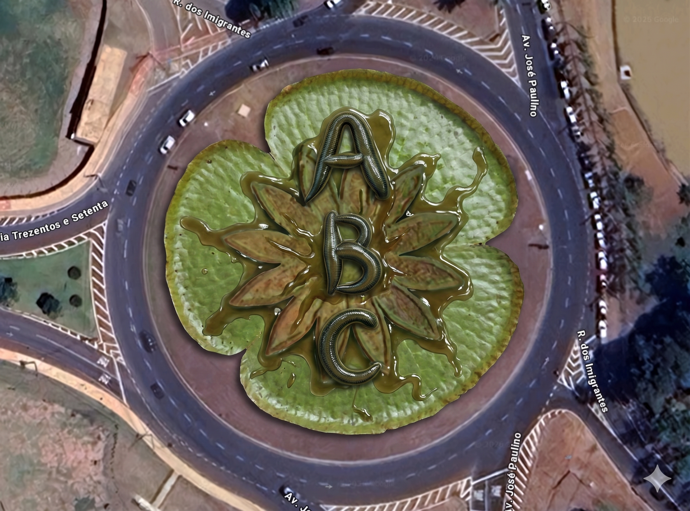

<em>1 beast · 1 Knowledge Atom</em>

#### Knowledge Atoms

### [Aq] [aquatic leech]

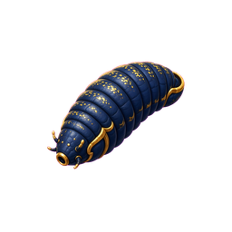

**Concept**
💡 Reharse the german alphabet depicted here: https://github.com/duducm2/scripts/blob/main/mnemonics/studies/german/portals/mnemonics-aquatic-leech.md

**Quote**
—

#### Notes

_No notes._

#### Gallery

_No gallery images._

<strong>Memory Palace 10: Formants and Resonance</strong> · Character: (unassigned palace 10) · 5 beasts · 5 atoms

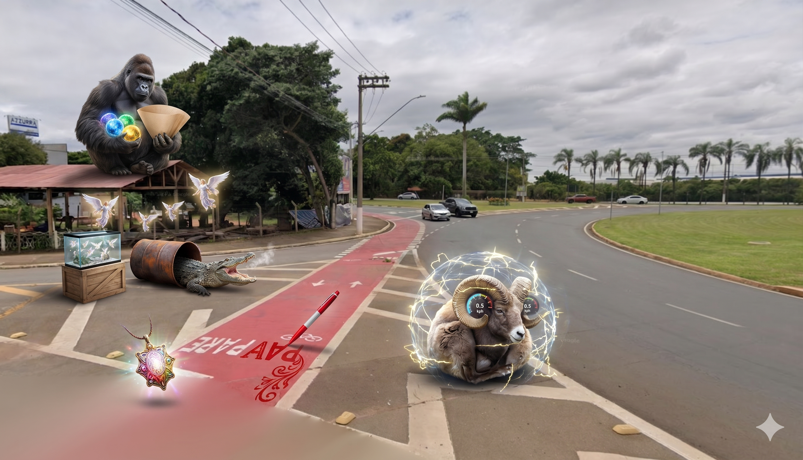

<em>5 beasts · 5 Knowledge Atoms</em>

#### Knowledge Atoms

### [Al] [alligator]

**Concept**
💡 A sound gets louder when the space around it boosts the vibration.

**Quote**
—

### [Am] [amulet]

**Concept**
💡 The absolute base wave made by the source is the fundamental frequency.

**Quote**
—

### [An] [angel]

**Concept**
💡 Resonance bundles multiply the base frequency to create speech formants.

**Quote**
—

### [Ao] [aoudad]

**Concept**
💡 The fundamental pitch comes directly from the vocal folds buzzing.

**Quote**
—

### [Ap] [ape]

**Concept**
💡 The throat shapes the first formant, the mouth shapes the second, and their interplay with the base sound forms the source-filter model.

**Quote**
—

#### Notes

_No notes._

#### Gallery

_No gallery images._

<strong>Memory Palace 9: Simple and Complex Sound Foundations</strong> · Character: (unassigned palace 9) · 4 beasts · 4 atoms

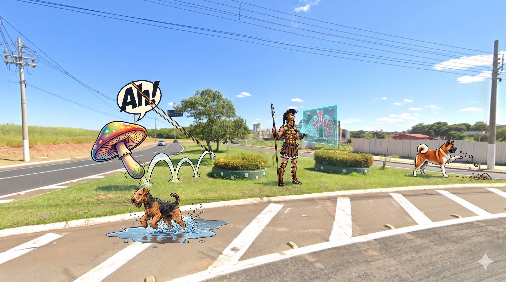

<em>4 beasts · 4 Knowledge Atoms</em>

#### Knowledge Atoms

### [Ag] [Agaric fungi]

**Concept**
💡 Simple waves move evenly and repeat in a regular pattern.

**Quote**
—

### [Ah] [Ah!—a sigh]

**Concept**
💡 Amplitude shows how far a wave moves away from its resting point.

**Quote**
—

### [Ai] [Airedale terrier]

**Concept**
💡 Real sounds are usually made of messy, overlapping vibrations.

**Quote**
—

### [Ak] [Akita (dog breed)]

**Concept**
💡 Vowel sounds are even and smooth, while consonants can be messy and irregular.

**Quote**
—

#### Notes

_No notes._

#### Gallery

_No gallery images._

<strong>Memory Palace 8: The German R Variations</strong> · Character: (unassigned palace 8) · 3 beasts · 3 atoms

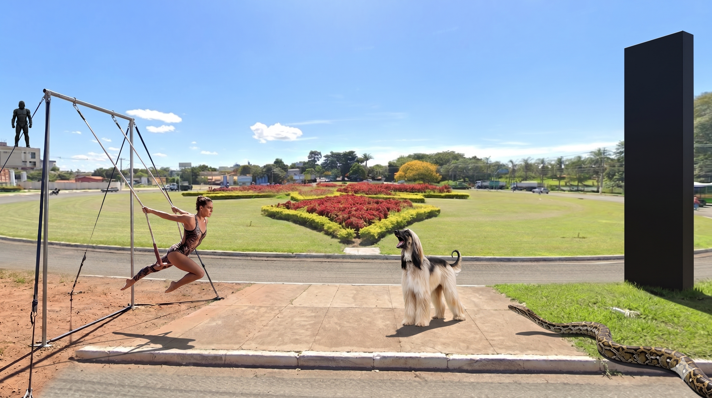

<em>3 beasts · 3 Knowledge Atoms</em>

#### Knowledge Atoms

### [Ad] adder

**Concept**
💡 The 'r' can vibrate far back in the throat as a flexible option.

**Quote**
“Uvular trill: Can be used as a free variant of the voiced uvular fricative.”

### [Ae] aerialqist

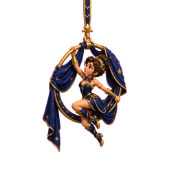

**Concept**
💡 The 'r' can be a friction sound pushed more to the front.

**Quote**
“Voiced velar fricative: A more fronted variant.”

### [Af] Afghan hound

🟦 **Z1 · Additional notes (non-mnemonic)**

**Concept**
💡 Reharse the german alphabet depicted here:

**Quote**
—

#### Notes

_No notes._

#### Gallery

_No gallery images._

<strong>Memory Palace 7: Consonant Limits and Vowel Reductions</strong> · Character: (unassigned palace 7) · 5 beasts · 5 atoms

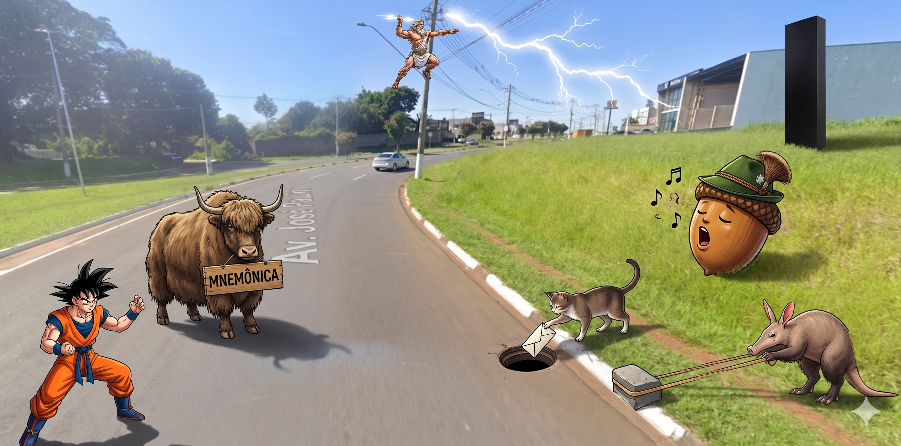

<em>5 beasts · 5 Knowledge Atoms</em>

#### Knowledge Atoms

### [Y] yak

**Concept**
💡 The /z/ sound never starts a word in Standard German.

**Quote**
—

### [Z] Zeus

**Concept**
💡 The /ŋ/ sound only happens at the end of syllables.

**Quote**
“The velar nasal /ŋ/ only occurs at the end of syllables (syllable coda).”

### [Aa] aardvark

**Concept**
💡 Long vowels get short when they are not stressed.

**Quote**
—

### [Ab] Abyssinian cat

**Concept**
💡 The weak 'e' sound can be completely dropped.

**Quote**
—

### [Ac] acorn

**Concept**
💡 The 'r' can be rolled loudly in southern areas or in singing.

**Quote**
“Alveolar trill: Mostly used in southern dialects (Bavarian, Franconian) and in singing.”

#### Notes

_No notes._

#### Gallery

_No gallery images._

<strong>Memory Palace 6: Vowel Length Rules</strong> · Character: Wolfgang Amadeus Mozart · 2 beasts · 2 atoms

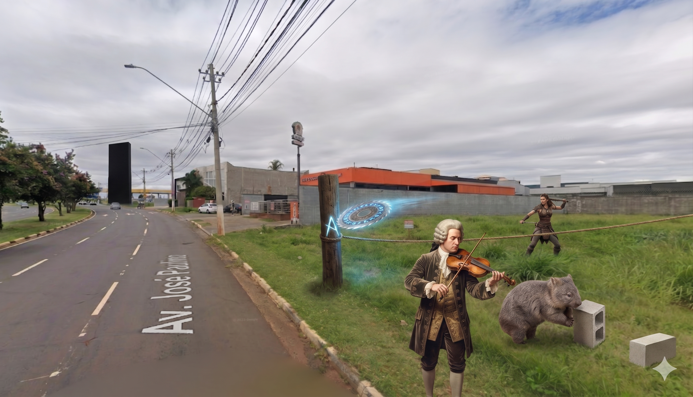

<em>2 beasts · 2 Knowledge Atoms</em>

#### Knowledge Atoms

### [W] Wombat

**Concept**
💡 Long vowels usually come before one or fewer consonants.

**Quote**
—

### [X] Xena, warrior woman

**Concept**
💡 The letter 'h' acts as a vowel lengthener.

**Quote**
—

#### Notes

_No notes._

#### Gallery

_No gallery images._

<strong>Memory Palace 5: Compound Stress and Consonants</strong> · Character: Harry Potter · 5 beasts · 5 atoms

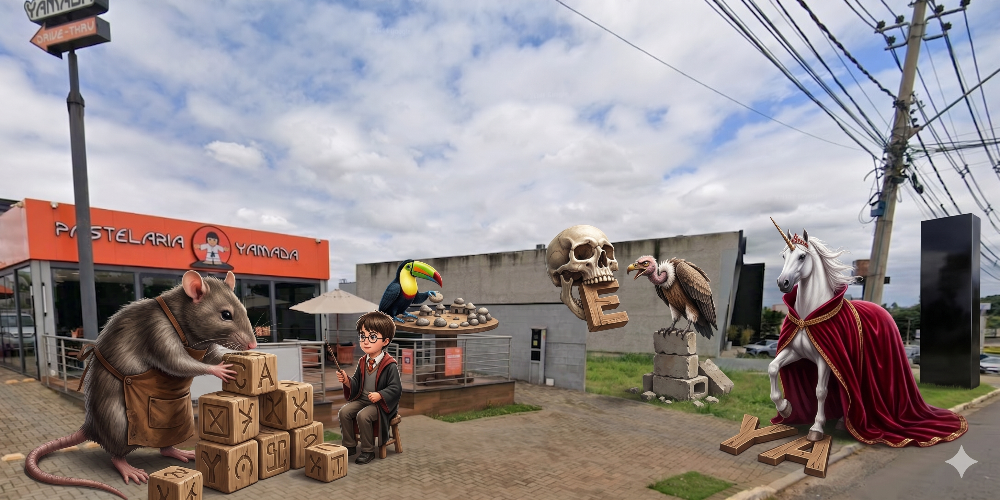

<em>5 beasts · 5 Knowledge Atoms</em>

#### Knowledge Atoms

### [R] Rat

**Concept**
💡 Compound words keep their original stress patterns, but one primary stress dominates the whole word.

**Quote**
—

### [S] Skull

**Concept**
💡 Voiced consonants harden into unvoiced sounds at the absolute end of a word.

**Quote**
—

### [T] Toucan

**Concept**
💡 Word elements keep their strict pronunciation rules even when trapped inside compound words.

**Quote**
—

### [U] Unicorn

**Concept**
💡 To pronounce a short vowel, move to the consonants early and hold them.

**Quote**
—

### [V] Vulture

**Concept**
💡 Short vowels almost always come before two or more consonants.

**Quote**
—

#### Notes

_No notes._

#### Gallery

_No gallery images._

<strong>Memory Palace 4: Drops and Fast Diphthongs</strong> · Character: (unassigned palace 4) · 4 beasts · 4 atoms

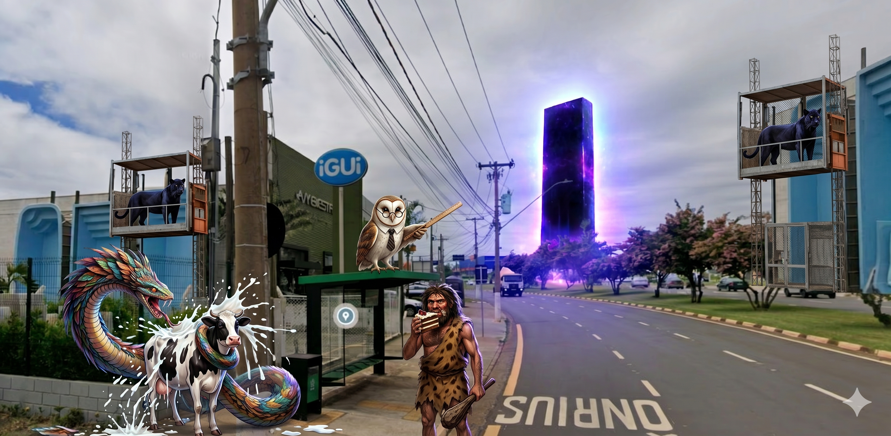

<em>4 beasts · 4 Knowledge Atoms</em>

#### Knowledge Atoms

### [N] Neanderthal

**Concept**
💡 The `[ʏ]` sound uses a slightly lower tongue position while keeping lips round.

**Quote**
—

### [O] owl

**Concept**
💡 The unaccented `[ɐ]` sound is placed extremely close to the English `[ʌ]` vowel.

**Quote**
—

### [P] panther

**Concept**
💡 Germans transition to the second vowel in a diphthong much faster than English speakers.

**Quote**
—

### [Q] Quetzalcoatl

**Concept**
💡 For the `[ɔʏ̯]` sound, the lips must stay tight and rounded all the way to the end.

**Quote**
—

#### Notes

_No notes._

#### Gallery

_No gallery images._

<strong>Memory Palace 3: Shifted Placements and Rounded Vowels</strong> · Character: Glossonauta · 5 beasts · 5 atoms

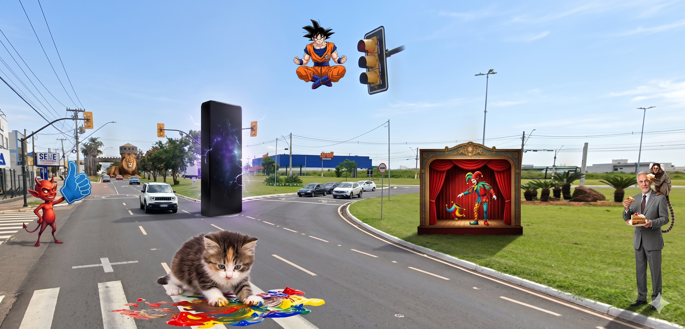

<em>5 beasts · 5 Knowledge Atoms</em>

#### Knowledge Atoms

### [I] imp

**Concept**
💡 The long `[aː]` sound pushes the tongue slightly closer to the front of the mouth.

**Quote**
—

### [J] jester

**Concept**
💡 The `[yː]` sound takes a high front tongue position but rounds the lips.

**Quote**
—

### [K] kitten

**Concept**
💡 The `[øː]` sound moves the tongue slightly down but keeps the lips round.

**Quote**
—

### [L] lion

**Concept**
💡 The `[œ]` sound uses a mid-mouth tongue shape with rounded lips.

**Quote**
—

### [M] marmoset

**Concept**
💡 The `[ɔ]` sound starts in the back-center of the mouth with round lips.

**Quote**
—

#### Notes

_No notes._

#### Gallery

_No gallery images._

<strong>Memory Palace 2: Deep German Sounds</strong> · Character: Johann Sebastian Bach · 3 beasts · 3 atoms

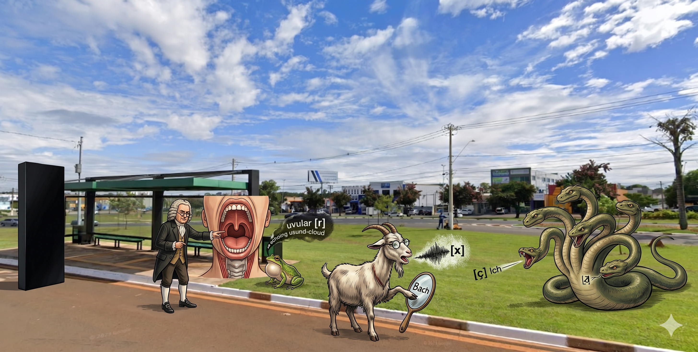

<em>3 beasts · 3 Knowledge Atoms</em>

#### Knowledge Atoms

### [F] frog

**Concept**
💡 German [r] is made deep in the throat with the back of the tongue.

**Quote**
—

### [G] goat

**Concept**
💡 The ach-laut [x] is a tight back-of-mouth air sound, like controlled choking air.

**Quote**
—

### [H] Hydra

**Concept**
💡 The ich-laut [ç] is a hissing sound made farther forward from a y-like tongue position.

**Quote**
—

#### Notes

_No notes._

#### Gallery

_No gallery images._

<strong>Memory Palace 1: Re-tuned Mouth Moves</strong> · Character: Ada Lovelace · 5 beasts · 5 atoms

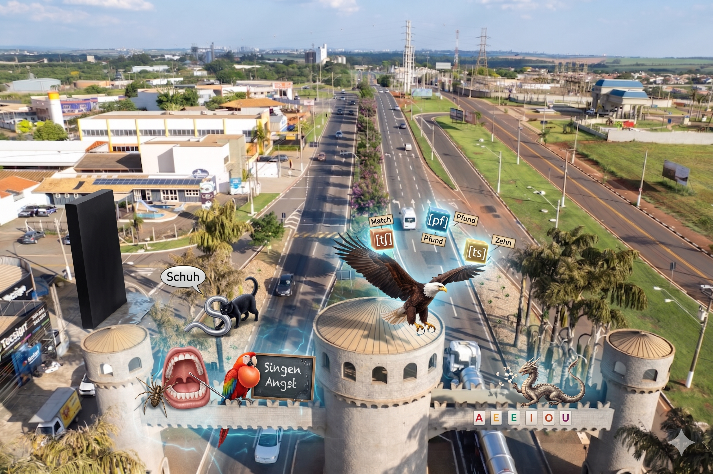

<em>5 beasts · 5 Knowledge Atoms</em>

#### Knowledge Atoms

### [A] Arachne

**Concept**
💡 German l is lighter than English l.

**Quote**
—

### [B] bird of paradise

**Concept**
💡 [ŋ] uses the back of the tongue and should not end with a hard g.

**Quote**
—

### [C] cat

**Concept**
💡 [ʃ] in German pulls the tongue farther back for a sharper sch feel.

**Quote**
—

### [D] dragon

**Concept**
💡 German uses glottal stops often before vowel-starting words.

**Quote**
—

### [E] eagle

**Concept**
💡 Clusters join two consonants into one fast combined move.

**Quote**
—

#### Notes

_No notes._

#### Gallery

_No gallery images._

