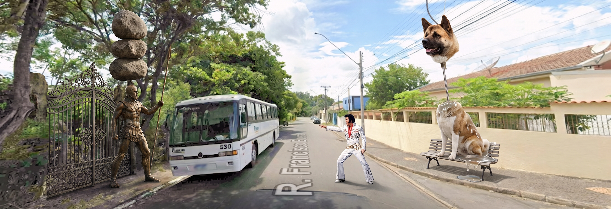
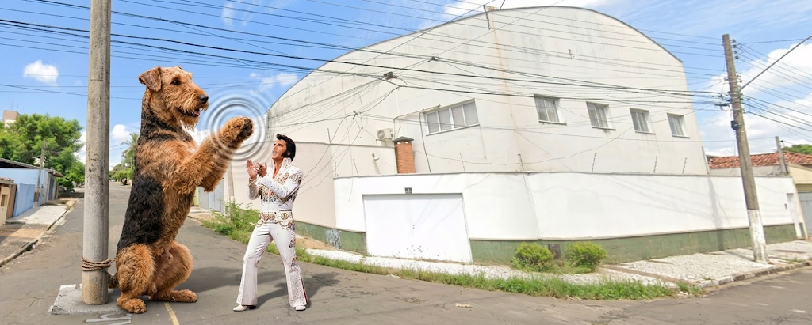
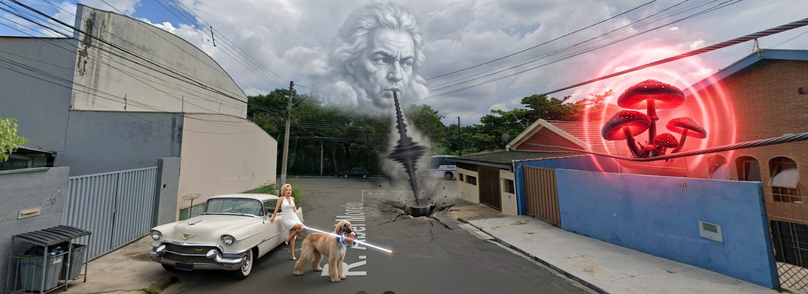
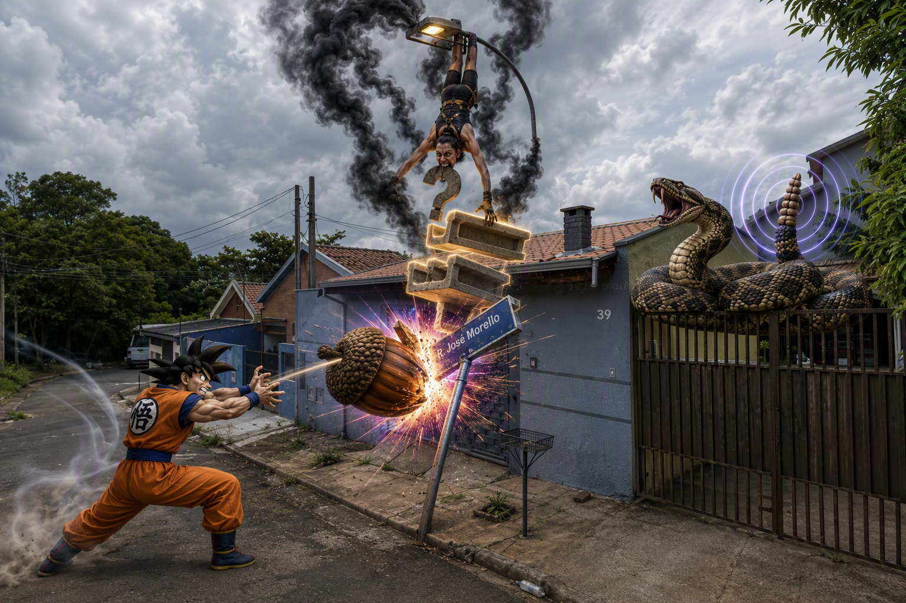
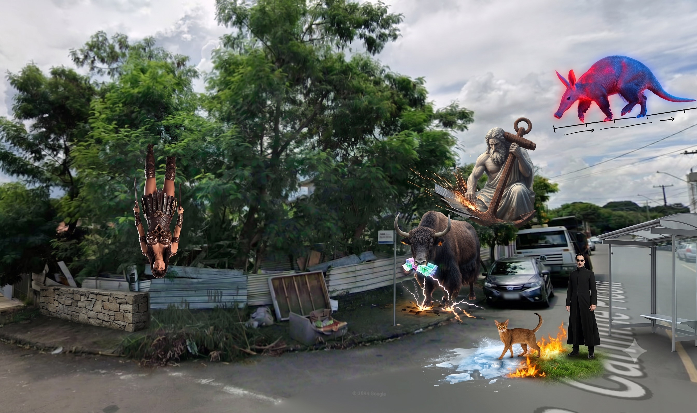
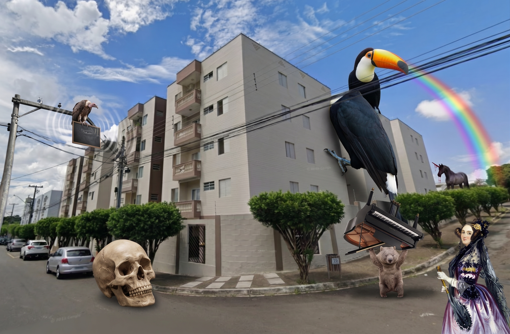
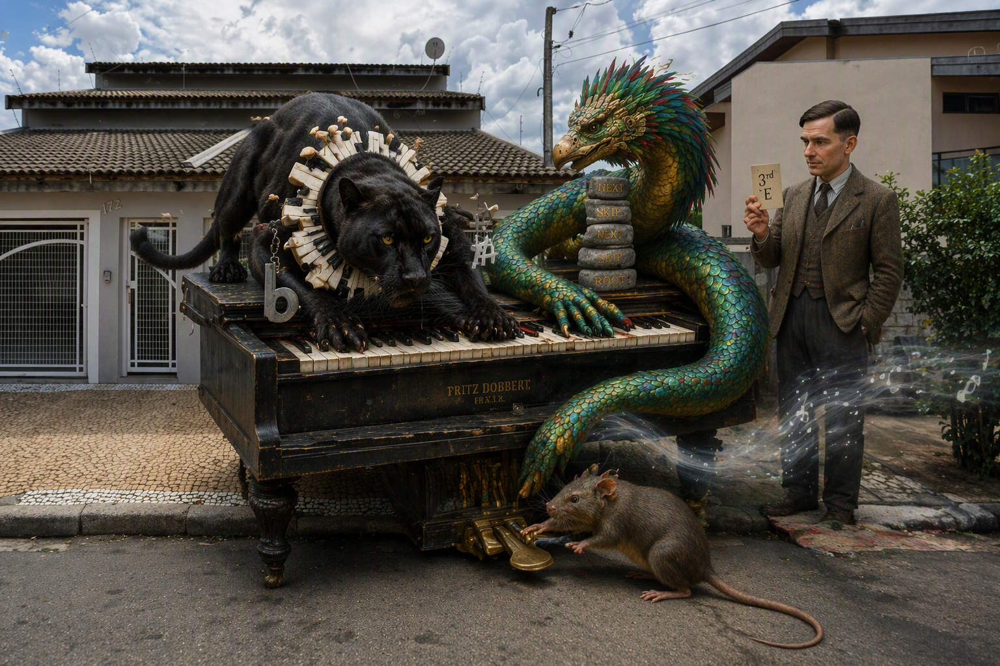
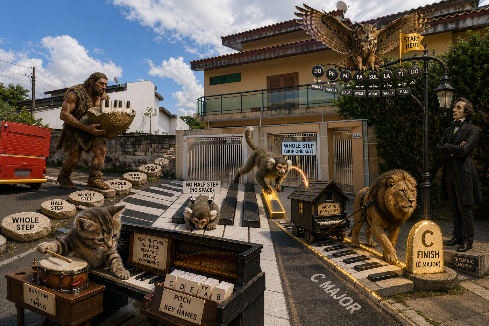
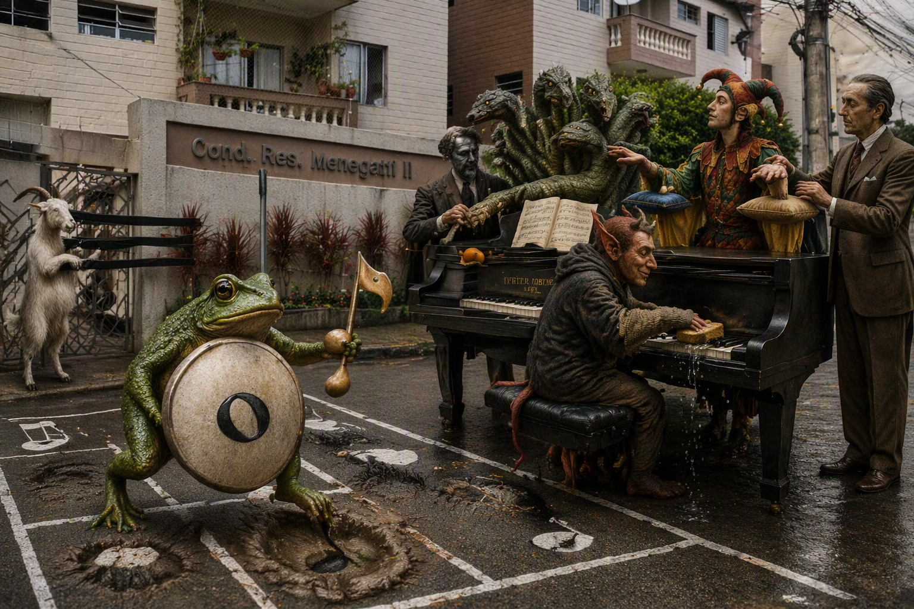
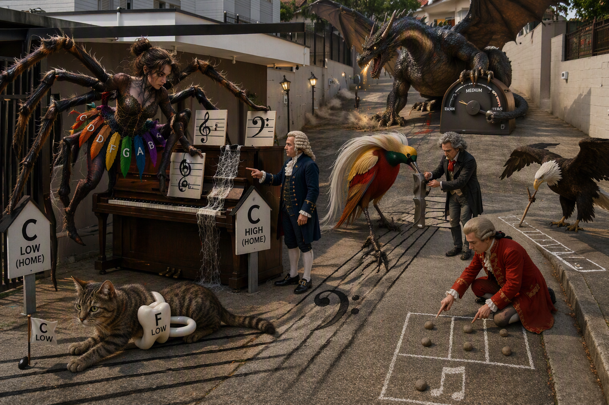

# Piano

_10 Memory Palaces · newest first_

---

## Memory Palace 10: Reading and Hand Posture

**Character:** Elvis Presley

_2 beasts · 2 Knowledge Atoms_

_No image prompt saved._

### Knowledge Atoms

🟧 **[Aj] Ajax**

💡 **Concept:** Stacked notes sharing a single stem mean the notes are played simultaneously.
**Quote:** these notes are lined up stacked with one stem can you guess what that might mean it means play the notes at the same time
**Story:** The towering Greek warrior Ajax slams his bronze shield into the pavement, splitting the street open. Elvis Presley points at him as Ajax perfectly balances three heavy boulders stacked vertically on a single spear stem, striking them all simultaneously with one sword swing so they explode into brilliant light.
**Sensory:** visual

🟧 **[Ak] Akita (dog breed)**

💡 **Concept:** Good posture involves sitting straight with the head lifted upward as if pulled by a string, while keeping the shoulders relaxed.
**Quote:** I'm imagining that my head is being almost lifted up by a little string someone's holding a hair on my head so I've got very good posture but at the same time my shoulders are relaxed
**Story:** An enormous Akita dog sits straight up on a street bench, its heavy head defying gravity by floating mid-air, suspended by a single, thin glowing string attached to one ear. Even as its snout pulls impossibly upward in perfect posture, its massive, furry shoulders completely melt downward into a puddle of relaxed jelly.
**Sensory:** visual

---

## Memory Palace 9: Note Symbols and Counting

**Character:** (unassigned palace 9)

_1 beasts · 1 Knowledge Atoms_

_No image prompt saved._

### Knowledge Atoms

🟧 **[Ai] Airedale terrier**

💡 **Concept:** Counting out loud and clapping physically reinforces the rhythm and prevents speed changes.
**Quote:** when we count in music we always count out loud this is so important um if we count in our heads we don't always notice if we stop counting or count a little slower or faster
**Story:** A colossal Airedale terrier claps its massive front paws together in a deafening rhythm while barking numbers out loud. The thunderous shockwaves physically push the surrounding street lamps into a perfect, steady line, preventing time itself from speeding up or slowing down.
**Sensory:** auditory

---

## Memory Palace 8: Reading Spaces and Resolution

**Character:** Marilyn Monroe

_3 beasts · 3 Knowledge Atoms_

_No image prompt saved._

### Knowledge Atoms

🟧 **[Af] Afghan hound**

💡 **Concept:** A line note has a staff line passing directly through its center, similar to a bead on a string.
**Quote:** we would call this one a line note because it has a line going through the middle of it just like a bead on a string going right through the middle of the bead
**Story:** Marilyn Monroe watches in awe as an Afghan hound bites down hard on a massive, glowing glass bead. Suddenly, a razor-sharp, vibrating piano string shoots straight through the center of the bead and the hound's snout, sliding frictionlessly back and forth without causing a single scratch.
**Sensory:** tactile

🟧 **[Ag] Agaric fungi**

💡 **Concept:** A space note is a musical note that rests entirely in the empty gap between two staff lines.
**Quote:** A space note sits completely between two staff lines without any line passing through it.
**Story:** Giant, glowing Agaric fungi sprout exclusively inside the floating gap between two thick metal power lines, hovering perfectly in the empty space. They forcefully expand until their caps form blindingly bright neon circles that fill the void without ever touching the wires above or below.
**Sensory:** visual

🟧 **[Ah] Ah!—a sigh**

💡 **Concept:** A cadence is a harmonic progression at the end of a musical phrase that provides a sense of resolution or punctuation.
**Quote:** A musical cadence is a progression of at least two chords that concludes a phrase, section, or piece of music.
**Story:** A massive, semi-transparent cloud shaped like a human face floats above the street piano and lets out a deafening, echoing sigh that physically shakes the ground. The heavy soundwave slams into the pavement like a giant iron period mark at the exact end of a painted path, bringing all the chaotic street noise to an instantly calm, resolved silence.
**Sensory:** auditory

---

## Memory Palace 7: Musical Structure

**Character:** (unassigned palace 7)

_3 beasts · 4 Knowledge Atoms_

_No image prompt saved._

### Knowledge Atoms

🟧 **[Ac] acorn**

💡 **Concept:** An accidental is a symbol that alters a note's pitch temporarily, such as sharps, flats, or naturals.
**Quote:** An accidental is a symbol in musical notation that temporarily alters the pitch of a note.
**Story:** Goku throws a giant, glowing acorn that crashes into a metal street sign, warping the pole. As it hits, the acorn splits open and projects blinding, physical neon letters into the air: "An accidental is a symbol in musical notation that temporarily alters the pitch of a note."
**Sensory:** visual

🟧 **[Ad] adder**

💡 **Concept:** A melody combines pitch and rhythm into a primary, cohesive musical line.
**Quote:** A melody is a linear succession of musical tones—combining pitch and rhythm—that the listener perceives as a single, cohesive entity.
**Story:** A colossal adder slithers along a wooden fence, hissing a rhythm so loud it shatters glass. The snake bites its own tail to form a perfect ring, shaking the ground as it rattles out the thunderous words: "A melody is a linear succession of musical tones—combining pitch and rhythm—that the listener perceives as a single, cohesive entity."
**Sensory:** auditory

**Z1 · Z1 Head | Phrase**

🟧 **[Ae] aerialist**

💡 **Concept:** she catches a heavy, rough-textured punctuation mark with her teeth, biting down hard to create a resting point · sensory: tactile ✋
**Quote:** A section is a larger, major structural block of a musical form (such as a verse, chorus, or bridge). A section is made up of multiple phrases combined together.
**Story:** An aerialist swings upside down from a streetlamp, leaving a thick trail of burnt ozone smoke in the air. With her head, she catches a heavy, rough-textured punctuation mark in her teeth, biting down to physically carve out the rule: "A phrase is a single musical thought or "sentence". It is the smallest structural unit that gives a sense of completion, typically ending with a musical resting point called a cadence." Simultaneously, with her forelimbs, she grabs huge, glowing concrete highway segments and stacks them together like children's blocks, projecting blinding neon words from her palms: "A section is a larger, major structural block of a musical form (such as a verse, chorus, or bridge). A section is made up of multiple phrases combined together."
**Sensory:** —

**Z2 · Z2 Forelimbs | Section**

🟧 **[Ae] aerialist**

💡 **Concept:** she stacks huge, glowing concrete highway segments together like children's blocks using her hands · sensory: visual 👁️
**Quote:** A section is a larger, major structural block of a musical form (such as a verse, chorus, or bridge). A section is made up of multiple phrases combined together.
**Story:** An aerialist swings upside down from a streetlamp, leaving a thick trail of burnt ozone smoke in the air. With her head, she catches a heavy, rough-textured punctuation mark in her teeth, biting down to physically carve out the rule: "A phrase is a single musical thought or "sentence". It is the smallest structural unit that gives a sense of completion, typically ending with a musical resting point called a cadence." Simultaneously, with her forelimbs, she grabs huge, glowing concrete highway segments and stacks them together like children's blocks, projecting blinding neon words from her palms: "A section is a larger, major structural block of a musical form (such as a verse, chorus, or bridge). A section is made up of multiple phrases combined together."
**Sensory:** —

---

## Memory Palace 6: Chord Positions and Harmony Basics

**Character:** (unassigned palace 6)

_5 beasts · 7 Knowledge Atoms_

_No image prompt saved._

### Knowledge Atoms

🟧 **[X] Xena, warrior woman**

💡 **Concept:** An inversion changes which note sits at the bottom of the chord.
**Quote:** an inversion just means that the note that's played at the very bottom is a different one of these notes
**Story:** Xena, warrior woman levitates high in the air and flips completely upside down, her heavy boots pressing against an invisible ceiling. From above, she shouts down to Neo on the street below: "an inversion just means that the note that's played at the very bottom is a different one of these notes".
**Sensory:** visual

**Z1 · Z1 Head | Harmony combination**

🟧 **[Y] yak**

💡 **Concept:** - Many notes came flying and gathered together a single note. That single note was growing in size, getting bigger and bigger, till it was so heavy that it fell onto the yaks head.
**Quote:** —
**Story:** - Many notes came flying and gathered together a single note. That single note was growing in size, getting bigger and bigger, till it was so heavy that it fell onto the yaks head.
**Sensory:** —

**Z2 · Z2 Forelimbs | Triad unit**

🟧 **[Y] yak**

💡 **Concept:** stamping three distinct lightning bolts into the pavement · sensory: tactile ✋
**Quote:** —
**Story:** stamping three distinct lightning bolts into the pavement · sensory: tactile ✋
**Sensory:** —

**Z1 · Z1 Head | Consonant rest**

🟧 **[Z] Zeus**

💡 **Concept:** resting his cheek heavily against a massive, calming iron ship anchor · sensory: tactile ✋
**Quote:** Composers use dissonance intentionally to create emotional tension, which typically drives the music forward
**Story:** Zeus rests his cheek heavily against a massive iron ship anchor that instantly smooths the rough pavement into calm glass, sighing: "Consonant chords provide a sense of rest and anchor the musical piece." Suddenly, he grips two pieces of sheet metal with his hands and violently scratches them together, shooting burning, loud sparks while roaring: "Composers use dissonance intentionally to create emotional tension, which typically drives the music forward".
**Sensory:** —

**Z2 · Z2 Forelimbs | Dissonant tension**

🟧 **[Z] Zeus**

💡 **Concept:** violently scratching sheet metal to shoot burning sparks · sensory: auditory 👂
**Quote:** Composers use dissonance intentionally to create emotional tension, which typically drives the music forward
**Story:** Zeus rests his cheek heavily against a massive iron ship anchor that instantly smooths the rough pavement into calm glass, sighing: "Consonant chords provide a sense of rest and anchor the musical piece." Suddenly, he grips two pieces of sheet metal with his hands and violently scratches them together, shooting burning, loud sparks while roaring: "Composers use dissonance intentionally to create emotional tension, which typically drives the music forward".
**Sensory:** —

🟧 **[Aa] aardvark**

💡 **Concept:** A chord progression is a sequence of chords that dictates the emotional arc and key of a song.
**Quote:** A chord progression is a specific sequence of chords played over time. This movement dictates the emotional arc of a song
**Story:** A colossal aardvark hops along a drawn timeline on the road while Neo tracks its path. With each heavy hop, the aardvark's fur shifts colors entirely from sad blue to angry red, echoing: "A chord progression is a specific sequence of chords played over time. This movement dictates the emotional arc of a song".
**Sensory:** visual

🟧 **[Ab] Abyssinian cat**

💡 **Concept:** Harmony provides the underlying context that can completely change the emotional feeling of the same melody.
**Quote:** The exact same melody line can sound joyful, melancholic, or suspenseful depending entirely on the underlying harmony.
**Story:** An Abyssinian cat creeps low under a glowing melody wire and transforms the literal street beneath its paws into freezing ice, then scorching fire, then soft grass. As the tactile environment shifts wildly, the cat hisses: "The exact same melody line can sound joyful, melancholic, or suspenseful depending entirely on the underlying harmony."
**Sensory:** tactile

---

## Memory Palace 5: Chord Construction and Types

**Character:** Ada Lovelace

_5 beasts · 5 Knowledge Atoms_

_No image prompt saved._

### Knowledge Atoms

🟧 **[S] skull**

💡 **Concept:** Chords are constructed by skipping keys between the notes you play.
**Quote:** for whatever note you start on the next notes that follow will skip over keys
**Story:** A giant floating skull rolls along the street, explicitly skipping over every other painted sidewalk square. With a deafening jaw-clack, it blasts the exact rule into the air as bright neon letters: "for whatever note you start on the next notes that follow will skip over keys".
**Sensory:** visual

🟧 **[T] toucan**

💡 **Concept:** Primary chords (I, IV, V) produce a cheerful, major sound.
**Quote:** they all have a cheerful sound they all sound what we call major
**Story:** A skyscraper-sized toucan flaps its wings to project a blindingly bright rainbow over the buildings. As the light flashes, the toucan squawks the exact explanation into the sky: "they all have a cheerful sound they all sound what we call major".
**Sensory:** visual

🟧 **[U] unicorn**

💡 **Concept:** Secondary chords (ii, iii, vi) produce a darker, minor sound in major keys.
**Quote:** these three red chords which i have written are called the secondary chords and when we play secondary chords in major keys they always have a minor sound
**Story:** A shadowy unicorn bleeds thick red ink from its horn onto the pavement to draw three dark circles. It whispers the chilling words that physically freeze the air around it: "these three red chords which i have written are called the secondary chords and when we play secondary chords in major keys they always have a minor sound".
**Sensory:** tactile

🟧 **[V] vulture**

💡 **Concept:** Diminished chords have an edgy, dissonant sound because they skip fewer keys.
**Quote:** this one is called diminished so when you play a diminished chord it has um it has more of a dissonant sound
**Story:** A vulture violently scratches a chalkboard wall on the street with its talons, letting out an ear-piercing screech. The screech shapes itself into grating, visible soundwaves that say: "this one is called diminished so when you play a diminished chord it has um it has more of a dissonant sound".
**Sensory:** auditory

🟧 **[W] wombat**

💡 **Concept:** A chord is in root position when the root note is on the very bottom.
**Quote:** they're in root position if we have the root letter on the bottom
**Story:** A super-strong wombat lifts a heavy piano completely upside down with one paw while Ada Lovelace watches in awe. It jams its claws into the lowest wooden board to carve the rule deeply into the wood: "they're in root position if we have the root letter on the bottom".
**Sensory:** tactile

---

## Memory Palace 4: Key Choice, Chords, and Pedal

**Character:** Alan Turing

_3 beasts · 6 Knowledge Atoms_

_No image prompt saved._

### Knowledge Atoms

**Z1 · C major white keys**

🟧 **[P] panther**

💡 **Concept:** The panther wears white mushrooms growing only along its white-key collar.
**Quote:** Accidental that raises a note by one half step.
**Story:** A panther crouches across the street piano with white mushrooms growing only along a white-key collar, while the black keys stay bare like dark rocks. On one side, it carries a drooping key charm pushed gently down and left, showing a flat lowering the note by one half step. On the other side, it carries a bright spike charm that lifts a key upward and right, showing a sharp raising the note by one half step.
**Sensory:** —

**Z2 · Flat lowers**

🟧 **[P] panther**

💡 **Concept:** The panther carries a drooping key charm pushed down and left.
**Quote:** Accidental that raises a note by one half step.
**Story:** A panther crouches across the street piano with white mushrooms growing only along a white-key collar, while the black keys stay bare like dark rocks. On one side, it carries a drooping key charm pushed gently down and left, showing a flat lowering the note by one half step. On the other side, it carries a bright spike charm that lifts a key upward and right, showing a sharp raising the note by one half step.
**Sensory:** —

**Z3 · Sharp raises**

🟧 **[P] panther**

💡 **Concept:** The panther carries a bright spike charm lifting a key upward and right.
**Quote:** Accidental that raises a note by one half step.
**Story:** A panther crouches across the street piano with white mushrooms growing only along a white-key collar, while the black keys stay bare like dark rocks. On one side, it carries a drooping key charm pushed gently down and left, showing a flat lowering the note by one half step. On the other side, it carries a bright spike charm that lifts a key upward and right, showing a sharp raising the note by one half step.
**Sensory:** —

**Z1 · Chord**

🟧 **[Q] Quetzalcoatl**

💡 **Concept:** Quetzalcoatl presses two piano keys at the same time with a wide coiled body.
**Quote:** A three-note chord built from a root note with alternating scale tones above it.
**Story:** Quetzalcoatl coils around the piano while Alan Turing stands nearby holding a third key card. With a wide part of its body, Quetzalcoatl presses two keys at the same time so more than one sound becomes harmony. Then it stacks three piano stones into a simple tower: root, skip one, next, skip one, next.
**Sensory:** —

**Z2 · Triad**

🟧 **[Q] Quetzalcoatl**

💡 **Concept:** Quetzalcoatl stacks three piano stones labeled by position: root, skip, next, skip, next.
**Quote:** A three-note chord built from a root note with alternating scale tones above it.
**Story:** Quetzalcoatl coils around the piano while Alan Turing stands nearby holding a third key card. With a wide part of its body, Quetzalcoatl presses two keys at the same time so more than one sound becomes harmony. Then it stacks three piano stones into a simple tower: root, skip one, next, skip one, next.
**Sensory:** —

🟧 **[R] rat**

💡 **Concept:** The damper pedal keeps notes ringing after the keys are released.
**Quote:** Pedal that sustains notes after the keys are released.
**Story:** A rat presses the piano pedal with its heavy tail. The keys are let go, but the sound keeps floating over the street like mist.
**Sensory:** —

---

## Memory Palace 3: Practice Structure and Scale Steps

**Character:** Frédéric Chopin

_5 beasts · 8 Knowledge Atoms_

_No image prompt saved._

### Knowledge Atoms

🟧 **[K] kitten**

💡 **Concept:** Practice rhythm and pitch apart before putting them together.
**Quote:** Practice timing and note locations independently before combining them.
**Story:** A kitten divides the street piano into two clear work tables. One table holds a drum for rhythm and timing. The other table holds note cards for pitch and key names. Only after both tables are clear can rhythm and pitch come together.
**Sensory:** —

**Z1 · Tonic home note**

🟧 **[L] lion**

💡 **Concept:** The lion pulls a tiny piano house to one note and parks there.
**Quote:** Finish C-major exercises on C to reinforce tonal resolution.
**Story:** A lion pulls a tiny piano house along the street and parks it on one note, making that note feel like home. Beside the house, Erik Satie walks a short C-major path and stops at a bright C finish stone. The whole road feels settled when the path ends on C.
**Sensory:** —

**Z2 · C-major resolution**

🟧 **[L] lion**

💡 **Concept:** The lion places a bright C finish stone at the end of a C-major path.
**Quote:** Finish C-major exercises on C to reinforce tonal resolution.
**Story:** A lion pulls a tiny piano house along the street and parks it on one note, making that note feel like home. Beside the house, Erik Satie walks a short C-major path and stops at a bright C finish stone. The whole road feels settled when the path ends on C.
**Sensory:** —

**Z1 · Half step**

🟧 **[M] marmoset**

💡 **Concept:** The marmoset squeezes between two side-by-side piano keys with no space between them.
**Quote:** A distance equal to two half steps.
**Story:** A marmoset crouches between two side-by-side piano keys and finds no space at all, its nose bumping both keys at once. Then it springs away and leaps over exactly one glowing middle key before landing on the next key. The tight squeeze shows the half step, and the one-key leap shows the whole step.
**Sensory:** —

**Z2 · Whole step**

🟧 **[M] marmoset**

💡 **Concept:** The marmoset leaps over exactly one glowing skipped key and lands on the next key.
**Quote:** A distance equal to two half steps.
**Story:** A marmoset crouches between two side-by-side piano keys and finds no space at all, its nose bumping both keys at once. Then it springs away and leaps over exactly one glowing middle key before landing on the next key. The tight squeeze shows the half step, and the one-key leap shows the whole step.
**Sensory:** —

**Z1 · Pentascale**

🟧 **[N] Neanderthal**

💡 **Concept:** The Neanderthal carries a cracked acorn with five tiny piano keys growing from it.
**Quote:** —
**Story:** The Neanderthal carries a cracked acorn with five tiny piano keys growing from it.
**Sensory:** —

**Z1 · Major scale sound**

🟧 **[O] owl**

💡 **Concept:** The owl lands on eight sung step markers that rise and fall like do-re-mi.
**Quote:** Any note can be the tonic of a major scale when the correct interval formula is applied.
**Story:** An owl spreads its wings above the street piano and lands on eight sung step markers while Frédéric Chopin watches the familiar rise and fall. The owl then moves a golden start flag from a white key to a black key. Each time, the same gap path appears under its claws, showing that any note can begin the major scale if the pattern is correct.
**Sensory:** —

**Z2 · Any starting key**

🟧 **[O] owl**

💡 **Concept:** The owl carries a golden start flag that moves between black and white keys while the same gap path appears.
**Quote:** Any note can be the tonic of a major scale when the correct interval formula is applied.
**Story:** An owl spreads its wings above the street piano and lands on eight sung step markers while Frédéric Chopin watches the familiar rise and fall. The owl then moves a golden start flag from a white key to a black key. Each time, the same gap path appears under its claws, showing that any note can begin the major scale if the pattern is correct.
**Sensory:** —

---

## Memory Palace 2: Note Values and Relaxed Hand

**Character:** Claude Debussy

_5 beasts · 11 Knowledge Atoms_

_No image prompt saved._

### Knowledge Atoms

**Z1 · Whole note**

🟧 **[F] frog**

💡 **Concept:** The frog holds one big hollow note shield while four drum hits shake the street.
**Quote:** Note lasting one beat in common time.
**Story:** A frog stands inside a painted measure grid. First, it lifts a big hollow note like a round shield, and four heavy drum hits shake the street before the shield lowers. Then it carries a note with a stem and takes exactly two steps across the measure. Finally, it presses one black note shape into wet clay as a single loud footstep lands, and the note is done.
**Sensory:** —

**Z2 · Half note**

🟧 **[F] frog**

💡 **Concept:** The frog carries a note with a stem and takes exactly two steps.
**Quote:** Note lasting one beat in common time.
**Story:** A frog stands inside a painted measure grid. First, it lifts a big hollow note like a round shield, and four heavy drum hits shake the street before the shield lowers. Then it carries a note with a stem and takes exactly two steps across the measure. Finally, it presses one black note shape into wet clay as a single loud footstep lands, and the note is done.
**Sensory:** —

**Z3 · Quarter note**

🟧 **[F] frog**

💡 **Concept:** The frog presses one black note shape into wet clay with one loud footstep.
**Quote:** Note lasting one beat in common time.
**Story:** A frog stands inside a painted measure grid. First, it lifts a big hollow note like a round shield, and four heavy drum hits shake the street before the shield lowers. Then it carries a note with a stem and takes exactly two steps across the measure. Finally, it presses one black note shape into wet clay as a single loud footstep lands, and the note is done.
**Sensory:** —

🟧 **[G] goat**

💡 **Concept:** A double bar line marks the end of a part or piece.
**Quote:** Symbol used to mark the end of a section or piece of music.
**Story:** A goat drops two thick black bars across the street staff. Every sound stops at those bars, like a gate closing at the end.
**Sensory:** —

**Z1 · Rounded fingers**

🟧 **[H] Hydra**

💡 **Concept:** The Hydra balances a small orange under its softly arched playing hand.
**Quote:** Keep the thumb relaxed and naturally positioned.
**Story:** A Hydra places one playing hand over the piano keys while Claude Debussy watches the hand shape. A small orange under the hand keeps the fingers naturally rounded and prevents collapse. Each glowing fingertip pad presses the keys like a cushion, not a claw. Beside the hand, a tiny thumb-shaped pillow rests loosely, reminding the thumb not to push or grip.
**Sensory:** —

**Z2 · Fingertip pads**

🟧 **[H] Hydra**

💡 **Concept:** Its glowing soft fingertip pads press the keys instead of sharp claws.
**Quote:** Keep the thumb relaxed and naturally positioned.
**Story:** A Hydra places one playing hand over the piano keys while Claude Debussy watches the hand shape. A small orange under the hand keeps the fingers naturally rounded and prevents collapse. Each glowing fingertip pad presses the keys like a cushion, not a claw. Beside the hand, a tiny thumb-shaped pillow rests loosely, reminding the thumb not to push or grip.
**Sensory:** —

**Z3 · Loose thumb**

🟧 **[H] Hydra**

💡 **Concept:** A tiny thumb-shaped pillow rests beside the Hydra’s relaxed hand.
**Quote:** Keep the thumb relaxed and naturally positioned.
**Story:** A Hydra places one playing hand over the piano keys while Claude Debussy watches the hand shape. A small orange under the hand keeps the fingers naturally rounded and prevents collapse. Each glowing fingertip pad presses the keys like a cushion, not a claw. Beside the hand, a tiny thumb-shaped pillow rests loosely, reminding the thumb not to push or grip.
**Sensory:** —

**Z1 · Gentle arm weight**

🟧 **[I] imp**

💡 **Concept:** The imp lowers a wet sponge onto a piano key so water slowly squeezes out.
**Quote:** Transfer the arm's weight efficiently into the fingertips.
**Story:** An imp sits at the street piano wearing a heavy cloth sleeve that hangs from shoulder to fingertip. The sleeve shows the arm’s weight flowing down into the key while the finger stays calm. With the same hand, the imp lowers a wet sponge onto a piano key so water slowly squeezes out without any sharp stab.
**Sensory:** —

**Z2 · Weight transfer**

🟧 **[I] imp**

💡 **Concept:** The imp wears a heavy cloth sleeve from shoulder to fingertip, letting weight flow into the key.
**Quote:** Transfer the arm's weight efficiently into the fingertips.
**Story:** An imp sits at the street piano wearing a heavy cloth sleeve that hangs from shoulder to fingertip. The sleeve shows the arm’s weight flowing down into the key while the finger stays calm. With the same hand, the imp lowers a wet sponge onto a piano key so water slowly squeezes out without any sharp stab.
**Sensory:** —

**Z1 · Raised flexible wrists**

🟧 **[J] jester**

💡 **Concept:** The jester balances soft cushions under lifted wrists above the keys.
**Quote:** Allow the elbows to remain slightly away from the body.
**Story:** A jester sits at the piano while Maurice Ravel places soft cushions under the jester’s wrists. The wrists stay slightly raised and flexible, not stiff. The jester also opens wing-like sleeves a little away from the body, leaving visible space at both elbows instead of clamping them inward.
**Sensory:** —

**Z2 · Elbows away**

🟧 **[J] jester**

💡 **Concept:** The jester opens wing-like sleeves slightly away from the body.
**Quote:** Allow the elbows to remain slightly away from the body.
**Story:** A jester sits at the piano while Maurice Ravel places soft cushions under the jester’s wrists. The wrists stay slightly raised and flexible, not stiff. The jester also opens wing-like sleeves a little away from the body, leaving visible space at both elbows instead of clamping them inward.
**Sensory:** —

---

## Memory Palace 1: Keyboard Map and Reading System

**Character:** Wolfgang Amadeus Mozart

_5 beasts · 11 Knowledge Atoms_

_No image prompt saved._

### Knowledge Atoms

**Z1 · Middle C home marker**

🟧 **[A] Arachne**

💡 **Concept:** A thick white web wraps the middle C key between high and low staff signs.
**Quote:** The distance between one note and the next note with the same name.
**Story:** Arachne sits at a street piano as Johann Sebastian Bach points to one wrapped middle key. Her thick white web ties that key upward to a high staff sign and downward to a low staff sign. Around her waist, seven bright feathers circle in the order C D E F G A B and then loop back to C. With her long legs, she leaps from one C-key house to the next C-key house, showing the same note name in a farther place.
**Sensory:** —

**Z2 · Repeating note names**

🟧 **[A] Arachne**

💡 **Concept:** Seven bright feathers form a C D E F G A B loop across the piano keys.
**Quote:** The distance between one note and the next note with the same name.
**Story:** Arachne sits at a street piano as Johann Sebastian Bach points to one wrapped middle key. Her thick white web ties that key upward to a high staff sign and downward to a low staff sign. Around her waist, seven bright feathers circle in the order C D E F G A B and then loop back to C. With her long legs, she leaps from one C-key house to the next C-key house, showing the same note name in a farther place.
**Sensory:** —

**Z3 · Octave jump**

🟧 **[A] Arachne**

💡 **Concept:** Arachne springs from one C-key house to the next C-key house with the same letter farther away.
**Quote:** The distance between one note and the next note with the same name.
**Story:** Arachne sits at a street piano as Johann Sebastian Bach points to one wrapped middle key. Her thick white web ties that key upward to a high staff sign and downward to a low staff sign. Around her waist, seven bright feathers circle in the order C D E F G A B and then loop back to C. With her long legs, she leaps from one C-key house to the next C-key house, showing the same note name in a farther place.
**Sensory:** —

**Z1 · Five-line staff**

🟧 **[B] bird of paradise**

💡 **Concept:** The bird scratches five long black staff lines across the road.
**Quote:** Combination of treble and bass staves connected by a brace.
**Story:** The bird of paradise lands beside the piano and drags one claw across the street, scratching five long black lines like a music page laid flat on the road. Its wings fold into a huge bass clef shape that sinks low on the staff. Ludwig van Beethoven locks a metal brace from the bird’s beak around two staffs, joining treble and bass into one bigger reading system.
**Sensory:** —

**Z2 · Bass clef low notes**

🟧 **[B] bird of paradise**

💡 **Concept:** Its folded wings form a heavy bass clef shape low on the lines.
**Quote:** Combination of treble and bass staves connected by a brace.
**Story:** The bird of paradise lands beside the piano and drags one claw across the street, scratching five long black lines like a music page laid flat on the road. Its wings fold into a huge bass clef shape that sinks low on the staff. Ludwig van Beethoven locks a metal brace from the bird’s beak around two staffs, joining treble and bass into one bigger reading system.
**Sensory:** —

**Z3 · Grand staff brace**

🟧 **[B] bird of paradise**

💡 **Concept:** A large metal brace hangs from its beak, joining two music staffs into one system.
**Quote:** Combination of treble and bass staves connected by a brace.
**Story:** The bird of paradise lands beside the piano and drags one claw across the street, scratching five long black lines like a music page laid flat on the road. Its wings fold into a huge bass clef shape that sinks low on the staff. Ludwig van Beethoven locks a metal brace from the bird’s beak around two staffs, joining treble and bass into one bigger reading system.
**Sensory:** —

**Z1 · Bass C landmark**

🟧 **[C] cat**

💡 **Concept:** The cat carries a small flag planted on a low C key.
**Quote:** F note landmark used for reading notes in the bass clef.
**Story:** A cat walks low across the bass staff with two clear landmarks attached to its body. On one side, it plants a small flag on a painted C key, saying without words, “Find me first when reading low notes.” On the other side, it wears a harmless tooth-shaped ring around a low F key, making F feel like a second easy street marker instead of a random note.
**Sensory:** —

**Z2 · Bass F landmark**

🟧 **[C] cat**

💡 **Concept:** The cat wears a soft tooth-shaped ring gently locked around a low F key.
**Quote:** F note landmark used for reading notes in the bass clef.
**Story:** A cat walks low across the bass staff with two clear landmarks attached to its body. On one side, it plants a small flag on a painted C key, saying without words, “Find me first when reading low notes.” On the other side, it wears a harmless tooth-shaped ring around a low F key, making F feel like a second easy street marker instead of a random note.
**Sensory:** —

**Z1 · Steady beat**

🟧 **[D] dragon**

💡 **Concept:** The dragon stamps one claw on the road again and again while street lamps blink with each pulse.
**Quote:** The speed at which the beat is played.
**Story:** A dragon stands over the street piano and stamps one claw on the road in a steady pulse. Each stamp makes the street lamps blink like a heart inside the music. With its other claw, the dragon turns a speed dial: when the dial rises, the stamps come faster; when it falls, the stamps slow into heavy steps.
**Sensory:** —

**Z2 · Tempo speed**

🟧 **[D] dragon**

💡 **Concept:** The dragon turns a speed dial beside the piano, making the pulse faster or slower.
**Quote:** The speed at which the beat is played.
**Story:** A dragon stands over the street piano and stamps one claw on the road in a steady pulse. Each stamp makes the street lamps blink like a heart inside the music. With its other claw, the dragon turns a speed dial: when the dial rises, the stamps come faster; when it falls, the stamps slow into heavy steps.
**Sensory:** —

🟧 **[E] eagle**

💡 **Concept:** A time signature tells how beats fit inside each measure.
**Quote:** Notation that indicates how many beats are in each measure and which note value receives the beat.
**Story:** An eagle draws small boxes on the road like measures. Wolfgang Amadeus Mozart drops beat stones into each box and points to the note shape that gets one beat. The boxes show how many beats belong inside each measure and which note value receives the beat.
**Sensory:** —

---
