# Piano

<strong>Memory Palace 11: Clefs and Note Placement</strong> · Character: Claude Monet · 5 beasts · 5 atoms

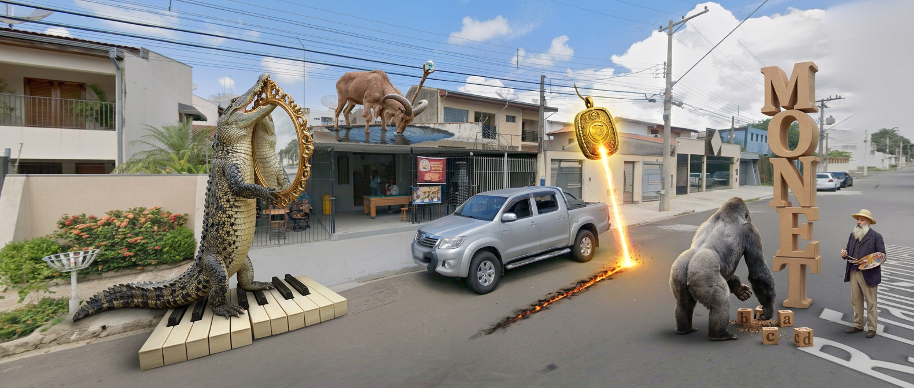

<em>5 beasts · 5 Knowledge Atoms</em>

#### Knowledge Atoms

### [Al] alligator

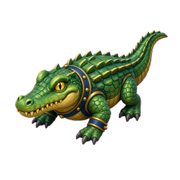

**Concept**
💡 Bass F sits on the second line from the top and acts as a symmetrical mirror image to Treble G around Middle C.

**Quote**
“Treble G is up this far and bass F is down this far So they're like mirrors of each other”

### [Am] amulet

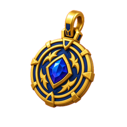

**Concept**
💡 Middle C for the left hand is drawn with a downward stem on a ledger line above the bass staff.

**Quote**
“So I can draw this middle C also for my left hand just by drawing a ledger line above the bass staff”

### [An] angel

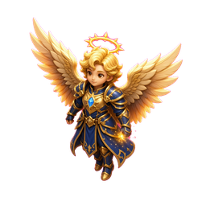

**Concept**
💡 Moving to an adjacent white key on the piano means stepping between a line note and a space note on the musical staff.

**Quote**
“when we play on the piano we move between line notes and space notes line space line space line space”

### [Ao] aoudad

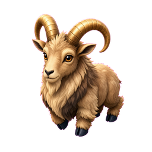

**Concept**
💡 Treble F is located in the first space at the very bottom of the treble staff

**Quote**
“directly below the Treble G line.”

### [Ap] ape

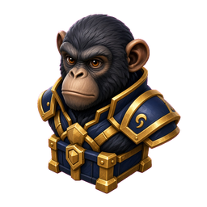

**Concept**
💡 Musical note names must be written in uppercase letters because lowercase letters represent different concepts in music theory notation.

**Quote**
“now whenever we write the names of notes in music we always use capital letters because uh if we use lowercase letters that actually means something slightly different in music”

#### Notes

_No notes._

#### Gallery

_No gallery images._

<strong>Memory Palace 10: Reading and Hand Posture</strong> · Character: Elvis Presley · 2 beasts · 2 atoms

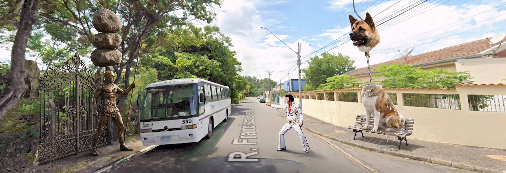

<em>2 beasts · 2 Knowledge Atoms</em>

#### Knowledge Atoms

### [Aj] Ajax

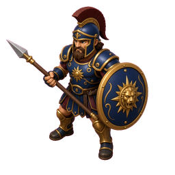

**Concept**
💡 Stacked notes sharing a single stem mean the notes are played simultaneously.

**Quote**
“these notes are lined up stacked with one stem can you guess what that might mean it means play the notes at the same time”

### [Ak] Akita (dog breed)

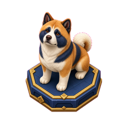

**Concept**
💡 Good posture involves sitting straight with the head lifted upward as if pulled by a string, while keeping the shoulders relaxed.

**Quote**
“I'm imagining that my head is being almost lifted up by a little string someone's holding a hair on my head so I've got very good posture but at the same time my shoulders are relaxed”

#### Notes

_No notes._

#### Gallery

_No gallery images._

<strong>Memory Palace 9: Note Symbols and Counting</strong> · Character: (unassigned palace 9) · 1 beast · 1 atom

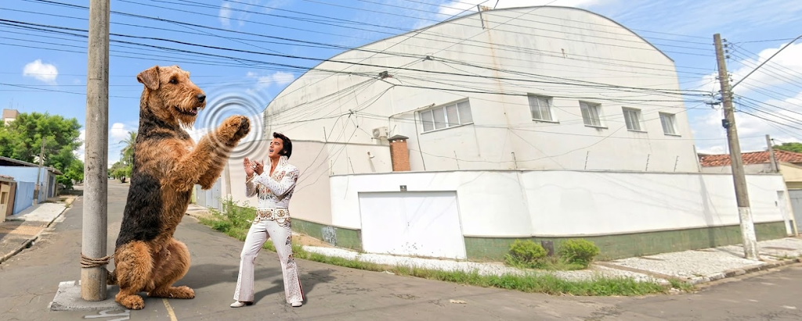

<em>1 beast · 1 Knowledge Atom</em>

#### Knowledge Atoms

### [Ai] Airedale terrier

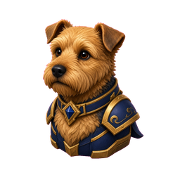

**Concept**
💡 Counting out loud and clapping physically reinforces the rhythm and prevents speed changes.

**Quote**
“when we count in music we always count out loud this is so important um if we count in our heads we don't always notice if we stop counting or count a little slower or faster”

#### Notes

_No notes._

#### Gallery

_No gallery images._

<strong>Memory Palace 8: Reading Spaces and Resolution</strong> · Character: Marilyn Monroe · 3 beasts · 3 atoms

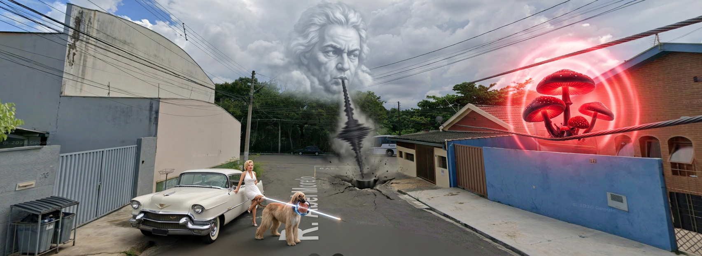

<em>3 beasts · 3 Knowledge Atoms</em>

#### Knowledge Atoms

### [Af] Afghan hound

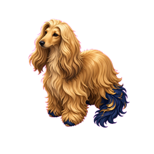

**Concept**
💡 A line note has a staff line passing directly through its center, similar to a bead on a string.

**Quote**
“we would call this one a line note because it has a line going through the middle of it just like a bead on a string going right through the middle of the bead”

### [Ag] Agaric fungi

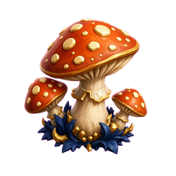

**Concept**
💡 A space note is a musical note that rests entirely in the empty gap between two staff lines.

**Quote**
“A space note sits completely between two staff lines without any line passing through it.”

### [Ah] Ah!—a sigh

**Concept**
💡 A cadence is a harmonic progression at the end of a musical phrase that provides a sense of resolution or punctuation.

**Quote**
“A musical cadence is a progression of at least two chords that concludes a phrase, section, or piece of music.”

#### Notes

_No notes._

#### Gallery

_No gallery images._

<strong>Memory Palace 7: Musical Structure</strong> · Character: (unassigned palace 7) · 3 beasts · 4 atoms

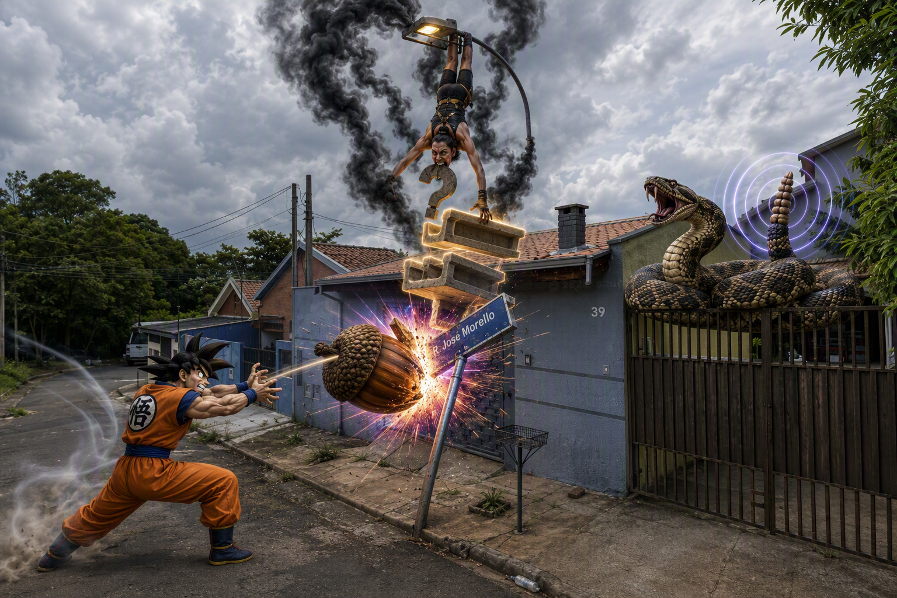

<em>3 beasts · 4 Knowledge Atoms</em>

#### Knowledge Atoms

### [Ac] acorn

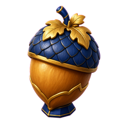

**Concept**
💡 An accidental is a symbol that alters a note's pitch temporarily, such as sharps, flats, or naturals.

**Quote**
“An accidental is a symbol in musical notation that temporarily alters the pitch of a note.”

### [Ad] adder

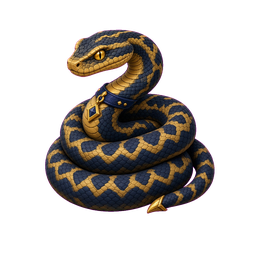

**Concept**
💡 A melody combines pitch and rhythm into a primary, cohesive musical line.

**Quote**
“A melody is a linear succession of musical tones—combining pitch and rhythm—that the listener perceives as a single, cohesive entity.”

### [Ae] aerialist

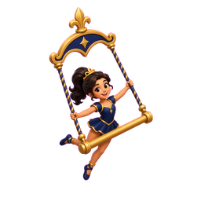

🟦 **Z1 · Z1 Head | Phrase**

**Concept**
💡 she catches a heavy, rough-textured punctuation mark with her teeth, biting down hard to create a resting point

**Quote**
“A section is a larger, major structural block of a musical form (such as a verse, chorus, or bridge). A section is made up of multiple phrases combined together.”

---

🟦 **Z2 · Z2 Forelimbs | Section**

**Concept**
💡 she stacks huge, glowing concrete highway segments together like children's blocks using her hands

**Quote**
“A section is a larger, major structural block of a musical form (such as a verse, chorus, or bridge). A section is made up of multiple phrases combined together.”

#### Notes

_No notes._

#### Gallery

_No gallery images._

<strong>Memory Palace 6: Chord Positions and Harmony Basics</strong> · Character: (unassigned palace 6) · 5 beasts · 7 atoms

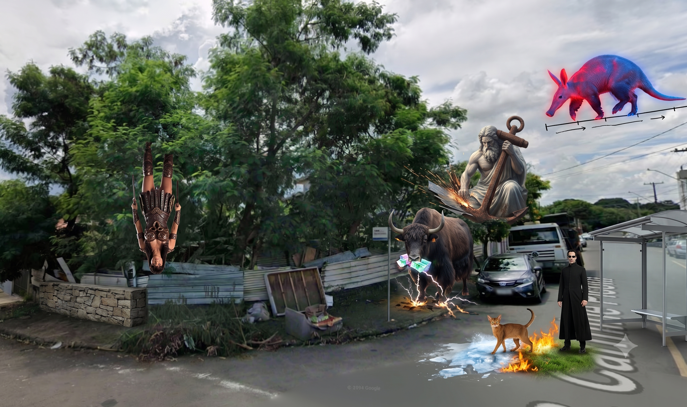

<em>5 beasts · 7 Knowledge Atoms</em>

#### Knowledge Atoms

### [X] Xena, warrior woman

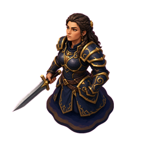

**Concept**
💡 An inversion changes which note sits at the bottom of the chord.

**Quote**
“an inversion just means that the note that's played at the very bottom is a different one of these notes”

### [Y] yak

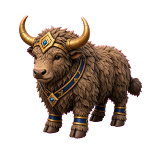

🟦 **Z1 · Z1 Head | Harmony combination**

**Concept**
💡 - Many notes came flying and gathered together a single note. That single note was growing in size, getting bigger and bigger, till it was so heavy that it fell onto the yaks head.

**Quote**
—

---

🟦 **Z2 · Z2 Forelimbs | Triad unit**

**Concept**
💡 stamping three distinct lightning bolts into the pavement

**Quote**
—

### [Z] Zeus

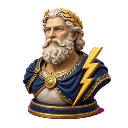

🟦 **Z1 · Z1 Head | Consonant rest**

**Concept**
💡 resting his cheek heavily against a massive, calming iron ship anchor

**Quote**
“Composers use dissonance intentionally to create emotional tension, which typically drives the music forward”

---

🟦 **Z2 · Z2 Forelimbs | Dissonant tension**

**Concept**
💡 violently scratching sheet metal to shoot burning sparks

**Quote**
“Composers use dissonance intentionally to create emotional tension, which typically drives the music forward”

### [Aa] aardvark

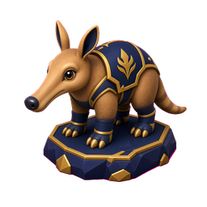

**Concept**
💡 A chord progression is a sequence of chords that dictates the emotional arc and key of a song.

**Quote**
“A chord progression is a specific sequence of chords played over time. This movement dictates the emotional arc of a song”

### [Ab] Abyssinian cat

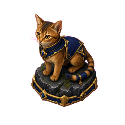

**Concept**
💡 Harmony provides the underlying context that can completely change the emotional feeling of the same melody.

**Quote**
“The exact same melody line can sound joyful, melancholic, or suspenseful depending entirely on the underlying harmony.”

#### Notes

_No notes._

#### Gallery

_No gallery images._

<strong>Memory Palace 5: Chord Construction and Types</strong> · Character: Ada Lovelace · 5 beasts · 5 atoms

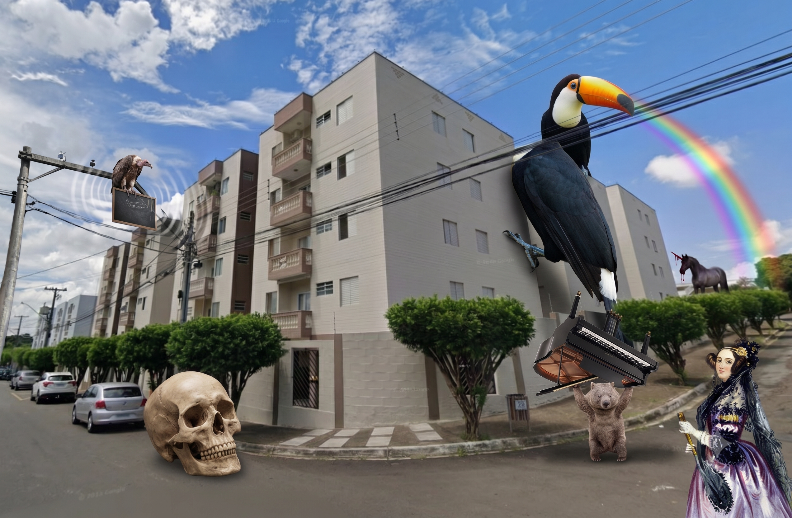

<em>5 beasts · 5 Knowledge Atoms</em>

#### Knowledge Atoms

### [S] skull

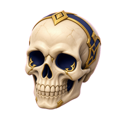

**Concept**
💡 Chords are constructed by skipping keys between the notes you play.

**Quote**
“for whatever note you start on the next notes that follow will skip over keys”

### [T] toucan

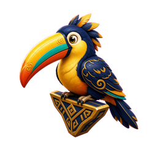

**Concept**
💡 Primary chords (I, IV, V) produce a cheerful, major sound.

**Quote**
“they all have a cheerful sound they all sound what we call major”

### [U] unicorn

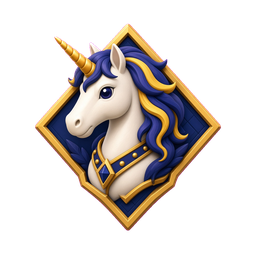

**Concept**
💡 Secondary chords (ii, iii, vi) produce a darker, minor sound in major keys.

**Quote**
“these three red chords which i have written are called the secondary chords and when we play secondary chords in major keys they always have a minor sound”

### [V] vulture

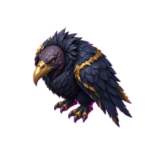

**Concept**
💡 Diminished chords have an edgy, dissonant sound because they skip fewer keys.

**Quote**
“this one is called diminished so when you play a diminished chord it has um it has more of a dissonant sound”

### [W] wombat

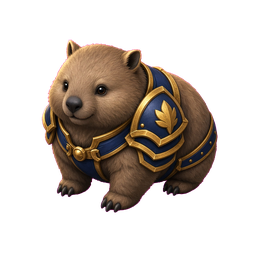

**Concept**
💡 A chord is in root position when the root note is on the very bottom.

**Quote**
“they're in root position if we have the root letter on the bottom”

#### Notes

_No notes._

#### Gallery

_No gallery images._

<strong>Memory Palace 4: Key Choice, Chords, and Pedal</strong> · Character: Alan Turing · 3 beasts · 6 atoms

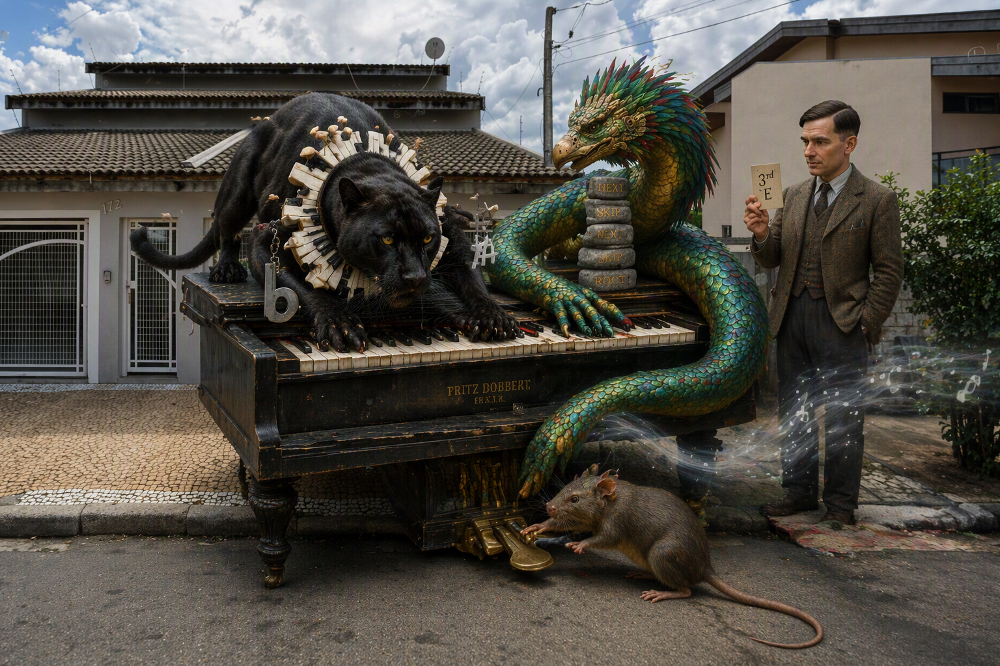

<em>3 beasts · 6 Knowledge Atoms</em>

#### Knowledge Atoms

### [P] panther

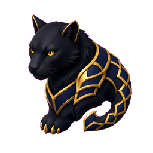

🟦 **Z1 · C major white keys**

**Concept**
💡 The panther wears white mushrooms growing only along its white-key collar.

**Quote**
“Accidental that raises a note by one half step.”

---

🟦 **Z2 · Flat lowers**

**Concept**
💡 The panther carries a drooping key charm pushed down and left.

**Quote**
“Accidental that raises a note by one half step.”

---

🟦 **Z3 · Sharp raises**

**Concept**
💡 The panther carries a bright spike charm lifting a key upward and right.

**Quote**
“Accidental that raises a note by one half step.”

### [Q] Quetzalcoatl

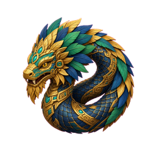

🟦 **Z1 · Chord**

**Concept**
💡 Quetzalcoatl presses two piano keys at the same time with a wide coiled body.

**Quote**
“A three-note chord built from a root note with alternating scale tones above it.”

---

🟦 **Z2 · Triad**

**Concept**
💡 Quetzalcoatl stacks three piano stones labeled by position: root, skip, next, skip, next.

**Quote**
“A three-note chord built from a root note with alternating scale tones above it.”

### [R] rat

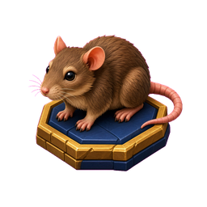

**Concept**
💡 The damper pedal keeps notes ringing after the keys are released.

**Quote**
“Pedal that sustains notes after the keys are released.”

#### Notes

_No notes._

#### Gallery

_No gallery images._

<strong>Memory Palace 3: Practice Structure and Scale Steps</strong> · Character: Frédéric Chopin · 5 beasts · 8 atoms

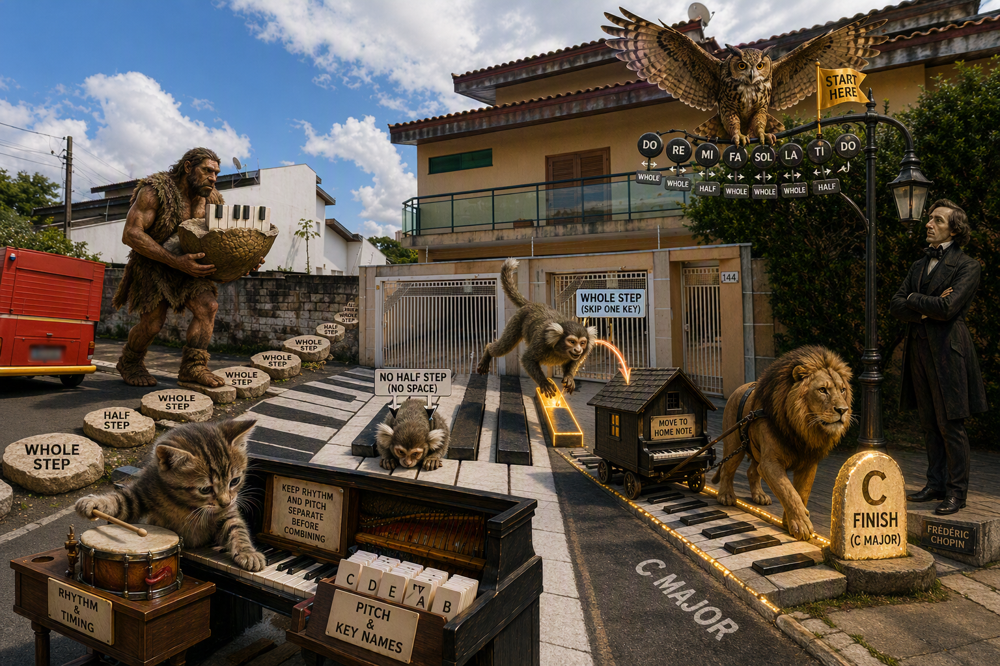

<em>5 beasts · 8 Knowledge Atoms</em>

#### Knowledge Atoms

### [K] kitten

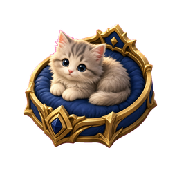

**Concept**
💡 Practice rhythm and pitch apart before putting them together.

**Quote**
“Practice timing and note locations independently before combining them.”

### [L] lion

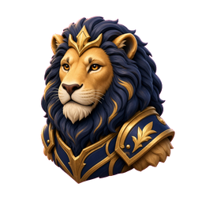

🟦 **Z1 · Tonic home note**

**Concept**
💡 The lion pulls a tiny piano house to one note and parks there.

**Quote**
“Finish C-major exercises on C to reinforce tonal resolution.”

---

🟦 **Z2 · C-major resolution**

**Concept**
💡 The lion places a bright C finish stone at the end of a C-major path.

**Quote**
“Finish C-major exercises on C to reinforce tonal resolution.”

### [M] marmoset

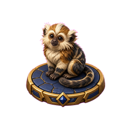

🟦 **Z1 · Half step**

**Concept**
💡 The marmoset squeezes between two side-by-side piano keys with no space between them.

**Quote**
“A distance equal to two half steps.”

---

🟦 **Z2 · Whole step**

**Concept**
💡 The marmoset leaps over exactly one glowing skipped key and lands on the next key.

**Quote**
“A distance equal to two half steps.”

### [N] Neanderthal

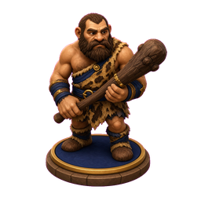

🟦 **Z1 · Pentascale**

**Concept**
💡 The Neanderthal carries a cracked acorn with five tiny piano keys growing from it.

**Quote**
—

### [O] owl

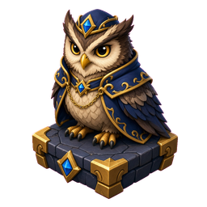

🟦 **Z1 · Major scale sound**

**Concept**
💡 The owl lands on eight sung step markers that rise and fall like do-re-mi.

**Quote**
“Any note can be the tonic of a major scale when the correct interval formula is applied.”

---

🟦 **Z2 · Any starting key**

**Concept**
💡 The owl carries a golden start flag that moves between black and white keys while the same gap path appears.

**Quote**
“Any note can be the tonic of a major scale when the correct interval formula is applied.”

#### Notes

_No notes._

#### Gallery

_No gallery images._

<strong>Memory Palace 2: Note Values and Relaxed Hand</strong> · Character: Claude Debussy · 5 beasts · 11 atoms

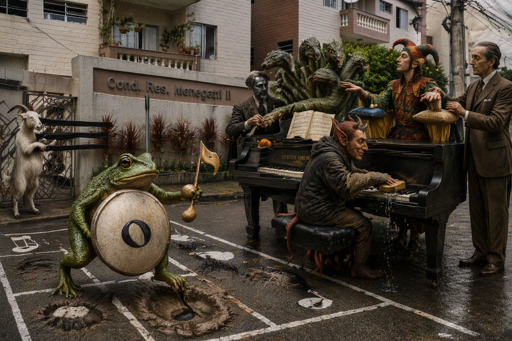

<em>5 beasts · 11 Knowledge Atoms</em>

#### Knowledge Atoms

### [F] frog

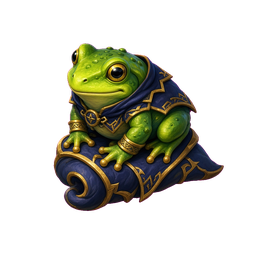

🟦 **Z1 · Whole note**

**Concept**
💡 The frog holds one big hollow note shield while four drum hits shake the street.

**Quote**
“Note lasting one beat in common time.”

---

🟦 **Z2 · Half note**

**Concept**
💡 The frog carries a note with a stem and takes exactly two steps.

**Quote**
“Note lasting one beat in common time.”

---

🟦 **Z3 · Quarter note**

**Concept**
💡 The frog presses one black note shape into wet clay with one loud footstep.

**Quote**
“Note lasting one beat in common time.”

### [G] goat

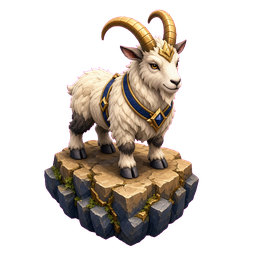

**Concept**
💡 A double bar line marks the end of a part or piece.

**Quote**
“Symbol used to mark the end of a section or piece of music.”

### [H] Hydra

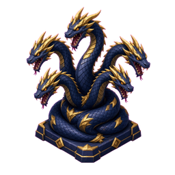

🟦 **Z1 · Rounded fingers**

**Concept**
💡 The Hydra balances a small orange under its softly arched playing hand.

**Quote**
“Keep the thumb relaxed and naturally positioned.”

---

🟦 **Z2 · Fingertip pads**

**Concept**
💡 Its glowing soft fingertip pads press the keys instead of sharp claws.

**Quote**
“Keep the thumb relaxed and naturally positioned.”

---

🟦 **Z3 · Loose thumb**

**Concept**
💡 A tiny thumb-shaped pillow rests beside the Hydra’s relaxed hand.

**Quote**
“Keep the thumb relaxed and naturally positioned.”

### [I] imp

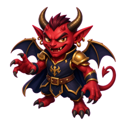

🟦 **Z1 · Gentle arm weight**

**Concept**
💡 The imp lowers a wet sponge onto a piano key so water slowly squeezes out.

**Quote**
“Transfer the arm's weight efficiently into the fingertips.”

---

🟦 **Z2 · Weight transfer**

**Concept**
💡 The imp wears a heavy cloth sleeve from shoulder to fingertip, letting weight flow into the key.

**Quote**
“Transfer the arm's weight efficiently into the fingertips.”

### [J] jester

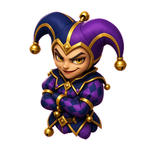

🟦 **Z1 · Raised flexible wrists**

**Concept**
💡 The jester balances soft cushions under lifted wrists above the keys.

**Quote**
“Allow the elbows to remain slightly away from the body.”

---

🟦 **Z2 · Elbows away**

**Concept**
💡 The jester opens wing-like sleeves slightly away from the body.

**Quote**
“Allow the elbows to remain slightly away from the body.”

#### Notes

_No notes._

#### Gallery

_No gallery images._

<strong>Memory Palace 1: Keyboard Map and Reading System</strong> · Character: Wolfgang Amadeus Mozart · 5 beasts · 11 atoms

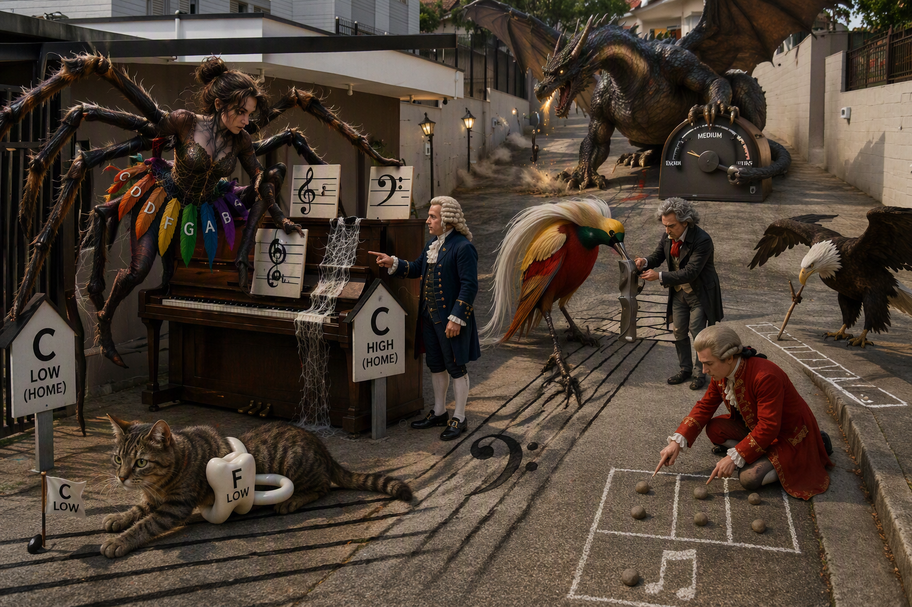

<em>5 beasts · 11 Knowledge Atoms</em>

#### Knowledge Atoms

### [A] Arachne

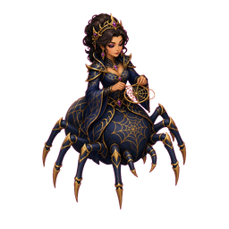

🟦 **Z1 · Middle C home marker**

**Concept**
💡 A thick white web wraps the middle C key between high and low staff signs.

**Quote**
“The distance between one note and the next note with the same name.”

---

🟦 **Z2 · Repeating note names**

**Concept**
💡 Seven bright feathers form a C D E F G A B loop across the piano keys.

**Quote**
“The distance between one note and the next note with the same name.”

---

🟦 **Z3 · Octave jump**

**Concept**
💡 Arachne springs from one C-key house to the next C-key house with the same letter farther away.

**Quote**
“The distance between one note and the next note with the same name.”

### [B] bird of paradise

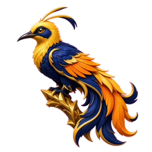

🟦 **Z1 · Five-line staff**

**Concept**
💡 The bird scratches five long black staff lines across the road.

**Quote**
“Combination of treble and bass staves connected by a brace.”

---

🟦 **Z2 · Bass clef low notes**

**Concept**
💡 Its folded wings form a heavy bass clef shape low on the lines.

**Quote**
“Combination of treble and bass staves connected by a brace.”

---

🟦 **Z3 · Grand staff brace**

**Concept**
💡 A large metal brace hangs from its beak, joining two music staffs into one system.

**Quote**
“Combination of treble and bass staves connected by a brace.”

### [C] cat

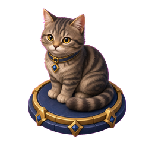

🟦 **Z1 · Bass C landmark**

**Concept**
💡 The cat carries a small flag planted on a low C key.

**Quote**
“F note landmark used for reading notes in the bass clef.”

---

🟦 **Z2 · Bass F landmark**

**Concept**
💡 The cat wears a soft tooth-shaped ring gently locked around a low F key.

**Quote**
“F note landmark used for reading notes in the bass clef.”

### [D] dragon

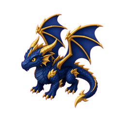

🟦 **Z1 · Steady beat**

**Concept**
💡 The dragon stamps one claw on the road again and again while street lamps blink with each pulse.

**Quote**
“The speed at which the beat is played.”

---

🟦 **Z2 · Tempo speed**

**Concept**
💡 The dragon turns a speed dial beside the piano, making the pulse faster or slower.

**Quote**
“The speed at which the beat is played.”

### [E] eagle

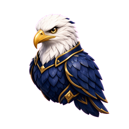

**Concept**
💡 A time signature tells how beats fit inside each measure.

**Quote**
“Notation that indicates how many beats are in each measure and which note value receives the beat.”

#### Notes

_No notes._

#### Gallery

_No gallery images._

