# Science

<strong>Memory Palace 19: How and Why Questions</strong> · Character: Nikola Tesla · 4 beasts · 4 atoms

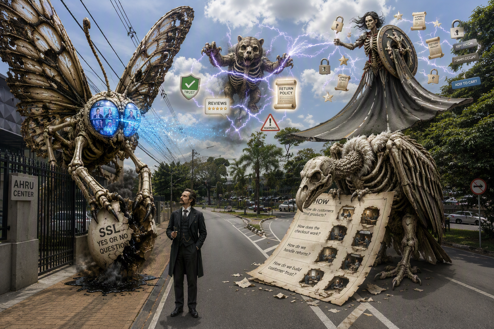

<em>4 beasts · 4 Knowledge Atoms</em>

_No image prompt saved._

#### Knowledge Atoms

### 🟧 [Bu] [butterfly] Context: Qualitative questions seek meanings, motives, lived experience, and process, while avoiding count-based or causal-test questions. ?? Z1 Head | Qualitative purpose: glowing interview screens fused into the butterfly�s eyes, projecting lived memories as blue dust � sensory: visual ?? Z2 Forelimbs | Avoid causal testing: brittle calculator claws crush a yes-or-no SSL question until it leaks burnt rubber smoke � sensory: olfactory Quote: "the goal is to create research questions that explore processes, meanings, motivations, interpretations, and lived experiences instead of measuring frequency or testing numerical relationships." Quote: "Does SSL increase trust?" Narrative: A colossal butterfly lands on the left street gate, and the glowing interview screens fused into its eyes project the exact quote as blue dust: "the goal is to create research questions that explore processes, meanings, motivations, interpretations, and lived experiences instead of measuring frequency or testing numerical relationships." Nikola Tesla touches the dust with a coil, and every number on the street melts into tiny spoken memories. The butterfly�s forelimbs crush a brittle calculator shell, releasing burnt rubber smoke while the shell repeats the forbidden question: "Does SSL increase trust?"

**Concept**
—

**Quote**
—

**Story**
—

**Sensory**
—

### 🟧 [Bv] [Bone vulture] Context: A strong how-question asks how people experience, interpret, perceive, or make sense of something in context. Quote: "How do [people/group] experience, interpret, perceive, negotiate, construct, or make sense of [phenomenon] in [context]?" Narrative: A Bone vulture swells to the size of a house facade and pecks a giant paper template stuck to the distant wall. With every peck, it croaks the exact formula: "How do [people/group] experience, interpret, perceive, negotiate, construct, or make sense of [phenomenon] in [context]?" Nikola Tesla watches the pecked holes turn into tiny doors, each showing a different user making sense of an online store.

**Concept**
—

**Quote**
—

**Story**
—

**Sensory**
—

### 🟧 [Bw] [Bone wombat] Context: A strong why-question asks why people give meaning, value, trust, distrust, concern, or risk to something. Quote: "Why do [people/group] attribute meaning, value, concern, trust, or distrust to [phenomenon] in [context]?" Narrative: A Bone wombat floats above a street lamp, far heavier than the air should allow. It claws the exact quote into visible thunder: "Why do [people/group] attribute meaning, value, concern, trust, or distrust to [phenomenon] in [context]?" Nikola Tesla raises a coil, and the thunder tastes like lemon while each word sparks toward trust symbols, reviews, return policies, and warning signs.

**Concept**
—

**Quote**
—

**Story**
—

**Sensory**
—

### 🟧 [Bx] [Bone Xena, warrior woman] Context: For e-commerce trust, one strong question can combine how users build trust and why they see some signals as credible or risky. Quote: "How do users construct trust in unfamiliar e-commerce websites, and why do they attribute credibility or risk to specific signals such as SSL indicators, customer reviews, flexibility policies, and interface design?" Narrative: Bone Xena stands on the right street corner and opens a shield so wide that it bends the road like soft cloth. She carves the exact research-ready question across the shield: "How do users construct trust in unfamiliar e-commerce websites, and why do they attribute credibility or risk to specific signals such as SSL indicators, customer reviews, flexibility policies, and interface design?" Nikola Tesla pulls a lightning wire from the shield, and SSL locks, review stars, return-policy scrolls, and interface buttons orbit the warrior like tiny moons.

**Concept**
💡 https://uxdesign.cc/information-architecture-is-the-foundation-artificial-intelligence-is-starving-for-1d91fb5bf59f

**Quote**
—

**Story**
https://uxdesign.cc/information-architecture-is-the-foundation-artificial-intelligence-is-starving-for-1d91fb5bf59f

**Sensory**
—

<strong>Memory Palace 18: Definition and Characteristics</strong> · Character: Belo · 4 beasts · 4 atoms

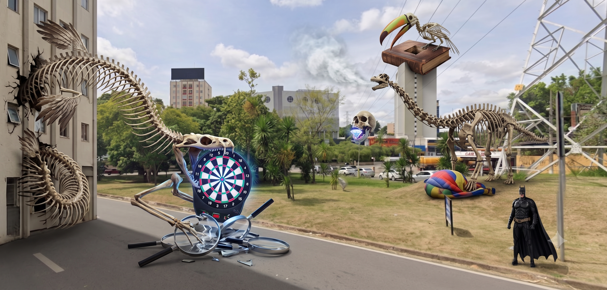

<em>4 beasts · 4 Knowledge Atoms</em>

_No image prompt saved._

#### Knowledge Atoms

### 🟧 [Bq] Bone Quetzalcoatl

**Concept**
💡 A research question is the core target your study attempts to answer, and it must have a singular focus without cramming multiple variables together.

**Quote**
“a strong research question typically has a clear singular Focus so don't try to cram multiple questions into one”

**Story**
The Bone Quetzalcoatl phases directly through the solid brick wall, defying physics. Its skeletal head bites the exact center of a giant glowing dartboard, hissing the first quote as sparks fly visibly into its empty eye sockets. Simultaneously, its massive feathered forelimbs violently smash three magnifying glasses together into a single laser beam, spewing the second quote as bone dust physically grinds the glass into one sharp point. Batman watches the impossibly large skeletal snake rewrite the rules of reality.

**Sensory**
—

### 🟧 [Br] brontosaurus

**Concept**
💡 A research aim outlines a broad goal, while a research question takes that aim and narrows it down to a tighter focus.

**Quote**
“your research question should take the statement that is your research aim it should then narrow that down to a tighter Focus area and present it as a question”

**Story**
A skyscraper-sized brontosaurus completely dwarfs the street and parked cars. Its head roars the first quote so loudly the soundwaves paint a blurry cloud across the sky, deafening Batman. Below, its massive forelimbs grab a fully inflated hot air balloon, violently squeezing the rubber into a dense, tiny, glowing question mark as it thunders the second quote, forcing the massive balloon to physically shrink in its grip.

**Sensory**
—

### 🟧 [Bs] Bone skull

**Concept**
💡 A question must be practical and possible to answer with available methods.

**Quote**
“even a super super tantalizing and thought-provoking research question isn't going to be of much value if you can't feasibly answer it”

**Story**
A floating Bone skull hovers over the distant crosswalk, trying to bite a tantalizing, glowing diamond floating in the air. Its bony jaw physically phases right through the gem because it is completely impossible to catch. Frustrated by the impossible task, the skull squawks the exact quote into the night air while Batman tries to grab the gem himself.

**Sensory**
—

### 🟧 [Bt] Bone toucan

**Concept**
💡 Your question must stem from a clear gap in existing literature so you do not repeat old work.

**Quote**
“without a welldefined research Gap you're going to risk wasting your effort running after a question that's already been adequately answered”

**Story**
A colossal Bone toucan lands perfectly on an old, dusty book resting on a high street lamp, shrinking the entire street with its disproportionate scale. It frantically uses its heavy beak to dig a deep, perfectly square gap straight through the thick pages, loudly vibrating its hollow bones to speak the quote so it does not waste time reading the same old text.

**Sensory**
—

<strong>Memory Palace 17: Participatory Action Research Mechanics</strong> · Character: Darth Vader · 3 beasts · 3 atoms

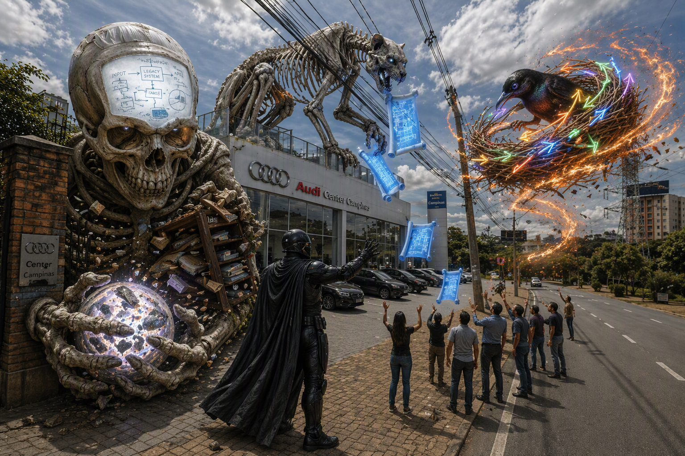

<em>3 beasts · 3 Knowledge Atoms</em>

_No image prompt saved._

#### Knowledge Atoms

### 🟧 [Bn] Bone Neanderthal

**Concept**
💡 Participatory Action Research shifts power from traditional extraction by empowering marginalized groups to co-create research that translates into tangible tools for social change.

**Quote**
“The 'action' part means that the data doesn't just sit on a shelf; it is directly translated into tools for healing, organizing, and fighting back against institutional violence.”

**Story**
A colossal Bone Neanderthal stomps onto the street next to a brick gate, towering over Darth Vader. The glowing whiteboard diagram fused into its skull pulses with blinding light as it roars the first quote. It then crushes the glowing orb of knowledge in its huge skeletal hands, sending out intense tactile shockwaves that ripple the ground while it bellows the second quote. Finally, a dusty academic shelf violently bursts from its ribcage with a deafening crash, magically forging the falling papers into glowing shields as the beast thunders the final quote.

**Sensory**
—

### 🟧 [Bo] bower-bird

**Concept**
💡 Participatory Action Research is an iterative loop of planning, acting, observing, and reflecting.

**Quote**
“It is a continuous spiral of plan, act, observe, and reflect, where each cycle informs the next.”

**Story**
A giant bower-bird weaves a nest out of four colored arrows that glow like neon tubes on a lamp post. Darth Vader watches as the bird flies in a perfect, never-ending spiral, leaving a trail of fire in the air. With every blazing loop it completes, the bird perfectly squawks the quote.

**Sensory**
—

### 🟧 [Bp] Bone panther

**Concept**
💡 People experiencing a problem are uniquely qualified to investigate it, guiding the inquiry themselves.

**Quote**
“Participatory Action Research is a model where the people most impacted by a social issue are the ones actually designing and conducting the research.”

**Story**
A towering Bone panther hovers over a balcony, completely dwarfing the city street. It drops giant, glowing blueprint scrolls directly into the hands of a group of battered citizens, aggressively batting Darth Vader away when he tries to intercept them. The giant skeletal feline hisses the quote as the blueprints magically assemble into floating research tools in the citizens' hands.

**Sensory**
—

<strong>Memory Palace 16: From Raw Data to Theory</strong> · Character: Charles Darwin · 3 beasts · 3 atoms

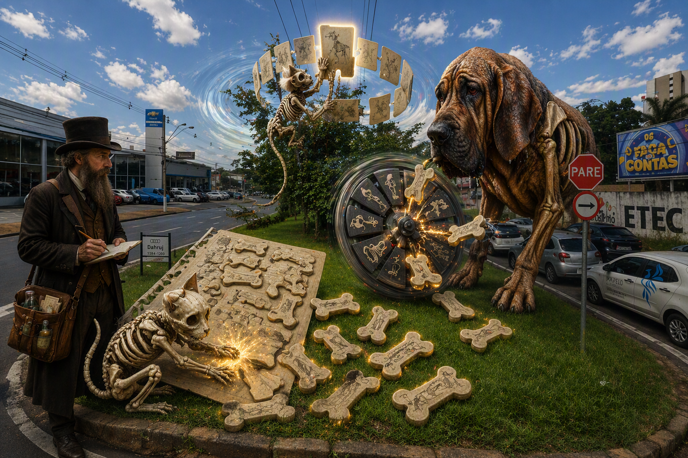

<em>3 beasts · 3 Knowledge Atoms</em>

_No image prompt saved._

#### Knowledge Atoms

### 🟧 [Bk] Bone kitten

**Concept**
💡 Open coding breaks raw qualitative data into small meaningful pieces and gives them concept labels.

**Quote**
“Open coding is the first stage, where you break the qualitative data into smaller meaningful pieces and label them as concepts.”

**Story**
A tiny Bone kitten scratches a giant transcript projected on a wall until the paper splits into glowing bone-shaped pieces. Charles Darwin points to the instructor�s line on the screen while the kitten meows the exact words: "Open coding is the first stage, where you break the qualitative data into smaller meaningful pieces and label them as concepts." Each broken piece floats upward and freezes as a sharp label, far too heavy for such a small kitten.

**Sensory**
—

### 🟧 [Bl] bloodhound

**Concept**
💡 Axial coding reconnects open codes into broader categories and shows how they relate.

**Quote**
“Axial coding reconnects the concepts created during open coding by organizing them around broader categories and identifying relationships between them.”

**Story**
A colossal bloodhound bites loose concept tags and pulls them into a spinning wheel fixed to a street gate. Charles Darwin taps the on-screen diagram as the bloodhound barks the exact words: "Axial coding reconnects the concepts created during open coding by organizing them around broader categories and identifying relationships between them." The tags snap together with loud magnetic clicks, and the wheel smells like hot metal and wet dog.

**Sensory**
—

### 🟧 [Bm] Bone marmoset

**Concept**
💡 Selective coding chooses one core category and connects the main categories around it to build a theory.

**Quote**
“Selective coding is the final integration stage, where you identify one core category that explains the main pattern in the data.”

**Story**
A Bone marmoset climbs a huge floating crown made of category cards and jams one bright core card into the center. Charles Darwin holds up the final slide as the marmoset screeches the exact words: "Selective coding is the final integration stage, where you identify one core category that explains the main pattern in the data." The whole crown bends space toward the core card, as if every category is being pulled by a tiny academic black hole.

**Sensory**
—

<strong>Memory Palace 15: From Social Theory to Bosch UX Practice</strong> · Character: Ada Lovelace · 5 beasts · 5 atoms

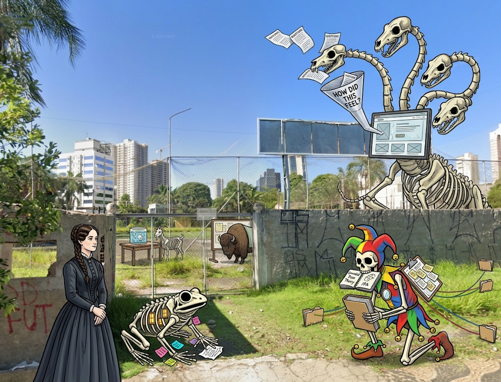

<em>5 beasts · 5 Knowledge Atoms</em>

_No image prompt saved._

#### Knowledge Atoms

### 🟧 [Bf] Bone frog

**Concept**
💡 The theory side can fit into one beast: people make meaning through lived experience, shared labels, and context.

**Quote**
“�Indexicality is critical to this process, meaning people make sense of things based strictly on the context or circumstances in which they are encountered.�”

**Story**
The Bone frog carries the theory pack through the same Bosch UX street. Ada Lovelace stands near a test table and watches the frog act like a living theory map. The frog shows that people do not just �see� reality. They live through situations, label what things mean, and read each sign through its context. The floating windows show lived experience. The sticky labels show shared social meaning. The small note under its paw shows that the same thing can mean something different depending on where it appears.

**Sensory**
—

### 🟧 [Bg] Bone goat

**Concept**
💡 IPA means understanding how one person makes sense of a personal experience. IPA pronunciation: Interpretative Phenomenological Analysis /?n't??rpr?t?t?v f??n??m?'n??l?d??k?l ?'n�l?s?s/.

**Quote**
“�IPA is built on a double hermeneutic. This means the researcher is trying to make sense of the participant trying to make sense of their own world. Participants are treated as active sense-makers, not passive subjects.�”

**Story**
The Bone goat stands beside a Bosch UX interview table. The goat is not counting clicks or only checking task time. It looks into a clear water tank on its back, where memory bubbles from one participant�s life float slowly. The goat reminds the researcher that IPA has two layers: the participant explains their world, and the UX researcher interprets that explanation with care.

**Sensory**
—

### 🟧 [Bh] Bone Hydra

**Concept**
💡 For Bosch UX research, IPA starts with open questions about human experience.

**Quote**
“�Define the research question: Ask open-ended questions about human experience.�”

**Story**
The Bone Hydra looms above a Bosch e-commerce prototype on the street. It does not ask a narrow yes-or-no question. One head lowers the wide paper funnel onto the prototype and asks people how trust forms while they look at signs, opinions, choices, and support. The Hydra keeps the question open so the participant can explain the experience in their own words.

**Sensory**
—

### 🟧 [Bi] bison

**Concept**
💡 IPA analysis is slow and close: read the transcript again and again, mark what is said, notice how it is said, and ask what it may mean.

**Quote**
“�Conceptual comments explore what this might mean on a deeper level.�”

**Story**
The bison stands heavy and slow beside a Bosch research board. A thick transcript blanket covers its back, and the bison reads it line by line, then reads it again. It places notes in the margins to catch what the user says about trust. It listens for words, tone, and metaphors. It also looks under the surface, asking what the participant�s words may mean for their deeper sense of safety, control, and doubt.

**Sensory**
—

### 🟧 [Bj] Bone jester

**Concept**
💡 IPA turns each case into themes first, compares cases later, and keeps the researcher�s own role visible.

**Quote**
“�Successfully applying IPA requires the researcher to embrace reflexivity. The researcher is part of the meaning-making process, not a robot. Acknowledging personal biases, assumptions, and the interpretative role ensures the analysis remains close to the data and allows participant voices to guide the findings.�”

**Story**
The Bone jester kneels near the Bosch prototype in motley and ringing bells, guarding one participant case file before touching the others. It builds themes for that person first, using direct quote strips on its back as proof. Only after that does it connect colored threads across cases. Its mirror badge is the key reminder: the UX researcher is part of the meaning-making work, so their assumptions must stay visible. The split notebook in its mouth keeps the method contrast clear: Grounded Theory tries to build a theory from data, while IPA stays closer to how a specific person makes sense of an experience.

**Sensory**
—

<strong>Memory Palace 14: Foundations of Reasoning</strong> · Character: (unassigned palace 14) · 4 beasts · 4 atoms

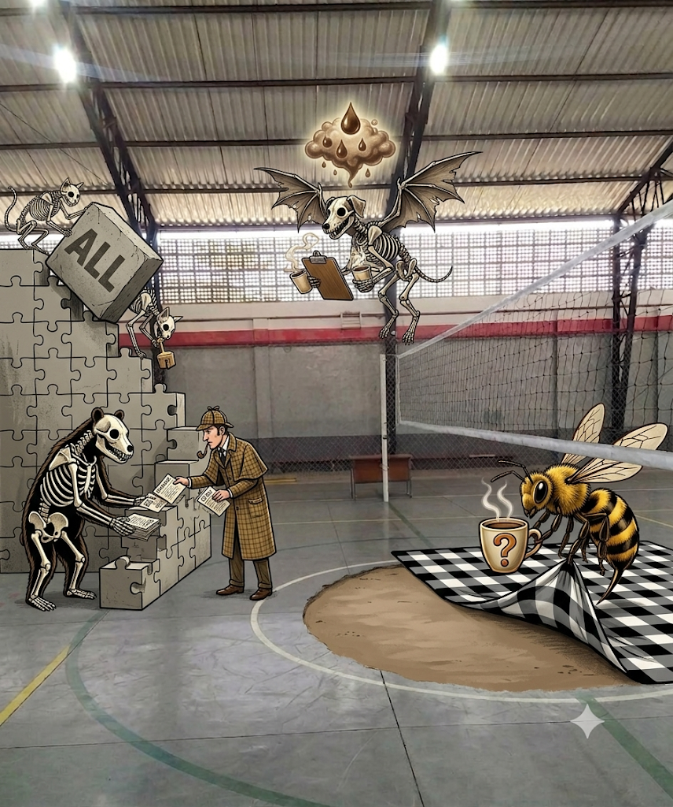

<em>4 beasts · 4 Knowledge Atoms</em>

_No image prompt saved._

#### Knowledge Atoms

### 🟧 [Bb] Bone Bear

**Concept**
💡 Reasoning uses what you already know to build explanations and guess what happens next.[cite: 1]

**Quote**
“"Reasoning is the process of using existing knowledge to draw conclusions, make predictions, or construct explanations."[cite: 1]”

**Story**
A Bone Bear[cite: 8] builds a small staircase out of puzzle pieces.[cite: 1] Sherlock Holmes[cite: 7] hands the bear facts he already knows, and the bear uses them to build a clear path upward to explain a mystery.[cite: 1]

**Sensory**
—

### 🟧 [Bc] Bone Cat

**Concept**
💡 Deductive thinking works from the top down, where true starting facts guarantee a true final answer.[cite: 1]

**Quote**
“Deductive reasoning is basically called a top-down approach, which means from generalizations to particulars, or from hypothesis to evidence."[cite: 1]”

**Story**
A Bone Cat[cite: 8] sits at the very top of the staircase.[cite: 1] It pushes a large block that says "All" down the stairs, watching it shrink into a tiny block that says "One" as it hits the bottom.[cite: 1] Then, the Bone Cat[cite: 8] runs down and bites the tiny block hard to test if it is real.[cite: 1] Because the starting block at the top was made of solid truth, the Bone Cat[cite: 8] finds the final piece is also perfectly solid and true.[cite: 1]

**Sensory**
—

### 🟧 [Bd] Bone Dog

**Concept**
💡 Inductive thinking works from specific details up to a big rule to prove an idea with real-world clues.[cite: 1]

**Quote**
“Inductive reasoning moves from specific to general."[cite: 1]”

**Story**
A Bone Dog[cite: 8] ignores the stairs and leaps upward into the air.[cite: 1] It carries a few specific drops of coffee from the floor high into the sky to form a large, general cloud.[cite: 1] While floating, the Bone Dog[cite: 8] holds a clipboard in its paws and gathers real coffee cups from the ground to prove its guess that the coffee is tasty.[cite: 1]

**Sensory**
—

### 🟧 [Be] bee

**Concept**
💡 Abductive thinking makes the best possible guess based on obvious but incomplete clues.[cite: 1]

**Quote**
“Abductive reasoning or abduction is making a probable conclusion from what you know."[cite: 1]”

**Story**
A giant bee[cite: 8] lands nearby on the street, holding a hot cup of coffee with a question mark painted on it to make a highly likely guess about who left it there.[cite: 1] It then uses its stinger to lift a blanket on the ground, revealing that the footprint evidence is completely missing.[cite: 1] Because a big piece is hidden, the bee[cite: 8] knows it can only guess the final answer.[cite: 1]

**Sensory**
—

<strong>Memory Palace 13: The Evolution of Grounded Theory</strong> · Character: Socrates · 5 beasts · 5 atoms

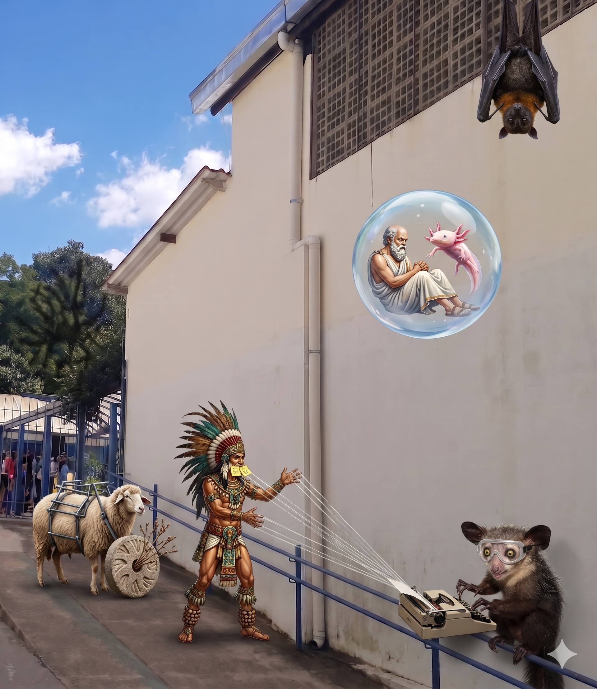

<em>5 beasts · 5 Knowledge Atoms</em>

_No image prompt saved._

#### Knowledge Atoms

### 🟧 [Aw] awassi sheep

**Concept**
💡 The 1990 update shifted away from natural discovery to strict rules, using an axial coding paradigm to map causes and effects between broken categories.

**Quote**
“Strauss and Corbin explicitly shifted away from Glaser�s philosophy of natural emergence. Instead, they engineered a highly prescriptive, analytical coding framework designed to generate theories systematically and verify them simultaneously within the data.”

**Story**
An awassi sheep steps into the library wearing rigid metal frames to enforce strict structural rules. It holds a carved stone wheel in its hooves, using it to force broken pieces of a plant into highly specific slots, carefully mapping the exact causes and effects between each broken fragment. It bleats loudly at the axolotl floating nearby.

**Sensory**
—

### 🟧 [Ax] axolotl

**Concept**
💡 Constructivist theory says the researcher is not a neutral robot; their own background directly shapes the final theory.

**Quote**
“"Charmaz argued that researchers are not neutral observers; their past experiences, cultural backgrounds, academic training, and personal biases are inextricably woven into the very fabric of the data collection and theory generation processes."”

**Story**
A pink axolotl swims in a floating water bubble, actively wrapping its slippery body around Socrates. It whispers that human biases and past experiences always weave into the data, proving that the observer and the subject build the truth together. The axolotl spits a splash of water at the aye-aye to emphasize its point.

**Sensory**
—

### 🟧 [Ay] aye-aye

**Concept**
💡 Constructivists use action words ending in "ing" so the analysis focuses on dynamic processes over time.

**Quote**
“"By forcing the researcher to code exclusively with gerunds... the analysis remains dynamically focused on actions, processes, and changes over time."”

**Story**
A wide-eyed aye-aye wearing safety goggles sits at a typewriter. It angrily rips out any paper that uses static nouns, throwing the crumpled pages directly at the Aztec warrior. The aye-aye only types active, moving words ending in "ing" with its long, bony finger to keep the focus completely on changing actions rather than frozen topics.

**Sensory**
—

### 🟧 [Az] Aztec

**Concept**
💡 Memos are continuous, informal notes written throughout the project that tie raw data to high-level ideas.

**Quote**
“"Memo-writing operates as the vital connective tissue of the analysis. Memos are continuous, informal, analytical notes written by the researcher throughout the entire lifecycle of the project."”

**Story**
An Aztec warrior decorated with bright feathers ignores the crumpled paper and walks right across the aye-aye's typewriter keys. He carries small, messy sticky notes in his teeth. He stretches sticky strings across the room, pasting the informal notes between the bare bones of the library's skeletons. These notes act as the vital tissue that holds the entire project together.

**Sensory**
—

### 🟧 [Ba] bat

**Concept**
💡 Abduction is a complex reasoning loop where you guess a temporary explanation, then collect data to test it.

**Quote**
“"Abduction is a highly sophisticated form of reasoning where the researcher examines complex data, forms a number of provisional hypotheses to explain that data, and then explicitly returns to the field to collect more data to prove or disprove those hypotheses during the ongoing analysis."”

**Story**
A large bat hangs upside down from the library chandelier. Completely ignoring the Aztec's sticky strings, it squeaks at a strange shadow, makes a quick guess about what the shadow is, and flies out the open door to find real evidence. It constantly flies back and forth, testing its temporary guesses against fresh clues in the field.

**Sensory**
—

<strong>Memory Palace 12: Foundations and Constant Comparison</strong> · Character: (unassigned palace 12) · 4 beasts · 4 atoms

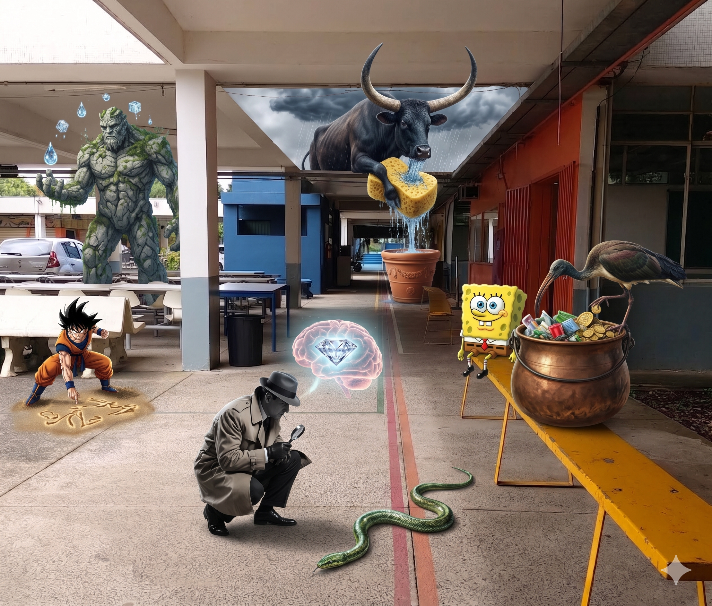

<em>4 beasts · 4 Knowledge Atoms</em>

_No image prompt saved._

#### Knowledge Atoms

### 🟧 [As] asp

**Concept**
💡 Data collection and analysis happen at the same time to build theory until new inputs stop changing the final ideas.[cite: 1]

**Quote**
“"We are going to link data analysis with theory."[cite: 1] "Data analysis takes place during data collection."[cite: 1] "Theoretical saturation you reach when your theory is so sophisticated that every new data point, every new interview does not lead to more refinement of your concepts or your categories."[cite: 1]”

**Story**
A slippery asp[cite: 3] slithers between a classic detective in a deerstalker hat[cite: 5] and a glowing brain, linking raw clues directly to thoughts as they arrive. The snake holds a perfect, polished diamond in its tail, refusing to let the auroch[cite: 3] polish it further because the gem is already perfectly refined.

**Sensory**
—

### 🟧 [At] atlas

**Concept**
💡 You build theory step by step through the constant comparison of facts and concepts, creating early ideas that serve only as flexible guides.[cite: 1]

**Quote**
“"The most important concept in Grounded Theory is constant comparison."[cite: 1] "What you do is compare data with data, data with concepts, concepts with data, and then you start to compare concepts with concepts."[cite: 1] "Every concept is temporary and they're provisional, they give some guidance but that's it, you shouldn't pin them down, they're not written in stone."[cite: 1]”

**Story**
A giant stone atlas[cite: 3] drops his globe and watches the asp[cite: 3]. A spiky-haired martial artist in an orange gi[cite: 5] watches as the atlas constantly looks back and forth, comparing every single clue. The atlas juggles water drops into ice cubes to form a star, then draws temporary rules in the sand that easily wash away, knowing early ideas aren't locked in place.

**Sensory**
—

### 🟧 [Au] auroch

**Concept**
💡 You stop collecting information when your concept is saturated and full, not when you reach a specific headcount.[cite: 1]

**Quote**
“"What you try to do is not representation, but saturation."[cite: 1]”

**Story**
A massive, horned auroch[cite: 3] ignores the diamond and instead tries to squeeze rain from a dark cloud into a sponge held by the atlas[cite: 3]. Instead of counting the drops, the beast just watches until the sponge is totally full and cannot absorb any more, showing that capacity, not a simple count, is the true goal.

**Sensory**
—

### 🟧 [Av] avocet

**Concept**
💡 Absolutely any material or observation you find counts as valid data for your study.[cite: 1]

**Quote**
“"All is data."[cite: 1]”

**Story**
A long-beaked avocet[cite: 3] lands beside a yellow square sponge character[cite: 5] and the auroch[cite: 3]. It wildly grabs trash, old newspapers, shiny coins, and pieces of the early sand drawings, throwing every single item into a huge pot to prove that absolutely no piece of garbage is useless.

**Sensory**
—

<strong>Memory Palace 11: The Structure Web</strong> · Character: (unassigned palace 11) · 4 beasts · 4 atoms

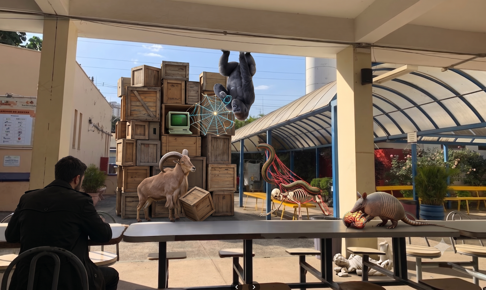

<em>4 beasts · 4 Knowledge Atoms</em>

_No image prompt saved._

#### Knowledge Atoms

### 🟧 [Ao] aoudad

**Concept**
💡 Taxonomies are hierarchical structures of boxes used for classifying items and individuals.

**Quote**
“"Taxonomies are a hierarchical structure that allow us to classify things... think of a bunch of different boxes and individuals can fit in one or many of those boxes."”

**Story**
Neo from the Matrix watches an aoudad jump wildly across a huge wall of wooden boxes. The aoudad organizes people and items, tossing them into one or more of these specific boxes to classify them, completely ignoring the armadillo chewing nearby.

**Sensory**
—

### 🟧 [Ap] ape

**Concept**
💡 An ontology is a conceptual web that helps computers interpret data.

**Quote**
“"[An ontology is] either a set of n-tuples or a web of concepts that helps computers or AI understand your data."”

**Story**
A large ape hangs upside down from the aoudad's boxes and reaches for Neo's computer screen. It spins a glowing, wet web of concepts between the screen and the boxes, linking data points together so the AI inside the machine can finally read and understand the files.

**Sensory**
—

### 🟧 [Aq] aquatic leech

**Concept**
💡 While a taxonomy is just a skeleton, an ontology adds all the detailed connections between members.

**Quote**
“"A taxonomy gives us just a skeleton maybe, and an ontology gives us the skeleton and fleshes out the various connections between all the different members."”

**Story**
An aquatic leech slithers along a bare bone skeleton sitting on the desk. It leaves a thick web of glowing red strings behind that attach to the ape's web, fleshing out the connections between all the isolated joints and joining them into a complete system.

**Sensory**
—

### 🟧 [Ar] armadillo

**Concept**
💡 Semantics focuses on the actual meaning of data rather than just its syntax or physical shape.

**Quote**
“"Semantics means we care about meaning, we care about understanding, rather than just the syntax, shape, or structure of the data."”

**Story**
An armadillo completely ignores a beautifully shaped syntax statue standing next to the aoudad's boxes. Instead, it curls up and chews aggressively on a glowing human brain to show that it only cares about deep understanding and true meaning, totally ignoring the outside structure of the statue.

**Sensory**
—

<strong>Memory Palace 10: The Coin Flip Casino</strong> · Character: Isaac Newton · 5 beasts · 5 atoms

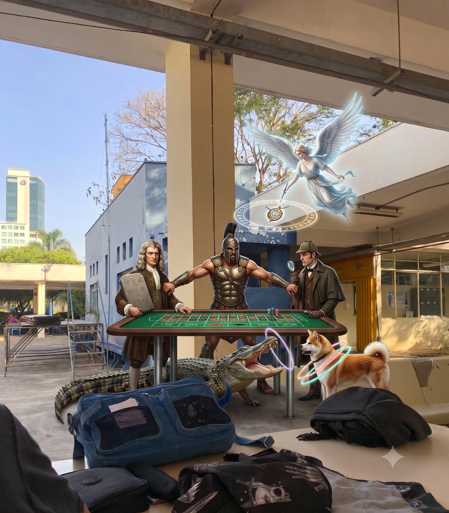

<em>5 beasts · 5 Knowledge Atoms</em>

_No image prompt saved._

#### Knowledge Atoms

### 🟧 [Aj] [Ajax]

**Concept**
💡 The philosophical difference is that frequentists see probability as a fixed long-run physical frequency, while Bayesians see it as a degree of belief that updates.

**Quote**
—

**Story**
—

**Sensory**
—

### 🟧 [Ak] [Akita (dog breed)]

**Concept**
💡 A p-value is the chance of getting data this extreme assuming the null hypothesis is true, not the probability that the coin is fair.

**Quote**
—

**Story**
—

**Sensory**
—

### 🟧 [Al] [alligator]

**Concept**
💡 In a frequentist confidence interval, the true parameter is a fixed constant; if you repeat the experiment, 95% of the generated intervals will catch that fixed truth.

**Quote**
—

**Story**
—

**Sensory**
—

### 🟧 [Am] [amulet]

**Concept**
💡 Bayes' theorem updates your prior beliefs by multiplying them by the likelihood of the new data.

**Quote**
—

**Story**
—

**Sensory**
—

### 🟧 [An] [angel]

**Concept**
💡 A Bayesian credible interval allows you to state the actual probability that the true parameter lies within a specific range.

**Quote**
—

**Story**
—

**Sensory**
—

<strong>Memory Palace 9: The Bayesian Courtroom</strong> · Character: (unassigned palace 9) · 5 beasts · 5 atoms

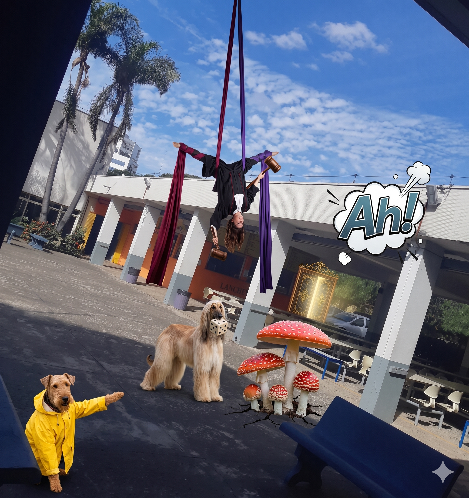

<em>5 beasts · 5 Knowledge Atoms</em>

_No image prompt saved._

#### Knowledge Atoms

### 🟧 [Ae] aerialist

**Concept**
💡 Bayesian updating is the process of revising your beliefs when you receive new information.

**Quote**
“"We have an initial belief, we receive some new information, and we revise our beliefs in this case in a probabilistic sense in light of this new information."”

**Story**
An Aerialist hangs upside down in a grand courtroom. She acts as the judge, declaring that all beliefs are temporary and must be changed when new facts emerge. She points her gavel at an Afghan hound who is waiting to present a case.

**Sensory**
—

### 🟧 [Af] Afghan hound

**Concept**
💡 Before receiving new information, you start with an unconditional probability, like rolling a fair die.

**Quote**
“"In the unconditional setting, we had the probability of A equal to 1 over 6."”

**Story**
The tall Afghan hound steps forward with a six-sided die in its mouth. He explains that before anyone knows the result, every number has an equal chance of winning. He drops the die on the floor, ignoring the giant mushrooms growing nearby, to prove the baseline state of the court.

**Sensory**
—

### 🟧 [Ag] Agaric fungi

**Concept**
💡 Conditional probability involves updating your chances based on new, restrictive information.

**Quote**
“"This sort of vertical line, this bar, represents a conditioning situation."”

**Story**
A cluster of giant red-and-white Agaric fungi grows right through the courtroom floor. One mushroom announces that the secret die roll was an even number. This restricts the possibilities. The mushroom then paints a large vertical bar on the wall to show that the court's decision is now conditional on this new clue.

**Sensory**
—

### 🟧 [Ah] Ah!�a sigh

**Concept**
💡 In the Monty Hall problem, revealing a goat provides crucial new information that changes the odds for the remaining unopened door.

**Quote**
“"Many people don't see this new information attached to door C because they don't see any physical change to door C; it was originally closed and remained closed."”

**Story**
A giant, floating word bubble that says "Ah!" lets out a loud, dramatic sigh over the courtroom. It acts as a game show host and reveals a goat behind a magical door. It sighs because the jury is confused. It explains that the other closed door now has better odds, even though it looks exactly the same as before.

**Sensory**
—

### 🟧 [Ai] Airedale terrier

**Concept**
💡 Bayesian updating is still effective even when the new information is imperfect, like a weather forecast.

**Quote**
“"A rational actor takes this data on board, updates their internal probabilities about the likelihood of rain, and alters their behavior."”

**Story**
An Airedale terrier wearing a raincoat interrupts the trial. It acts as a TV weather forecaster, predicting a high chance of rain based on imperfect data. Hearing this, the Aerialist quickly climbs higher on her silks, sensibly updating her plans to stay dry based on the terrier's news.

**Sensory**
—

<strong>Memory Palace 8: The Hypothesis Courtroom</strong> · Character: (unassigned palace 8) · 2 beasts · 2 atoms

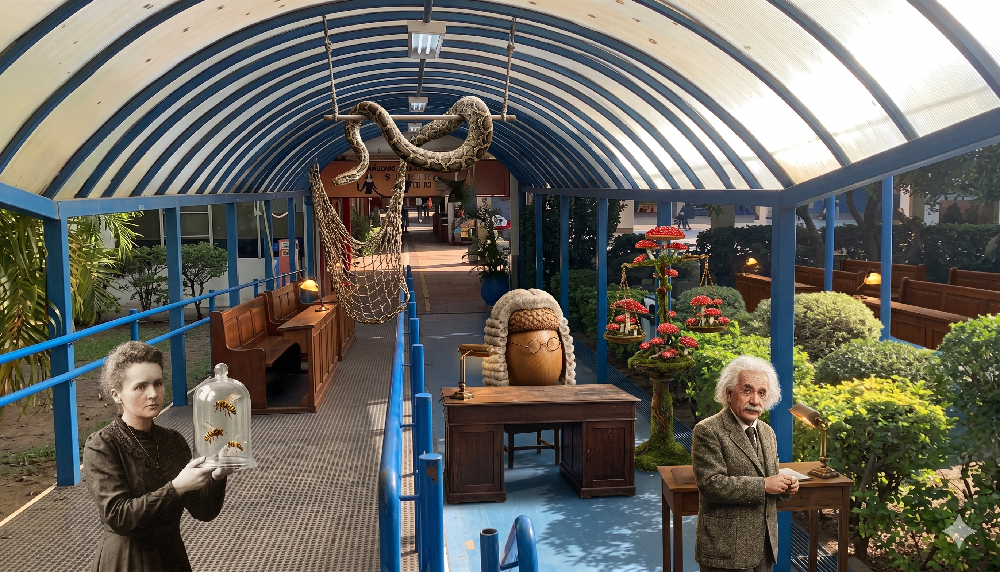

<em>2 beasts · 2 Knowledge Atoms</em>

_No image prompt saved._

#### Knowledge Atoms

### 🟧 [Ac] acorn

**Concept**
💡 The null hypothesis is the default expectation of 'no difference' based on current knowledge, which we must assume is true until proven wrong.

**Quote**
“"The null hypothesis is what we expect to see based on the knowledge that we currently have. The null hypothesis is commonly the 'no difference' hypothesis... We have to assume that the null hypothesis is true unless it can be proven to be wrong."”

**Story**
Albert Einstein walks into a large courtroom and places a giant acorn on the judge's desk. The acorn wears a white curly judge's wig and sits firmly in the center. Marie Curie steps forward holding a glass jar containing a calm bee and a wasp, demonstrating zero difference between them to the court. The acorn judge demands to be treated as the absolute truth, acting as a strict guard of the old rules until someone brings strong enough proof to defeat it.

**Sensory**
—

### 🟧 [Ad] adder

**Concept**
💡 The alternative hypothesis is a new idea that replaces the old belief when its weight of evidence tips the balance scale.

**Quote**
“"The alternative hypothesis presents a new idea, which could overturn or nullify the null hypothesis. If we accept the alternative hypothesis, we have to reject the null hypothesis, and the same would be true in reverse. It may be that the weight of evidence starts to fall in favor of the alternative hypothesis, and increasingly so, until we accept this new knowledge as truth."”

**Story**
A long adder snake swings high above the courtroom on a flying trapeze, hissing a brand new, shocking idea. The snake drops heavy red mushrooms onto a large brass balance scale below. It realizes its mouth can only hold one truth at a time; if the new evidence is heavy enough to tip the scale and crash down, the snake spits out its old beliefs and traps the acorn judge in a heavy rope net to replace it entirely.

**Sensory**
—

<strong>Memory Palace 7: Paradigms, Crisis, and Shifts</strong> · Character: (unassigned palace 7) · 5 beasts · 5 atoms

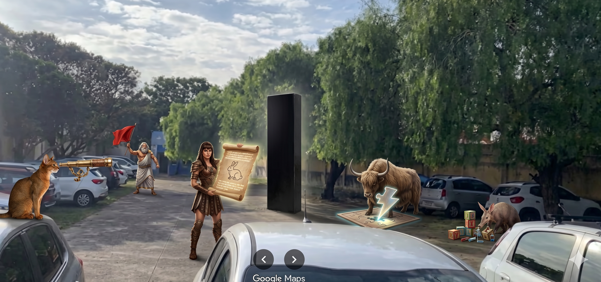

<em>5 beasts · 5 Knowledge Atoms</em>

_No image prompt saved._

#### Knowledge Atoms

### 🟧 [X] Xena, warrior woman

**Concept**
💡 A paradigm is a necessary map that provides the rules for mature research.

**Quote**
“"The paradigm provides a map whose details are elucidated by mature scientific research. And since nature is too complex and varied to be explored at random, that map is as essential as observation and experiment to science's continuing development. Through the theories they embody, paradigms prove to be constitutive of the research activity."”

**Story**
Xena, warrior woman, holds a giant, detailed map of a complex science lab. She shows the yak that this map contains glowing rules that actually build and structure their entire research game.

**Sensory**
—

### 🟧 [Y] yak

**Concept**
💡 An anomaly is a puzzle piece that refuses to fit the established rules.

**Quote**
“"An anomaly occurs when a piece of the puzzle just won't fit."”

**Story**
The heavy yak tries to use Xena's glowing rules to build a puzzle on the floor. However, the yak gets stuck holding a unique, lightning-shaped puzzle piece. It tries to smash the piece into the board, but it just will not fit anywhere in the normal setup.

**Sensory**
—

### 🟧 [Z] Zeus

**Concept**
💡 When an anomaly becomes too big to ignore, a crisis begins.

**Quote**
“"When, for these reasons or others like them, an anomaly comes to seem more than just another puzzle of normal science, the transition to crisis and to extraordinary science has begun."”

**Story**
Zeus sees the yak struggling with the broken piece. He realizes this is not just a normal puzzle problem. Zeus starts waving a red alarm flag, shouting to the aardvark that a massive crisis and extraordinary research have started.

**Sensory**
—

### 🟧 [Aa] aardvark

**Concept**
💡 Extraordinary science is marked by competing ideas, random trials, and philosophical debate.

**Quote**
“"The proliferation of competing articulations, the willingness to try anything, the expression of explicit discontent, the recourse to philosophy and to debate over fundamentals, all these are symptoms of a transition from normal to extraordinary research."”

**Story**
The aardvark ignores Xena's map entirely. Showing explicit discontent with the crisis, it starts trying anything, knocking over the yak's puzzle and debating philosophy with Zeus. It brings out dozens of competing, random ideas to fix the problem.

**Sensory**
—

### 🟧 [Ab] Abyssinian cat

**Concept**
💡 A paradigm shift changes your psychological perspective without changing the raw data.

**Quote**
“"A shift in paradigm is like the shift in perception from the rabbit to the duck in the gestalt image... nothing has changed apart from your psychological perspective. Two people with the same sensory impressions can see two different things."”

**Story**
The Abyssinian cat rests at the end of the street. It points a brass telescope at a drawing of a rabbit on Xena's map. Suddenly, its mind flips, and it sees a duck instead. The physical lines did not change at all, but the cat now sees something completely different from the exact same image.

**Sensory**
—

<strong>Memory Palace 6: Science vs. Pseudoscience</strong> · Character: Albert Einstein · 5 beasts · 5 atoms

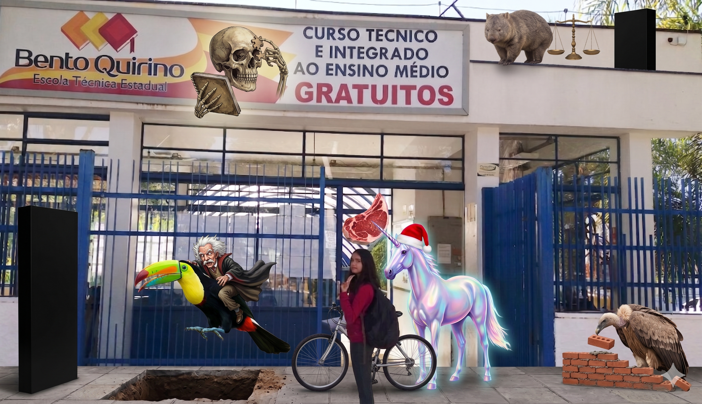

<em>5 beasts · 5 Knowledge Atoms</em>

_No image prompt saved._

#### Knowledge Atoms

### 🟧 [S] skull

**Concept**
💡 Fake science looks at the past and twists any random fact to fit the idea.

**Quote**
“"Freud was able to make just about any data point work in service of his theory."”

**Story**
A tall marks the start of this street. A floating skull holds a notebook of past events. It tries to force puzzle pieces that do not fit into its eye sockets, twisting every old piece of information to match what it wants to believe. It completely ignores the vulture nearby building a wall.

**Sensory**
—

### 🟧 [T] toucan

**Concept**
💡 Real science makes risky predictions about the future; ideas that cannot be tested or proven wrong have no scientific value.

**Quote**
“"Einstein's theory was truly risky... because if the future didn't match his predictions, then his theory would be conclusively disproven."”

**Story**
A colorful toucan flies forward, completely ignoring the skull. Albert Einstein rides on the toucan's back as it leaps over a deep, hazy pit. Albert knows that jumping over the pit is a dangerous test, and if the toucan cannot be tested against the fall, their whole journey is completely useless.

**Sensory**
—

### 🟧 [U] unicorn

**Concept**
💡 If you only look for facts that prove you are right, you will easily find them everywhere.

**Quote**
“"It's easy to find confirmation of a theory if you're looking for it."”

**Story**
A glowing unicorn wears a red Santa Claus hat and circles above the toucan. The unicorn only lowers its horn to pierce pieces of meat shaped exactly like the hat. By ignoring everything else on the street, the beast easily finds exactly what it wants to see.

**Sensory**
—

### 🟧 [V] vulture

**Concept**
💡 Real science tries to prove ideas wrong, because a strong scientific idea must clearly forbid certain things from happening.

**Quote**
“"Science disconfirms while pseudoscience confirms."”

**Story**
A vulture lands heavily in the middle of the road and builds a thick brick wall that stops the unicorn from running further. The bird spits out fake ideas and shakes its head firmly, using the wall to clearly block bad paths and look for flaws.

**Sensory**
—

### 🟧 [W] wombat

**Concept**
💡 We cannot be absolutely certain; we just believe what is most likely based on the facts we have.

**Quote**
“"Knowledge was about probability and contingency."”

**Story**
A heavy wombat stands at the end of the street. The wombat balances a set of scales on its broad back, carefully weighing Sherlock Holmes's notebook against a pile of fresh clues dropped by the floating skull. The wombat does not try to be perfect; it just finds which side is heavier right now.

**Sensory**
—

<strong>Memory Palace 5: Research Bias</strong> · Character: Daenerys Targaryen · 4 beasts · 4 atoms

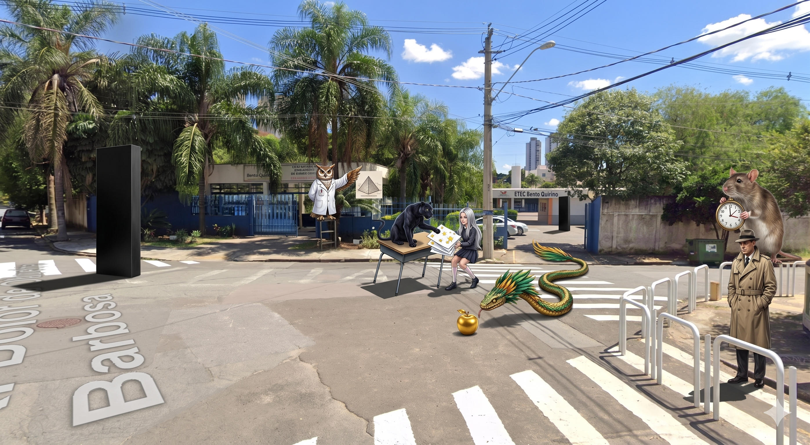

<em>4 beasts · 4 Knowledge Atoms</em>

_No image prompt saved._

#### Knowledge Atoms

### 🟧 [O] owl

**Concept**
💡 Selection bias leaves out an important group, which hurts the quality of the results.

**Quote**
—

**Story**
—

**Sensory**
—

### 🟧 [P] panther

**Concept**
💡 Analysis bias happens when you focus on certain facts just to get the answer you wanted from the start.

**Quote**
—

**Story**
—

**Sensory**
—

### 🟧 [Q] Quetzalcoatl

**Concept**
💡 Confirmation bias is our natural habit of only looking for facts that support what we already believe.

**Quote**
—

**Story**
—

**Sensory**
—

### 🟧 [R] rat

**Concept**
💡 Procedural bias happens when the way you collect data changes who answers or how they answer.

**Quote**
—

**Story**
—

**Sensory**
—

<strong>Memory Palace 4: Calculating Share and Demand</strong> · Character: (unassigned palace 4) · 3 beasts · 3 atoms

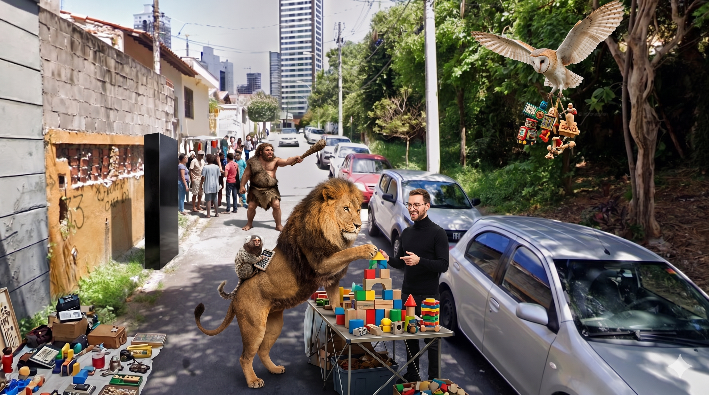

<em>3 beasts · 3 Knowledge Atoms</em>

_No image prompt saved._

#### Knowledge Atoms

### 🟧 [L] Lion

**Concept**
💡 Total utility is calculated by summing the appeal of all the product's parts.

**Quote**
—

**Story**
—

**Sensory**
—

### 🟧 [M] Marmoset

**Concept**
💡 Preference share is a statistical estimate of how likely a product is to be chosen over its competitors.

**Quote**
—

**Story**
—

**Sensory**
—

### 🟧 [N] Neanderthal

**Concept**
💡 Preference share allows you to estimate potential demand for a new product launch.

**Quote**
—

**Story**
—

**Sensory**
—

<strong>Memory Palace 3: Conjoint Analysis Basics</strong> · Character: Tony Stark (Iron Man) · 5 beasts · 5 atoms

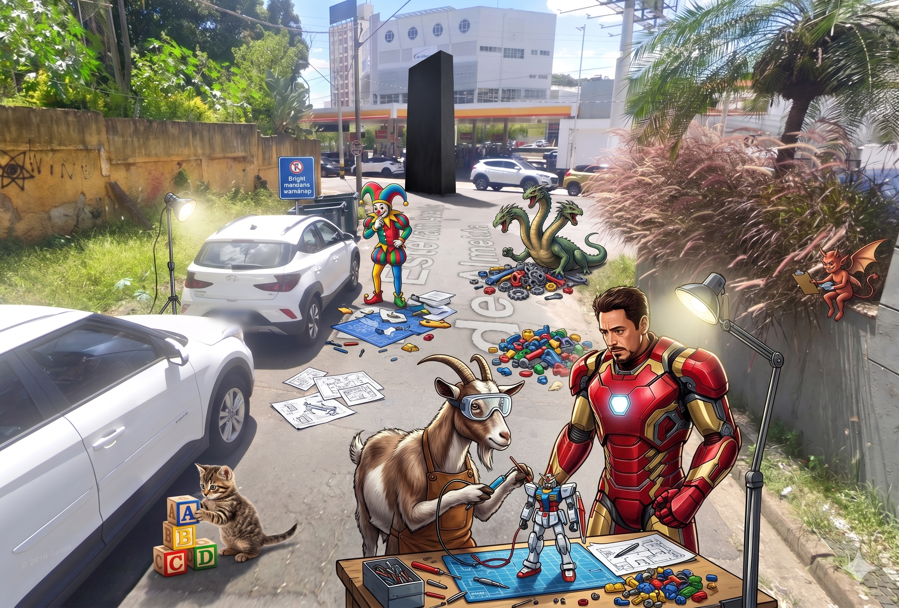

<em>5 beasts · 5 Knowledge Atoms</em>

_No image prompt saved._

#### Knowledge Atoms

### 🟧 [G] Goat

**Concept**
💡 Conjoint analysis is a powerful way to make product features better.

**Quote**
—

**Story**
—

**Sensory**
—

### 🟧 [H] Hydra

**Concept**
💡 The method forces choices, so it is often called trade-off analysis.

**Quote**
—

**Story**
—

**Sensory**
—

### 🟧 [I] Imp

**Concept**
💡 Data is gathered by having people do an exercise called the choice task.

**Quote**
—

**Story**
—

**Sensory**
—

### 🟧 [J] Jester

**Concept**
💡 The process uses a probabilistic methodology to find patterns in the choices.

**Quote**
—

**Story**
—

**Sensory**
—

### 🟧 [K] Kitten

**Concept**
💡 A part-worth utility score shows how a specific feature level affects the chance of selection.

**Quote**
—

**Story**
—

**Sensory**
—

<strong>Memory Palace 2: The Comparative Method of Valuation</strong> · Character: Steve Jobs · 4 beasts · 4 atoms

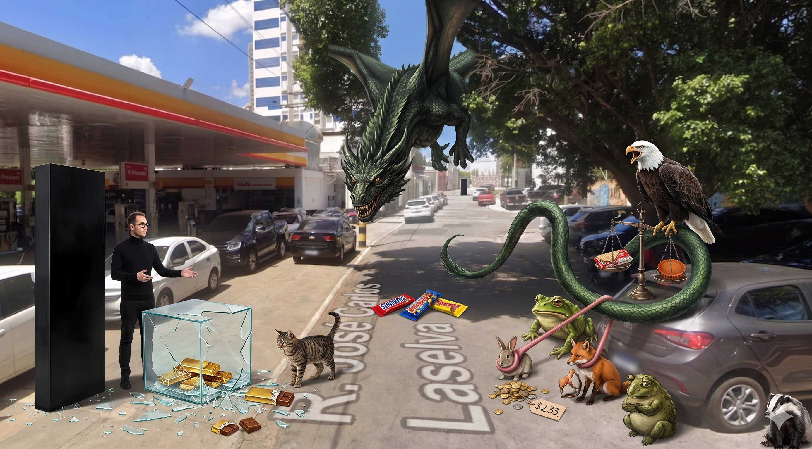

<em>4 beasts · 4 Knowledge Atoms</em>

_No image prompt saved._

#### Knowledge Atoms

### 🟧 [C] cat

**Concept**
💡 Old pricing methods fail because they ask customers to value a product completely by itself.

**Quote**
“"Most approaches to measuring WTP present customers with a product or service in isolation, as though their option is to either purchase it or go home empty-handed."”

**Story**
Steve Jobs tries to sell a chocolate bar to a cat trapped inside an empty glass box. The cat just stares at the single item and ignores the dragon flying above. Steve realizes that locking the buyer in an empty room makes no sense for testing real value.

**Sensory**
—

### 🟧 [D] dragon

**Concept**
💡 The comparative method fixes this by first asking what competing item you would buy instead.

**Quote**
“"What�s fundamentally different about our procedure is that rather than simply asking whether you would buy or not buy something, we first want an understanding of who the competition is."”

**Story**
A giant dragon dives from the sky and shatters the cat's glass box with its claws. It drops three different competing candies on the floor. It completely changes the game by demanding to know which of these rivals the buyer would pick if they walked away from the first product.

**Sensory**
—

### 🟧 [E] eagle

**Concept**
💡 To find the right price, this method asks what cost makes the customer perfectly equal in their choice between the two items.

**Quote**
“"What price for the KitKat would make you equally happy to buy the KitKat for this price or buy the M&Ms for $1.10?"”

**Story**
A large eagle sits comfortably on the dragon's tail holding a small balancing scale. It places Steve Jobs' chocolate on one side and the dragon's rival candy on the other. It squawks loudly at the buyers, asking exactly what dollar amount would make them feel exactly as happy to buy either one.

**Sensory**
—

### 🟧 [F] frog

**Concept**
💡 This strategy separates people who actually want the product from people who want nothing, revealing the true value.

**Quote**
“"Thanks to CMV�s ability to identify these different segments (that is, �buy� and �no-buy� groups), the researchers gained important insight into why some consumers had much lower WTP than others."”

**Story**
A slimy frog leaps through the market, knocking over the eagle's scale and ignoring the final at the end of the street. It aggressively uses its long tongue to separate the crowd into two distinct groups: those who actually eat candy, and those who would never buy any sweets at all. By isolating the fake buyers, the true price stands out clearly.

**Sensory**
—

<strong>Memory Palace 1: What your sample says vs. what the world might say</strong> · Character: Marie Curie · 2 beasts · 2 atoms

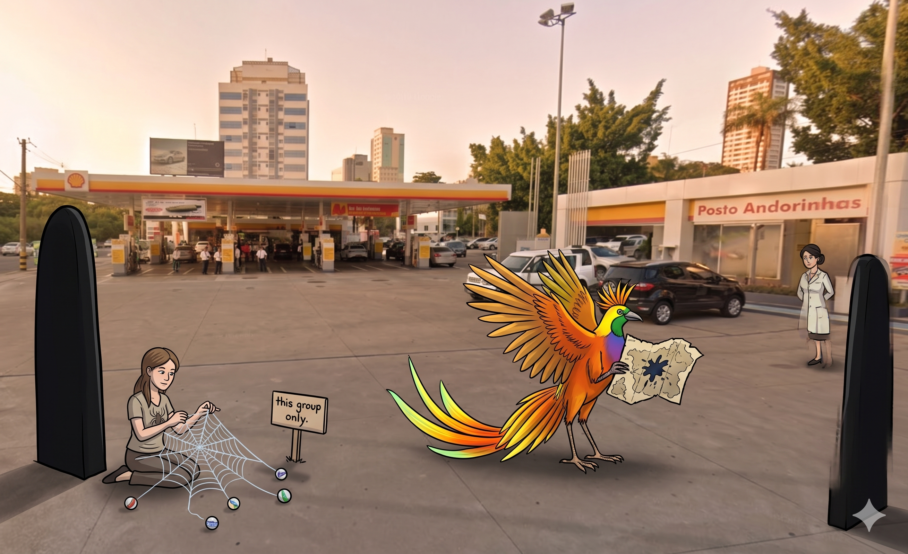

<em>2 beasts · 2 Knowledge Atoms</em>

_No image prompt saved._

#### Knowledge Atoms

### 🟧 [A] Arachne

**Concept**
💡 Descriptive evidence only tells what you saw in the sample. It does not say what the whole world does.

**Quote**
“It answers "What happened in this specific test?"”

**Story**
A spider-woman, Arachne, finishes a small web in front of a wooden sign. A woman in a short lab coat with dark hair in a low bun, like Marie Curie, hands her a cup with exactly three marbles. Arachne ties each marble to one knot, only the group she can touch. She nods toward a gaudy long-tailed bird on a bench, the bird of paradise, which is already lifting a much bigger map toward the sky.

**Sensory**
—

### 🟧 [B] bird of paradise

**Concept**
💡 Inferential evidence uses sample patterns to test ideas about a wider group, not only the people you tested.

**Quote**
“It answers "Can we confidently expect all users to behave this way?"”

**Story**
The bird of paradise flaps the big map and stamps a dark ink smudge (like a tiny �p� test mark) that flies off the small web toward the open sky. The woman in the lab coat points at the map, and the bird calls out the teacher�s line about the bigger �all users� question.

**Sensory**
—

