# Science

<strong>Memory Palace 20: Visual Analysis Definition</strong> · Character: SpongeBob SquarePants · 1 beast · 1 atom

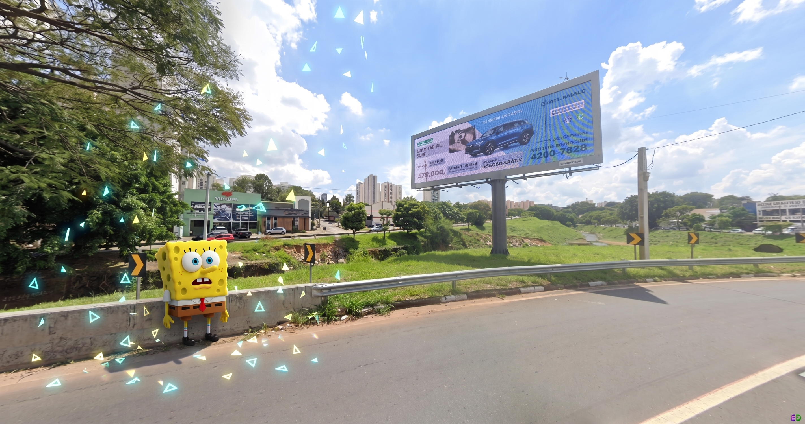

<em>1 beast · 1 Knowledge Atom</em>

#### Knowledge Atoms

### [By] Byron

**Concept**
💡 [I translate (cube) data] [into visual and (triangle) forms] [to leverage human (brain) processing] [for pattern recognition and (glitch) detection]

 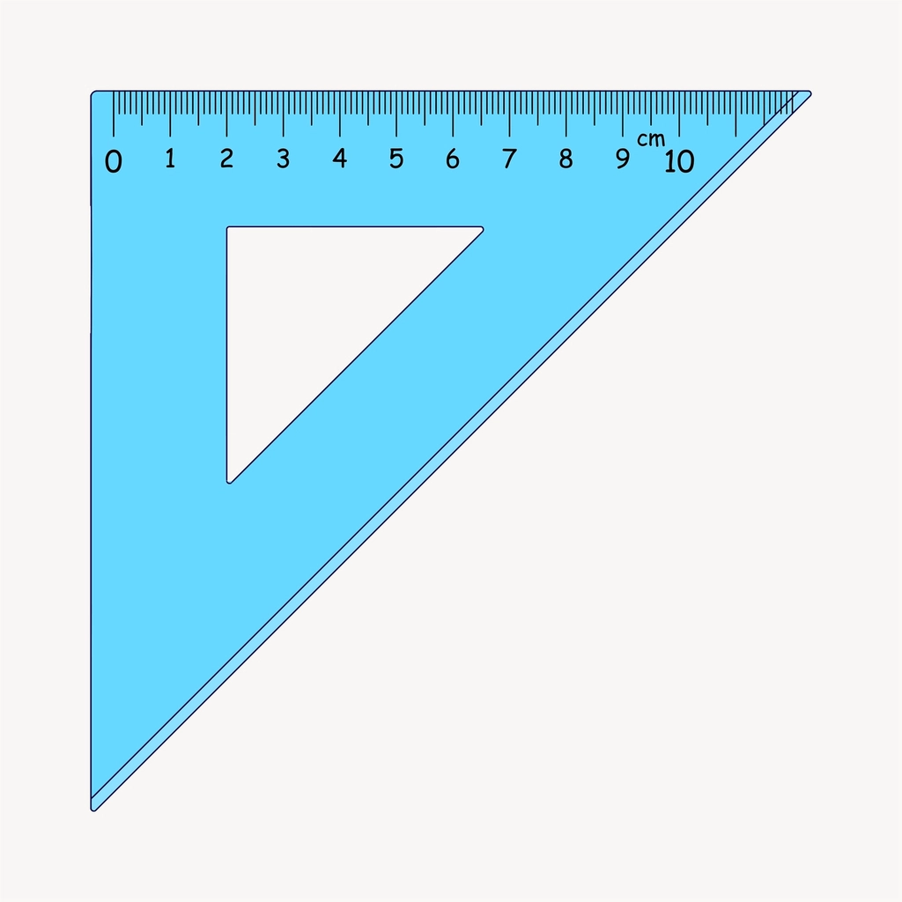 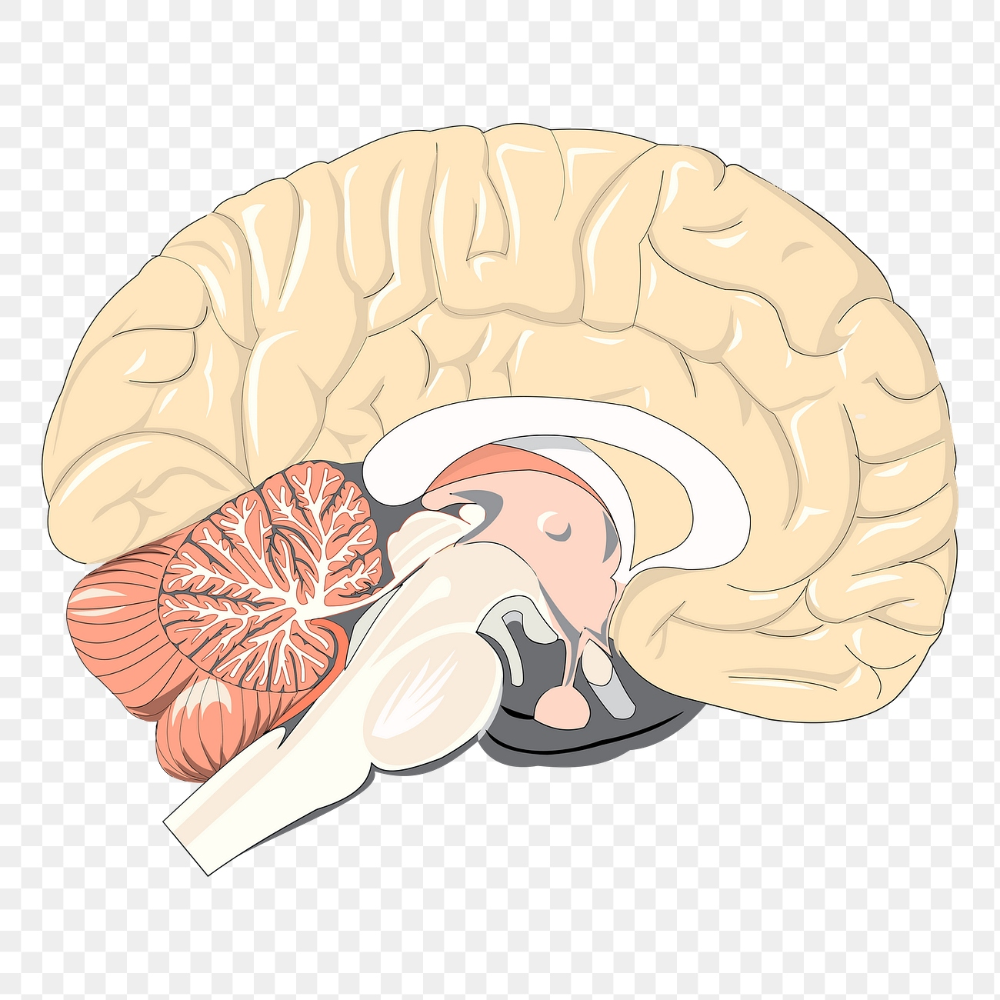 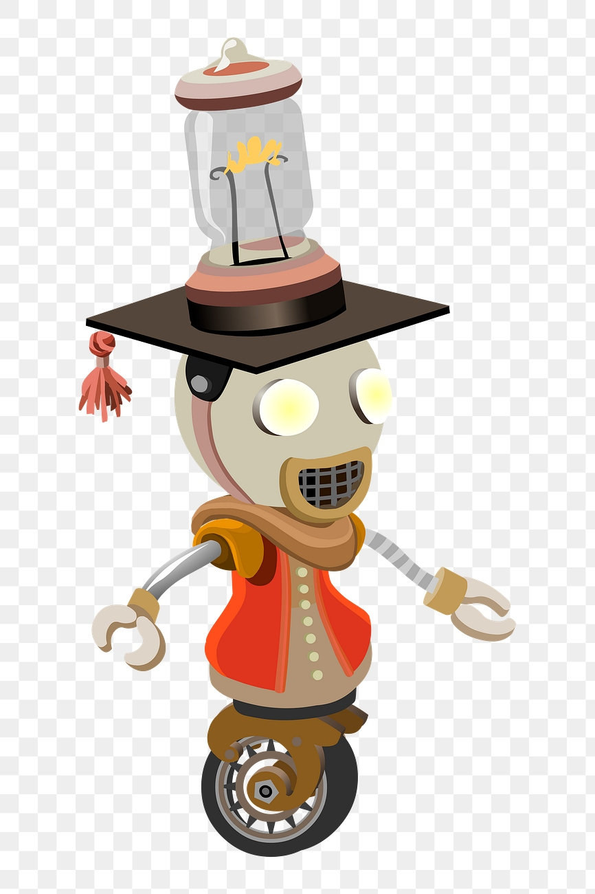

**Quote**
“Visual analysis is the translation of multidimensional data into visual, geometric, and topological representations to leverage human cognitive processing for pattern recognition, anomaly detection, and hypothesis generation.”

#### Notes

_No notes._

#### Gallery

_No gallery images._

<strong>Memory Palace 19: How and Why Questions</strong> · Character: Nikola Tesla · 4 beasts · 5 atoms

<em>4 beasts · 5 Knowledge Atoms</em>

#### Knowledge Atoms

### [Bx] Bone Xena, warrior woman

**Concept**
💡 For e-commerce trust, one strong question can combine how users build trust and why they see some signals as credible or risky.

**Quote**
“How do users construct trust in unfamiliar e-commerce websites, and why do they attribute credibility or risk to specific signals such as SSL indicators, customer reviews, flexibility policies, and interface design?”

### [Bw] Bone wombat

**Concept**
💡 A strong why-question asks why people give meaning, value, trust, distrust, concern, or risk to something.

**Quote**
“Why do [people/group] attribute meaning, value, concern, trust, or distrust to [phenomenon] in [context]?”

### [Bv] Bone vulture

**Concept**
💡 A strong how-question asks how people experience, interpret, perceive, or make sense of something in context.

**Quote**
“How do [people/group] experience, interpret, perceive, negotiate, construct, or make sense of [phenomenon] in [context]?”

### [Bu] butterfly

🟦 **Z1 · Qualitative purpose**

**Concept**
💡 Qualitative questions seek meanings, motives, lived experience, and process.

**Quote**
“the goal is to create research questions that explore processes, meanings, motivations, interpretations, and lived experiences instead of measuring frequency or testing numerical relationships.”

---

🟦 **Z2 · Avoid causal testing**

**Concept**
💡 Qualitative questions avoid count-based or causal-test questions.

**Quote**
“Does SSL increase trust?”

#### Notes

_No notes._

#### Gallery

_No gallery images._

<strong>Memory Palace 18: Definition and Characteristics</strong> · Character: Belo · 4 beasts · 4 atoms

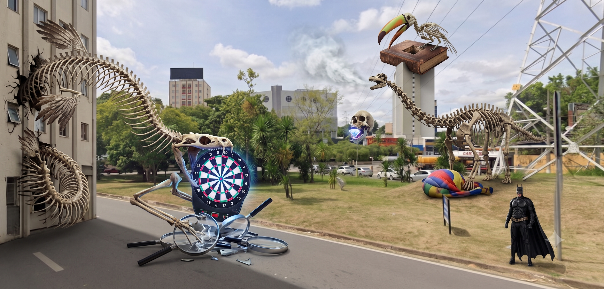

<em>4 beasts · 4 Knowledge Atoms</em>

#### Knowledge Atoms

### [Bt] Bone toucan

**Concept**
💡 Your question must stem from a clear gap in existing literature so you do not repeat old work.

**Quote**
“without a welldefined research Gap you're going to risk wasting your effort running after a question that's already been adequately answered”

### [Bs] Bone skull

**Concept**
💡 A question must be practical and possible to answer with available methods.

**Quote**
“even a super super tantalizing and thought-provoking research question isn't going to be of much value if you can't feasibly answer it”

### [Br] brontosaurus

**Concept**
💡 A research aim outlines a broad goal, while a research question takes that aim and narrows it down to a tighter focus.

**Quote**
“your research question should take the statement that is your research aim it should then narrow that down to a tighter Focus area and present it as a question”

### [Bq] Bone Quetzalcoatl

**Concept**
💡 A research question is the core target your study attempts to answer, and it must have a singular focus without cramming multiple variables together.

**Quote**
“a strong research question typically has a clear singular Focus so don't try to cram multiple questions into one”

#### Notes

_No notes._

#### Gallery

_No gallery images._

<strong>Memory Palace 17: Participatory Action Research Mechanics</strong> · Character: Darth Vader · 3 beasts · 3 atoms

<em>3 beasts · 3 Knowledge Atoms</em>

#### Knowledge Atoms

### [Bp] Bone panther

**Concept**
💡 People experiencing a problem are uniquely qualified to investigate it, guiding the inquiry themselves.

**Quote**
“Participatory Action Research is a model where the people most impacted by a social issue are the ones actually designing and conducting the research.”

### [Bo] bower-bird

**Concept**
💡 Participatory Action Research is an iterative loop of planning, acting, observing, and reflecting.

**Quote**
“It is a continuous spiral of plan, act, observe, and reflect, where each cycle informs the next.”

### [Bn] Bone Neanderthal

**Concept**
💡 Participatory Action Research shifts power from traditional extraction by empowering marginalized groups to co-create research that translates into tangible tools for social change.

**Quote**
“The 'action' part means that the data doesn't just sit on a shelf; it is directly translated into tools for healing, organizing, and fighting back against institutional violence.”

#### Notes

_No notes._

#### Gallery

_No gallery images._

<strong>Memory Palace 16: From Raw Data to Theory</strong> · Character: Charles Darwin · 3 beasts · 3 atoms

<em>3 beasts · 3 Knowledge Atoms</em>

#### Knowledge Atoms

### [Bm] Bone marmoset

**Concept**
💡 Selective coding chooses one core category and connects the main categories around it to build a theory.

**Quote**
“Selective coding is the final integration stage, where you identify one core category that explains the main pattern in the data.”

### [Bl] bloodhound

**Concept**
💡 Axial coding reconnects open codes into broader categories and shows how they relate.

**Quote**
“Axial coding reconnects the concepts created during open coding by organizing them around broader categories and identifying relationships between them.”

### [Bk] Bone kitten

**Concept**
💡 Open coding breaks raw qualitative data into small meaningful pieces and gives them concept labels.

**Quote**
“Open coding is the first stage, where you break the qualitative data into smaller meaningful pieces and label them as concepts.”

#### Notes

_No notes._

#### Gallery

_No gallery images._

<strong>Memory Palace 15: From Social Theory to Bosch UX Practice</strong> · Character: Ada Lovelace · 5 beasts · 5 atoms

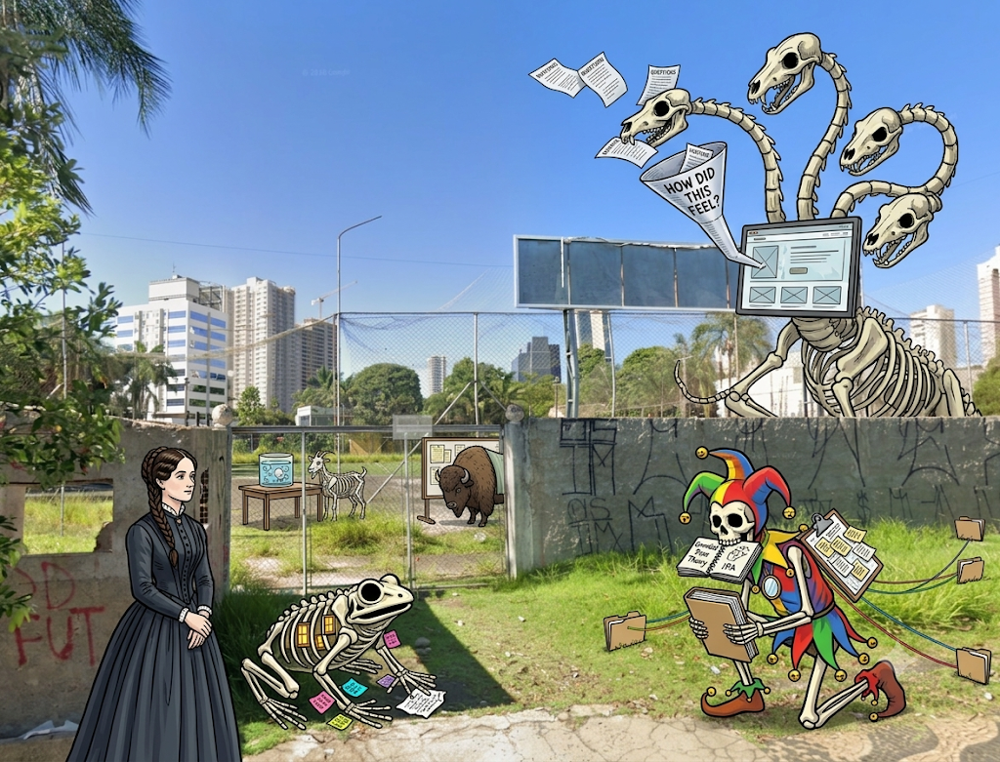

<em>5 beasts · 5 Knowledge Atoms</em>

#### Knowledge Atoms

### [Bj] Bone jester

**Concept**
💡 IPA turns each case into themes first, compares cases later, and keeps the researcher�s own role visible.

**Quote**
“�Successfully applying IPA requires the researcher to embrace reflexivity. The researcher is part of the meaning-making process, not a robot. Acknowledging personal biases, assumptions, and the interpretative role ensures the analysis remains close to the data and allows participant voices to guide the findings.�”

### [Bi] bison

**Concept**
💡 IPA analysis is slow and close: read the transcript again and again, mark what is said, notice how it is said, and ask what it may mean.

**Quote**
“�Conceptual comments explore what this might mean on a deeper level.�”

### [Bh] Bone Hydra

**Concept**
💡 For Bosch UX research, IPA starts with open questions about human experience.

**Quote**
“�Define the research question: Ask open-ended questions about human experience.�”

### [Bg] Bone goat

**Concept**
💡 IPA means understanding how one person makes sense of a personal experience. IPA pronunciation: Interpretative Phenomenological Analysis /?n't??rpr?t?t?v f??n??m?'n??l?d??k?l ?'n�l?s?s/.

**Quote**
“�IPA is built on a double hermeneutic. This means the researcher is trying to make sense of the participant trying to make sense of their own world. Participants are treated as active sense-makers, not passive subjects.�”

### [Bf] Bone frog

**Concept**
💡 The theory side can fit into one beast: people make meaning through lived experience, shared labels, and context.

**Quote**
“�Indexicality is critical to this process, meaning people make sense of things based strictly on the context or circumstances in which they are encountered.�”

#### Notes

_No notes._

#### Gallery

_No gallery images._

<strong>Memory Palace 14: Foundations of Reasoning</strong> · Character: (unassigned palace 14) · 4 beasts · 4 atoms

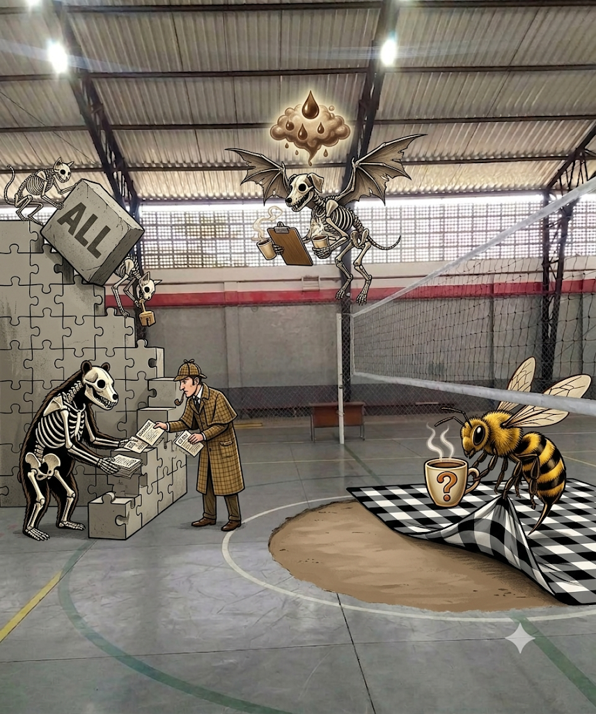

<em>4 beasts · 4 Knowledge Atoms</em>

#### Knowledge Atoms

### [Be] bee

**Concept**
💡 Abductive thinking makes the best possible guess based on obvious but incomplete clues.[cite: 1]

**Quote**
“Abductive reasoning or abduction is making a probable conclusion from what you know."[cite: 1]”

### [Bd] Bone Dog

**Concept**
💡 Inductive thinking works from specific details up to a big rule to prove an idea with real-world clues.[cite: 1]

**Quote**
“Inductive reasoning moves from specific to general."[cite: 1]”

### [Bc] Bone Cat

**Concept**
💡 Deductive thinking works from the top down, where true starting facts guarantee a true final answer.[cite: 1]

**Quote**
“Deductive reasoning is basically called a top-down approach, which means from generalizations to particulars, or from hypothesis to evidence."[cite: 1]”

### [Bb] Bone Bear

**Concept**
💡 Reasoning uses what you already know to build explanations and guess what happens next.[cite: 1]

**Quote**
“"Reasoning is the process of using existing knowledge to draw conclusions, make predictions, or construct explanations."[cite: 1]”

#### Notes

_No notes._

#### Gallery

_No gallery images._

<strong>Memory Palace 13: The Evolution of Grounded Theory</strong> · Character: Socrates · 5 beasts · 5 atoms

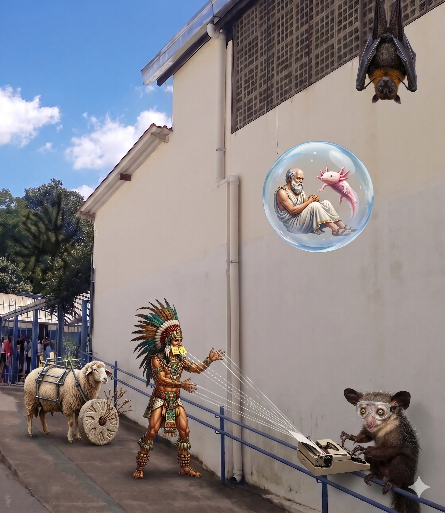

<em>5 beasts · 5 Knowledge Atoms</em>

#### Knowledge Atoms

### [Ba] bat

**Concept**
💡 Abduction is a complex reasoning loop where you guess a temporary explanation, then collect data to test it.

**Quote**
“"Abduction is a highly sophisticated form of reasoning where the researcher examines complex data, forms a number of provisional hypotheses to explain that data, and then explicitly returns to the field to collect more data to prove or disprove those hypotheses during the ongoing analysis."”

### [Az] Aztec

**Concept**
💡 Memos are continuous, informal notes written throughout the project that tie raw data to high-level ideas.

**Quote**
“"Memo-writing operates as the vital connective tissue of the analysis. Memos are continuous, informal, analytical notes written by the researcher throughout the entire lifecycle of the project."”

### [Ay] aye-aye

**Concept**
💡 Constructivists use action words ending in "ing" so the analysis focuses on dynamic processes over time.

**Quote**
“"By forcing the researcher to code exclusively with gerunds... the analysis remains dynamically focused on actions, processes, and changes over time."”

### [Ax] axolotl

**Concept**
💡 Constructivist theory says the researcher is not a neutral robot; their own background directly shapes the final theory.

**Quote**
“"Charmaz argued that researchers are not neutral observers; their past experiences, cultural backgrounds, academic training, and personal biases are inextricably woven into the very fabric of the data collection and theory generation processes."”

### [Aw] awassi sheep

**Concept**
💡 The 1990 update shifted away from natural discovery to strict rules, using an axial coding paradigm to map causes and effects between broken categories.

**Quote**
“Strauss and Corbin explicitly shifted away from Glaser�s philosophy of natural emergence. Instead, they engineered a highly prescriptive, analytical coding framework designed to generate theories systematically and verify them simultaneously within the data.”

#### Notes

_No notes._

#### Gallery

_No gallery images._

<strong>Memory Palace 12: Foundations and Constant Comparison</strong> · Character: (unassigned palace 12) · 4 beasts · 4 atoms

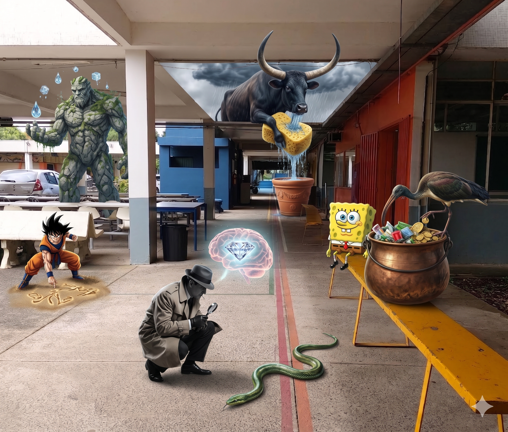

<em>4 beasts · 4 Knowledge Atoms</em>

#### Knowledge Atoms

### [Av] avocet

**Concept**
💡 Absolutely any material or observation you find counts as valid data for your study.[cite: 1]

**Quote**
“"All is data."[cite: 1]”

### [Au] auroch

**Concept**
💡 You stop collecting information when your concept is saturated and full, not when you reach a specific headcount.[cite: 1]

**Quote**
“"What you try to do is not representation, but saturation."[cite: 1]”

### [At] atlas

**Concept**
💡 You build theory step by step through the constant comparison of facts and concepts, creating early ideas that serve only as flexible guides.[cite: 1]

**Quote**
“"The most important concept in Grounded Theory is constant comparison."[cite: 1] "What you do is compare data with data, data with concepts, concepts with data, and then you start to compare concepts with concepts."[cite: 1] "Every concept is temporary and they're provisional, they give some guidance but that's it, you shouldn't pin them down, they're not written in stone."[cite: 1]”

### [As] asp

**Concept**
💡 Data collection and analysis happen at the same time to build theory until new inputs stop changing the final ideas.[cite: 1]

**Quote**
“"We are going to link data analysis with theory."[cite: 1] "Data analysis takes place during data collection."[cite: 1] "Theoretical saturation you reach when your theory is so sophisticated that every new data point, every new interview does not lead to more refinement of your concepts or your categories."[cite: 1]”

#### Notes

_No notes._

#### Gallery

_No gallery images._

<strong>Memory Palace 11: The Structure Web</strong> · Character: (unassigned palace 11) · 4 beasts · 4 atoms

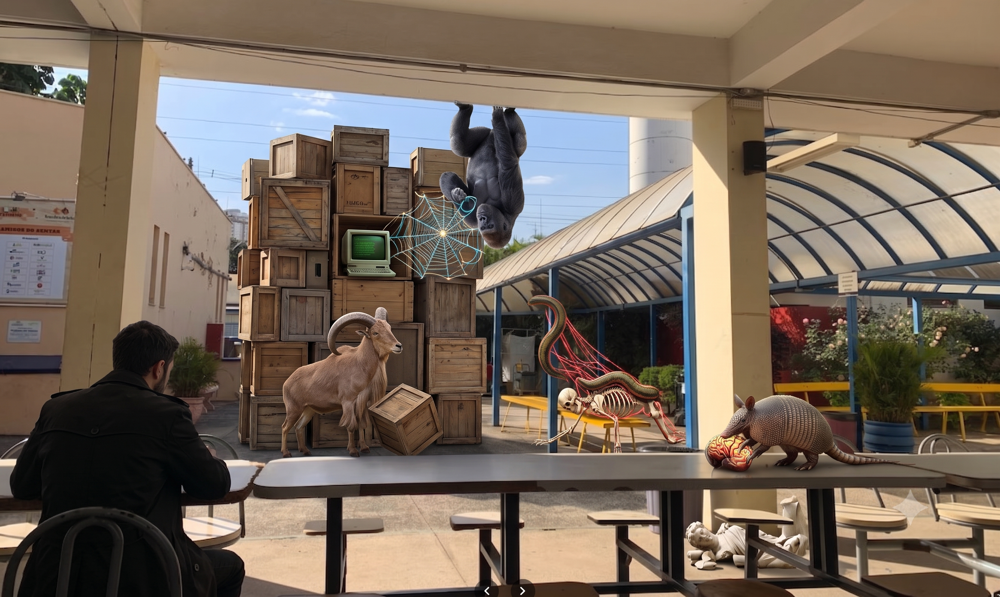

<em>4 beasts · 4 Knowledge Atoms</em>

#### Knowledge Atoms

### [Ar] armadillo

**Concept**
💡 Semantics focuses on the actual meaning of data rather than just its syntax or physical shape.

**Quote**
“"Semantics means we care about meaning, we care about understanding, rather than just the syntax, shape, or structure of the data."”

### [Aq] aquatic leech

**Concept**
💡 While a taxonomy is just a skeleton, an ontology adds all the detailed connections between members.

**Quote**
“"A taxonomy gives us just a skeleton maybe, and an ontology gives us the skeleton and fleshes out the various connections between all the different members."”

### [Ap] ape

**Concept**
💡 An ontology is a conceptual web that helps computers interpret data.

**Quote**
“"[An ontology is] either a set of n-tuples or a web of concepts that helps computers or AI understand your data."”

### [Ao] aoudad

**Concept**
💡 Taxonomies are hierarchical structures of boxes used for classifying items and individuals.

**Quote**
“"Taxonomies are a hierarchical structure that allow us to classify things... think of a bunch of different boxes and individuals can fit in one or many of those boxes."”

#### Notes

_No notes._

#### Gallery

_No gallery images._

<strong>Memory Palace 10: The Coin Flip Casino</strong> · Character: Isaac Newton · 5 beasts · 5 atoms

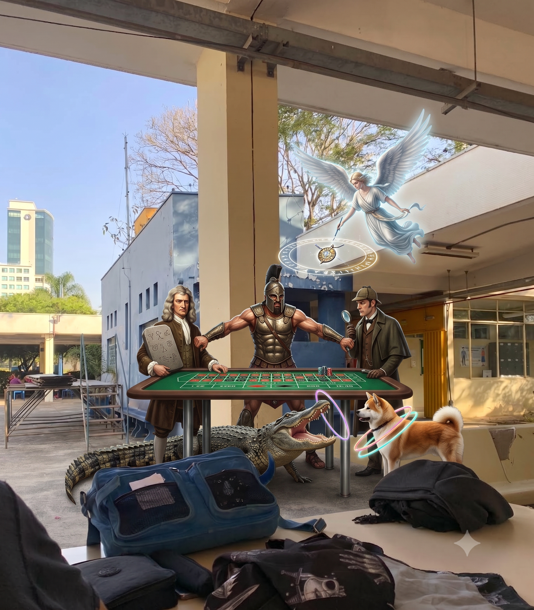

<em>5 beasts · 5 Knowledge Atoms</em>

#### Knowledge Atoms

### [An] [angel]

**Concept**
💡 A Bayesian credible interval allows you to state the actual probability that the true parameter lies within a specific range.

**Quote**
—

### [Am] [amulet]

**Concept**
💡 Bayes' theorem updates your prior beliefs by multiplying them by the likelihood of the new data.

**Quote**
—

### [Al] [alligator]

**Concept**
💡 In a frequentist confidence interval, the true parameter is a fixed constant; if you repeat the experiment, 95% of the generated intervals will catch that fixed truth.

**Quote**
—

### [Ak] [Akita (dog breed)]

**Concept**
💡 A p-value is the chance of getting data this extreme assuming the null hypothesis is true, not the probability that the coin is fair.

**Quote**
—

### [Aj] [Ajax]

**Concept**
💡 The philosophical difference is that frequentists see probability as a fixed long-run physical frequency, while Bayesians see it as a degree of belief that updates.

**Quote**
—

#### Notes

_No notes._

#### Gallery

_No gallery images._

<strong>Memory Palace 9: The Bayesian Courtroom</strong> · Character: (unassigned palace 9) · 5 beasts · 5 atoms

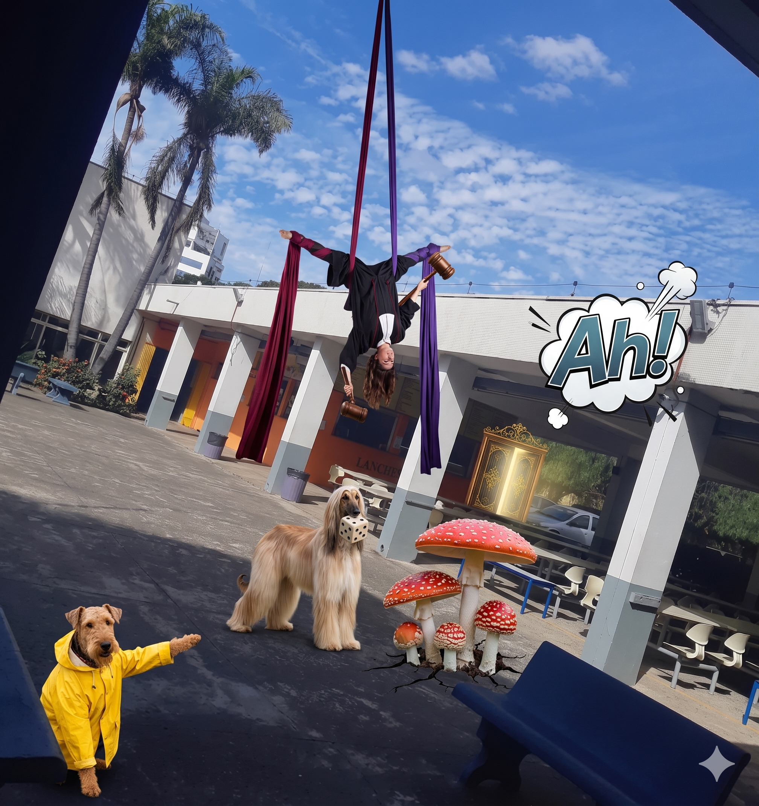

<em>5 beasts · 5 Knowledge Atoms</em>

#### Knowledge Atoms

### [Ai] Airedale terrier

**Concept**
💡 Bayesian updating is still effective even when the new information is imperfect, like a weather forecast.

**Quote**
“"A rational actor takes this data on board, updates their internal probabilities about the likelihood of rain, and alters their behavior."”

### [Ah] Ah!�a sigh

**Concept**
💡 In the Monty Hall problem, revealing a goat provides crucial new information that changes the odds for the remaining unopened door.

**Quote**
“"Many people don't see this new information attached to door C because they don't see any physical change to door C; it was originally closed and remained closed."”

### [Ag] Agaric fungi

**Concept**
💡 Conditional probability involves updating your chances based on new, restrictive information.

**Quote**
“"This sort of vertical line, this bar, represents a conditioning situation."”

### [Af] Afghan hound

**Concept**
💡 Before receiving new information, you start with an unconditional probability, like rolling a fair die.

**Quote**
“"In the unconditional setting, we had the probability of A equal to 1 over 6."”

### [Ae] aerialist

**Concept**
💡 Bayesian updating is the process of revising your beliefs when you receive new information.

**Quote**
“"We have an initial belief, we receive some new information, and we revise our beliefs in this case in a probabilistic sense in light of this new information."”

#### Notes

_No notes._

#### Gallery

_No gallery images._

<strong>Memory Palace 8: The Hypothesis Courtroom</strong> · Character: (unassigned palace 8) · 2 beasts · 2 atoms

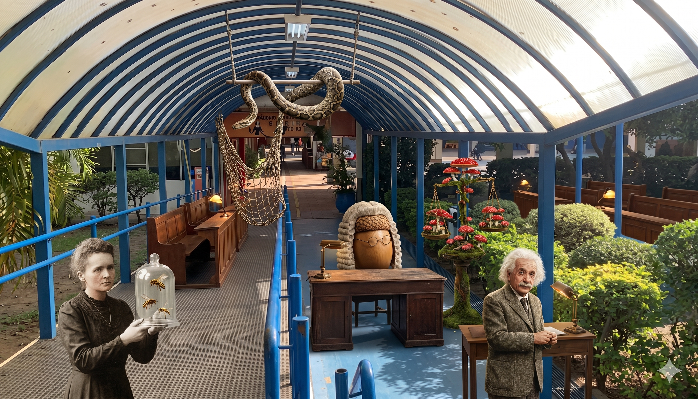

<em>2 beasts · 2 Knowledge Atoms</em>

#### Knowledge Atoms

### [Ad] adder

**Concept**
💡 The alternative hypothesis is a new idea that replaces the old belief when its weight of evidence tips the balance scale.

**Quote**
“"The alternative hypothesis presents a new idea, which could overturn or nullify the null hypothesis. If we accept the alternative hypothesis, we have to reject the null hypothesis, and the same would be true in reverse. It may be that the weight of evidence starts to fall in favor of the alternative hypothesis, and increasingly so, until we accept this new knowledge as truth."”

### [Ac] acorn

**Concept**
💡 The null hypothesis is the default expectation of 'no difference' based on current knowledge, which we must assume is true until proven wrong.

**Quote**
“"The null hypothesis is what we expect to see based on the knowledge that we currently have. The null hypothesis is commonly the 'no difference' hypothesis... We have to assume that the null hypothesis is true unless it can be proven to be wrong."”

#### Notes

_No notes._

#### Gallery

_No gallery images._

<strong>Memory Palace 7: Paradigms, Crisis, and Shifts</strong> · Character: (unassigned palace 7) · 5 beasts · 5 atoms

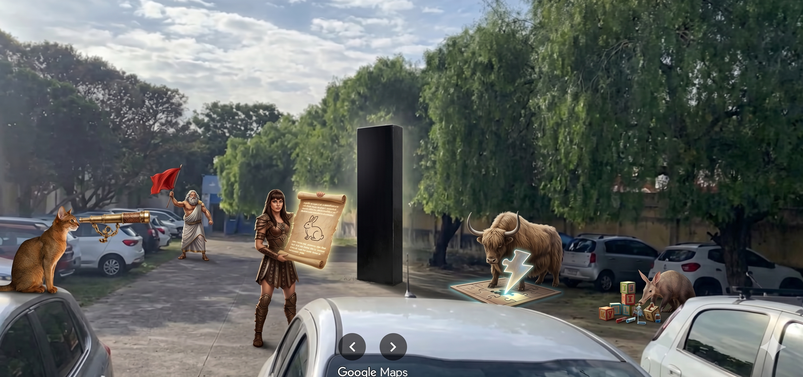

<em>5 beasts · 5 Knowledge Atoms</em>

#### Knowledge Atoms

### [Z] Zeus

**Concept**
💡 When an anomaly becomes too big to ignore, a crisis begins.

**Quote**
“"When, for these reasons or others like them, an anomaly comes to seem more than just another puzzle of normal science, the transition to crisis and to extraordinary science has begun."”

### [Y] yak

**Concept**
💡 An anomaly is a puzzle piece that refuses to fit the established rules.

**Quote**
“"An anomaly occurs when a piece of the puzzle just won't fit."”

### [X] Xena, warrior woman

**Concept**
💡 A paradigm is a necessary map that provides the rules for mature research.

**Quote**
“"The paradigm provides a map whose details are elucidated by mature scientific research. And since nature is too complex and varied to be explored at random, that map is as essential as observation and experiment to science's continuing development. Through the theories they embody, paradigms prove to be constitutive of the research activity."”

### [Ab] Abyssinian cat

**Concept**
💡 A paradigm shift changes your psychological perspective without changing the raw data.

**Quote**
“"A shift in paradigm is like the shift in perception from the rabbit to the duck in the gestalt image... nothing has changed apart from your psychological perspective. Two people with the same sensory impressions can see two different things."”

### [Aa] aardvark

**Concept**
💡 Extraordinary science is marked by competing ideas, random trials, and philosophical debate.

**Quote**
“"The proliferation of competing articulations, the willingness to try anything, the expression of explicit discontent, the recourse to philosophy and to debate over fundamentals, all these are symptoms of a transition from normal to extraordinary research."”

#### Notes

_No notes._

#### Gallery

_No gallery images._

<strong>Memory Palace 6: Science vs. Pseudoscience</strong> · Character: Albert Einstein · 5 beasts · 5 atoms

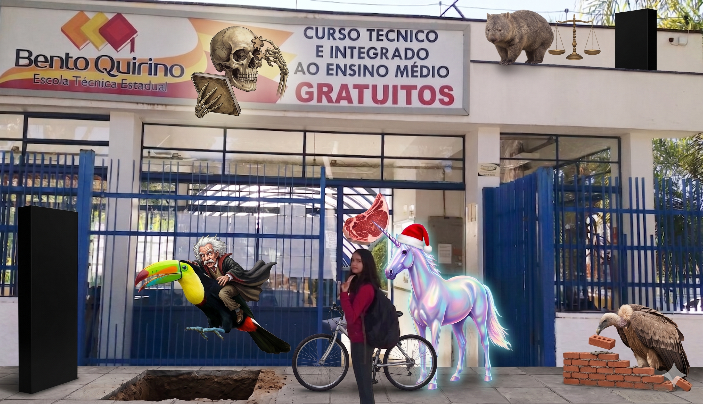

<em>5 beasts · 5 Knowledge Atoms</em>

#### Knowledge Atoms

### [W] wombat

**Concept**
💡 We cannot be absolutely certain; we just believe what is most likely based on the facts we have.

**Quote**
“"Knowledge was about probability and contingency."”

### [V] vulture

**Concept**
💡 Real science tries to prove ideas wrong, because a strong scientific idea must clearly forbid certain things from happening.

**Quote**
“"Science disconfirms while pseudoscience confirms."”

### [U] unicorn

**Concept**
💡 If you only look for facts that prove you are right, you will easily find them everywhere.

**Quote**
“"It's easy to find confirmation of a theory if you're looking for it."”

### [T] toucan

**Concept**
💡 Real science makes risky predictions about the future; ideas that cannot be tested or proven wrong have no scientific value.

**Quote**
“"Einstein's theory was truly risky... because if the future didn't match his predictions, then his theory would be conclusively disproven."”

### [S] skull

**Concept**
💡 Fake science looks at the past and twists any random fact to fit the idea.

**Quote**
“"Freud was able to make just about any data point work in service of his theory."”

#### Notes

_No notes._

#### Gallery

_No gallery images._

<strong>Memory Palace 5: Research Bias</strong> · Character: Daenerys Targaryen · 4 beasts · 4 atoms

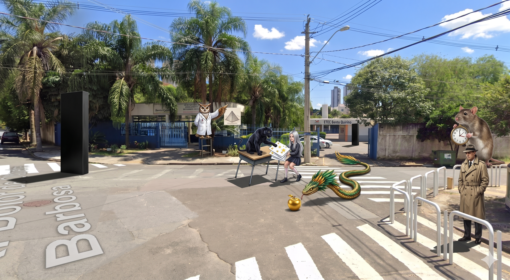

<em>4 beasts · 4 Knowledge Atoms</em>

#### Knowledge Atoms

### [R] rat

**Concept**
💡 Procedural bias happens when the way you collect data changes who answers or how they answer.

**Quote**
—

### [Q] Quetzalcoatl

**Concept**
💡 Confirmation bias is our natural habit of only looking for facts that support what we already believe.

**Quote**
—

### [P] panther

**Concept**
💡 Analysis bias happens when you focus on certain facts just to get the answer you wanted from the start.

**Quote**
—

### [O] owl

**Concept**
💡 Selection bias leaves out an important group, which hurts the quality of the results.

**Quote**
—

#### Notes

_No notes._

#### Gallery

_No gallery images._

<strong>Memory Palace 4: Calculating Share and Demand</strong> · Character: (unassigned palace 4) · 3 beasts · 3 atoms

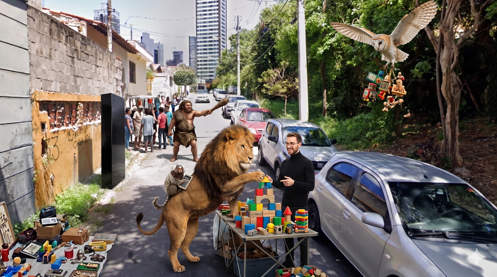

<em>3 beasts · 3 Knowledge Atoms</em>

#### Knowledge Atoms

### [N] Neanderthal

**Concept**
💡 Preference share allows you to estimate potential demand for a new product launch.

**Quote**
—

### [M] Marmoset

**Concept**
💡 Preference share is a statistical estimate of how likely a product is to be chosen over its competitors.

**Quote**
—

### [L] Lion

**Concept**
💡 Total utility is calculated by summing the appeal of all the product's parts.

**Quote**
—

#### Notes

_No notes._

#### Gallery

_No gallery images._

<strong>Memory Palace 3: Conjoint Analysis Basics</strong> · Character: Tony Stark (Iron Man) · 5 beasts · 5 atoms

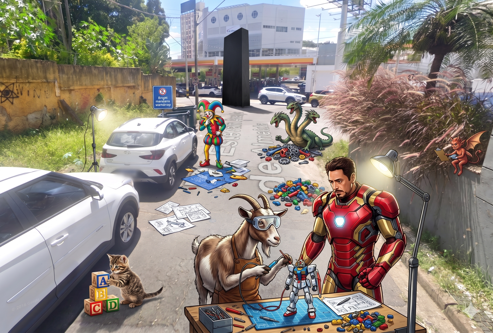

<em>5 beasts · 5 Knowledge Atoms</em>

#### Knowledge Atoms

### [K] Kitten

**Concept**
💡 A part-worth utility score shows how a specific feature level affects the chance of selection.

**Quote**
—

### [J] Jester

**Concept**
💡 The process uses a probabilistic methodology to find patterns in the choices.

**Quote**
—

### [I] Imp

**Concept**
💡 Data is gathered by having people do an exercise called the choice task.

**Quote**
—

### [H] Hydra

**Concept**
💡 The method forces choices, so it is often called trade-off analysis.

**Quote**
—

### [G] Goat

**Concept**
💡 Conjoint analysis is a powerful way to make product features better.

**Quote**
—

#### Notes

_No notes._

#### Gallery

_No gallery images._

<strong>Memory Palace 2: The Comparative Method of Valuation</strong> · Character: Steve Jobs · 4 beasts · 4 atoms

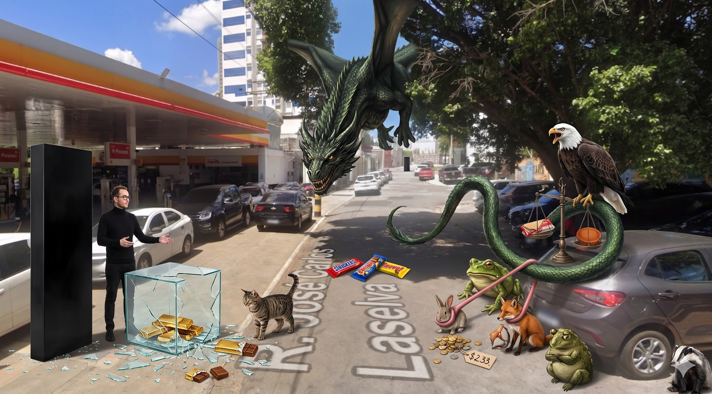

<em>4 beasts · 4 Knowledge Atoms</em>

#### Knowledge Atoms

### [F] frog

**Concept**
💡 This strategy separates people who actually want the product from people who want nothing, revealing the true value.

**Quote**
“"Thanks to CMV�s ability to identify these different segments (that is, �buy� and �no-buy� groups), the researchers gained important insight into why some consumers had much lower WTP than others."”

### [E] eagle

**Concept**
💡 To find the right price, this method asks what cost makes the customer perfectly equal in their choice between the two items.

**Quote**
“"What price for the KitKat would make you equally happy to buy the KitKat for this price or buy the M&Ms for $1.10?"”

### [D] dragon

**Concept**
💡 The comparative method fixes this by first asking what competing item you would buy instead.

**Quote**
“"What�s fundamentally different about our procedure is that rather than simply asking whether you would buy or not buy something, we first want an understanding of who the competition is."”

### [C] cat

**Concept**
💡 Old pricing methods fail because they ask customers to value a product completely by itself.

**Quote**
“"Most approaches to measuring WTP present customers with a product or service in isolation, as though their option is to either purchase it or go home empty-handed."”

#### Notes

_No notes._

#### Gallery

_No gallery images._

<strong>Memory Palace 1: What your sample says vs. what the world might say</strong> · Character: Marie Curie · 2 beasts · 2 atoms

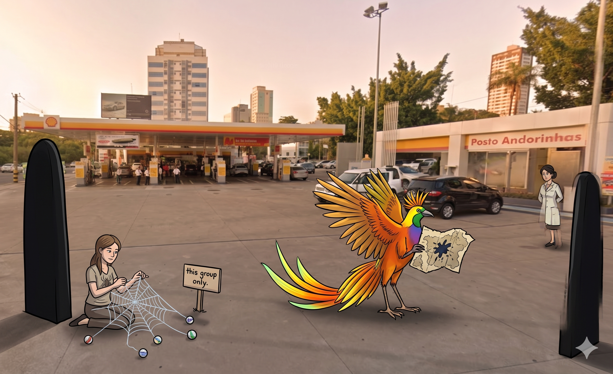

<em>2 beasts · 2 Knowledge Atoms</em>

#### Knowledge Atoms

### [B] bird of paradise

**Concept**
💡 Inferential evidence uses sample patterns to test ideas about a wider group, not only the people you tested.

**Quote**
“It answers "Can we confidently expect all users to behave this way?"”

### [A] Arachne

**Concept**
💡 Descriptive evidence only tells what you saw in the sample. It does not say what the whole world does.

**Quote**
“It answers "What happened in this specific test?"”

#### Notes

_No notes._

#### Gallery

_No gallery images._

