# Skills

<strong>Memory Palace 5: Cognitive Shuffling Fundamentals</strong> · Character: (unassigned palace 5) · 2 beasts · 6 atoms

<em>2 beasts · 6 Knowledge Atoms</em>

#### Knowledge Atoms

### [N] Neanderthal

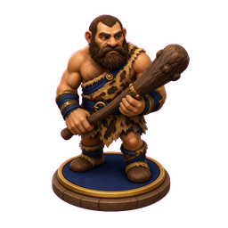

🟦 **Z1 · Z1 Head | Cognitive Shuffling**

**Concept**
💡 massive jaw aggressively chewing a glowing, random word generator that shoots out floating, emotionally neutral letters

**Keywords**
_No keywords yet_

**Quote**
“Ela envolve a substituição intencional de pensamentos indesejados que induzem a ansiedade por outros mais agradáveis e não estimulantes.”

**Story**
The Neanderthal's massive jaw aggressively chews a glowing, random word generator that shoots out floating, emotionally neutral letters to block out thoughts. Simultaneously, his thick hands violently crush a sharp, freezing-cold holographic calendar of worries, physically stopping the brain's high-alert planning. Finally, his chest cavity bursts open to vomit a stream of sweet, pastel-colored marshmallows, intentionally substituting the sharp tension with a bland, sugary calm.

---

🟦 **Z2 · Z2 Forelimbs | Insomnia Cause**

**Concept**
💡 thick, hairy hands violently crushing a sharp, freezing-cold holographic calendar of worries

**Keywords**
_No keywords yet_

**Quote**
“Ela envolve a substituição intencional de pensamentos indesejados que induzem a ansiedade por outros mais agradáveis e não estimulantes.”

**Story**
The Neanderthal's massive jaw aggressively chews a glowing, random word generator that shoots out floating, emotionally neutral letters to block out thoughts. Simultaneously, his thick hands violently crush a sharp, freezing-cold holographic calendar of worries, physically stopping the brain's high-alert planning. Finally, his chest cavity bursts open to vomit a stream of sweet, pastel-colored marshmallows, intentionally substituting the sharp tension with a bland, sugary calm.

---

🟦 **Z3 · Z3 Torso | Cognitive Refocusing**

**Concept**
💡 chest cavity bursting open to vomit a stream of sweet, pastel-colored marshmallows that drown out buzzing hornets

**Keywords**
_No keywords yet_

**Quote**
“Ela envolve a substituição intencional de pensamentos indesejados que induzem a ansiedade por outros mais agradáveis e não estimulantes.”

**Story**
The Neanderthal's massive jaw aggressively chews a glowing, random word generator that shoots out floating, emotionally neutral letters to block out thoughts. Simultaneously, his thick hands violently crush a sharp, freezing-cold holographic calendar of worries, physically stopping the brain's high-alert planning. Finally, his chest cavity bursts open to vomit a stream of sweet, pastel-colored marshmallows, intentionally substituting the sharp tension with a bland, sugary calm.

### [O] owl

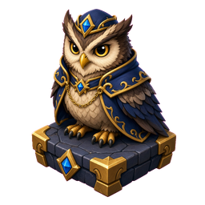

🟦 **Z1 · Z1 Head | Spelling Trick**

**Concept**
💡 sharp beak ripping a giant, screaming letter "B" out of a cake and firing it like a machine gun

**Keywords**
_No keywords yet_

**Quote**
“Quanto mais você praticar, mais forte você fica e mais fácil pode ser o seu uso, segundo ela.”

**Story**
The owl's sharp beak rips a giant, screaming letter "B" out of a cake, firing holographic toys like a loud machine gun until the letter is exhausted. As it fires, its wings aggressively flap a thick, pungent cloud of heavy dream-sand that physically melts the concrete into a sinking micro-dream. Meanwhile, its heavy torso vigorously lifts a massive barbell made of solid cheese, sweating and building immense physical strength through relentless repetition.

---

🟦 **Z2 · Z2 Forelimbs | Hypnagogic Composition**

**Concept**
💡 wings aggressively flapping a thick, pungent cloud of heavy dream-sand that melts the pavement

**Keywords**
_No keywords yet_

**Quote**
“Quanto mais você praticar, mais forte você fica e mais fácil pode ser o seu uso, segundo ela.”

**Story**
The owl's sharp beak rips a giant, screaming letter "B" out of a cake, firing holographic toys like a loud machine gun until the letter is exhausted. As it fires, its wings aggressively flap a thick, pungent cloud of heavy dream-sand that physically melts the concrete into a sinking micro-dream. Meanwhile, its heavy torso vigorously lifts a massive barbell made of solid cheese, sweating and building immense physical strength through relentless repetition.

---

🟦 **Z3 · Z3 Torso | Sleep Strategy Practice**

**Concept**
💡 heavy torso vigorously lifting a massive barbell made of solid cheese, sweating under the physical pressure

**Keywords**
_No keywords yet_

**Quote**
“Quanto mais você praticar, mais forte você fica e mais fácil pode ser o seu uso, segundo ela.”

**Story**
The owl's sharp beak rips a giant, screaming letter "B" out of a cake, firing holographic toys like a loud machine gun until the letter is exhausted. As it fires, its wings aggressively flap a thick, pungent cloud of heavy dream-sand that physically melts the concrete into a sinking micro-dream. Meanwhile, its heavy torso vigorously lifts a massive barbell made of solid cheese, sweating and building immense physical strength through relentless repetition.

#### Notes

_No notes._

#### Gallery

_No gallery images._

<strong>Memory Palace 4: Rotina de Ativação Matinal</strong> · Character: (unassigned palace 4) · 4 beasts · 4 atoms

<em>4 beasts · 4 Knowledge Atoms</em>

#### Knowledge Atoms

### [J] jester

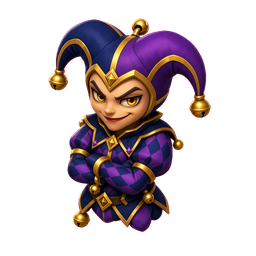

**Concept**
💡 Behavioral activation works because taking physical action forcefully shifts brain chemistry before motivation ever appears.

**Keywords**
_No keywords yet_

**Quote**
“a ação ela é soberana a ação vem antes da sensação a ação vem antes da motivação”

**Story**
A colossal medieval jester refuses to wait for hope; it aggressively bites Goku's arm and drags him across the rough pavement to force him into motion. The sheer friction of the dragging sparks a violent, tangible chemical explosion of energy in the air before Goku even realizes what is happening.

### [K] kitten

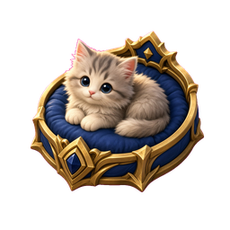

**Concept**
💡 The first five minutes involve gentle physical rotations of the neck, shoulders, and wrists to release an immediate energy boost.

**Keywords**
_No keywords yet_

**Quote**
“você vai fazer 10 movimentos leves de rotação do seu pescoço dos seus ombros e dos seus punhos”

**Story**
A majestic kitten violently twists its neck, shoulders, and wrists exactly ten times, creating a deafening cracking sound that physically shakes the street. As the joints rotate, literal heavy golden coins of dopamine shoot out of the kitten's fur and rain down hard on the concrete.

### [L] lion

**Concept**
💡 The second block emotionally warms the brain by placing a hand on the chest and deeply visualizing a simple pleasant experience.

**Keywords**
_No keywords yet_

**Quote**
“você coloca uma das mãos no seu peito fecha os olhos por um instante e você pode falar: eu me dou permissão para ir no meu ritmo devagar constante”

**Story**
A tiny lion leaps onto Goku's chest, forcefully slamming its heavy paws against his heart. The impact instantly projects a holographic, hyper-realistic breakfast floating in the air, radiating a comforting, burning warmth that physically melts the icy frost covering the street.

### [M] marmoset

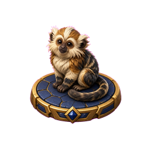

**Concept**
💡 The final five minutes require a small, practical action focused on personal sensory meaning rather than societal productivity.

**Keywords**
_No keywords yet_

**Quote**
“agir isso é importantíssimo você entender não focado na produtividade mas focado no significado”

**Story**
A hairy marmoset ignores a massive factory assembly line and instead gently splashes a single drop of freezing water onto Goku's face. The intense icy sting of that one meaningful drop shatters the surrounding heavy factory machinery into fine dust.

#### Notes

_No notes._

#### Gallery

_No gallery images._

<strong>Memory Palace 3: Vital Signs</strong> · Character: (unassigned palace 3) · 2 beasts · 5 atoms

<em>2 beasts · 5 Knowledge Atoms</em>

#### Knowledge Atoms

### [H] Hydra

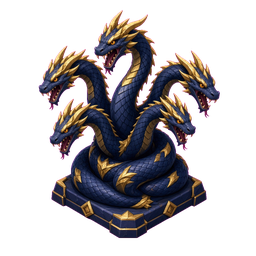

🟦 **Z1 · Z1 Head | BP Definition**

**Concept**
💡 massive jaws crunching down on thick, rubbery arteries, bursting them open loudly

**Keywords**
_No keywords yet_

**Quote**
“The mean arterial pressure is the average of the blood pressure on top and the blood pressure on the bottom.”

**Story**
Dracula stands by a stone gate, commanding a monstrous Hydra to attack the pavement. The beast's massive heads crunch down on exposed, thick rubbery arteries, popping them loudly as it screams the exact definition: "The force exerted by circulating blood against the inner walls of blood vessels, primarily the arteries. It is measured in millimeters of mercury (mmHg) and recorded as two distinct numbers: the systolic pressure (the force when the heart contracts and pushes blood out) over the diastolic pressure (the force when the heart rests and fills with blood between beats)." Simultaneously, its front claws splash a puddle of boiling blood, scorching the bright red numbers into the concrete as it hisses: "For a healthy, resting adult, a normal reading is strictly less than 120/80 mmHg (read as "120 over 80")." The heavy iron scale branded into the beast's chest violently balances the sizzling blood pools, spewing acrid smoke as the beast groans: "The mean arterial pressure is the average of the blood pressure on top and the blood pressure on the bottom."

---

🟦 **Z2 · Z2 Forelimbs | Normal range**

**Concept**
💡 front claws frantically splashing boiling, glowing red blood that scorches the ground

**Keywords**
_No keywords yet_

**Quote**
“The mean arterial pressure is the average of the blood pressure on top and the blood pressure on the bottom.”

**Story**
Dracula stands by a stone gate, commanding a monstrous Hydra to attack the pavement. The beast's massive heads crunch down on exposed, thick rubbery arteries, popping them loudly as it screams the exact definition: "The force exerted by circulating blood against the inner walls of blood vessels, primarily the arteries. It is measured in millimeters of mercury (mmHg) and recorded as two distinct numbers: the systolic pressure (the force when the heart contracts and pushes blood out) over the diastolic pressure (the force when the heart rests and fills with blood between beats)." Simultaneously, its front claws splash a puddle of boiling blood, scorching the bright red numbers into the concrete as it hisses: "For a healthy, resting adult, a normal reading is strictly less than 120/80 mmHg (read as "120 over 80")." The heavy iron scale branded into the beast's chest violently balances the sizzling blood pools, spewing acrid smoke as the beast groans: "The mean arterial pressure is the average of the blood pressure on top and the blood pressure on the bottom."

---

🟦 **Z3 · Z3 Torso | Mean Arterial Pressure**

**Concept**
💡 a giant, heavy iron scale violently branded into its chest, physically balancing the top and bottom blood pools while emitting burning smoke

**Keywords**
_No keywords yet_

**Quote**
“The mean arterial pressure is the average of the blood pressure on top and the blood pressure on the bottom.”

**Story**
Dracula stands by a stone gate, commanding a monstrous Hydra to attack the pavement. The beast's massive heads crunch down on exposed, thick rubbery arteries, popping them loudly as it screams the exact definition: "The force exerted by circulating blood against the inner walls of blood vessels, primarily the arteries. It is measured in millimeters of mercury (mmHg) and recorded as two distinct numbers: the systolic pressure (the force when the heart contracts and pushes blood out) over the diastolic pressure (the force when the heart rests and fills with blood between beats)." Simultaneously, its front claws splash a puddle of boiling blood, scorching the bright red numbers into the concrete as it hisses: "For a healthy, resting adult, a normal reading is strictly less than 120/80 mmHg (read as "120 over 80")." The heavy iron scale branded into the beast's chest violently balances the sizzling blood pools, spewing acrid smoke as the beast groans: "The mean arterial pressure is the average of the blood pressure on top and the blood pressure on the bottom."

### [I] imp

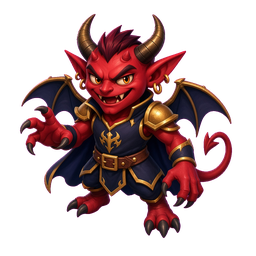

🟦 **Z1 · Z1 Head | HR Definition**

**Concept**
💡 a giant stopwatch swallowed whole, glowing blindingly through its throat

**Keywords**
_No keywords yet_

**Quote**
“For a healthy, resting adult, the normal range is 60 to 100 BPM.”

**Story**
Down the street at a parked car, the air smells intensely of burning ozone as a demonic imp lands. Its head violently swallows a giant glowing stopwatch that illuminates its throat from the inside, pulsing bright light as it squawks: "The speed at which the heart beats, quantified by the number of times the heart muscle contracts (beats) within a 60-second window." The imp's front arms violently vibrate against Dracula's chest, delivering intense electric shocks that forcefully rattle the vampire's fangs to dictate: "For a healthy, resting adult, the normal range is 60 to 100 BPM."

---

🟦 **Z2 · Z2 Forelimbs | Normal range**

**Concept**
💡 arms violently vibrating and shooting electric shocks

**Keywords**
_No keywords yet_

**Quote**
“For a healthy, resting adult, the normal range is 60 to 100 BPM.”

**Story**
Down the street at a parked car, the air smells intensely of burning ozone as a demonic imp lands. Its head violently swallows a giant glowing stopwatch that illuminates its throat from the inside, pulsing bright light as it squawks: "The speed at which the heart beats, quantified by the number of times the heart muscle contracts (beats) within a 60-second window." The imp's front arms violently vibrate against Dracula's chest, delivering intense electric shocks that forcefully rattle the vampire's fangs to dictate: "For a healthy, resting adult, the normal range is 60 to 100 BPM."

#### Notes

_No notes._

#### Gallery

_No gallery images._

<strong>Memory Palace 2: Enhancing Brain Focus and Retention</strong> · Character: (unassigned palace 2) · 2 beasts · 2 atoms

<em>2 beasts · 2 Knowledge Atoms</em>

#### Knowledge Atoms

### [F] frog

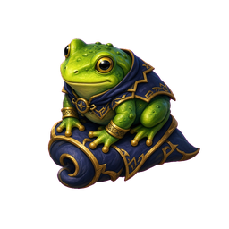

**Concept**
💡 Asking questions before reading primes the brain to filter for relevant information.

**Keywords**
_No keywords yet_

**Quote**
—

**Story**
—

### [G] goat

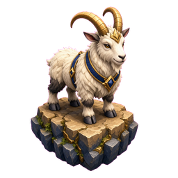

**Concept**
💡 Highlighting everything defeats the purpose of highlighting.

**Keywords**
_No keywords yet_

**Quote**
—

**Story**
—

#### Notes

_No notes._

#### Gallery

_No gallery images._

<strong>Memory Palace 1: Core Speed Reading Principles</strong> · Character: (unassigned palace 1) · 5 beasts · 5 atoms

<em>5 beasts · 5 Knowledge Atoms</em>

#### Knowledge Atoms

### [A] Arachne

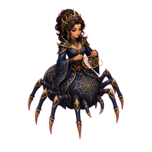

**Concept**
💡 The habit of pronouncing words in your head slows down reading.

**Keywords**
_No keywords yet_

**Quote**
—

**Story**
—

### [B] bird of paradise

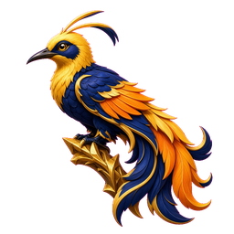

**Concept**
💡 Eyes backtracking or back skipping wastes time and ruins focus.

**Keywords**
_No keywords yet_

**Quote**
—

**Story**
—

### [C] cat

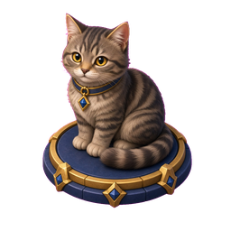

**Concept**
💡 Familiar words don't need to be pronounced internally to be understood.

**Keywords**
_No keywords yet_

**Quote**
—

**Story**
—

### [D] dragon

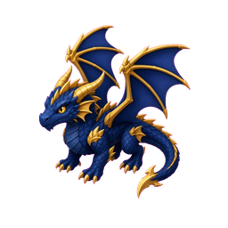

**Concept**
💡 Using a visual guide prevents regression and focuses attention.

**Keywords**
_No keywords yet_

**Quote**
—

**Story**
—

### [E] eagle

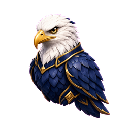

**Concept**
💡 Capturing multiple words per fixation expands reading speed.

**Keywords**
_No keywords yet_

**Quote**
—

**Story**
—

#### Notes

_No notes._

#### Gallery

_No gallery images._

