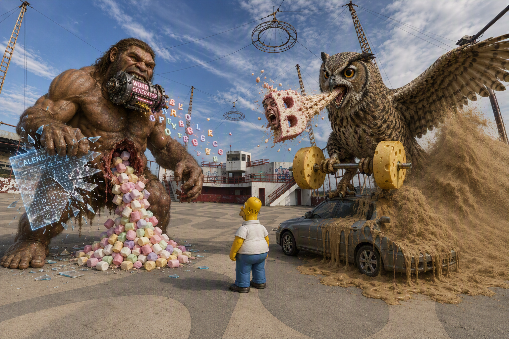
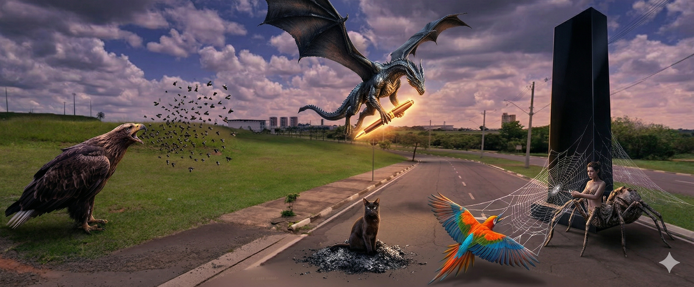

# Skills

<strong>Memory Palace 5: Cognitive Shuffling Fundamentals</strong> · Character: (unassigned palace 5) · 2 beasts · 6 atoms

<em>2 beasts · 6 Knowledge Atoms</em>

#### Knowledge Atoms

### [N] Neanderthal

🟦 **Z1 · Z1 Head | Cognitive Shuffling**

**Concept**
💡 massive jaw aggressively chewing a glowing, random word generator that shoots out floating, emotionally neutral letters

**Quote**
“Ela envolve a substituição intencional de pensamentos indesejados que induzem a ansiedade por outros mais agradáveis e não estimulantes.”

---

🟦 **Z2 · Z2 Forelimbs | Insomnia Cause**

**Concept**
💡 thick, hairy hands violently crushing a sharp, freezing-cold holographic calendar of worries

**Quote**
“Ela envolve a substituição intencional de pensamentos indesejados que induzem a ansiedade por outros mais agradáveis e não estimulantes.”

---

🟦 **Z3 · Z3 Torso | Cognitive Refocusing**

**Concept**
💡 chest cavity bursting open to vomit a stream of sweet, pastel-colored marshmallows that drown out buzzing hornets

**Quote**
“Ela envolve a substituição intencional de pensamentos indesejados que induzem a ansiedade por outros mais agradáveis e não estimulantes.”

### [O] owl

🟦 **Z1 · Z1 Head | Spelling Trick**

**Concept**
💡 sharp beak ripping a giant, screaming letter "B" out of a cake and firing it like a machine gun

**Quote**
“Quanto mais você praticar, mais forte você fica e mais fácil pode ser o seu uso, segundo ela.”

---

🟦 **Z2 · Z2 Forelimbs | Hypnagogic Composition**

**Concept**
💡 wings aggressively flapping a thick, pungent cloud of heavy dream-sand that melts the pavement

**Quote**
“Quanto mais você praticar, mais forte você fica e mais fácil pode ser o seu uso, segundo ela.”

---

🟦 **Z3 · Z3 Torso | Sleep Strategy Practice**

**Concept**
💡 heavy torso vigorously lifting a massive barbell made of solid cheese, sweating under the physical pressure

**Quote**
“Quanto mais você praticar, mais forte você fica e mais fácil pode ser o seu uso, segundo ela.”

#### Notes

_No notes._

#### Gallery

_No gallery images._

<strong>Memory Palace 4: Rotina de Ativação Matinal</strong> · Character: (unassigned palace 4) · 4 beasts · 4 atoms

<em>4 beasts · 4 Knowledge Atoms</em>

#### Knowledge Atoms

### [J] jester

**Concept**
💡 Behavioral activation works because taking physical action forcefully shifts brain chemistry before motivation ever appears.

**Quote**
“a ação ela é soberana a ação vem antes da sensação a ação vem antes da motivação”

### [K] kitten

**Concept**
💡 The first five minutes involve gentle physical rotations of the neck, shoulders, and wrists to release an immediate energy boost.

**Quote**
“você vai fazer 10 movimentos leves de rotação do seu pescoço dos seus ombros e dos seus punhos”

### [L] lion

**Concept**
💡 The second block emotionally warms the brain by placing a hand on the chest and deeply visualizing a simple pleasant experience.

**Quote**
“você coloca uma das mãos no seu peito fecha os olhos por um instante e você pode falar: eu me dou permissão para ir no meu ritmo devagar constante”

### [M] marmoset

**Concept**
💡 The final five minutes require a small, practical action focused on personal sensory meaning rather than societal productivity.

**Quote**
“agir isso é importantíssimo você entender não focado na produtividade mas focado no significado”

#### Notes

_No notes._

#### Gallery

_No gallery images._

<strong>Memory Palace 3: Vital Signs</strong> · Character: (unassigned palace 3) · 2 beasts · 5 atoms

<em>2 beasts · 5 Knowledge Atoms</em>

#### Knowledge Atoms

### [H] Hydra

🟦 **Z1 · Z1 Head | BP Definition**

**Concept**
💡 massive jaws crunching down on thick, rubbery arteries, bursting them open loudly

**Quote**
“The mean arterial pressure is the average of the blood pressure on top and the blood pressure on the bottom.”

---

🟦 **Z2 · Z2 Forelimbs | Normal range**

**Concept**
💡 front claws frantically splashing boiling, glowing red blood that scorches the ground

**Quote**
“The mean arterial pressure is the average of the blood pressure on top and the blood pressure on the bottom.”

---

🟦 **Z3 · Z3 Torso | Mean Arterial Pressure**

**Concept**
💡 a giant, heavy iron scale violently branded into its chest, physically balancing the top and bottom blood pools while emitting burning smoke

**Quote**
“The mean arterial pressure is the average of the blood pressure on top and the blood pressure on the bottom.”

### [I] imp

🟦 **Z1 · Z1 Head | HR Definition**

**Concept**
💡 a giant stopwatch swallowed whole, glowing blindingly through its throat

**Quote**
“For a healthy, resting adult, the normal range is 60 to 100 BPM.”

---

🟦 **Z2 · Z2 Forelimbs | Normal range**

**Concept**
💡 arms violently vibrating and shooting electric shocks

**Quote**
“For a healthy, resting adult, the normal range is 60 to 100 BPM.”

#### Notes

_No notes._

#### Gallery

_No gallery images._

<strong>Memory Palace 2: Enhancing Brain Focus and Retention</strong> · Character: (unassigned palace 2) · 2 beasts · 2 atoms

<em>2 beasts · 2 Knowledge Atoms</em>

#### Knowledge Atoms

### [F] frog

**Concept**
💡 Asking questions before reading primes the brain to filter for relevant information.

**Quote**
—

### [G] goat

**Concept**
💡 Highlighting everything defeats the purpose of highlighting.

**Quote**
—

#### Notes

_No notes._

#### Gallery

_No gallery images._

<strong>Memory Palace 1: Core Speed Reading Principles</strong> · Character: (unassigned palace 1) · 5 beasts · 5 atoms

<em>5 beasts · 5 Knowledge Atoms</em>

#### Knowledge Atoms

### [A] Arachne

**Concept**
💡 The habit of pronouncing words in your head slows down reading.

**Quote**
—

### [B] bird of paradise

**Concept**
💡 Eyes backtracking or back skipping wastes time and ruins focus.

**Quote**
—

### [C] cat

**Concept**
💡 Familiar words don't need to be pronounced internally to be understood.

**Quote**
—

### [D] dragon

**Concept**
💡 Using a visual guide prevents regression and focuses attention.

**Quote**
—

### [E] eagle

**Concept**
💡 Capturing multiple words per fixation expands reading speed.

**Quote**
—

#### Notes

_No notes._

#### Gallery

_No gallery images._

