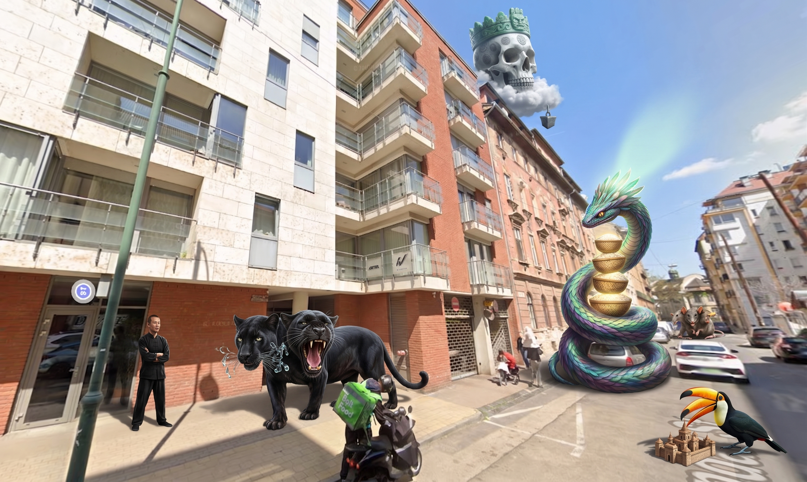
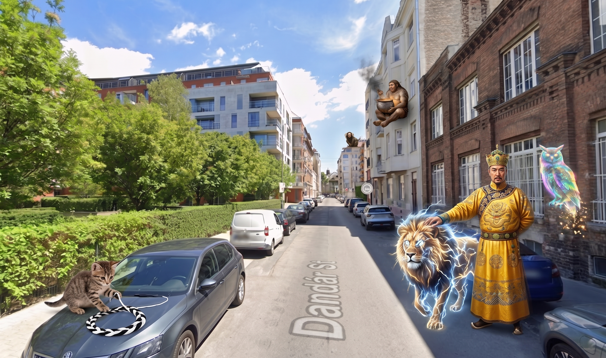
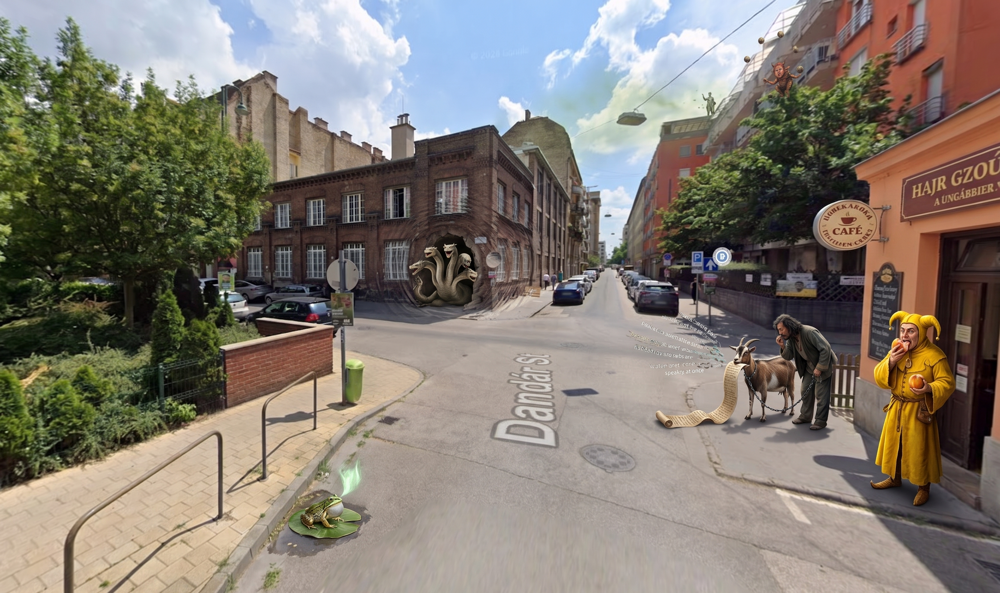
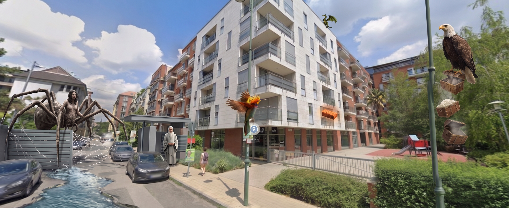

# Taoism

_4 Memory Palaces · newest first_

_Tap a Memory Palace to expand · beasts grouped like the dashboard · newest open by default_

---

<strong>Memory Palace 4: Religious Development & Pantheon</strong> · Character: (unassigned palace 4) · 5 beasts · 5 atoms

<em>5 beasts · 5 Knowledge Atoms</em>

_No image prompt saved._

#### Knowledge Atoms

<strong>Beast</strong> · [P] panther

**Concept**
💡 Taoism splits into Daojia (a school of teachings and texts) and Daojiao (an organized religion).

**Quote**
“The English word Taoism is often used to translate two distinct terms in Chinese: Daojia (道家; dàojiā; “School/Tradition of the Dao”) is a Han-dynasty label used to classify teachings and texts... Daojiao (道教; dàojiào; “Teachings of the Dao,” often rendered “Taoism” or 'Daoism' in the sense of an organized religion).”

**Story**
A two-headed panther stands at a left-side gate. One head whispers riddles that chime like glass in wind. The other bellows temple gongs so loud the whispers go silent, then the chimes cut the gongs. Bruce Lee stands still and tracks which sound is winning.

**Sensory**
👂 auditory

<strong>Beast</strong> · [Q] Quetzalcoatl

**Concept**
💡 The Way of the Celestial Masters was the first organized Taoist group, started by Zhang Daoling after a vision of Laozi.

**Quote**
“The first organized form of Taoism was the Way of the Celestial Masters, which developed from the Five Pecks of Rice movement at the end of the 2nd century CE. The latter had been founded by Zhang Daoling, who was said to have had a vision of Laozi in 142 CE”

**Story**
A huge feathered serpent coils around a right-side parked car and stacks five glowing pecks of rice into a ranked pile. Its feathers throw a sage-vision into the sky, bright as a second sun. The rice keeps climbing itself into a taller, neater tower.

**Sensory**
👁️ visual

<strong>Beast</strong> · [R] rat

**Concept**
💡 The Three Pure Ones are the highest Taoist gods, three faces of the Tao as it takes form.

**Quote**
“Three Purities were the supreme Taoist deities: the Celestial Worthy of Primordial Beginning, the Celestial Worthy of Numinous Treasure, and the Celestial Worthy of the Tao and its Virtue.”

**Story**
A three-headed rat at the far end of the street bites three cheeses at once. The first tastes like nothing at all, the second like every book and law in one bite, the third like way-and-virtue tea so old it has no temperature. The three tastes crash in your mouth as if you swallowed the sky's layout.

**Sensory**
👅 gustatory

<strong>Beast</strong> · [S] skull

**Concept**
💡 The Jade Emperor rules the sky in Taoist belief and runs it like an old Chinese court.

**Quote**
“Underneath the Three Pure Ones, the next ruling power is the Jade Emperor (Yuhuang Dadi, 玉皇大帝). He functions as the sovereign ruler of heaven who administers the cosmos through a vast celestial bureaucracy modeled on the imperial court of ancient China.”

**Story**
A giant skull in a jade crown sits on a cloud-throne above a roof, bone so smooth and cold it burns your fingers. Each stamp of its seal slides a star to a new place. Bruce Lee feels the stamp's weight drop through the street like a frozen anvil.

**Sensory**
✋ tactile

<strong>Beast</strong> · [T] toucan

**Concept**
💡 Quanzhen is a monastic Taoist school that trains inner alchemy and blends three teachings.

**Quote**
“In the 12th century, the Quanzhen (Complete Perfection) School was founded in Shandong by the sage Wang Chongyang (1113–1170)... The Quanzhen school was syncretic, combining elements from Buddhism and Confucianism with Taoist tradition.”

**Story**
A toucan with three beaks builds a tiny monastery on a near-right corner. One beak smells of temple incense, one of wet ink and paper, one of bitter alchemy herbs. The three smells fuse into one hard scent that fills the doorway.

**Sensory**
👃 olfactory

<strong>Memory Palace 3: Cosmology & The Body</strong> · Character: The Jade Emperor · 5 beasts · 5 atoms

<em>5 beasts · 5 Knowledge Atoms</em>

_No image prompt saved._

#### Knowledge Atoms

<strong>Beast</strong> · [K] kitten

**Concept**
💡 Yin and yang are the paired forces (dark/light, soft/hard, and so on) whose play shapes the world.

**Quote**
“The main distinction in Taoist cosmology is that between yin and yang, which applies to various sets of complementary ideas: bright – dark, light – heavy, soft – hard, strong – weak, above – below, ruler – minister, male – female, and so on.”

**Story**
A kitten on a left-side parked car bats a ball of yarn that is half pitch-black and half blinding white. The two halves braid themselves into a spinning circle on the hood. The contrast is so sharp it hurts to look at.

**Sensory**
👁️ visual

<strong>Beast</strong> · [L] lion

**Concept**
💡 Qi is the living stuff of the universe, the body of the Tao you can feel in all things.

**Quote**
“According to Livia Kohn, qi is 'the cosmic energy that pervades all. The concrete aspect of Tao, qi is the material force of the universe, the basic stuff of nature.'”

**Story**
A lion made of crackling energy walks along a right-side wall, paws that never quite touch the street. The air thickens and a hum presses into your skin. The Jade Emperor grips the mane, which feels like a solid brick and a flowing gas at once.

**Sensory**
✋ tactile

<strong>Beast</strong> · [M] marmoset

**Concept**
💡 Wuxing is the five phases — wood, fire, earth, metal, water — used to explain how things change.

**Quote**
“Another important set of notions associated with the same school of yinyang are the “Five Phases” (wuxing) or “powers” (wude): water, fire, wood, metal, and earth.”

**Story**
A marmoset on a far facade juggles five orbs that scream five ways: fire crackle, water rush, wood creak, metal clang, earth rumble. When the orbs clash, the five noises braid into one blast that shakes windows. Each orb keeps its own sound even while they mix.

**Sensory**
👂 auditory

<strong>Beast</strong> · [N] Neanderthal

**Concept**
💡 Neidan is inner alchemy: you change jing, qi, and shen inside the body to live longer and change the spirit.

**Quote**
“Internal alchemy (neidan, literally: 'internal elixir'), which focuses on the transformation and increase of qi in the body, developed during the late imperial period (especially during the Tang) and is found in almost all Taoist schools today”

**Story**
A Neanderthal sits on a balcony in a still pose, with a cauldron boiling inside his chest. Three smells pour out: earthy jing, sharp electric qi, and sweet shen. One deep breath braids the three smells into a single burning scent.

**Sensory**
👃 olfactory

<strong>Beast</strong> · [O] owl

**Concept**
💡 Xian are immortals who gain strange powers by mastering the Tao, body and spirit both.

**Quote**
“Taoists who sought to become one of the many different types of immortals, such as xian or zhenren, wanted to 'ensure complete physical and spiritual immortality'.”

**Story**
An owl of shifting light perches on a near-right wall. It sheds feathers that feel like solid glass, then melt into warm light the second you touch them. Your hand passes through the owl as if the bird were heat without a body.

**Sensory**
✋ tactile

<strong>Memory Palace 2: Foundational Texts & Figures</strong> · Character: (unassigned palace 2) · 5 beasts · 5 atoms

<em>5 beasts · 5 Knowledge Atoms</em>

_No image prompt saved._

#### Knowledge Atoms

<strong>Beast</strong> · [F] frog

**Concept**
💡 Laozi is the traditional founder of Taoism, but scholars debate whether he was a real person.

**Quote**
“A common tradition holds that Laozi founded Taoism. Laozi's historicity is disputed, with many scholars seeing him as a legendary founding figure.”

**Story**
One frog sits on a lily pad in a curb puddle by a left-side wall. Its throat-sack projects a flickering sage into the air. Glasses grow out of the frog's own face and the sage image blinks out, then snaps back, then dies again.

**Sensory**
👁️ visual

<strong>Beast</strong> · [G] goat

**Concept**
💡 The Tao Te Ching is the core Taoist book, a short poetic text tied to Laozi.

**Quote**
“The Tao Te Ching, attributed to Laozi, was composed between the 4th and 6th century BCE.”

**Story**
A goat chained to a right-side fence chews a scroll that talks while it is eaten. The chew sounds like water and rock speaking at the same time. Zhuangzi leans in to catch the poem-sounds before they vanish.

**Sensory**
👂 auditory

<strong>Beast</strong> · [H] Hydra

**Concept**
💡 Zhuangzi was a major Taoist hermit, and some think southern shaman practice shaped him.

**Quote**
“Zhuang Zhou (c. 370–290 BCE) was the most influential of the Taoist hermits. Some scholars hold that since he lived in the south, he may have been influenced by Chinese shamanism.”

**Story**
A Hydra fills a cave mouth that opened in a far brick wall. Shaman rattles grow from its tails and buzz against your palm. One head laughs, one weeps, one stays mute, and all three kinds of shaking hit your bones at once.

**Sensory**
✋ tactile

<strong>Beast</strong> · [I] imp

**Concept**
💡 The Zhuangzi uses stories and talks to push a free life in line with nature, not stiff social rules.

**Quote**
“The Zhuangzi uses anecdotes, parables, and dialogues to express one of its main themes—avoiding cultural constructs and instead living in a spontaneous way aligned with the natural world.”

**Story**
An imp juggles dirt-smelling story balls from a balcony. One ball hits a stone official statue on the roof edge and the stone suit turns into leaves. A wild-grass smell follows the imp and wipes out the city smell.

**Sensory**
👃 olfactory

<strong>Beast</strong> · [J] jester

**Concept**
💡 The Yellow Emperor is a mythic ruler said to have set many Taoist rules while seeking a long life.

**Quote**
“many Chinese Taoists claim that the Yellow Emperor formulated many of their precepts, including the quest for 'long life'.”

**Story**
A jester in bright yellow robes holds out a peach from a near-right doorway. One bite tastes like a thousand years and makes your tongue feel old and young at once. Zhuangzi takes a bite and the taste of time fills the street.

**Sensory**
👅 gustatory

<strong>Memory Palace 1: Core Philosophy</strong> · Character: (unassigned palace 1) · 5 beasts · 5 atoms

<em>5 beasts · 5 Knowledge Atoms</em>

_No image prompt saved._

#### Knowledge Atoms

<strong>Beast</strong> · [A] Arachne

**Concept**
💡 The Tao is the nameless changing process under all of reality.

**Quote**
“With a range of meanings and interpretations in Chinese philosophy, translations of Tao include 'way', 'road', 'path', or 'technique', generally understood in the Taoist sense as an enigmatic process of transformation ultimately underlying reality.”

**Story**
A street-wide Arachne spins a web you can taste, honey and lightning in one bite. The web hardens into a road, melts into a river, then hardens again. Laozi stands at a left-side gate and says the web has no name. Each bite flips from sweet to sour as the shape changes.

**Sensory**
👅 gustatory

<strong>Beast</strong> · [B] bird of paradise

**Concept**
💡 De is the power that shows up when a person lives in line with the Tao.

**Quote**
“The active expression of Tao is called De (德; dé; also spelled Te or Teh; often translated with virtue or power), in a sense that De results from an individual living and cultivating the Tao.”

**Story**
A bird of paradise sits on a right-side gate post, feathers so hot they feel like live coals on your skin. The feathers weld a glowing patch of heat onto the post, then into your palm. The heat stays in your hand like a solid brick of warmth.

**Sensory**
✋ tactile

<strong>Beast</strong> · [C] cat

**Concept**
💡 Wu wei is effortless action: you reach a goal by flowing with the world, not by forcing it.

**Quote**
“Wu wei is a primary ethical concept in Taoism. Standard translations are non-action, effortless action, action without intent, non-interference, and non-intervention.”

**Story**
A sleeping cat rides a flood down the far street, still asleep on a fence-board. Water slams into walls and goes silent the instant it touches the cat's fur. The leftover sound is a huge hush that rings like a bell.

**Sensory**
👂 auditory

<strong>Beast</strong> · [D] dragon

**Concept**
💡 Ziran is the self-so state of things: natural, unforced, as they already are.

**Quote**
“Ziran (自然; zìrán; tzu-jan; lit. 'self-so', 'self-organization') is regarded as a central concept and value in Taoism and as a way of flowing with the Tao. It describes the 'primordial state' of all things.”

**Story**
A dragon the size of a thumbnail sits on an uncut log on a roof edge. Branches explode out of the log in one wild burst, skipping the neat gardens below. The dragon's breath makes the raw bark glow so bright it hurts your eyes.

**Sensory**
👁️ visual

<strong>Beast</strong> · [E] eagle

**Concept**
💡 The Three Treasures are compassion (ci), moderation (jian), and humility.

**Quote**
“Some of the most important virtues in Taoism are the Three Treasures or Three Jewels (三寶; sānbǎo). These are: ci (慈; cí, usually translated as compassion), jian (儉; jiǎn, usually translated as moderation), and bugan wei tianxia xian (不敢爲天下先; 'not daring to act as first under the heavens', but usually translated as humility).”

**Story**
An eagle on a near-right lamp post drops three chests. One smells like a sudden hug, one like plain rice, one like empty air so clean it burns your nose. The empty chest sucks every other smell out of the street for a second.

**Sensory**
👃 olfactory

