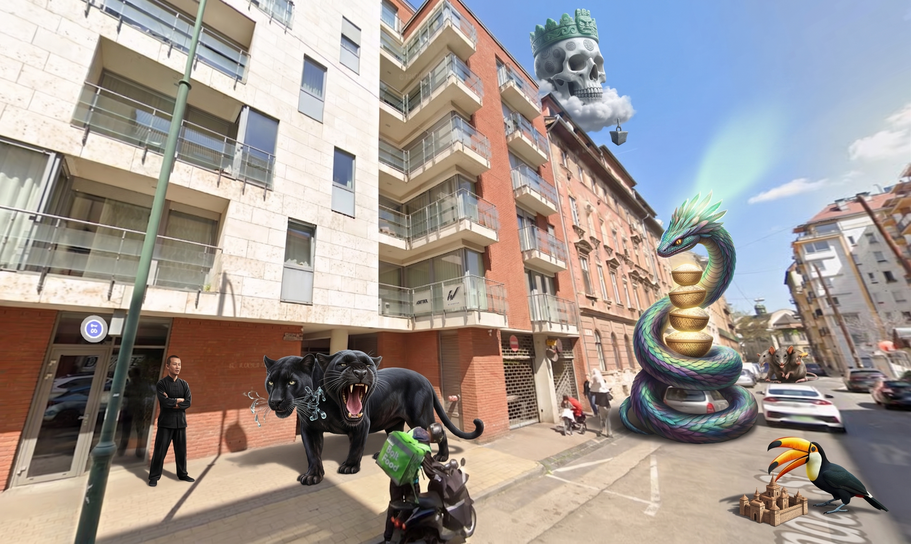
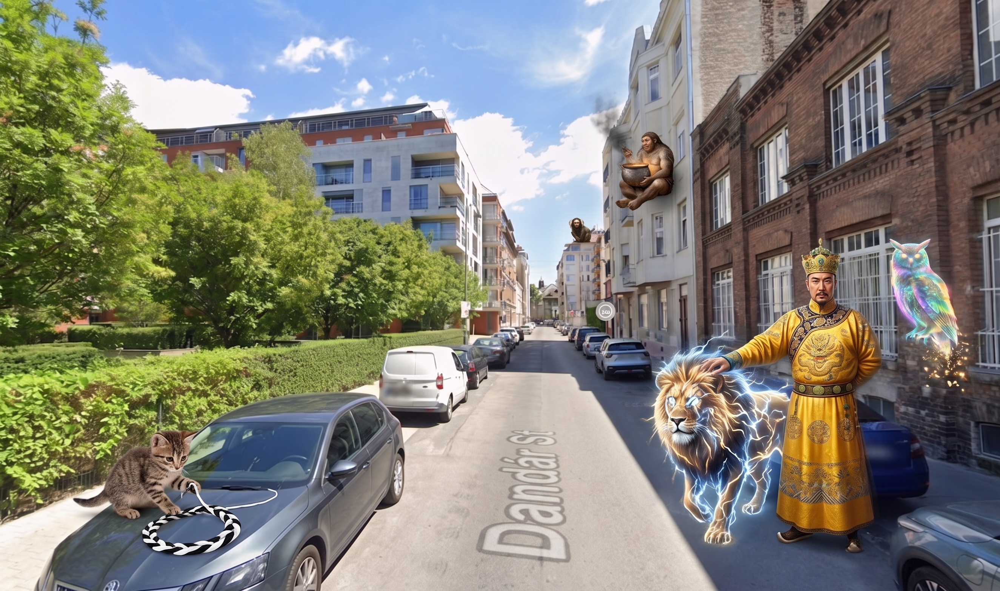
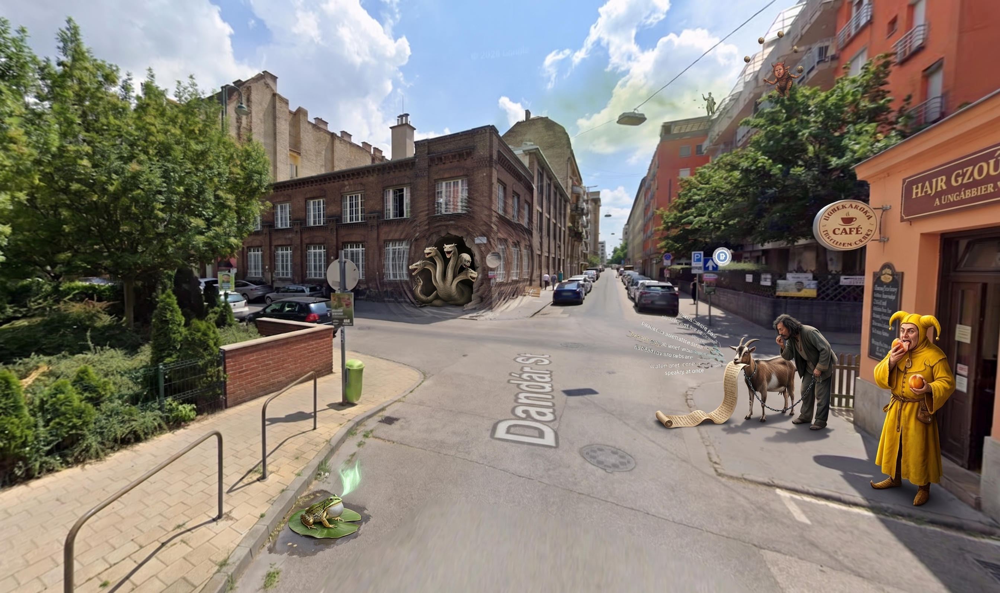
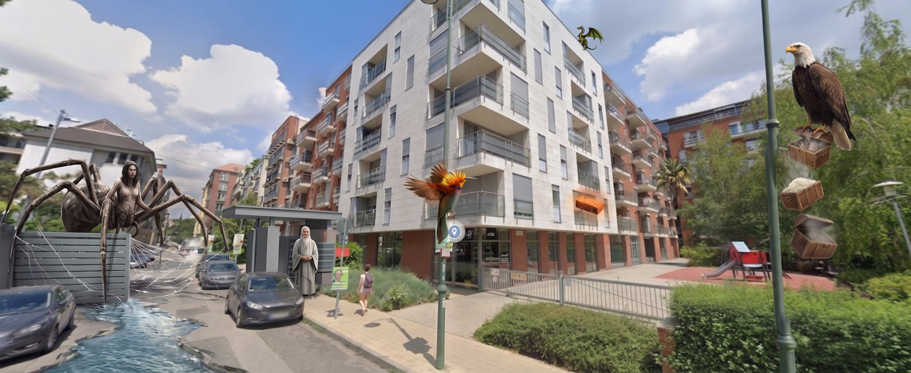

# Taoism

<strong>Memory Palace 4: Religious Development & Pantheon</strong> · Character: (unassigned palace 4) · 5 beasts · 5 atoms

<em>5 beasts · 5 Knowledge Atoms</em>

#### Knowledge Atoms

### [P] panther

**Concept**
💡 Taoism (fork) into Daojia (a (chalkboard) of (scroll pile) and texts) and Daojiao (an organized (temple)).

**Quote**
“The English word Taoism is often used to translate two distinct terms in Chinese: Daojia (道家; dàojiā; “School/Tradition of the Dao”) is a Han-dynasty label used to classify teachings and texts... Daojiao (道教; dàojiào; “Teachings of the Dao,” often rendered “Taoism” or 'Daoism' in the sense of an organized religion).”

### [Q] Quetzalcoatl

**Concept**
💡 The Way of the Celestial Masters was the (rice pecks) (ranked tower) Taoist group, started by Zhang Daoling after a (sage-vision) of Laozi.

**Quote**
“The first organized form of Taoism was the Way of the Celestial Masters, which developed from the Five Pecks of Rice movement at the end of the 2nd century CE. The latter had been founded by Zhang Daoling, who was said to have had a vision of Laozi in 142 CE”

### [R] rat

**Concept**
💡 The Three Pure Ones are the (three cheeses) Taoist gods, three (three faces) of the Tao as it takes (sky blueprint).

**Quote**
“Three Purities were the supreme Taoist deities: the Celestial Worthy of Primordial Beginning, the Celestial Worthy of Numinous Treasure, and the Celestial Worthy of the Tao and its Virtue.”

### [S] skull

**Concept**
💡 The Jade Emperor (jade crown) the (cloud throne) in Taoist belief and runs it like an old Chinese (frozen seal).

**Quote**
“Underneath the Three Pure Ones, the next ruling power is the Jade Emperor (Yuhuang Dadi, 玉皇大帝). He functions as the sovereign ruler of heaven who administers the cosmos through a vast celestial bureaucracy modeled on the imperial court of ancient China.”

### [T] toucan

**Concept**
💡 Quanzhen is a (tiny monastery) Taoist school that trains inner (herb incense) and (three beaks) three teachings.

**Quote**
“In the 12th century, the Quanzhen (Complete Perfection) School was founded in Shandong by the sage Wang Chongyang (1113–1170)... The Quanzhen school was syncretic, combining elements from Buddhism and Confucianism with Taoist tradition.”

#### Notes

_No notes._

#### Gallery

_No gallery images._

<strong>Memory Palace 3: Cosmology & The Body</strong> · Character: The Jade Emperor · 5 beasts · 5 atoms

<em>5 beasts · 5 Knowledge Atoms</em>

#### Knowledge Atoms

### [K] kitten

**Concept**
💡 Yin and yang are the (yarn ball) forces (dark/light, soft/hard, and so on) whose (spinning circle) shapes the (globe).

**Quote**
“The main distinction in Taoist cosmology is that between yin and yang, which applies to various sets of complementary ideas: bright – dark, light – heavy, soft – hard, strong – weak, above – below, ruler – minister, male – female, and so on.”

### [L] lion

**Concept**
💡 Qi is the (crackling mane) stuff of the universe, the (brick-gas) of the Tao you can (skin hum) in all things.

**Quote**
“According to Livia Kohn, qi is 'the cosmic energy that pervades all. The concrete aspect of Tao, qi is the material force of the universe, the basic stuff of nature.'”

### [M] marmoset

**Concept**
💡 Wuxing is the (five orbs) (juggle) — wood, fire, earth, metal, water — used to explain how things (clash).

**Quote**
“Another important set of notions associated with the same school of yinyang are the “Five Phases” (wuxing) or “powers” (wude): water, fire, wood, metal, and earth.”

### [N] Neanderthal

**Concept**
💡 Neidan is inner (chest cauldron): you change (earthy root), (spark), and (sweet mist) inside the body to live (hourglass) and change the spirit.

**Quote**
“Internal alchemy (neidan, literally: 'internal elixir'), which focuses on the transformation and increase of qi in the body, developed during the late imperial period (especially during the Tang) and is found in almost all Taoist schools today”

### [O] owl

**Concept**
💡 Xian are (glass feather) who gain strange (heat ghost) by (master key) the Tao, body and spirit both.

**Quote**
“Taoists who sought to become one of the many different types of immortals, such as xian or zhenren, wanted to 'ensure complete physical and spiritual immortality'.”

#### Notes

_No notes._

#### Gallery

_No gallery images._

<strong>Memory Palace 2: Foundational Texts & Figures</strong> · Character: (unassigned palace 2) · 5 beasts · 5 atoms

<em>5 beasts · 5 Knowledge Atoms</em>

#### Knowledge Atoms

### [F] frog

**Concept**
💡 Laozi is the traditional (flickering sage) of Taoism, but scholars (debate glasses) whether he was a (ghost) person.

**Quote**
“A common tradition holds that Laozi founded Taoism. Laozi's historicity is disputed, with many scholars seeing him as a legendary founding figure.”

### [G] goat

**Concept**
💡 The Tao Te Ching is the core Taoist (talking scroll), a short (poem) text (chain) to Laozi.

**Quote**
“The Tao Te Ching, attributed to Laozi, was composed between the 4th and 6th century BCE.”

### [H] Hydra

**Concept**
💡 Zhuangzi was a major Taoist (cave), and some think (south wind) (rattles) practice shaped him.

**Quote**
“Zhuang Zhou (c. 370–290 BCE) was the most influential of the Taoist hermits. Some scholars hold that since he lived in the south, he may have been influenced by Chinese shamanism.”

### [I] imp

**Concept**
💡 The Zhuangzi uses (story balls) and talks to push a (wild grass) life in line with nature, not stiff social (stone suit).

**Quote**
“The Zhuangzi uses anecdotes, parables, and dialogues to express one of its main themes—avoiding cultural constructs and instead living in a spontaneous way aligned with the natural world.”

### [J] jester

**Concept**
💡 The Yellow Emperor is a mythic (yellow robes) said to have set many Taoist (law tablet) while seeking a (peach) life.

**Quote**
“many Chinese Taoists claim that the Yellow Emperor formulated many of their precepts, including the quest for 'long life'.”

#### Notes

_No notes._

#### Gallery

_No gallery images._

<strong>Memory Palace 1: Core Philosophy</strong> · Character: (unassigned palace 1) · 5 beasts · 5 atoms

<em>5 beasts · 5 Knowledge Atoms</em>

#### Knowledge Atoms

### [A] Arachne

**Concept**
💡 The Tao is the (spiderweb) (river) process under all of (road).

**Quote**
“With a range of meanings and interpretations in Chinese philosophy, translations of Tao include 'way', 'road', 'path', or 'technique', generally understood in the Taoist sense as an enigmatic process of transformation ultimately underlying reality.”

### [B] bird of paradise

**Concept**
💡 De is the (glowing brick) that shows up when a person lives in (compass) with the Tao.

**Quote**
“The active expression of Tao is called De (德; dé; also spelled Te or Teh; often translated with virtue or power), in a sense that De results from an individual living and cultivating the Tao.”

### [C] cat

**Concept**
💡 Wu wei is (sleeping cat) action: you reach a goal by (flood) with the world, not by (crowbar) it.

**Quote**
“Wu wei is a primary ethical concept in Taoism. Standard translations are non-action, effortless action, action without intent, non-interference, and non-intervention.”

### [D] dragon

**Concept**
💡 Ziran is the (uncut log) state of things: (wild branch), (garden shears), as they already are.

**Quote**
“Ziran (自然; zìrán; tzu-jan; lit. 'self-so', 'self-organization') is regarded as a central concept and value in Taoism and as a way of flowing with the Tao. It describes the 'primordial state' of all things.”

### [E] eagle

**Concept**
💡 The Three Treasures are (hug) (ci), (rice bowl) (jian), and (empty chest).

**Quote**
“Some of the most important virtues in Taoism are the Three Treasures or Three Jewels (三寶; sānbǎo). These are: ci (慈; cí, usually translated as compassion), jian (儉; jiǎn, usually translated as moderation), and bugan wei tianxia xian (不敢爲天下先; 'not daring to act as first under the heavens', but usually translated as humility).”

#### Notes

_No notes._

#### Gallery

_No gallery images._

