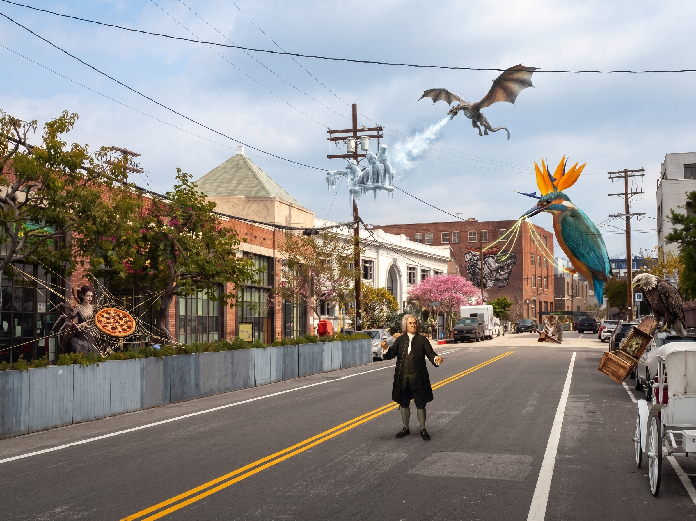

# violin

_1 Memory Palaces · newest first_

---

## Memory Palace 1: Origens do Violino

**Character:** Johann Sebastian Bach



_5 beasts · 5 Knowledge Atoms_

**Image prompt**

```
ForegroundLeft: Arachne weaving a pizza from lute strings anchored to an iron gate. MidgroundRight: Skyscraper-sized bird of paradise painting a car engine with three glowing strings on a brick wall. BackgroundCenter: Microscopic cat sawing a lira da braccio on the distant pavement. Aerial: Dragon freezing statues on a street lamp. ForegroundRight: Zombie eagle regurgitating a wooden box onto a parked carriage. Johann Sebastian Bach stands in the center conducting the chaos.
```

### Knowledge Atoms

🟧 **[A] Arachne**

💡 **Concept:** O violino foi inventado no início do século XVI na Itália.
**Quote:** O violino, a viola e o violoncelo foram fabricados no início do século XVI, na Itália.
**Story:** Arachne weaves a giant Italian pizza out of thick sixteenth-century lute strings anchored to the gate spinning uncontrollably.
**Sensory:** tactile

🟧 **[B] bird of paradise**

💡 **Concept:** A evidência mais antiga são pinturas de Gaudenzio Ferrari (década de 1530) com violinos de três cordas.
**Quote:** A evidência mais antiga de sua existência está nas pinturas de Gaudenzio Ferrari da década de 1530, embora os instrumentos da Ferrari tivessem apenas três cordas.
**Story:** A skyscraper-sized bird of paradise paints a roaring Ferrari engine on the brick wall using exactly three glowing strings dipped in wet blindingly bright oil paint.
**Sensory:** visual

🟧 **[C] cat**

💡 **Concept:** O violino evoluiu da viela rabeca e lira da braccio.
**Quote:** É provável que os violinos tenham sido desenvolvidos a partir de vários outros instrumentos de cordas dos séculos XV e XVI, incluindo a viela, rabeca e lira da braccio.
**Story:** A microscopic cat shrieks a deafening operatic note on the pavement while furiously sawing a wooden lira da braccio that transforms into a rabid lizard.
**Sensory:** auditory

🟧 **[D] dragon**

💡 **Concept:** O padrão foi estabelecido no século XVII por Amati Stainer e Stradivari.
**Quote:** O padrão geral do instrumento foi estabelecido no século XVII por lutieres como a prolífica família Amati, Jakob Stainer, do Tirol, e Antonio Stradivari
**Story:** A dragon exhales frozen centuries upon the street lamp freezing three master luthiers into ice statues who eternally carve glowing Stradivarius violins.
**Sensory:** thermal

🟧 **[E] eagle**

💡 **Concept:** O violino mais antigo confirmado a sobreviver é o Charles IX de Andrea Amati (1564).
**Quote:** O mais antigo violino sobrevivente confirmado, datado dentro, é o "Charles IX" de Andrea Amati, produzido em Cremona em 1564
**Story:** A golden eagle with rotting zombie flesh regurgitates a pristine sour-tasting wooden box labeled Charles IX onto the parked carriage swallowing a royal crown.
**Sensory:** gustatory

---
