# Mnemonic Study System

This system helps you memorize complex topics (e.g. Piano, English Grammar, Communication) by combining a **Bestiary** (beasts as concept holders) with a **Memory Palace** (unique geolocations). Each knowledge atom is anchored to a Beast on a Street, with one required Character anchor per Street and Actions to make recall vivid and durable.

**Reading order:** Read Quick Start and the workflow diagram once. Prompt templates live in `studies/technique/prompts/`; each prompt's **Input (always last)** section lists what to attach (lines starting with 📎).

> **For AI runs:** When a prompt cites `README §<Section Name>`, that section under **Canonical Rules** is the single source of truth. Do not invent rules outside those anchors. Topic-specific concepts come from the video transcript and `plan.md`; the general framework and mnemonic rules live here—attach this README for Story Architect and Story Reduction; do **not** add a separate "theory" paste.

---

## Quick Start

**Constraint:** Cursor IDE AI cannot access YouTube. Produce the transcript in a web AI (e.g. Gemini), then use that transcript in Cursor for story generation and later steps.

| Step                         | Owner                | Prompt / action                                                                                                    | Attach (📎)                                                                                                          |
| ---------------------------- | -------------------- | ------------------------------------------------------------------------------------------------------------------ | -------------------------------------------------------------------------------------------------------------------- |
| **0 — Plan**                 | You                  | Open `studies/[topic]/plan.md` for topic research, video picks, checklists                                         | —                                                                                                                    |
| **1 — Watch**                | You                  | Watch the recommended YouTube video enough to grasp the concept                                                    | —                                                                                                                    |
| **2 — Transcribe**           | Gemini               | `prompts/video-transcription-prompt.txt`                                                                           | YouTube video link                                                                                                   |
| **3 — Curate atoms**         | Cursor (when needed) | `prompts/concept-curation-prompt.txt` — when the transcript/text is too long or dense                              | Source transcript/text · optional practice `.md` · this README                                                       |
| **4 — Story Architect**      | Cursor               | `prompts/story-prompt.txt`                                                                                         | Transcription **or** curated concept `.md` · existing study list · `characters.json` · `bestiary.json` · this README |
| **5 — Story Reduction**      | Cursor (when needed) | `prompts/story-reduction-prompt.txt` in **SMASH** or **REMOVE** mode                                               | Reduction mode · full mnemonic story · merge groups or peg letters to remove · `bestiary.json`                       |
| **6 — Maps capture**         | You                  | Google Maps: **N** locations, one Street View screenshot per street                                                | Use latest `🖼️ Mnemonic image prompts` from step 4 or 5                                                              |
| **7 — Foreground composite** | External image AI    | `prompts/image-background-preservation-prompt.txt` **above** matching street line from `🖼️ Mnemonic image prompts` | Street screenshot · matching image prompt line                                                                       |
| **8 — Save files**           | You                  | Store snapshots and composites in `studies/[Topic]/images/` as `N.png` matching Street N                           | —                                                                                                                    |
| **9 — Markdown assembly**    | You                  | Paste finalized story into `mnemonics-<topic>.md`; set `` links                           | —                                                                                                                    |

**Key terms:**

- **Plan Document:** `studies/[topic]/plan.md` — topic-specific research and video recommendations.
- **Mnemonic framework:** Topic-specific concepts come from the plan document **and** the video transcript. The **general framework** and rules for this system live **in this README**.

When extending an existing list, the AI MUST track previous list state so new atoms are merged without duplication. Isolated facts still require a video transcript and the normal Story Architect / Story Reduction flow—there is no separate shortcut prompt.

---

## Workflow diagram

```mermaid
%%{init: {'theme': 'dark', 'themeVariables': {'fontSize': '16px', 'edgeLabelBackground': '#ffffff', 'edgeLabelColor': '#0d0d0d', 'primaryTextColor': '#e8e8e8'}, 'flowchart': {'htmlLabels': true, 'padding': 16}}}%%
flowchart TB
  subgraph prep [Prep — everyone]
    planNode["<b>Plan</b><br/><br/><span style='color:#9cdcfe'>You:</span> Open <code>plan.md</code> for video link, topic, checklists.<br/><span style='color:#888'>No AI.</span>"]
    watchNode["<b>Watch</b><br/><br/><span style='color:#9cdcfe'>You:</span> Watch enough to understand the lesson."]
  end

  subgraph pathPostTranscript [Post-transcript pipeline]
    transcribeNode["<b>Transcribe</b> — <code>video-transcription-prompt.txt</code><br/><br/><span style='color:#c586c0'>📎</span> <span style='color:#dcdcaa'>YouTube video link</span> <span style='color:#888'>(Gemini · Input section)</span><br/><br/><span style='color:#9cdcfe'>You:</span> Paste the link in Gemini.<br/><span style='color:#b5cea8'><b>Save</b></span> Markdown transcript.<br/><span style='color:#888'>Required before Story Architect (or Curate).</span>"]
    curateNode["<b>Curate atoms</b> — <code>concept-curation-prompt.txt</code><br/><br/><span style='color:#c586c0'>📎</span> <span style='color:#dcdcaa'>Source transcript/text · optional practice <code>.md</code> · README</span><br/><br/><span style='color:#9cdcfe'>You:</span> when the source is too long/dense.<br/><span style='color:#b5cea8'><b>Save</b></span> curated concept Markdown.<br/><span style='color:#888'>Optional; feeds Story Architect as transcription.</span>"]
    storyNode["<b>Story Architect</b> — <code>story-prompt.txt</code><br/><br/><span style='color:#888'>Match <b>Input (always last)</b> in the prompt; attach with <code>@</code>:</span><br/><span style='color:#dcdcaa'>📎 Transcription <b>or</b> curated concept <code>.md</code> · 📎 Existing study list <code>.md</code> · 📎 <code>characters.json</code> · 📎 <code>bestiary.json</code> · 📎 <code>studies/technique/README.md</code></span><br/><span style='color:#888'>Framework rules: covered by the README attachment (no extra theory paste).</span><br/><br/><span style='color:#ce9178'><b>You get:</b></span> <code>Total streets required: N</code> · new streets · image placeholders · <code>🖼️ Mnemonic image prompts</code> <span style='color:#888'>(no per-street tracking comments)</span>."]
    refineNode["<b>Story Reduction</b> — <code>story-reduction-prompt.txt</code><br/><br/><span style='color:#dcdcaa'>📎 Reduction mode SMASH or REMOVE · 📎 Full mnemonic story · 📎 Merge groups or peg letters to remove · 📎 <code>bestiary.json</code></span><br/><span style='color:#9cdcfe'>You:</span> run when merging atoms or trimming pegs<br/><span style='color:#ce9178'><b>You get:</b></span> refreshed story · refreshed <code>🖼️ Mnemonic image prompts</code> <span style='color:#888'>(accessory-detail prompts)</span>."]
    mapsNode["<b>Google Maps</b><br/><br/><span style='color:#9cdcfe'>You:</span> N locations · one screenshot per street.<br/><span style='color:#888'>Use the latest <code>🖼️ Mnemonic image prompts</code> from the current story output.</span>"]
      genNode["<b>Foreground Composite</b> — <code>image-background-preservation-prompt.txt</code><br/><br/><span style='color:#dcdcaa'>📎 Street screenshot · 📎 Matching line from <code>🖼️ Mnemonic image prompts</code></span><br/><span style='color:#9cdcfe'>You:</span> place the preservation prompt above the street prompt, then add mnemonic foreground elements without altering the place."]
    filesNode["<b>Save files</b><br/><br/><span style='color:#9cdcfe'>You:</span> Study <code>images/</code> folder · save as <code>N.png</code> matching Street N."]
    mdNodeA["<b>Markdown assembly</b><br/><br/><span style='color:#9cdcfe'>You:</span> Paste story into <code>mnemonics-&lt;topic&gt;.md</code> · set <code>images/N.png</code> links."]
  end

   planNode --> watchNode --> transcribeNode --> curateNode --> storyNode --> refineNode --> mapsNode --> genNode --> filesNode --> mdNodeA

  classDef human fill:#243524,stroke:#5d9a5d,stroke-width:2px,color:#e8e8e8
  classDef ai fill:#1a3048,stroke:#569cd6,stroke-width:2px,color:#e8e8e8

  class planNode,watchNode,mapsNode,filesNode,mdNodeA human
  class transcribeNode,curateNode,storyNode,refineNode,genNode ai
```



**Legend**

| Node fill (dark preview) | Meaning                                                                                                            |
| ------------------------ | ------------------------------------------------------------------------------------------------------------------ |
| **Green-tinted**         | Human-primary: you act without a chat/model paste as the main step (plan, watch, Maps, save files, edit Markdown). |
| **Blue-tinted**          | AI-primary: transcript in Gemini; Curate / Story / Reduction; foreground composite.                                |

**Inside nodes:** **📎** = attach that item to context (matches the prompt file's **Input (always last)** section; in Cursor use **`@`** on files). **Pale yellow** = paste into that AI; **orange** = model output; **blue** (label text) = your actions; **gray** = notes.

_Read **top to bottom** inside each subgraph. After prep, the pipeline is linear: transcript → optional Curate → Story Architect → reduction when needed → Maps, image composition, and Markdown._

---

## Canonical Rules

All prompts cite these sections by exact heading name (`README §<Heading>`). Rules MUST NOT be duplicated or contradicted elsewhere.

### Knowledge Atom Structure

**Definitions:**

- **Knowledge Atom:** The complete entry/record for a single concept.
- **Peg:** Letters from the Bestiary as singles **and** pairs (e.g. A, AB). NEVER use numbers.
- **Knowledge / Definition (`concept` / Context):** The rehearsal summary the user reads on active recall. Always written as `💡 **Context:** …` (CSV field `concept`). **Maximum compression:** use the fewest words that still preserve **100%** of the semantic meaning and critical conceptual logic—zero information loss; NEVER truncate or omit essential logic for brevity. Purpose: minimize cognitive and mnemonic load during recall. **Conditional Note:** when nuance, complexity, or verbosity was deliberately stripped from the compressed core to keep extreme brevity, append that supplementary context in the same Context/`concept` field as ` — Note: <nuance>`. If no compression trade-off was needed, omit the Note. NEVER confuse this with Quote.
- **Story/Action:** The narrative event performed by the Beast.
- **Quote:** Direct transcript excerpt from the video source, verbatim. NEVER prefix Quote with `💡`. NEVER append a `Note:` to Quote.

**Sensory channel emojis** (required beside every `· sensory:` marker on `🟧` and `🟦` lines; channel word first, then its emoji):

| Channel   | Emoji |
| --------- | ----- |
| visual    | 👁️    |
| auditory  | 👂    |
| tactile   | ✋    |
| olfactory | 👃    |
| gustatory | 👅    |
| thermal   | 🌡️    |

Format: `· sensory: [channel] [emoji]` (e.g. `· sensory: visual 👁️`). NEVER invent other sensory emojis; NEVER omit the emoji; NEVER place the emoji before the channel word.

**Allowed emojis (Story Architect / Story Reduction output):** Only `🟧` (topic/beast header), `🟦` (sub-atom), `💡` (definition / `**Context:**` line), and the sensory-channel emojis above—plus the fixed section title `🖼️ Mnemonic image prompts` required by the output contract. NEVER invent any other emoji in beast headers, Context, Quote, Narrative, summaries, or image-prompt body text.

**Structure per Knowledge Atom** (separated by clear line breaks):

1. **Header:** `🟧` `[Peg Letters]` `[Beast Name]` `· sensory: [channel] [emoji]` — required sensory channel for the main topic, with its mapped emoji from **Sensory channel emojis** above.
2. **Definition (Context):** `💡 **Context:** [maximally compressed knowledge]` — fewest words, full semantic fidelity. MUST start with `💡`. This is the main rehearsal element; it is NOT the Quote. When nuance was stripped from the compressed core, append ` — Note: <stripped nuance>` in the same Context/`concept` field.
3. **Quote (Target Payload):** Direct video quote, verbatim from the transcript. Place **before** Narrative so the target payload is reachable without traversing the story. NEVER use `💡` on Quote. NEVER append a `Note:` to Quote.
4. **Narrative (Story/Action):** Short beat (**2–4 sentences**). MUST pass the **Bizarreness Gate**. Encode the atom's meaning through bizarre beast action, props, and (if smashed) zone accessories—the action is the mnemonic cue that triggers recall of the Quote. Narrative SHOULD enact the header's sensory channel. Use the street's **single assigned character** where it strengthens recall—NEVER add a second named character on the same street. Beast-to-beast interaction is **optional (default none)**—use it only when it strengthens the story or memory link; otherwise do not reference other beasts. NEVER require reading another beast's narrative to decode this one.

**Retrieval path (dual-access):** (1) **Scan path:** peg → `💡 **Context:**` (ultra-short core + optional Note) → Quote—target reached without Narrative. (2) **Palace path:** recall the beast's image and the encoding action → remember the Quote. Both paths are valid; Narrative is not a gate to the payload.

**Smashed beast structure (after Story Reduction SMASH mode):**

1. **Header:** `🟧` `[Peg Letters]` `[Beast Name]` `· sensory: [channel] [emoji]` — peg identity and a **baseline** sensory channel for the beast body only (required; distinct from every `🟦` channel on this beast; emoji from **Sensory channel emojis**). The beast body is a **neutral canvas**: it MUST NOT encode any knowledge atom and MUST NOT carry a definition (`💡 **Context:**`) on the `🟧` level.
2. **Sub-atoms (Anatomical Micro-Loci):** Up to **4** `🟦` lines in **Z1→Z4 order**—**every** merged knowledge atom MUST be assigned to exactly one `🟦` zone. Each `🟦` line names its zone, active anatomical interaction, brief knowledge hook, and sensory channel with emoji (e.g. `· sensory: visual 👁️`). Immediately under each `🟦` line, emit that atom's maximally compressed definition as `💡 **Context:** …` (optional ` — Note:` in that same Context when nuance was stripped). Do **not** use a combined group-level Context under the `🟧` header.
3. **Quote(s):** One verbatim video quote per merged atom, in source order—**before** Narrative. NEVER prefix Quote with `💡`. NEVER append a `Note:` to Quote.
4. **Narrative:** One **active beat per assigned zone**, matching the `🟦` lines—each zone encodes that sub-atom's meaning through mechanical engagement with its accessory. The beast body's overall posture or presence MUST NOT encode knowledge; only the zone beats do. Self-contained beat; optional cross-beast links only when they serve the concept, transcript logic, or a stronger mnemonic—otherwise do not reference other beasts.

**Example (single-atom beast):**

```md
🟧 **[B] [bird of paradise]** · sensory: visual 👁️

💡 **Context:** Past perfect = had + past participle. — Note: Marks an action finished before another past action.

**Quote:** "The past perfect uses had plus the past participle."

**Narrative:** A microscopic bird of paradise hammers a skyscraper-sized chalkboard wedged into the gate post; each peck freezes solid neon grammar dust in mid-air above the chalk surface.
```

**Output quality:** Format optimized for both text reading and Read Aloud (TTS). Maintain strict visual separation (line breaks) between every Knowledge Atom.

### Streets and Depth Slots

Locations taken from your hometown, e.g. using Google Maps.

- **Crucial constraint:** Maximum **5 Beasts per Street**. NEVER place more than 5 Beasts on any single street.
- **Shared street background (visual only):** All beasts on a street composite into the **same Google Maps background**—but each beast occupies a **distinct depth slot** with a **structural anchor** within that image.
- **Street packing (minimize street count):** Assign **exactly 5 beasts to each street**. The **only** street allowed to have fewer than 5 beasts is the **last street** (highest street/palace number) in that topic/session — and only when the remaining beast pool is < 5. Example for 16 beasts: `5+5+5+1` (remainder on street 4), **never** `1+5+5+5` / `1+5` / sparse street then fuller later streets. NEVER leave an earlier street sparse while any later street exists. NEVER open a new street while a prior street still has open slots and ≥1 beast remains to place. Continuous sessions: fill the current under-filled last street to 5 before opening a new one.
- Streets are dynamically assigned per study topic; the Story Generator MUST state **how many** streets the topic requires (`Total streets required: N` = ceil(beast_count / 5)).
- A later continuous session MUST **first fill** any existing under-filled last street up to 5 before creating a new street; when the topic needs more capacity after that, add **new** streets packed 5-at-a-time with remainder only on the newest last street.
- **Character anchor (required):** Exactly one character from `characters.json` anchors each street—see **Characters**.
- **Maps capture tip (user):** Prefer Street View locations with visible depth cues—facades, roofs, gates, corners—not flat homogeneous pavement filling the frame.

**Depth slots (Fan Effect mitigation):**

Five beasts on one street is high-density loci (near working-memory limits). Similar backgrounds (e.g. all pavement) cause proactive interference and **Fan Effect** slowdown. Mitigation: mandatory **depth slots**—fixed Z-axis + lateral coordinates—without reducing the 5-beast target or Google Maps backgrounds.

| Beast order on street | Depth slot           | Placement rule                                                                                        |
| --------------------- | -------------------- | ----------------------------------------------------------------------------------------------------- |
| 1st                   | **ForegroundLeft**   | Near camera, left third; anchor to a distinct structure (gate, wall, vehicle)—not open pavement alone |
| 2nd                   | **MidgroundRight**   | Mid depth, right third; distinct structural anchor                                                    |
| 3rd                   | **BackgroundCenter** | Far depth, center line; facade, end of street, or distant landmark                                    |
| 4th                   | **Aerial**           | Elevated: roof, wall top, lamp post, tree branch, balcony                                             |
| 5th                   | **ForegroundRight**  | Near camera, right third; distinct structural anchor                                                  |

- **One beast per depth slot** on a street; NEVER two beasts in the same slot.
- **Fewer than 5 beasts:** use the **first N slots in order**.
- **Structural anchor required:** bind each beast to a **named feature** in the Maps scene (roof, gate, bench, lamp post, parked car, corner)—not "on the sidewalk" or "on pavement" alone when a structure exists in frame.
- Image prompts MUST state **`Depth slot:` + structural anchor** per beast.

### Independent Beast Beats

- Each beast is a **self-contained retrieval unit**. Its Narrative encodes only **its** knowledge atom (and, if smashed, its own `🟦` sub-atoms via accessories). The street does **not** share a narrative thread, shared props, or cross-beast story links.
- **Any-order recall:** Random access works because each beat is isolated at its **depth slot**—not because the user reconstructs sibling beasts via shared props, environmental cues, or thematic echoes.
- **No fixed chain language:** NEVER imply a required sequence like "next", "then", "after this beast", or "Beast 1 → Beast 2 → …".
- **Beast-to-beast interaction (optional, default none):** Direct links between beasts are allowed **only** when they serve the concept, transcript logic, or a stronger mnemonic. Do not add generic references to other beasts on the street (e.g. shouting, bleating, or waving at a nearby beast) when there is no meaningful link. NEVER require reading another beast's narrative to decode this one.

### Bizarreness Gate

LLMs default to plausible, coherent scenes. Memory athletes need the **improbable**. Every Knowledge Atom **Narrative** MUST pass this gate—mundane associations decay; bizarre ones stick.

Each Narrative MUST include **at least one** improbability lever wrapping the encoding action:

| Lever                      | Rule                                               | Example                                                                                |
| -------------------------- | -------------------------------------------------- | -------------------------------------------------------------------------------------- |
| **Physics violation**      | Impossible motion, matter, or causality            | Beast phases through the gate while freezing solid neon grammar dust mid-air           |
| **Disproportionate scale** | Beast or prop drastically wrong size vs the street | Microscopic elephant perched on a gate post; skyscraper-tall ant straddling the facade |
| **Sensory juxtaposition**  | Clash two senses in one beat                       | Deafening silence visible as ripples; chalkboard dust that **tastes** like thunder     |

- **Reject mundane defaults:** If the beat could pass as a normal documentary caption, rewrite until at least one lever is obvious.
- **Image prompts:** Carry the same lever into foreground description (state scale or surreal detail explicitly when used).
- **SMASH sub-atoms:** Each `🟦` zone interaction SHOULD also be bizarre or physically impossible—not a passive prop.

### Actions palette

How you imagine interacting with a Beast. A Character MAY perform the interaction in the scene instead of you. Use:

- **Tangible** — touch, weight, texture
- **Grotesque** — exaggerated, bizarre, unsettling, but non-graphic
- **Sensual** — adult-safe, non-explicit tension, attraction when it materially improves recall
- **Strange** — unexpected, surreal
- **Impactful** — loud, dramatic, startling, high-stakes without graphic harm

These are the **tools** for passing the **Bizarreness Gate**—not optional decoration on easy beats.

NEVER add moderation-bypass language, explicit sexual content, or graphic gore. Favor memorable but platform-safe imagery.

### Anatomical Micro-Loci

When the palace has too many beasts or streets, run **Story Reduction** in **SMASH** mode to merge similar or related knowledge atoms into **one beast** (schema blending) instead of giving each atom its own peg.

- **One beast, up to four sub-atoms:** Each merged atom becomes one `🟦` subtopic line (maximum **4** per beast; merge groups with more than 4 pegs MUST split into multiple smashed beasts). All knowledge atoms live on `🟦` lines plus their paired `💡 **Context:**` definitions—never on the beast body itself.
- **Neutral beast body:** The `🟧` header names the peg and a baseline sensory channel for the beast's body presence only. The beast body MUST NOT encode any knowledge atom and MUST NOT carry `💡 **Context:**`; it is a neutral canvas that holds zone accessories.
- **Encode nuances on zone anatomy:** Alter features, expression, posture, and zone-specific anatomy via `🟦` accessories—not by encoding facts on the whole body, and not by adding extra beasts.
- **Definition per sub-atom:** Immediately under every `🟦` line, emit `💡 **Context:** [maximally compressed definition for that sub-atom]` for rehearsal. The `🟦` line is the zone/accessory mnemonic cue; the `💡 **Context:**` line is the definition. NEVER put `💡` on Quote or Narrative. Append ` — Note: <stripped nuance>` on that same Context/`concept` when compression requires it.
- **Image prompts:** Story Reduction outputs long, detailed foreground prompts so each accessory renders in its **assigned anatomical zone** with **active engagement** on the beast. Do not invent a separate "main topic" action on the beast body.

| Sub-atom order | Zone                | Body area                             |
| -------------- | ------------------- | ------------------------------------- |
| 1st `🟦`       | **Z1 Head**         | Head, face, eyes, beak, mouth, horns  |
| 2nd `🟦`       | **Z2 Forelimbs**    | Forelimbs, front, claws, paws, chest  |
| 3rd `🟦`       | **Z3 Torso**        | Torso, back, wings, spine, abdomen    |
| 4th `🟦`       | **Z4 Hindquarters** | Hindquarters, tail, back legs, hooves |

- **Top-down rule:** Assign sub-atoms to zones **in order** (Z1 → Z2 → Z3 → Z4). With fewer than 4 atoms, use only the first N zones in sequence.
- **Active anatomical interaction:** The assigned zone MUST **mechanically engage** with or be **physically altered** by the accessory—use tangible, grotesque, or impactful actions. Forbidden: static placement (e.g. "floating near the head" or "worn passively" without deformation, grip, emission, or penetration).
- **Sensory domain isolation:** The `🟧` baseline channel and every `🟦` sub-atom on the same beast each use a **distinct sensory channel** (visual, auditory, tactile/tangible, olfactory, gustatory, thermal, etc.), each with its mapped emoji from **Sensory channel emojis** under **Knowledge Atom Structure**. No two channels among (`🟧` + all `🟦`) may match within one beast. Only the `🟦` lines are knowledge items.
- **Orange header format:** `🟧 **[Peg] [Beast Name]** · sensory: [channel] [emoji]` — baseline body channel only; no knowledge payload; no `💡 **Context:**` on the `🟧` level.
- **Line format:** `🟦 **Z[N] [Zone name] | [label]:** [active interaction + hook] · sensory: [channel] [emoji]` followed immediately by `💡 **Context:** [definition for that sub-atom]`

**Smashed beast example:**

```md
🟧 **[B] [bird of paradise]** · sensory: olfactory 👃

🟦 **Z1 Head | Past participle rule:** neon grammar crown fused into its beak, splitting the keratin · sensory: visual 👁️
💡 **Context:** Past perfect = had + past participle.

🟦 **Z2 Forelimbs | Irregular forms:** frozen chalkboard crushed between its claws, splintering the wood · sensory: tactile ✋
💡 **Context:** Irregular past participles = memorize as exceptions.
```

### Characters

Famous figures (history, pop culture, fictional, etc.) that interact with Beasts in your scenes. The canonical name pool is `studies/technique/characters.json`.

- **Street-anchor role:** Each street has **exactly one** character from `characters.json` that anchors access to that street during recall. The character is a **street-level anchor in the composite image**—not narrative glue tying beasts together.
- **Exactly one per street (required):** Every `## Street` MUST have one assigned character. NEVER assign two or more named characters to the same street.
- **File-wide uniqueness:** In one mnemonic list file (`mnemonics-<topic>.md` or a portal file), **each character name MAY appear at most once**. NEVER reuse a character already assigned to another street in the same file.
- **Pool exhausted:** If unused names in `characters.json` are fewer than streets needing assignment, flag this in the AI quality summary—NEVER silently skip a street or reuse a name.
- **Portal scope:** Uniqueness applies **per file**. Avoid reusing a character from the main list in a linked portal file when both are reviewed as one palace.
- **Name vs image split:** Keep the canon name in `character_name`, PREVIEW titles, and Story/Narrative text (human recall). For **image generation** (`image_prompt` and Background Preservation), NEVER use that name — use the lookalike formula in **Image composition rules**.

**Check before adding a character:**

1. Scan the **full existing study list** for character names already in use.
2. Pick only **unused** names from `characters.json`.
3. Assign **exactly one** unused character to each new street—do not repeat a name from step 1.
4. Confirm every street has its one character in narratives/`character_name`, and the matching `image_prompt` uses the lookalike formula (no real/IP names).

**Character preservation after SMASH / REMOVE:**

- After street collapse or reassignment, **every resulting street MUST have exactly one character**.
- When merging streets that each had a character: **keep one anchor on the merged street**; reassign the surplus character only to another street that lacks one—NEVER leave two characters on one street.
- When a street is removed: its character slot is freed for reassignment elsewhere in the same file.
- Do not introduce a character already used elsewhere in the story unless explicitly replacing a removed street's anchor.

### Language & IPA

**Default to simple English everywhere you write** (Context, Narrative, image prompts, quality summary): short everyday words, concrete images, zero fluff. For **Context/`concept`**, prefer maximal compression (fewest words, full meaning) over full sentences—plain language and compression work together. For Narrative and image prompts, write as if explaining to a curious teenager—not an academic paper.

**Banned in your own prose (unless inside a preserved quote or a Context `Note:`):** Rare or show-off vocabulary; Latin/French roots where a common Anglo-Saxon word works; idioms that need a dictionary; discipline jargon, acronyms, and technical terms **unless** the transcript quote requires them—and even then, keep the exact term in the Quote when needed and compress the idea in Context (append nuance as ` — Note:` on Context/`concept` if the compressed core cannot hold it briefly).

**Replacement rule:** If you would use a hard word, swap it for a simpler one (e.g. _use_ not _utilize_, _end_ not _terminate_, _try_ not _endeavor_, _show_ not _demonstrate_ unless _demonstrate_ is in the quote).

**Read-aloud test:** Narrative and image-prompt sentences SHOULD sound natural when spoken aloud; if stiff or textbook-like, rewrite more simply. Context/`concept` MAY be telegraphic (compressed phrases) as long as meaning stays complete.

**Preserve quotes:** The verbatim transcript excerpt MUST stay exact—do not simplify or modify the quoted characters. The optional ` — Note: …` suffix is authored prose on Context/`concept` only; it is never part of Quote.

**German words and IPA (when German appears):**

- German usually appears only a few times per output; whenever it does, the user MUST be able to **pronounce** it using **IPA** (International Phonetic Alphabet).
- **Standard:** Use **standard German (Hochdeutsch)** IPA. Prefer **broad** transcription unless narrow detail is needed for a minimal pair; use common learner-friendly symbols (e.g. stress mark ˈ before the stressed syllable).
- **Inline (Context, Narrative, image prompts, quality summary):** After each German word or short fixed German phrase (about four words or fewer), append IPA in **square brackets** immediately following, with a single space before the opening bracket. Example: `The sign reads verboten [fɛɐ̯ˈboːtn̩].`
- **Inside preserved quotes:** Do **not** insert IPA inside the quoted characters (quotes stay transcript-identical). Immediately **after** the Quote line (before Narrative in the same Knowledge Atom), add one line starting with `IPA:` listing every distinct German word or short phrase from that quote with the same bracket style, comma-separated if several. Example: `IPA: verboten [fɛɐ̯ˈboːtn̩], Schadenfreude [ˈʃaːdn̩ˌfʁɔʏdə]`

### Peg conventions

An A–Z list of "Beasts," based on Lynne Kelly's work (_Memory Craft_). The list iterates A–Z, then AA–ZZ as needed. Entries live in `bestiary.json`.

- By default (Story Architect flow), each Beast holds exactly one **Knowledge Atom** (one concept; one fact).
- **After Story Reduction (SMASH mode):** one Beast MAY hold **up to 4 knowledge atoms**, encoded exclusively as `🟦` lines using **Anatomical Micro-Loci** on that same beast. The `🟧` header remains as peg identity and baseline sensory only—it MUST NOT carry a knowledge atom when `🟦` lines are present.
- **Peg constraint:** Use the Bestiary `code` field (e.g. A, B, AB) for the Peg. NEVER use numeric identifiers (1, 2, 01, etc.).

**Two-letter pegs and Custom gap-fillers:** Beyond the primary A–Z row, pegs continue as two-letter codes (`Aa`, `Ab`, …, `Zz`). When a Lynne Kelly beast exists for that letter pair, it is used directly. When no beast fits, a **Custom** gap-filler is generated as `{physical adjective from 1st letter} + {A–Z peg beast from 2nd letter}`—for example, `Bh` → Bone Hydra (not a random hawk), `Bd` → Bone dragon.

**Mnemonic peg coloring** (GitHub strips inline CSS; use portable emoji markers):

| Marker | Scope                         | Meaning                                                                                                                                                      |
| ------ | ----------------------------- | ------------------------------------------------------------------------------------------------------------------------------------------------------------ |
| `🟧`   | Beast **header line**         | Peg identity; single-atom beasts encode the topic here; smashed beasts use it as a **neutral canvas** only — always ends with `· sensory: [channel] [emoji]` |
| `🟦`   | Each **merged sub-atom line** | Zone/accessory mnemonic line inside a smashed beast — always ends with `· sensory: [channel] [emoji]`; followed by that atom's `💡 **Context:**` definition  |
| `💡`   | **Definition** line           | Maximally compressed rehearsal knowledge — always as `💡 **Context:** …`; NEVER on Quote or Narrative                                                        |

### Bestiary Shifting Logic

After Story Reduction (SMASH or REMOVE), the peg sequence MUST be an **unbroken alphabetical mnemonic**. No gaps.

- **Rule:** For each **remaining** beast, in **narrative order**, assign the **next consecutive peg** from the bestiary (A, B, C, …). Update the Beast name to the beast for that new peg (from `bestiary.json`).
- **Example:** Atoms at pegs A, B, C, D, E. User removes B and D. Remaining (A, C, E) → re-pegged as A, B, C with beasts from pegs A, B, C.
- Apply this shift to the **entire** story: every Header, and every in-narrative reference to a Beast or peg, MUST use the new peg and Beast name.
- Sequence continues A, B, C, … (or A, B, …, Z, Aa, …) with no gaps.

**SMASH constraints:** Do not add new factual content; combine only the atoms the user grouped. NEVER drop sub-atom knowledge or verbatim quote excerpts. Keep each sub-atom's `concept` maximally compressed; optional ` — Note:` on that same `concept` when nuance was stripped from the compressed core.

**REMOVE constraints:** Do not add new knowledge atoms; only remove requested pegs and re-peg the rest. Preserve every remaining atom's **knowledge content** (compressed concept + optional Concept Note) and **video quote excerpt(s)** verbatim.

### Image composition rules

**Standard image workflow:**

1. **Foreground composite:** Place `studies/technique/prompts/image-background-preservation-prompt.txt` above the matching line from `🖼️ Mnemonic image prompts`, upload the original Google Maps or Street View screenshot as the locked background, and generate the mnemonic foreground on top of that scene.

**1. Background (Street):**

- **Constraint:** MUST remain static and unmodified per street.
- **Source:** Google Maps snapshots captured by you; aligned to **N** streets.
- **Consistency:** The street background MUST be identical across all variations for that street.

**2. Foreground elements:**

- **Subjects:** Animals (Beasts), characters performing actions.
- **Beast-bound accessories:** For smashed beasts, each `🟦` accessory is a **knowledge atom** anchored to an **Anatomical Micro-Loci zone**—render **every** one in its assigned zone with **active engagement** (deformation, grip, emission, penetration, etc.); NEVER as floating or unassigned props; NEVER omit accessories to simplify the scene.
- **Neutral beast body (smashed):** The beast body is a canvas only—image prompts MUST NOT invent a separate knowledge-encoding action on the whole body. The `🟧` baseline sensory cue MAY appear as body presence (pose, smell, texture), but all knowledge payloads live on `🟦` zone accessories.
- **Anatomical Micro-Loci rendering:** Image prompts MUST name **zone + active anatomical state + sensory cue** per `🟦` accessory (Z1 Head through Z4 Hindquarters).
- **Style:** **Realistic photographic integration** with the Maps background—match perspective, **lighting, shadows, and materials** so beasts blend with the real street. **Mnemonic scale MAY exaggerate** (microscopic or colossal beasts) when the narrative uses disproportionate scale; keep lighting and contact shadows consistent with the scene. Mnemonic content MAY stay surreal but MUST NOT look like flat cartoon overlays.
- **Placement:** Composite foreground elements into the fixed background as physically grounded inserts.
- **Depth slots (required):** Assign each beast on a street its depth slot per **Streets and Depth Slots**. One beast per slot; no clustering on the same depth plane or lateral zone; no pavement-only anchors when structures exist in frame.
- **Mnemonic salience:** Preserve story memorability through **realistic rendering** of symbolic, strange, exaggerated, metaphorical foreground details. Every beat SHOULD reflect the **Bizarreness Gate**. Prefer dramatic expressions, texture, absurd contrast, bizarre juxtapositions, non-graphic grotesque elements, adult-safe non-explicit sensual tension, startling but non-graphic impact over explicit depictions.
- **Character likeness / image-safety (mandatory for all image prompts):** Image generators often block named real people (living or historical), celebrities, and copyrighted/IP characters. Treat every palace character as an **original lookalike**, never as that named person or franchise character.

  **Rules:**
  1. In `image_prompt` (and any text sent to an image model): NEVER write real person names, celebrity names, historical figure names, or IP/franchise character names (e.g. no "Johann Sebastian Bach", "Michael Jackson", "Ada Lovelace", "Yoda", "Hermione Granger").
  2. Describe an **original fictional person** who shares the memorable visual traits of the assigned character (age band, era/clothing, hair, signature props, posture, vibe) so recall still works.
  3. Explicitly disclaim identity in the same sentence: e.g. `an original fictional [role] who resembles [traits] — not any real, living, historical, or named public figure / not any copyrighted character`.
  4. `character_name` in CSV/PREVIEW/stories MAY keep the canon name for human recall; only the image path must stay nameless.

  **Lookalike formula (use this shape in every `image_prompt`):**
  `an original fictional [brief role] who resembles [age band], [hair/face cues], [era or signature clothing], [1–2 signature props or gestures] — not any real, living, historical, or named public figure and not any copyrighted character`

  **Examples:**
  - Canon `Johann Sebastian Bach` → `an original fictional 18th-century composer-like man (older adult, white powdered wig, dark baroque coat, conducting with a baton) — not any real or named historical person`
  - Canon `Michael Jackson` → `an original fictional pop performer (slim build, sequined jacket, single glitter glove, fedora, moonwalk-ready stance) — not any real celebrity`
  - Canon `Yoda` → `a small green elderly alien-like mentor with pointy ears and a simple robe — not any copyrighted character`

Always preserve the background's recognizability. The street MUST remain the anchor of the memory image; beasts and characters are foreground additions, not replacements for the place.

### Topic and Street headings

Use simple markdown `#` levels to separate topics and streets in the mnemonic list file:

- **`# Topic`** — One coherent subject block (e.g. "Past Perfect Verbs"). A topic can contain **many** streets.
- **`## Street N: [Title]`** — One memory-palace location within that topic; 1–5 beasts per street.

**Rules:**

- Start each new topic with a `#` heading.
- Streets under a topic use `##` only (not `###`).
- After each `## Street` line, go **directly** to the street image line ``, then beast entries.
- **NEVER** insert `<!-- STREET_STATE: ... -->` or any other machine-readable capacity comment under streets—AI agents MUST NOT add these. Older lists MAY still contain legacy lines; when editing, you MAY remove them for consistency.

---

## Reference

### Definitions & hierarchy

- **Study:** The high-level subject (e.g., "English", "Piano").
- **List:** The single mnemonic document for that study (one per topic): `mnemonics-<topic-slug>.md` at the topic folder root (e.g. `studies/English/mnemonics-english.md`), holding the sequential mnemonic story content for that subject.
- **Topic:** A specific subject block within the List (e.g., "Past Perfect Verbs"), consisting of at least one Street; in Markdown, introduced by a `# Topic` heading and containing one or more `## Street` sections.
- **Street:** A memory palace location within a Topic; contains 1 to 5 Animals (Beasts).
  - _Constraint:_ Maximum 5 Animals per Street.
  - _Visuals:_ One AI-generated image per **Street** (snapshot of the street + animals), stored under the topic `images/` folder.
- **Animal (Beast):** A specific mnemonic image holding one **Knowledge Atom** by default; after SMASH reduction, one beast MAY hold multiple knowledge atoms exclusively as `🟦` lines (accessories)—the `🟧` body stays a neutral canvas.
- **Portal:** A nested memory palace for a large sub-topic (see `research/nested-memory-palaces.md`). The main List keeps a Beast as the gateway; the expanded content lives in `studies/<Topic>/portals/<slug>.md` and is linked from that Beast's Context or Narrative.

### Data format strategy

- **Study list:** `.md` at the topic root, sibling to `images/` (see **Standardized Directory Layout**).
- **Data / indices** (`bestiary.json`, `characters.json`): JSON for programmatic use and as the canonical source for Beasts and characters.

Keep formats consistent so both humans and AI can read and update the same files.

### File and folder reference

| Item                | Path (from repo `notes/` root)                                                                      |
| ------------------- | --------------------------------------------------------------------------------------------------- |
| This README         | `studies/technique/README.md`                                                                       |
| Prompts             | `studies/technique/prompts/`                                                                        |
| Bestiary            | `studies/technique/bestiary.json`                                                                   |
| Characters          | `studies/technique/characters.json`                                                                 |
| Images              | `studies/technique/images/`                                                                         |
| Supplementary note  | `studies/technique/research/mnemonic-technique.md` (informal; canonical beasts are `bestiary.json`) |
| Advanced strategies | `studies/technique/research/nested-memory-palaces.md` (Nested Palace / Portal Method)               |
| Study portals       | `studies/<Topic>/portals/` (optional per study; reference: `studies/German/portals/`)               |
| Piano study         | `studies/Piano/`                                                                                    |
| German study        | `studies/German/` (legacy path `studies/german/` also exists)                                       |
| English study       | `studies/English/`                                                                                  |
| Communication study | `studies/Communication/`                                                                            |

**Topic folder naming:** New study folders SHOULD use **PascalCase** (`English/`, `German/`). Legacy lowercase folders (e.g. `german/`) remain valid; paths in existing files are not renamed automatically.

### Standardized directory layout

The repo root contains **`studies/`**. Each **topic** is a direct child folder (e.g. `English/`, `Piano/`). **There is no `list/` subfolder** under topics: the mnemonic file and `images/` sit at the topic root.

Use **`studies/English/`** as the structural template:

```text
studies/
└── English/                    # Template topic folder (PascalCase folder name)
    ├── plan.md                 # Study plan and checklists
    ├── mnemonics-english.md    # Main mnemonic file: Topics, Streets, Beasts
    ├── image_prompts.txt       # Generated from the latest story or story-reduction output
    ├── images/                 # Maps snapshots + AI-generated composites
    ├── research/               # Context files (PDFs, transcripts, raw notes)
    ├── portals/                # Optional: nested palace files for portal beasts
    └── deprecated/             # Archive for old files
```

**Portals subfolder:** Any study folder MAY include `portals/` for additional nested-palace documents. Name files in **kebab-case** (e.g. `german-alphabet.md`). Link from the gateway Beast in `mnemonics-<topic-slug>.md`.

**Mnemonic file naming:** `mnemonics-<topic-slug>.md`, where `<topic-slug>` is a lowercase kebab string derived from the topic (e.g. `english` → `mnemonics-english.md`).

**File naming rules:**

- Use **kebab-case** for file names (e.g. `verb-tenses.pdf`, `mnemonics-english.md`).
- Topic folder names SHOULD be **PascalCase** for new studies.
- Keep names descriptive but concise.
- **Street images:** save composites as `images/N.png` where N matches `## Street N` (e.g. Street 3 → `images/3.png`). Do not use longitude/latitude filenames.

### AutoHotkey prompt names

Prompts are loaded via AutoHotkey. Use these exact names in the model:

| Key | Model name                               | File                                       |
| --- | ---------------------------------------- | ------------------------------------------ |
| 4   | Creating mnemonic stories                | `story-prompt.txt`                         |
| 5   | Transcript Youtube Video                 | `video-transcription-prompt.txt`           |
| 6   | Curate knowledge atoms                   | `concept-curation-prompt.txt`              |
| a   | Story reduction - merge or remove pegs   | `story-reduction-prompt.txt`               |
| g   | Preserve background for image generation | `image-background-preservation-prompt.txt` |

### Study plan conventions

To ensure consistency across all study plans (e.g., German, English, Piano):

- **Concise To-Do Lists:** All actionable items MUST be formatted as checkboxes (`- [ ]`).
- **Chronological Order:** Display topics and subtopics chronologically from the first to learn to the last to learn.
- **Clear Headings:** Use standard Markdown headings (`##`, `###`, `####`) for all topic categories and sub-categories.
- **Visible Links:** Group all learning materials, videos, and external links under a clear `**🔗 Resources:**` subheading at the end of each relevant topic block.
- **Progress Markers:** Use the `⚡` emoji to denote the current progress marker (e.g., `- [ ] ⚡ [Topic Name]`).
- **Strict Content Preservation:** Do not alter, add, or remove existing topics, subtopics, references, or knowledge atoms when reordering.

### Context placeholders (📎)

In each file under `technique/prompts/`, every manual attachment is labeled with **📎** at the **start of its name** in the **Input (always last)** section. Count those lines; each 📎 line is one attachment to supply before sending the prompt (pasted text, a file, or an **`@` reference** in Cursor).
